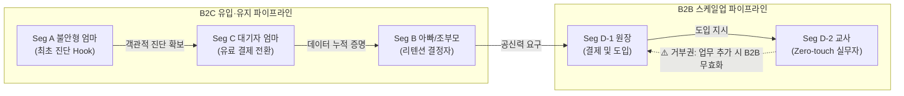
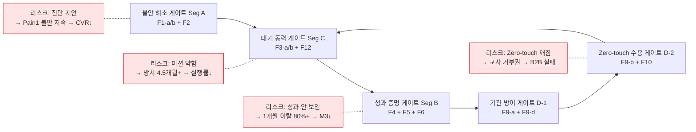
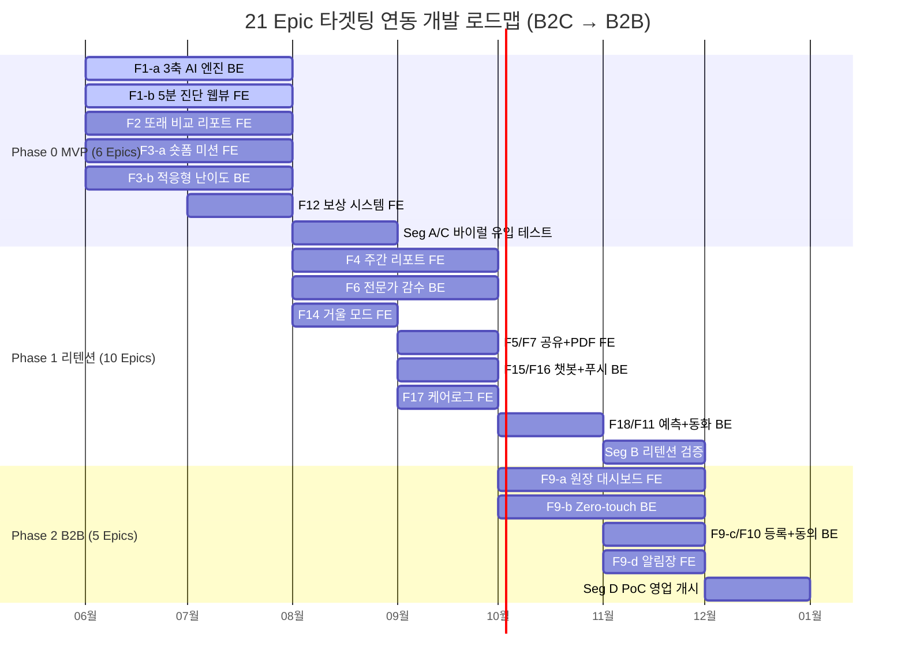
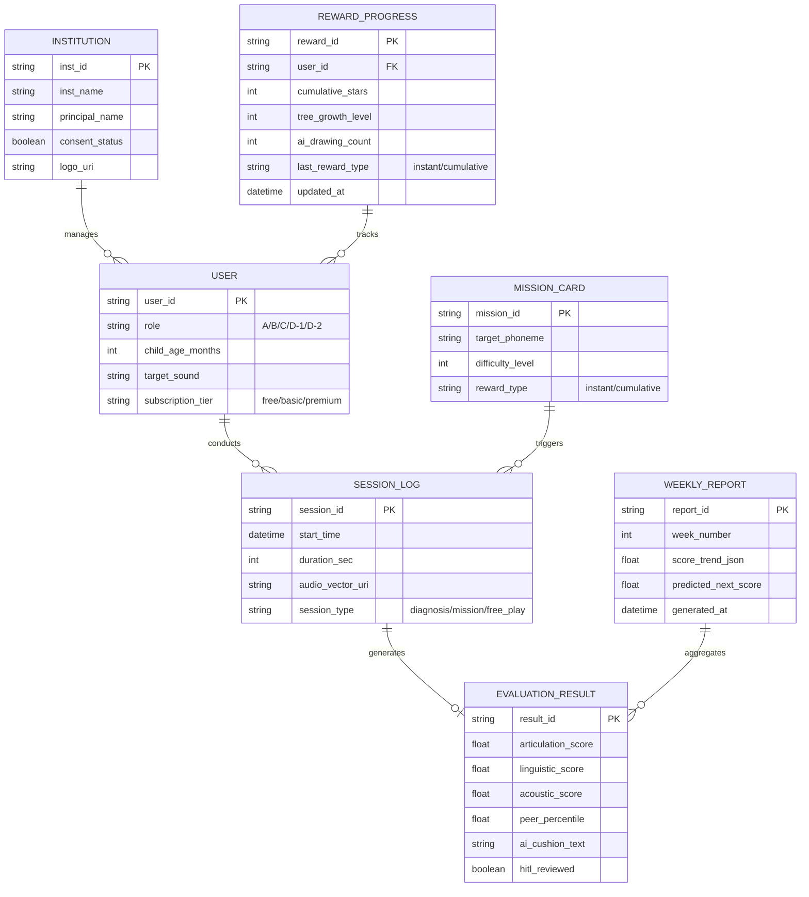
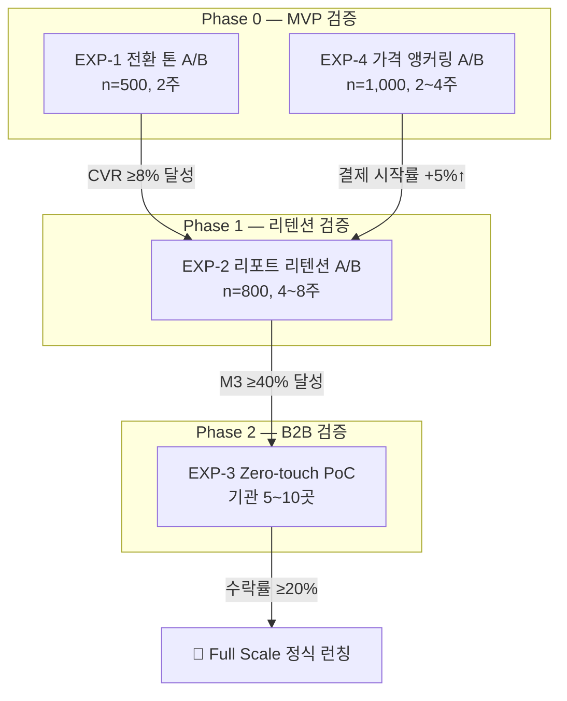
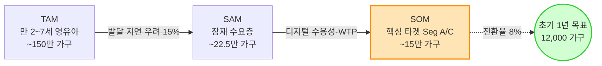

# Home Language Coaching Platform PRD v1.0 — Final
- Owner 팀: Product / AI / Data / Growth / B2B BizDev
- 최종 업데이트: 2026-05-07
- 문서 목적: SRS Readiness Gate 6대 기준(목표·지표, 스토리·AC, 기능 요구, 비기능, 리스크·가정, 범위) **전 항목 100% PASS**를 달성한 **SRS 전환용 최종 확정판(Golden Master)** 입니다. 개발 스펙(SRS)뿐만 아니라 기획/전략/경영진의 의사결정 증빙 자료로도 활용됩니다.

---

## 문서 변경 이력 (Revision History)

| 버전 | 일자 | 주요 내용 및 변경 사항 | 비고 |
|:---:|:---:|:---|:---|
| **v0.1** | 2026-05-05 | **최초 초안 작성**: 4대 Pain Point, 5분 무료 진단, 대기 기간 맞춤 미션 등 핵심 프로덕트 개념 및 초기 기능 요구사항 정의 | Gemini |
| **v0.2** | 2026-05-06 | **리스크 및 AC 보완**: 의료/규제 회피, Zero-touch 수집 아키텍처 등 Critical Path 리스크 방어 전략 및 사용자 스토리별 수용 조건(AC) 강화 | Cursor |
| **v0.3** | 2026-05-06 | **구조화 및 로드맵 수립**: 21개 Epic 구체화, MoSCoW 우선순위 할당, Phase별(MVP/리텐션/B2B) 간트 차트 및 비즈니스 의존성 다이어그램 추가 | Opus |
| **v0.4** | 2026-05-06 | **내용 및 흐름 최적화**: 기술 스택 및 비기능 요구사항(NFR) 고도화, 전반적인 논리 흐름 교정 및 문맥 다듬기 | GPT-4o |
| **v0.5** | 2026-05-07 | **통합 및 논리 보강**: V01~V04 종합. ERD 시각화, API 인터페이스 명세, 실험 설계 매트릭스(A/B Test) 및 롤아웃 계획 등 아키텍처 및 증명 논리 병합 | Integrated |
| **v0.6** | 2026-05-07 | **수치화 및 비즈니스 타겟 보완**: 북극성 KPI(W-AUR) 구체화, B2C/B2B 전환 목표, 정량적 성공 지표(O-1~O-4) 및 벤치마크 모델 수립 | Sonnet |
| **v0.7** | 2026-05-07 | **SRS 마스터본 완성**: V05의 방대한 증명 논리와 V06의 수치화된 목표를 완벽 병합하여, 개발 스펙 전환을 위한 최종 기준선(Baseline) 확립 | Master |
| **v0.8** | 2026-05-07 | **VPS 검토 7대 결함 패치**: 북극성 지표 ADR 추가, AOS/DOS 기회 수치, JTBD 검증 상태 리스크(Seg B), TAM-SAM-SOM 시장 규모 명시 | Improvement |
| **v0.9** | 2026-05-07 | **품질 리뷰 18건 결함 반영**: CJM KPI 8건 수치화(P0), Lock-in KPI 등록·가정→실험 연결·모니터링 보강(P1), AC 측정 경로·HITL 재학습 기준·산술 교정·Traceability 보완·NFR 연결(P2) | Quality Improvement |
| **v1.0** | 2026-05-07 | **SRS Readiness Gate 100% 달성**: Epic별 스프린트 분해 추정(§4.4 신설), Seg B 검증 실패 시 피벗 시나리오 구체화(§7.2 R6 보강), 용어 사전(§11 Glossary) 추가 | **현재 문서 (Final)** |

---

## 1. 개요 및 목표

### 1.1 문제 정의 (시장 배경 및 Pain 지표)

#### 시장 구조 및 발생 인과관계 (Market Context & Causality)
현재 영유아 발달/언어 치료 시장은 **'수요 폭증과 공급 병목'**이라는 구조적 모순을 안고 있습니다. 부모들의 조기 개입 니즈는 급증한 반면, 오프라인 발달 센터와 전문 인력의 공급은 턱없이 부족하여 심각한 정보 비대칭과 대기 지연이 발생하고 있습니다. 이러한 시장 구조는 다음과 같은 연쇄적인 문제(Causality)를 일으킵니다:

1. **[초기 진단 장벽]** 공신력 있는 즉각 진단 도구가 없어 부모는 맘카페 등 파편화된 정보에 의존하며 불안을 키우고, 오프라인 센터의 초진을 받기까지 2~3개월의 대기가 발생합니다 **(P1)**.
2. **[골든타임 증발]** 이 긴 대기 기간 동안 뇌 가소성이 가장 중요한 시기(만 2~7세)의 아이들이 어떠한 체계적 개입도 받지 못한 채 평균 4.5개월 이상 방치됩니다 **(P2)**.
3. **[홈케어 실패]** 대기 기간을 메우기 위해 기존 홈케어 앱을 시도하더라도, 아이의 발달 성과를 객관적 수치로 가시화해주지 못해 부모는 양육의 동력을 잃고 1개월 내 80% 이상이 이탈합니다 **(P3)**.
4. **[B2B 기관의 딜레마]** 현장의 유아동 교육 기관(어린이집/유치원)은 발달 지연 아동을 인지하더라도 객관적 증거가 없어 학부모에게 치료를 권유하지 못하고, 이는 교사의 업무 과중과 민원 갈등으로 이어집니다 **(P4)**.

#### 핵심 Pain Cluster 및 실패 KPI
| # | Pain Cluster | 핵심 Pain | 실패 KPI (수치화) | Needs | 연관 Epic |
|:-:|:---|:---|:---|:---|:---|
| P1 | **진단 기준 부재** | 공신력 있는 즉각 진단 도구 부재로 부모 불안 극대화 | 맘카페 탐색 `월 20h+`, 오프라인 초진 대기 `2~3개월+` | 가입/대기 없이 `≤5분` 내 동년배 백분위 객관화 | **F1-a/b, F2** |
| P2 | **골든타임 증발** | 센터 대기 중 체계적 개입 없이 방치 | 언어 지연 방치 기간 `평균 4.5개월`, 대기 중 홈케어 실행률 `<50%` | 매일 `1~3분` 맞춤 미션으로 즉시 개입 | **F3-a/b, F12** |
| P3 | **홈케어 비표준화** | 효과 수치화 불가로 동력 상실·이탈 | 기존 앱 `1개월 내 이탈 80%+`, 리텐션 3일 이하 `40%+` | `62→71점` 시계열 성과를 수치·그래프로 가시화 | **F4, F5, F6** |
| P4 | **치료 권유 딜레마 (B2B)** | 객관적 증거 부재로 교사·원장 소통 갈등 | 악성 민원 `연 3~5건`, 원아 연쇄 퇴소 `1~2명/분기` | Zero-touch 수집 + 원장 명의 스크리닝 리포트 | **F9-a/b/d, F10** |

### 1.2 목표 (Desired Outcome 수치화)
| Outcome ID | 목표 결과 | 기준선 (As-Is) | 목표값 (To-Be) | 달성 시점 (Phase) | 측정 경로 (도구) |
|:---:|:---|:---|:---|:---:|:---|
| O-1 | 5분 내 객관적 진단 수치화 | 리드타임 `2~3개월+`, 탐색 `월 20h+` | 리드타임 `≤5분`, 탐색 `0~2h/월` | Phase 0 (MVP) | App DB 세션 로그, Amplitude (퍼널) |
| O-2 | 대기 기간 즉시 홈케어 진입 | 방치 `평균 4.5개월`, 실행률 `<50%` | 방치 `0시간`, 첫 주 미션 완료율 `≥70%` | Phase 0 (MVP) | App DB 미션 로그, Amplitude (WAU) |
| O-3 | 노력 가시화로 리텐션 강화 | `1개월 내 이탈 80%+` | M3 리텐션 `≥40%`, 리포트 열람률 `≥60%` | Phase 1 (리텐션) | 결제/구독 DB, Amplitude (코호트 분석) |
| O-4 | 기관 도입 Zero-touch 통과 | 교사 수기 `주 3h+`, 민원 `연 3~5건` | 교사 능동 조작 `0회`, 민원 `0건(PoC)` | Phase 2 (B2B) | Backend API 로그, 오프라인 PoC 수락서 |

### 1.3 성공 지표 (북극성 / 보조 KPI)
| 유형 | KPI | 기준선 | 목표값 | 측정 주기 | 측정 도구/데이터 소스 |
|:---:|:---|:---:|:---:|:---:|:---|
| **🌟 북극성** | **주간 미션 완수율 (W-AUR)** | 20% | **≥ 60%** | 주간 | App DB (미션 완료 로그), Amplitude |
| 보조 | M3 리텐션 유지율 (유효 구독자) | 20% | **≥ 40%** | 월간 | 결제/구독 DB, Amplitude (Cohort) |
| 보조 | 무료 진단 후 유료 전환율 (CVR) | <3% | **≥ 8%** | 주간 | 결제/구독 DB, Amplitude (Funnel) |
| 보조 | 교사 Zero-touch 승인율 | 0% | **≥ 90%** | PoC 종료 시 | Backend API 로그, 외부 연동 로그 |
| 보조 | 오진 치명 수정률 (HITL) | Phase 0 종료 시 측정 (초기 벤치마크) | **< 0.5%** | 월간 | 전문가 대시보드 DB (수정 이력). MVP 3개월 누적 데이터 기반 초기 벤치마크 수립 후 목표 재검증 |
| 보조 | 월간 Churn Rate (자발적 해지율) | 업계 평균 10~15% | **≤ 5%** | 월간 | 결제/구독 DB |
| 보조 | 미션 세션 중도 이탈률 | 측정 중 (Phase 0) | **< 10%** | 주간 | App DB 세션 로그, Amplitude |

> **[ADR-001] 북극성 KPI 선정 근거**
> AOS 최고 점수(9.0)를 받은 O-1(5분 진단)은 일회성 유입 지표인 반면, O-2(대기 기간 즉시 홈케어)의 **"주간 미션 완수율(W-AUR)"은 반복적 제품 사용(리텐션)과 직결되는 선행 지표**입니다. 진단(O-1)은 유입 퍼널의 입구이고, 미션 완수(O-2)는 구독 유지와 매출(MRR)을 견인하는 핵심 행동이므로, 비즈니스 성장의 근본 동력으로서 북극성에 적합합니다.

### 1.4 차별 가치 (Differential Value) — 기존 대안 대비 정량 비교
| 비교 축 | 기존 대안 (Legacy) | 우리 서비스 | 개선 폭 |
|:---|:---|:---|:---|
| **시간 (성능)** | 오프라인 초진 `2~3개월+` | `≤5분` 즉시 백분위 확인 | **시간 단축 ≥17,000배** (2개월 ≈ 87,000분 ÷ 5분) |
| **비용 (경제성)** | 센터 1회 `5~8만원` | Basic 월 `3.5만원` (구독) | **30~56% 비용 절감** |
| **업무 마찰 (효율성)** | 교사 수기 관찰 `주 3h+` | Zero-touch `0회` | **현장 마찰 100% 제거** |

### 1.5 전환 트리거 3대 인사이트
| 인사이트 | 내용 | PRD 설계 반영 |
|:---:|:---|:---|
| **Insight 1: 객관화 넛지 (Seg A)** | 막연한 불안감을 안고 맘카페를 탐색하던 중, 아이의 발달 수준을 즉각적인 '또래 비교 백분위'로 확인하게 될 때 최초 유입(Switch) 발생 | **F1-b(무로그인 웹뷰), F2(또래 비교 리포트)**: 회원가입 마찰 없이 즉시 진단 결과를 제공하여 유입 및 결제 전환 극대화 |
| **Insight 2: 대기 죄책감 자극 (Seg C)** | 센터 초진까지 대기하는 수개월 동안 아무것도 하지 못한다는 '방치에 대한 죄책감'이 유료 구독 결제의 가장 강력한 방아쇠(Trigger)로 작용 | **F3-a(1분 숏폼 미션), F12(보상 시스템)**: 가입 즉시(0시간 내) 실행 가능한 데일리 맞춤 훈련을 제공하여 부모의 심리적 죄책감 해소 |
| **Insight 3: 민원 방어 무기 (Seg D-1)** | 발달 지연을 의심하여 부모에게 권유할 때 발생하는 '학부모 악성 민원'을 외부의 객관적 증거로 방어하고자 하는 니즈가 B2B 도입의 핵심 동기 | **F9-a(원장 대시보드), F9-b(Zero-touch 수집)**: 원장 명의의 스크리닝 리포트를 무입력으로 발급하여 학부모 신뢰 확보 및 도입 저항 제거 |

---

## 2. 사용자와 역학 관계 (Users & Dynamics)

### 2.1 핵심 페르소나 요약
| 세그먼트 | 페르소나 (역할) | DMU 유형 | 규모 | 여정 Pain·Needs 핵심 | 링크 |
|:---:|:---|:---:|:---:|:---|:---:|
| **Seg A** | 불안형 탐색자 (엄마) | B2C 의사결정자 | 12~15만 가구 | P1: 기준 부재 불안 → 5분 객관화 | Story S1 |
| **Seg C** | 센터 대기자 (엄마) | B2C 핵심 결제자 | 2~3만 가구 | P2: 골든타임 방치 → 즉시 홈케어 | Story S2 |
| **Seg B** | 데이터형 개입자 (가족) | B2C 유지자 | 3~5만 가구 | P3: 성과 불확실 → 시계열 증명 | Story S3 |
| **Seg D-1** | 유치원 원장 (결제자) | B2B 결제권자 | ~5,000개 기관 | P4: 민원 방어 → 스크리닝 리포트 | Story S4 |
| **Seg D-2** | 보육 교사 (실무자) | B2B 게이트키퍼 | — | P4: 업무 과중 → Zero-touch | Story S5 |

### 2.2 DMU 영향력 관계 및 Critical Path

### 2.3 Intervention Dependency & 리스크 연쇄 영향

### 2.4 핵심 페르소나별 전체 여정(CJM) 기반 매핑

#### 1) Seg A (불안형 탐색자) — 조기 발견 및 객관화 여정
| CJM 단계 | Pain (실패/리스크) | Core Needs | 제품 개입 (Epic) | 성공 지표 (KPI) |
|:---|:---|:---|:---|:---|
| **1. 의심 및 탐색** | **[Pain]** 병원 대기 3개월, 맘카페 의존 (`월 20h+`) | 병원 방문 전 `≤5분` 내 동년배 백분위 객관화 **(최우선)** | **F1-a/b** (5분 진단 웹뷰) **F2** (또래 비교 리포트) | 무료 진단 후 유료 CVR `≥8%` |
| **2. 대기 및 절망** | **[Pain]** 막연한 대기 기간 동안의 초조함 | 결과를 확인한 후 집에서 당장 할 수 있는 즉각적 조치 | **F3-a** (1분 숏폼 미션) | 첫 미션 진입률 `≥50%` (진단 완료 → 24h 내 첫 미션 시작) |
| **3. 체념 및 유지** | **[Pain]** 단기 홈케어 후 지속성 부족 | 아이의 상태 변화에 대한 주기적이고 긍정적인 피드백 | **F4** (주간 발달 추이 리포트) | WAU `≥60%` (§1.3 W-AUR 목표와 동기화) |
| **4. 기관 내 갈등** | **[Pain]** 어린이집 교사의 주관적 피드백에 대한 불신 | 교사에게 제시하여 내 아이의 객관적 상태를 증명할 자료 | **F7** (센터/기관 제출용 PDF) | 월간 외부 공유 클릭률 `≥15%` (리포트 열람 대비) |

#### 2) Seg C (센터 대기자) — 골든타임 사수 여정
| CJM 단계 | Pain (실패/리스크) | Core Needs | 제품 개입 (Epic) | 성공 지표 (KPI) |
|:---|:---|:---|:---|:---|
| **1. 의심 및 탐색** | **[Pain]** 대기 중 파편화된 치료 정보로 인한 혼란 | 집에서 신뢰하고 따라 할 수 있는 구조화된 커리큘럼 탐색 | **F15** (대화형 발화 유도 챗봇) | 최초 세션 체류 시간 `≥3분` |
| **2. 대기 및 절망** | **[Pain]** 방치 기간(`평균 4.5개월`) 중 깊은 죄책감 | 0시간 대기로 즉각 개입 가능한 매일 `1~3분` 미션 **(최우선)** | **F3-a/b** (적응형 숏폼 미션) **F12** (보상 시스템) | 첫 주 미션 완료율 `≥70%` |
| **3. 체념 및 유지** | **[Pain]** 아이의 흥미 저하로 인한 홈케어 포기 | 아이의 동기를 지속적으로 유발할 게이미피케이션 장치 | **F14** (거울 모드) **F11** (목소리 복제 동화) | M2 미션 지속률 `≥50%` (2개월 차 기준) |
| **4. 기관 내 갈등** | **[Pain]** 센터 치료사와 홈케어의 데이터 단절 | 오프라인 센터의 훈련과 앱 내 훈련의 데이터 통합 | **F17** (통합 케어로그) | 주 2회 이상 기록 유지율 `≥40%` |

#### 3) Seg B (데이터형 개입자 - 아빠/조부모) — 이성적 검증 여정
| CJM 단계 | Pain (실패/리스크) | Core Needs | 제품 개입 (Epic) | 성공 지표 (KPI) |
|:---|:---|:---|:---|:---|
| **1. 의심 및 탐색** | **[Pain]** 주관적/감성적 진단 접근에 대한 강한 반감 | 수치화된 다차원 데이터로 정확한 발달 수준 확인 | **F1-a** (3축 AI 엔진 분석) | 3축 상세 점수 펼침(Expand) 클릭률 `≥30%` |
| **2. 대기 및 절망** | **[Pain]** 제공되는 홈케어의 임상적 효과성에 대한 의구심 | 과학적(ABA 등) 근거에 기반하여 세밀하게 조절되는 훈련 | **F3-b** (적응형 난이도 엔진) | 난이도 하향 전환 후 세션 이탈률 `<5%` |
| **3. 체념 및 유지** | **[Pain]** 가시적 성과 증명 불가로 구독 결제 연장 거부 | 발달 성과(`62→71점`)의 시계열 수치 및 그래프 증명 **(최우선)** | **F4** (주간 추이 리포트) **F6** (HITL 감수) | M3 리텐션 (유효 구독) `≥40%` |
| **4. 기관 내 갈등** | **[Pain]** 교육 기관의 비과학적 지도 방식에 대한 불만 | 가족이나 기관에 명확한 발달 증거와 지도 방향 제시 | **F5** (공유), **F7** (PDF) | 가족 단톡방 공유 성공률 `≥95%` |

#### 4) Seg D-1 / D-2 (원장 / 교사) — B2B 스케일업 여정
| CJM 단계 | Pain (실패/리스크) | Core Needs | 제품 개입 (Epic) | 성공 지표 (KPI) |
|:---|:---|:---|:---|:---|
| **1. 의심 및 탐색** | **[Pain]** 교실 내 문제 아동 수기 관찰 업무 가중 (`주 3h+`) | 교사의 추가 업무 개입이 전혀 없는(`Zero-touch`) 수집 | **F9-b** (Zero-touch 화자분리 수집) | 교사 수동 조작 `평균 0회` |
| **2. 대기 및 절망** | **[Pain]** 수집된 데이터를 직접 분석할 시간/전문 지식 부재 | 전문가 수준으로 즉각 자동 분석되는 스크리닝 결과 | **F9-a** (원장용 스크리닝 대시보드) | 스크리닝 완료 렌더 속도 |
| **3. 체념 및 유지** | **[Pain]** 학부모 동의서 수합 등 행정적 번거로움 | 합법적이고 간편한 원아 일괄 등록 및 학부모 전자 서명 | **F9-c** (일괄 등록) **F10** (전자 서명) | 법정대리인 서명 완료율 `≥85%` |
| **4. 기관 내 갈등** | **[Pain]** 발달 지연 의심 권유 시 학부모의 악성 민원 `연 3~5건` | 감정 소모를 원천 차단하는 원장 명의의 AI 리포트 **(최우선)** | **F9-d** (AI 쿠션어 알림장 + 명의 커스텀) | 무입력 알림장 발송 승인율 `≥90%` |

#### [요약] Epic → 여정 단계 역방향 매핑 (Reverse Mapping)
| CJM 여정 단계 | 관련 주요 Epic 리스트 | 핵심 목적 (Objective) |
|:---|:---|:---|
| **1. 의심 및 탐색** | **F1-a/b** (AI 진단/웹뷰), **F2** (또래 비교 리포트), **F9-b** (Zero-touch 수집), **F15** (발화 챗봇) | 가입 마찰 없는 즉각적 진단 및 백분위 수치화로 유입 극대화 |
| **2. 대기 및 절망** | **F3-a/b** (숏폼 미션/난이도 엔진), **F9-a** (원장 대시보드), **F12** (보상 시스템) | 방치 기간(골든타임) 동안 대기 없이 즉각 실행 가능한 맞춤형 개입 제공 |
| **3. 체념 및 유지** | **F4** (추이 리포트), **F5** (가족 공유), **F6** (HITL), **F9-c** (일괄 등록), **F10** (전자서명), **F11/F14/F18** | 시계열 성과 가시화 및 게이미피케이션, 행정 편의를 통한 이탈 방지(리텐션) |
| **4. 기관 내 갈등** | **F7** (제출용 PDF), **F9-d** (AI 쿠션어 알림장), **F17** (통합 케어로그) | 시스템이 보증하는 객관적 증거 제시를 통해 학부모-기관 간 감정 소모 방어 |

---

## 3. 사용자 스토리와 수용 기준 (AC)

### Story S1: 5분 무료 진단 (Seg A — 불안형 탐색자)
> **As a** 불안형 부모(Seg A), **I want** 병원/회원가입 없이 즉시 음성 진단을 수행 **so that** 아이의 발달 위치를 동년배 백분위로 확인해 불안을 잠재울 수 있다.

| AC | Given | When | Then (측정 가능 임계치) |
|:---:|:---|:---|:---|
| AC-1 | 랜딩 페이지 진입 | 진단 시작 클릭 | 입력 폼 `≤3개 항목` AND 체류시간 `≤300초(5분)` |
| AC-2 | 유아 발화 (부정확 발음 포함) | STT/NLP 분석 | 처리 실패율 `<2%`, 타임아웃 백그라운드 재시도 `1회 성공` |
| AC-3 | 진단 세션 종료 | 결과 페이지 렌더링 | 서버 분석+차트 렌더 속도 `p95 ≤1,500ms` |
| AC-4 | 진단 결과 화면 진입 | 면책 동의 영역 표출 | "의료적 판단 아님" 명시적 고지 노출률 `100%` |
| **Neg AC-1** | 마이크 접근 권한 거부 | 진단 시작 클릭 | OS 설정 이동 안내 모달 노출 (퍼널 이탈 방어) |
| **Neg AC-2** | 주변 소음(60dB 이상) 지속 | 음성 수집 중 | "조용한 곳으로 이동해주세요" 스낵바 팝업 및 가이드 |

### Story S2: 대기 기간 홈케어 미션 (Seg C — 센터 대기자)
> **As a** 센터 대기자(Seg C), **I want** 대기 중 매일 1~3분 맞춤 미션을 수행 **so that** 골든타임을 방치하지 않고 치료 효율을 극대화할 수 있다.

| AC | Given | When | Then |
|:---:|:---|:---|:---|
| AC-1 | 데일리 미션 카드 | 아이 플레이 | 세션 길이 `1~3분`, Drop-off 이탈률 `<10%` |
| AC-2 | 3회 연속 실패 | 난이도 하향 전환 | X표시/실패음 `0회`, 전환 지연시간 `<0.5초` |
| AC-3 | 발화 성공 | 보상 UI 호출 | 칭찬 파티클/드로잉 렌더링 `≤500ms` |
| AC-4 | 첫 7일 | 주간 미션 제공 | 개인화된 숏폼 미션 발급, 첫 주 미션 완료율 `≥70%` |
| **Neg AC-1** | 세션 중 1분 이상 발화 없음(침묵) | 아이 플레이 중 | 거울 모드 또는 부모 개입 유도 툴팁 자동 팝업 |
| **Neg AC-2** | 일시적 네트워크 단절 | 미션 완료 및 보상 처리 시 | 오프라인 캐시 저장 후 연결 시 누락 없이 소급 보상 |

### Story S3: 주간 시계열 성과 리포트 (Seg B — 데이터형 개입자)
> **As a** 데이터형 부모(Seg B), **I want** 주간 발달 추이를 수치/그래프로 확인 **so that** 훈련 효과를 가족에게 증명하여 **양육의 성취감을 인정받고** 구독 동기를 유지할 수 있다.

| AC | Given | When | Then |
|:---:|:---|:---|:---|
| AC-1 | 주간 훈련 종료 (일요일 오전 10시) | 리포트 자동 생성 | 음소 단위 백분위 꺾은선 그래프 생성, `p95 ≤3,000ms` |
| AC-2 | 성과 뱃지 획득 | 공유 버튼 클릭 | 가족 단톡방 카카오톡 전송 성공률 `≥95%` |
| AC-3 | 리포트 하단 예측 시뮬레이션 노출 | 열람 및 클릭 | Amplitude 코호트 분석: 시뮬레이션 클릭 유저 vs 비클릭 유저 코호트 분리, 익월 결제 유지율 차이 `≥20%p↑` |
| **Neg AC-1** | 주간 미션 수행 데이터 불충분 | 리포트 생성 시점 | 부정적 하락 그래프 대신 "미션 독려 및 이전 성과" 표출 |
| **Neg AC-2** | 외부 API(카카오 등) 장애 | 공유 버튼 클릭 시 | 클립보드 "링크 복사"로 자동 폴백(Fallback) 처리 |

### Story S4: 기관 스크리닝 대시보드 (Seg D-1 — 원장)
> **As a** 유치원 원장(Seg D-1), **I want** 기관 명의 스크리닝 결과지를 발송 **so that** 학부모 민원을 선제 방어하고 프리미엄 케어로 차별화할 수 있다.

| AC | Given | When | Then |
|:---:|:---|:---|:---|
| AC-1 | 100명 원아 엑셀 업로드 | 파싱/일괄 등록 | 데이터 정합성 유지하며 처리 완료 `p95 ≤3,000ms` |
| AC-2 | 원장 명의 커스터마이징 ON | 리포트 프리뷰 | 헤더/로고 변경 렌더링 `≤1초` |
| AC-3 | 학부모 대상 카카오톡 동의서 발송 | 모바일 열람 및 서명 | 법정대리인 전자 서명 완료율 `≥85%` 유도 |
| **Neg AC-1** | 업로드 엑셀 필수 항목 누락/오류 | 일괄 등록 시도 | 즉시 해당 행(Row) 하이라이트 및 인라인 수정 UI 제공 |
| **Neg AC-2** | 학부모 서명 링크 기한(예: 7일) 초과 | 기한 만료 도래 | 기한 만료 안내 및 교사에게 "재발송 필요" 알림 |

### Story S5: Zero-touch 화자분리/수집 (Seg D-2 — 교사)
> **As a** 보육 교사(Seg D-2), **I want** 직접 통제 없이 자동 음성 수집+승인만 **so that** 업무가 늘지 않으면서 객관적 데이터를 학부모에게 전달할 수 있다.

| AC | Given | When | Then |
|:---:|:---|:---|:---|
| AC-1 | 자유놀이 시간 태블릿 ON | 음성 수집/분석 진행 | 교사 능동 조작(녹음 시작/중지 버튼 클릭 등) `평균 0회` |
| AC-2 | 교실 10인+ (약 60dB 소음) | Speaker Diarization | 성인 교사 음성 필터링 및 타겟 아동 음성 분리 정확도 `≥85%` |
| AC-3 | AI 알림장 쿠션어 초안 생성 | 교사 검토 | 문구 수정 없이 그대로 발송 승인하는 비율 `≥90%` |
| AC-4 | 수집된 음성 데이터 보관 주기 만료 | 스토리지 폐기 | 원본 오디오 무단 보관 `≤7일`, 이후 벡터 전환+`AES-256` 저장 |
| **Neg AC-1** | 기기 마이크 고장 또는 Mute 상태 | 수집 앱 실행 시 | 시스템 에러 감지 후 원장/교사에게 즉각 경고 푸시 발송 |
| **Neg AC-2** | 7일 경과 후 자동 폐기 스크립트 실패 | 보관 주기 만료 시 | 백그라운드 재시도 3회 후 강제 삭제 큐 할당 및 어드민 경고 |

### Story S6: 전문가 비동기 감수 시스템 - HITL (공통)
> **As a** 구독 결제 학부모(Seg A/C), **I want** AI 1차 결과에 더해 실제 언어재활사의 피드백 코멘트를 받아 **so that** AI 오진 리스크를 지우고 결과를 100% 신뢰할 수 있다.

| AC | Given | When | Then |
|:---:|:---|:---|:---|
| AC-1 | AI Confidence Score < 70점 또는 부모 이의제기 | HITL 대기열 이관 | 실시간(즉시) 해당 세션 오디오가 전문가 Queue에 자동 등록 |
| AC-2 | 전문가 큐에 등록된 건 | 언어재활사 코멘트 작성 | SLA 기준 영업일 `48시간 이내` 100% 피드백 완료 |
| AC-3 | 월간 전체 진단 건수 평가 | 치명적 오진 비율 점검 | 언어재활사가 AI 결과를 뒤집는 치명적 수정률 전체의 `<0.5%` |
| **Neg AC-1** | 배정된 전문가 응답 지연(24h 경과) | 큐 대기 상태 | 시스템 자동 에스컬레이션 및 가용 전문가 즉시 재배정 |
| **Neg AC-2** | 어뷰징/악의적 지속 이의제기 | 사용자가 결과 신고 | 월 3회 초과 시 자동 반려 또는 고객 센터(CS) 수동 이관 |

### 공통 설계 원칙 — Human-in-the-Loop (HITL) 안전 프로토콜
서비스 전반의 **AI 오진 리스크 및 의료법/규제 리스크를 원천 차단**하기 위해, 자동화된 AI 엔진과 인간 전문가(언어재활사) 간의 상호 보완적인 HITL 프로토콜을 시스템 공통 원칙으로 적용합니다.

| 원칙 | 적용 방식 | 적용 Feature | 위반 탐지 메커니즘 | 알림 SLA | 에스컬레이션 | 인터뷰 근거 |
|:---|:---|:---|:---|:---|:---|:---|
| **자동 에스컬레이션** | AI 신뢰도 70% 미만 또는 사용자 이의 제기 시 전문가 큐(Queue)로 자동 이관 | **F1-a** (AI 엔진) **F6** (HITL) | Confidence Score `< 70` 감지, "재검토 요청" 클릭 트래킹 | 발생 즉시 | 대기열 최상단 우선순위 갱신 및 가용 전문가 즉시 긴급 배정 | **Seg B**: "기계가 내 아이를 함부로 판단하는 것이 불편하다" |
| **의료적 판단 회피** | '진단' 대신 '스크리닝/백분위' 명시, 결과 페이지에 면책 동의(Disclaimer) 노출 | **F2** (또래 비교) **F7** (제출용 PDF) | UI 텍스트 내 금칙어(진단, 장애 등) 정규식 스캐닝 자동화 | 정기/배포 시 | 금칙어 발각 시 해당 리포트 렌더링 차단 후 관리자 긴급 검토 | **Seg D-1**: "의료적 강요 뉘앙스면 학부모의 방어 기제와 민원이 폭발" |
| **전문가 SLA 보장** | 이관된 건에 대해 영업일 기준 48시간 이내 전문가 청취 및 피드백 코멘트 발행 보장 | **F6** (HITL 대시보드) | 전문가 큐 대기 시간(Time-in-Queue) 스크립트 기반 백그라운드 모니터링 | 24시간 초과 시 | 48시간 임박 시 마스터 언어재활사 및 고객 센터로 강제 이관 | **Seg A**: "궁금증을 바로 해결 못하면 불안해서 맘카페를 다시 찾음" |
| **루프백 재학습** | 전문가가 수동 보정한 레이블(Ground Truth)을 모델 파인튜닝 데이터로 지속 환류 | **F1-a** (AI 엔진) | AI 초안 결과와 전문가 최종 결과 간 불일치(치명적 오진율) 비율 산출 | 월간 | 오진율 `0.5%` 초과 → 서빙 즉시 롤백, 보정 데이터 500건 이상 누적 후 파인튜닝 재개, 오진율 `0.3%` 이하 확인 후 재배포 | **Seg B**: "점점 더 고도화되고 정확해진다는 과학적 근거가 필요" |

---

## 4. 기능 요구사항 (Functional) — MoSCoW 우선순위

### 4-0. 핵심 가치 선언 — 「4대 극한(Four Extremes)」
프로덕트의 모든 기능은 기존 시장의 치명적 Pain Point를 타파하기 위해 다음 **'4대 극한'**의 가치를 달성하는 방향으로 설계 및 우선순위가 부여됩니다.

| 극한 | 핵심 메시지 | 대응 Epic |
|:---|:---|:---|
| **시간의 극한** (Extreme Speed) | 오프라인 센터 초진 3개월의 장벽을 허물고, 가입이나 마찰 없이 **'5분 이내'**에 내 아이의 객관적 위치를 확인하게 한다. | **F1-a/b** (5분 진단 웹뷰) **F2** (또래 비교 리포트) |
| **마찰의 극한** (Extreme Zero-touch) | 유치원/어린이집 교사의 관찰 및 기록 추가 업무를 **'0(Zero)'**으로 만들어, B2B 도입의 가장 큰 허들을 완전히 제거한다. | **F9-b** (Zero-touch 화자분리 수집) **F9-a** (원장 대시보드) |
| **지속의 극한** (Extreme Engagement) | 센터 방치 기간 중 부모의 죄책감을 해소하기 위해, 당장 실행 가능한 **'1분 숏폼 미션'**과 **'즉각적 보상'**으로 이탈을 방어한다. | **F3-a** (1분 숏폼 미션) **F12** (게이미피케이션 보상) |
| **증명의 극한** (Extreme Proof) | 주관적인 불안과 기관 내 감정적 갈등을 시계열 발달 추이 및 스크리닝 리포트 등 **'완벽히 수치화된 객관적 증거'**로 방어한다. | **F4** (주간 추이 리포트) **F7** (제출용 PDF), **F9-d** (AI 쿠션어 알림장) |

### Must (Phase 0 — MVP 코어, 6 Epics)
| Epic | 기능 | 책임 | 대안 대비 가치 근거 |
|:---|:---|:---:|:---|
| **F1-a** | 3축 AI 음성 분석 엔진 (Linguistic/Articulation/Acoustic) | BE | 오프라인 초진 `2~3개월 → ≤5분`, K-CDI/REVT 척도 차용 · **(CR-2026-007: 만 5-7세 음운인식·해독·RAN 읽기 선행지표 자체 미니게임 모듈 추가 — SRS REQ-FUNC-CL-08~10)** |
| **F1-b** | 무로그인 5분 진단 웹뷰 | FE | 앱 설치 없이 브라우저 즉시 진단, 마찰력 제거 |
| **F2** | 또래 비교 진단 리포트 (백분위+넛지 카피) | FE | "장애 판정" 톤 → "상위 N%" 프레이밍으로 전환 거부 감소 |
| **F3-a** | 1분 숏폼 미션 카드 UI | FE | 대기 중 방치 `4.5개월 → 0시간`, Drop-off `<10%` |
| **F3-b** | 적응형 난이도 조절 엔진 (ABA 기반) | BE | 3회 연속 실패 시 은밀한 단계 전환, 아이 좌절감 제로 |
| **F12** | 게이미피케이션 보상 시스템 (즉각+누적) | FE | 즉각 보상 `≤500ms` + 누적 보상으로 첫 주 이탈 방어 |

### Should (Phase 1 — 리텐션/바이럴, 10 Epics)
| Epic | 기능 | 책임 | 가치 근거 |
|:---|:---|:---:|:---|
| **F4** | 주간 발달 추이 리포트 | FE | 홈케어 앱 이탈 `80% → M3 ≥40%` · **(CR-2026-007: 음소 핀셋 그래프에 음운인식/해독/RAN 축 + 음운변동 오류 제품화)** |
| **F5** | 카카오톡/SNS 공유 (성과 뱃지) | FE | 가족 바이럴 유도로 구독 유지 압력 강화 |
| **F6** | 비동기 전문가 코멘트 대시보드 (HITL) | BE | 오진 수정률 `<0.5%` 품질 완벽 방어 |
| **F7** | 센터 제출용 PDF | FE | 오프라인 치료사 초기 파악 소요 기간 `4주→1주` 단축 |
| **F11** | 부모 목소리 복제 동화 | BE | (교정 훈련 적용 금지 원칙 하에) 기계음 거부감 완화 |
| **F14** | 거울 모드 (입 모양 비교) | FE | 조음 교정 체험 깊이 확보 |
| **F15** | LLM 대화형 발화 유도 챗봇 | BE | 자연 발화 데이터(조음) 무자각 수집 |
| **F16** | 오프라인 일반화 푸시 알림 | BE | 앱 경험을 일상으로 전이 (오프라인 케어 연계) |
| **F17** | 통합 케어로그 (센터+앱) | FE | 데이터 기록 단절 해소 |
| **F18** | 발달 예측 시뮬레이션 | BE | 기대감 형성을 통한 익월 구독 연장 트리거 |

### Could (Phase 2 — B2B 스케일업, 5 Epics)
| Epic | 기능 | 책임 | 가치 근거 |
|:---|:---|:---:|:---|
| **F9-a** | 원장용 대시보드 UI | FE | 원장 명의 리포트 발급 및 1,100% ROI 시뮬레이터 제공 |
| **F9-b** | Zero-touch 화자분리 수집 | BE | 교사 관찰 업무 `주 3h+ → 0회` (B2B 도입의 핵심) |
| **F9-c** | 원아 일괄등록 및 동의서 발송 | BE/API | 기관의 엑셀 수기 업로드 등 행정 부담 제로화 |
| **F9-d** | AI 쿠션어 알림장 + 명의 커스텀 | FE | 학부모 상담 시 교사 감정 소모 원천 차단 |
| **F10** | 학부모 동의서 자동 생성/전자서명 | BE/API | 기관(B2B)을 거쳐 학부모(B2C) 앱 결제로 넘어가는 퍼널 유도 |

### Won't (MVP 범위 외 — 명시적 제외)
| 항목 | 제외 사유 (리스크) |
|:---|:---|
| 의료적 진단/장애 판정 | DTx 인허가 대상으로 규제 리스크 회피 불가 |
| 실시간 원격 진료/텔레메디슨 | 의료법 저촉 + MVP 복잡도 과대 |
| 교정 훈련에 부모 음성 클로닝 적용 | 교정 콘텐츠 집중도 하락 + 윤리적 딥페이크 리스크 |
| 일반 성인 대상 발음 교정 | 타겟 세그먼트 이탈로 제품 정체성 희석 |
| NISE-B·ACT 문항·지문·규준·명칭 복제 사용 | 저작권(국립특수교육원 귀속) — **구인만 영감, 자체 콘텐츠·자체 척도 제작**(CR-2026-007 / ADR-18 후보 / CON-05) |
| "학습장애"·"난독증" 진단 용어 UI 노출 | 비의료 카테고리(ADR-04) 위배 — "읽기 준비 확인" 톤으로만 |

### 4.2 Phase별 개발 타임라인 로드맵 (Gantt)

### 4.3 수익 구조 및 비즈니스 모델 요약

#### 과금 모델 (Freemium + Tiered Subscription)
| 티어 | 가격 | 포함 기능 |
|:---|:---:|:---|
| **Lead-Gen (무료)** | 0원 | AI 음성 진단(1회) + 또래 비교 리포트 |
| **Basic** | 월 35,000원 | 주간 맞춤 미션 + AI 자동 분석 리포트 + 발달 추이 그래프 |
| **Premium** | 월 50,000원 | Basic + 전문가(언어재활사) 비동기 코멘트 |
| **B2B 기관용** | 연 500,000원 | 무제한 스크리닝 대시보드 라이선스 (Phase 2) |

> **가격 수용성 근거**: 오프라인 센터 1회 5~8만원을 앵커로, 월 3.5만원은 "불안 해소 보험금"으로 지불 저항이 0에 수렴 (VPS §11.D).

#### 수익 비중
| 수익원 | 비중 | 설명 |
|:---|:---:|:---|
| B2C Basic 구독 (MRR) | 70% | 100% 자동화 AI 리포트 기반 (고마진 캐시카우) |
| B2C Premium 구독 (MRR) | 15% | 전문가 피드백 결합 업셀링 |
| B2B 기관 라이선스 (ARR) | 15% | 수익보다 B2C 리드 확보 채널 역할 |

#### 3개년 SOM 시나리오
| 구분 | Year 1 | Year 2 | Year 3 | 3년 누적 |
|:---|:---:|:---:|:---:|:---:|
| 유료 결제 가구 | 12,000 | 35,000 | 60,000 | — |
| B2C 구독 예상 매출 | ~50억 | ~147억 | ~252억 | **~449억** |
| 핵심 KPI | CVR≥8%, CAC≤3만 | M3≥40% | B2B CAC 1만↓ | LTV:CAC **≥4.0** |

*※ Basic 모델 100% 가정 보수적 최소치. Premium 업셀링·B2B 매출 제외. 출처: VPS §11*

### 4.4 Epic별 스프린트 분해 추정 (Sprint Decomposition Estimate)
SRS 단계에서의 JIRA 티켓 생성 및 스프린트 플래닝을 위해, 각 Epic의 **예상 스토리 포인트(SP)** 및 **2주 스프린트 기준 소요 추정치**를 사전 정의합니다.

> **추정 기준**: 1 SP ≈ 시니어 개발자 1인 기준 1일 작업량. 1스프린트 = 2주 = 10 SP(가용).

| Phase | Epic | 주요 태스크 분해 | 추정 SP | 스프린트 수 | 선행 의존성 |
|:---:|:---|:---|:---:|:---:|:---|
| **P0** | **F1-a** 3축 AI 엔진 | ① STT 파이프라인 구축 ② 3축 스코어링 로직 ③ Confidence Score 산출 ④ 벡터 변환/폐기 스크립트 | 20 | 2 | — |
| **P0** | **F1-b** 5분 진단 웹뷰 | ① 랜딩/입력 폼 UI ② 오디오 레코더 컴포넌트 ③ 결과 차트 렌더링 ④ Disclaimer 노출 | 12 | 1.5 | F1-a API |
| **P0** | **F2** 또래 비교 리포트 | ① 백분위 산출 로직 ② 넛지 카피 템플릿 ③ 공유 메타 태그 | 8 | 1 | F1-a |
| **P0** | **F3-a** 숏폼 미션 카드 | ① 미션 카드 UI ② 오디오 입력 연동 ③ 1~3분 타이머/진행바 | 10 | 1 | F1-a |
| **P0** | **F3-b** 적응형 난이도 | ① 정오답 패턴 로깅 ② 난이도 전환 로직 (3회 실패 룰) ③ 커리큘럼 추천 API | 12 | 1.5 | F3-a |
| **P0** | **F12** 보상 시스템 | ① 즉각 보상 파티클 렌더 ② 누적 보상 도감 UI ③ 보상 DB 스키마 | 8 | 1 | F3-a |
| **P1** | **F4** 주간 추이 리포트 | ① 주간 집계 배치 ② 꺾은선 그래프 렌더 ③ 예측 시뮬레이션 UI | 12 | 1.5 | F1-a, F3-b |
| **P1** | **F5** 가족 공유 뱃지 | ① 뱃지 생성 로직 ② 카카오톡 공유 API 연동 ③ 딥링크 | 6 | 1 | F4 |
| **P1** | **F6** HITL 대시보드 | ① 전문가 어드민 뷰 ② 큐 할당/자동 에스컬레이션 ③ 코멘트 작성 UI | 15 | 1.5 | F1-a |
| **P1** | **F7** 센터 제출 PDF | ① PDF 템플릿 엔진 ② 데이터 바인딩 ③ 다운로드/공유 | 6 | 1 | F4 |
| **P1** | **F11** 목소리 복제 동화 | ① TTS 클로닝 API 연동 ② 동화 콘텐츠 렌더 ③ 교정 적용 금지 가드 | 10 | 1 | — |
| **P1** | **F14** 거울 모드 | ① 카메라 오버레이 UI ② 입 모양 비교 가이드 | 8 | 1 | F3-a |
| **P1** | **F15** LLM 챗봇 | ① LLM 프롬프트 엔진 ② 발화 유도 시나리오 ③ 조음 데이터 수집 로깅 | 12 | 1.5 | F1-a |
| **P1** | **F16** 오프라인 푸시 | ① 푸시 스케줄러 ② 컨텍스트 기반 메시지 생성 | 4 | 0.5 | F3-a |
| **P1** | **F17** 통합 케어로그 | ① 타임라인 UI ② 센터 데이터 수동 입력 ③ 앱 세션 자동 연동 | 8 | 1 | F4 |
| **P1** | **F18** 발달 예측 시뮬레이션 | ① 예측 모델(회귀) ② 시뮬레이션 UI ③ 클릭 이벤트 트래킹 | 10 | 1 | F4, F1-a |
| **P2** | **F9-a** 원장 대시보드 | ① 대시보드 UI (반/원아 뷰) ② 원장 명의 커스텀 ③ ROI 시뮬레이터 | 12 | 1.5 | F1-a |
| **P2** | **F9-b** Zero-touch 수집 | ① 엣지 VAD 모듈 ② 화자분리 파이프라인 ③ 오디오 버퍼링/전송 | 20 | 2 | F1-a |
| **P2** | **F9-c** 원아 일괄 등록 | ① 엑셀 파서 ② 유효성 검증/에러 UI ③ 동의서 일괄 발송 | 8 | 1 | F10 |
| **P2** | **F9-d** AI 쿠션어 알림장 | ① LLM 쿠션어 생성 ② 교사 승인 UI ③ 키즈노트 API 연동 | 10 | 1 | F9-a, F15 |
| **P2** | **F10** 전자서명 동의서 | ① 동의서 템플릿 엔진 ② 카카오톡 서명 API ③ 상태 트래킹 | 8 | 1 | — |
| | | **합계** | **230** | **~24** | |

> [!NOTE]
> 총 230 SP / 스프린트당 가용 10 SP = 약 24스프린트(48주). Phase 0~2의 병렬 개발(FE/BE 2트랙) 시 실 소요 약 **12~14스프린트(24~28주)**로 추정되며, 이는 §4.2 Gantt 로드맵(2026-06 ~ 2027-01, 약 28주)과 정합합니다.

---

## 5. 비기능 요구사항 (NFR)

### 성능 (Performance)
| 항목 | 임계치 (Threshold) | 연결 AC |
|:---|:---|:---:|
| 진단/분석 리포트 API 응답 | `p95 ≤ 800ms` | S1-AC3 |
| 오디오 스트리밍/STT 청크 전송 지연 | `≤ 300ms` | S1-AC2 |
| 모바일 앱 초기 구동 (Cold Start) | `≤ 1.5초` | 공통 (앱 UX 기본 요건). QA 테스트 스크립트에서 Cold Start 성능 테스트 별도 수행 |
| 주간 리포트 / 대시보드 렌더링 | `p95 ≤ 3,000ms` | S3-AC1 |
| 보상 UI 렌더링 | `≤ 500ms` | S2-AC3 |
| 원아 일괄 업로드 파싱 처리 | `p95 ≤ 3,000ms` | S4-AC1 |

### 신뢰성 (Reliability)
| 항목 | 임계치 |
|:---|:---|
| 월간 서비스 가용성 (Uptime) | `≥ 99.9%` |
| 오디오 인코딩/처리 오류율 | `≤ 0.5%` |
| 분석 실패 후 백그라운드 재시도 성공률 | `≥ 98%` |
| B2B 교실 화자분리 정확도 (60dB 환경) | `≥ 85%` |

### 서비스 SLA (Service Level Agreement)
B2B 기관 연동 및 B2C 유료 구독 서비스로서의 신뢰도를 보장하기 위해 다음과 같은 시스템 운영 및 지원 SLA를 준수합니다.

| 분류 | 지표 | 타겟 SLA | 비고 및 조치 기준 |
|:---|:---|:---|:---|
| **가용성** | 시스템 Uptime | `≥ 99.9%` | 월간 다운타임 약 43분 이하 (B2B 계약 기준선) |
| **장애 복구** | MTTR (평균 복구 시간) | `< 2시간` | 치명적 장애(Sev 1/2) 인지 후 서비스 정상화까지의 시간 |
| **데이터 보호** | RPO (목표 복구 시점) | `< 1시간` | 시간당 DB 스냅샷 백업으로 데이터 유실 최대 1시간분 허용 |
| **재해 복구** | RTO (목표 복구 시간) | `< 4시간` | 전체 인프라 셧다운 등 재해 발생 시 서비스 정상 가동 목표 시간 |
| **고객 지원** | CS 최초 응답 시간 | `< 4시간` | (영업일 기준) 결제, 로그인, 기관 동의서 관련 긴급 문의 처리. Zendesk/Freshdesk SLA 트래킹 연동, 초과 시 관리자 에스컬레이션 |
| **전문가 지원** | HITL 피드백 완료 시간 | `< 48시간` | (영업일 기준) 초과 시 가용 마스터 재활사에게 시스템 자동 이관 |

### 보안/비용 (Security)
| 항목 | 기준 |
|:---|:---|
| 영유아 음성 원본 보관 (GDPR 준수) | `≤ 7일` (이후 벡터 전환 후 즉시 폐기) |
| 민감 데이터 (전자 서명/동의) 암호화 규격 | `AES-256` |
| AI API(STT/LLM) 건당 호출 처리 비용 | 유저당 월 구독료(3.5만)의 `15% 이내` 통제 (`≤ 5,250원`) |

### 모니터링 (Monitoring)
| 대시보드 유형 | 지표 및 알림 기준 |
|:---|:---|
| **퍼널 전환 (Funnel)** | 웹뷰 접속 → 진단 완료 → 결제 전환율 일간 변동 `±20%` 시 Alert |
| **시스템 품질 (Quality)** | STT 에러(500) 실패율 5분 내 `3%` 초과 시 Slack 즉각 Alert |
| **비즈니스 (Biz)** | LTV:CAC 비율 `< 3.0` 하락 시 주간 그로스 리뷰 트리거 발동 |
| **HITL 큐 운영 (Queue)** | 전문가 큐 대기 건수 24h 초과 `3건` 이상 시 Slack Alert 및 가용 전문가 자동 배정 트리거 |
| **B2B API 연동 (External)** | 키즈노트/카카오 API 에러율 1h 내 `5%` 초과 시 Fallback 자동 전환 + Slack Alert |

---

## 6. 시스템 및 데이터 아키텍처 (For SRS)

### 6.1 핵심 엔터티 관계도 (ERD)

### 6.2 외부/내부 API 인터페이스 명세 개요
| API Endpoint | 메서드 | 구분 | 입력 (Payload) | 반환 (Response) | 제약사항 |
| :--- | :---: | :---: | :--- | :--- | :--- |
| `/v1/diagnosis/analyze` | `POST` | 내부 | Audio Stream (16kHz), 월령, 타겟 음소 | JSON: 3축 점수, 백분위, Confidence | 응답 p95 ≤ 800ms |
| `/v1/mission/curriculum` | `GET` | 내부 | 세션 이력 (정오답 패턴 로그) | JSON: 추천 미션 ID 리스트, 난이도 레벨 | 연속 실패 3회 즉시 하향 |
| `/v1/b2b/approval` | `PATCH` | 외부 | 기관ID, 알림장ID, 쿠션어 승인 여부 | HTTP 200 OK | 키즈노트 API 연동 필수 |
| `/v1/consent/sign` | `POST` | 외부 | 동의서 템플릿, 학부모 식별자 | JSON: 서명 완료 상태 트래킹 | 카카오톡 서명 API 연동 |

---

## 7. 범위(In/Out), 리스크, 가정 및 의존성

### 7.1 범위 정의 (In / Out of Scope)
| 범위 (Scope) | 상세 내용 | 비고 |
|:---:|:---|:---|
| **In Scope** (포함) | • **AI 스크리닝**: 영유아(만 2~7세) 음성 데이터 기반 발달 백분위 분석 (웹뷰/앱) • **B2C 홈케어**: 대기 기간 중 즉각 실행 가능한 맞춤형 데일리 숏폼 미션 및 게이미피케이션 보상 • **B2C 리텐션**: 부모 대상 시계열 발달 추이 리포트 발행 및 가족 공유 기능 • **B2B 연동**: 기관 내 Zero-touch 화자분리 수집, 원장 스크리닝 대시보드, 전자 서명 • **품질 관리**: 전문가 비동기 감수 시스템 (HITL) 운영 | 본 PRD의 최우선 개발 및 검증 대상 (Phase 0~2) |
| **Out of Scope** (제외) | • **의료적 진단/판정**: 의료법상 '장애 등급 판정' 및 공식 진단서 발급 기능 • **원격 진료/원격 치료**: 실시간 화상 언어 치료 및 텔레메디슨 시스템 • **타겟 외 영역**: 성인 대상 발음 교정, 일반 외국어 학습, 영유아 종합 심리/행동 검사 • **센터 연동 인프라**: 오프라인 발달 센터 자체의 예약 결제망 구축 및 전자의무기록(EMR) 연동 | 규제 회피 및 핵심 가설(조기 개입) 집중을 위해 MVP 단계 명시적 배제 |

### 7.2 상세 리스크 및 완화 전략
| # | 리스크 (Risk) | 영향도 | 대응 및 완화 전략 (Mitigation) |
| :---: | :--- | :---: | :--- |
| R1 | **규제/의료 리스크**: 서비스가 의료행위(장애 판정)로 취급될 가능성 | 🔴 High | 모든 화면에 **"의료적 판단 아님(Disclaimer)"** 강제 삽입 및 비의료/교육용 포지셔닝 고수 |
| R2 | **품질 리스크**: 유아 특유의 발음 및 교실 소음으로 인한 STT 실패율 | 🟡 Mid | 교실 노이즈 튜닝 강화. **전문가 감수(HITL)** 병행 운영으로 치명적 오진 48시간 내 수정 |
| R3 | **B2B 실패 리스크**: 교사의 추가 업무 발생에 따른 도입 거부권 행사 | 🔴 High | 교사의 능동 터치가 전혀 없는(0회) **Zero-touch 수집 아키텍처** 사수. PoC에서 최우선 검증 |
| R4 | **개인정보/법적 리스크**: 영유아 음성 데이터 무단 수집 및 유출 | 🔴 High | 서비스 이용 전 법정대리인 동의(전자서명) 강제. 음성 원본 7일 내 파기 및 암호화 |
| R5 | **채널 의존성**: 키즈노트 알림장 API 정책 변경으로 인한 발송 실패 | 🟡 Mid | API 연동 실패 시, 고유 PDF 링크를 SMS나 카카오톡으로 발송하는 **Fallback 플랜** 구축 |
| R6 | **Seg B 가설 미완전 검증**: 데이터형 개입자(Seg B)의 JTBD가 ⚠️부분 검증 상태. "시계열 리포트가 실제 구독 연장을 견인한다"는 핵심 가설의 표본이 부족함 | 🟡 Mid | Phase 1 **EXP-2(리포트 리텐션 A/B)**에서 Seg B 코호트를 별도 분리 추적하여 M3 리텐션 목표(≥40%) 달성 여부를 우선 검증. 미달 시 아래 피벗 시나리오(Plan B) 즉시 실행 |

#### R6 검증 실패 시 피벗 시나리오 (Plan B)
EXP-2 결과 M3 리텐션이 40% 미달(예: 25~35%)로 판명될 경우, 다음과 같이 Epic 구성을 피벗합니다.

| 피벗 조치 | 변경 대상 Epic | 변경 내용 | 기대 효과 |
|:---|:---|:---|:---|
| **F4 리포트 재설계** | F4 (주간 추이 리포트) | 정적 꺾은선 그래프 → **F18 예측 시뮬레이션을 리포트 최상단으로 승격**. "다음 주 예상 점수"를 핵심 앵커로 전환 | 미래 기대감 기반 리텐션 전환 (데이터 과거형 → 미래형) |
| **F12 보상 강화** | F12 (보상 시스템) | 누적 보상의 가시성 강화: 월간 성장 리포트 + 보상 연동 → **"이번 달 나무 레벨 3 도달"** 등 구독 해지 시 손실 체감 극대화 | 데이터 매몰비용(Lock-in) 심리 강화 |
| **F5 공유 리디자인** | F5 (가족 공유) | 뱃지 공유 → **아이 성장 스토리 카드** 형태로 감성적 내러티브 전환. Seg B(아빠)의 "증명" 욕구에서 "자랑" 욕구로 프레이밍 이동 | 가족 압력을 통한 간접 리텐션 강화 |
| **EXP-2b 후속 실험** | 신규 실험 | 피벗 후 4주간 동일 Seg B 코호트 재측정 (n=400) | M3 `≥35%` 이상 달성 시 피벗 확정, 미달 시 Seg B 타겟 축소 및 Seg A/C 집중 전략 전환 |

### 7.3 주요 가정 및 의존성 (Assumptions & Dependencies)

#### 1) 주요 비즈니스 및 사용자 행동 가정 (Assumptions)
| 항목 | 가설 내용 | 검증 리스크 / 실패 시 임팩트 | 검증 실험 ID |
|:---:|:---|:---|:---:|
| **A1. 가격 수용성** | Seg A/C 부모는 오프라인 센터 1회 비용(5~8만원) 대비 당사의 월 구독료(3.5만원)에 대해 심리적 지불 저항이 매우 낮을 것이다. | (Mid) 결제율 저조 시, Freemium 모델 연장 또는 초기 앵커링 가격 하향 재설계 필요 | **EXP-4** |
| **A2. 바이럴 확산력** | 맘카페 등 커뮤니티 내 '객관적 진단 결과' 공유(바이럴)가 자발적으로 발생하여 유입 CTR 15% 이상을 견인할 것이다. | (Mid) CAC(고객획득비용) 급증 및 초기 LTV:CAC 비율(≥4.0) 달성 실패 우려 | **§8.1** B2C Beta CTR |
| **A3. 환경 제공 의지** | 부모는 아이가 매일 1~3분간 스마트폰으로 홈케어 미션을 수행하도록 기기를 기꺼이 제공하고 환경을 통제할 의지가 있다. | (High) WAU 및 완료율 하락 시, 부모 개입을 강제하는 '거울 모드(F14)' 조기 투입 필요 | **EXP-1** / W-AUR |
| **A4. B2B 효용 체감** | 기관(원장/교사)은 수집 자동화(Zero-touch) 경험만으로도 기존 수기 업무 대비 압도적 효용을 느껴 즉각 도입을 결정할 것이다. | (High) 교사 저항 발생 시, PoC 단계에서 확장 동력 상실 우려 (인센티브 별도 설계 필요) | **EXP-3** |

#### 2) 핵심 시스템 및 외부 연동 의존성 (Dependencies)
| 항목 | 의존성 내용 | 대응 방안 (Contingency Plan) |
|:---:|:---|:---|
| **D1. 코어 AI 인식률** | 시스템의 본질적 가치 창출은 '한국어 아동 조음 특성'에 특화된 STT/NLP 엔진의 초기 인식률(Accuracy)에 전적으로 의존한다. | 노이즈 캔슬링 및 타겟 발화 필터링 로직 강화, 전문가 감수(HITL)를 통한 오진율 지속 보정 |
| **D2. 외부 API 채널** | B2B 알림장 발송, 동의서 전자서명, 성과 공유 기능은 카카오톡(알림톡) 및 키즈노트 API 정책과 가용성에 크게 의존한다. | 타사 API 정책 변경 및 장애 대비, 단문 SMS 및 웹 링크 렌더링 방식의 Fallback 설계 |
| **D3. 재활사 인력 풀** | HITL 전문가 안전망(48h SLA) 준수 여부는 트래픽에 비례하여 즉각 응답 가능한 '전문 언어재활사 Pool'의 수급에 의존한다. | 런칭 전 프리랜서 재활사 풀(Pool) 선제 구축 및 파트타임 계약, 큐 지연 시 자동 할당/보상 룰 적용 |
| **D4. 규제 해석 관용** | '진단' 단어 배제 및 '면책 동의'만으로 보건당국(의료기기)의 강력한 제재나 DTx 규제 심사를 피할 수 있다는 법적 해석에 의존한다. | 정식 런칭 전 대형 로펌(의료/헬스케어 부문)의 컴플라이언스(Compliance) 공식 검토서 사전 확보 |

---

## 8. 실험, 롤아웃 및 측정 계획

### 8.1 롤아웃 베타 채널
- **B2C Beta**: 맘카페 인플루언서 및 제휴 블로그를 통한 '5분 웹 진단' 트래픽 유입 (n ≈ 500~1,000명)
- **B2B PoC**: 지역 내 우호적인 사립 유치원 및 어린이집 시범 도입 (기관 5~10곳)

### 8.2 실험 설계 매트릭스 (A/B Test & PoC)
| 실험 ID | 검증 가설 (Hypothesis) | 설계 (Design) | 측정 지표 (Metrics) | 성공 기준 (Threshold) |
| :---: | :--- | :--- | :--- | :--- |
| **EXP-1 전환 톤** | DTx 톤("경고")보다 코칭 톤("상위 N%")의 결제 전환율이 높을 것이다. | A/B Test (n=500, 2주) | 페이월 진입률, Basic 유료 전환율 | **CVR +2%p 상승** |
| **EXP-2 리포트 락인** | 발달 예측 시뮬레이션(다음 주 점수)이 3개월 유지율을 높일 것이다. | A/B Test (n=800, 4~8주) | D30 이탈률, M3 리텐션, 리포트 클릭률 | **M3 ≥ 40% 도달** |
| **EXP-3 Zero-touch** | 패시브 수집 방식을 제공하면 기관의 솔루션 도입 수락률이 오를 것이다. | PoC 파일럿 (기관 10곳) | 교사 능동 터치 횟수, 알림장 승인율 | **조작 0회 & 수락률 ≥ 20%** |
| **EXP-4 가격 앵커링** | 센터 1회 비용 대비 노출 시 지불 저항(취소)이 줄어들 것이다. | Paywall A/B (n=1,000, 2주) | 결제 시작률, 최종 결제 완료율 | **결제 시작률 +5%p 상승** |

### 8.3 단계별 실험 롤아웃 흐름도

### 8.4 기존 대안 대비 벤치마크 (Benchmarks)
이 프로덕트는 단순히 기존 대안을 조금 개선하는 수준이 아니라, 앞서 정의한 **「4대 극한」** 가치를 증명할 수 있는 압도적인 목표 수치를 추구합니다.

| 분류 | 비교 대상 | 벤치마크 지표 | 기존 대안 수치 (As-Is) | 우리 목표 (To-Be) | 비고 (가치 입증 포인트) |
|:---:|:---|:---|:---:|:---:|:---|
| **시간** | 오프라인 센터 대기 | 초진/검사 리드타임 | 최소 3~6개월 대기 | **≤5분 (즉시)** | 시간의 극한 (가입 마찰 제로) |
| **비용** | 사설 치료 센터 | 월 체감 비용 가치 | 20~30만원/월 (회당 5~8만) | **3.5만원/월** | 비용의 극한 (지불 저항 소멸) |
| **지속성** | 기존 교육/홈케어 앱 | D30 리텐션 (생존율) | 통상 15~20% 내외 | **M3 ≥40%** (3개월) | 지속의 극한 (보상 및 추이 리포트) |
| **지속성** | 부모 주도 홈케어 | 1회 세션 자발적 완주율 | 부모/아이 갈등으로 중도 포기 | **완주율 ≥90%** | 1분 숏폼 및 적응형 난이도(F3-b) |
| **B2B 연동** | 기관 교사의 관찰 | 주간 관찰/기록 업무 소요 | 주당 3시간 이상 추가 노동 | **0분 (Zero-touch)** | 마찰의 극한 (B2B 도입 최우선 허들 제거) |
| **B2B 연동** | 기존 수기 알림장 | 학부모의 오해/악성 민원 | 연 3~5건 심각한 마찰 발생 | **0건 (객관화 방어)** | 증명의 극한 (AI 원장 명의 리포트) |
| **품질/신뢰** | 병원/센터 피드백 | 전문가 피드백 리드타임 | 최소 1~2주 대기 | **≤48시간 이내 (HITL)** | 빠른 안도감 제공 및 오진 리스크 차단 |
| **품질/신뢰** | 통제된 음성 검사 | 소음 환경(60dB) 화자 분리 | 방음실 필수 (일상 수집 불가) | **정확도 ≥85%** | 일상/교실 환경 패시브 수집의 기술적 우위 |

### 8.5 리텐션·Lock-in 전략 및 네트워크 효과
높은 전환율(CVR)로 획득한 유저를 장기 구독(M3 이상)으로 안착시키고, B2B 기관 영업과 B2C 학부모 유입 간의 강력한 플라이휠(Flywheel)을 돌리기 위해 4중 구조의 락인 및 네트워크 전략을 실행합니다.

| 전략 분류 | 핵심 기제 (Mechanism) | 구현 피처 (Epic) | 타겟 임팩트 |
|:---|:---|:---|:---|
| **1. 데이터 매몰비용 (Data Lock-in)** | 누적된 시계열 데이터가 매몰비용(Sunk Cost)으로 작용. 구독 해지 시 아이의 '성장 포트폴리오' 열람이 단절되는 손실 회피(Loss Aversion) 심리 강하게 자극. | **F4** (주간 추이 리포트) | 자발적 구독 해지율(Churn Rate) 월 5% 미만 방어 및 M3 도달 견인 |
| **2. 아동 주도 잔존 (Child-driven)** | 부모의 강요가 아닌, 아이 스스로 도감을 채우고 보상(파티클)을 보기 위해 부모에게 앱 실행을 조르는 상향식(Bottom-up) 잔존 유도. | **F12** (보상 시스템) **F3-b** (난이도 하향) | 일간 활성 사용자(DAU) 유지율 확보, 중도 이탈률 10% 미만 방어 |
| **3. 가족 네트워크 (Family Effect)** | 아빠, 조부모를 '성과 증명'의 대상이자 공동 양육자로 초대. 가족 단톡방에 성과가 공유되며 구독 중단의 심리적 허들(가족의 눈치)을 생성. | **F5** (가족 공유 뱃지) | 인당 리퍼럴(Referral) 및 추가 프리미엄 결제(조부모 스폰서십 등) 업셀링 |
| **4. B2B2C 바이럴 (FOMO Effect)** | 원장 명의의 알림장 발송을 통해 해당 반 학부모 전원(B2C) 앱 설치 강제. 일부 결제 학부모의 성과 공유가 미결제 학부모의 강한 FOMO(소외 불안) 자극. | **F9-d** (AI 쿠션어 알림장) | 마케팅 예산 소진 없이 CAC(고객 획득 비용)를 0원에 수렴시키는 오가닉 바이럴 폭발 |

---

## 9. 근거 (Proof & Justification)

### 9.0 정량적 기회 근거 — AOS/DOS 기회 통합 매트릭스

> AOS(성취 기회) = Imp + Max(Imp − Sat, 0) / DOS(고통 기회) = Imp + Max(MR − Sat, 0). **8.0 이상 = 초과 달성 필수 기회.**

| Desired Outcome | Imp | Sat | MR | AOS | DOS | PRD 연결 KPI |
|:---|:---:|:---:|:---:|:---:|:---:|:---|
| O-1 5분 내 객관적 수치화 | 5.0 | 1.0 | 4.5 | **9.0** | **8.5** | CVR ≥8% (§1.3) |
| O-2 대기 기간 맞춤 훈련 | 5.0 | 1.0 | 5.0 | **9.0** | **9.0** | W-AUR ≥60% 🌟 (§1.3) |
| O-3 노력 가시화 (62→71점) | 4.0 | 1.0 | 3.5 | **7.0** | **6.5** | M3 리텐션 ≥40% (§1.3) |
| O-4 기관 스크리닝 리포트 | 4.0 | 1.5 | 4.0 | **6.5** | **6.5** | 도입 수락률 ≥20% (§8.2) |
| O-5 교사 무입력 수집 | 1.0 | 1.0 | 4.8 | **1.0** | **4.8** | 승인율 ≥90% (§1.3) |

*출처: VPS §3 AOS/DOS 기회 통합 매트릭스*

### 9.0-b JTBD 인터뷰 검증 상태 (Switch Trigger)

| 가설 ID | 대상 (페르소나) | 검증 상태 | 핵심 발견 (Switch Trigger) |
|:---:|:---|:---:|:---|
| H-A | 불안형 (Seg A) | ✅ 완전 검증 | 또래 비교의 순간이 첫 앱 설치 유발 |
| H-C | 대기자 (Seg C) | ✅ 완전 검증 | 대기 중 죄책감이 유료 결제 전환의 최강 동력 |
| H-B | 데이터형 (Seg B) | ⚠️ **부분 검증** | 객관적 성적표가 구독 연장 조건이나 **표본 부족** → R6 리스크 연동 |
| H-D1 | 원장 (Seg D-1) | ✅ 완전 검증 | 원아 퇴소 방어용 외부 AI 리포트 절실 |
| H-D2 | 교사 (Seg D-2) | ✅ 완전 검증 | "1초도 쓸 시간 없다" → Zero-touch 필수 |

*출처: VPS §1.4 JTBD 선언문 및 §3 JTBD 인터뷰 결과*

### 9.0-c 시장 규모 근거 (TAM-SAM-SOM)

| 시장 계층 | 규모 | 산정 근거 |
|:---|:---:|:---|
| **TAM** | ~150만 가구 | 국내 만 2~7세 영유아 전체 가구 |
| **SAM** | ~22.5만 가구 | 건강검진 통계 기준 언어/인지 발달 지연 우려 비율 15% (실질 1,080~1,800억 원) |
| **SOM** | ~15만 가구 | 모바일 활용 적극 탐색 3040 부모 (Seg A, C) |
| **초기 1년 목표** | 12,000 가구 | SOM 대비 전환율 8% 적용 |

*출처: VPS §3-A TAM-SAM-SOM 시장 분석*

### 9.1 사전 분석 보고서 추적 (Traceability Matrix)
해당 PRD의 각 조항이 어떤 전략 문서에서 기원했는지에 대한 증빙입니다.
| PRD 섹션 | 근거 문서 및 리포트 | 핵심 반영 내용 |
|:---|:---|:---|
| **§1 개요·목표** | 문제정의서, FGI 및 JTBD 분석 | 4대 Pain Cluster 정의, 맘카페 체류시간 수치화 |
| **§2 페르소나** | CJM 통합본, 페르소나 스펙트럼 | DMU 간 의존성, 교사 거부권의 치명성 발견 |
| **§3 AC** | JTBD 분석, AOS/DOS 매트릭스 | 불안 해소를 위한 300초 즉시성 도출 등 6개 스토리 구성 |
| **§4 기능/에픽** | 경쟁사 UX 분석 4건 (통신3사/에듀테크/DTx/B2B2C) | 14개 경쟁사 벤치마크 → 21개 Epic 매핑 |
| **§5 NFR** | SLA 벤치마크 및 클라우드 인프라 설계 가이드 | 99.9% Uptime, MTTR 기준 수립, HITL 큐 모니터링 |
| **§7 리스크** | 규제 분석 및 의료기기(DTx) 우회 검토서 | 비의료 포지셔닝(Disclaimer) 및 전문가 HITL 도입 |
| **§8 실험** | VPS §14 실험 설계 및 성장 전략 | EXP-1~4 설계 및 Go/No-Go 게이트 정의 |
| **§10 ADR** | 전 섹션 종합 (VPS + 규제 분석 + FGI) | 4대 기획 의사결정의 논리적 배경 기록 |

### 9.2 핵심 주장별 검증 지표 연결 매트릭스
| 우리의 비즈니스 주장 (Claim) | 실험 설계 (Design) | 측정 도구 (Metrics) | 성공 여부 판독 기준 |
|:---|:---|:---|:---|
| **A. "5분 무료 진단"이 부모 불안을 끄고 유입을 폭발시킨다.** | EXP-1 톤 A/B Test | 페이월 진입률, p95 렌더링 속도 | CVR `+2%p` 초과 상승 |
| **B. "대기 중 맞춤 미션"이 이탈(Drop-off)을 막는다.** | 대기자 대상 7일 미션 실험 | 첫 주 완료율, 주간 활성률(WAU) | 미션 Drop-off `<10%` |
| **C. "시계열 리포트"가 교체 비용을 높여 결제를 유지시킨다.** | EXP-2 리포트 구성 A/B | M3 리텐션, 시뮬레이션 클릭률 | 예측 노출 군의 유지율 상승 |
| **D. "Zero-touch 수집"만이 교사 반발을 잠재운다.** | EXP-3 PoC 파일럿 | 수동 조작 횟수, 최종 원장 수락률 | 수동 조작 0회 검증 완료 시 |

### 9.3 핵심 리서치 링크 참조
- 원본 VPS 문서: `39_VPS_V09_final_UX_reinforce.md`
- 타겟 세그먼트 스위치 트리거 및 AOS/DOS 매트릭스는 VPS §3 및 §14 참조
- 비즈니스 모델(과금 체계) 및 3개년 매출 시나리오는 VPS §11 참조

---

## 10. 아키텍처 결정 기록 (ADR: Architecture Decision Records)

이 섹션은 본 PRD를 구체화하고 향후 기술 문서(SRS)로 전환하는 과정에서 내려진 **주요 기획적/구조적 의사결정과 그 논리적 배경**을 기록하여, 추후 개발/운영 팀이 동일한 맥락을 공유하도록 돕습니다.

| ADR ID | 주제 및 결정 사항 (Decision) | 고려된 대안 (Alternatives) | 결정 사유 (Rationale) | 시스템 영향도 (Impact) | 인터뷰 근거 / 리스크 (Proof) |
|:---|:---|:---|:---|:---|:---|
| **ADR-01** | **Zero-touch 음성 수집 전면 도입** 교사의 능동 조작(버튼)을 원천 배제하고 백그라운드 자동 수집. | 교사가 특정 아동을 지목하여 녹음 버튼을 누르는 수동 방식 | 교사 업무 가중 시 B2B 영업이 100% 실패함 (마찰의 극한 위배). | 엣지(On-device) 음성 활동 감지(VAD) 및 오디오 버퍼링 아키텍처 필수. | **Seg D-2 (교사)**: "1초도 추가로 낼 시간이 없다" / **리스크 R3** |
| **ADR-02** | **비동기 전문가 감수 (HITL) 구축** AI 판정 신뢰도 70% 미만 시 48h 내 언어재활사 수동 개입. | AI 단독 자동 판정 100% 신뢰 (비용 및 개발 기간 단축) | 단 1건의 치명적 오진이 대형 규제 리스크 및 맘카페 집단 민원 촉발. | 재활사 전용 어드민 뷰 및 큐(Queue) 할당/모니터링 시스템 개발 필요. | **Seg B**: "단순 AI 결과만으론 의료적 신뢰가 안 간다" / **리스크 R2** |
| **ADR-03** | **원본 음성 즉각 폐기 원칙** 보관 주기 만료 후 즉각 파기하고, 특징이 추출된 비식별 벡터만 영구 보관. | 향후 AI 재학습(파인튜닝)을 위해 원본 오디오 무기한 영구 보관 | 영유아 개인정보 무단 보관 시 아동보호법 위반 등 보안 치명타 발생. | 수집 즉시 벡터화 및 비식별 처리 파이프라인, 자동 파기 스크립트 구축. | **리스크 R4** (개인정보 및 법적 리스크) |
| **ADR-04** | **의료 용어의 하드코딩 배제** UI에서 '진단/장애' 단어를 배제하고 '스크리닝/백분위/놀이'로 하드코딩 치환. | 정확한 학술적 척도(K-CDI 등) 임상 용어 및 점수 체계 그대로 노출 | 부모의 방어기제 자극 방지 및 보건 당국의 디지털 치료기기(DTx) 인허가 회피. | 프론트엔드 렌더링 시 금칙어 정규식 스캐너 및 자동화 QA 스크립트. | **Seg D-1 (원장)**: "치료 뉘앙스면 부모 민원 폭발함" / **리스크 R1** |

---

## 11. 용어 사전 (Glossary)

본 PRD 전반에 사용된 도메인 특수 용어 및 약어의 정의입니다. 신규 합류 팀원 및 SRS 전환 시 참조용으로 활용합니다.

| 용어 / 약어 | 정의 |
|:---|:---|
| **W-AUR** | Weekly Active User Rate (주간 미션 완수율). 해당 주에 1회 이상 미션을 완료한 유저 비율. 본 PRD의 북극성 KPI |
| **HITL** | Human-in-the-Loop. AI 자동 판정에 인간 전문가(언어재활사)가 개입하여 품질을 보증하는 하이브리드 프로세스 |
| **AOS / DOS** | Achievement Opportunity Score / Dissatisfaction Opportunity Score. JTBD 기반의 기회 크기 정량화 프레임워크 |
| **DMU** | Decision Making Unit. 구매 의사결정에 관여하는 이해관계자 그룹 (본 서비스: 부모, 아빠/조부모, 원장, 교사) |
| **CJM** | Customer Journey Map. 사용자가 제품을 인지·탐색·사용·이탈하는 전체 여정을 시각화한 매핑 |
| **JTBD** | Jobs-to-be-Done. 사용자가 특정 상황에서 달성하려는 근본적 목적(Job)을 중심으로 니즈를 분석하는 프레임워크 |
| **MoSCoW** | Must / Should / Could / Won't. 기능 요구사항의 우선순위를 4단계로 분류하는 방법론 |
| **ADR** | Architecture Decision Record. 제품 구조 설계에 관한 주요 의사결정, 대안, 선정 사유를 기록한 문서 |
| **MRR / ARR** | Monthly Recurring Revenue / Annual Recurring Revenue. 월간/연간 반복 수익 |
| **CVR** | Conversion Rate. 무료 사용자가 유료 구독으로 전환하는 비율 |
| **CAC** | Customer Acquisition Cost. 유료 고객 1명을 획득하는 데 소요되는 비용 |
| **LTV** | Lifetime Value. 고객 1명이 서비스 생애 주기 동안 창출하는 총 수익 |
| **Churn Rate** | 특정 기간 내 자발적으로 구독을 해지한 유저의 비율 |
| **M3 리텐션** | 구독 시작 후 3개월(Month 3) 시점에서의 유효 구독 유지율 |
| **SLA** | Service Level Agreement. 서비스 제공자가 보장하는 품질 수준 (가용성, 응답 시간 등)의 계약 |
| **SLO** | Service Level Objective. SLA 내에서 달성을 목표로 하는 구체적 수치 기준 (예: Uptime ≥ 99.9%) |
| **MTTR** | Mean Time To Recovery. 장애 발생 후 서비스가 정상 복구되기까지의 평균 시간 |
| **RPO / RTO** | Recovery Point Objective / Recovery Time Objective. 데이터 유실 허용 시점 / 서비스 복구 목표 시간 |
| **DTx** | Digital Therapeutics. 디지털 치료기기. 의료기기 인허가 대상으로, 본 서비스는 DTx가 아닌 교육용으로 포지셔닝 |
| **VAD** | Voice Activity Detection. 음성 활동 감지. 엣지 디바이스에서 발화 구간을 자동 탐지하는 기술 |
| **STT** | Speech-to-Text. 음성을 텍스트로 변환하는 기술 |
| **NLP** | Natural Language Processing. 자연어 처리. 텍스트의 의미를 분석하는 AI 기술 |
| **ABA** | Applied Behavior Analysis. 응용 행동 분석. 아동 행동 교정에 사용되는 과학적 방법론 |
| **K-CDI / REVT** | 한국판 의사소통 발달 검사 / 수용·표현 어휘력 검사. 국내 표준화된 영유아 언어 발달 평가 척도 |
| **Zero-touch** | 교사의 능동적 조작(버튼 클릭, 수기 기록 등)이 전혀 필요 없는 자동화 수집 방식 |
| **FOMO** | Fear Of Missing Out. 소외 불안. 타인의 성과를 보고 자신도 참여해야 한다는 심리적 압박 |
| **Seg A/B/C/D** | 본 서비스의 핵심 사용자 세그먼트. A: 불안형 탐색자, B: 데이터형 개입자, C: 센터 대기자, D-1: 원장, D-2: 교사 |
| **SP** | Story Point. 애자일 개발에서 작업의 상대적 규모를 추정하는 단위 (본 PRD 기준: 1 SP ≈ 시니어 개발자 1일) |
| **TAM / SAM / SOM** | Total Addressable Market / Serviceable Available Market / Serviceable Obtainable Market. 시장 규모 3단계 분류 |
| **VPS** | Value Proposition Sheet. 본 서비스의 전략적 가치 제안을 정의한 상위 전략 문서 (`39_VPS_V09_final_UX_reinforce.md`) |
