# Software Requirements Specification (SRS)
Document ID: SRS-001  
Revision: 2.0 (V04 Merged Master)  
Date: 2026-05-08  
Standard: ISO/IEC/IEEE 29148:2018  
Source PRD: `54_PRD_V10_Final.md`  
Merge Source: Opus V02 (Technical Depth) + Gemini V03 (Strategic Completeness)

---

# 1. Introduction

## 1.1 Purpose

본 SRS는 **Home Language Coaching Platform**의 소프트웨어 요구사항을 ISO/IEC/IEEE 29148:2018 표준에 따라 정의한다. 본 시스템은 영유아(만 2~7세) 언어 발달 지연 문제에 대해 **AI 기반 즉각 스크리닝, 맞춤형 홈케어 미션, 전문가 감수(HITL)**를 결합하여 부모의 불안을 해소하고 골든타임 개입을 가능하게 하는 B2C/B2B 플랫폼이다.

### Design Philosophy — 4대 극한 (Four Extremes)

| 극한 | 정의 | 정량 목표 |
|:---|:---|:---|
| **시간의 극한** | 오프라인 초진 2~3개월 → `≤5분` 즉시 백분위 확인 | 리드타임 ≥17,000배 단축 |
| **마찰의 극한** | 교사 업무 추가 → 능동 조작 `0회` (Zero-touch) | 현장 마찰 100% 제거 |
| **지속의 극한** | 1개월 이탈 80% → M3 리텐션 `≥40%` | 숏폼 미션 + 즉각 보상 |
| **증명의 극한** | 주관적 판단 → `62→71점` 시계열 수치 증명 | 리포트 열람률 ≥60% |

### Business Context
- **TAM**: ~150만 가구 (만 2~7세 전체)
- **SAM**: ~22.5만 가구 (발달 지연 우려 15%)
- **SOM**: ~15만 가구 → 초기 1년 목표 12,000 가구 (CVR 8%)
- **수익 모델**: Freemium (무료 진단) → Basic ₩35,000/월 → Premium ₩50,000/월 → B2B ₩500,000/년

## 1.2 Scope

### In-Scope

| 영역 | 설명 | Phase |
|:---|:---|:---:|
| AI 스크리닝 | 영유아 음성 기반 3축 분석 + 또래 백분위 리포트 (웹뷰/앱) | P0 |
| B2C 홈케어 | 맞춤형 데일리 숏폼 미션 + 적응형 난이도 + 게이미피케이션 보상 | P0 |
| B2C 리텐션 | 주간 발달 추이 리포트 + 가족 공유 + 예측 시뮬레이션 | P1 |
| HITL 품질관리 | 전문가 비동기 감수 시스템 (48h SLA) | P1 |
| B2B 연동 | Zero-touch 화자분리 수집 + 원장 대시보드 + 전자서명 | P2 |

### Out-of-Scope

| 제외 항목 | 제외 사유 |
|:---|:---|
| 의료적 진단/장애 판정 | DTx 인허가 규제 리스크 (R1) |
| 실시간 원격 진료/텔레메디슨 | 의료법 저촉 + MVP 복잡도 과대 |
| 교정 훈련에 부모 음성 클로닝 적용 | 윤리적 딥페이크 리스크 |
| 일반 성인 대상 발음 교정 | 타겟 세그먼트 희석 |
| 오프라인 센터 예약/결제망 연동 | 오프라인 인프라(EMR) 의존성 분리 |

## 1.3 Definitions, Acronyms, Abbreviations

| 용어 | 정의 |
|:---|:---|
| **W-AUR** | Weekly Active User Rate. 주간 미션 완수율. 북극성 KPI |
| **HITL** | Human-in-the-Loop. AI + 전문가 하이브리드 품질 보증 |
| **Zero-touch** | 교사 능동 조작이 전혀 없는 자동 수집 방식 |
| **VAD / STT / NLP** | Voice Activity Detection / Speech-to-Text / Natural Language Processing |
| **K-CDI / REVT** | 한국판 의사소통 발달 검사 / 수용·표현 어휘력 검사 |
| **DTx** | Digital Therapeutics. 본 서비스는 DTx가 아닌 교육용 포지셔닝 |
| **AOS / DOS** | Achievement/Dissatisfaction Opportunity Score |
| **MoSCoW** | Must/Should/Could/Won't 우선순위 분류 |
| **M3 리텐션** | 구독 시작 3개월 시점 유효 구독 유지율 |
| **MTTR / RPO / RTO** | Mean Time To Recovery / Recovery Point Objective / Recovery Time Objective |
| **ADR** | Architecture Decision Record |

## 1.4 References

| ID | 문서명 | 설명 |
|:---|:---|:---|
| **REF-01** | AOS/DOS 기회 통합 매트릭스 | PRD §9.0 |
| **REF-02** | JTBD 인터뷰 검증 상태 | PRD §9.0-b |
| **REF-03** | TAM-SAM-SOM 시장 분석 | PRD §9.0-c |
| **REF-04** | PRD Traceability Matrix | PRD §9.1 |
| **REF-05** | VPS 원본 | `39_VPS_V09_final_UX_reinforce.md` |
| **REF-06** | PRD v1.0 Final | `54_PRD_V10_Final.md` |

## 1.5 Constraints, Assumptions & Dependencies

### 1.5.1 Architectural Constraints (ADR-01~04)

| ID | 제약 사항 | 시스템 영향 | 근거 |
|:---|:---|:---|:---|
| **CON-01** | **Zero-touch 수집 전면 도입**: 교사 능동 조작 원천 배제 | 엣지 VAD + 오디오 버퍼링 필수 | ADR-01, R3 |
| **CON-02** | **HITL 비동기 감수 필수**: AI Confidence `< 70` 시 전문가 큐 자동 이관 | 재활사 어드민 뷰 + 큐 할당 시스템 필수 | ADR-02, R2 |
| **CON-03** | **원본 음성 ≤7일 폐기**: 보관 주기 후 즉시 파기, 벡터만 영구 보관 | 벡터화 파이프라인 + 자동 파기 스크립트 | ADR-03, R4 |
| **CON-04** | **의료 용어 하드코딩 배제**: UI에서 '진단/장애' 배제 | FE 금칙어 정규식 스캐너 + 자동화 QA | ADR-04, R1 |

### 1.5.2 Risk Mitigation

| Risk ID | 리스크 | 영향도 | 완화 전략 |
|:---|:---|:---:|:---|
| R1 | 서비스가 의료행위로 취급 | 🔴 High | Disclaimer 강제 삽입 + 비의료 포지셔닝 |
| R2 | 유아 발음/교실 소음 STT 실패 | 🟡 Mid | 노이즈 튜닝 + HITL 48h 수정 |
| R3 | 교사 추가 업무로 도입 거부 | 🔴 High | Zero-touch 아키텍처 사수 |
| R4 | 영유아 음성 무단 수집/유출 | 🔴 High | 법정대리인 전자서명 + 7일 폐기 |
| R5 | 키즈노트 API 정책 변경 | 🟡 Mid | SMS/카카오톡 Fallback |
| R6 | Seg B 가설 미완전 검증 | 🟡 Mid | EXP-2 + 피벗 시나리오(Plan B) |

### 1.5.3 Assumptions & Dependencies

| ID | 가정/의존성 | 검증/대안 |
|:---|:---|:---|
| A1 | 부모의 월 ₩35,000 지불 저항이 매우 낮음 | EXP-4 |
| A2 | 맘카페 바이럴 CTR ≥15% 자발적 발생 | §8.1 Beta |
| D1 | 한국어 아동 STT/NLP 초기 인식률 | 노이즈 캔슬링 + HITL 보정 |
| D2 | 카카오톡/키즈노트 API 가용성 | SMS + 웹링크 Fallback |
| D3 | 전문 언어재활사 Pool 수급 | 프리랜서 선제 구축 + 자동 할당 |

---

# 2. Stakeholders

| Seg | 역할 | 책임 | 관심사 | 성공 기준 |
|:---:|:---|:---|:---|:---|
| **Seg A** | 불안형 탐색자 (엄마) | B2C 최초 유입 | 아이 발달 수준 즉각 객관화 | CVR `≥8%`, 체류 `≤5분` |
| **Seg C** | 센터 대기자 (엄마) | B2C 유료 결제 전환 | 골든타임 방치 해소 | 첫 주 미션 완료율 `≥70%` |
| **Seg B** | 데이터형 개입자 (가족) | B2C 구독 유지 | 시계열 성과 증명 | M3 리텐션 `≥40%` |
| **Seg D-1** | 유치원 원장 | B2B 결제 및 도입 결정 | 학부모 민원 방어 | 알림장 승인율 `≥90%` |
| **Seg D-2** | 보육 교사 | B2B 실무 게이트키퍼 | 추가 업무 제로 | 능동 조작 `0회` |
| **HITL Expert** | 언어재활사 | AI 결과 감수 및 코멘트 | 오진 방지 + 재학습 데이터 | 피드백 `≤48h`, 오진율 `<0.5%` |
| **System Admin** | 플랫폼 운영자 | 모니터링 및 장애 대응 | 시스템 안정성 | Uptime `≥99.9%`, MTTR `<2h` |

### Stakeholder DMU Dependency
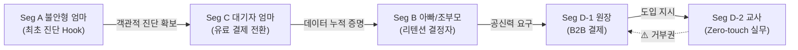

---

# 3. System Context and Interfaces

## 3.1 Use Case Diagram
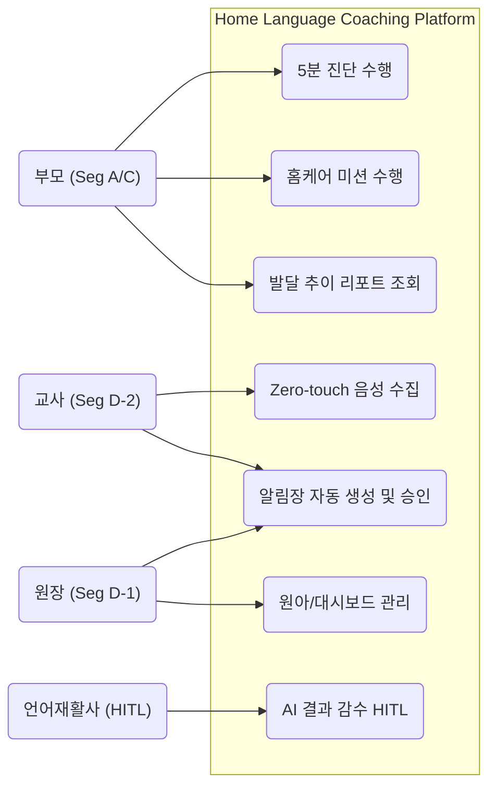

## 3.2 Component Diagram
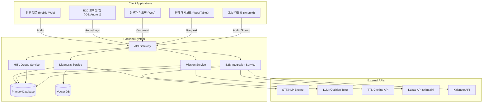

## 3.3 External Systems

| 시스템 | 역할 | 연동 방식 | 관련 Epic |
|:---|:---|:---|:---|
| **카카오톡 알림톡 API** | 동의서 발송, 성과 뱃지 공유, Fallback 알림 | REST API | F5, F9-d, F10 |
| **키즈노트 API** | 기관 알림장 발송, 쿠션어 승인 | REST API (PATCH) | F9-d |
| **STT 엔진** | 음성→텍스트 변환 (한국어 아동 특화) | gRPC Streaming | F1-a |
| **LLM API** | 쿠션어 생성, 발화 유도 챗봇 | REST API | F9-d, F15 |
| **TTS 클로닝 API** | 부모 목소리 복제 동화 | REST API | F11 |
| **Amplitude** | 퍼널/코호트 분석, 이벤트 트래킹 | SDK + REST | 전체 |

## 3.4 Client Applications

| 클라이언트 | 플랫폼 | 설명 | Phase |
|:---|:---|:---|:---:|
| **진단 웹뷰** | Mobile Web | 무로그인 5분 진단 랜딩 | P0 |
| **B2C 모바일 앱** | iOS/Android | 미션 수행, 리포트 열람, 보상 | P0 |
| **전문가 어드민** | Web (Desktop) | HITL 큐 관리, 코멘트 작성 | P1 |
| **원장 대시보드** | Web (Desktop/Tablet) | 기관 스크리닝, 알림장 관리 | P2 |
| **교실 태블릿** | Android Tablet | Zero-touch 음성 수집 앱 | P2 |

## 3.5 API Overview

| Endpoint | Method | 구분 | 입력 | 반환 | 제약 |
|:---|:---:|:---:|:---|:---|:---|
| `/v1/diagnosis/analyze` | POST | 내부 | Audio Stream (16kHz), 월령, 타겟 음소 | 3축 점수, 백분위, Confidence | p95 ≤ 800ms |
| `/v1/mission/curriculum` | GET | 내부 | 세션 이력 (정오답 패턴) | 추천 미션 ID, 난이도 레벨 | 연속 실패 3회 즉시 하향 |
| `/v1/report/weekly` | GET | 내부 | user_id, week_number | 주간 집계 데이터, 추이 JSON | p95 ≤ 3,000ms |
| `/v1/hitl/queue` | POST | 내부 | session_id, confidence_score | Queue 등록 확인, 예상 SLA | 즉시 등록 |
| `/v1/hitl/comment` | PATCH | 내부 | queue_id, expert_comment | 코멘트 반영 확인 | ≤ 48h SLA |
| `/v1/b2b/approval` | PATCH | 외부 | 기관ID, 알림장ID, 승인 여부 | HTTP 200 OK | 키즈노트 연동 |
| `/v1/consent/sign` | POST | 외부 | 동의서 템플릿, 학부모 식별자 | 서명 상태 트래킹 | 카카오톡 연동 |
| `/v1/reward/grant` | POST | 내부 | user_id, reward_type, amount | 보상 반영 확인 | ≤ 500ms |

## 3.6 Interaction Sequences

### 3.6.1 B2C 핵심 플로우: 진단 → 미션 → 리포트

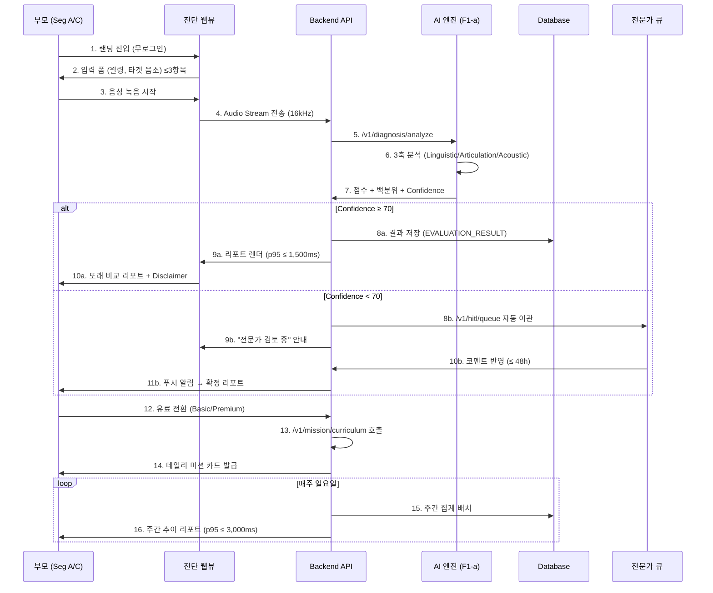

### 3.6.2 HITL 에스컬레이션 플로우

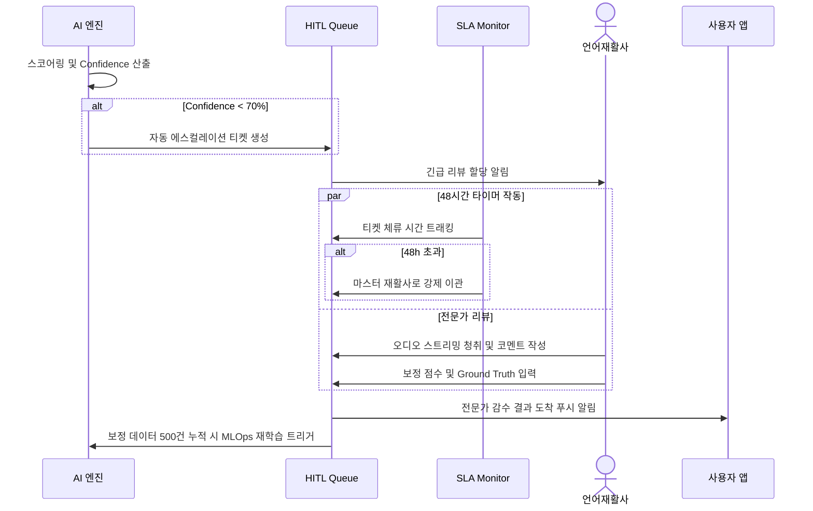

---

# 4. Specific Requirements

## 4.1 Functional Requirements

### Phase 0 — MVP 코어 (Must, 6 Epics)

#### Epic F1-a: 3축 AI 음성 분석 엔진

| REQ ID | 요구사항 | Source | AC |
|:---|:---|:---:|:---|
| **REQ-FUNC-001** | 16kHz 오디오 스트림을 수신하여 3축(Linguistic, Articulation, Acoustic) 점수를 산출 | S1 | Given: 유아 발화 입력, When: `/analyze` 호출, Then: 3축 float 반환, 실패율 `< 2%` |
| **REQ-FUNC-002** | 3축 점수 기반 동월령 또래 대비 백분위(peer_percentile) 산출 | S1 | Given: 3축+월령, When: 계산, Then: 0~100 float, K-CDI/REVT 차용 |
| **REQ-FUNC-003** | AI Confidence Score(0~100) 산출, 70 미만 시 HITL 큐 자동 이관 트리거 | S1, S6 | Given: 분석완료, When: Confidence<70, Then: HITL 큐 자동 이관 |
| **REQ-FUNC-004** | STT 처리 실패 시 백그라운드 자동 재시도 1회 수행 | S1-AC2 | Given: STT 오류, When: 최초 실패, Then: 재시도 1회, 성공률 `≥ 98%` |
| **REQ-FUNC-005** | 음성 원본을 벡터 변환 후 `≤ 7일` 내 자동 폐기 | S5-AC4, CON-03 | Given: 수집완료, When: 7일 경과, Then: 원본 삭제+AES-256 벡터 저장 |

**Exception Handling:**

| REQ ID | 예외 상황 | 처리 | Source |
|:---|:---|:---|:---:|
| **REQ-FUNC-006** | 마이크 접근 권한 거부 | OS 설정 이동 안내 모달 노출 | S1-Neg1 |
| **REQ-FUNC-007** | 주변 소음 60dB 이상 지속 | "조용한 곳으로 이동" 스낵바 팝업 | S1-Neg2 |

#### Epic F1-b: 무로그인 5분 진단 웹뷰

| REQ ID | 요구사항 | Source | AC |
|:---|:---|:---:|:---|
| **REQ-FUNC-008** | 회원가입/로그인 없이 즉시 진단 세션 시작 | S1 | 입력 폼 `≤ 3개 항목` |
| **REQ-FUNC-009** | 전체 플로우 체류시간 `≤ 300초(5분)` | S1-AC1 | 진입→결과 `≤ 300초` |
| **REQ-FUNC-010** | 결과 페이지 렌더링 `p95 ≤ 1,500ms` | S1-AC3 | 서버분석+차트 포함 |
| **REQ-FUNC-011** | "의료적 판단 아님" Disclaimer 노출률 `100%` | S1-AC4, CON-04 | 결과 화면 필수 표시 |

#### Epic F2: 또래 비교 진단 리포트

| REQ ID | 요구사항 | Source | AC |
|:---|:---|:---:|:---|
| **REQ-FUNC-012** | "상위 N%" 넛지 카피 포함 또래 비교 리포트 생성 | S1, S3 | 백분위 그래프 + 넛지 카피 |
| **REQ-FUNC-013** | 리포트 내 금칙어(진단, 장애) 0건 보장 | CON-04 | 정규식 스캔, 발각 시 렌더링 차단 |
| **REQ-FUNC-014** | 리포트 하단 유료 전환 CTA(페이월) 노출 | S3-AC3 | 무료 진단 후 CTA 표시 |

#### Epic F3-a: 1분 숏폼 미션 카드 UI

| REQ ID | 요구사항 | Source | AC |
|:---|:---|:---:|:---|
| **REQ-FUNC-015** | 사용자 발달 수준 기반 개인화 데일리 미션 카드 발급 | S2 | 홈 화면 진입 시 개인화 미션 노출 |
| **REQ-FUNC-016** | 미션 세션 1~3분, Drop-off `< 10%` | S2-AC1 | 1~3분 세션, 이탈률 측정 |
| **REQ-FUNC-017** | 타이머/진행바 UI 표시 | S2 | 잔여 시간 시각 표시 |
| **REQ-FUNC-018** | 첫 7일 개인화 주간 미션, 완료율 `≥ 70%` | S2-AC4 | 첫 주 미션 완료율 측정 |
| **REQ-FUNC-019** | 세션 중 1분+ 침묵 시 거울 모드/부모 개입 툴팁 | S2-Neg1 | 자동 팝업 |
| **REQ-FUNC-020** | 네트워크 단절 시 오프라인 캐시 → 연결 시 소급 보상 | S2-Neg2 | 캐시 저장+동기화 |

#### Epic F3-b: 적응형 난이도 조절 엔진

| REQ ID | 요구사항 | Source | AC |
|:---|:---|:---:|:---|
| **REQ-FUNC-021** | 3회 연속 실패 시 난이도 은밀히 하향, X표시/실패음 `0회` | S2-AC2 | 전환 지연 `< 0.5초` |
| **REQ-FUNC-022** | `/v1/mission/curriculum` API로 세션 이력 기반 추천 미션 반환 | S2 | 난이도 레벨 + 미션 ID 반환 |
| **REQ-FUNC-023** | 난이도 하향 후 세션 이탈률 `< 5%` | CJM-B | 이탈률 측정 |

#### Epic F12: 게이미피케이션 보상 시스템

| REQ ID | 요구사항 | Source | AC |
|:---|:---|:---:|:---|
| **REQ-FUNC-024** | 발화 성공 시 칭찬 파티클 `≤ 500ms` 렌더링 | S2-AC3 | 파티클 딜레이 측정 |
| **REQ-FUNC-025** | 누적 보상(별, 나무 레벨, AI 그림) REWARD_PROGRESS 저장 | S2 | DB 반영 확인 |
| **REQ-FUNC-026** | 누적 보상 도감 UI 제공 | S2 | 별/나무/그림 현황 표시 |

> **Phase 0 소계: REQ-FUNC-001 ~ REQ-FUNC-026 (26개)**

---

### Phase 1 — 리텐션/바이럴 (Should, 10 Epics)

#### Epic F4: 주간 발달 추이 리포트

| REQ ID | 요구사항 | Source | AC |
|:---|:---|:---:|:---|
| **REQ-FUNC-027** | 매주 일요일 10시 음소 백분위 꺾은선 그래프 자동 생성 | S3-AC1 | p95 `≤ 3,000ms` |
| **REQ-FUNC-028** | "다음 주 예상 점수" 시뮬레이션 표시 | S3-AC3 | 클릭 유저 익월 유지율 비클릭 대비 `≥ 20%p↑` |
| **REQ-FUNC-029** | 데이터 부족 시 하락 그래프 대신 긍정적 메시지 표출 | S3-Neg1 | 미션 독려 + 이전 성과 표시 |

#### Epic F5: 카카오톡/SNS 공유

| REQ ID | 요구사항 | Source | AC |
|:---|:---|:---:|:---|
| **REQ-FUNC-030** | 성과 뱃지 카카오톡 가족 단톡방 전송 | S3-AC2 | 전송 성공률 `≥ 95%` |
| **REQ-FUNC-031** | 외부 API 장애 시 클립보드 "링크 복사" 폴백 | S3-Neg2 | 링크 복사 UI 전환 |

#### Epic F6: HITL 전문가 코멘트 대시보드

| REQ ID | 요구사항 | Source | AC |
|:---|:---|:---:|:---|
| **REQ-FUNC-032** | 전문가 어드민에서 대기열 확인 및 코멘트 작성 | S6 | 세션 오디오+AI 결과 표시 |
| **REQ-FUNC-033** | 큐 대기 24h 초과 시 자동 에스컬레이션 | S6-Neg1 | Slack Alert + 재배정 |
| **REQ-FUNC-034** | 월 3회 초과 이의제기 시 자동 반려/CS 이관 | S6-Neg2 | 4회차부터 자동 반려 |

#### Epic F7: 센터 제출용 PDF

| REQ ID | 요구사항 | Source | AC |
|:---|:---|:---:|:---|
| **REQ-FUNC-035** | 발달 추이 데이터 PDF 다운로드/공유 | S3 | 3축+추이 포함 A4 PDF |

#### Epic F11: 부모 목소리 복제 동화

| REQ ID | 요구사항 | Source | AC |
|:---|:---|:---:|:---|
| **REQ-FUNC-036** | TTS 클로닝 API로 부모 음성 동화 재생 | CJM-C | 클로닝 음성 동화 출력 |
| **REQ-FUNC-037** | 클로닝 음성 교정 훈련 적용 차단 | Won't | 시스템 기본 음성만 사용 |

#### Epic F14: 거울 모드

| REQ ID | 요구사항 | Source | AC |
|:---|:---|:---:|:---|
| **REQ-FUNC-038** | 카메라 오버레이 입 모양 가이드 비교 표시 | CJM-C | 가이드 오버레이 렌더 |

#### Epic F15: LLM 대화형 발화 유도 챗봇

| REQ ID | 요구사항 | Source | AC |
|:---|:---|:---:|:---|
| **REQ-FUNC-039** | LLM 발화 유도 시나리오로 자연 발화 수집 | CJM-C | 체류 `≥ 3분` |
| **REQ-FUNC-040** | 수집 발화 조음 분석 로깅 자동 연동 | S1 | SESSION_LOG 자동 저장 |

#### Epic F16/F17/F18: 푸시·케어로그·예측

| REQ ID | 요구사항 | Source | AC |
|:---|:---|:---:|:---|
| **REQ-FUNC-041** | 컨텍스트 기반 오프라인 케어 푸시 스케줄링 | CJM | 24h 후 일반화 팁 발송 |
| **REQ-FUNC-042** | 센터 오프라인 기록+앱 세션 타임라인 UI 통합 | CJM-C | 앱+센터 기록 시간순 통합 |
| **REQ-FUNC-043** | 주 2회+ 기록 유지율 `≥ 40%` | CJM-C | 유지율 측정 |
| **REQ-FUNC-044** | 회귀 모델 기반 다음 주 예상 점수 산출 | S3-AC3 | 예상 점수+신뢰구간 표시 |
| **REQ-FUNC-045** | 시뮬레이션 클릭 이벤트 Amplitude 트래킹 | S3-AC3 | Amplitude 이벤트 전송 |

### Cross-cutting — HITL 안전 프로토콜 (4원칙)

| REQ ID | 요구사항 | Source | AC |
|:---|:---|:---:|:---|
| **REQ-FUNC-HITL-001** | Confidence `< 70` 또는 이의제기 시 전문가 큐 즉시 이관 | HITL-자동에스컬레이션 | 큐 즉시 등록 |
| **REQ-FUNC-HITL-002** | 모든 UI 금칙어 정규식 자동 탐지 | HITL-의료판단회피 | 금칙어 발각 시 렌더링 차단 |
| **REQ-FUNC-HITL-003** | 48h 이내 100% 피드백 완료 | HITL-SLA보장 | 미완료 시 마스터 재활사 강제 이관 |
| **REQ-FUNC-HITL-004** | 전문가 보정 레이블 → 모델 파인튜닝 환류 | HITL-루프백 | 오진율 >0.5% → 롤백, 500건 누적 후 재학습, ≤0.3% 후 재배포 |

> **Phase 1 소계: REQ-FUNC-027~045 (19개) + HITL 4개 = 23개**

---

### Phase 2 — B2B 스케일업 (Could, 5 Epics)

#### Epic F9-a: 원장 대시보드

| REQ ID | 요구사항 | Source | AC |
|:---|:---|:---:|:---|
| **REQ-FUNC-046** | 반/원아 단위 스크리닝 대시보드 | S4 | 반별 원아 현황 표시 |
| **REQ-FUNC-047** | 원장 명의 헤더/로고 커스텀 | S4-AC2 | 렌더 `≤ 1초` |
| **REQ-FUNC-048** | ROI 시뮬레이터 | F9-a | 투자 대비 효과 시뮬레이션 |

#### Epic F9-b: Zero-touch 화자분리 수집

| REQ ID | 요구사항 | Source | AC |
|:---|:---|:---:|:---|
| **REQ-FUNC-049** | 교사 능동 조작 없이 백그라운드 자동 수집 | S5-AC1 | 조작 `평균 0회` |
| **REQ-FUNC-050** | 60dB 환경 Speaker Diarization 정확도 `≥ 85%` | S5-AC2 | 타겟 아동 분리 정확도 |
| **REQ-FUNC-051** | 엣지 VAD 발화 자동 감지+버퍼링 전송 | CON-01 | 청크 전송 `≤ 300ms` |
| **REQ-FUNC-052** | 기기 마이크 고장/Mute 시 즉각 경고 푸시 | S5-Neg1 | 경고 푸시 발송 |
| **REQ-FUNC-053** | 7일 폐기 스크립트 실패 시 재시도 3회→강제 삭제 큐 | S5-Neg2 | 어드민 경고 |

#### Epic F9-c: 원아 일괄등록 및 동의서

| REQ ID | 요구사항 | Source | AC |
|:---|:---|:---:|:---|
| **REQ-FUNC-054** | 100명 원아 엑셀 파싱 일괄 등록 | S4-AC1 | p95 `≤ 3,000ms` |
| **REQ-FUNC-055** | 오류 행 하이라이트+인라인 수정 UI | S4-Neg1 | 즉시 하이라이트 |

#### Epic F9-d: AI 쿠션어 알림장

| REQ ID | 요구사항 | Source | AC |
|:---|:---|:---:|:---|
| **REQ-FUNC-056** | LLM 쿠션어 알림장 초안 자동 생성 | S5-AC3 | 쿠션어 초안 표시 |
| **REQ-FUNC-057** | 교사 무수정 발송 승인율 `≥ 90%` | S5-AC3 | 승인율 측정 |
| **REQ-FUNC-058** | 키즈노트 API 알림장 발송 | S5 | 전송 성공 |

#### Epic F10: 학부모 동의서 전자서명

| REQ ID | 요구사항 | Source | AC |
|:---|:---|:---:|:---|
| **REQ-FUNC-059** | 카카오톡 전자서명 링크 발송 | S4-AC3 | 카카오톡 링크 발송 |
| **REQ-FUNC-060** | 서명 완료율 `≥ 85%` 유도 리마인더 | S4-AC3 | D+3 리마인더 발송 |
| **REQ-FUNC-061** | 서명 7일 초과 시 만료 안내+재발송 알림 | S4-Neg2 | 교사에게 알림 |

> **Phase 2 소계: 16개. 전체 REQ-FUNC 합계: 26+23+16 = 65개**

---

## 4.2 Non-Functional Requirements

### 성능

| REQ ID | 항목 | 임계치 | 연결 |
|:---|:---|:---|:---:|
| **REQ-NF-001** | 진단/분석 API 응답 | `p95 ≤ 800ms` | S1-AC3 |
| **REQ-NF-002** | 오디오 스트리밍 전송 지연 | `≤ 300ms` | S1-AC2 |
| **REQ-NF-003** | 모바일 앱 Cold Start | `≤ 1.5초` | 공통 |
| **REQ-NF-004** | 주간 리포트/대시보드 렌더링 | `p95 ≤ 3,000ms` | S3-AC1 |
| **REQ-NF-005** | 보상 UI 렌더링 | `≤ 500ms` | S2-AC3 |
| **REQ-NF-006** | 원아 일괄 업로드 파싱 | `p95 ≤ 3,000ms` | S4-AC1 |

### 가용성/SLA

| REQ ID | 항목 | 타겟 SLA |
|:---|:---|:---|
| **REQ-NF-007** | 시스템 Uptime | `≥ 99.9%` (월 ≤43분) |
| **REQ-NF-008** | MTTR | `< 2시간` |
| **REQ-NF-009** | RPO | `< 1시간` |
| **REQ-NF-010** | RTO | `< 4시간` |
| **REQ-NF-011** | CS 최초 응답 | `< 4시간` |
| **REQ-NF-012** | HITL 피드백 완료 | `< 48시간` |

### 신뢰성

| REQ ID | 항목 | 임계치 |
|:---|:---|:---|
| **REQ-NF-013** | 오디오 인코딩/처리 오류율 | `≤ 0.5%` |
| **REQ-NF-014** | 분석 실패 후 재시도 성공률 | `≥ 98%` |
| **REQ-NF-015** | 교실 화자분리 정확도 (60dB) | `≥ 85%` |

### 보안

| REQ ID | 항목 | 기준 |
|:---|:---|:---|
| **REQ-NF-016** | 영유아 음성 원본 보관 | `≤ 7일` 후 즉시 폐기 |
| **REQ-NF-017** | 민감 데이터 암호화 | 저장: `AES-256`, 전송: `TLS 1.2+` |
| **REQ-NF-018** | AI API 호출 비용 통제 | 유저당 월 `≤ ₩5,250` (구독료 15%) |
| **REQ-NF-019** | RBAC 접근 제어 | 원장/교사/재활사/관리자 역할 분리, 감사 로그 1년+ 보관 |

### 모니터링

| REQ ID | 대시보드 | Alert 기준 |
|:---|:---|:---|
| **REQ-NF-020** | 퍼널 전환 | 일간 CVR 변동 `±20%` 시 Alert |
| **REQ-NF-021** | 시스템 품질 | STT 500 에러율 5분 내 `3%` 초과 시 Slack Alert |
| **REQ-NF-022** | 비즈니스 | LTV:CAC `< 3.0` 하락 시 주간 그로스 리뷰 트리거 |
| **REQ-NF-023** | HITL 큐 운영 | 24h 초과 `3건+` 시 Alert + 자동 배정 |
| **REQ-NF-024** | B2B API 연동 | 에러율 1h 내 `5%` 초과 시 Fallback + Alert |

### Business KPI

| REQ ID | KPI | 목표값 | 주기 |
|:---|:---|:---|:---:|
| **REQ-NF-025** | W-AUR (북극성) | `≥ 60%` | 주간 |
| **REQ-NF-026** | M3 리텐션 | `≥ 40%` | 월간 |
| **REQ-NF-027** | 무료→유료 CVR | `≥ 8%` | 주간 |
| **REQ-NF-028** | Zero-touch 승인율 | `≥ 90%` | PoC |
| **REQ-NF-029** | 오진 치명 수정률 | `< 0.5%` | 월간 |
| **REQ-NF-030** | Churn Rate | `≤ 5%` | 월간 |

> **NFR 합계: REQ-NF-001 ~ REQ-NF-030 (30개)**

---

# 5. Traceability Matrix

| Story | REQ-FUNC ID | Requirement Summary | REQ-NF | TC ID |
|:---|:---|:---|:---|:---|
| **S1 (5분 진단)** | REQ-FUNC-001 | STT 파이프라인 수신 | NF-001, NF-002 | TC-S1-001 |
| | REQ-FUNC-002 | 3축 스코어링+백분위 | NF-001 | TC-S1-002 |
| | REQ-FUNC-003 | Confidence 산출→HITL 트리거 | | TC-S1-003 |
| | REQ-FUNC-004 | STT 재시도 | NF-014 | TC-S1-004 |
| | REQ-FUNC-005 | 벡터 변환+원본 폐기 | NF-016 | TC-S1-005 |
| | REQ-FUNC-006 | 마이크 권한 거부 Exc | | TC-S1-006 |
| | REQ-FUNC-007 | 소음 60dB Exc | | TC-S1-007 |
| | REQ-FUNC-008 | 무로그인 랜딩 | | TC-S1-008 |
| | REQ-FUNC-009 | 5분 체류시간 | NF-003 | TC-S1-009 |
| | REQ-FUNC-010 | 결과 렌더링 p95 | NF-001 | TC-S1-010 |
| | REQ-FUNC-011 | Disclaimer 100% | | TC-S1-011 |
| | REQ-FUNC-012 | 넛지 리포트 | | TC-S1-012 |
| | REQ-FUNC-013 | 금칙어 0건 | | TC-S1-013 |
| | REQ-FUNC-014 | 유료 전환 CTA | NF-027 | TC-S1-014 |
| **S2 (홈케어 미션)** | REQ-FUNC-015 | 개인화 미션 카드 | NF-025 | TC-S2-001 |
| | REQ-FUNC-016 | 1~3분 세션+이탈 <10% | NF-030 | TC-S2-002 |
| | REQ-FUNC-017 | 타이머/진행바 | | TC-S2-003 |
| | REQ-FUNC-018 | 첫 주 미션 완료율 ≥70% | NF-025 | TC-S2-004 |
| | REQ-FUNC-019 | 침묵 감지 툴팁 Exc | | TC-S2-005 |
| | REQ-FUNC-020 | 오프라인 소급 보상 Exc | | TC-S2-006 |
| | REQ-FUNC-021 | 적응형 난이도 하향 | | TC-S2-007 |
| | REQ-FUNC-022 | curriculum API | | TC-S2-008 |
| | REQ-FUNC-023 | 하향 후 이탈 <5% | NF-030 | TC-S2-009 |
| | REQ-FUNC-024 | 파티클 보상 ≤500ms | NF-005 | TC-S2-010 |
| | REQ-FUNC-025 | 누적 보상 DB 저장 | | TC-S2-011 |
| | REQ-FUNC-026 | 도감 UI | | TC-S2-012 |
| **S3 (주간 리포트)** | REQ-FUNC-027 | 추이 리포트 자동 생성 | NF-004 | TC-S3-001 |
| | REQ-FUNC-028 | 예측 시뮬레이션 | NF-026 | TC-S3-002 |
| | REQ-FUNC-029 | 데이터 불충분 처리 Exc | | TC-S3-003 |
| | REQ-FUNC-030 | 카카오톡 뱃지 공유 | | TC-S3-004 |
| | REQ-FUNC-031 | 공유 API 폴백 Exc | NF-024 | TC-S3-005 |
| | REQ-FUNC-035 | PDF 다운로드 | | TC-S3-006 |
| | REQ-FUNC-044 | 예측 점수 산출 | | TC-S3-007 |
| | REQ-FUNC-045 | Amplitude 트래킹 | | TC-S3-008 |
| **S4 (기관 대시보드)** | REQ-FUNC-046 | 원장 대시보드 뷰 | NF-004 | TC-S4-001 |
| | REQ-FUNC-047 | 헤더/로고 커스텀 | | TC-S4-002 |
| | REQ-FUNC-048 | ROI 시뮬레이터 | | TC-S4-003 |
| | REQ-FUNC-054 | 엑셀 일괄 등록 | NF-006 | TC-S4-004 |
| | REQ-FUNC-055 | 오류 행 인라인 수정 | | TC-S4-005 |
| | REQ-FUNC-059 | 전자서명 링크 발송 | NF-017 | TC-S4-006 |
| | REQ-FUNC-060 | 서명 리마인더 | | TC-S4-007 |
| | REQ-FUNC-061 | 서명 기한 만료 Exc | | TC-S4-008 |
| **S5 (Zero-touch)** | REQ-FUNC-049 | 패시브 수집 | NF-028 | TC-S5-001 |
| | REQ-FUNC-050 | 화자분리 ≥85% | NF-015 | TC-S5-002 |
| | REQ-FUNC-051 | VAD 버퍼링 ≤300ms | NF-002 | TC-S5-003 |
| | REQ-FUNC-052 | 마이크 고장 Exc | | TC-S5-004 |
| | REQ-FUNC-053 | 폐기 스크립트 실패 Exc | NF-016 | TC-S5-005 |
| | REQ-FUNC-056 | 쿠션어 초안 생성 | | TC-S5-006 |
| | REQ-FUNC-057 | 무수정 승인율 ≥90% | NF-028 | TC-S5-007 |
| | REQ-FUNC-058 | 키즈노트 발송 | NF-024 | TC-S5-008 |
| **S6 / HITL** | REQ-FUNC-HITL-001 | 자동 에스컬레이션 | | TC-HITL-001 |
| | REQ-FUNC-HITL-002 | 금칙어 정규식 필터 | | TC-HITL-002 |
| | REQ-FUNC-HITL-003 | 전문가 SLA 48h | NF-012 | TC-HITL-003 |
| | REQ-FUNC-HITL-004 | 루프백 재학습 | NF-029 | TC-HITL-004 |
| | REQ-FUNC-032 | 전문가 큐 관리 뷰 | | TC-HITL-005 |
| | REQ-FUNC-033 | 24h 초과 에스컬레이션 | NF-023 | TC-HITL-006 |
| | REQ-FUNC-034 | 어뷰징 방어 | | TC-HITL-007 |

---

# 6. Appendix

## 6.1 Entity Relationship Diagram (ERD)
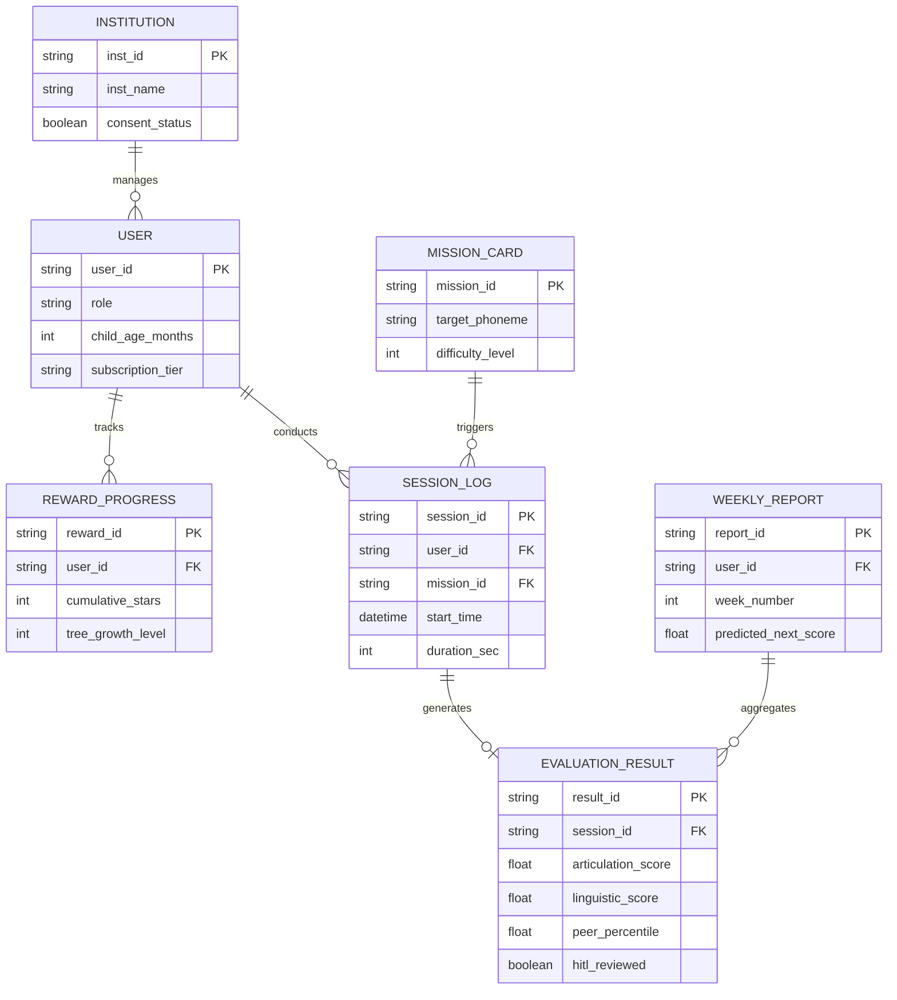

## 6.2 Domain Class Diagram
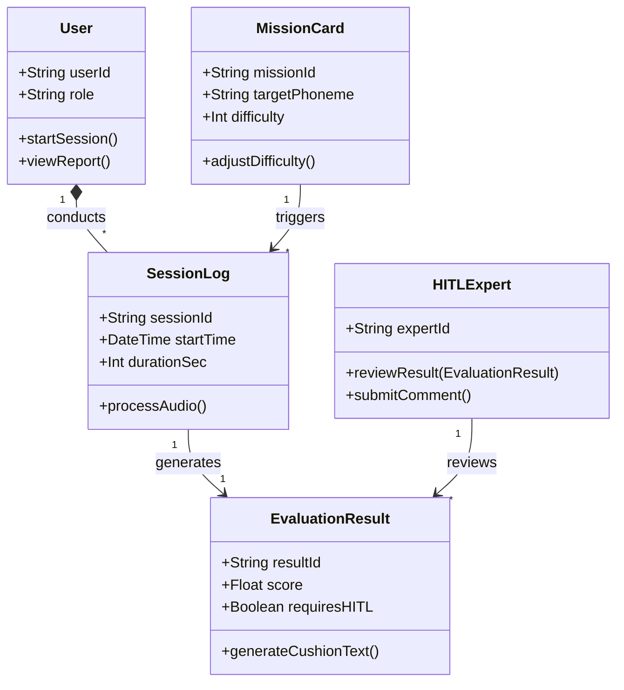

## 6.3 Data Dictionary

| Entity | PK | 주요 필드 | 관계 |
|:---|:---|:---|:---|
| **USER** | user_id | role, child_age_months, target_sound, subscription_tier | 1:N SESSION_LOG |
| **SESSION_LOG** | session_id | start_time, duration_sec, audio_vector_uri, session_type | 1:1 EVAL, N:1 MISSION |
| **EVALUATION_RESULT** | result_id | 3축 score, peer_percentile, ai_cushion_text, hitl_reviewed | N:1 WEEKLY_REPORT |
| **INSTITUTION** | inst_id | inst_name, principal_name, consent_status, logo_uri | 1:N USER |
| **MISSION_CARD** | mission_id | target_phoneme, difficulty_level, reward_type | 1:N SESSION_LOG |
| **WEEKLY_REPORT** | report_id | week_number, score_trend_json, predicted_next_score | 1:N EVAL |
| **REWARD_PROGRESS** | reward_id | cumulative_stars, tree_growth_level, ai_drawing_count | N:1 USER |

## 6.4 Sequence Diagrams (추가)

### 6.4.1 게이미피케이션 보상 소급 플로우 (Reward Fallback)
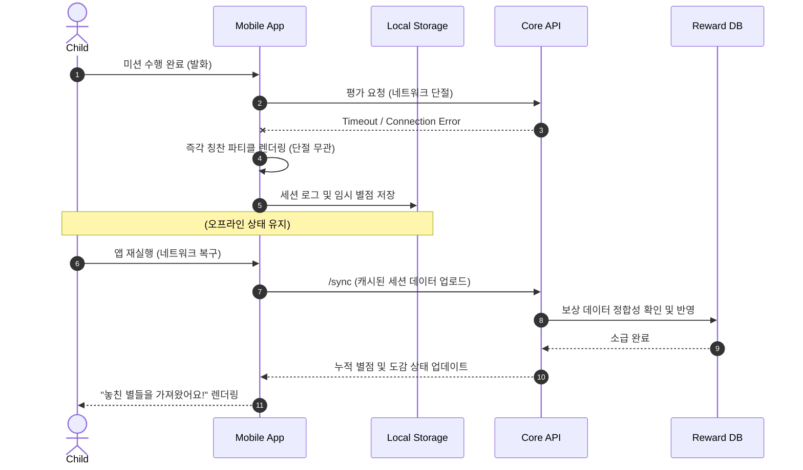

### 6.4.2 B2B Zero-touch 수집 플로우
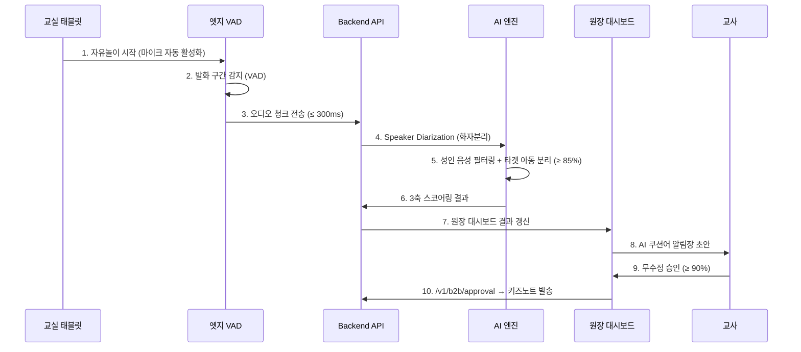

### 6.4.3 전자서명 동의서 플로우
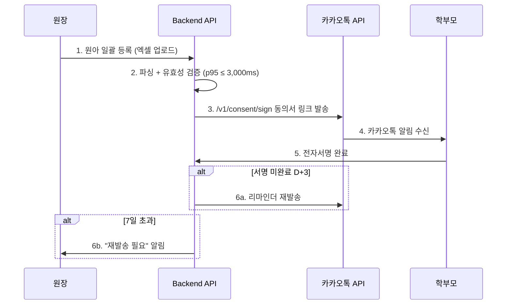

## 6.5 Implementation Timeline
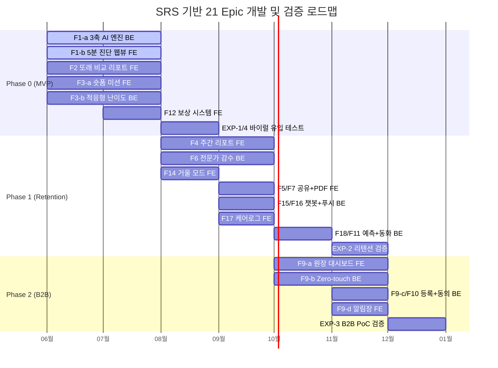

## 6.6 Validation Plan (EXP-1~4)

| 실험 ID | 가설 | 설계 | 성공 기준 | Phase |
|:---|:---|:---|:---|:---:|
| **EXP-1** | 코칭 톤 > DTx 톤 전환율 | A/B (n=500, 2주) | CVR `+2%p` | P0 |
| **EXP-2** | 예측 시뮬레이션 → M3 리텐션 향상 | A/B (n=800, 4~8주) | M3 `≥ 40%` | P1 |
| **EXP-3** | Zero-touch → 기관 수락률 증가 | PoC (10개 기관) | 조작 0회 + 수락률 `≥ 20%` | P2 |
| **EXP-4** | 앵커링 가격 → 결제 시작률 증가 | Paywall A/B (n=1,000, 2주) | 결제 시작률 `+5%p` | P0 |

## 6.7 Contingency Plan (R6 피벗 시나리오)

EXP-2 결과 M3 리텐션 40% 미달 시:

| 피벗 조치 | 대상 | 변경 내용 |
|:---|:---|:---|
| F4 재설계 | F4 | 정적 그래프 → F18 예측 시뮬레이션 최상단 승격 |
| F12 보상 강화 | F12 | 월간 성장 리포트 + 보상 연동, 해지 시 손실 체감 극대화 |
| F5 공유 리디자인 | F5 | 뱃지 → 아이 성장 스토리 카드로 감성 내러티브 전환 |
| EXP-2b 후속 | 신규 | 피벗 후 4주 재측정 (n=400), M3 ≥ 35% 미달 시 Seg B 축소 |

## 6.8 ADR Reference

| ADR ID | 결정 | 대안 | 사유 | 영향 |
|:---|:---|:---|:---|:---|
| **ADR-01** | Zero-touch 수집 전면 도입 | 교사 수동 녹음 | 교사 업무 가중→B2B 100% 실패 | 엣지 VAD+버퍼링 필수 |
| **ADR-02** | HITL 비동기 감수 | AI 단독 판정 | 1건 오진→규제+맘카페 민원 | 어드민+큐 시스템 필수 |
| **ADR-03** | 원본 음성 즉각 폐기 | 원본 영구 보관 | 아동보호법 위반 | 벡터화+폐기 스크립트 |
| **ADR-04** | 의료 용어 하드코딩 배제 | 임상 용어 노출 | DTx 인허가 회피 | 금칙어 스캐너+QA 자동화 |

---

# 문서 요약 통계

| 구분 | 항목 수 |
|:---|:---:|
| **Functional Requirements (REQ-FUNC)** | 65개 |
| **HITL Cross-cutting (REQ-FUNC-HITL)** | 4개 |
| **Non-Functional Requirements (REQ-NF)** | 30개 |
| **총 Requirements** | **99개** |
| **시퀀스 다이어그램** | 5개 (§3.6 × 2 + §6.4 × 3) |
| **구조 다이어그램** | 5개 (UseCase, Component, DMU, ERD, Class) |
| **Entity** | 7개 |
| **API Endpoint** | 8개 |
| **실험 설계** | 4건 (EXP-1~4) |
| **ADR** | 4건 |

---

**— End of SRS-001 v2.0 (V04 Merged Master) —**
