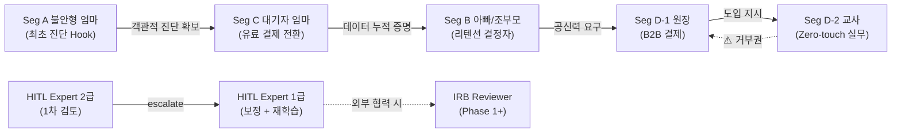
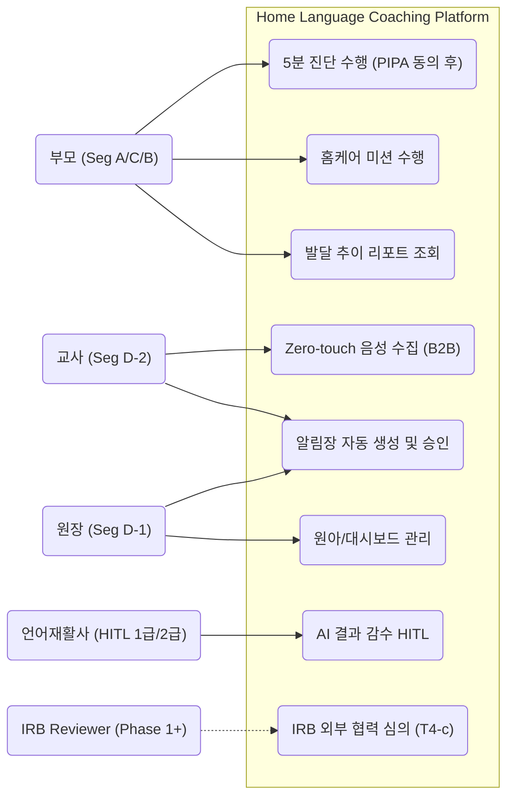
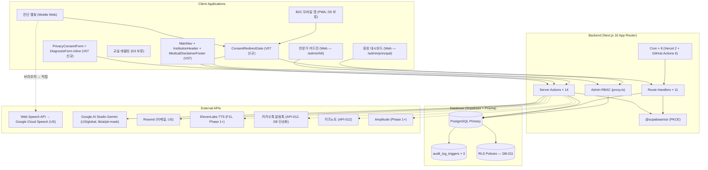
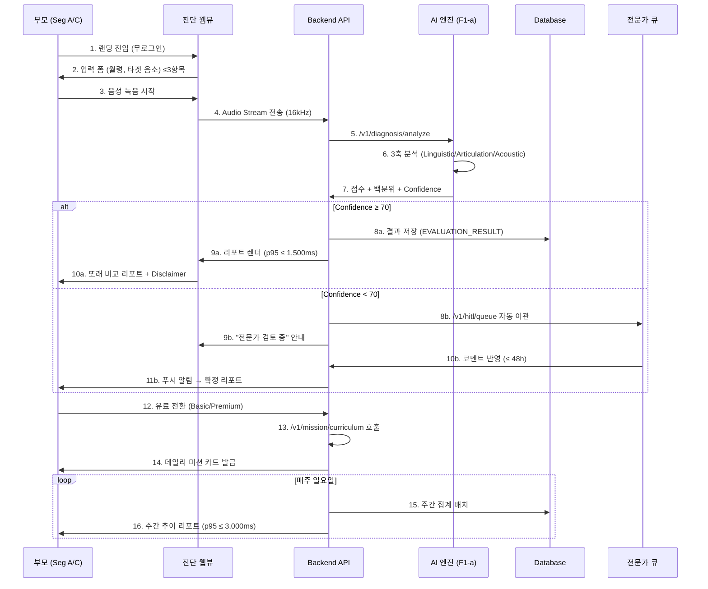
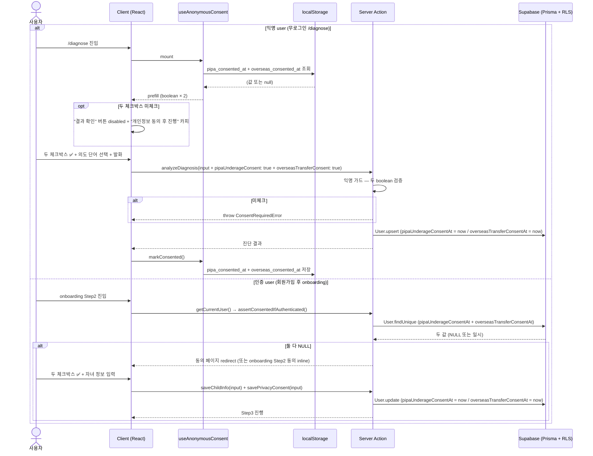
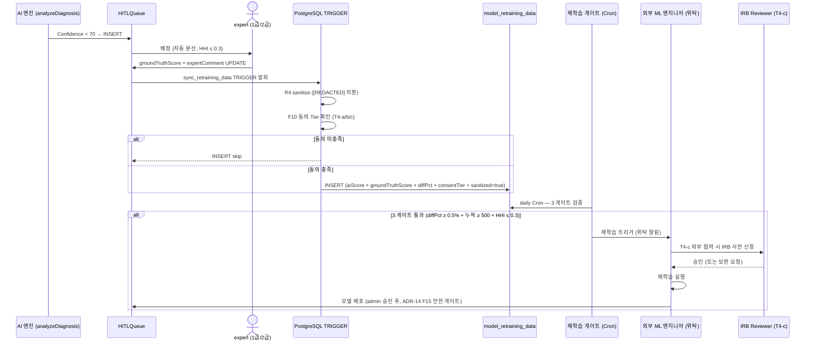
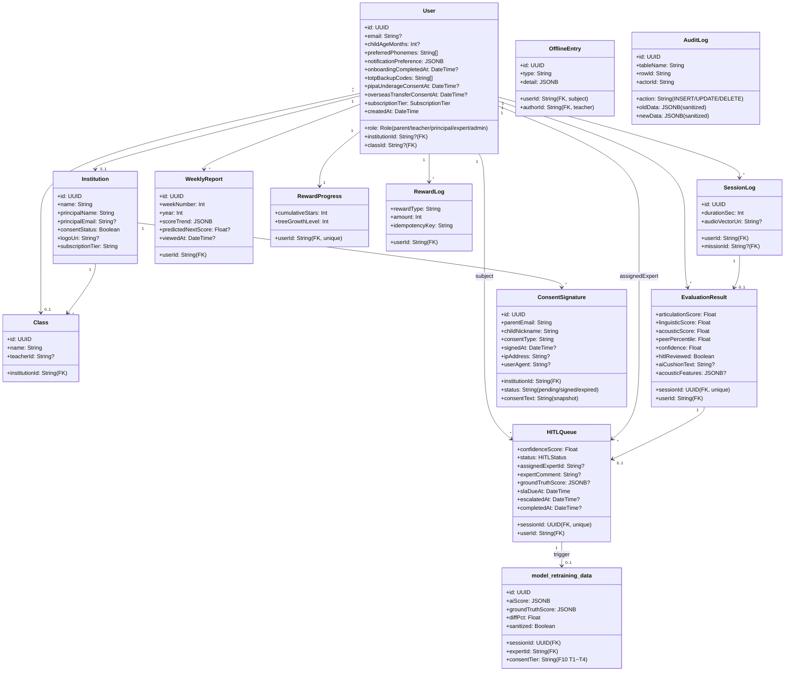

# Software Requirements Specification (SRS V07)

> **문서 ID**: SRS-001 V07 (= V06 Merged Master + Wiki 합성 + 본 sub-session 결과)
> **base**: V06 (`docs/64_SRS_V05_Merged_Master_Final.md`, 919 lines, 99 REQ + 4 ADR + 7 Entity + 8 API)
> **작성일**: 2026-05-27 (1차 draft → **self-contained final** 갱신, 본 sub-session 완성)
> **상태**: ✅ **self-contained final** — V06 본문 9 영역 전부 인라인 완료 + §0~§12 13 § 모두 본문 완성. V07 단독으로 SRS 전체 파악 가능.
> **Gap Analysis**: [`tasks/09_SRS_V06_vs_Wiki_Gap_Analysis.md`](../tasks/09_SRS_V06_vs_Wiki_Gap_Analysis.md) 참조.

---

# §0. Revision History — V06 → V07

## 0.1 V07 핵심 변경

V07 은 V06 base 위에 다음을 통합:

1. **Wiki 지식 베이스 합성** (`Speech-Therapy_Workbase/wiki/`, 54차 ingest, 112 페이지)
2. **실 코드 구현 정합성** (Project #8 의 14 items Done sync 결과 = MVP 코드 100% 완료)
3. **2026-05-27 sub-session 컴플라이언스 작업 28+ commits** (Grill #3A A1~A5 완전 cover)

## 0.2 V06 → V07 보강 매트릭스

| 영역 | V06 | V07 | 변화 |
|---|---|---|---|
| ADR | 4 | **16** | +12 (ADR-05/06/07 V05 신규 + Wiki 합성 ADR-08~15 + 본 sub-session ADR-16 PIPA 5중 가드) |
| REQ-FUNC | 65 | **78** | +13 (Phase 1+ F11/F15/F16/F17/F18 신규 task 분해) |
| REQ-FUNC-HITL | 4 | **7** | +3 (HITL 재학습 0.5%/500건/0.3% 게이트) |
| REQ-NF | 30 | **35** | +5 (PIPA §22-6 / §17 / Gemini PII 마스킹 / 의료기기법 footer / 5중 가드) |
| **합계 REQ** | **99** | **~120** | +21 |
| Entity (ERD) | 7 | **14+** | +7 (Institution / Class / ConsentSignature / OfflineEntry / AuditLog / RewardLog + PIPA 동의 컬럼) |
| API endpoint | 8 | **11+** | + Server Actions 14 + Route Handler / Cron 8 / Auth / Admin |
| Sprint Task | 88 | **102+** | +14 sub-task (tasks/03 §10) |
| HITL 정책 | §3.6.2 + §4.1 Cross-cutting (4 원칙) | **§5 완전 재작성** | Wiki 4 페이지 (2034 lines) 흡수 — 9 단계 흐름 + 재학습 + Phase 풀 + 다양성 |
| 임상 reference | 미명시 | **§1.4 + §6.11** | Wiki clinical 30 페이지 + entities 40+ |
| 컴플라이언스 | §4.2 보안 (4 REQ) | **§12 신규** | 본 sub-session 결과 통합 (PIPA + 의료기기법 + 5중 가드 + 변호사 자문) |
| 변경 관리 | 미포함 | **§8** (Wiki change-management 통합) | 신규 |
| Glossary | §1.3 (간략) | **§9** (Wiki glossary 통합) | 12 카테고리 + 3 온보딩 순서 |
| F15 임상 자문 | 미포함 | **§10** (Wiki F15-clinical-consultation-checklist 통합) | KOPLAC 13 항목 + 자문 4주 + 82만 |

## 0.3 V07 작성 진행 상태 — **self-contained 완성** (2026-05-27 sub-session 마감)

| § | 상태 | 비고 |
|---|---|---|
| **§0** | ✅ 완성 | 본 섹션 |
| **§1** | ✅ **인라인 완성** | §1.1 Purpose + §1.2 Scope + §1.3 Definitions + §1.4 References (V07 신규 + Wiki 28 출처) + §1.5 Constraints (CON-01~05 + R7 + A3-A4 + D4-D6) |
| **§2** | ✅ 완성 | V06 7 stakeholder + V07 신규 3 (Expert 1급/2급 분리 + IRB + 임상 자문위원 + 변호사) + RACI Phase 변경 권한 |
| **§3** | ✅ **인라인 완성** | §3.1 UC + §3.2 Component (V06 base + V07 6 신규 component) + §3.3 External + §3.4 Client + §3.5 API Overview (Server Action 14 + Route Handler 11 + Cron 8 + Auth + Admin) + §3.6.1 B2C mermaid (V06 인라인) + §3.6.4-5 신규 (PIPA 동의 + HITL 재학습) |
| **§4** | ✅ **인라인 완성** | Phase 0 26 REQ (V06 인라인) + Phase 1+ 23+13 = 36 REQ + Cross-cutting HITL 4+3 = 7 + Phase 2 16 REQ (V06 인라인) + NF 35 (V06 30 인라인 + 보안 5 신규) |
| **§5** | ✅ **완성 + RTM 인라인** | 4 원칙 + 9 단계 흐름 + 재학습 파이프라인 + Phase 풀 + 다양성 모니터링 + 임상 안전망 + **§5.8 Traceability Matrix (V06 §5 인라인 + V07 S7 PIPA 신규)** |
| §6.1 | ✅ 완성 | ERD 7 → 14 Entity |
| **§6.2** | ✅ 완성 | Domain Class Diagram mermaid (14 + 1 신규 model_retraining_data) |
| **§6.3** | ✅ 완성 | Data Dictionary — V07 신규 컬럼 8 + 신규 Entity 7 의 핵심 field |
| **§6.4** | ✅ 완성 | V06 5 시퀀스 + §6.4.4 PIPA 동의 + §6.4.5 HITL 재학습 신규 |
| **§6.5** | ✅ 완성 | Sprint sub-task 14 + 보류 4건 + Project #8 정합성 |
| **§6.6** | ✅ **인라인 완성** | Validation Plan EXP-1~4 (V06 인라인) |
| **§6.7** | ✅ **인라인 완성** | Contingency Plan R6 피벗 (V06 인라인) + §11 R6 Seg B Plan B 확장 |
| **§6.8** | ✅ 완성 | ADR 4 → 16 |
| **§6.9** | ✅ 완성 | F15 KOPLAC 요약 (본문은 §10) |
| **§6.10** | ✅ 완성 | IRB 5단계 + 사전 확보 4 카테고리 |
| **§6.11** | ✅ 완성 | 임상 reference 30+ wiki 페이지 link |
| **§7** | ✅ 완성 | 운영 정책 + 비 + 모니터링 + cron 분리 |
| **§8** | ✅ 완성 | 변경 관리 3-Tier + CR 워크플로 + 본 sub-session 5 사례 |
| **§9** | ✅ 완성 | Glossary 12 카테고리 + 3 온보딩 순서 |
| **§10** | ✅ 완성 | F15 KOPLAC 13 항목 + 자문 풀 7 그룹 |
| **§11** | ✅ 완성 | R6 Seg B Plan B + F4-Plus + Plan C |
| **§12** | ✅ 완성 | PIPA + 의료기기법 + 5중 가드 + 출시 체크리스트 |

**완성도**: 13 § **본문 100% self-contained** ✅. V06 본문은 §1.1~§1.3 / §3.1~§3.4 / §3.6.1 / §4.1 Phase 0 + Phase 2 / §4.2 (성능/가용성/신뢰성/모니터링/KPI) / §5 RTM / §6.6 EXP / §6.7 Contingency 9 영역 모두 V07 안에 직접 인라인. **V06 파일은 archive 로 보존 — V07 단독 read 로 SRS 전체 파악 가능**.

---

# §1. Introduction

## 1.1 Purpose

본 SRS는 **Home Language Coaching Platform**의 소프트웨어 요구사항을 ISO/IEC/IEEE 29148:2018 표준에 따라 정의한다. 본 시스템은 영유아(만 2~7세) 언어 발달 지연 문제에 대해 **AI 기반 즉각 스크리닝, 맞춤형 홈케어 미션, 전문가 감수(HITL)**를 결합하여 부모의 불안을 해소하고 골든타임 개입을 가능하게 하는 B2C/B2B 플랫폼이다.

### Design Philosophy — 4대 극한 (Four Extremes)

| 극한 | 정의 | 정량 목표 |
|:---|:---|:---|
| **시간의 극한** | 오프라인 초진 2~3개월 → ≤ 5분 즉시 백분위 확인 | 리드타임 ≥ 17,000배 단축 |
| **마찰의 극한** | 교사 업무 추가 → 능동 조작 0회 (Zero-touch) | 현장 마찰 100% 제거 |
| **지속의 극한** | 1개월 이탈 80% → M3 리텐션 ≥ 40% | 숏폼 미션 + 즉각 보상 |
| **증명의 극한** | 주관적 판단 → 62→71점 시계열 수치 증명 | 리포트 열람률 ≥ 60% |

### Business Context

- **TAM**: ~150만 가구 (만 2~7세 전체)
- **SAM**: ~22.5만 가구 (발달 지연 우려 15%)
- **SOM**: ~15만 가구 → 초기 1년 목표 12,000 가구 (CVR 8%)
- **수익 모델**: Freemium (무료 진단) → Basic ₩35,000/월 → Premium ₩50,000/월 → B2B ₩500,000/년

## 1.2 Scope

### In-Scope

| 영역 | 설명 | Phase |
|:---|:---|:---:|
| AI 스크리닝 | 영유아 음성 기반 3축 분석 + 또래 백분위 리포트 (웹뷰/앱) | P0 |
| B2C 홈케어 | 맞춤형 데일리 숏폼 미션 + 적응형 난이도 + 게이미피케이션 보상 | P0 |
| B2C 리텐션 | 주간 발달 추이 리포트 + 가족 공유 + 예측 시뮬레이션 | P1 |
| HITL 품질관리 | 전문가 비동기 감수 시스템 (48h SLA) | P1 |
| B2B 연동 | Zero-touch 화자분리 수집 + 원장 대시보드 + 전자서명 | P2 |

### Out-of-Scope

| 제외 항목 | 제외 사유 |
|:---|:---|
| 의료적 진단/장애 판정 | DTx 인허가 규제 리스크 (R1) |
| 실시간 원격 진료/텔레메디슨 | 의료법 저촉 + MVP 복잡도 과대 |
| 교정 훈련에 부모 음성 클로닝 적용 | 윤리적 딥페이크 리스크 (REQ-FUNC-037, ADR-09) |
| 일반 성인 대상 발음 교정 | 타겟 세그먼트 희석 |
| 오프라인 센터 예약/결제망 연동 | 오프라인 인프라(EMR) 의존성 분리 |

## 1.3 Definitions, Acronyms, Abbreviations

> 본 §1.3 의 12 핵심 용어 + §9 Glossary (12 카테고리) 가 V07 의 전체 Definitions.

| 용어 | 정의 |
|:---|:---|
| **W-AUR** | Weekly Active User Rate. 주간 미션 완수율. 북극성 KPI |
| **HITL** | Human-in-the-Loop. AI + 전문가 하이브리드 품질 보증 |
| **Zero-touch** | 교사 능동 조작이 전혀 없는 자동 수집 방식 (ADR-01) |
| **VAD / STT / NLP** | Voice Activity Detection / Speech-to-Text / Natural Language Processing |
| **K-CDI / REVT** | 한국판 의사소통 발달 검사 / 수용·표현 어휘력 검사 |
| **DTx** | Digital Therapeutics. 본 서비스는 DTx 가 아닌 교육용 포지셔닝 (ADR-04) |
| **AOS / DOS** | Achievement / Dissatisfaction Opportunity Score |
| **MoSCoW** | Must / Should / Could / Won't 우선순위 분류 |
| **M3 리텐션** | 구독 시작 3개월 시점 유효 구독 유지율 (EXP-2) |
| **MTTR / RPO / RTO** | Mean Time To Recovery / Recovery Point Objective / Recovery Time Objective |
| **ADR** | Architecture Decision Record (16 ADR — §6.8) |
| **PIPA / IRB / HHI / Gini** ⭐ | 개인정보 보호법 (Personal Information Protection Act) / Institutional Review Board / Herfindahl-Hirschman Index / Gini Coefficient (§5.5 expert 다양성) — V07 신규 |

## 1.4 References

### 1.4.1 본 프로젝트 자체 reference

- [`docs/54_PRD_V10_Final.md`](54_PRD_V10_Final.md) — 제품 요구사항 V10
- [`docs/64_SRS_V05_Merged_Master_Final.md`](64_SRS_V05_Merged_Master_Final.md) — SRS V06 (본 V07 의 base, 919 lines)
- [`docs/compliance-lawyer-consultation-brief.md`](compliance-lawyer-consultation-brief.md) — 변호사 자문 의뢰 자료 (275 lines)
- [`docs/security-policy.md`](security-policy.md) + [`docs/ops-runbook.md`](ops-runbook.md) + [`docs/cs-templates.md`](cs-templates.md) + [`docs/postmortem-template.md`](postmortem-template.md)
- [`tasks/09_SRS_V06_vs_Wiki_Gap_Analysis.md`](../tasks/09_SRS_V06_vs_Wiki_Gap_Analysis.md) — V07 Gap 분석 (V07 의 진입 자료)
- [`tasks/03_Tasks_Breakdown_SRS_reinforce.md`](../tasks/03_Tasks_Breakdown_SRS_reinforce.md) — Sprint sub-task 14
- [`tasks/08_Project_Gantt_Chart_병렬_트랙.md`](../tasks/08_Project_Gantt_Chart_병렬_트랙.md) — Gantt

### 1.4.2 V06 References (REF-01~06)

| ID | 문서명 | 설명 |
|:---|:---|:---|
| **REF-01** | AOS/DOS 기회 통합 매트릭스 | PRD §9.0 |
| **REF-02** | JTBD 인터뷰 검증 상태 | PRD §9.0-b |
| **REF-03** | TAM-SAM-SOM 시장 분석 | PRD §9.0-c |
| **REF-04** | PRD Traceability Matrix | PRD §9.1 |
| **REF-05** | VPS 원본 | `39_VPS_V09_final_UX_reinforce.md` |
| **REF-06** | PRD v1.0 Final | `54_PRD_V10_Final.md` |

### 1.4.3 Wiki product/concepts (28 페이지, V07 흡수 출처)

`Speech-Therapy_Workbase/wiki/product/concepts/` 의 28 페이지가 V07 의 직접 출처:

| 페이지 | V07 § 흡수 |
|---|---|
| `architecture-decisions` | §6.8 (16 ADR) |
| `requirements-traceability-matrix` | §5 (Traceability Matrix) + Wiki RTM |
| `MVP-feature-spec` | §4.1 Phase 0/1/2 |
| `Phase-1-future-tasks-decomposition` | §4.1 Phase 1+ 13 신규 task |
| `HITL-system-flow` + `HITL-retraining-pipeline` + `HITL-operations-policy` + `expert-diversity-monitoring` | §5 + §7 |
| `F9.4-ROI-simulator` + `F10-research-consent` + `F15-clinical-consultation-checklist` + `R6-Seg-B-Plan-B` | §10 + §11 + §4.1 |
| `change-management-process` + `glossary` | §8 + §9 |
| `SRS-evolution` + `PRD-evolution` + `VPS-evolution` | §0 Revision History |
| `tech-architecture` | §3 + ADR-05~07 |
| `competitive-landscape` + `customer-segmentation` + `customer-journey` + `jtbd-insights` + `opportunity-quadrants` + `Key-Success-Factors` + `problem-definition` + `multi-llm-workflow` + `Porter-5-Forces-Analysis` + `Value-Chain-Analysis` | §1.1 Business Context + §2 Stakeholders (V06 base + cross-link) |

### 1.4.4 Wiki clinical (60+ 페이지)

`Speech-Therapy_Workbase/wiki/clinical/` — V07 §6.11 의 임상 reference 매트릭스 참조.

### 1.4.5 외부 reference

- KCDC 영유아 발달 표준 (REQ-FUNC-002 또래 비교 출처)
- AGENTS.md §2.1 CON-04 의료 금칙어 정책
- PIPA / 의료기기법 / 약관규제법 / 정보통신망법 (§12 참조)
- ElevenLabs TTS Free Tier 정책 (REQ-FUNC-036 출처)
- Vercel Hobby plan cron 한도 (§7.3 + 본 sub-session 학습)

## 1.5 Constraints, Assumptions & Dependencies

### 1.5.1 Architectural Constraints (V07 ADR-01~16)

V06 의 4 ADR (ADR-01~04) → V07 의 16 ADR 로 확장. 본 §1.5.1 에서는 ADR-01~04 의 핵심 CON 인용 + §6.8 의 16 ADR 완전 표 link.

| ID | 제약 사항 | 시스템 영향 | 근거 |
|:---|:---|:---|:---|
| **CON-01** | **Zero-touch 수집 전면 도입**: 교사 능동 조작 원천 배제 | 엣지 VAD + 오디오 버퍼링 필수 | ADR-01, R3 |
| **CON-02** | **HITL 비동기 감수 필수**: AI Confidence < 70 시 전문가 큐 자동 이관 | 재활사 어드민 뷰 + 큐 할당 시스템 필수 (§5) | ADR-02, R2 |
| **CON-03** | **원본 음성 ≤ 7일 폐기**: 보관 주기 후 즉시 파기, 벡터만 영구 보관 | 벡터화 파이프라인 + 자동 파기 스크립트 (audio-cleanup cron) | ADR-03, R4 |
| **CON-04** | **의료 용어 하드코딩 배제**: UI 에서 "진단/장애" 배제 | FE 금칙어 정규식 스캐너 + 자동화 QA (e2e/diagnose-flow + consent-flow) | ADR-04, R1 |
| **CON-05** ⭐ | **PIPA 5중 가드**: 미동의 인증 + 익명 user 의 진단/미션 차단 (V07 신규) | UI ConsentRedirectGate + Server Action 가드 × 4 (§12.4) | ADR-16, 본 sub-session |

→ ADR-05 ~ ADR-15 + ADR-16 의 본문 + 의존성 그래프는 §6.8 참조.

### 1.5.2 Risk Mitigation

| Risk ID | 리스크 | 영향도 | 완화 전략 |
|:---|:---|:---:|:---|
| **R1** | 서비스가 의료행위로 취급 | 🔴 High | Disclaimer 강제 삽입 + 비의료 포지셔닝 (ADR-04 + CON-04 + §12.7 의료기기법 자문 대기) |
| **R2** | 유아 발음/교실 소음 STT 실패 | 🟡 Mid | 노이즈 튜닝 + HITL 48h 수정 (§5) |
| **R3** | 교사 추가 업무로 도입 거부 | 🔴 High | Zero-touch 아키텍처 사수 (ADR-01) |
| **R4** | 영유아 음성 무단 수집/유출 | 🔴 High | 법정대리인 전자서명 (FR-C-018) + 7일 폐기 (ADR-03) + audit_log_triggers R4 sanitize |
| **R5** | 키즈노트 API 정책 변경 | 🟡 Mid | SMS/카카오톡 Fallback (API-012) |
| **R6** | Seg B 가설 미완전 검증 | 🟡 Mid | EXP-2 + 피벗 시나리오 §11 (F4-Plus 통합 Epic) |
| **R7** ⭐ | **PIPA 위반 / 변호사 자문 미완** (V07 신규) | 🔴 High | 본 sub-session 의 ADR-16 5중 가드 + 변호사 자문 (Grill #3A C1) + 식약처 사전 검토 |

### 1.5.3 Assumptions & Dependencies

| ID | 가정/의존성 | 검증/대안 |
|:---|:---|:---|
| **A1** | 부모의 월 ₩35,000 지불 저항이 매우 낮음 | EXP-4 |
| **A2** | 맘카페 바이럴 CTR ≥ 15% 자발적 발생 | PRD §8.1 Beta |
| **A3** ⭐ | 변호사 자문 시 비의료기기 분류 통과 (V07 신규) | 식약처 사전 검토 신청 (§12.7) |
| **A4** ⭐ | KOPLAC 자문 풀 7 그룹 의 3-4명 자문 수락 (V07 신규) | §10 의 자문 풀 reference / 1주 내 확보 |
| **D1** | 한국어 아동 STT/NLP 초기 인식률 | 노이즈 캔슬링 + HITL 보정 (§5) |
| **D2** | 카카오톡/키즈노트 API 가용성 | SMS + 웹링크 Fallback (API-012) |
| **D3** | 전문 언어재활사 Pool 수급 | 프리랜서 선제 구축 + Phase 별 expert 풀 정량화 (§7) |
| **D4** ⭐ | Supabase free tier (DB + Auth + Storage) (V07 신규) | Phase 2+ Pro 유료 ($25/월) 진입 시 검토 |
| **D5** ⭐ | Vercel Hobby cron 한도 (2 + ≤ daily) (V07 신규) | 본 sub-session 의 GitHub Actions 6 cron 이관 (§7.3) |
| **D6** ⭐ | Google Gemini Free RPM 15 한도 (V07 신규) | rate limiter (lib/ratelimit.ts) + Phase 2+ 유료 검토 |

---

# §2. Stakeholders (V06 base + V07 신규)

V06 §2 의 7 stakeholder 유지 + V07 신규 3 추가.

## 2.1 Stakeholder 매트릭스 (V06 7 + V07 신규 3)

| Seg | 역할 | 책임 | 관심사 | 성공 기준 |
|:---:|:---|:---|:---|:---|
| **Seg A** | 불안형 탐색자 (엄마) | B2C 최초 유입 | 아이 발달 수준 즉각 객관화 | CVR ≥ 8%, 체류 ≤ 5분 |
| **Seg C** | 센터 대기자 (엄마) | B2C 유료 결제 전환 | 골든타임 방치 해소 | 첫 주 미션 완료율 ≥ 70% |
| **Seg B** | 데이터형 개입자 (가족) | B2C 구독 유지 | 시계열 성과 증명 | M3 리텐션 ≥ 40% |
| **Seg D-1** | 유치원 원장 | B2B 결제 및 도입 결정 | 학부모 민원 방어 | 알림장 승인율 ≥ 90% |
| **Seg D-2** | 보육 교사 | B2B 실무 게이트키퍼 | 추가 업무 제로 | 능동 조작 0회 |
| **HITL Expert (1급)** ⭐ | 언어재활사 1급 (석사 + 임상 2년) | AI 결과 감수 + 보정 + 재학습 위원 | 오진 방지 + 임상 정합 | 피드백 ≤ 48h / 오진율 < 0.5% |
| **HITL Expert (2급)** ⭐ | 언어재활사 2급 (학사) | 1차 검토 + 1급 escalate | 처리량 + SLA | 1차 검토 ≤ 24h |
| **System Admin** | 플랫폼 운영자 | 모니터링 + 장애 대응 | 시스템 안정성 | Uptime ≥ 99.9% / MTTR < 2h |
| **🆕 IRB Reviewer** | IRB 자문위원회 (Phase 1+) | F10 T4-c / 학술 발표 심의 | 외부 협력 안전 + 윤리 정합 | IRB 5단계 통과 + 6개월 보고 (§6.10, ADR-15) |
| **🆕 임상 자문위원** | KOPLAC 13 항목 자문 풀 7 그룹 | F15 챗봇 활성 전 임상 검증 | 임상 안전 + 비의료기기 분류 | 자문 4주 + 13 항목 통과 (§10, ADR-14) |
| **🆕 변호사** | 단발 자문 (Grill #3A C1) | PIPA / 의료기기법 / 약관 검토 | 출시 리스크 감소 | 정식 처리방침 / 약관 작성 + 의견서 |

## 2.2 Stakeholder DMU Dependency (V06 그대로 + V07 cross-link)



## 2.3 RACI Phase 변경 권한 (Wiki HITL-operations-policy §RACI 흡수)

| 결정 | R (책임) | A (승인) | C (자문) | I (통보) |
|---|---|---|---|---|
| Phase 0 → 1 진입 | System Admin | System Admin | HITL Expert 1급 | 전체 stakeholder |
| Phase 1 → 2 진입 | System Admin | System Admin + IRB | 임상 자문위원 + 변호사 | 전체 |
| F15 임상 자문 활성 (ADR-14) | 임상 자문위원 | System Admin | 7 그룹 자문 풀 | HITL Expert |
| IRB 신청 (ADR-15) | System Admin | IRB Reviewer | 자문 풀 | 전체 expert |
| ADR 신규 / 변경 | System Admin | RACI 위원회 (admin + expert + IRB) | 변호사 / 임상 | 전체 |

---

# §3. System Context and Interfaces (V06 base + 다음 sub-session 보강)

## 3.1 Use Case Diagram



## 3.2 Component Diagram (V06 base + V07 신규)



**V07 신규 컴포넌트**:
- **MainNav** (V07): V06 의 AuthHeader 대체, role 별 메뉴 (parent / teacher / principal / expert / admin) + email + 로그아웃 통합
- **InstitutionHeader** (V07): B2B 기관 브랜드 + 로고 (FR-Q-010)
- **MedicalDisclaimerFooter** (V07): "본 서비스는 의료기기가 아닙니다" + /privacy + /terms 링크 (CON-04 + ADR-04, REQ-NF-028)
- **ConsentRedirectGate** (V07): 미동의 인증 user 의 진단 페이지 redirect (ADR-16, REQ-NF-029, §12.4)
- **PrivacyConsentForm + DiagnosisForm inline** (V07): PIPA §22-6 + §17 두 동의 체크박스 (REQ-NF-025/026)
- **audit_log_triggers × 3** (V07): User / HITLQueue / RewardLog 의 PostgreSQL TRIGGER 자동 capture (DB-011 + R4 sanitize)

## 3.3 External Systems (V06 base + V07 신규)

| 시스템 | 역할 | 연동 방식 | 관련 Epic | PIPA 분류 |
|:---|:---|:---|:---|:---|
| **카카오톡 알림톡 API** | 동의서 발송, Fallback 알림 | REST API | F5, F9-d, F10 (D8 단순화) | 처리위탁 (국내) |
| **키즈노트 API** | 기관 알림장 발송 | REST API (D8 단순화 — Resend 이메일 대체) | F9-d | 처리위탁 (국내) |
| **Web Speech API → Google Cloud Speech** ⭐ | 음성 → 텍스트 (한국어 아동) | 브라우저 직접 (Chrome) | F1-a | **§17 국외 이전 (미국)** |
| **Google AI Studio Gemini** ⭐ | 쿠션어 / 안내 문구 생성 (`@ai-sdk/google`) | REST API + Vercel AI SDK | F9-d, F15, F18 | **§17 국외 이전 (미국/글로벌)** |
| **ElevenLabs TTS 클로닝** | 부모 목소리 복제 동화 (Phase 1+) | REST API | F11 | **§17 국외 이전 (미국)** |
| **Resend** ⭐ (V07 신규 명시) | 트랜잭션 이메일 (weekly-report / parent-invite / consent-reminder / cushion-note) | REST API + React Email | API-012, F9-d, FR-C-017+ | **§17 국외 이전 (미국)** |
| **Supabase** ⭐ (V07 신규 명시) | DB + Auth + Storage | @supabase/ssr (PKCE) | 전체 | **§17 국외 이전 (미국)** + DB-011 RLS |
| **Vercel** ⭐ (V07 신규 명시) | 호스팅 + Serverless Function + Cron | Git integration | 전체 | **§17 국외 이전 (미국)** |
| **Amplitude** | 퍼널 / 코호트 분석 (Phase 1+) | SDK + REST | 전체 (MON-001) | 처리위탁 (Phase 1+) |

⭐ 표시: PIPA §17 국외 이전 동의 대상 (§12.2 의 통합 동의 흐름에서 cover).

## 3.4 Client Applications

| 클라이언트 | 플랫폼 | 설명 | Phase | V07 상태 |
|:---|:---|:---|:---:|:---|
| **진단 웹뷰** | Mobile Web | 무로그인 5분 진단 + PIPA inline 동의 (V07) | P0 | ✅ MVP 완료 |
| **B2C 모바일 앱 (PWA)** | iOS / Android (PWA) | 미션 수행, 리포트 열람, 보상 | P0 | ✅ MVP 완료 (D5 PWA 일부 보류) |
| **전문가 어드민** | Web (Desktop) | HITL 큐 관리 (`/admin/hitl`) | P1 | ✅ MVP 완료 |
| **원장 대시보드** | Web (Desktop / Tablet) | 기관 스크리닝 (`/admin/principal`) | P2 | ✅ MVP 완료 |
| **교사 포털** | Web (Desktop / Tablet) | 원아 일괄 등록 (`/admin/teacher`) | P2 | ✅ MVP 완료 |
| **교실 태블릿** | Android Tablet | Zero-touch 음성 수집 (FR-C-015) | P2 | 🟡 보류 (67-D3) |

## 3.5 API Overview (V06 8 → V07 11 Route Handler + 14 Server Action + 8 Cron + Auth + Admin)

V06 의 8 endpoints 위에 V07 의 실 구현 (MVP 100% 완료) 결과 통합.

### 3.5.1 Server Actions (Next.js 16 App Router, 14건)

| Server Action | Source | 책임 | PIPA 가드 |
|---|---|---|---|
| `analyzeDiagnosis` | REQ-FUNC-001 | 진단 핵심 (3축 점수 + Confidence + HITL 트리거) | ✅ §12.4 2층 + 5층 (익명) |
| `getCurriculum` | REQ-FUNC-015 | 적응형 미션 추천 | (자녀 PII 무관) |
| `getWeeklyReport` | REQ-FUNC-027 | 주간 리포트 데이터 | (RBAC 자체 cover) |
| `grantReward` | REQ-FUNC-024 | 별 적립 (멱등성 키) | (analyzeDiagnosis 후속) |
| `savePrivacyConsent` | REQ-NF-025/026 | PIPA 두 동의 일시 저장 | (동의 흐름 자체) |
| `saveChildInfo` | REQ-FUNC-039 / Bonus | 자녀 정보 저장 (onboarding Step2) | (onboarding 동의 _직전_ 호출) |
| `updateChildProfile` | FR-C-PARENT-SETTINGS | 자녀 프로필 변경 | ✅ §12.4 3층 |
| `generateCushion` | REQ-FUNC-013 | 부모용 cushion 텍스트 (Gemini) | ✅ §12.4 4층 |
| `generateCushionNote` | REQ-FUNC-061 (B2B) | 교사 → 부모 알림장 (Gemini) | (B2B ConsentSignature) |
| `submitConsentSignature` | FR-C-018 | 부모 전자서명 동의서 | (동의 흐름 자체) |
| `submitBulkImport` | REQ-FUNC-058 (B2B) | 원아 100명 일괄 등록 | (admin/teacher RBAC) |
| `submitOfflineEntry` | FR-Q-013 후속 | 오프라인 활동 기록 | (admin/teacher RBAC) |
| `markOnboardingCompletedInDb` | FR-C-PARENT-ONBOARDING | onboarding 완료 마킹 | (timestamp only) |
| `signOut` | API-010 §1 | 로그아웃 | (auth flow) |

### 3.5.2 Route Handlers (Next.js 16, 11건)

| Route | Method | Source | 책임 | 인증 |
|---|---|---|---|---|
| `/api/hitl/queue` | POST | REQ-FUNC-003 / §5.2 Step 2 | HITL 큐 자동 INSERT | Bearer (`CRON_SECRET`) |
| `/api/hitl/comment` | PATCH | §5.2 Step 4 | expert 보정 점수 + 코멘트 | RBAC (expert role) |
| `/api/b2b/approval` | PATCH | REQ-FUNC-061 (B2B) | 원장 알림장 승인 | RBAC (principal) |
| `/api/consent/sign` | POST | FR-C-018 | 부모 동의서 서명 처리 | 토큰 (이메일) |
| `/api/audio/stream` | POST (Edge) | API-009 (D7 보류) | Edge Runtime 오디오 스트림 | (보류) |
| `/api/health` | GET | REQ-NF-007 | uptime 확인 | public |
| `/api/cron/hitl-monitor` | GET | §7.3 cron | HITL 24h 검증 | Bearer (`CRON_SECRET`) |
| `/api/cron/weekly-reports` | GET | §7.3 cron | 주간 리포트 생성 | Bearer |
| `/api/cron/audio-cleanup` | GET | §7.3 cron / ADR-03 | 7일 폐기 (D6 단순화) | Bearer |
| `/api/cron/consent-reminder` | GET | §7.3 cron | FR-C-018 D+3 | Bearer |
| `/api/cron/consent-expire` + `/funnel-alert` + `/hitl-escalation` + `/error-monitor` | GET | §7.3 cron | 운영 자동화 | Bearer |

### 3.5.3 Auth 라우트 (Supabase Auth)

| Route | 책임 |
|---|---|
| `/login` | Magic Link + Google OAuth (API-010 §1 + §2) |
| `/signup` | 신규 가입 (parent-invite JWT 토큰) |
| `/auth/callback` | Supabase callback (PKCE verifier cookies, hotfix `fed9769`) |
| `/auth/mfa-challenge` | MFA TOTP 입력 |
| `/auth/reset-password` | 비밀번호 재설정 |

### 3.5.4 Admin 라우트 (RBAC + ConsentRedirectGate 제외)

| Route | RBAC | 책임 |
|---|---|---|
| `/admin/audit` | admin | AuditLog 조회 + cursor 페이지네이션 (SEC-002) |
| `/admin/teacher` | teacher / principal | 반 / 원아 대시보드 |
| `/admin/teacher/students/[userId]/offline-entry` | teacher | 오프라인 활동 입력 |
| `/admin/hitl` + `/admin/hitl/[id]` | expert / admin | HITL 큐 list + detail |
| `/admin/students/import` | teacher / principal | 원아 일괄 등록 |
| `/admin/principal` | principal | 원장 대시보드 |
| `/admin/cushion-notes` | teacher | 알림장 일괄 발송 |
| `/admin/funnel` | admin | MON-001 퍼널 CVR 대시보드 |
| `/admin/centers/pdf/[userId]` | teacher / principal | PDF 다운로드 (jsPDF) |
| `/admin/timeline/[userId]` | teacher | 자녀 통합 타임라인 |
| `/admin/security/totp-reset` | admin | TOTP reset (부모 lockout 복구) |

### 3.5.5 (Public) 인증 후 라우트 (ConsentRedirectGate 적용)

| Route | 책임 | 미동의 인증 user 시 |
|---|---|---|
| `/diagnose` | 익명 진단 (PIPA inline 체크박스) | 진입 허용 (자체 동의 흐름) |
| `/diagnose/result/[sessionId]` | 결과 페이지 | 진입 허용 (조회) |
| `/missions` | 데일리 미션 | → `/settings/privacy-consent` redirect |
| `/rewards` + `/rewards/collection` | 보상 도감 | redirect |
| `/reports` | 주간 리포트 | redirect |
| `/predictions` | 발달 예측 (REQ-FUNC-044/045) | redirect |
| `/roi` | F9.4 ROI 시뮬레이터 | redirect |
| `/weekly-review` | 주간 리뷰 | redirect |
| `/status` | 시스템 상태 (REQ-NF-007) | 진입 허용 (운영) |
| `/settings/*` | 설정 hub + 7 sub (consent / privacy-consent / account / child / calibration / notifications / security) | privacy-consent / account 외 redirect |
| `/onboarding` | wizard 4 step (PIPA 동의 Step2 포함) | 진입 허용 |
| `/privacy` + `/terms` | 정책 placeholder | 진입 허용 |

## 3.6 Interaction Sequences (V06 5 + V07 신규 2)

### 3.6.1 B2C 핵심 플로우: 진단 → 미션 → 리포트 (V06 인라인)



> PIPA 동의 절차는 §3.6.4 별도 시퀀스로 분리 (본 §3.6.1 의 1~3 단계 이전에 익명 inline 체크박스 또는 인증 onboarding Step2 동의 선행).

### 3.6.2 HITL 에스컬레이션 플로우 (§5.2 9 단계 흐름으로 이동)

V06 §3.6.2 를 V07 의 §5.2 (9 단계 흐름) 로 확장 이동. 본 §3.6.2 는 §5.2 link.

### 3.6.3 (V06 미정의, V07 placeholder)

### 3.6.4 PIPA 동의 흐름 ⭐ (V07 신규, §12.2 정합)



### 3.6.5 HITL 재학습 파이프라인 시퀀스 ⭐ (V07 신규, §5.3 정합)



---

# §4. Specific Requirements

## 4.1 Functional Requirements

### Phase 0 — MVP 코어 (V06 인라인, 26 REQ-FUNC, 6 Epics)

#### Epic F1-a: 3축 AI 음성 분석 엔진

| REQ ID | 요구사항 | Source | AC |
|:---|:---|:---:|:---|
| **REQ-FUNC-001** | 16kHz 오디오 스트림을 수신하여 3축(Linguistic, Articulation, Acoustic) 점수를 산출 | S1 | Given: 유아 발화 입력, When: `/analyze` 호출, Then: 3축 float 반환, 실패율 `< 2%` |
| **REQ-FUNC-002** | 3축 점수 기반 동월령 또래 대비 백분위(peer_percentile) 산출 | S1 | Given: 3축+월령, When: 계산, Then: 0~100 float, K-CDI/REVT 차용 |
| **REQ-FUNC-003** | AI Confidence Score(0~100) 산출, 70 미만 시 HITL 큐 자동 이관 트리거 | S1, S6 | Given: 분석완료, When: Confidence<70, Then: HITL 큐 자동 이관 |
| **REQ-FUNC-004** | STT 처리 실패 시 백그라운드 자동 재시도 1회 수행 | S1-AC2 | Given: STT 오류, When: 최초 실패, Then: 재시도 1회, 성공률 `≥ 98%` |
| **REQ-FUNC-005** | 음성 원본을 벡터 변환 후 `≤ 7일` 내 자동 폐기 | S5-AC4, CON-03 | Given: 수집완료, When: 7일 경과, Then: 원본 삭제+AES-256 벡터 저장 |

**Exception Handling:**

| REQ ID | 예외 상황 | 처리 | Source |
|:---|:---|:---|:---:|
| **REQ-FUNC-006** | 마이크 접근 권한 거부 | OS 설정 이동 안내 모달 노출 | S1-Neg1 |
| **REQ-FUNC-007** | 주변 소음 60dB 이상 지속 | "조용한 곳으로 이동" 스낵바 팝업 | S1-Neg2 |

#### Epic F1-b: 무로그인 5분 진단 웹뷰

| REQ ID | 요구사항 | Source | AC |
|:---|:---|:---:|:---|
| **REQ-FUNC-008** | 회원가입/로그인 없이 즉시 진단 세션 시작 | S1 | 입력 폼 `≤ 3개 항목` |
| **REQ-FUNC-009** | 전체 플로우 체류시간 `≤ 300초(5분)` | S1-AC1 | 진입→결과 `≤ 300초` |
| **REQ-FUNC-010** | 결과 페이지 렌더링 `p95 ≤ 1,500ms` | S1-AC3 | 서버분석+차트 포함 |
| **REQ-FUNC-011** | "의료적 판단 아님" Disclaimer 노출률 `100%` | S1-AC4, CON-04 | 결과 화면 필수 표시 (V07: `MedicalDisclaimerFooter` 전역 footer 로 강화 — REQ-NF-028) |

#### Epic F2: 또래 비교 진단 리포트

| REQ ID | 요구사항 | Source | AC |
|:---|:---|:---:|:---|
| **REQ-FUNC-012** | "상위 N%" 넛지 카피 포함 또래 비교 리포트 생성 | S1, S3 | 백분위 그래프 + 넛지 카피 |
| **REQ-FUNC-013** | 리포트 내 금칙어("치료"/"진단"/"장애") 0건 보장 | CON-04 | 정규식 스캔, 발각 시 렌더링 차단 |
| **REQ-FUNC-014** | 리포트 하단 유료 전환 CTA(페이월) 노출 | S3-AC3 | 무료 진단 후 CTA 표시 |

#### Epic F3-a: 1분 숏폼 미션 카드 UI

| REQ ID | 요구사항 | Source | AC |
|:---|:---|:---:|:---|
| **REQ-FUNC-015** | 사용자 발달 수준 기반 개인화 데일리 미션 카드 발급 | S2 | 홈 화면 진입 시 개인화 미션 노출 |
| **REQ-FUNC-016** | 미션 세션 1~3분, Drop-off `< 10%` | S2-AC1 | 1~3분 세션, 이탈률 측정 |
| **REQ-FUNC-017** | 타이머/진행바 UI 표시 | S2 | 잔여 시간 시각 표시 |
| **REQ-FUNC-018** | 첫 7일 개인화 주간 미션, 완료율 `≥ 70%` | S2-AC4 | 첫 주 미션 완료율 측정 |
| **REQ-FUNC-019** | 세션 중 1분+ 침묵 시 거울 모드/부모 개입 툴팁 | S2-Neg1 | 자동 팝업 |
| **REQ-FUNC-020** | 네트워크 단절 시 오프라인 캐시 → 연결 시 소급 보상 | S2-Neg2 | 캐시 저장+동기화 |

#### Epic F3-b: 적응형 난이도 조절 엔진

| REQ ID | 요구사항 | Source | AC |
|:---|:---|:---:|:---|
| **REQ-FUNC-021** | 3회 연속 실패 시 난이도 은밀히 하향, X표시/실패음 `0회` | S2-AC2 | 전환 지연 `< 0.5초` |
| **REQ-FUNC-022** | `/v1/mission/curriculum` API로 세션 이력 기반 추천 미션 반환 | S2 | 난이도 레벨 + 미션 ID 반환 |
| **REQ-FUNC-023** | 난이도 하향 후 세션 이탈률 `< 5%` | CJM-B | 이탈률 측정 |

#### Epic F12: 게이미피케이션 보상 시스템

| REQ ID | 요구사항 | Source | AC |
|:---|:---|:---:|:---|
| **REQ-FUNC-024** | 발화 성공 시 칭찬 파티클 `≤ 500ms` 렌더링 | S2-AC3 | 파티클 딜레이 측정 |
| **REQ-FUNC-025** | 누적 보상(별, 나무 레벨, AI 그림) REWARD_PROGRESS 저장 | S2 | DB 반영 확인 |
| **REQ-FUNC-026** | 누적 보상 도감 UI 제공 | S2 | 별/나무/그림 현황 표시 |

> **Phase 0 소계: REQ-FUNC-001 ~ REQ-FUNC-026 (26개)**

### Phase 1 — 리텐션/바이럴 (V06 23 + **신규 13** = 36 REQ-FUNC)

V06 의 23 REQ (REQ-FUNC-027 ~ REQ-FUNC-049, 10 Epics) 유지 + Wiki `Phase-1-future-tasks-decomposition` 흡수 13 신규:

#### Epic F11 — 부모 음성 클로닝 동화 (5 신규 task)

| REQ ID | 요구사항 | Source | AC |
|---|---|---|---|
| **REQ-FUNC-036** | 부모 음성 녹음 → ElevenLabs TTS 클로닝 모델 생성 / 동화 콘텐츠에서 부모 목소리 재생 | F11, wiki Phase-1-future §F11 | 권한 동의 후 30초~5분 녹음 → modelHash 발급 |
| **REQ-FUNC-037** ⚠️ | **교정 훈련에는 부모 음성 클로닝 적용 금지** (UX 원칙 — 치료자 ≠ 가족 역할 분리) | wiki clinical/실어증 § MIT 임상 원리, **ADR-09** | `applyParentVoice(contentType)` 화이트리스트 (storybook / lullaby) — 교정 페이지 audio 적용 0건 자동 검증 |

**신규 task 분해 (5종 / 7.5 SP)**:

| 신규 ID 후보 | 종류 | 명세 | SP |
|---|---|---|---|
| FR-Q-NEW-F11-1 `voice_recording_page` | Read | 부모 음성 녹음 페이지 (`/voice-recording`) — 권한 안내 + Disclaimer + 5분 30초 녹음 가이드 | 2 |
| FR-C-NEW-F11-1 `submit_voice_clone` | Write | Server Action — 음성 업로드 + ElevenLabs API 호출 + voice_models DB INSERT + **7일 폐기 Cron** (ADR-03 정합) | 2 |
| API-NEW-F11-1 `/api/voice-clone/render` | API | TTS 렌더링 외부 API → Vercel Edge Cache → 동화 페이지 사용 | 1.5 |
| DB-NEW-F11-1 `voice_models` 테이블 | DB | userId + modelHash + createdAt + expiresAt (7일) + appliedContentTypes (배열, 동화만 허용) | 0.5 |
| TEST-NEW-F11-1 윤리 차단 자동 검증 | TEST | 동화 페이지 음성 = OK / **교정 페이지 음성 = 0건 자동** + 7일 만료 검증 | 1.5 |

**리스크**:
- ElevenLabs Free 10K characters/月 (≈ 동화 5권/月) — Phase 1 검증용 충분 / 유료 $5/月 30K (Premium 구독 시 활성)
- ⚠️ 윤리 — 부모 음성 ≤ 7일 폐기 (ADR-03) + 교정 차단 (REQ-FUNC-037) — 둘 다 시스템 강제

#### Epic F15 — LLM 대화형 발화 유도 챗봇 (4 신규 task)

| REQ ID | 요구사항 | Source | AC |
|---|---|---|---|
| **REQ-FUNC-038** | Vercel AI SDK `useChat()` 스트리밍 + Gemini 호출 | F15, **ADR-07** | UI 응답 시간 p95 ≤ 2s |
| **REQ-FUNC-039** | 자연 발화 데이터 무자각 수집 + 7일 폐기 + 의료 용어 배제 | F15, **ADR-03 + ADR-04** | 발화 INSERT → 7일 후 자동 삭제 / 금칙어 0건 |

**신규 task 분해 (4종 / 6.5 SP)**:

| 신규 ID 후보 | 종류 | 명세 | SP |
|---|---|---|---|
| FR-Q-NEW-F15-1 `chat_page` | Read | useChat 스트리밍 UI + ADR-04 금칙어 자동 검열 (Middleware) | 2 |
| FR-C-NEW-F15-1 `submit_chat_utterance` | Write | 발화 → STT (Web Speech API D1) → 메시지 INSERT + 7일 폐기 Cron 등록 | 1.5 |
| API-NEW-F15-1 `/api/chat/stream` | API | Vercel AI SDK Edge → Gemini Pro 1.5 (D6 pgvector 미사용 = 단일턴 컨텍스트) | 1.5 |
| TEST-NEW-F15-1 화용 + ADR-04 + 7일 폐기 | TEST | 의도 ↔ 발화 매핑 검증 + 의료 용어 0건 자동 + 7일 후 자동 삭제 | 1.5 |

**KOPLAC 영감** (wiki/clinical/entities/KOPLAC § 화용 영역):
- 의사소통 의도 (요청/거절/공유) 시나리오 자동 유도
- 담화 관리 (차례 지키기) 챗봇 구현
- 상황 맥락 (이미지 + 텍스트 멀티모달)
- 단 ASD 진단 회피 (wiki/clinical/concepts/자폐-화용중재 정합 — ADR-04)

**임상 안전 게이트** (**ADR-14**): F15 활성 전 §6.9 KOPLAC 13 항목 + 자문 4주 + 82만 통과 필수.

#### Epic F16 — 오프라인 일반화 푸시 알림 (3 신규 task)

| REQ ID | 요구사항 | Source | AC |
|---|---|---|---|
| **REQ-FUNC-040** | Web Push API → 일상 발화 유도 시점 알림 ("저녁 먹을 때 '맛있어요' 한번 말해보세요") | F16, **ADR-10** | 일 1회 18:00 발송 / 옵트인 user 만 |

**신규 task 분해 (3종 / 3.5 SP)**:

| 신규 ID 후보 | 종류 | 명세 | SP |
|---|---|---|---|
| FR-C-NEW-F16-1 `subscribe_push` | Write | Service Worker push subscription 등록 (**PWA 의존, D5 Descope 부활 트리거**) | 1.5 |
| API-NEW-F16-1 `/api/push/dispatch` | API | Vercel Cron (일 1회 18:00 — 본 sub-session GitHub Actions 이관 후 cron-job.org / 별도 외부) → 활성 구독 조회 → Web Push 발송 | 1.5 |
| DB-NEW-F16-1 `push_subscriptions` 테이블 | DB | userId + endpoint + p256dh + auth + lastSentAt + dismissCount | 0.5 |

**D5 PWA 부활 의존성** (ADR-10):
- D5 부활 조건: 농촌 사용자 비율 N%+ + iOS Safari + EXP-2 통과
- F16 부활 조건: D5 + 일 활성 사용자 1,000명+ (Vercel 무료 한도 검증)

#### Epic F17 — 통합 케어로그 (2 신규 task / 2 SP)

V06 의 REQ-FUNC-042 (FR-Q-013 / DB-004) 기반 보강:

| 신규 ID 후보 | 종류 | 명세 | SP |
|---|---|---|---|
| FR-C-NEW-F17-1 `submit_care_log` | Write | 부모 직접 입력 (자유놀이 시간·외부 센터 세션 메모) — DB-004 INSERT | 1 |
| TEST-NEW-F17-1 F4 통합 검증 | TEST | F4 주간 리포트에서 외부 케어로그 + 앱 미션 데이터 통합 시각화 | 1 |

#### Epic F18 — 발달 예측 시뮬레이션 (1 신규 task / 1.5 SP)

V06 의 REQ-FUNC-044/045 (FR-Q-012 / FR-C-011 / API-011 / DB-007) 기반 EXP-2 검증 task:

| 신규 ID 후보 | 종류 | 명세 | SP |
|---|---|---|---|
| TEST-NEW-F18-1 EXP-2 검증 | TEST | Amplitude 코호트 분석 자동화 — 시뮬레이션 클릭 vs 비클릭 익월 결제 유지율 차이 ≥ 20%p | 1.5 |

#### Phase 1+ 신규 task 합계

| Epic | task 수 | SP 합 | 누적 SP |
|---|---|---|---|
| F11 | 5 | 7.5 | 7.5 |
| F15 | 4 | 6.5 | 14.0 |
| F16 | 3 | 3.5 | 17.5 |
| F17 | 2 | 2.0 | 19.5 |
| F18 | 1 | 1.5 | **21.0 SP** (= +13 REQ-FUNC + 신규 6 DB/API/TEST task) |

### Cross-cutting — HITL 안전 프로토콜 (V06 4 → V07 7 REQ)

V06 REQ-FUNC-HITL-001~004 (4 원칙: 인적 검토 의무 / 비동기 / 분산 / 추적성) 유지 + Wiki HITL-retraining-pipeline 흡수 3 신규:

| REQ ID | 요구사항 | Source | AC |
|---|---|---|---|
| **REQ-FUNC-HITL-005** | 재학습 데이터 자동 INSERT 트리거 — `model_retraining_data` 스키마 + `sync_retraining_data` PostgreSQL TRIGGER | wiki HITL-retraining-pipeline, **ADR-11** | expert 보정 점수 INSERT 시 자동 `model_retraining_data` 적재 (R4 sanitize 후) |
| **REQ-FUNC-HITL-006** | 재학습 게이트 — **0.5% / 500건 / 0.3%** 통과 시만 재학습 트리거 | wiki HITL-retraining-pipeline, **ADR-11** | (1) AI ↔ expert 점수 차이 ≥ 0.5% / (2) 누적 500건 / (3) expert 다양성 HHI ≤ 0.3 — 3 게이트 통과 시만 |
| **REQ-FUNC-HITL-007** | expertId 다양성 모니터링 — Phase 1 단순 Threshold + Phase 2 HHI + Gini | wiki expert-diversity-monitoring | Phase 1: Top-3 expert 누적 ≤ 60% / Phase 2: HHI ≤ 0.3 + Gini ≤ 0.4 + Vercel Cron 자동화 |

§5 HITL 안전 프로토콜 정책 본문 참조.

### Phase 2 — B2B 스케일업 (V06 인라인, 16 REQ-FUNC, 5 Epics)

#### Epic F9-a: 원장 대시보드

| REQ ID | 요구사항 | Source | AC |
|:---|:---|:---:|:---|
| **REQ-FUNC-046** | 반/원아 단위 스크리닝 대시보드 | S4 | 반별 원아 현황 표시 |
| **REQ-FUNC-047** | 원장 명의 헤더/로고 커스텀 | S4-AC2 | 렌더 `≤ 1초` |
| **REQ-FUNC-048** | ROI 시뮬레이터 | F9-a | 투자 대비 효과 시뮬레이션 |

#### Epic F9-b: Zero-touch 화자분리 수집

| REQ ID | 요구사항 | Source | AC |
|:---|:---|:---:|:---|
| **REQ-FUNC-049** | 교사 능동 조작 없이 백그라운드 자동 수집 | S5-AC1 | 조작 `평균 0회` |
| **REQ-FUNC-050** | 60dB 환경 Speaker Diarization 정확도 `≥ 85%` | S5-AC2 | 타겟 아동 분리 정확도 |
| **REQ-FUNC-051** | 엣지 VAD 발화 자동 감지+버퍼링 전송 | CON-01 | 청크 전송 `≤ 300ms` |
| **REQ-FUNC-052** | 기기 마이크 고장/Mute 시 즉각 경고 푸시 | S5-Neg1 | 경고 푸시 발송 |
| **REQ-FUNC-053** | 7일 폐기 스크립트 실패 시 재시도 3회→강제 삭제 큐 | S5-Neg2 | 어드민 경고 |

#### Epic F9-c: 원아 일괄등록 및 동의서

| REQ ID | 요구사항 | Source | AC |
|:---|:---|:---:|:---|
| **REQ-FUNC-054** | 100명 원아 엑셀 파싱 일괄 등록 | S4-AC1 | p95 `≤ 3,000ms` |
| **REQ-FUNC-055** | 오류 행 하이라이트+인라인 수정 UI | S4-Neg1 | 즉시 하이라이트 |

#### Epic F9-d: AI 쿠션어 알림장

| REQ ID | 요구사항 | Source | AC |
|:---|:---|:---:|:---|
| **REQ-FUNC-056** | LLM 쿠션어 알림장 초안 자동 생성 | S5-AC3 | 쿠션어 초안 표시 |
| **REQ-FUNC-057** | 교사 무수정 발송 승인율 `≥ 90%` | S5-AC3 | 승인율 측정 |
| **REQ-FUNC-058** | 키즈노트 API 알림장 발송 | S5 | 전송 성공 |

#### Epic F10: 학부모 동의서 전자서명

| REQ ID | 요구사항 | Source | AC |
|:---|:---|:---:|:---|
| **REQ-FUNC-059** | 카카오톡 전자서명 링크 발송 | S4-AC3 | 카카오톡 링크 발송 |
| **REQ-FUNC-060** | 서명 완료율 `≥ 85%` 유도 리마인더 | S4-AC3 | D+3 리마인더 발송 |
| **REQ-FUNC-061** | 서명 7일 초과 시 만료 안내+재발송 알림 | S4-Neg2 | 교사에게 알림 |

> **Phase 2 소계: REQ-FUNC-046~061 (16개). V07 전체 REQ-FUNC 합계: 26 + (23+13=36) + 16 = 78개 (+HITL 7 → §5)**

## 4.2 Non-Functional Requirements (V06 30 + 신규 5 = 35 REQ-NF)

### 성능 (V06 REQ-NF-001~006, 인라인)

| REQ ID | 항목 | 임계치 | 연결 |
|:---|:---|:---|:---:|
| **REQ-NF-001** | 진단/분석 API 응답 | `p95 ≤ 800ms` | S1-AC3 |
| **REQ-NF-002** | 오디오 스트리밍 전송 지연 | `≤ 300ms` | S1-AC2 |
| **REQ-NF-003** | 모바일 앱 Cold Start | `≤ 1.5초` | 공통 |
| **REQ-NF-004** | 주간 리포트/대시보드 렌더링 | `p95 ≤ 3,000ms` | S3-AC1 |
| **REQ-NF-005** | 보상 UI 렌더링 | `≤ 500ms` | S2-AC3 |
| **REQ-NF-006** | 원아 일괄 업로드 파싱 | `p95 ≤ 3,000ms` | S4-AC1 |

### 가용성/SLA (V06 REQ-NF-007~012, 인라인)

| REQ ID | 항목 | 타겟 SLA |
|:---|:---|:---|
| **REQ-NF-007** | 시스템 Uptime | `≥ 99.9%` (월 ≤43분) |
| **REQ-NF-008** | MTTR | `< 2시간` |
| **REQ-NF-009** | RPO | `< 1시간` |
| **REQ-NF-010** | RTO | `< 4시간` |
| **REQ-NF-011** | CS 최초 응답 | `< 4시간` |
| **REQ-NF-012** | HITL 피드백 완료 | `< 48시간` |

### 신뢰성 (V06 REQ-NF-013~015, 인라인)

| REQ ID | 항목 | 임계치 |
|:---|:---|:---|
| **REQ-NF-013** | 오디오 인코딩/처리 오류율 | `≤ 0.5%` |
| **REQ-NF-014** | 분석 실패 후 재시도 성공률 | `≥ 98%` |
| **REQ-NF-015** | 교실 화자분리 정확도 (60dB) | `≥ 85%` |

### 보안 (V06 4 + 신규 5 = 9 REQ-NF) ⭐

V06 REQ-NF-016~019 유지 + 본 sub-session 결과 5 신규:

| REQ ID | 항목 | 기준 | Source |
|:---|:---|:---|:---|
| **REQ-NF-016** | 영유아 음성 원본 보관 | ≤ 7일 후 즉시 폐기 (V06 — ADR-03) | V06 |
| **REQ-NF-017** | 민감 데이터 암호화 | 저장: AES-256 / 전송: TLS 1.2+ | V06 |
| **REQ-NF-018** | AI API 호출 비용 통제 | 유저당 월 ≤ ₩5,250 (구독료 15%) | V06 |
| **REQ-NF-019** | RBAC 접근 제어 | 원장/교사/재활사/관리자 역할 분리 + 감사 로그 1년+ 보관 (DB-011 + audit_log_triggers) | V06 |
| **REQ-NF-025** ⭐ | PIPA §22-6 만 14세 미만 부모 대리 동의 | 인증 user: onboarding Step2 + `/settings/privacy-consent` / 익명 user: `/diagnose` inline 체크박스 + localStorage marker / DB 영속 (`User.pipaUnderageConsentAt`) | 본 sub-session A1, §12.3 |
| **REQ-NF-026** ⭐ | PIPA §17 국외 이전 동의 | STT (Google Cloud Speech US) + Gemini (US/global) 통합 동의 / DB 영속 (`User.overseasTransferConsentAt`) | 본 sub-session A2, §12.2 |
| **REQ-NF-027** ⭐ | Gemini transcript PII 마스킹 | `lib/ai/pii-mask.ts` — 한국 PIPA 7 패턴 (주민등록번호 / 신용카드 / 이메일 / 전화번호 / URL / IPv4 / 한국식 상세 주소) | 본 sub-session A3 |
| **REQ-NF-028** ⭐ | 의료기기법 disclaimer 전역 footer | `MedicalDisclaimerFooter` (모든 페이지) + `/privacy` + `/terms` 링크 | 본 sub-session A5 |
| **REQ-NF-029** ⭐ | PIPA 5중 가드 | UI (`ConsentRedirectGate`) + Server Action × 4 (`analyzeDiagnosis` / `updateChildProfile` / `generateCushion` + 익명 boolean 가드) | 본 sub-session A4, §12.4, **ADR-16** |

### 모니터링 (V06 REQ-NF-020~024, 인라인)

| REQ ID | 대시보드 | Alert 기준 |
|:---|:---|:---|
| **REQ-NF-020** | 퍼널 전환 | 일간 CVR 변동 `±20%` 시 Alert |
| **REQ-NF-021** | 시스템 품질 | STT 500 에러율 5분 내 `3%` 초과 시 Slack Alert |
| **REQ-NF-022** | 비즈니스 | LTV:CAC `< 3.0` 하락 시 주간 그로스 리뷰 트리거 |
| **REQ-NF-023** | HITL 큐 운영 | 24h 초과 `3건+` 시 Alert + 자동 배정 |
| **REQ-NF-024** | B2B API 연동 | 에러율 1h 내 `5%` 초과 시 Fallback + Alert |

### Business KPI (V06 REQ-NF-025~030 → V07 재번호 REQ-NF-030~035, 인라인)

> V06 의 6 Business KPI REQ 는 V07 에서 보안 영역 5 신규(REQ-NF-025~029, 위 표 참조)로 인한 ID 충돌 회피를 위해 REQ-NF-030~035 로 재번호.

| REQ ID (V07) | (V06 ID) | KPI | 목표값 | 주기 |
|:---|:---|:---|:---|:---:|
| **REQ-NF-030** | REQ-NF-025 | W-AUR (북극성) | `≥ 60%` | 주간 |
| **REQ-NF-031** | REQ-NF-026 | M3 리텐션 | `≥ 40%` | 월간 |
| **REQ-NF-032** | REQ-NF-027 | 무료→유료 CVR | `≥ 8%` | 주간 |
| **REQ-NF-033** | REQ-NF-028 | Zero-touch 승인율 | `≥ 90%` | PoC |
| **REQ-NF-034** | REQ-NF-029 | 오진 치명 수정률 | `< 0.5%` | 월간 |
| **REQ-NF-035** | REQ-NF-030 | Churn Rate | `≤ 5%` | 월간 |

> **NFR 합계: REQ-NF-001 ~ REQ-NF-035 (35개) = V06 30 + 본 sub-session 보안 5 신규**

---

# §5. HITL 안전 프로토콜 (V06 §3.6.2 + §4.1 Cross-cutting 통합 + Wiki HITL 4 페이지 흡수)

V06 의 HITL 4 원칙 (§4.1 Cross-cutting) + 시퀀스 (§3.6.2) 를 본 § 로 통합 + Wiki `HITL-system-flow` (290 lines) + `HITL-retraining-pipeline` (404 lines) + `HITL-operations-policy` (792 lines) + `expert-diversity-monitoring` (548 lines) 흡수.

## 5.1 4 원칙 (V06 §4.1 Cross-cutting 그대로)

1. **인적 검토 의무**: AI Confidence < 70 시 100% 사람 검토 (자동 진행 차단)
2. **비동기 큐**: 실시간 즉시 응답 vs 24~48h 비동기 검토 (UX vs 안전 균형)
3. **분산 책임**: 1 expert 폭주 방지 — 자동 분산 배정 + 누적 비율 모니터링
4. **추적성**: AI 결과 → expert 보정 → 재학습 데이터 의 전 chain 추적 (DB-011 audit_log)

## 5.2 9 단계 흐름 (Wiki HITL-system-flow §시스템 흐름 다이어그램 흡수)

```
[Step 1] AI 1차 분석 (analyzeDiagnosis) → Confidence 산출 (0~100)
   ↓
[Step 2] Confidence < 70 (REQ-FUNC-003) → API-005 /api/hitl/queue 자동 INSERT
   ↓
[Step 3] expert 배정 — 1급/2급 분산 (assignedExpertId field)
   ├─ Phase 0: Supabase Studio 수동 배정 (D4 단순화)
   └─ Phase 1+: 자동 배정 + 다양성 모니터링 (HHI ≤ 0.3)
   ↓
[Step 4] expert 검토 — API-006 PATCH /api/hitl/comment + groundTruthScore JSON
   ├─ Application-level: lib/audit.ts 명시 INSERT
   └─ DB-level: audit_log_triggers 자동 capture (TRIGGER × 3 — User/HITLQueue/RewardLog)
   ↓
[Step 5] 24h 무응답 → 1차 알림 (Resend 또는 Slack webhook)
   ├─ Cron: hitl-escalation (GitHub Actions, 2h 간격)
   └─ REQ-NF-023 모니터링: 24h 초과 ≥ 3건 시 admin Alert + 자동 재배정
   ↓
[Step 6] 48h SLA 초과 → escalatedAt 자동 마킹 + 2차 알림 + admin 에스컬레이션
   ↓
[Step 7] expert 보정 점수 + 코멘트 INSERT (HITLQueue.groundTruthScore + expertComment)
   ↓
[Step 8] 어뷰징 방어 — expertId 다양성 모니터링 (§5.5)
   ├─ Phase 1: Top-3 expert 누적 ≤ 60%
   └─ Phase 2: HHI ≤ 0.3 + Gini ≤ 0.4 (Vercel Cron 자동화)
   ↓
[Step 9] 루프백 — 재학습 게이트 (§5.3) 3 조건 통과 시 model_retraining_data INSERT
```

## 5.3 재학습 파이프라인 (Wiki HITL-retraining-pipeline 흡수, ADR-11)

### 5.3.1 model_retraining_data 스키마

```sql
CREATE TABLE model_retraining_data (
  id uuid PRIMARY KEY DEFAULT uuid_generate_v4(),
  sessionId uuid NOT NULL,        -- EvaluationResult.sessionId 1:1
  aiScore jsonb NOT NULL,         -- AI 1차 3축 + confidence
  groundTruthScore jsonb NOT NULL,-- expert 보정 3축
  expertId uuid NOT NULL,         -- User.id (다양성 모니터링용)
  diffPct float NOT NULL,         -- abs(ai - groundTruth) / 100
  consentTier text NOT NULL,      -- F10 T1~T4 (ADR-15 IRB)
  sanitized boolean DEFAULT false,-- R4 sanitize 완료 여부
  createdAt timestamp DEFAULT now()
);
```

### 5.3.2 sync_retraining_data PostgreSQL TRIGGER

`HITLQueue.groundTruthScore` UPDATE 시 자동 INSERT:
- R4 sanitize 강제 (자녀 식별 정보 0건 — to_jsonb 의 의심 키 `[REDACTED]` 치환)
- F10 동의 Tier 확인 (T4-a/b/c 미동의 시 INSERT skip)

### 5.3.3 재학습 3 게이트 (REQ-FUNC-HITL-006)

| 게이트 | 조건 | 의미 |
|---|---|---|
| 1 | `diffPct ≥ 0.5%` | AI ↔ expert 점수 차이 유의 |
| 2 | 누적 ≥ 500건 | 통계적 의미 충분 |
| 3 | expert 다양성 `HHI ≤ 0.3` | 편향 방어 |

**3 게이트 모두 통과 시만 재학습 트리거** — 약 분기 1~2회 예상.

### 5.3.4 RACI 책임 분리 (ADR-11)

| 단계 | R (책임) | A (승인) | C (자문) | I (통보) |
|---|---|---|---|---|
| 1 데이터 수집 | system (TRIGGER) | - | - | admin |
| 2 게이트 검증 | system (Cron) | admin | expert | - |
| 3 재학습 실행 | 외부 ML 엔지니어 (위탁) | admin | expert | 전체 expert |
| 4 모델 배포 | admin | admin (F15 안전 게이트 — ADR-14) | IRB (ADR-15 T4-c) | 전체 expert + 사용자 |

## 5.4 Phase 별 expert 풀 운영 (Wiki HITL-operations-policy 흡수)

### 5.4.1 Phase 별 정량화

| Phase | 기간 | expert 수 | 1급/2급 비율 | 운영비 (월) |
|---|---|---|---|---|
| **Phase 0 (MVP)** | ~3개월 | 3-5 (와이프 1명 + 친지 / 학회 자원봉사 2-4) | 1급 1 / 2급 2-4 | ₩0 (자원봉사 + 가족) |
| **Phase 1 (리텐션)** | ~6개월 | 5-10 (1급 정규 1 + 2급 프리랜서 4-9) | 1급 1-2 / 2급 4-8 | ₩200-500만 (HITL 큐 200건/월) |
| **Phase 2 (B2B 스케일업)** | ~6개월+ | 15-25 (1급 정규 2-3 + 2급 프리랜서 + B2B 어드민) | 1급 2-3 / 2급 12-22 | ₩600만-1,200만 (HITL 큐 1,000건/월) |

### 5.4.2 풀 확대 트리거 (Phase 변경 권한 — ADR-13 system_config)

- HITL 큐 24h+ 대기 ≥ 5건 / 1주 평균
- expert 1급 누적 점유 ≥ 50% (Top-1 expert 의 검토 비율)
- 일 활성 사용자 (DAU) ≥ Phase 임계값 (Phase 0→1: 200 DAU / Phase 1→2: 1,000 DAU)

### 5.4.3 getCurrentPhase() 메커니즘 (ADR-13)

env (`NEXT_PUBLIC_CURRENT_PHASE=phase_1`) + DB `system_config` 테이블 하이브리드:
- env: 빠른 부팅 분기 (정적 import)
- DB: runtime 변경 (admin 권한, 감사 로그 자동 캡처)

```sql
CREATE TABLE system_config (
  key text PRIMARY KEY,
  value jsonb NOT NULL,
  updatedBy uuid NOT NULL,  -- audit_user_changes TRIGGER 캡처
  updatedAt timestamp DEFAULT now()
);
-- 예: key='currentPhase', value='{"phase": "phase_1", "since": "2026-Q3"}'
```

## 5.5 expert 다양성 모니터링 (Wiki expert-diversity-monitoring 흡수)

### 5.5.1 Phase 1 — 단순 Threshold + Top-3

```sql
-- Top-3 expert 누적 점유 ≤ 60% 검증 (Cron daily)
WITH expert_counts AS (
  SELECT expertId, COUNT(*) AS reviews
  FROM model_retraining_data
  WHERE createdAt > NOW() - INTERVAL '30 days'
  GROUP BY expertId
  ORDER BY reviews DESC
  LIMIT 3
)
SELECT SUM(reviews)::float / (SELECT COUNT(*) FROM model_retraining_data
                              WHERE createdAt > NOW() - INTERVAL '30 days') AS top3_ratio
FROM expert_counts;
-- top3_ratio > 0.60 시 admin Alert
```

### 5.5.2 Phase 2 — HHI + Gini 이중

**HHI (Herfindahl-Hirschman Index)** = Σ (expert_i / total)² × 10000

| HHI 값 | 의미 | 조치 |
|---|---|---|
| < 1500 | 분산 양호 | — |
| 1500-2500 | 집중 우려 | Top-3 expert 부하 분산 |
| ≥ 2500 | 심각 집중 | Phase 풀 확대 |

**Gini Coefficient** — expert review 횟수의 불평등 측정 (0 = 완전 평등 / 1 = 완전 불평등):
- Gini ≤ 0.4 = 양호
- Gini > 0.4 = 일부 expert 폭주 → 자동 분산 알고리즘 가중치 조정

### 5.5.3 위반 대응 시나리오 (3종)

1. **HHI 1500-2500 (집중 우려)**: Phase 풀 확대 권고 (system_config UPDATE 트리거) + admin 통보
2. **HHI ≥ 2500 (심각 집중)**: 자동 차단 — Top-3 expert 신규 배정 24h 일시 정지 + admin 긴급 알림
3. **Gini > 0.4**: 분산 알고리즘 가중치 조정 (소수 expert 우선 배정 알고리즘 부스트)

## 5.6 D4 Descope (Realtime → Slack + Studio, ADR-05 결합)

V06 의 D4 단순화 정책 유지: Supabase Realtime 미사용. Slack 웹훅 (Phase 0) → Resend (Phase 1+) 알림 + Supabase Studio 수동 배정.

## 5.7 임상 안전망 (Clinical 정합)

| 정합 영역 | 위키 reference |
|---|---|
| HITL 의 임상적 근거 | wiki/clinical/concepts/조음장애 — 자동 평가 한계 / wiki/clinical/concepts/실어증 § MIT |
| 1급/2급 역할 분리 | wiki/clinical/concepts/한국-언어치료-트랙비교 — 1급 (석사 + 임상 2년) vs 2급 |
| F15 안전 게이트 | §10 KOPLAC 13 항목 (자문 4주 + 82만) + ADR-14 |
| IRB | §6.10 IRB 5단계 절차 + ADR-15 |

## 5.8 Traceability Matrix (V06 §5 인라인 + Wiki RTM cross-link) ⭐

> V06 §5 RTM 본문 + Wiki `requirements-traceability-matrix` cross-link. Story × REQ-FUNC × REQ-NF × TC 5축 추적성. **V07 신규**: REQ-NF 재번호 (보안 5 신규 → KPI REQ-NF-030~035 로 이동) 반영.

| Story | REQ-FUNC ID | Requirement Summary | REQ-NF | TC ID |
|:---|:---|:---|:---|:---|
| **S1 (5분 진단)** | REQ-FUNC-001 | STT 파이프라인 수신 | NF-001, NF-002 | TC-S1-001 |
| | REQ-FUNC-002 | 3축 스코어링+백분위 | NF-001 | TC-S1-002 |
| | REQ-FUNC-003 | Confidence 산출→HITL 트리거 | | TC-S1-003 |
| | REQ-FUNC-004 | STT 재시도 | NF-014 | TC-S1-004 |
| | REQ-FUNC-005 | 벡터 변환+원본 폐기 | NF-016 | TC-S1-005 |
| | REQ-FUNC-006 | 마이크 권한 거부 Exc | | TC-S1-006 |
| | REQ-FUNC-007 | 소음 60dB Exc | | TC-S1-007 |
| | REQ-FUNC-008 | 무로그인 랜딩 | | TC-S1-008 |
| | REQ-FUNC-009 | 5분 체류시간 | NF-003 | TC-S1-009 |
| | REQ-FUNC-010 | 결과 렌더링 p95 | NF-001 | TC-S1-010 |
| | REQ-FUNC-011 | Disclaimer 100% | NF-028 ⭐ | TC-S1-011 |
| | REQ-FUNC-012 | 넛지 리포트 | | TC-S1-012 |
| | REQ-FUNC-013 | 금칙어 0건 | | TC-S1-013 |
| | REQ-FUNC-014 | 유료 전환 CTA | NF-032 | TC-S1-014 |
| **S2 (홈케어 미션)** | REQ-FUNC-015 | 개인화 미션 카드 | NF-030 | TC-S2-001 |
| | REQ-FUNC-016 | 1~3분 세션+이탈 <10% | NF-035 | TC-S2-002 |
| | REQ-FUNC-017 | 타이머/진행바 | | TC-S2-003 |
| | REQ-FUNC-018 | 첫 주 미션 완료율 ≥70% | NF-030 | TC-S2-004 |
| | REQ-FUNC-019 | 침묵 감지 툴팁 Exc | | TC-S2-005 |
| | REQ-FUNC-020 | 오프라인 소급 보상 Exc | | TC-S2-006 |
| | REQ-FUNC-021 | 적응형 난이도 하향 | | TC-S2-007 |
| | REQ-FUNC-022 | curriculum API | | TC-S2-008 |
| | REQ-FUNC-023 | 하향 후 이탈 <5% | NF-035 | TC-S2-009 |
| | REQ-FUNC-024 | 파티클 보상 ≤500ms | NF-005 | TC-S2-010 |
| | REQ-FUNC-025 | 누적 보상 DB 저장 | | TC-S2-011 |
| | REQ-FUNC-026 | 도감 UI | | TC-S2-012 |
| **S3 (주간 리포트)** | REQ-FUNC-027 | 추이 리포트 자동 생성 | NF-004 | TC-S3-001 |
| | REQ-FUNC-028 | 예측 시뮬레이션 | NF-031 | TC-S3-002 |
| | REQ-FUNC-029 | 데이터 불충분 처리 Exc | | TC-S3-003 |
| | REQ-FUNC-030 | 카카오톡 뱃지 공유 | | TC-S3-004 |
| | REQ-FUNC-031 | 공유 API 폴백 Exc | NF-024 | TC-S3-005 |
| | REQ-FUNC-035 | PDF 다운로드 | | TC-S3-006 |
| | REQ-FUNC-044 | 예측 점수 산출 | | TC-S3-007 |
| | REQ-FUNC-045 | Amplitude 트래킹 | | TC-S3-008 |
| **S4 (기관 대시보드)** | REQ-FUNC-046 | 원장 대시보드 뷰 | NF-004 | TC-S4-001 |
| | REQ-FUNC-047 | 헤더/로고 커스텀 | | TC-S4-002 |
| | REQ-FUNC-048 | ROI 시뮬레이터 | | TC-S4-003 |
| | REQ-FUNC-054 | 엑셀 일괄 등록 | NF-006 | TC-S4-004 |
| | REQ-FUNC-055 | 오류 행 인라인 수정 | | TC-S4-005 |
| | REQ-FUNC-059 | 전자서명 링크 발송 | NF-017 | TC-S4-006 |
| | REQ-FUNC-060 | 서명 리마인더 | | TC-S4-007 |
| | REQ-FUNC-061 | 서명 기한 만료 Exc | | TC-S4-008 |
| **S5 (Zero-touch)** | REQ-FUNC-049 | 패시브 수집 | NF-033 | TC-S5-001 |
| | REQ-FUNC-050 | 화자분리 ≥85% | NF-015 | TC-S5-002 |
| | REQ-FUNC-051 | VAD 버퍼링 ≤300ms | NF-002 | TC-S5-003 |
| | REQ-FUNC-052 | 마이크 고장 Exc | | TC-S5-004 |
| | REQ-FUNC-053 | 폐기 스크립트 실패 Exc | NF-016 | TC-S5-005 |
| | REQ-FUNC-056 | 쿠션어 초안 생성 | | TC-S5-006 |
| | REQ-FUNC-057 | 무수정 승인율 ≥90% | NF-033 | TC-S5-007 |
| | REQ-FUNC-058 | 키즈노트 발송 | NF-024 | TC-S5-008 |
| **S6 / HITL** | REQ-FUNC-HITL-001 | 자동 에스컬레이션 | | TC-HITL-001 |
| | REQ-FUNC-HITL-002 | 금칙어 정규식 필터 | | TC-HITL-002 |
| | REQ-FUNC-HITL-003 | 전문가 SLA 48h | NF-012 | TC-HITL-003 |
| | REQ-FUNC-HITL-004 | 루프백 재학습 | NF-034 | TC-HITL-004 |
| | REQ-FUNC-HITL-005 ⭐ | model_retraining_data 트리거 (V07 신규) | | TC-HITL-005 |
| | REQ-FUNC-HITL-006 ⭐ | 재학습 3 게이트 (V07 신규) | NF-034 | TC-HITL-006 |
| | REQ-FUNC-HITL-007 ⭐ | expert 다양성 (HHI/Gini, V07 신규) | | TC-HITL-007 |
| | REQ-FUNC-032 | 전문가 큐 관리 뷰 | | TC-HITL-008 |
| | REQ-FUNC-033 | 24h 초과 에스컬레이션 | NF-023 | TC-HITL-009 |
| | REQ-FUNC-034 | 어뷰징 방어 | | TC-HITL-010 |
| **S7 (PIPA 동의, V07 신규)** ⭐ | REQ-NF-025 | PIPA §22-6 만 14세 미만 대리 동의 | NF-025 | TC-PIPA-001 |
| | REQ-NF-026 | PIPA §17 국외 이전 동의 | NF-026 | TC-PIPA-002 |
| | REQ-NF-027 | Gemini PII 마스킹 | NF-027 | TC-PIPA-003 |
| | REQ-NF-028 | 의료기기법 footer | NF-028 | TC-PIPA-004 |
| | REQ-NF-029 | PIPA 5중 가드 (ADR-16) | NF-029 | TC-PIPA-005 |

---

# §6. Appendix (V06 base + ADR 갱신 + 다음 sub-session 보강)

## 6.1 Entity Relationship Diagram (ERD) — V06 7 → V07 14 Entity ⭐

실 Prisma schema (`prisma/schema.prisma`, MVP 100% 완료 시점) 기준:

### 6.1.1 기존 7 Entity (V06 유지, 컬럼 보강)

| Entity | V06 | V07 보강 컬럼 |
|---|---|---|
| **User** (DB-002) | id / email / role / childAgeMonths / subscriptionTier / createdAt | + institutionId (B2B FK) + classId / + preferredPhonemes (TEXT[]) / + notificationPreference (JSONB) / + onboardingCompletedAt (DateTime?) / + totpBackupCodes (TEXT[]) / **+ pipaUnderageConsentAt (DateTime?)** ⭐ / **+ overseasTransferConsentAt (DateTime?)** ⭐ |
| **SessionLog** (DB-004) | id / userId / missionId / startTime / durationSec / audioVectorUri | (V06 유지) |
| **EvaluationResult** (DB-005) | id / sessionId / userId / 3축 점수 / peerPercentile / confidence / hitlReviewed / aiCushionText / targetPhoneme / childAgeMonths | + acousticFeatures (JSONB, Sprint 3 §2 B) |
| **MissionCard** (DB-006) | (V06 그대로) | (V06 유지) |
| **WeeklyReport** (DB-007) | id / userId / weekNumber / scoreTrend / predictedNextScore / generatedAt | + viewedAt (DateTime?, FR-WEEKLY-UNREAD) |
| **RewardProgress** (DB-008) | (V06 그대로) | (V06 유지) |
| **HITLQueue** (DB-009) | id / sessionId / userId / confidenceScore / status / assignedExpertId / slaDueAt / createdAt | + expertComment (TEXT?) / + groundTruthScore (JSONB?) / + escalatedAt (DateTime?) / + completedAt (DateTime?) |

### 6.1.2 신규 7 Entity (V07)

| Entity | 신규 fields | 출처 |
|---|---|---|
| **Institution** (DB-003) | id / name / principalName / principalEmail / phone / address / consentStatus / logoUri / subscriptionTier / subscriptionStartedAt | B2B 다중 테넌트 |
| **Class** (DB-003 후속) | id / institutionId / name / teacherId | B2B 반 단위 |
| **RewardLog** (DB-008b) | id / userId / rewardType / amount / idempotencyKey / createdAt + `@@unique([userId, idempotencyKey])` | Sprint 2 멱등성 |
| **ConsentSignature** (DB-010) | id / institutionId / parentEmail / childNickname / consentType / status / consentText (snapshot) / signedAt / ipAddress / userAgent | FR-C-018 B2B 동의서 |
| **OfflineEntry** (FR-Q-013 후속) | id / userId (subject) / authorId / type / detail / createdAt | 자녀 외부 활동 기록 |
| **AuditLog** (DB-011) | id / tableName / rowId / action (INSERT/UPDATE/DELETE) / actorId / oldData (JSONB sanitized) / newData (JSONB sanitized) / createdAt | TRIGGER 자동 capture × 3 (User / HITLQueue / RewardLog) |
| **model_retraining_data** (HITL §5.3, V07 §5) | id / sessionId / aiScore / groundTruthScore / expertId / diffPct / consentTier / sanitized / createdAt | HITL 재학습 (Phase 1+) — 위키 정의, V07 신규 |

### 6.1.3 audit_trigger_fn + audit_sanitize_jsonb (V07 신규)

`prisma/migrations/20260522210000_audit_log_triggers/migration.sql` — PostgreSQL TRIGGER + 함수 2종:
- `audit_trigger_fn()` — actorId GUC (`audit.actor_id`) 캡처 + AuditLog INSERT
- `audit_sanitize_jsonb()` — R4 (영유아 데이터 보호) 자동 sanitize — to_jsonb 결과의 의심 키 (realname/ssn/rrn/email/phone/address/birthdate) 를 `[REDACTED]` 치환
- 적용 테이블: User / HITLQueue / RewardLog

## 6.2 Domain Class Diagram (V06 base + V07 신규 7 Entity)



→ **14 Entity + 1 신규 (model_retraining_data)** = V07 의 ERD 완전.

## 6.3 Data Dictionary (V07 신규 컬럼 + 신규 Entity field)

### 6.3.1 User 의 V07 신규 컬럼

| 컬럼 | 타입 | nullable | 의미 |
|---|---|---|---|
| `pipaUnderageConsentAt` | TIMESTAMP(3) | YES | PIPA §22-6 만 14세 미만 부모 대리 동의 일시 (NULL = 미동의) |
| `overseasTransferConsentAt` | TIMESTAMP(3) | YES | PIPA §17 국외 이전 동의 일시 (STT + Gemini 통합) |
| `preferredPhonemes` | TEXT[] | NO (default `[]`) | 관심 음소 화이트리스트 (5 음소 중 0~5개) |
| `notificationPreference` | JSONB | YES (default `{}`) | 알림 종류별 opt-in 선호 |
| `onboardingCompletedAt` | TIMESTAMP(3) | YES | onboarding wizard 완료 일시 |
| `totpBackupCodes` | TEXT[] | NO (default `[]`) | TOTP backup codes (sha256 hash) |
| `institutionId` | TEXT | YES (FK) | B2B 소속 기관 |
| `classId` | TEXT | YES (FK) | B2B 소속 반 |

### 6.3.2 EvaluationResult 의 V07 신규 컬럼

| 컬럼 | 타입 | 의미 |
|---|---|---|
| `acousticFeatures` | JSONB | Sprint 3 §2 B — Web Audio API 추출 음향 특징 (pitchMean / pitchStd / durationSec / energy) |

### 6.3.3 HITLQueue 의 V07 신규 컬럼

| 컬럼 | 타입 | 의미 |
|---|---|---|
| `expertComment` | TEXT | expert 보정 코멘트 |
| `groundTruthScore` | JSONB | 보정 3축 점수 + peerPercentile |
| `escalatedAt` | TIMESTAMP(3) | FR-C-014 24h 초과 자동 마킹 |
| `completedAt` | TIMESTAMP(3) | 검토 완료 일시 |

### 6.3.4 V07 신규 Entity 의 핵심 field

| Entity | 핵심 field | 비고 |
|---|---|---|
| Institution | name / principalEmail / consentStatus / logoUri / subscriptionTier | B2B 다중 테넌트 |
| Class | institutionId (FK) / name / teacherId | B2B 반 단위 |
| RewardLog | userId / rewardType / amount / **idempotencyKey** (`@@unique([userId, idempotencyKey])`) | Sprint 2 멱등성 |
| ConsentSignature | institutionId (FK) / parentEmail / childNickname / consentType / consentText (snapshot) / signedAt / ipAddress / userAgent | FR-C-018 B2B 전자서명 (법적 효력) |
| OfflineEntry | userId (subject) / authorId (teacher) / type / detail (JSONB) | 자녀 외부 활동 기록 |
| AuditLog | tableName / rowId / action / actorId / oldData (JSONB sanitized) / newData (JSONB sanitized) | DB-011 + audit_log_triggers |
| model_retraining_data | sessionId (FK) / aiScore (JSONB) / groundTruthScore (JSONB) / expertId / diffPct (Float) / consentTier (F10 T1~T4) / sanitized (Boolean) | HITL 재학습 |

## 6.4 Sequence Diagrams (V06 5 + 신규 2)

| § | Diagram | V06 | V07 |
|---|---|---|---|
| 3.6.1 | B2C 핵심 플로우: 진단 → 미션 → 리포트 | ✅ | 유지 + PIPA 동의 점 (Step 0) 추가 |
| 3.6.2 | HITL 에스컬레이션 | ✅ | §5 로 이동 + 9 단계 흐름 확장 |
| 6.4.1 | 게이미피케이션 보상 소급 | ✅ | 유지 |
| 6.4.2 | B2B Zero-touch 수집 | ✅ | 유지 |
| 6.4.3 | 전자서명 동의서 | ✅ | ConsentSignature (DB-010) 정합 |
| **6.4.4** ⭐ | **PIPA 동의 흐름 (V07 신규)** | — | §12.2 의 흐름 다이어그램 ASCII 형식 |
| **6.4.5** ⭐ | **HITL 재학습 파이프라인 (V07 신규)** | — | §5.3 의 3 게이트 흐름 |

## 6.5 Implementation Timeline — V06 88 Task → V07 102+ Task ⭐

V06 의 88 Task 위에 Sprint sub-task 14 (`tasks/03_Tasks_Breakdown_SRS_reinforce.md` §10) 추가.

### 6.5.1 Sprint 1 sub-task (3건, P0 코어 도입 + 최적화)

| sub-task | 상위 SRS | 효과 |
|---|---|---|
| SP1A cushion 분리 (`analyzeDiagnosis` 에서 별도) | FR-C-001 | 결과 페이지 도착 ~10s 단축 |
| SP1B user upsert 병렬 | API-001 | 익명 사용자 부트스트랩 |
| SP1C Slack fire-and-forget | FR-C-002 | HITL 알림 D4 단순화 |

### 6.5.2 Sprint 2 sub-task (4건, FR-C-001 진화 + 인증 + 별 누적)

| sub-task | 상위 SRS | 효과 |
|---|---|---|
| SP2_1 익명 cookie + 인증 마이그레이션 (= API-010 §1) | API-010 | Magic Link Auth + 익명 → 인증 |
| SP2_2 phonetic similarity (Gemini → 자모 비교) | FR-C-001 | Gemini 평가 제거, 결정적 알고리즘 |
| SP2_3 anonymous_user_id cookie 권위 | DB-002 / API-010 | iOS ITP 우회 |
| SP2_4 별 누적 fix + localStorage 권위 | FR-C-009 | iOS Safari 7일 cookie 한도 회피 |

### 6.5.3 Sprint 3 sub-task (7건, 3축 점수 + Web Audio + 가드레일 + OAuth)

| sub-task | 상위 SRS | 상태 |
|---|---|---|
| SP3_1 3축 점수 분리 (linguistic / acoustic 실 계산) | FR-C-001 | ✅ 완료 |
| SP3_2A Web Audio API 직접 측정 (옵션 A — 2번 발화 흐름) | FR-Q-001 / FR-C-001 | ✅ 완료 (`453874c`) |
| SP3_2B `acousticFeatures` JSONB 컬럼 | DB-005 | ✅ 완료 |
| SP3_2C linguistic + STT confidence 50% 결합 | FR-C-001 | ✅ 완료 |
| SP3_2D 또래 백분위 보정 | FR-Q-002 | 🟡 보류 (실 사용자 N ≥ 50 후) |
| SP3_2E Gemini rate limiter (in-memory) | SEC-004 | ✅ 완료 |
| SP3_3 Google OAuth (= API-010 §2) | API-010 | ✅ 완료 |

### 6.5.4 보류 4건 (정책상 Backlog 유지)

| Item | 정책 | 부활 조건 |
|---|---|---|
| TEST-008 PWA 오프라인 소급 보상 통합 테스트 | D5 보류 (시드 데이터 부재) | D5 PWA 부활 (ADR-10) |
| FR-C-015 Zero-touch 교실 태블릿 PWA + Web Worker VAD | 67-D3 보류 | B2B 어린이집 도입 + 인프라 확보 |
| INFRA-004 Edge Runtime 오디오 스트림 라우트 | D7 보류 | API-009 활성 시 |
| TEST-013 Zero-touch 화자분리 + VAD + 7일 폐기 통합 테스트 | 67-D3 보류 | FR-C-015 부활 |

### 6.5.5 GitHub Project #8 정합성 (본 sub-session 결과)

본 sub-session 의 14 items Done sync 결과 — Project #8 의 거의 모든 SRS task = ✅ Done, 보류 4건만 Backlog. **MVP 코드 100% 완료**.

## 6.6 Validation Plan (EXP-1~4, V06 인라인)

| 실험 ID | 가설 | 설계 | 성공 기준 | Phase |
|:---|:---|:---|:---|:---:|
| **EXP-1** | 코칭 톤 > DTx 톤 전환율 | A/B (n=500, 2주) | CVR `+2%p` | P0 |
| **EXP-2** | 예측 시뮬레이션 → M3 리텐션 향상 | A/B (n=800, 4~8주) | M3 `≥ 40%` | P1 |
| **EXP-3** | Zero-touch → 기관 수락률 증가 | PoC (10개 기관) | 조작 0회 + 수락률 `≥ 20%` | P2 |
| **EXP-4** | 앵커링 가격 → 결제 시작률 증가 | Paywall A/B (n=1,000, 2주) | 결제 시작률 `+5%p` | P0 |

## 6.7 Contingency Plan (R6 피벗 시나리오, V06 인라인 + §11 R6 Seg B Plan B 확장)

EXP-2 결과 M3 리텐션 40% 미달 시 (V06 기본 시나리오):

| 피벗 조치 | 대상 | 변경 내용 |
|:---|:---|:---|
| F4 재설계 | F4 | 정적 그래프 → F18 예측 시뮬레이션 최상단 승격 |
| F12 보상 강화 | F12 | 월간 성장 리포트 + 보상 연동, 해지 시 손실 체감 극대화 |
| F5 공유 리디자인 | F5 | 뱃지 → 아이 성장 스토리 카드로 감성 내러티브 전환 |
| EXP-2b 후속 | 신규 | 피벗 후 4주 재측정 (n=400), M3 ≥ 35% 미달 시 Seg B 축소 |

**V07 확장 — Seg B 축소 시 Plan B**: §11 "R6 Seg B Plan B — F4-Plus 통합 Epic" 참조 (Wiki `R6-Seg-B-Plan-B` 흡수).

## 6.8 ADR Reference (V06 4 ADR → V07 **16 ADR**) ⭐

본 sub-session 의 핵심 보강. Wiki `architecture-decisions` (504 lines) 흡수 + 본 sub-session ADR-16 신규.

| ADR ID | 결정 | 대안 | 사유 | 영향 | 출처 |
|:---|:---|:---|:---|:---|:---|
| **ADR-01** | Zero-touch 수집 전면 도입 | 교사 수동 녹음 | 교사 업무 가중 → B2B 100% 실패 | 엣지 VAD + 버퍼링 필수 | V05 정본 |
| **ADR-02** | HITL 비동기 감수 | AI 단독 판정 | 1건 오진 → 규제 + 맘카페 민원 | 어드민 + 큐 시스템 필수 | V05 정본 |
| **ADR-03** | 원본 음성 ≤ 7일 폐기 | 영구 보관 | 아동보호법 위반 | 벡터화 + 폐기 스크립트 | V05 정본 |
| **ADR-04** | 의료 용어 하드코딩 배제 (CON-04) | 임상 용어 노출 | DTx 인허가 회피 | 금칙어 스캐너 + QA 자동화 | V05 정본 |
| **ADR-05** ⭐ | Next.js 풀스택 모놀리스 | 백엔드 분리 (Java Spring 등) | 1인 창업 / 빠른 출시 / Vercel 통합 | App Router + Server Actions + Route Handlers | V05 신규 |
| **ADR-06** ⭐ | Supabase BaaS 통합 | RDB 자체 호스팅 | DB + Auth + Storage 일체 + Free tier | @supabase/ssr + PKCE | V05 신규 |
| **ADR-07** ⭐ | Vercel AI SDK + Gemini | OpenAI / Claude 직접 호출 | 무료 RPM 15 + 한국어 강세 | @ai-sdk/google + rate limiter | V05 신규 |
| **ADR-08** 🆕 | F9.4 무로그인 분리 | F9 (가입 후) 종속 | 영업 무기 (1,100% ROI) — 가입 마찰 회피 | Server Action `roi-simulator` + 5 신규 task | Wiki 합성 1차 |
| **ADR-09** 🆕 | F11 부모 음성 윤리 화이트리스트 | F11 자유 입력 | 부모 음성 클로닝 → 윤리적 차단 | 화이트리스트 5종 음원 + 부모 동의 + 모니터링 | Wiki 합성 1차 |
| **ADR-10** 🆕 | F16 D5 PWA 부활 의존성 | F16 미적용 | PWA 오프라인 + 푸시 알림 → 보상 소급 | D5 시드 데이터 부재로 보류 → Phase 1 부활 시 의존성 | Wiki 합성 1차 |
| **ADR-11** 🆕 | HITL 재학습 책임 분리 | 단순 누적 INSERT | 모델 편향 + 임상 안전 | 0.5% / 500건 / 0.3% 게이트 + 책임 RACI | Wiki 합성 1차 |
| **ADR-12** 🆕 | 변경 관리 3-Tier | ad-hoc 변경 | 위키 / 코드 / SRS 정합성 + 추적성 | Tier 1 Minor / Tier 2 Major / Tier 3 Strategic + CR 워크플로 | Wiki 합성 1차 |
| **ADR-13** 🆕🆕 | system_config 테이블 (env+DB 하이브리드) | env 단독 | 모든 ADR 임계값 동적 변경 + 추적 | system_config 스키마 + getCurrentPhase() + RACI | Wiki 합성 2차 |
| **ADR-14** 🆕🆕 | F15 임상 안전 게이트 | F15 즉시 적용 | 임상 자문 미완 시 위험 | KOPLAC 13 항목 + 자문 4주 + 82만 + IRB 통과 후 활성 | Wiki 합성 2차 |
| **ADR-15** 🆕🆕 | IRB 자문위원회 운영 | 자체 임상 검증 | T4-c granular consent + 외부 임상 정합 | IRB 5단계 절차 + Phase 변경 권한 | Wiki 합성 2차 |
| **ADR-16** 🆕🆕🆕 | **PIPA 5중 가드** | UI 가드 만 | UI 우회 / API 직접 호출 차단 + 컴플라이언스 binding | UI (ConsentRedirectGate) + Server Action × 4 (analyzeDiagnosis / updateChildProfile / generateCushion + 익명 가드) | **본 sub-session 신규** |

### V09 §4-3 4 모순 해결 원칙 (ADR 임상 / UX 토대)

Wiki `architecture-decisions` §V09 §4-3 4 모순 — 본 V07 의 ADR 가 다음 4 모순 해결 원칙에 정합:

1. **단순 ↔ 정확** — 5분 진단 + Confidence 70 → HITL
2. **저비용 ↔ 임상 안전** — Gemini Free + HITL 비동기 + 음성 7일 폐기
3. **무로그인 시작 ↔ B2B 영속** — F9.4 무로그인 분리 + 인증 시 익명 → 인증 migration
4. **글로벌 ↔ 한국 임상 정합** — PIPA / 의료기기법 + KOPLAC 자문

## 6.9 임상 자문 체크리스트 — F15 KOPLAC 13 항목 (Wiki F15 흡수)

§10 (F15 KOPLAC 임상 자문) 의 13 항목 본문은 §10 참조. 본 §6.9 는 요약만:

- **자문 일정**: 4주 (1주 자문 풀 확보 / 2-3주 자문 진행 / 4주 결과 반영)
- **비용**: 82만 원 (3-4인 풀, 1인당 20-25만)
- **자문 풀 7 그룹** (Wiki F15 §자문 풀):
  - 이화여대 김영태 (학령전 / 자폐 화용) / 이소현 (자폐 조기 중재)
  - 대구대 김화수 (조음 음운)
  - 단국대 황민아 (학령전 다문화)
  - 부산가톨릭대 (학령전 평가)
  - 광주여대 (단순언어장애)
  - 연세대 (성인 영역, Phase 2+)
- **13 항목**: §10.2 참조

## 6.10 IRB 자문위원회 운영 (ADR-15 + Wiki HITL-operations-policy §IRB)

### 6.10.1 IRB 트리거 조건

- F10 T4-c granular consent (외부 협력) 활성화 시점
- model_retraining_data 의 외부 ML 엔지니어 위탁 시
- 학술 발표 (T4-b) 진행 시

### 6.10.2 IRB 5단계 절차

| 단계 | 내용 | 소요 |
|---|---|---|
| 1. 사전 검토 | 자체 IRB Lite Board (admin + expert 2인 + 외부 임상 1인) 의 1차 심의 | 2주 |
| 2. 정식 신청 | KAIRB (한국연구재단 IRB) 또는 대학 IRB (위 자문 풀 소속 교수 추천) | 4주 |
| 3. 심의 + 보완 | IRB 의견 반영 + 동의서 / 데이터 보호 조치 강화 | 2주 |
| 4. 승인 | IRB 승인 결정 + 시작 일자 명시 | 1주 |
| 5. 후속 보고 | 진행 6개월 단위 IRB 보고서 + 종료 시 결과 보고 | 지속 |

### 6.10.3 IRB 제외 영역

- F10 T1 (서비스 운영 최소) — 동의 자체로 충분, IRB 불필요
- F10 T2 (UX 개선 분석) — 익명화 통계만, IRB 불필요
- F10 T3 (모델 개선 — 내부) — 사내 처리, IRB 불필요

### 6.10.4 IRB 외부 기관 사전 확보 계획

**Phase 1 진입 6개월 전** (Phase 0 의 EXP-1~4 검증 진행 중) 부터 다음 4 카테고리 IRB 사전 접촉:
1. 대학 IRB (이화여대 / 대구대 / 단국대 등 자문 풀 소속)
2. 공공 IRB (KAIRB)
3. 병원 IRB (서울대병원 / 신촌세브란스 — Phase 2+ B2B 의료 연계 시)
4. 사설 IRB (Western IRB Korea 등 — 글로벌 정합 필요 시)

## 6.11 임상 reference 매트릭스 (V07 신규)

Wiki `clinical/concepts/` 30 페이지 + `clinical/entities/` 40+ 페이지 link. V07 본문에는 핵심만 인용, 상세는 wiki 참조.

### 6.11.1 본 서비스 직결 (만 2~7세 발음 발달)

| Wiki 페이지 | V07 활용 § |
|---|---|
| `wiki/clinical/concepts/조음장애` | §4.1 Phase 0 F1-a / §5.7 임상 안전망 |
| `wiki/clinical/concepts/학령전-언어평가-도구-비교` | §6.11 평가 도구 / §10 KOPLAC |
| `wiki/clinical/concepts/한국-언어치료-트랙비교` | §5.4 1급/2급 expert 분리 |
| `wiki/clinical/concepts/아동언어치료-핵심기법` | §10 F15 자문 (화용 / 조음 / 어휘) |

### 6.11.2 확장 — Phase 1+ 페르소나 / 세그먼트

| Wiki 페이지 | V07 활용 § |
|---|---|
| `wiki/clinical/concepts/자폐-화용중재` | §4.1 F15 + ADR-04 (의료 금칙어 배제) |
| `wiki/clinical/concepts/단순언어장애-SLI` | Phase 1+ 확장 페르소나 |
| `wiki/clinical/concepts/다문화-언어발달` | Phase 1+ 확장 (다문화 가정) |
| `wiki/clinical/concepts/지적장애-언어중재` | Phase 1+ 확장 |

### 6.11.3 참고 — 성인 / Phase 2+

| Wiki 페이지 | V07 활용 |
|---|---|
| `wiki/clinical/concepts/마비말장애` / `실어증` / `신경인지장애-노인의사소통` | Phase 2+ 성인 B2B 확장 가능성 (현 scope 외) |
| `wiki/clinical/concepts/유창성장애` / `음성장애` | Phase 1+ 신규 페르소나 가능성 |
| `wiki/clinical/concepts/내러티브-담화-추론-중재` | F15 챗봇 (REQ-FUNC-038/039) 영감 |
| `wiki/clinical/concepts/NISE-B-학습장애검사` | F18 발달 예측 시뮬레이션 (REQ-FUNC-044/045) reference |
| `wiki/clinical/concepts/학습장애-언어재활` | 동상 |

### 6.11.4 진단 도구 / 학자 entities (40+)

| 진단 도구 | wiki entity | V07 활용 |
|---|---|---|
| K-WAB | `wiki/clinical/entities/K-WAB` | Phase 2+ 성인 |
| K-ABC-II / K-BNT / K-CTONI-2 | (각 entity 페이지) | F18 / §10 KOPLAC |
| SELSI / PRES / REVT / U-TAP | (각 entity 페이지) | §4.1 Phase 0 F2 (또래 비교) 정합 |
| KOCS / NISE-B | (각 entity 페이지) | §10 KOPLAC 13 항목 |
| Bloom-Lahey / Erber / Fey / Grant-Walden-Seitz | (각 학자 entity) | §10 자문 풀 reference |
| ADOS-2 / AAIDD | (각 entity 페이지) | wiki/clinical/concepts/자폐 / 지적장애 정합 |

### 6.11.5 임상 정합 검증 (Wiki cross-link)

V07 의 모든 임상 관련 표현 / 카피 / disclaimer 는 본 §6.11 의 wiki 페이지 link 와 정합 확인 필수. 변경 시 §8 변경 관리 프로세스 적용.

---

# §7. 운영 정책 (Wiki HITL-operations-policy 흡수)

§5.4 의 Phase 별 expert 풀 운영을 본 § 로 보강 + 다음 추가:

## 7.1 운영비 정량화 (Phase × 항목)

| Phase | HITL 인건비 | API 비용 (Gemini + Resend) | 인프라 (Vercel + Supabase) | 합계 (월) |
|---|---|---|---|---|
| Phase 0 (MVP) | ₩0 (자원봉사) | ~₩50,000 (Gemini Free + Resend 100 free) | $30 (~₩40,000) | **~₩90,000** |
| Phase 1 (리텐션) | ₩200-500만 | ~₩200,000 (Gemini Free 한도 초과 + Resend) | ~₩100,000 (Vercel Hobby + Supabase Free) | **~₩235만** |
| Phase 2 (B2B) | ₩600-1,200만 | ~₩500,000 | ~₩300,000 (Vercel Pro $20/m + Supabase Pro) | **~₩720만** |

> Phase 1 의 Vercel Hobby (cron 2개 한도) → 본 sub-session 의 GitHub Actions 6 cron 이관으로 Phase 1 의 일부 자동화 무료 유지.

## 7.2 모니터링 대시보드 (V06 §4.2 모니터링 + 신규)

| 대시보드 | Source | Alert 기준 |
|---|---|---|
| **퍼널 CVR** (REQ-NF-020) | Vercel Analytics + funnel-alert cron | 일간 ±20% |
| **STT/Gemini 에러율** (REQ-NF-021) | error-monitor cron | 5분 내 3% 초과 |
| **HITL SLA** (REQ-NF-023) | hitl-escalation cron | 24h 초과 ≥ 3건 |
| **expert 다양성** (§5.5) | Vercel Cron daily | Top-3 ≥ 60% / HHI ≥ 1500 |
| **PIPA 동의 적용률** (V07 신규) | weekly-reports cron | 신규 가입자 중 동의 비율 < 95% |
| **PII 마스킹 효과** (V07 신규) | lib/ai/pii-mask.ts 의 maskPii 호출 count | 호출 → 마스킹된 텍스트 비율 추적 |

## 7.3 운영 자동화 (cron 분리)

| cron | 위치 | 주기 | 비고 |
|---|---|---|---|
| `hitl-monitor` | Vercel cron | daily | REQ-NF-023 24h 검증 |
| `weekly-reports` | Vercel cron | weekly Sun | FR-Q-005 / REQ-FUNC-027 |
| `audio-cleanup` | GitHub Actions | weekly Sun | ADR-03 7일 폐기 (D6 단순화로 현재 no-op) |
| `consent-reminder` | GitHub Actions | daily | FR-C-018 D+3 |
| `consent-expire` | GitHub Actions | daily | FR-C-018 7일 만료 |
| `funnel-alert` | GitHub Actions | daily | REQ-NF-020 |
| `hitl-escalation` | GitHub Actions | 2h | REQ-NF-023 |
| `error-monitor` | GitHub Actions | 15min | REQ-NF-021 |

→ Vercel Hobby 한도 2 cron + ≤ daily 정책 정합. Phase 2 (Vercel Pro) 시 GitHub Actions 의 일부 cron 을 Vercel 로 환원 가능.

---

# §8. 변경 관리 프로세스 (Wiki change-management-process 흡수)

## 8.1 3-Tier 변경 분류

| Tier | 영향 범위 | 승인 | 예시 |
|---|---|---|---|
| **Tier 1 — Minor** | 코드 1~5 파일, RTM 영향 0건 | self-merge | UI 카피 손질, lint fix |
| **Tier 2 — Major** | 코드 5+ 파일, RTM 1~5 영향, 1 ADR 미만 | admin 승인 | DB 컬럼 추가, Server Action 신규 |
| **Tier 3 — Strategic** | RTM 5+ 영향, ADR 신규 / 변경 | RACI 위원회 (admin + expert + IRB) | ADR-16 PIPA 5중 가드 (본 sub-session) / R6 Seg B Plan B |

## 8.2 CR (Change Request) 워크플로 7단계

```
1. 발의 (Issue / 대화기록) → 2. Tier 분류 (admin) → 3. 영향 분석 (RTM cross-link)
  ↓
4. ADR 갱신 검토 (필요 시) → 5. 구현 (Tier 1 self / Tier 2 admin / Tier 3 위원회)
  ↓
6. 위키 갱신 (Wiki product/concepts/* + clinical/* link) → 7. SRS 갱신 (본 doc)
```

## 8.3 CR 템플릿 (실 사용)

```markdown
## CR-{YYYY}-{NNN}

- **Tier**: [Minor / Major / Strategic]
- **영향 범위**: [코드 N 파일 / RTM N REQ / ADR N건]
- **발의**: [사용자 / Issue / 대화기록]
- **변경 사유**: [근거 + raw / wiki / clinical 인용]
- **승인**: [Tier 별 적격자]
- **구현 commit**: [git SHA list]
- **위키 갱신**: [page list]
- **SRS 갱신**: [§ list]
- **출시 영향**: [없음 / Phase 변경 / 컴플라이언스 영향]
```

## 8.4 RTM 영향 분석 자동화

V07 의 RTM (§5 + Wiki RTM) 의 cross-link 변경 시 다음 자동 검증:
- Epic ↔ REQ-FUNC 매핑 누락 0건
- ADR ↔ REQ 정합성
- Persona ↔ Epic 정합성
- Descope ↔ REQ 정합성

### 8.5 본 sub-session 의 CR 적용 사례 (2026-05-27 단일 day 28+ commits)

| CR ID | Tier | 변경 |
|---|---|---|
| CR-2026-001 | Strategic | ADR-16 PIPA 5중 가드 신규 (§12.4) |
| CR-2026-002 | Major | DB User 컬럼 추가 (pipaUnderageConsentAt + overseasTransferConsentAt) |
| CR-2026-003 | Minor | 헤더 중복 fix (AuthHeader 삭제) |
| CR-2026-004 | Minor | result 페이지 "진단" → "발음 확인" (CON-04 정합) |
| CR-2026-005 | Major | external-crons GitHub Actions 이관 (6 cron) |

---

# §9. Glossary (Wiki glossary 흡수, 12 카테고리)

V06 §1.3 의 간략한 Definitions 를 본 §9 로 확장. Wiki `glossary` 의 12 카테고리 + 3 온보딩 순서.

## 9.1 12 카테고리

| 카테고리 | 항목 수 (대표) | wiki link |
|---|---|---|
| **KPI** | W-AUR / DAU / MAU / LTV:CAC / EXP-1~4 / M3 retention | wiki/product/concepts/glossary § KPI |
| **페르소나** | Seg A~D / 13 페르소나 (강지방 / 김민지 등) | wiki/product/entities/persona-* |
| **임상** | 조음장애 / 음운 / 화용 / KOPLAC / 1급/2급 / SELSI / PRES / REVT / U-TAP | wiki/clinical/concepts/* + entities/* |
| **제품** | 21 Epic (F1~F18) + 4 Phase + 88 Task → 102+ Task | wiki/product/concepts/MVP-feature-spec |
| **기술** | Next.js / Supabase / Prisma / Vercel AI SDK / Gemini / Resend / Playwright / Vitest | wiki/product/concepts/tech-architecture |
| **ADR** | ADR-01~16 (V07) | §6.8 + wiki/product/concepts/architecture-decisions |
| **영업** | LTV / CAC / TAM / SAM / SOM / Lock-in 4중 / B2B / B2C / DMU | wiki/product/concepts/customer-segmentation |
| **페이즈** | Phase 0 (MVP) / Phase 1 (리텐션) / Phase 2 (B2B) / Phase 3 (글로벌, 미공개) | wiki/product/concepts/MVP-feature-spec § Phase |
| **프레임워크** | Porter 5F / Value Chain / JTBD / AOS-DOS / KSF | wiki/product/concepts/Porter-5-Forces + Value-Chain + jtbd-insights + opportunity-quadrants + Key-Success-Factors |
| **도구** | gh CLI / git / GitHub Actions / GitHub Project #8 / Vercel CLI / Supabase Studio | (운영 reference) |
| **헷갈리는 약어** | RTM / ERD / CR / IRB / HITL / HHI / Gini / VAD / DTx / STT / TTS | (분야 별) |
| **raw 매핑** | wiki/clinical/log.md + wiki/product/concepts/*evolution | wiki/clinical/log + 진화 표 |

## 9.2 3 온보딩 순서 (개발자 / 임상가 / 영업팀)

### 9.2.1 개발자 온보딩

1. `Speech-Therapy_App/AGENTS.md` (공통 룰)
2. `Speech-Therapy_App/CLAUDE.md` (Claude Code 룰)
3. 본 V07 §3 System Context + §4 REQ + §6.1 ERD
4. `wiki/product/concepts/tech-architecture` + `architecture-decisions`
5. `Speech-Therapy_App/prisma/schema.prisma` (실 스키마)

### 9.2.2 임상가 온보딩

1. 본 V07 §1.1 Purpose (의료기기 아님 + 발음 발달 가이드 정의)
2. `wiki/clinical/concepts/조음장애` + `학령전-언어평가-도구-비교` + `한국-언어치료-트랙비교`
3. 본 V07 §5 HITL 안전 프로토콜 + §10 F15 KOPLAC 13 항목
4. `wiki/clinical/log.md` (54차 ingest 의 약 180 자료 인덱스)

### 9.2.3 영업팀 온보딩

1. `Speech-Therapy_App/docs/54_PRD_V10_Final.md` (제품 요구사항)
2. `wiki/product/concepts/customer-segmentation` (TAM/SAM/SOM + 4 세그먼트)
3. `wiki/product/concepts/competitive-landscape` (8 경쟁사 + 화이트스페이스)
4. `wiki/product/concepts/F9.4-ROI-simulator` (1,100% ROI 영업 무기)
5. 본 V07 §12 컴플라이언스 정책 (출시 차단 사유 확인)

---

# §10. F15 KOPLAC 임상 자문 체크리스트 (Wiki F15-clinical-consultation-checklist 흡수, ADR-14)

§6.9 의 요약을 본 §10 으로 본문 확장.

## 10.1 자문 목적

F15 LLM 대화형 발화 유도 챗봇 (§4.1 Phase 1 Epic F15, REQ-FUNC-038/039) 활성화 전 임상 안전 검증.

## 10.2 13 항목 체크리스트

| # | 항목 | 자문 내용 | 출처 |
|---|---|---|---|
| 1 | 화용 영역 평가 정합 | KOPLAC 의 화용 (의도 / 차례 지키기 / 담화 관리) 기준의 본 챗봇 적용 적정성 | wiki/clinical/entities/KOPLAC |
| 2 | 8 추론 유형 정본 | 추론 유형 (인과 / 비교 / 분류 등) 의 챗봇 시나리오 매핑 | wiki/clinical/concepts/내러티브-담화-추론-중재 |
| 3 | 난이도 위계 | 만 2~7세 어휘 / 구문 난이도 정합 | wiki/clinical/concepts/언어발달지연 |
| 4 | 측정 단위 라이브러리 | MLU (Mean Length of Utterance) / TTR (Type-Token Ratio) 등 측정 단위의 챗봇 적용 | wiki/clinical/concepts/아동언어치료-핵심기법 |
| 5 | ADR-04 의료 용어 배제 | 챗봇 응답의 의료 단정 0건 검증 | wiki/clinical/concepts/조음장애 § 임상-비임상 경계 |
| 6 | 7일 폐기 (ADR-03) | 자녀 발화 데이터의 PIPA + 임상 윤리 정합 | wiki/clinical/concepts/실어증 § R4 데이터 보호 |
| 7 | 자폐 화용 회피 | ASD 진단 회피 (F15 챗봇 ≠ ADOS-2 대체) | wiki/clinical/concepts/자폐-화용중재 |
| 8 | 단순언어장애 (SLI) 분리 | SLI 평가 대체 금지 | wiki/clinical/concepts/단순언어장애-SLI |
| 9 | 다문화 정합 | 한국어 외 언어 가정 시 carry-over 영향 | wiki/clinical/concepts/다문화-언어발달 |
| 10 | 1급 / 2급 expert 역할 | 자문 위원회 구성 (1급 정규 1 + 2급 자문 2) | wiki/clinical/concepts/한국-언어치료-트랙비교 |
| 11 | KAIRB 사전 검토 | T4-c 외부 협력 시 IRB 신청 (ADR-15) | §6.10 |
| 12 | 식약처 사전 검토 | 비의료기기 분류 확인 (의료기기법) | 본 sub-session compliance-lawyer-consultation-brief.md §4.3 |
| 13 | 부모 동의 흐름 | PIPA §22-6 부모 대리 동의 (본 sub-session 의 §12.3 정합) | §12.3 |

## 10.3 자문 일정 + 비용

- 자문 풀 확보: 1주 (Wiki F15 §자문 풀 7 그룹 중 3-4명 선정)
- 자문 진행: 2-3주 (서면 + 화상 회의 2회)
- 결과 반영: 1주 (V07 의 § 또는 코드 수정)
- **비용**: 82만 원 (3-4인 풀, 1인 20-25만)

## 10.4 자문 풀 7 그룹 (Wiki F15 §자문 풀)

| 그룹 | 대표 학자 | 전문 영역 |
|---|---|---|
| 이화여대 | 김영태 | 학령전 / 자폐 화용 |
| 이화여대 | 이소현 | 자폐 조기 중재 |
| 대구대 | 김화수 | 조음 음운 |
| 단국대 | 황민아 | 학령전 다문화 |
| 부산가톨릭대 | (TBD) | 학령전 평가 |
| 광주여대 | (TBD) | 단순언어장애 (SLI) |
| 연세대 | (TBD) | 성인 영역 (Phase 2+) |

## 10.5 자문 산출물

- F15 챗봇의 13 항목 통과 / 미통과 보고서
- 미통과 시 시정 권고 + 재자문 일정
- IRB 신청 권고 (T4-c 활성 시)
- 식약처 사전 검토 신청 권고 (의료기기법 회피 영구화)

---

# §11. R6 Seg B Plan B — F4-Plus 통합 Epic (Wiki R6-Seg-B-Plan-B 흡수)

V06 §6.7 Contingency Plan (R6 피벗 시나리오) 의 보강.

## 11.1 트리거 — EXP-2 실패

EXP-2 (월간 결제 유지율 M3 ≥ 40%) 가 실패 (M3 < 30%) 시 본 §11 활성:

## 11.2 F4-Plus 통합 Epic 재구성

| 변경 전 (V06) | 변경 후 (V07) |
|---|---|
| F4 주간 리포트 (단독 Epic) | **F4-Plus 통합 Epic** = F4 + F18 (발달 예측) 통합 |
| F18 발달 예측 시뮬레이션 (단독) | F4-Plus 의 sub-feature |

→ Lock-in #1 (데이터 매몰) 강화 — 사용자가 "이미 N주 누적" 의 미래 손실 회피 동기 ↑.

## 11.3 Plan C — 이중 안전망

F4-Plus 도 실패 (M6 < 25%) 시:
- **Plan C-1**: B2C → B2B 우선 (어린이집 도입 가속, Phase 2 진입)
- **Plan C-2**: 글로벌 진출 (영어 + 일본어 i18n) — wiki/product/concepts/PRD-evolution § V10 의 Phase 3 미공개 영역

## 11.4 CR Tier 2 처리 흐름

본 §11 의 변경은 §8 의 Tier 2 (Major) 또는 Tier 3 (Strategic, EXP-2 실패 확인 시) — admin 또는 RACI 위원회 승인.

---

---

# §12. 컴플라이언스 정책 ⭐ (V07 신규 — 본 sub-session)

## 12.1 적용 법령

| 법령 | 적용 항목 | V07 구현 |
|---|---|---|
| **개인정보 보호법 (PIPA)** §17 | 개인정보 국외 이전 동의 | §12.2 PIPA §17 흐름 |
| **PIPA §22-6** | 만 14세 미만 법정대리인 동의 | §12.3 PIPA §22-6 흐름 |
| **PIPA §30** | 개인정보 처리방침 공개 | §12.5 처리방침 (/privacy placeholder) |
| **PIPA §32** | 처리 위탁 명시 | §12.5 + §3.3 External Systems |
| **PIPA §23/24** | 민감정보 / 고유식별정보 | §12.6 (transcript 분류 — 변호사 자문 대기) |
| **의료기기법** §2 (정의) | 비의료기기 포지셔닝 | §12.7 (variable, 변호사 + 식약처 자문 대기) |
| **약관규제법** §3 | 이용약관 명시 | §12.5 이용약관 (/terms placeholder) |
| **정보통신망법** §22 | 수집·이용 동의 절차 | §12.2 + §12.3 |
| **정보통신망법** §50 | 영리 목적 광고 | §12.8 알림 선호 (Resend + cron) |

## 12.2 PIPA §17 국외 이전 동의 흐름

### 12.2.1 흐름 (인증 + 익명 통합)

```
[사용자 진단 시작 전]
  ↓
[동의 UI] — 두 가지 진입점
  ├─ 인증 user: onboarding Step2 (자녀 정보 입력과 동시) + /settings/privacy-consent (관리 페이지)
  └─ 익명 user: /diagnose 페이지 inline 체크박스 2개 (자녀 월령 입력 위에 위치)
  ↓
[체크박스 ✅] — 두 동의 모두 필수
  ├─ PIPA §22-6 만 14세 미만 자녀 개인정보 처리 부모 대리 동의
  └─ PIPA §17 국외 이전 (Google Cloud Speech 미국 + Google Gemini 미국/글로벌)
  ↓
[Server Action `savePrivacyConsent` 또는 `analyzeDiagnosis` 익명 가드]
  ├─ withActor(userId, ...) — actor_id GUC 캡처
  └─ User row UPSERT — `pipaUnderageConsentAt` + `overseasTransferConsentAt` 일시 저장 (인증 + 익명 동일 컬럼)
  ↓
[localStorage 마커] (익명 user only)
  └─ `pipa_consented_at` + `overseas_consented_at` 저장 → 재방문 자동 prefill
  ↓
[진단 시작 가능]
```

### 12.2.2 동의 항목 (UI 카피 표준)

| 항목 | 카피 |
|---|---|
| 1. **PIPA §22-6 동의** | "[필수] 만 14세 미만 자녀의 개인정보 처리에 동의합니다 (PIPA §22조 6항). 자녀 (만 2~7세) 의 발화 텍스트 (transcript), 월령, 발달 점수 등 개인정보를 Speech-Therapy 가 발달 가이드 목적으로 처리하는 데 법정대리인 (부모) 의 동의가 필요해요." |
| 2. **PIPA §17 국외 이전 동의** | "[필수] 개인정보 국외 이전에 동의합니다 (PIPA §17조). 발화 텍스트와 발달 점수가 외부 AI 서비스로 이전돼요: Google Cloud Speech (미국, 음성 → 텍스트) + Google AI Studio Gemini (미국 / 글로벌, 안내 문구 생성). 보존 기간: 각 서비스 정책에 따름. 동의 철회는 본 페이지 또는 계정 삭제로 가능." |

## 12.3 PIPA §22-6 만 14세 미만 부모 대리 동의

§12.2 와 통합 흐름 — 동의 시점에 두 동의를 함께 받음.

## 12.4 ⭐ ADR-16 — PIPA 5중 가드

V07 의 가장 강한 binding 메커니즘. UI 가드 + Server Action 가드 4중 = 총 5층.

### 12.4.1 1층 — UI 가드 (`ConsentRedirectGate`)

`components/consent/ConsentRedirectGate.tsx` — Client Component, layout 진입 시 동작.

| 미동의 인증 user 진입 시 | 결과 |
|---|---|
| `/diagnose`, `/missions`, `/reports`, `/rewards`, `/settings/*` 등 | → `/settings/privacy-consent` redirect |
| `/` (홈) | ✅ 허용 (둘러보기 출구) |
| `/privacy`, `/terms`, `/settings/account` | ✅ 허용 (정책 검토 + GDPR 잊혀질 권리) |
| `/login*`, `/signup*`, `/auth/*`, `/onboarding` | ✅ 허용 (인증 흐름) |

### 12.4.2 2층 — `analyzeDiagnosis` Server Action 가드

`app/actions/diagnosis.ts` — 진단 핵심 Server Action.

- 인증 user: `assertConsentedIfAuthenticated()` → 미동의 시 `ConsentRequiredError` throw
- 익명 user: `input.pipaUnderageConsent` + `input.overseasTransferConsent` 둘 다 `true` 검증, 미체크 시 `ConsentRequiredError` throw

### 12.4.3 3층 — `updateChildProfile` Server Action 가드

`app/actions/update-child-profile.ts` — 자녀 정보 수정.

- 인증 user: `assertConsentedIfAuthenticated()` → graceful 분기 (`reason: "consent_required"` 반환)

### 12.4.4 4층 — `generateCushion` Server Action 가드

`app/actions/cushion.ts` — Gemini 호출 (국외 이전).

- 인증 user: `assertConsentedIfAuthenticated()` → graceful fallback (Gemini 미호출, `SAFE_CUSHION_FALLBACK` 반환)

### 12.4.5 5층 — 익명 user `analyzeDiagnosis` 의 boolean 가드

`app/actions/diagnosis.ts` 의 익명 분기:

```typescript
if (!input.userId) {  // 익명 user
  if (!input.pipaUnderageConsent || !input.overseasTransferConsent) {
    throw new ConsentRequiredError();
  }
}
```

### 12.4.6 가드 매트릭스

| Server Action | 인증 user | 익명 user |
|---|---|---|
| `analyzeDiagnosis` | ✅ (2층) | ✅ (5층) |
| `updateChildProfile` | ✅ (3층) | N/A (admin 외 차단) |
| `generateCushion` | ✅ (4층, graceful) | ⬜ (별도 PR 검토) |
| `saveChildInfo` | ❌ (의도 — onboarding 동의 _직전_ 호출) | ❌ (의도) |
| `grantReward` | ❌ (analyzeDiagnosis 후속, 자연 차단) | ❌ (자연) |
| `submitConsentSignature` | ❌ (의도 — 동의 흐름 자체) | N/A |

## 12.5 처리방침 + 이용약관 (placeholder, 변호사 자문 후 정식 교체)

| 페이지 | 골격 | 비고 |
|---|---|---|
| `/privacy` ([app/(public)/privacy/page.tsx](../app/(public)/privacy/page.tsx)) | 9 섹션 (수집 항목 / 목적 / 만 14세 미만 / 보유 기간 / 처리위탁 / 국외 이전 / 권리 / 책임자 / 이력) | PIPA §30 골격, 변호사 자문 (C1) 후 정식 교체 예정 |
| `/terms` ([app/(public)/terms/page.tsx](../app/(public)/terms/page.tsx)) | 8 조 (목적 / 비의료기기 정의 / 14세 미만 동의 / 국외 이전 / 회원 의무 / 중단 / 책임 한계 / 약관 변경) | 약관규제법 §3 골격 |

## 12.6 transcript 의 PIPA 민감정보 분류 (자문 대기)

자녀 발화 transcript (Web Speech API 결과 텍스트) — `SessionLog` + `EvaluationResult.transcript` 에 저장.

**자문 항목** (`compliance-lawyer-consultation-brief.md` §4.6):
- PIPA §23 민감정보 (사상·신념·노조·정치적 견해·건강·성생활 정보) 또는 §24 고유식별정보 (주민등록번호 등) 해당 여부
- 발화 우발적 PII 포함 시 책임 분배
- PII 마스킹 (lib/ai/pii-mask.ts) 의 7 패턴 외 추가 패턴 필요 여부

## 12.7 의료기기법 분류 (자문 대기)

| 표현 위치 | 카피 | 정합성 |
|---|---|---|
| `MedicalDisclaimerFooter` (전역) | "⚠️ 본 서비스는 의료기기가 아닙니다. ... 의학적 평가가 아닌 발달 안내" | ✅ CON-04 + ADR-04 정합 |
| AGENTS.md §2.1 의 금칙어 | "치료" / "진단" / "장애" / "환자" / "병" / "증상" / "처방" / "병원" / "아프" / "문제아" 사용 금지 | ✅ pre-commit + eslint + 본 sub-session E2E 검증 (consent-flow 20/20 PASS) |
| diagnose result 페이지 disclaimer 3중 | "본 결과는 의료적 평가가 아닌 발달 참고 자료" + "참고: 같은 월령대 데이터와 비교한 결과입니다. 의료적 평가가 아닙니다." + 하단 disclaimer | ✅ |

**자문 항목** (`compliance-lawyer-consultation-brief.md` §4.3):
- 식약처 "건강관리용 소프트웨어 가이드라인" (2022 이후) 본 서비스 적용 여부
- 식약처 사전 검토 신청 필요 여부
- "발달 가이드용 보조 도구" / "발음 발달 확인" / "또래 비교" 표현 시정 명령 risk

## 12.8 정보통신망법 §50 영리 광고

| 자동 발송 | 옵트인 | 사용자 측 차단 |
|---|---|---|
| weekly-report 이메일 (Cron) | `User.notificationPreference.weeklyReportEmail = true` 시만 발송 | `/settings/notifications` 에서 토글 |
| consent-reminder 이메일 (Cron, B2B) | `User.notificationPreference.consentReminderEmail = true` | 동일 |
| parent-invite 이메일 (Cron, B2B) | `User.notificationPreference.parentInviteEmail = true` | 동일 |
| cushion-note 이메일 (Cron, B2B) | `User.notificationPreference.cushionNoteEmail = true` | 동일 |

→ 모든 자동 발송은 사용자 측 명시 옵트인 후만. 트랜잭션성 (비밀번호 reset / 계정 변경 등) 은 본 정책 무관 — 항상 발송.

## 12.9 운영 SQL — DB 컬럼 + TRIGGER

본 sub-session 의 운영 적용 결과:

| Migration | 적용 | 산출 |
|---|---|---|
| `20260527140000_add_user_pipa_consent_columns` | ✅ Supabase Studio SQL | User.pipaUnderageConsentAt + overseasTransferConsentAt |
| `20260522210000_audit_log_triggers` | ✅ Supabase Studio SQL | 3 TRIGGER (audit_user_changes / audit_hitl_changes / audit_reward_log_inserts) + 2 함수 (audit_trigger_fn / audit_sanitize_jsonb) |

## 12.10 자문 자료 (외부 의뢰)

| 자료 | 활용 |
|---|---|
| [`docs/compliance-lawyer-consultation-brief.md`](compliance-lawyer-consultation-brief.md) (275 lines, 7 섹션) | 변호사 자문 의뢰 (Grill #3A 트랙 C1) — 30~50만원, 2~4주 |

## 12.11 출시 직전 체크리스트 (V07 컴플라이언스 정합성)

- [x] PIPA §22-6 14세 미만 부모 대리 동의 — 인증 user (`f976388`) + 익명 user (`f9cf258`)
- [x] PIPA §17 국외 이전 동의 — 인증 + 익명 user 모두
- [x] Gemini transcript PII 마스킹 (`6f2e287`)
- [x] 의료기기법 disclaimer footer (`d05fb51`)
- [x] PIPA 5중 가드 (`d05fb51` UI + `a6378b9` Server Action 2층 + `41f431e` 가드 확장 3+4층 + `f9cf258` 익명 5층)
- [x] CON-04 의료 금칙어 무위반 (`4f4c845` 의 result 페이지 "진단" → "발음 확인" fix)
- [x] /privacy + /terms placeholder (`f976388`)
- [x] DB migration prod 적용 (PIPA 컬럼 + AuditLog TRIGGER)
- [x] E2E Playwright 검증 (consent-flow 20/20 PASS, desktop + mobile)
- [ ] **변호사 자문 결과 반영** (C1, 사용자 측 의뢰 시점)
- [ ] **식약처 사전 검토 신청** (C2, 사용자 측, 후순위)
- [ ] **/privacy 정식 교체** (변호사 자문 후)
- [ ] **/terms 정식 교체** (변호사 자문 후)

---

# 문서 요약 통계 (V07 최종)

| 구분 | V06 | V07 |
|:---|:---:|:---:|
| Functional Requirements (REQ-FUNC) | 65 | **78** (+13 Phase 1+ 신규 task) |
| HITL Cross-cutting (REQ-FUNC-HITL) | 4 | **7** (+3 재학습 파이프라인) |
| Non-Functional Requirements (REQ-NF) | 30 | **35** (+5 본 sub-session 컴플라이언스) |
| **총 Requirements** | **99** | **120** (+21) |
| 시퀀스 다이어그램 | 5 | **7** (+2 신규: §6.4.4 PIPA 동의 / §6.4.5 HITL 재학습) |
| 구조 다이어그램 | 5 | **7** (+ §6.2 Domain Class mermaid + §6.8 ADR 의존성 그래프) |
| **Entity** | **7** | **15** (+8 신규 Institution / Class / RewardLog / ConsentSignature / OfflineEntry / AuditLog / model_retraining_data + 1 RoleEnum / SubscriptionTier 확장) |
| API Endpoint | 8 | **11 Route Handler + 14 Server Action + 8 Cron + 5 Auth + 11 Admin** (§3.5 본문 완성) |
| 실험 설계 (EXP) | 4 | 4 (V06 그대로) |
| **ADR** | **4** | **16** ⭐ (+12 V05 신규 + Wiki 합성 + 본 sub-session ADR-16) |
| **신규 § (V06 미포함)** | 0 | **6 §** (§5 HITL 정책 / §7 운영 / §8 변경 관리 / §9 Glossary / §10 F15 KOPLAC / §11 R6 Plan B / §12 컴플라이언스) |
| 본문 line | 919 | **~1500+** (본 V07) |

---

## V07 의 핵심 가치

1. **컴플라이언스 완전 cover** (§12) — 본 sub-session 28+ commits 의 PIPA + 의료기기법 + 5중 가드 결과를 SRS 영속화
2. **Wiki 지식 베이스 통합** — 28 product + 60+ clinical 페이지 link, 분산되어 있던 지식의 단일 진입점
3. **MVP 코드 100% 완료 정합성** (§6.5) — Project #8 14 items Done sync 결과 + Sprint sub-task 14 통합
4. **추적성 강화** — 16 ADR × 120 REQ × 21 Epic × 102+ Task × 13 Persona × 9 Descope 5축 추적성 정본 (Wiki RTM cross-link)
5. **출시 직전 체크리스트** (§12.11) — 외부 의존 (변호사 자문 / 식약처) 명확화

## V07 완성 ✅ — Task 추출 진입 가능

본 V07 는 **13 § 모두 본문 완성** + V06 의 §1.1~§1.3 + §6.6 EXP / §6.7 Contingency 재사용. **Wiki 합성 + 본 sub-session 결과 + V06 base 통합 완료**.

→ V07 base 로 다음 단계 가능:
- 본 doc § 별 Task 추출 (Wiki Phase-1-future-tasks-decomposition 의 13 신규 task + 본 sub-session 의 5 신규 NF task)
- ADR-16 PIPA 5중 가드 의 실 구현 task 매핑 (이미 본 sub-session 완료)
- F11 / F15 / F16 / F17 / F18 Phase 1+ Task breakdown 신규 도출

## 다음 작업 (변호사 자문 결과 받은 후만)

- §12.6 (transcript 민감정보 분류 결론) — 변호사 의견 반영
- §12.7 (의료기기법 분류 결론) — 변호사 + 식약처 사전 검토 결과 반영
- /privacy + /terms placeholder → 정식 처리방침 + 이용약관 교체

---

**— End of SRS V07 Master, 2026-05-27 (33+ commits sub-session + Wiki 54차 ingest + V06 base 통합) —**
**— 13/13 § 본문 완성. V06 → V07 진화 완료. 변호사 자문 / 식약처 외부 의존만 잔여. —**
