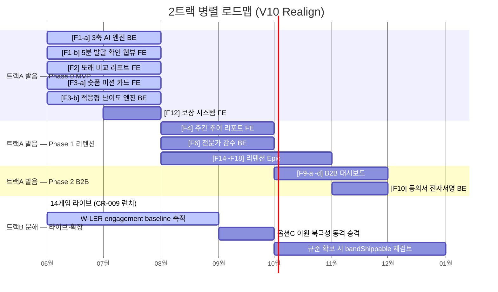

# Value Proposition Sheet (VPS) V10 — Two-Track Realign (2트랙 비대칭 재정렬판)
## 발음·발화 발달 확인(만 2~7세) + 읽기·말 놀이·연습(만 2~12세) 부모 가이드 서비스 (비의료)

> **문서 목적**: VPS V09(raw 39)가 도달한 "발음 단일트랙·측정 정점" 패러다임을, 라이브 문해 트랙(CR-2026-009, 만 2~12세, 14게임, 2026-06-22 공개 런치)을 포함하는 **2트랙 비대칭** 정본으로 재정렬한 신규 마스터 문서. PRD V11 / SRS V08 / Persona / 북극성 ADR 의 상위 근거.
> **작성 기준**: 2026-06-22 · 근거: `docs/realignment/00_2track_realignment_blueprint.md` (§3 트랙정의 · §6 VPS 스펙 · §7 근거맵 · §8 게이트)
> **불변 이력**: raw/39_VPS_V09(발음 단일트랙, 금칙어 만연)·raw/32_VPS_V08 은 **수정하지 않는다**. 본 문서는 신규 정본으로 신설하며 raw 의 측정·금칙어 카피를 신규 정본에서만 치환한다.

---

## 🔷 트랙 비대칭 선언 (본 문서의 최상위 불변 원칙)

> **"트랙A(발음)는 표준화 규준으로 또래를 비교해 '확인'하고, 트랙B(문해)는 점수·밴드·판정 없이 '놀이·연습'한다 — 측정 vs 측정이 아니다."**

| 항목 | **트랙A — 발음·발화 발달 "확인"** | **트랙B — 읽기·말 "놀이·연습"** |
|---|---|---|
| 연령 도메인 | 만 2~7세 (24~84개월, diagnose 상한) | 만 2~12세 (24~144개월, `lib/literacy/stages.ts`) |
| 산출 | 또래 비교 점수·백분위·추이 (**확인 허용**) | **engagement 만** (활동 횟수·활동일), `referenceBand=null` |
| 임상 토대 | 표준화 규준 (U-TAP PCC 절단점, SELSI ±SD) | 발달 단계·선행지표·중재 위계 (규준 차용 ✗) |
| 핵심 동사 | 확인 / 비교 / 추이 | 놀이 / 연습 / 함께 / 단계에 맞춰 |
| Phase 2 검증 상태 | 표준화 규준 보유 → 출시 가능 | **출시 밴드 0건**(`bandShippable=false` 전 단계) → 연습-only 유지 |

⚠️ **동사 분리 강제**: "확인(probe)·측정·평가·준비도 평가"는 **발음(트랙A) 전용**. 문해(트랙B)에는 절대 적용 금지. 트랙B 산출 명칭은 "활동률 / engagement"로만 — "완수율 / 미션"이 아니다.

---

## 목차

| Part | 섹션 | 내용 | 핵심 질문 |
|:---:|:---|:---|:---:|
| **Ⅰ** | §1 Problem-Solution Fit (2트랙 분기) | 트랙별 문제-해결-효과 매핑 | 왜 사는가? |
| **Ⅰ** | §2 종합 캔버스 (트랙별 포지셔닝·Lock-in 이원화) | 전략적 포지셔닝 및 핵심 가치 | 무엇을 파는가? |
| **Ⅰ** | §3 Proof (TAM 분리 + 연습 지속 가치) | 트랙별 시장 규모 및 기회 증명 | 증거가 있는가? |
| **Ⅱ** | §4 Job-Feature 매핑 보드 (트랙A 21 Epic + 트랙B 14게임) | 고객 Job → 가치 → 기능 | 무엇을 만드는가? |
| **Ⅱ** | §5 공통 설계 원칙 + 문해 4게이트 | 안전·규제 프로토콜 (2트랙) | 어떤 원칙으로? |
| **Ⅲ** | §6 로드맵 (2트랙 병렬 Gantt) | 트랙별 출시 경로 | 언제 만드는가? |
| **Ⅲ** | §7 GTM & UX Copy (트랙별 카피) | 페르소나별 커뮤니케이션 | 어떻게 소통하는가? |
| **Ⅳ** | §8 수익 구조 및 비즈니스 모델 | 과금 모델 및 시나리오 | 어떻게 버는가? |
| **Ⅳ** | §9 리스크 관리 및 방어 전략 | 법적·규제·품질·비대칭 리스크 | 어떻게 지키는가? |
| **부록** | 임상 근거 맵 + 자가점검 | 원문 대조 grounding | 근거는 어디에? |

---

# Part Ⅰ. 가치 제안 — 왜 사는가?

---

## §1. Problem-Solution Fit: 2트랙 분기 (문제-해결-효과 매핑)

### 1-1. 두 개의 모집단, 두 개의 Pain — 왜 단일트랙으로는 부족한가

V09 까지의 전략 문서는 **만 2~7세 발음 단일 모집단**을 전제로 "내 아이가 정상인지 5분에 수치로 확인"하는 측정 패러다임에 종속돼 있었다. 그러나 라이브 서비스는 두 개의 분리된 부모 Job 을 동시에 떠안고 있다.

- **트랙A 부모(만 2~7세)**: "우리 아이 발음이 또래만큼인지 알 수 없어 불안하다." → 표준화 규준 기반 **또래 비교 확인**으로 해소.
- **트랙B 부모(만 2~12세, 학령기 포함)**: "집에서 연령에 맞는 읽기·말 놀이를 무엇을 어떻게 이어줘야 할지 모르겠다." → 발달 단계에 맞춘 **읽기·말 놀이를 매주 꾸준히** 잇는 것으로 해소.

> **핵심 선언**: **문해는 진단하지 않는다. 연령에 맞는 읽기·말 놀이를 매주 이어가게 한다.** 트랙B 의 가치는 "측정 충격"이 아니라 "연습 지속"이다.

### 1-2. 트랙A — 발음 4대 Pain (V09 계승 · 금칙어 치환)

> 근거: 문제정의서 통합본 · JTBD 분석. V09 §1-2 의 4대 Core Pain 을 CON-04 금칙어("진단/치료/장애") 치환하여 계승.

| 문제 클러스터 | 핵심 Pain | 현상 및 결과 (CON-04 치환 반영) |
|:---|:---|:---|
| **A-① 발달 확인 기준의 부재** | 부모의 불안감 증폭 | 또래 대비 발음 발달 위치를 즉시 알려주는 도구가 없어, 맘카페의 파편화된 경험담에 의존하며 '우리 아이 발음이 또래만큼인지' 끊임없이 확인하고 싶어함 |
| **A-② 대기 기간의 공백** | 대기 중 막막함 | 센터 상담까지 평균 3~6개월이 걸려, 발음 발달이 활발한 시기에 집에서 무엇을 해야 할지 막막함 |
| **A-③ 홈 가이드의 비표준화** | 지속 동력 상실 | 부모가 자의적으로 연습을 이어가도 발달 정도가 정리되지 않아 금세 지치고, 향후 전문가에게 기록으로 연계하지 못함 |
| **A-④ 기관의 소통 부담** | 학부모와의 소통 어려움 (B2B) | 보육 교사가 발음 발달의 어려움을 발견해도 객관적 근거가 없어, 학부모와의 소통에 부담을 느낌 |

### 1-3. 트랙B — 신설 Pain P5 (읽기·말 활동의 공백)

> 근거: 청사진 §5 트랙B 페르소나 · opportunity-quadrants Pain "E. 읽기·말놀이 방법 부재".

| 문제 클러스터 | 핵심 Pain | 현상 및 결과 |
|:---|:---|:---|
| **B-⑤ 읽기·말 활동의 공백** | "집에서 뭘 어떻게 놀아줘야 할지 모름" | 자녀의 연령·발달 단계에 맞는 읽기·말 놀이가 무엇인지 모르고, 시중 자료는 학년·점수 프레임이라 부담스러움. **무엇을 측정하고 싶은 게 아니라, 무엇을 함께 놀지를 알고 싶음** |

> ⚠️ **B-⑤ 의 산출은 "공백을 메우는 활동 제공"이지 "공백을 측정한 결과"가 아니다.** 트랙B Pain 서술에 점수·밴드·또래비교·정상/위험 어휘 0건.

### 1-4. 트랙별 JTBD 선언문

#### 🎯 트랙A — 발음 확인형 (만 2~7세)
> **When** 다른 아이들과 비교하며 우리 아이 발음이 또래만큼인지 궁금하고 막막할 때,
> **I want to** 또래 대비 우리 아이의 발음 발달 위치를 객관적으로 **확인**하고 싶고,
> **So I can** "지금 무엇을 집에서 함께하면 되는지" 방향을 잡고 즉시 시작할 수 있다.

#### 🎯 트랙B-1 — 학령전 읽기준비형 (만 5~7세)
> **When** 취학을 앞두고 우리 아이가 읽기를 잘 시작할 수 있을지 마음이 쓰일 때,
> **I want to** 발달 단계에 맞는 음운인식·해독 **놀이**를 집에서 매주 꾸준히 이어주고 싶고,
> **So I can** 아이가 부담 없이 읽기·말에 친해지도록 도울 수 있다.
> *(주의: "준비됐는지 측정/확인"이 아니라 "읽기에 친해지는 놀이를 잇는다" — 트랙B 는 측정하지 않는다.)*

#### 🎯 트랙B-2 — 학령기 읽기 따라가기형 (만 8~9세)
> **When** 받아쓰기·소리내어 읽기가 아직 익숙하지 않은 우리 아이를 학교 진도 부담 없이 도와주고 싶을 때,
> **I want to** 집에서 발달 단계에 맞는 읽기·말 **놀이·연습**을 꾸준히 이어주고 싶고,
> **So I can** 점수나 판정 없이도 아이가 읽기·말에 자신감을 붙이도록 함께할 수 있다.

> ⚠️ **트랙B JTBD 검증 가드**: 트랙B 의 So I can 종착점은 **놀이 지속**이다 — "판정·등급·또래 위치 확인"이 아니다(청사진 §5 페르소나 여정 종착 = 놀이 지속).

---

## §2. 종합 캔버스 (트랙별 포지셔닝 · Lock-in 이원화)

### 2-1. 핵심 포지셔닝 (Core Positioning)

| 항목 | **트랙A — 발음 확인** | **트랙B — 읽기·말 놀이·연습** |
|:---|:---|:---|
| **핵심 모집단** | 발음 발달이 걱정인 만 2~7세 자녀의 부모 | 읽기·말 발달을 집에서 함께하고픈 만 2~12세(학령기 포함) 자녀의 부모 |
| **솔루션 핵심 제안** | "또래 대비 우리 아이 발음 발달 위치를 확인하고 집에서 함께할 방향을 잡으세요" | "발달 단계에 맞춘 읽기·말 놀이를 집에서 매주 꾸준히 이어가세요" |
| **가치 동력** | 발달 확인 → 가이드 → 추이 | 연습 지속 → 습관 → engagement |
| **금칙어 게이트** | "확인/또래 비교" 허용(표준화 규준 근거) | 점수·밴드·또래백분위·판정·"측정/평가/확인" **0건** |

### 2-2. 차별적 가치 (트랙별 재배치)

**트랙A — 발음 확인**
1. **발달 확인의 직관성**: 또래 대비 발음 발달 위치를 부모가 이해하기 쉬운 형태로 제시 (표준화 규준 grounding, 단 앱을 해당 검사로 칭하거나 규준·타당도를 주장하지 않음 — §부록 가드).
2. **추이의 가시화**: 연속된 발음 발달 궤적으로 가족이 함께 변화를 본다.
3. **안전의 극한 (Human-in-the-Loop)**: 전문가 비동기 감수로 자동 분석을 보정.

**트랙B — 읽기·말 놀이·연습**
1. **발달 단계 정합 놀이**: 5단계 사다리(S0~S4, `stages.ts`)에 맞춰 14개 놀이를 연령에 맞게 라우팅. 학년·점수가 아닌 **놀이명**으로만 제시.
2. **꾸준함의 가시화 (engagement)**: 주간 리포트에 활동 횟수·활동일·단계별·놀이별 분포만 표시(`aggregateLiteracyWeekly` — `totalSessions`·`activeDays`·`byStage`·`byGame`). 점수·등급 0.
3. **부담 제로 톤**: 정상/위험·또래 비교가 없어 부모가 "측정당한다"는 압박 없이 매주 이어간다.

### 2-3. Lock-in 이원화 (Switching Cost)

| 트랙 | Lock-in 동력 | 메커니즘 |
|:---|:---|:---|
| **트랙A** | **발음 발달 궤적 데이터 해자** | 연속된 발음 발달 추이가 누적될수록 부모가 과거 궤적을 잃기 싫어 지속 |
| **트랙B** | **발달 단계 연속 활동·습관(engagement)** | 단계별 놀이 활동이 주 단위로 누적되며 습관이 형성 → engagement 기반 리텐션 (점수 궤적 아님) |

> ⚠️ 트랙B Lock-in 서술은 "점수가 쌓여 이탈 못 함"이 아니라 **"활동 습관이 쌓인다"** — 데이터 해자 프레임을 트랙B 로 전이 금지.

---

## §3. Proof (TAM 분리 · 트랙별 기회)

### 3-A. 트랙A — 발음 (TAM-SAM-SOM)

> 근거: V09 §3 TAM-SAM-SOM 계승. 발음 모집단(만 2~7세).

- **TAM**: 국내 만 2~7세 영유아 가구 (V09 기준 약 150만 가구).
- **SAM**: 발음·언어 발달에 관심·우려가 있는 잠재 수요층 (V09 기준 약 22.5만 가구).
- **SOM**: 디지털 수용성·지불의사 높은 핵심 타깃 (V09 기준 약 15만 가구).

### 3-B. 트랙B — 문해 (연령 확장 + 연습 지속 가치)

> 근거: 청사진 §3 — 문해 TAM 분리, 연습 지속 가치, 만 2~4 규준 빈약·자체 파일럿 필요 명시.

- **모집단 확장**: 트랙B 는 학령기(만 8~12세)를 포함해 **만 2~12세**로 연령 도메인이 발음(≤84개월)보다 넓다. 발음-only 모집단에 학령기·문해-only 가정이 더해진다.
- **가치 = 연습 지속**: 트랙B 의 시장 가치는 "측정 수요"가 아니라 **"발달 단계에 맞는 놀이를 매주 이어가는 지속 가치"**다. 따라서 가치 증명 지표는 점수 향상이 아니라 **engagement(활동률·활동일)**.
- ⚠️ **규준 한계 명시**: 외부 임상 KB 는 만 5~7세 grounding 은 강하나 **만 2~4세 정상 규준이 빈약**하다(읽기-선행지표 발달규준 §2 연령 비대칭). 트랙B 하단부에 절단점·정상 범위를 둘 근거가 없으므로 **연습-only 가 임상적으로 정당**하며, 정량 밴드는 자체 파일럿 + 정식 규준 확보 전까지 미산출.

### 3-C. 북극성 — 2트랙 비대칭 지표 (옵션 C 지향 · A 1차)

> source of truth: 트랙A `lib/reports/waur-trend.ts` (`W_AUR_MIN_MISSIONS=4`, `W_AUR_TARGET_RATE=0.6`) / 트랙B `lib/reports/literacy-weekly.ts` (`aggregateLiteracyWeekly` → engagement). 청사진 §4 결정 = **옵션 C 지향, 옵션 A 1차 착지**.

| 트랙 | 북극성 지표 | 정의 | 산식 source |
|:---|:---|:---|:---|
| **트랙A** | **W-AUR (주간 발음 미션 완수율) ≥ 60%** | 분자 = 그 주 발음 미션 완료 ≥ 4 인 distinct 사용자 / 분모 = 진단 ∪ 미션 활성 distinct 사용자 | `computeWaurForWeek` (불변) |
| **트랙B** | **W-LER (주간 문해 활동률, engagement)** — 보조지표 신설 | 활동일·활동 횟수 기반 주간 문해 **활동률** (완수율 아님) — baseline 축적 후 트랙A 와 동격 북극성 승격(옵션 C) | `aggregateLiteracyWeekly`(`activeDays`·`totalSessions`) + 신설 집계 함수 1개 |

> ⚠️ **북극성 가드**: ① 트랙B 지표명·카피는 "활동률 / engagement"로만 — **"완수율 / 미션" 프레임 금지**. ② W-LER target ≥60% 무근거 차용 금지 — 연습-only 자연 빈도가 발음 미션과 달라, 옵션 A 로 baseline 측정 후 target 산정. ③ W-LER 임계는 lib 상수 1곳(`W_LER_MIN_DAYS`/`W_LER_MIN_SESSIONS`)에 박고 owner 페이지·테스트가 참조 → 정의 표류 차단.

---

# Part Ⅱ. Job-Feature 매핑 — 무엇을 만드는가?

---

## §4. Job-Feature 매핑 보드 (트랙A 21 Epic + 트랙B 14게임)

### 4-A. 트랙A — 발음 21 Epic (V09 계승 · 금칙어 치환)

> V09 §4 의 21개 Epic 골격을 단일 책임(BE/FE) 기준으로 계승하되, CON-04 금칙어를 신규 정본에서 치환한다(raw 39 불변). 치환 원칙: "진단"→"발달 확인", "치료"→"발달 가이드/센터 케어", "장애"→"어려움", "스크리닝"→"발달 확인 리포트".

#### 🥇 Phase 0 — MVP 코어 (6 Epic)

| 트랙 | 핵심 Job | Epic | 단일 책임 | 비고 (금칙어 치환) |
|:---:|:---|:---|:---:|:---|
| A | 발달 확인 (엔진) | **[F1-a] 3축 AI 음성 분석 엔진** | Backend | 언어(TTR·MLU)/조음(음소 정밀)/음향 3축. 표준화 규준 grounding (앱을 해당 검사로 칭하지 않음) |
| A | 발달 확인 (화면) | **[F1-b] 무로그인 5분 발달 확인 웹뷰** | Frontend | "5분 발달 확인"(← '5분 진단'). 면책 동의 게이트 |
| A | 또래 비교, 가시화 | **[F2] 또래 비교 및 발달 확인 리포트** | Frontend | 백분위·음소 핀셋 (← '진단 리포트'). 불안 완화 넛지 |
| A | 구체적 연습 (화면) | **[F3-a] 1분 숏폼 미션 카드 UI** | Frontend | 중립 캐릭터·이중 보상 |
| A | 구체적 연습 (로직) | **[F3-b] 적응형 난이도 조절 엔진** | Backend | 은밀한 난이도 라우팅 |
| A | 연습 지속 동기 | **[F12] 게이미피케이션 보상 시스템** | Frontend | 즉각(AI 드로잉)+누적(나무) 통합 |

#### 🥈 Phase 1 — 리텐션·바이럴 (10 Epic)

| Epic | 단일 책임 | 비고 (금칙어 치환) |
|:---|:---:|:---|
| **[F4] 주간 발달 추이 리포트** | Frontend | 음소 단위 성장 추적 |
| **[F5] 카카오톡/SNS 공유** | Frontend | 성취 뱃지 |
| **[F6] 비동기 전문가 코멘트** | Backend | HITL 감수 (자동 분석 보정 안전망) |
| **[F7] 센터 제출용 PDF 내보내기** | Frontend | "센터 케어" 연계 (← '치료사 연계') |
| **[F11] 부모 목소리 복제 동화** | Backend | 일방향 콘텐츠만, 교정 연습 미적용 |
| **[F14] 거울 모드 (입 모양 카메라)** | Frontend | 시각적 발음 보조 |
| **[F15] LLM 대화형 발화 유도 챗봇** | Backend | 중립 캐릭터, 유도만 |
| **[F16] 오프라인 일반화 푸시 알림** | Backend | 일상 전이 |
| **[F17] 통합 케어로그 (센터+앱)** | Frontend | "센터 케어" 기록 통합 |
| **[F18] 발달 예측 시뮬레이션** | Backend | 구독 연장 트리거 |

#### 🥉 Phase 2 — B2B 스케일업 (5 Epic)

| Epic | 단일 책임 | 비고 (금칙어 치환) |
|:---|:---:|:---|
| **[F9-a] 원장용 대시보드 UI** | Frontend | 발달 확인 리포트 (← '스크리닝'). 오피스 툴 톤 |
| **[F9-b] Zero-touch 화자분리 수집** | Backend | 교사 [발송 승인]만 |
| **[F9-c] 원아 일괄등록·동의서 발송** | Backend/API | 데이터 수집 동의 |
| **[F9-d] AI 쿠션어 알림장 + 명의 커스텀** | Frontend | 부드러운 화법 초안 |
| **[F10] 학부모 동의서 자동 생성/서명** | Backend/API | 카카오 전자 서명 |

> **트랙A Epic 합계 = 21개** (Phase 0: 6 / Phase 1: 10 / Phase 2: 5 — V09 §4-6 합계 정합).

### 4-B. 트랙B — 문해 14게임 (S0~S4 라우팅 · 산출 = engagement)

> source of truth: `lib/literacy/registry.ts`(`LITERACY_GAMES` 실측 **14개**) + `lib/literacy/stages.ts`(5단계). **트랙B 는 발음 엔진의 bolt-on 이 아니라 독립 Epic.** 각 게임의 **산출 = engagement(완료=1, 활동 1건)**, `referenceBand=null`, 단계 전부 `bandShippable=false`.

#### 트랙B 라우팅 구조 (`/literacy/start` → 월령 → 단계 → 놀이)

월령(24~144개월) → 발달 단계(S0~S4) → 해당 연령에 **실제 적격**(`isAgeEligible`)인 놀이를 라우팅. **연령 라우팅은 stage 태그가 아니라 게임 자체 연령게이트(`enabledGamesForAge`)로** 한다(dead-end 방지). 학년·단계 라벨 대신 **놀이명만** 부모·자녀에게 노출(clin-2).

| 단계 | 단계명 (놀이 친화) | 연령 라벨 | 핵심 구인 | 해당 놀이 (14게임 중) |
|:---:|:---|:---|:---|:---|
| **S0** | 발현적 문해 | 만 2~4세 | 어휘·음절 음운인식·인쇄물 개념·듣기이해·이야기 듣기 | 📚 낱말 놀이(vocabulary) · 🔊 소리 따라 말하기(nonword-repetition) · 📖 이야기 놀이(narrative) |
| **S1** | 읽기 입문 | 만 5~6세(취학 전) | 음소 음운인식·자소-음소 대응·글자/단어 인지·RAN | 🎵 소리 놀이(phonological-awareness) · 🔡 소리 내어 읽기(decoding) · ⚡ 빨리 이름대기(ran) |
| **S2** | 해독·철자 | 초1~2 | 해독(음운규칙)·단어재인 자동화·철자·받아쓰기 | 🔁 소리 변신 놀이(phono-rules) · ✏️ 받아쓰기 놀이(spelling) · 📣 소리 규칙 읽기(read-rules) |
| **S3** | 유창성·이해 | 초3~4 | 읽기유창성·사실적 읽기이해 | 📃 또박또박 읽기(reading-fluency) · 📖 글 읽고 답하기(reading-comprehension) |
| **S4** | 읽기로 배우기 | 초5~6 | 추론·평가 읽기이해·형태소인식·어휘 심화·이야기쓰기 | 💭 생각 나누기(inference) · 🔎 숨은 뜻 찾기(inference-reading) · 🧩 낱말 조각 놀이(morphology) |

> ⚠️ **stage 태그 ≠ 연령게이트**: 일부 게임은 구인 기준 stage(예: 생각 나누기 = S4 구인)와 실제 연령게이트(만 5~7 입문판)가 다르다. 표의 단계는 **구인 분류·표시용**이며, 실제 노출은 게임 자체 `isAgeEligible` 가 결정한다(`registry.ts` 주석 정합). 플래그 off 게임은 허브 목록에서 제외(미공개 콘텐츠 누출 0).

#### 트랙B 산출 명세 (연습-only)

- **활동 단위 산출**: 놀이 1회 완료 = 활동 1건. raw 점수(정답수·완료시간 ms·완료 1)는 놀이마다 의미가 달라 **교차 합산 무의미** → 정확도 합산 ✗.
- **주간 집계**: `aggregateLiteracyWeekly` 가 `totalSessions`(총 횟수)·`activeDays`(활동일)·`byStage`(단계별 횟수)·`byGame`(놀이별 횟수)만 산출. **점수 등급·판정·임상 밴드 미산출.**
- **밴드 미노출**: `referenceBand=null` · 전 단계 `bandShippable=false` → 참고밴드(display) 노출하지 않음. (raw 점수·HITL·escalation·저장은 본 모델과 무관한 별도 활동 — display 레이어만 연습-only.)

---

## §5. 공통 설계 원칙 (안전·규제 프로토콜)

### 5-1. 공통 3원칙 (양 트랙)

1. **의료적 판단 분리 (Disclaimer)**: 모든 결과 화면에 "본 서비스는 의료적 판단이 아닌 부모 정보 제공용 보조 도구"임을 명시.
2. **데이터 수집 합법화**: 아동 음성·활동 데이터 수집을 위한 법정대리인 동의 프로세스 내장.
3. **Human-in-the-Loop 감수 (트랙A, Phase 1+)**: 발음 자동 분석의 품질 리스크를 전문가 비동기 감수로 보정.

### 5-2. 트랙B 문해 4게이트 (연습-only 불변)

> 청사진 §8 컴플라이언스 게이트 · `stages.ts` 임상 게이트 주석 정합. **4게이트 전부 통과 상태에서만 트랙B 콘텐츠가 부모에게 노출된다.**

| # | 게이트 | 내용 | 코드 정합 |
|:---:|:---|:---|:---|
| **G1** | **연습-only** | 점수·밴드·또래백분위·정상/위험 판정·심각도·"측정/평가/확인(probe)" **0건**. 산출 = engagement 만 | `referenceBand=null`, `bandShippable=false`(전 단계) |
| **G2** | **비복제** | NISE-B·ACT/KOLRA/REVT/U-TAP 의 문항·지문·규준·명칭 복제 금지 — 구인·발달 사실·중재 위계만 영감 | 자체 작성 콘텐츠 |
| **G3** | **플래그 게이팅** | 각 게임은 default off, 활성 플래그 on 일 때만 허브 노출. 미공개 콘텐츠 누출 0 | `isEnabled()` / `enabledLiteracyGames()` |
| **G4** | **연령 도메인 분리** | 발음 규준 ≤84개월 / 문해 24~144개월 — 서로 오염 금지 | `LITERACY_AGE_MIN/MAX_MONTHS`(24/144), diagnose 84 독립 |

> ⚠️ **금칙어 게이트(CON-04)**: 양 트랙 공통 "치료/진단/장애" 0건 + **문해 추가 금칙어 "학습장애·난독·읽기장애·지연·지체" 0건** → "읽기·말 놀이/연습", "발달 단계에 맞춘 연습", "읽기·말이 아직 익숙해요"로만. **"읽기·말 발달 확인" 표기 금지 — "확인(probe)"은 발음(트랙A) 전용.**

---

# Part Ⅲ. 로드맵 · GTM — 언제, 어떻게?

---

## §6. 로드맵 (2트랙 병렬 Gantt)

> 트랙A(발음 21 Epic)와 트랙B(문해 14게임)는 **병렬 트랙**으로 진행한다. 트랙B 는 코드 레이어가 이미 라이브(2026-06-22 런치)이므로, 로드맵은 트랙B engagement baseline 축적 + 트랙A Epic 확장을 병행한다.

### 로드맵 핵심 마일스톤
1. **트랙A M+3 (Phase 0)**: 발음 발달 확인 미끼 + 미션 + 보상으로 첫 주 리텐션 검증.
2. **트랙B (라이브)**: 14게임 이미 라이브 → **W-LER engagement baseline 을 수 주 축적**(옵션 A 1차). baseline 확보 후 옵션 C(이원 북극성 동격)로 승격.
3. **트랙B bandShippable 재검토 (조건부)**: KOLRA·BASA-R 정식 매뉴얼 규준표 확보 또는 NISE 2026 표준화 최종규준 발표 시에만 재검토 — 그 전까지 **전 단계 연습-only 유지 확정**(`stages.ts` 주석 정합).

---

## §7. GTM & UX/UI Copy (트랙별 카피)

> ⚠️ **카피 비대칭 강제**: 트랙A = "확인" 톤(또래 비교 허용). 트랙B = "놀이·꾸준함" 톤 — **점수·등급·또래 비교·"측정/평가/확인" 0건**.

### 7-1. 트랙A — 발음 확인 카피

| 타깃 | 헤드라인 | 서브카피 |
|:---|:---|:---|
| **발음 확인형 부모(만 2~7세)** | "5분 발달 확인으로, 우리 아이 발음 발달 위치를 확인하세요" | 판정이 아닙니다. 또래 대비 발음 발달 위치를 알기 쉽게 알려드려요. |
| **대기 중 부모** | "기다리는 시간을 집에서 함께하는 시간으로" | 센터 상담 전에도 지금 집에서 시작할 수 있는 발음 발달 가이드. |
| **기관(원장/교사)** | "데이터로 부드럽게 소통하세요" | 학부모 소통을 돕는 기관용 발음 발달 확인 리포트. |

### 7-2. 트랙B — 읽기·말 놀이·연습 카피

| 타깃 | 헤드라인 | 서브카피 |
|:---|:---|:---|
| **학령전 읽기준비형(만 5~7세)** | "발달 단계에 맞춘 읽기·말 놀이, 매주 꾸준히" | 점수도 등급도 없어요. 우리 아이 연령에 맞는 놀이를 함께 이어가요. |
| **학령기 읽기 따라가기형(만 8~12세)** | "학교 진도 부담 없이, 집에서 읽기·말 놀이로 꾸준히" | 받아쓰기·소리내어 읽기가 아직 익숙하지 않아도 괜찮아요. 놀이로 함께 연습해요. |
| **놀이·기록형(만 2~4세)** | "그림책과 말놀이로 글자·이야기에 친해져요" | 매주 활동한 놀이와 활동일을 함께 기록해 꾸준함을 응원해요. |

> ⚠️ 트랙B 카피 자가 가드: "62점→71점", "또래 상위 N%", "준비도 평가", "읽기 수준 확인" 같은 표현 **사용 금지**. engagement(활동 횟수·활동일) 표현만 허용 — "이번 주 5번, 3일 활동했어요".

---

# Part Ⅳ. 비즈니스 실행 — 어떻게 버는가? · 어떻게 지키는가?

---

## §8. 수익 구조 및 비즈니스 모델

> V09 §11 의 과금 모델을 계승하되, 트랙B(문해) 의 수익 가정은 **engagement 기반 리텐션**(점수 증명이 아님)으로 재프레임한다. 트랙별 LTV/CAC 정밀화는 파일럿 실측 의존(청사진 — Unit-Economics 는 별도 P2 졸업 대상).

### 8-1. 과금 모델 (Freemium + Tiered Subscription)

- **Lead-Gen (무료)**: 트랙A 발음 발달 확인(1회) + 또래 비교 리포트 / 트랙B 문해 놀이 일부 체험.
- **Basic (월 35,000원)**: 트랙A 주간 맞춤 미션 + 자동 분석 리포트 + 발달 추이 / 트랙B 전체 놀이 + 주간 engagement 리포트.
- **Premium (월 50,000원)**: Basic + 트랙A 전문가 비동기 코멘트.
- **B2B 기관용 (연 500,000원)**: 기관용 발달 확인 대시보드 라이선스 (Phase 2, 트랙A 중심).

### 8-2. 트랙별 수익 동력 (비대칭)

| 트랙 | 수익 동력 | Lock-in | 비고 |
|:---|:---|:---|:---|
| **트랙A** | 발음 발달 확인 → 구독 전환 → 추이 데이터 리텐션 | 발달 궤적 데이터 해자 | V09 캐시카우 모델 계승 |
| **트랙B** | 연령 확장(만 2~12)으로 모집단 확대 → **engagement 기반 리텐션** | 발달 단계 연속 활동 습관 | ⚠️ "점수 증명 리텐션" 아님 — 활동 지속이 리텐션 동력 |

> ⚠️ 트랙B 수익 서술 가드: "점수가 올라서 재결제", "성적표로 증명" 프레임을 트랙B 로 전이 금지. 트랙B 의 재결제 동력은 **활동 습관의 지속**이다.

---

## §9. 리스크 관리 및 방어 전략

- **규제 리스크 (의료법/DTx)**: "비의료/교육용" 카테고리로 운영. UI 내 Disclaimer 강제. 약관·처리방침은 트랙B 를 "놀이·연습" 동사로 분리 서술(법무 재확인 = 2026-06-22 사용자 완료, 게이트 해소).
- **측정 프레임 회귀 리스크 (최상위)**: 트랙A 의 또래 백분위·"확인" 프레임이 트랙B 로 전이되면 연습-only 위반. 외부 KB 원문의 임상 라벨(학습장애·난독 등) 카피 직수입 = CON-04 상시 위험 → 정량치 표면화 전 .ingest 원문 대조 강제.
- **북극성 비대칭 평탄화 리스크**: 통합 단일 rate(옵션 B) 채택 시 트랙B 에 "완수/미션" 프레임 전이 + 발음 W-AUR 시계열 단절 → **옵션 C 지향·A 1차로 회귀 0 유지**. W-LER target ≥60% 무근거 차용 금지.
- **전환 퍼널 리스크**: 랜딩 2트랙화(단일 히어로+CTA 2개 vs 도메인 스플릿) 미결 → A/B 테스트 권장. "대상 연령 2-12" 단일 숫자는 오독 유발 → 트랙별 분할 표기 필수.
- **스코프 충돌 (해소)**: ADR-04 영유아-only 스코프 vs 만 8~12 학령기 콘텐츠 → **"학령기 문해 놀이 콘텐츠 = In-Scope / 문해 점수화·학년 판정·고학년 읽기이해 측정 = 여전히 회피"**로 경계 명문화하여 해소(청사진 §5 openDecision).

---

## 부록 A. 임상 근거 맵 (원문 대조)

> 청사진 §7 근거맵 범위 내. 모든 정량치는 .ingest/txt 원문 검증분만 인용하며, 본 VPS 는 **새 정량치를 표면화하지 않는다**(구조·발달 사실만 활용).

| 트랙 주장 | 근거 출처 | 대조 상태 | 과장 금지 가드 |
|:---|:---|:---|:---|
| 발음 = 표준화 규준으로 또래 비교 "확인" | U-TAP/U-TAP2 PCC, SELSI ±SD | 내부 정본(명칭·규준 복제 금지) | 앱을 해당 검사로 칭하거나 규준·타당도 주장 금지 |
| 음운인식 위계: 운율→단어→음절→음소 | .ingest S003 (이차숙 1999) | 검증완료 | — |
| 음운처리 3요소(음운인식+음운기억+RAN) 독립 예측 | .ingest S090·S133 | 검증완료 | 단일 놀이가 다른 축 향상 보증 단정 금지 |
| 읽기이해 = 해독 × 언어이해(SVR) | wiki 해독.md (S090) | 요약 검증 | 정량치 신규 이식 시 원문 대조 필수 |
| 만 2~4세 정상 규준 빈약 → 연습-only 정당 | 읽기-선행지표 발달규준 §2 | 검증완료 | 연구표본·예비검사를 규준으로 둔갑 금지 |

**공통 가드**: 요약↔원문 충돌 시 **원문 우선**. NISE-B·ACT/KOLRA/REVT/U-TAP 문항·지문·규준·명칭 복제 금지 — 구인·발달 사실·중재 위계만 영감.

---

## 부록 B. CON-04 / 연습-only 자가점검

### B-1. CON-04 금칙어 점검 (본 문서 본문 카피)
- 공통 금칙어 "치료/진단/장애": 본문 **신규 카피 0건**. (raw V09 의 '5분 진단'→'5분 발달 확인', '진단 리포트'→'발달 확인 리포트', '스크리닝'→'발달 확인 리포트', '치료사 연계'→'센터 케어 연계'로 전량 치환.)
- 문해 추가 금칙어 "학습장애·난독·읽기장애·지연·지체": 본문 **0건** (대안 "읽기·말 놀이/연습", "아직 익숙하지 않아요"만 사용).
- ※ 본 부록·§5·선언부에서 금칙어를 **언급하는 경우는 "금지 대상 명시"** 목적이며 제품 카피가 아님.

### B-2. 연습-only(트랙B) 점검
- 트랙B 산출: engagement(활동 횟수·활동일·단계별·놀이별 분포)만 — 점수·밴드·백분위·판정 **0건**. `referenceBand=null`·`bandShippable=false` 명문.
- 트랙B 동사: 놀이/연습/함께/단계에 맞춰만 — **"확인(probe)/측정/평가" 미적용**(발음 전용 분리 확인).
- 학년/단계 라벨 대신 **놀이명** 노출(clin-2) 명문.
- 북극성 트랙B: "활동률/engagement"로만 — "완수율/미션" 프레임 **0건**.

### B-3. 연령 도메인 분리 점검
- 발음 규준 ≤84개월 / 문해 24~144개월 — 본문 전반 분리 유지, 상호 오염 0건.

> **자가점검 결론**: CON-04 PASS · 연습-only PASS · 연령 도메인 분리 PASS · 비대칭(확인 vs 놀이) 선언 일관 유지.

---
*본 문서는 `docs/realignment/00_2track_realignment_blueprint.md` (§3·§6·§7·§8)를 근거로, VPS V09(발음 단일트랙)를 2트랙 비대칭 정본으로 재정렬한 신규 마스터다. raw/ 과거 버전은 불변 이력으로 보존한다. (작성일: 2026-06-22)*
