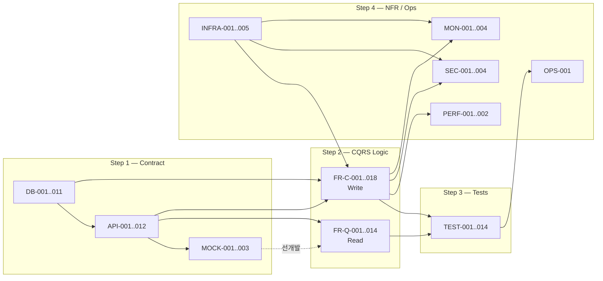

# Task Breakdown 명세서 — SRS V06 (Next.js Full-stack)

| 항목 | 값 |
|:---|:---|
| 원본 SRS | `From PRD to SRS/65_SRS_V06_Nextjs_Fullstack_Final.md` |
| SRS Revision | 3.0 (V05 Next.js Full-stack Edition, 2026-05-08) |
| 추출 방법론 | Contract-First → CQRS(Read/Write 분리) → AC→TDD 변환 → NFR/Infra/Dependency |
| Tech Stack | Next.js 15 App Router · Vercel · Supabase(PostgreSQL+pgvector) · Vercel AI SDK + Gemini · Tailwind+shadcn/ui · PWA+Capacitor |
| 총 태스크 수 | 88 (DB 11 · API 12 · MOCK 3 · FR-Read 14 · FR-Write 18 · Test 14 · NFR/Infra/Sec/Mon 16) |
| 복잡도 표기 | H = 높음(2주+) · M = 중간(3~10일) · L = 낮음(1~3일) |
| 단일 진실 공급원(SSOT) | DB 스키마 → API DTO → Mock → Feature → Test → NFR 순으로 의존 |

> **추출 원칙 (사전 합의):**
> 1. **계약 우선:** Feature 보다 DB 스키마와 API DTO를 먼저 고정한다.
> 2. **상태 변경 분리(CQRS):** 같은 도메인이라도 Read(Query)와 Write(Command)는 별 태스크로 격리한다.
> 3. **AC → 테스트 코드:** 인수 조건은 단위/통합 테스트 태스크로 변환하여 자동화 피드백 루프를 만든다.
> 4. **UI/UX는 별도 트랙:** 본 명세서는 백엔드/프론트엔드 개발 + 인프라만 다루며, 디자인 시안 작업은 제외한다.

---

## 1. Step 1 — 계약 및 데이터 명세 Task (DB · API · Mock)

### 1-A. Database / Schema Task

| Task ID | Epic (도메인) | Feature (기능명) | 관련 SRS 섹션 | 선행 태스크 | 복잡도 |
|:---|:---|:---|:---|:---|:---:|
| **DB-001** | Foundation | Prisma + Supabase 프로젝트 부트스트랩 (`schema.prisma`, env 분리, dev=SQLite/prod=PostgreSQL) | 1.5.1 C-TEC-003, 6.4 Tech Stack | None | M |
| **DB-002** | User | `users` 테이블 스키마 + 마이그레이션 (id UUID, role enum: parent/teacher/principal/expert/admin, child_age_months, subscription_tier, created_at) | 6.1 ERD, REQ-NF-019 | DB-001 | L |
| **DB-003** | Institution | `institutions` 테이블 (id, name, principal_name, consent_status, logo_uri) + `users.institution_id` FK | 6.1 ERD, F9-a | DB-001 | L |
| **DB-004** | Session | `session_logs` 테이블 + pgvector 확장 활성화 (audio_vector_uri 컬럼) | 6.1 ERD, REQ-FUNC-005, CON-03 | DB-002 | M |
| **DB-005** | Diagnosis | `evaluation_results` 테이블 (3축 점수, peer_percentile, confidence, hitl_reviewed, ai_cushion_text) | 6.1 ERD, REQ-FUNC-002 | DB-004 | L |
| **DB-006** | Mission | `mission_cards` 테이블 (target_phoneme, difficulty_level, reward_type) + 시드 데이터 | 6.1 ERD, REQ-FUNC-015 | DB-001 | L |
| **DB-007** | Report | `weekly_reports` 테이블 (week_number, score_trend jsonb, predicted_next_score, generated_at) | 6.1 ERD, REQ-FUNC-027 | DB-005 | L |
| **DB-008** | Reward | `reward_progress` 테이블 (cumulative_stars, tree_growth_level, ai_drawing_count) | 6.1 ERD, REQ-FUNC-025 | DB-002 | L |
| **DB-009** | HITL | `hitl_queue` 테이블 (session_id, confidence_score, status, assigned_expert_id, sla_due_at, expert_comment) — ERD 외 추가 도출 | 3.5, REQ-FUNC-HITL-001~003, 3.6.2 | DB-005 | M |
| **DB-010** | Consent | `consent_signatures` 테이블 (institution_id, parent_id, signed_at, expires_at, kakao_link_id) — ERD 외 추가 도출 | REQ-FUNC-059~061, 3.6.3 | DB-003 | L |
| **DB-011** | Security | Supabase RLS 정책 + Row-level Audit Log (역할별 분리) | REQ-NF-019 | DB-002, DB-003, DB-009 | H |

### 1-B. API / Contract (Server Action · Route Handler) Task

| Task ID | Epic (도메인) | Feature (기능명) | 관련 SRS 섹션 | 선행 태스크 | 복잡도 |
|:---|:---|:---|:---|:---|:---:|
| **API-001** | Diagnosis | `analyzeDiagnosis()` Server Action DTO 정의 (입력: audioBlob/월령/타겟음소, 출력: 3축점수·백분위·confidence) + Zod 스키마 | 3.5, REQ-FUNC-001~003 | DB-005 | M |
| **API-002** | Mission | `getCurriculum()` Server Action DTO (입력: 세션이력, 출력: 추천 missionId·난이도) + Zod | 3.5, REQ-FUNC-022 | DB-006 | L |
| **API-003** | Report | `getWeeklyReport()` Server Action DTO (입력: userId/weekNumber, 출력: 집계·추이 JSON) | 3.5, REQ-FUNC-027 | DB-007 | L |
| **API-004** | Reward | `grantReward()` Server Action DTO (입력: userId/rewardType/amount) + 멱등성 키 | 3.5, REQ-FUNC-025 | DB-008 | L |
| **API-005** | HITL | `app/api/hitl/queue` (POST) Route Handler 계약 + 에러코드(400/409/500) | 3.5, REQ-FUNC-003, HITL-001 | DB-009 | M |
| **API-006** | HITL | `app/api/hitl/comment` (PATCH) Route Handler 계약 + 권한 검증 | 3.5, REQ-FUNC-032, HITL-003 | DB-009, DB-011 | M |
| **API-007** | B2B | `app/api/b2b/approval` (PATCH) Route Handler 계약 (알림장 승인) | 3.5, REQ-FUNC-057~058 | DB-003 | L |
| **API-008** | Consent | `app/api/consent/sign` (POST) Route Handler 계약 (카카오 서명 링크 생성) | 3.5, REQ-FUNC-059 | DB-010 | M |
| **API-009** | Audio | `app/api/audio/stream` (Edge Runtime) Route Handler 계약 (16kHz 청크 프록시) | 3.5, REQ-FUNC-051, R7 | DB-001 | H |
| **API-010** | Auth | Supabase Auth 통합 + Next.js Middleware RBAC 라우팅 가드 | 3.4, REQ-NF-019 | DB-002, DB-011 | M |
| **API-011** | Cushion | Vercel AI SDK + Gemini 쿠션어 생성 어댑터 (스트리밍 인터페이스 통일) | C-TEC-005~006, REQ-FUNC-056 | DB-001 | M |
| **API-012** | External | 카카오 알림톡 / 키즈노트 외부 API 클라이언트 + Fallback 인터페이스 | 3.3, D2, R5 | API-007, API-008 | M |

### 1-C. Mock 데이터 Task (FE 선개발 지원)

| Task ID | Epic (도메인) | Feature (기능명) | 관련 SRS 섹션 | 선행 태스크 | 복잡도 |
|:---|:---|:---|:---|:---|:---:|
| **MOCK-001** | Diagnosis | `analyzeDiagnosis()` 성공/실패/HITL이관 3종 Mock 응답(MSW 또는 `next-route-tester`) | API-001 | API-001 | L |
| **MOCK-002** | Mission/Reward | `getCurriculum()` · `grantReward()` Mock + 데일리 미션 시드 픽스처 | API-002, API-004 | API-002, API-004 | L |
| **MOCK-003** | HITL/B2B | HITL 큐, B2B 승인, 동의서 서명 Mock 응답 (Realtime 구독 더미 포함) | API-005~008 | API-005, API-006, API-007, API-008 | M |

---

## 2. Step 2 — 로직(Read / Write) Task (CQRS 분해)

### 2-A. Read / Query Task (상태 변경 없음)

| Task ID | Epic (도메인) | Feature (기능명) | 관련 SRS 섹션 | 선행 태스크 | 복잡도 |
|:---|:---|:---|:---|:---|:---:|
| **FR-Q-001** | F1-b 진단 랜딩 | 무로그인 SSR 5분 진단 페이지 렌더링 (입력 폼 ≤3항목, p95 ≤1.5s) | REQ-FUNC-008~010 | DB-001, API-001 | M |
| **FR-Q-002** | F2 리포트 조회 | 또래 비교 리포트 RSC 렌더링 + 넛지 카피 표시 + Disclaimer 100% 노출 | REQ-FUNC-011~012, REQ-FUNC-014 | DB-005, MOCK-001 | M |
| **FR-Q-003** | F3-a 미션 조회 | 데일리 미션 카드 홈 화면 조회 (Tailwind+shadcn/ui 타이머/진행바) | REQ-FUNC-015, REQ-FUNC-017 | API-002, MOCK-002 | M |
| **FR-Q-004** | F12 보상 조회 | 보상 도감(별/나무/AI그림) Card Grid 조회 | REQ-FUNC-026 | DB-008 | L |
| **FR-Q-005** | F4 리포트 조회 | 주간 발달 추이 꺾은선 그래프 조회 + 예측 점수 표시 | REQ-FUNC-027, REQ-FUNC-044 | DB-007, API-003 | M |
| **FR-Q-006** | F4 예외 조회 | 데이터 부족 시 긍정 메시지 분기 조회 | REQ-FUNC-029 | FR-Q-005 | L |
| **FR-Q-007** | F7 PDF 조회 | 센터 제출용 PDF 서버 측 생성 조회(react-pdf/Puppeteer) | REQ-FUNC-035 | DB-007 | M |
| **FR-Q-008** | F6 HITL 큐 | 전문가 어드민 큐 Realtime 구독 조회 (오디오+AI결과 표시) | REQ-FUNC-032 | API-006, DB-009 | M |
| **FR-Q-009** | F9-a 대시보드 | 원장 Route Group `/(dashboard)` 반/원아 단위 스크리닝 조회 | REQ-FUNC-046 | DB-003, API-010 | M |
| **FR-Q-010** | F9-a 커스텀 | 원장 명의 헤더/로고 커스텀 렌더(≤1초) | REQ-FUNC-047 | DB-003 | L |
| **FR-Q-011** | F9-a ROI | ROI 시뮬레이터 Client Component 조회 | REQ-FUNC-048 | FR-Q-009 | L |
| **FR-Q-012** | F18 예측 | 다음 주 예상 점수 + 신뢰구간 조회 | REQ-FUNC-044 | FR-Q-005, API-011 | M |
| **FR-Q-013** | F17 케어로그 | 센터 오프라인 기록 + 앱 세션 타임라인 통합 조회 | REQ-FUNC-042 | DB-004 | M |
| **FR-Q-014** | F14 거울 | 카메라 오버레이 입 모양 가이드 비교(Client+WebRTC) | REQ-FUNC-038 | API-009 | M |

### 2-B. Write / Command Task (상태 변경 + 입력 검증)

| Task ID | Epic (도메인) | Feature (기능명) | 관련 SRS 섹션 | 선행 태스크 | 복잡도 |
|:---|:---|:---|:---|:---|:---:|
| **FR-C-001** | F1-a 분석 | 3축 스코어링 Server Action 비즈니스 로직(STT 결과 + Gemini 보조 → evaluation_results INSERT) | REQ-FUNC-001~002 | API-001, API-011, DB-005 | H |
| **FR-C-002** | F1-a Confidence | Confidence<70 시 Supabase Realtime으로 HITL 큐 자동 INSERT | REQ-FUNC-003, HITL-001 | FR-C-001, API-005, DB-009 | M |
| **FR-C-003** | F1-a 재시도 | STT 실패 시 클라이언트 재시도 1회 + 성공률 ≥98% 보장 로직 | REQ-FUNC-004, REQ-NF-014 | API-009 | M |
| **FR-C-004** | F1-a 폐기 | 음성 원본 ≤7일 Vercel Cron 자동 폐기 + 벡터 영구 보관 워커 | REQ-FUNC-005, REQ-NF-016, CON-03 | DB-004, INFRA-002 | M |
| **FR-C-005** | F2 금칙어 | Next.js Middleware 금칙어 정규식 스캐너(렌더링 차단) | REQ-FUNC-013, HITL-002, ADR-04 | API-010 | M |
| **FR-C-006** | F3-a 이탈제어 | 미션 1분+ 침묵 감지 → 거울 모드/부모 개입 툴팁 트리거 | REQ-FUNC-019 | FR-Q-003 | L |
| **FR-C-007** | F3-a 오프라인 | PWA Service Worker IndexedDB 캐시 + Background Sync 소급 보상 | REQ-FUNC-020, 6.3.1 | DB-008, INFRA-003 | H |
| **FR-C-008** | F3-b 적응형 | 3회 연속 실패 시 난이도 은밀 하향 Server Action(`getCurriculum()`) | REQ-FUNC-021~023 | API-002, DB-006 | M |
| **FR-C-009** | F12 보상 INSERT | 발화 성공 시 칭찬 파티클 + reward_progress UPSERT(≤500ms) | REQ-FUNC-024~025 | API-004, DB-008 | M |
| **FR-C-010** | F4 Cron 리포트 | 매주 일요일 Vercel Cron으로 weekly_reports 배치 생성 | REQ-FUNC-027 | DB-007, INFRA-002 | M |
| **FR-C-011** | F4 예측 | Gemini 회귀 모델 기반 예상 점수 산출 + 시뮬레이션 클릭 트래킹 | REQ-FUNC-028, REQ-FUNC-044~045 | API-011, INFRA-005 | M |
| **FR-C-012** | F5 공유 | Route Handler → 카카오 알림톡 뱃지 전송 + 클립보드 폴백 | REQ-FUNC-030~031 | API-012 | M |
| **FR-C-013** | F6 코멘트 | 전문가 코멘트 PATCH + 보정 점수/Ground Truth UPDATE(48h SLA) | REQ-FUNC-HITL-003, REQ-FUNC-032 | API-006, DB-009 | M |
| **FR-C-014** | F6 어뷰징 | 24h 초과 자동 에스컬레이션 + 월3회 초과 이의제기 자동 반려 | REQ-FUNC-033~034 | DB-009, INFRA-002 | M |
| **FR-C-015** | F9-b Zero-touch | 교실 태블릿 PWA + Web Worker VAD → Edge Runtime 청크 전송(≤300ms) | REQ-FUNC-049~051 | API-009, DB-004 | H |
| **FR-C-016** | F9-c 일괄등록 | 원아 엑셀 100명 Server Action 파싱 + 오류 행 인라인 수정(p95 ≤3s) | REQ-FUNC-054~055 | DB-003, INFRA-001 | M |
| **FR-C-017** | F9-d 알림장 | Vercel AI SDK → Gemini 쿠션어 알림장 스트리밍 + 키즈노트 발송 | REQ-FUNC-056~058 | API-007, API-011, API-012 | H |
| **FR-C-018** | F10 동의서 | 카카오 전자서명 링크 발송 + D+3 리마인더 + 7일 만료 처리 | REQ-FUNC-059~061 | API-008, API-012 | M |

---

## 3. Step 3 — 인수 조건(AC) → 테스트 코드 변환 Task

| Task ID | Epic (도메인) | Feature (기능명) | 관련 SRS 섹션 | 선행 태스크 | 복잡도 |
|:---|:---|:---|:---|:---|:---:|
| **TEST-001** | S1 진단 | GWT: 유아 발화 → STT→Server Action → 3축 float 반환 + 실패율<2% 단위 테스트 | TC-S1-001~002, REQ-FUNC-001~002 | FR-C-001 | M |
| **TEST-002** | S1 진단 | GWT: Confidence<70 시 HITL 큐 자동 등록 통합 테스트 (Supabase Realtime mock) | TC-S1-003, REQ-FUNC-003 | FR-C-002 | M |
| **TEST-003** | S1 진단 | 예외: 마이크 권한 거부 / 60dB 소음 / STT 1회 재시도 단위 테스트 | TC-S1-004, REQ-FUNC-006~007 | FR-C-003 | L |
| **TEST-004** | S1 진단 | GWT: 무로그인 5분 체류시간 ≤300s + Disclaimer 노출 100% E2E (Playwright) | TC-S1-008~011 | FR-Q-001, FR-Q-002 | M |
| **TEST-005** | S1 금칙어 | "진단/장애" 등 금칙어 발각 시 렌더링 차단 단위 테스트 | TC-S1-013, REQ-FUNC-013 | FR-C-005 | L |
| **TEST-006** | S2 미션 | 미션 1~3분 / Drop-off<10% / 첫 주 완료율 ≥70% 시뮬레이션 통합 테스트 | TC-S2-002, TC-S2-004 | FR-Q-003, FR-C-008 | M |
| **TEST-007** | S2 적응형 | 3연속 실패 → 난이도 하향 + X표시 0회 + 전환지연<0.5s 단위 테스트 | TC-S2-007~009, REQ-FUNC-021~023 | FR-C-008 | M |
| **TEST-008** | S2 PWA 오프라인 | 네트워크 단절 → IndexedDB 캐시 → Background Sync 소급 보상 통합 테스트 | TC-S2-006, REQ-FUNC-020, 6.3.1 | FR-C-007 | H |
| **TEST-009** | S2 보상 | 파티클 ≤500ms 렌더링 + reward_progress 정합성 단위 테스트 | TC-S2-010~011 | FR-C-009 | L |
| **TEST-010** | S3 리포트 | Vercel Cron 주간 리포트 생성 + 데이터 부족 분기 + RSC p95 ≤3s 통합 테스트 | TC-S3-001~003 | FR-C-010, FR-Q-005 | M |
| **TEST-011** | S3 공유 | 카카오 알림톡 성공률 ≥95% 모킹 + API 장애 시 클립보드 폴백 단위 테스트 | TC-S3-004~005, REQ-FUNC-030~031 | FR-C-012 | L |
| **TEST-012** | S4 B2B | 100명 엑셀 일괄 파싱 p95 ≤3s + 오류 행 하이라이트 단위 테스트 | TC-S4-004~005, REQ-FUNC-054~055 | FR-C-016 | M |
| **TEST-013** | S5 Zero-touch | 화자분리 ≥85% + Web Worker VAD ≤300ms + 7일 폐기 Cron 실패 재시도 통합 테스트 | TC-S5-001~005, REQ-FUNC-049~053 | FR-C-015, FR-C-004 | H |
| **TEST-014** | S6 HITL | 48h SLA 미완료 시 마스터 재활사 강제 이관 + 루프백 재학습(오진율<0.5%) 통합 테스트 | TC-HITL-001~004, REQ-FUNC-HITL-001~004 | FR-C-013, FR-C-014 | H |

---

## 4. Step 4 — 비기능 / 인프라 / 보안 / 모니터링 Task

| Task ID | Epic (도메인) | Feature (기능명) | 관련 SRS 섹션 | 선행 태스크 | 복잡도 |
|:---|:---|:---|:---|:---|:---:|
| **INFRA-001** | Deploy | Vercel 프로젝트 부트스트랩 + Git 자동 배포 + Pro 플랜(60s timeout) 전환 | C-TEC-007, R7, MVP 검토(67) §3 | DB-001 | M |
| **INFRA-002** | Cron | Vercel Cron Jobs 등록 (주간 리포트 / 7일 폐기 / 24h 에스컬레이션 / D+3 리마인더 4종) | REQ-FUNC-005, 027, 033, 060 | INFRA-001 | M |
| **INFRA-003** | PWA | Service Worker + Manifest + 홈화면 설치 유도 + Capacitor 래핑(P1) | 3.4 Client Apps, REQ-NF-003 | INFRA-001 | H |
| **INFRA-004** | Edge Runtime | `app/api/audio/stream` Edge Runtime 설정 + 16kHz 스트림 라우팅 검증 | R7, REQ-FUNC-051 | API-009 | M |
| **INFRA-005** | Analytics | Vercel Analytics + Web Vitals + 이벤트 트래킹 어댑터 | REQ-FUNC-045, REQ-NF-020 | INFRA-001 | L |
| **PERF-001** | Performance | Server Action `analyzeDiagnosis` p95 ≤800ms · `getWeeklyReport` p95 ≤3,000ms k6 부하 테스트 | REQ-NF-001, REQ-NF-004, REQ-NF-006 | FR-C-001, FR-C-010 | M |
| **PERF-002** | Performance | PWA Cold Start ≤1.5s + 보상 UI ≤500ms 렌더링 Lighthouse 회귀 | REQ-NF-003, REQ-NF-005 | INFRA-003 | L |
| **SEC-001** | Security | Supabase Storage 음성 ≤7일 자동 폐기 검증 + AES-256 + TLS 1.3 점검 | REQ-NF-016~017, CON-03 | FR-C-004 | M |
| **SEC-002** | Security | Next.js Middleware RBAC + Supabase RLS + Audit Log 통합 | REQ-NF-019 | DB-011, API-010 | H |
| **SEC-003** | Security | 법정대리인 전자서명 흐름 보안 검증(R4) + 7일 만료 + 재전송 보호 | REQ-FUNC-059~061, R4 | FR-C-018 | M |
| **SEC-004** | Cost Guard | AI API 호출 비용 통제 (유저당 월 ≤₩5,250) — Rate Limiter + 토큰 모니터링 | REQ-NF-018 | API-011, INFRA-005 | M |
| **MON-001** | Monitoring | 퍼널 전환 대시보드(Vercel Analytics) + 일간 CVR ±20% Alert | REQ-NF-020 | INFRA-005 | L |
| **MON-002** | Monitoring | STT 500 에러율 5분 내 3% 초과 Slack Alert + 외부 API Fallback 트리거 | REQ-NF-021, REQ-NF-024 | INFRA-005, API-012 | M |
| **MON-003** | Monitoring | HITL 큐 24h 초과 3건+ Alert + 비즈니스 KPI(LTV:CAC<3.0) 주간 리뷰 | REQ-NF-022~023 | DB-009, INFRA-005 | L |
| **MON-004** | Monitoring | Uptime ≥99.9% / MTTR<2h / RPO<1h / RTO<4h 헬스체크 + 백업 검증 | REQ-NF-007~010 | INFRA-001 | M |
| **OPS-001** | Operations | CS 4시간 응답 + HITL 48h SLA + 어드민 운영 페이지 | REQ-NF-011~012 | FR-Q-008, FR-C-013 | M |

---

## 5. Dependency Graph (핵심 선후 관계 요약)



### 핵심 Critical Path (MVP Phase 0)
```
DB-001 → DB-005 → API-001 → MOCK-001
       → FR-Q-001 (5분 진단 SSR)
       → FR-C-001 (3축 스코어링) → FR-C-002 (HITL 자동 이관)
       → FR-Q-002 (또래 비교 리포트) + FR-C-005 (금칙어 차단)
       → TEST-001~005 → INFRA-001 → SEC-001 → PERF-001
```

### Phase별 진입 관문
| Phase | 진입 조건 | 대표 태스크 |
|:---:|:---|:---|
| **P0 MVP** | DB-001~008 + API-001~004 + MOCK-001~002 + FR-Q-001~004 + FR-C-001~009 + TEST-001~009 + INFRA-001~003 + SEC-001~002 완료 | EXP-1/4 검증 가능 상태 |
| **P1 Retention** | FR-Q-005~008 + FR-C-010~014 + TEST-010~011, 014 + INFRA-002 (Cron 4종) 완료 | M3 리텐션 측정 가능 |
| **P2 B2B** | DB-003, DB-010 + API-007~009 + FR-Q-009~011 + FR-C-015~018 + TEST-012~013 + INFRA-004 + SEC-003 완료 | Zero-touch PoC 가능 |

---

## 6. 추출 외 / 미반영 사항 (제약사항 명시)

본 명세서는 SRS V06에 명시된 요구사항만 반영했으며, 다음은 의도적으로 제외했다.

| 제외 영역 | 사유 |
|:---|:---|
| 의료적 진단/DTx 인허가 관련 기능 | SRS Out-of-Scope (R1) |
| 네이티브 RN/Swift/Kotlin 앱 | C-TEC-001 (PWA+Capacitor 대체) |
| 별도 Python AI 서버 | C-TEC-005 (Vercel AI SDK 대체) |
| 별도 Express/NestJS 백엔드 | C-TEC-002 (Server Actions 대체) |
| UI/UX 비주얼 디자인 시안 | 본 명세서는 개발 + 인프라 트랙 한정 |
| F11(부모 목소리 클로닝, REQ-FUNC-036~037), F15(LLM 챗봇, REQ-FUNC-039~040), F16(푸시, REQ-FUNC-041) | Phase 1 후순위 — 별도 롤아웃 시 추가 추출 권장 |

> **참고:** REQ-FUNC-036~041(F11/F14/F15/F16) 등 일부 Phase 1 보조 기능은 본 표에서 FR-Q/FR-C로 명시 추출되지 않았으나, FR-Q-013(F17 케어로그) · FR-Q-014(F14 거울 모드)는 포함되었다. 차기 스프린트 진입 시 F11/F15/F16 전용 Feature 태스크를 추가 추출할 것.

---

**— End of Task Breakdown 명세서 (SRS V06 기반, 총 88 태스크) —**
