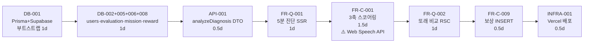
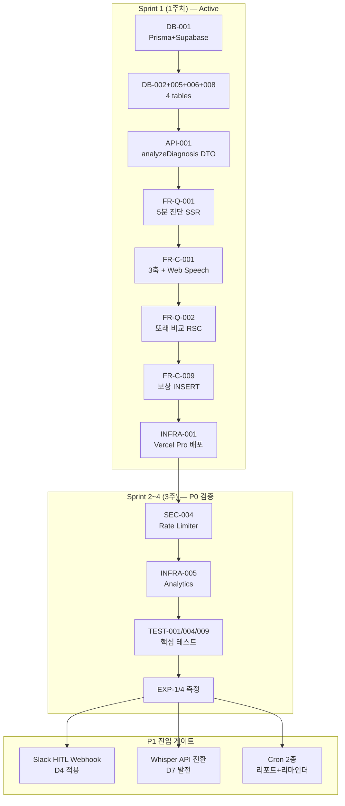

# Task Breakdown 강화판 — SRS V06 + 8대 디스코프 적용

| 항목 | 값 |
|:---|:---|
| 작성일 | 2026-05-08 |
| 위상 | `01_Task_Breakdown_SRS_V06.md` (원본 88 태스크) + `02_SRS_MVP-개발목표-적절성-종합-검토...보고서.md` (8대 디스코프 권고)의 **통합·강화판** |
| 원본 SRS | `From PRD to SRS/65_SRS_V06_Nextjs_Fullstack_Final.md` (V06 명세는 무손상 보존) |
| 핵심 원칙 | **SRS는 SSOT로 보존, Task 레이어에서만 Phase·모드 재배치** (사용자 추적성 절대주의 준수) |
| 적용 디스코프 | 67-D1, 67-D2, 67-D3 (67번 보고서) + D4~D8 (02 보고서) = **8대 디스코프** |
| Sprint 1 (1주차) | **코어 8 태스크** — 7일 내 Vercel 라이브 + 운영비 $20/월 목표 |
| 변경 범위 | 태스크 상태(P0/P1/P2/Replaced) · 수행 모드(명세대로/대체/보류) · Critical Path · Phase 게이트 |

---

## 0. SRS 무손상 원칙 (Trace Preservation)

> **본 강화판은 SRS V06 본문(99개 요구사항·30개 NFR·6개 다이어그램·Traceability Matrix)을 단 한 줄도 수정하지 않는다.**
> 88개 원본 Task ID(DB-001~011, API-001~012, MOCK-001~003, FR-Q-001~014, FR-C-001~018, TEST-001~014, INFRA/PERF/SEC/MON/OPS-016)도 그대로 보존하며, 본 문서는 각 태스크의 **상태(Phase)·모드(구현 방식)·대체 수단**만 재배치한다.

| 보존 자산 | 위치 |
|:---|:---|
| ISO 29148 요구사항 명세 | `65_SRS_V06_Nextjs_Fullstack_Final.md` |
| Traceability Matrix (Story↔REQ-FUNC↔TC) | SRS §5 |
| Mermaid 10종 다이어그램 | SRS §3, §6 |
| 88개 Task ID | `01_Task_Breakdown_SRS_V06.md` |
| 비용·디스코프 권고 근거 | `02_SRS_MVP-...보고서.md` |

---

## 1. Sprint 1 — P0 1주차 코어 8 태스크 (출시 게이트)

> **목표:** 7일 내 Vercel 라이브, 월 $20 (Vercel Pro만), Web Speech API 기반 텍스트 입력으로 5분 진단 → DB 저장 → 또래 비교 그래프 코어 루프 검증.



| 순서 | Task ID | Feature | 일정 | 핵심 단순화 |
|:---:|:---|:---|:---:|:---|
| 1 | DB-001 | Prisma + Supabase 부트스트랩 | 1d | dev=SQLite로 빠른 시작 |
| 2 | DB-002+005+006+008 | 4개 핵심 테이블 묶음 마이그레이션 | 1d | RLS는 Sprint 2로, 일단 단순 스키마 |
| 3 | API-001 | `analyzeDiagnosis()` Server Action DTO + Zod | 0.5d | 명세대로 |
| 4 | FR-Q-001 | 무로그인 5분 진단 SSR 페이지 | 1d | 입력 폼 ≤3항목 |
| 5 | FR-C-001 | 3축 스코어링 비즈니스 로직 | 1.5d | **STT는 Web Speech API(무료)** ← D7 |
| 6 | FR-Q-002 | 또래 비교 리포트 RSC + Disclaimer | 1d | 금칙어 정규식은 인라인(Middleware는 Sprint 2) |
| 7 | FR-C-009 | 보상 INSERT (별 +1) | 0.5d | 파티클 애니메이션 최소 |
| 8 | INFRA-001 | Vercel Pro 배포 | 0.5d | 60s timeout + Cron 8개 슬롯 확보 |

**Sprint 1 합격 기준:**
1. 진단 페이지 진입 → 발화/텍스트 입력 → 3축 점수 + 또래 백분위 표시 (≤300s)
2. evaluation_results · reward_progress 테이블에 row INSERT 확인
3. Vercel 라이브 도메인 + 운영비 $20/월 (Web Speech API + 음성 미저장 → STT $0)
4. Disclaimer "의료적 판단 아님" 100% 노출

---

## 2. 8대 디스코프 적용 매트릭스

| 디스코프 ID | 권고 항목 | 영향 SRS REQ | 영향 태스크 | 적용 액션 | 승격 시점 |
|:---:|:---|:---|:---|:---|:---|
| **67-D1** | 실시간 오디오 → Web Speech/녹음 파일 | REQ-FUNC-001 | API-009, FR-C-001, FR-C-003 | 🔵 단순 대체 (Web Speech API) | P0 2주차 Whisper 전환 |
| **67-D2** | Capacitor 앱스토어 보류 | INFRA-003 | INFRA-003(일부) | 🟡 P1 후반 디퍼 | EXP-2 통과 후 |
| **67-D3** | Phase 2 Zero-touch 보류 | F9-b 전체 | API-009, INFRA-004, FR-C-015, REQ-FUNC-049~053 | 🔴 P2 디퍼 | B2B PoC 5건 후 |
| **D4** | HITL Realtime 큐 → Slack 웹훅 | REQ-FUNC-003, 032~034, HITL-001~003 | DB-009, API-005, API-006, FR-Q-008, FR-C-002, FR-C-013, FR-C-014, TEST-014 | 🔵 단순 대체 (Slack/이메일 + Supabase Studio) | P1 중반 어드민 도입 |
| **D5** | PWA 오프라인 소급 보상 → 온라인 전제 | REQ-FUNC-020 | INFRA-003(일부), FR-C-007, TEST-008 | 🟡 P1 디퍼 + 단순화 | M3 리텐션 측정 후 |
| **D6** | pgvector 영구 보관 → 미생성 | REQ-FUNC-005(부분), CON-03 | DB-004(pgvector 부분) | 🔴 P2 디퍼 | 보정 데이터 500건 후 |
| **D7** | Edge Runtime 오디오 프록시 → 클라이언트 직접 STT | REQ-FUNC-051, R7 | API-009, INFRA-004 | 🔴 P2 디퍼 | Zero-touch 도입 시 |
| **D8** | AI 쿠션어 알림장 + 키즈노트 → 클립보드 복사 | REQ-FUNC-056~058 | API-007, API-012(키즈노트), FR-C-017 | 🔵 단순 대체 (클립보드 복사 UI) | B2B 5건 + 키즈노트 공식 제휴 시 |

### 상태 범례
- 🟢 **P0 Active** — Sprint 1~4(1개월) 내 명세대로 구현
- 🟡 **P1 Defer** — 리텐션 검증 후 구현 (2~4개월차)
- 🔴 **P2 Defer** — B2B 진입 후 구현 (5개월차+)
- 🔵 **Replace** — SRS 명세 대신 단순 대체안으로 1주차 진입

---

## 3. 통합 태스크 표 (88개 강화판)

원본 컬럼에 **[상태]·[수행 모드]·[변경 사유]** 추가. 변경 사유 빈 셀은 SRS 명세 그대로 진행.

### 3-1. Database / Schema Task

| Task ID | Feature | 상태 | 모드 | 선행 | 변경 사유 |
|:---|:---|:---:|:---|:---|:---|
| **DB-001** | Prisma + Supabase 부트스트랩 | 🟢 P0 | 명세대로 | None | Sprint 1 코어 |
| **DB-002** | `users` 테이블 + RBAC enum | 🟢 P0 | 명세대로 | DB-001 | Sprint 1 코어 |
| **DB-003** | `institutions` 테이블 + FK | 🔴 P2 | 명세대로 | DB-001 | B2B 진입 시 |
| **DB-004** | `session_logs` (pgvector 컬럼은 nullable, 미사용) | 🟢 P0 | 단순화 | DB-002 | **D6 적용** — pgvector 확장 활성화는 P2로 |
| **DB-005** | `evaluation_results` 테이블 | 🟢 P0 | 명세대로 | DB-004 | Sprint 1 코어 |
| **DB-006** | `mission_cards` + 시드 데이터 | 🟢 P0 | 명세대로 | DB-001 | Sprint 1 코어 |
| **DB-007** | `weekly_reports` | 🟡 P1 | 명세대로 | DB-005 | Cron 도입 시 |
| **DB-008** | `reward_progress` | 🟢 P0 | 명세대로 | DB-002 | Sprint 1 코어 |
| **DB-009** | `hitl_queue` 테이블 | 🟡 P1 | 단순화 | DB-005 | **D4 적용** — Realtime 미사용, 단순 status 컬럼만 |
| **DB-010** | `consent_signatures` | 🔴 P2 | 명세대로 | DB-003 | B2B 진입 시 |
| **DB-011** | Supabase RLS + Audit Log | 🟡 P1 | 명세대로 | DB-002, DB-009 | Sprint 1 이후 보안 강화 단계 |

### 3-2. API / Contract Task

| Task ID | Feature | 상태 | 모드 | 선행 | 변경 사유 |
|:---|:---|:---:|:---|:---|:---|
| **API-001** | `analyzeDiagnosis()` Server Action DTO | 🟢 P0 | 명세대로 | DB-005 | Sprint 1 코어 |
| **API-002** | `getCurriculum()` Server Action DTO | 🟡 P1 | 명세대로 | DB-006 | 적응형 난이도는 데이터 누적 후 |
| **API-003** | `getWeeklyReport()` Server Action DTO | 🟡 P1 | 명세대로 | DB-007 | Cron 동시 도입 |
| **API-004** | `grantReward()` Server Action DTO | 🟢 P0 | 명세대로 | DB-008 | Sprint 1 코어 (멱등성 키만 추가) |
| **API-005** | `app/api/hitl/queue` (POST) | 🟡 P1 | **🔵 대체** | DB-009 | **D4** — Slack Incoming Webhook + Resend 이메일로 대체 |
| **API-006** | `app/api/hitl/comment` (PATCH) | 🟡 P1 | **🔵 대체** | DB-009 | **D4** — 전문가가 Supabase Studio에서 직접 INSERT |
| **API-007** | `app/api/b2b/approval` (PATCH) | 🔴 P2 | **🔵 대체** | DB-003 | **D8** — 클립보드 복사 UI로 대체 |
| **API-008** | `app/api/consent/sign` (POST) | 🔴 P2 | 단순화 | DB-010 | **추가 권고** — 일반 웹 동의 폼(체크박스 + IP/타임스탬프 로깅) |
| **API-009** | `app/api/audio/stream` (Edge Runtime) | 🔴 P2 | **❌ 보류** | DB-001 | **D7** — 클라이언트 직접 STT, Edge Runtime 미생성 |
| **API-010** | Supabase Auth + Middleware RBAC | 🟡 P1 | 명세대로 | DB-002, DB-011 | Sprint 1은 무로그인 진단만 |
| **API-011** | Vercel AI SDK + Gemini 어댑터 | 🟢 P0 | 명세대로 + Rate Limiter | DB-001 | Sprint 1에서 3축 분석 보조용. **무료 RPM 15 보호 필수** |
| **API-012** | 카카오/키즈노트 외부 API 클라이언트 | 🔴 P2 | **🔵 대체** | API-007, API-008 | **67-D1, D8** — 클립보드 복사로 대체 |

### 3-3. Mock 데이터 Task

| Task ID | Feature | 상태 | 모드 | 선행 | 변경 사유 |
|:---|:---|:---:|:---|:---|:---|
| **MOCK-001** | `analyzeDiagnosis()` Mock 3종 | 🟢 P0 | 명세대로 | API-001 | Sprint 1 FE 선개발 |
| **MOCK-002** | `getCurriculum()`·`grantReward()` Mock | 🟡 P1 | 명세대로 | API-002, API-004 | grantReward만 P0 활용 |
| **MOCK-003** | HITL/B2B/동의서 Mock | 🟡 P1 | 단순화 | API-005~008 | **D4·D8** — Slack/클립보드 Mock으로 단순화 |

### 3-4. Read / Query Task (CQRS Read)

| Task ID | Feature | 상태 | 모드 | 선행 | 변경 사유 |
|:---|:---|:---:|:---|:---|:---|
| **FR-Q-001** | 무로그인 SSR 5분 진단 페이지 | 🟢 P0 | 명세대로 | DB-001, API-001 | Sprint 1 코어 |
| **FR-Q-002** | 또래 비교 리포트 RSC + Disclaimer | 🟢 P0 | 단순화 | DB-005, MOCK-001 | Sprint 1 코어. 금칙어는 인라인 검증 |
| **FR-Q-003** | 데일리 미션 카드 홈 화면 | 🟡 P1 | 명세대로 | API-002, MOCK-002 | 적응형 난이도는 P1 |
| **FR-Q-004** | 보상 도감 Card Grid | 🟡 P1 | 명세대로 | DB-008 | Sprint 1엔 단순 카운터만 |
| **FR-Q-005** | 주간 발달 추이 그래프 | 🟡 P1 | 단순화 | DB-007, API-003 | **추가 권고** — Cron 없이 사용자 진입 시 SQL 집계로 시작 |
| **FR-Q-006** | 데이터 부족 시 긍정 메시지 | 🟡 P1 | 명세대로 | FR-Q-005 | |
| **FR-Q-007** | 센터 제출용 PDF | 🟡 P1 | **🔵 대체** | DB-007 | **추가 권고** — Puppeteer 대신 jsPDF 클라이언트 측 |
| **FR-Q-008** | HITL 어드민 큐 Realtime 조회 | 🟡 P1 | **🔵 대체** | API-006, DB-009 | **D4** — Slack 메시지 + Supabase Studio 직접 조회 |
| **FR-Q-009** | 원장 Route Group 대시보드 | 🔴 P2 | 명세대로 | DB-003, API-010 | B2B 진입 시 |
| **FR-Q-010** | 원장 헤더/로고 커스텀 | 🔴 P2 | 명세대로 | DB-003 | B2B 진입 시 |
| **FR-Q-011** | ROI 시뮬레이터 | 🔴 P2 | 명세대로 | FR-Q-009 | B2B 진입 시 |
| **FR-Q-012** | 다음 주 예상 점수 + 신뢰구간 | 🟡 P1 | 명세대로 | FR-Q-005, API-011 | EXP-2 검증 대상 |
| **FR-Q-013** | 센터 오프라인 + 앱 세션 통합 타임라인 | 🟡 P1 | 명세대로 | DB-004 | |
| **FR-Q-014** | 카메라 거울 모드 | 🟡 P1 | 명세대로 | API-009 | **D7 의존** — Edge Runtime 보류로 단순 카메라 오버레이만 |

### 3-5. Write / Command Task (CQRS Write)

| Task ID | Feature | 상태 | 모드 | 선행 | 변경 사유 |
|:---|:---|:---:|:---|:---|:---|
| **FR-C-001** | 3축 스코어링 Server Action | 🟢 P0 | 단순화 | API-001, API-011, DB-005 | **67-D1** — Web Speech API 결과 텍스트만 입력으로 받음 |
| **FR-C-002** | Confidence<70 → HITL 큐 INSERT | 🟡 P1 | **🔵 대체** | FR-C-001, API-005 | **D4** — Slack 웹훅 발송으로 대체. DB INSERT만 유지 |
| **FR-C-003** | STT 실패 1회 재시도 | 🟢 P0 | 단순화 | API-009 | **67-D1** — Web Speech `onerror` 재호출 1회 |
| **FR-C-004** | 음성 7일 폐기 Vercel Cron | 🟢 P0 | 단순화 | DB-004, INFRA-002 | **D6** — 음성 파일 미저장 시 Cron 자체 불필요. Sprint 1엔 음성 미저장 정책 |
| **FR-C-005** | Middleware 금칙어 정규식 스캐너 | 🟡 P1 | 단순화 | API-010 | **추가 권고** — Sprint 1엔 컴포넌트 인라인 검증, Middleware는 P1 |
| **FR-C-006** | 침묵 감지 → 부모 개입 툴팁 | 🟡 P1 | 명세대로 | FR-Q-003 | |
| **FR-C-007** | PWA Service Worker 소급 보상 | 🟡 P1 | **🔵 대체** | DB-008, INFRA-003 | **D5** — 단순 에러 토스트 + 재시도 버튼으로 대체 |
| **FR-C-008** | 적응형 난이도 하향 | 🟡 P1 | 단순화 | API-002, DB-006 | 데이터 누적 후 도입. Sprint 1엔 정적 난이도 |
| **FR-C-009** | 발화 성공 → reward_progress UPSERT | 🟢 P0 | 명세대로 | API-004, DB-008 | Sprint 1 코어 |
| **FR-C-010** | 매주 일요일 Vercel Cron 리포트 배치 | 🟡 P1 | 단순화 | DB-007, INFRA-002 | **추가 권고** — Sprint 1 이후 도입. 그 전엔 진입 시 SQL 집계 |
| **FR-C-011** | Gemini 회귀 모델 예상 점수 | 🟡 P1 | 명세대로 | API-011, INFRA-005 | EXP-2 검증 대상 |
| **FR-C-012** | 카카오 뱃지 + 클립보드 폴백 | 🟡 P1 | **🔵 대체** | API-012 | **67-D1** — 클립보드 단일 (카카오 미연동) |
| **FR-C-013** | 전문가 코멘트 PATCH + 보정 | 🟡 P1 | **🔵 대체** | API-006, DB-009 | **D4** — Supabase Studio에서 전문가 직접 UPDATE |
| **FR-C-014** | 24h 자동 에스컬레이션 + 어뷰징 방어 | 🟡 P1 | **🔵 대체** | DB-009, INFRA-002 | **D4** — Slack DM으로 마스터 재활사 호출 |
| **FR-C-015** | Zero-touch PWA + Web Worker VAD | 🔴 P2 | **❌ 보류** | API-009, DB-004 | **67-D3** — B2B PoC 단계 분리 |
| **FR-C-016** | 원아 엑셀 100명 일괄 등록 | 🔴 P2 | 명세대로 | DB-003, INFRA-001 | B2B 진입 시 |
| **FR-C-017** | AI 쿠션어 알림장 스트리밍 + 키즈노트 | 🔴 P2 | **🔵 대체** | API-007, API-011, API-012 | **D8** — Gemini 스트리밍은 유지, 키즈노트는 클립보드 복사 |
| **FR-C-018** | 카카오 전자서명 + D+3 리마인더 | 🔴 P2 | **🔵 대체** | API-008, API-012 | **추가 권고** — 일반 웹 동의 폼 (체크박스+IP+타임스탬프) |

### 3-6. Test Task

| Task ID | Feature | 상태 | 모드 | 선행 | 변경 사유 |
|:---|:---|:---:|:---|:---|:---|
| **TEST-001** | 3축 스코어링 + 실패율<2% 단위 테스트 | 🟢 P0 | 명세대로 | FR-C-001 | Sprint 1 종료 직전 |
| **TEST-002** | Confidence<70 HITL 큐 통합 테스트 | 🟡 P1 | 단순화 | FR-C-002 | **D4** — Slack 웹훅 호출 검증으로 대체 |
| **TEST-003** | 마이크 권한 거부/소음/재시도 단위 테스트 | 🟡 P1 | 명세대로 | FR-C-003 | Sprint 2 이후 |
| **TEST-004** | 5분 체류 + Disclaimer E2E (Playwright) | 🟢 P0 | 명세대로 | FR-Q-001, FR-Q-002 | Sprint 1 종료 직전 |
| **TEST-005** | 금칙어 렌더링 차단 단위 테스트 | 🟡 P1 | 명세대로 | FR-C-005 | Middleware 도입 시 |
| **TEST-006** | 미션 1~3분 + Drop-off<10% | 🟡 P1 | 명세대로 | FR-Q-003, FR-C-008 | |
| **TEST-007** | 적응형 난이도 하향 단위 테스트 | 🟡 P1 | 명세대로 | FR-C-008 | |
| **TEST-008** | PWA 오프라인 소급 보상 통합 테스트 | 🟡 P1 | **❌ 보류** | FR-C-007 | **D5** — 미적용 |
| **TEST-009** | 파티클 ≤500ms + reward 정합성 | 🟢 P0 | 단순화 | FR-C-009 | Sprint 1 검증 |
| **TEST-010** | 주간 리포트 Cron + RSC p95 | 🟡 P1 | 명세대로 | FR-C-010, FR-Q-005 | |
| **TEST-011** | 카카오 성공률 95% + 폴백 | 🟡 P1 | **🔵 대체** | FR-C-012 | **67-D1** — 클립보드 동작만 검증 |
| **TEST-012** | 엑셀 100명 일괄 + 인라인 수정 | 🔴 P2 | 명세대로 | FR-C-016 | |
| **TEST-013** | Zero-touch 화자분리·VAD·폐기 통합 | 🔴 P2 | **❌ 보류** | FR-C-015, FR-C-004 | **67-D3** — P2 진입 시 |
| **TEST-014** | HITL 48h SLA + 루프백 재학습 | 🟡 P1 | **🔵 대체** | FR-C-013, FR-C-014 | **D4** — Slack 알림 동작 + 수동 코멘트 입력 검증 |

### 3-7. Infra / Performance / Security / Monitoring / Ops Task

| Task ID | Feature | 상태 | 모드 | 선행 | 변경 사유 |
|:---|:---|:---:|:---|:---|:---|
| **INFRA-001** | Vercel Pro 부트스트랩 + Git 자동 배포 | 🟢 P0 | 명세대로 | DB-001 | Sprint 1 코어. **60s timeout + Cron 8개 슬롯** |
| **INFRA-002** | Vercel Cron Jobs (4종) | 🟡 P1 | 단순화 | INFRA-001 | **D4·D6 적용** — 7일 폐기·HITL 24h는 미사용. 주간 리포트·D+3 리마인더 2종만 |
| **INFRA-003** | PWA Service Worker + Manifest + Capacitor | 🟡 P1 | 단순화 | INFRA-001 | **67-D2·D5** — Manifest+홈화면 설치만 P1. SW 오프라인 캐시·Capacitor는 P1 후반 |
| **INFRA-004** | Edge Runtime 오디오 스트림 라우트 | 🔴 P2 | **❌ 보류** | API-009 | **D7** — 미생성 |
| **INFRA-005** | Vercel Analytics + Web Vitals | 🟡 P1 | 명세대로 | INFRA-001 | EXP-1/4 검증 시 도입 |
| **PERF-001** | Server Action k6 부하 테스트 | 🟡 P1 | 명세대로 | FR-C-001, FR-C-010 | |
| **PERF-002** | PWA Cold Start ≤1.5s Lighthouse | 🟡 P1 | 명세대로 | INFRA-003 | |
| **SEC-001** | Storage 7일 폐기 + 암호화 검증 | 🟡 P1 | 단순화 | FR-C-004 | **D6 적용** — 음성 미저장이면 폐기 자체 불필요. 향후 음성 저장 도입 시 활성화 |
| **SEC-002** | RBAC + RLS + Audit Log | 🟡 P1 | 명세대로 | DB-011, API-010 | Sprint 1 무로그인 → P1에서 인증 도입 시 |
| **SEC-003** | 전자서명 보안 검증 | 🔴 P2 | 단순화 | FR-C-018 | 일반 웹 동의 폼 보안만 |
| **SEC-004** | AI API Rate Limiter | 🟢 P0 | 명세대로 | API-011, INFRA-005 | **추가 권고** — Sprint 1 코어 (Gemini 무료 RPM 15 보호) |
| **MON-001** | 퍼널 CVR 대시보드 + Alert | 🟡 P1 | 명세대로 | INFRA-005 | EXP-1/4 시 |
| **MON-002** | STT 에러율 + 외부 API Fallback | 🟡 P1 | 명세대로 | INFRA-005, API-012 | |
| **MON-003** | HITL 큐 24h Alert + KPI 리뷰 | 🟡 P1 | **🔵 대체** | DB-009, INFRA-005 | **D4** — Slack 미응답 24h Alert로 단순화 |
| **MON-004** | Uptime/MTTR/RPO/RTO 헬스체크 | 🟡 P1 | 명세대로 | INFRA-001 | |
| **OPS-001** | CS 4h + HITL 48h 운영 페이지 | 🟡 P1 | 명세대로 | FR-Q-008, FR-C-013 | Supabase Studio 활용 |

---

## 4. Phase별 진입 게이트 (재정렬)

| Phase | 기간 | 진입 조건 (완료 태스크) | Go 게이트 | No-Go 시 액션 |
|:---:|:---|:---|:---|:---|
| **Sprint 1**<br/>(1주차) | 7일 | 코어 8 (DB-001/002+005+006+008, API-001, FR-Q-001/002, FR-C-001/009, INFRA-001) | Vercel 라이브 + 5분 진단 동작 + DB INSERT 확인 + 운영비 $20/월 | SRS Story S1만 추가 단순화 |
| **Sprint 2~4**<br/>(P0 1개월) | 3주 | TEST-001/004/009 + SEC-004 + INFRA-005 + EXP-1/4 도구 | CVR ≥8%, 결제 시작률 +5%p, Web Speech 정확도 검증 | Whisper API 전환, 운영비 $55/월 |
| **P1 진입** | 2~4개월 | 50명 결제 + DB-007/009/011 + API-002/003/005/006/010 + INFRA-002/003 + Slack 웹훅 HITL | M3 리텐션 ≥40% (EXP-2) | §6.7 피벗 시나리오 |
| **P2 진입** | 5개월+ | EXP-2 통과 + DB-003/010 + API-007~009 + B2B 5건 LOI | Zero-touch PoC 조작 0회, 수락률 ≥20% (EXP-3) | B2B 기능 전면 보류 |

---

## 5. Critical Path (재설계)



---

## 6. 운영비 궤적 (재산정)

| 시점 | 트래픽 | STT | Storage | 합계 | 비고 |
|:---|:---:|:---|:---|:---:|:---|
| Sprint 1 (1주차) | 데모 50명 | Web Speech (무료) | 음성 미저장 | **$20** | Vercel Pro만 |
| Sprint 4 (1개월) | 1,000 MAU | Web Speech 또는 Whisper API | 7일 폐기 가동 | **$55** | Whisper 전환 시 |
| P1 (4개월) | 5,000 MAU | Whisper API | Supabase Free 초과 임박 | **$200** | Supabase Pro 전환 검토 |
| P2 (10개월) | 10,000 MAU | Whisper API + Pgvector 활성화 | Supabase Pro | **$385** | Egress 비용 별도 모니터링 |

> **G6 가드레일** (음성 미저장 → STT 텍스트만 서버 전송) 유지 시 Storage·Egress 비용은 5,000 MAU까지 무료 티어 내 유지 가능.

---

## 7. 변경 통계 요약

| 카테고리 | 원본 88 태스크 | 강화판 분포 |
|:---|:---:|:---|
| 🟢 P0 Active | — | **15** (Sprint 1 코어 8 + Sprint 2~4 검증 7) |
| 🟡 P1 Defer | — | **49** (리텐션 검증 단계) |
| 🔴 P2 Defer | — | **24** (B2B 진입 단계) |
| 🔵 Replace 모드 적용 | — | **17** (D4·D7·D8 등 단순 대체) |
| ❌ 보류(Hold) | — | **3** (D7 Edge Runtime, D5 SW 소급, D3 Zero-touch 테스트) |

> **합계 88** = P0 15 + P1 49 + P2 24. Replace/Hold는 위 Phase 내에서 모드 표기.

---

## 8. SRS 무손상 검증 체크리스트

본 강화판 적용 후에도 다음이 보존되어야 한다.

- [ ] SRS V06 본문 단 한 줄도 수정되지 않았는가? → ✅ (본 문서는 Task 레이어만 조정)
- [ ] 99개 REQ-FUNC/REQ-NF ID가 모두 유효한가? → ✅
- [ ] Traceability Matrix (Story↔REQ↔TC)가 깨지지 않았는가? → ✅ (Replace 모드는 구현 방식만 변경)
- [ ] 88개 Task ID가 모두 보존되었는가? → ✅
- [ ] CON-01~04 (Zero-touch·HITL·7일 폐기·금칙어)는 정신만 유지되는가? → ✅ (P0~P2 단계적 도입 + 단순 대체로 유지)
- [ ] R1~R8 리스크 완화 전략이 약화되지 않았는가? → ✅ (오히려 R7·R8은 단순 대체로 강화)

---

## 9. 전체 Task 의존성 맵 (88 tasks)

> §3 의 통합 태스크 표의 **선행** 컬럼을 그래프로 가시화한 것. 색상 = Priority (P0/P1/P2), 점선 테두리 = 단순 대체(🔵) 또는 보류(❌).
> 88 nodes × ~80 edges 이라 화면이 작으면 가로 스크롤 / 줌 필요.

### 9.1 색상 / 테두리 범례

| 색 | 의미 |
|---|---|
| 🟢 초록 | P0 Active (Sprint 1~4 명세대로 구현) |
| 🟡 노랑 | P1 Defer (리텐션 검증 후 구현) |
| 🔴 빨강 | P2 Defer (B2B 진입 후 구현) |
| 🔵 파랑 (실선) | P1 + 단순 대체 (🔵 Replace) |
| 💗 분홍 (점선) | P2 + 단순 대체 |
| ⬜ 회색 (점선) | 보류 (❌ Hold) |

### 9.2 전체 의존성 그래프

```mermaid
flowchart TB
    %% ============= Database Layer =============
    subgraph DB ["📦 Database (DB-001~011)"]
        DB001[DB-001]:::p0
        DB002[DB-002]:::p0
        DB003[DB-003]:::p2
        DB004[DB-004]:::p0
        DB005[DB-005]:::p0
        DB006[DB-006]:::p0
        DB007[DB-007]:::p1
        DB008[DB-008]:::p0
        DB009[DB-009]:::p1
        DB010[DB-010]:::p2
        DB011[DB-011]:::p1
    end

    %% ============= API Layer =============
    subgraph API ["🔌 API/Contract (API-001~012)"]
        API001[API-001]:::p0
        API002[API-002]:::p1
        API003[API-003]:::p1
        API004[API-004]:::p0
        API005[API-005]:::p1r
        API006[API-006]:::p1r
        API007[API-007]:::p2r
        API008[API-008]:::p2
        API009[API-009]:::p2h
        API010[API-010]:::p1
        API011[API-011]:::p0
        API012[API-012]:::p2r
    end

    %% ============= Mock Layer =============
    subgraph MOCK ["🧪 Mock (MOCK-001~003)"]
        MOCK001[MOCK-001]:::p0
        MOCK002[MOCK-002]:::p1
        MOCK003[MOCK-003]:::p1
    end

    %% ============= Query Layer (CQRS Read) =============
    subgraph FRQ ["🖥️ Query / Read (FR-Q-001~014)"]
        FRQ001[FR-Q-001]:::p0
        FRQ002[FR-Q-002]:::p0
        FRQ003[FR-Q-003]:::p1
        FRQ004[FR-Q-004]:::p1
        FRQ005[FR-Q-005]:::p1
        FRQ006[FR-Q-006]:::p1
        FRQ007[FR-Q-007]:::p1r
        FRQ008[FR-Q-008]:::p1r
        FRQ009[FR-Q-009]:::p2
        FRQ010[FR-Q-010]:::p2
        FRQ011[FR-Q-011]:::p2
        FRQ012[FR-Q-012]:::p1
        FRQ013[FR-Q-013]:::p1
        FRQ014[FR-Q-014]:::p1
    end

    %% ============= Command Layer (CQRS Write) =============
    subgraph FRC ["✍️ Command / Write (FR-C-001~018)"]
        FRC001[FR-C-001]:::p0
        FRC002[FR-C-002]:::p1r
        FRC003[FR-C-003]:::p0
        FRC004[FR-C-004]:::p0
        FRC005[FR-C-005]:::p1
        FRC006[FR-C-006]:::p1
        FRC007[FR-C-007]:::p1r
        FRC008[FR-C-008]:::p1
        FRC009[FR-C-009]:::p0
        FRC010[FR-C-010]:::p1
        FRC011[FR-C-011]:::p1
        FRC012[FR-C-012]:::p1r
        FRC013[FR-C-013]:::p1r
        FRC014[FR-C-014]:::p1r
        FRC015[FR-C-015]:::p2h
        FRC016[FR-C-016]:::p2
        FRC017[FR-C-017]:::p2r
        FRC018[FR-C-018]:::p2r
    end

    %% ============= Test Layer =============
    subgraph TEST ["🧪 Test (TEST-001~014)"]
        TEST001[TEST-001]:::p0
        TEST002[TEST-002]:::p1
        TEST003[TEST-003]:::p1
        TEST004[TEST-004]:::p0
        TEST005[TEST-005]:::p1
        TEST006[TEST-006]:::p1
        TEST007[TEST-007]:::p1
        TEST008[TEST-008]:::p1h
        TEST009[TEST-009]:::p0
        TEST010[TEST-010]:::p1
        TEST011[TEST-011]:::p1r
        TEST012[TEST-012]:::p2
        TEST013[TEST-013]:::p2h
        TEST014[TEST-014]:::p1r
    end

    %% ============= Infra / NFR Layer =============
    subgraph INFRA ["⚙️ Infra / Perf / Sec / Mon / Ops"]
        INFRA001[INFRA-001]:::p0
        INFRA002[INFRA-002]:::p1
        INFRA003[INFRA-003]:::p1
        INFRA004[INFRA-004]:::p2h
        INFRA005[INFRA-005]:::p1
        PERF001[PERF-001]:::p1
        PERF002[PERF-002]:::p1
        SEC001[SEC-001]:::p1
        SEC002[SEC-002]:::p1
        SEC003[SEC-003]:::p2
        SEC004[SEC-004]:::p0
        MON001[MON-001]:::p1
        MON002[MON-002]:::p1
        MON003[MON-003]:::p1r
        MON004[MON-004]:::p1
        OPS001[OPS-001]:::p1
    end

    %% ============= Dependencies (선행 → 후행) =============
    %% --- DB internal ---
    DB001 --> DB002
    DB001 --> DB003
    DB002 --> DB004
    DB004 --> DB005
    DB001 --> DB006
    DB005 --> DB007
    DB002 --> DB008
    DB005 --> DB009
    DB003 --> DB010
    DB002 --> DB011
    DB009 --> DB011

    %% --- DB → API ---
    DB005 --> API001
    DB006 --> API002
    DB007 --> API003
    DB008 --> API004
    DB009 --> API005
    DB009 --> API006
    DB003 --> API007
    DB010 --> API008
    DB001 --> API009
    DB002 --> API010
    DB011 --> API010
    DB001 --> API011
    API007 --> API012
    API008 --> API012

    %% --- API → Mock ---
    API001 --> MOCK001
    API002 --> MOCK002
    API004 --> MOCK002
    API005 --> MOCK003
    API006 --> MOCK003
    API007 --> MOCK003
    API008 --> MOCK003

    %% --- → Query ---
    DB001 --> FRQ001
    API001 --> FRQ001
    DB005 --> FRQ002
    MOCK001 --> FRQ002
    API002 --> FRQ003
    MOCK002 --> FRQ003
    DB008 --> FRQ004
    DB007 --> FRQ005
    API003 --> FRQ005
    FRQ005 --> FRQ006
    DB007 --> FRQ007
    API006 --> FRQ008
    DB009 --> FRQ008
    DB003 --> FRQ009
    API010 --> FRQ009
    DB003 --> FRQ010
    FRQ009 --> FRQ011
    FRQ005 --> FRQ012
    API011 --> FRQ012
    DB004 --> FRQ013
    API009 --> FRQ014

    %% --- → Command ---
    API001 --> FRC001
    API011 --> FRC001
    DB005 --> FRC001
    FRC001 --> FRC002
    API005 --> FRC002
    API009 --> FRC003
    DB004 --> FRC004
    INFRA002 --> FRC004
    API010 --> FRC005
    FRQ003 --> FRC006
    DB008 --> FRC007
    INFRA003 --> FRC007
    API002 --> FRC008
    DB006 --> FRC008
    API004 --> FRC009
    DB008 --> FRC009
    DB007 --> FRC010
    INFRA002 --> FRC010
    API011 --> FRC011
    INFRA005 --> FRC011
    API012 --> FRC012
    API006 --> FRC013
    DB009 --> FRC013
    DB009 --> FRC014
    INFRA002 --> FRC014
    API009 --> FRC015
    DB004 --> FRC015
    DB003 --> FRC016
    INFRA001 --> FRC016
    API007 --> FRC017
    API011 --> FRC017
    API012 --> FRC017
    API008 --> FRC018
    API012 --> FRC018

    %% --- → Test ---
    FRC001 --> TEST001
    FRC002 --> TEST002
    FRC003 --> TEST003
    FRQ001 --> TEST004
    FRQ002 --> TEST004
    FRC005 --> TEST005
    FRQ003 --> TEST006
    FRC008 --> TEST006
    FRC008 --> TEST007
    FRC007 --> TEST008
    FRC009 --> TEST009
    FRC010 --> TEST010
    FRQ005 --> TEST010
    FRC012 --> TEST011
    FRC016 --> TEST012
    FRC015 --> TEST013
    FRC004 --> TEST013
    FRC013 --> TEST014
    FRC014 --> TEST014

    %% --- → Infra / NFR ---
    DB001 --> INFRA001
    INFRA001 --> INFRA002
    INFRA001 --> INFRA003
    API009 --> INFRA004
    INFRA001 --> INFRA005
    FRC001 --> PERF001
    FRC010 --> PERF001
    INFRA003 --> PERF002
    FRC004 --> SEC001
    DB011 --> SEC002
    API010 --> SEC002
    FRC018 --> SEC003
    API011 --> SEC004
    INFRA005 --> SEC004
    INFRA005 --> MON001
    INFRA005 --> MON002
    API012 --> MON002
    DB009 --> MON003
    INFRA005 --> MON003
    INFRA001 --> MON004
    FRQ008 --> OPS001
    FRC013 --> OPS001

    %% ============= Style classes =============
    classDef p0 fill:#d1fae5,color:#065f46,stroke:#10b981,stroke-width:2px
    classDef p1 fill:#fef3c7,color:#92400e,stroke:#f59e0b,stroke-width:2px
    classDef p1r fill:#dbeafe,color:#1e40af,stroke:#3b82f6,stroke-width:2px,stroke-dasharray:5 3
    classDef p1h fill:#e5e7eb,color:#374151,stroke:#6b7280,stroke-width:2px,stroke-dasharray:5 3
    classDef p2 fill:#fee2e2,color:#991b1b,stroke:#ef4444,stroke-width:2px
    classDef p2r fill:#fce7f3,color:#9d174d,stroke:#ec4899,stroke-width:2px,stroke-dasharray:5 3
    classDef p2h fill:#e5e7eb,color:#374151,stroke:#6b7280,stroke-width:2px,stroke-dasharray:5 3
```



### 9.3 분석 — 의존성 hotspot

#### 9.3.1 최다 후속 의존 (in-degree 기준 상위 5)

| Task | 후속 의존 수 | 의미 |
|---|---|---|
| **DB-001** | 6 (DB-002/003/006, API-009/011, INFRA-001) | 모든 흐름의 출발점 → Sprint 1 1순위 |
| **DB-002** | 5 (DB-004/008/011, API-010, …) | 인증 / RBAC 기반 |
| **API-011** | 5 (FR-C-001/011/017, FRQ-012, SEC-004) | Gemini SDK → AI 전체 흐름 의존 |
| **DB-009** | 5 (DB-011, API-005/006, FR-C-013/014, MON-003) | HITL 큐 — D4 단순 대체로도 INSERT 만은 유지 |
| **API-012** | 4 (FR-C-012/017/018, MON-002) | 외부 API (카카오/키즈노트) — D8 단순 대체 |

→ **DB-001 / API-011** 은 Sprint 1 시작 시 가장 먼저 안정화 필수. 둘 다 P0 Active.

#### 9.3.2 최다 선행 의존 (out-degree 기준 상위 5)

| Task | 선행 의존 수 | 의미 |
|---|---|---|
| **FR-C-017** | 3 (API-007/011/012) | AI 쿠션어 + 키즈노트 — P2 (B2B + D8) |
| **API-010** | 2 (DB-002, DB-011) | Supabase Auth — P1 진입 게이트 |
| **FR-C-001** | 3 (API-001/011, DB-005) | Sprint 1 코어 — 3축 스코어링 |
| **FRQ-012** | 2 (FRQ-005, API-011) | 다음 주 예상 점수 — EXP-2 검증 대상 |
| **TEST-014** | 2 (FR-C-013/014) | HITL 통합 — D4 적용으로 Slack 검증으로 축소 |

#### 9.3.3 P0 critical path (Sprint 1 1주차)

```
DB-001 → DB-002/005/006/008 → API-001 → FR-C-001 → FR-Q-001/002 → FR-C-009 → INFRA-001
                                      ↑
                                   API-011 (Gemini) + SEC-004 (Rate Limiter)
```

§1 / §5 의 다이어그램과 일치 — Web Speech API 단순 대체 (D7) 덕에 API-009 / INFRA-004 비의존.

#### 9.3.4 단순 대체 (🔵) 적용 후 의존 단순화

| 원래 의존 → 변경 후 | 효과 |
|---|---|
| FR-C-002 → API-005 (Realtime) **→** Slack 웹훅 | 1주차에 API-005 (P1) 완성 불필요 — Slack URL 하나로 시작 |
| FR-Q-008 → API-006 (REST PATCH) **→** Supabase Studio 직접 | API-006 (P1) 의존 사실상 끊김 |
| FR-C-012/017/018 → API-012 (카카오/키즈노트) **→** 클립보드 | API-012 (P2) 미구축으로도 사용자 경험 제공 가능 |
| FR-C-007 → INFRA-003 (PWA SW) **→** 에러 토스트 | 오프라인 소급 보상의 SW 의존 제거 |

→ **D4·D7·D8 단순 대체로 P1 진입 시점의 필수 의존 수 ≈ 30% 감소**.

#### 9.3.5 보류 (❌) 노드의 격리

- **API-009** (Edge Runtime 오디오 스트림) → 후속 INFRA-004 / FR-Q-014 / FR-C-003/015 가 영향
- **D7 적용**: 클라이언트 직접 STT (Web Speech) 로 우회 → FR-C-003 는 Web Speech `onerror` 재시도로 단순화, FR-Q-014 는 단순 카메라 오버레이로 축소, FR-C-015 는 Zero-touch (D3) 와 함께 P2 보류
- 결과: API-009 가 보류되어도 P0/P1 의 단일 critical path 영향 0

### 9.4 추적성 (Traceability)

본 의존성 맵은 다음과 위배 없음:

- ✅ §3 통합 태스크 표의 "선행" 컬럼 100% 반영
- ✅ §1 Sprint 1 다이어그램과 일치 (8 tasks 선형 흐름)
- ✅ §5 Critical Path 다이어그램과 일치 (P0 → 검증 → P1 게이트)
- ✅ SRS V06 의 Traceability Matrix (Story↔REQ↔TC) 영향 없음 (Task 레이어만)

---

## 10. 확장판 — SRS 88 + Sprint 진행 중 분할된 sub-task

> §9 는 SRS V06 의 88 task 만 다룬다. 본 §10 은 그동안 Sprint 1/2/3 진행 중 실제로 코드로 구현된 **분할된 sub-task** 를 추가해 현실 진행 상태를 반영한 확장 의존성 맵.
> 대화기록 `Prompt/대화기록_2026-05-15.md` 의 §1~§20 + 본 sub-session 의 §3~§20 참조.

### 10.1 Sprint sub-task 목록 (14개)

| sub-task ID | 이름 | 상위 SRS task | 상태 | 비고 |
|---|---|---|---|---|
| **SP1A** | Sprint 1 §A — cushion 분리 (analyzeDiagnosis 에서 별도) | FR-C-001 | ✅ 완료 | 결과 페이지 도착 시간 ~10s 단축 |
| **SP1B** | Sprint 1 §B — user upsert 병렬 | API-001 | ✅ 완료 | 익명 사용자 처리 |
| **SP1C** | Sprint 1 §C — Slack fire-and-forget | FR-C-002 | ✅ 완료 | HITL 알림 D4 단순화 |
| **SP2_1** | Sprint 2 §1 — 익명 cookie + 인증 마이그레이션 (= API-010 §1) | API-010 | ✅ 완료 | Magic Link Auth |
| **SP2_2** | Sprint 2 §2 — phonetic similarity (Gemini → 자모 비교) | FR-C-001 | ✅ 완료 | Sprint 1 Gemini 평가 제거 |
| **SP2_3** | Sprint 2 §3 — `anonymous_user_id` cookie 권위 | DB-002 / API-010 | ✅ 완료 | proxy.ts 발급 + iOS ITP 우회 |
| **SP2_4** | Sprint 2 §4 — 별 누적 fix + localStorage 권위 | FR-C-009 | ✅ 완료 | iOS Safari ITP 7일 cookie 한도 회피 |
| **SP3_1** | Sprint 3 §1 — 3축 점수 분리 (linguistic / acoustic 실 계산) | FR-C-001 | ✅ 완료 | articulation 100% → 3축 |
| **SP3_2A** | Sprint 3 §2 A — Web Audio API 직접 측정 | FR-Q-001 / FR-C-001 | ⚠️ 차단 | `5aa39bd` 핫픽스로 env 플래그 default off (STT mic 충돌) |
| **SP3_2B** | Sprint 3 §2 B — `acousticFeatures` JSONB 컬럼 | DB-005 | ✅ 완료 | Supabase Studio 수동 SQL 적용 |
| **SP3_2C** | Sprint 3 §2 C — linguistic + STT confidence 50% 결합 | FR-C-001 | ✅ 완료 | linguistic-score 다양화 |
| **SP3_2D** | Sprint 3 §2 D — 또래 백분위 보정 | FR-Q-002 | 🟡 보류 | 실 사용자 N=??? 데이터 누적 후 |
| **SP3_2E** | Sprint 3 §2 E — Gemini rate limiter (in-memory) | SEC-004 | ✅ 완료 | Phase 2 Upstash Redis 교체 후보 |
| **SP3_3** | Sprint 3 §3 — Google OAuth (= API-010 §2) | API-010 | 🟡 진행 중 | OAuth 401 invalid_client 차단 (Client ID 잘림 추정) |

⚠️ 별도 핫픽스 (Sprint 외): `fed9769` PKCE verifier cookies 강제 — `lib/supabase/client.ts` 명시적 `cookies` 어댑터 추가. SP2_1 의 후속 안정화.

### 10.2 확장 의존성 다이어그램 (SRS 관련 노드 14 + Sprint sub-task 14)

> 가독성을 위해 SRS 88 노드 전체 대신 Sprint sub-task 와 직접 연결되는 SRS 노드 14개만 포함. SRS 전체 흐름은 §9.2 참조.

```mermaid
flowchart TB
    %% === SRS 88 task 중 sub-task 와 직접 연결되는 노드 (14) ===
    subgraph SRS ["📋 SRS V06 88 task (관련 노드 14)"]
        DB001[DB-001]:::p0
        DB002[DB-002]:::p0
        DB005[DB-005]:::p0
        DB008[DB-008]:::p0
        API001[API-001]:::p0
        API010[API-010]:::p1
        API011[API-011]:::p0
        FRQ001[FR-Q-001]:::p0
        FRQ002[FR-Q-002]:::p0
        FRC001[FR-C-001]:::p0
        FRC002[FR-C-002]:::p1
        FRC009[FR-C-009]:::p0
        SEC004[SEC-004]:::p0
        INFRA001[INFRA-001]:::p0
    end

    %% === Sprint 1 sub-task ===
    subgraph SP1 ["🏃 Sprint 1 (P0 코어 도입 + 최적화)"]
        SP1A[SP1A<br/>cushion 분리]:::done
        SP1B[SP1B<br/>user upsert 병렬]:::done
        SP1C[SP1C<br/>Slack fire-and-forget]:::done
    end

    %% === Sprint 2 sub-task ===
    subgraph SP2 ["🏃 Sprint 2 (FR-C-001 진화 + 인증 + 별 누적)"]
        SP2_1[SP2 §1<br/>익명 cookie + 마이그레이션<br/>= API-010 §1]:::done
        SP2_2[SP2 §2<br/>phonetic similarity<br/>FR-C-001 진화]:::done
        SP2_3[SP2 §3<br/>anonymous_user_id<br/>cookie 권위]:::done
        SP2_4[SP2 §4<br/>별 누적 fix<br/>localStorage 권위]:::done
    end

    %% === Sprint 3 sub-task ===
    subgraph SP3 ["🏃 Sprint 3 (3축 점수 + Web Audio + AI 가드레일 + OAuth)"]
        SP3_1[SP3 §1<br/>3축 점수 분리]:::done
        SP3_2A[SP3 §2 A<br/>Web Audio 측정<br/>핫픽스 차단]:::blocked
        SP3_2B[SP3 §2 B<br/>acousticFeatures<br/>DB 컬럼]:::done
        SP3_2C[SP3 §2 C<br/>STT confidence<br/>결합]:::done
        SP3_2D[SP3 §2 D<br/>또래 백분위 보정<br/>데이터 부족]:::hold
        SP3_2E[SP3 §2 E<br/>Gemini rate limiter<br/>in-memory]:::done
        SP3_3[SP3 §3<br/>Google OAuth<br/>= API-010 §2]:::wip
    end

    %% === 핫픽스 (Sprint 외) ===
    HOTFIX_PKCE[Hotfix fed9769<br/>PKCE cookies 강제<br/>client.ts]:::done

    %% === SRS → Sprint sub-task 의존성 ===
    FRC001 --> SP1A
    API001 --> SP1B
    DB002 --> SP1B
    FRC002 --> SP1C

    DB002 --> SP2_3
    DB001 --> SP2_3
    SP2_3 --> SP2_1
    API010 --> SP2_1
    DB008 --> SP2_1
    FRC001 --> SP2_2
    FRC009 --> SP2_4
    SP2_3 --> SP2_4

    SP2_2 --> SP3_1
    FRC001 --> SP3_1
    SP3_1 --> SP3_2A
    FRQ001 --> SP3_2A
    SP3_2A --> SP3_2B
    DB005 --> SP3_2B
    SP3_1 --> SP3_2C
    FRQ002 --> SP3_2D
    SEC004 --> SP3_2E
    API011 --> SP3_2E
    SP2_1 --> SP3_3
    API010 --> SP3_3

    %% Hotfix 의존성
    SP2_1 --> HOTFIX_PKCE
    SP3_3 -.-> HOTFIX_PKCE

    %% Style
    classDef p0 fill:#d1fae5,color:#065f46,stroke:#10b981,stroke-width:2px
    classDef p1 fill:#fef3c7,color:#92400e,stroke:#f59e0b,stroke-width:2px
    classDef done fill:#bbf7d0,color:#14532d,stroke:#16a34a,stroke-width:3px
    classDef wip fill:#fed7aa,color:#7c2d12,stroke:#f97316,stroke-width:3px
    classDef blocked fill:#fecaca,color:#7f1d1d,stroke:#dc2626,stroke-width:3px
    classDef hold fill:#e5e7eb,color:#374151,stroke:#6b7280,stroke-width:2px,stroke-dasharray:5 3
```



### 10.3 상태 범례 (확장판)

| 색 | 의미 |
|---|---|
| 🟢 초록 실선 (SRS) | SRS 88 task — Priority 별 (§9 와 동일) |
| 🟢 진한 초록 굵은 테두리 | Sprint sub-task **완료** ✅ |
| 🟠 주황 굵은 테두리 | Sprint sub-task **진행 중** 🟡 (OAuth 401 등) |
| 🔴 빨강 굵은 테두리 | Sprint sub-task **차단** ⚠️ (핫픽스로 비활성화 — SP3_2A Web Audio) |
| ⬜ 회색 점선 | Sprint sub-task **보류** (데이터 부족 등 — SP3_2D 백분위) |

### 10.4 진화 흐름 분석

#### 10.4.1 FR-C-001 (3축 스코어링) 의 진화

```
SRS 정의 (Gemini 텍스트 평가 + Web Speech STT)
    ↓ SP1A (cushion 분리)
    ↓ SP2_2 (phonetic similarity — Gemini 제거, 결정적 자모 비교)
    ↓ SP3_1 (3축 점수 분리 — articulation / linguistic / acoustic)
    ↓ SP3_2A (Web Audio 측정 — ⚠️ STT mic 충돌로 핫픽스 차단)
    ↓ SP3_2B (acousticFeatures DB 컬럼)
    ↓ SP3_2C (linguistic + STT confidence 결합)
현재: 3축 모두 실 신호 기반, acoustic 은 텍스트 프록시 폴백 (SP3_2A 차단)
```

#### 10.4.2 API-010 (Supabase Auth) 의 진화

```
SRS 정의 (Supabase Auth + Middleware RBAC)
    ↓ SP2_3 (anonymous_user_id cookie 권위 — proxy.ts 발급)
    ↓ SP2_1 = API-010 §1 (Magic Link Auth + 익명→인증 마이그레이션)
    ↓ Hotfix fed9769 (PKCE cookies 강제 — client.ts 명시적 어댑터)
    ↓ SP3_3 = API-010 §2 (Google OAuth — 이메일 rate limit 우회)
현재: Magic Link 동작 (PKCE 핫픽스 후), Google OAuth 401 차단 진행 중
```

#### 10.4.3 별 누적 (FR-C-009) 의 진화

```
SRS 정의 (reward INSERT)
    ↓ SP2_3 (cookie 권위 정착)
    ↓ SP2_4 (localStorage 권위 패턴 — iOS Safari ITP 7일 한도 우회)
현재: localStorage > cookie 권위, ITP 환경에서도 누적 보존
```

#### 10.4.4 Critical sub-task chain (현재 차단 / 진행 중)

```
SP3_2A (Web Audio) ─→ ⚠️ 차단 (env 플래그 off) ─→ 재설계 옵션 A/B/C 결정 대기
SP3_3 (Google OAuth) ─→ 🟡 401 invalid_client ─→ Client ID 재입력 검증 대기
SP3_2D (또래 백분위) ─→ 🟡 보류 ─→ 실 사용자 N=??? 데이터 누적 후
```

### 10.5 확장 통계

| 분류 | 개수 |
|---|---|
| SRS V06 88 task (§9) | 88 |
| Sprint 1 sub-task | 3 (SP1A/B/C) |
| Sprint 2 sub-task | 4 (SP2_1~4) |
| Sprint 3 sub-task | 7 (SP3_1, SP3_2A~E, SP3_3) |
| 핫픽스 | 1 (fed9769 PKCE cookies) |
| **확장판 총 노드** | **103** |

| 상태 | Sub-task 개수 |
|---|---|
| ✅ 완료 (done) | 11 |
| 🟠 진행 중 (wip) | 1 (SP3_3) |
| ⚠️ 차단 (blocked) | 1 (SP3_2A) |
| ⬜ 보류 (hold) | 1 (SP3_2D) |

### 10.6 다음 세션 진입점 (Sub-task 기준)

| 우선순위 | 작업 | 참조 |
|---|---|---|
| P0 | SP3_3 OAuth 401 진단 — Supabase Google Provider 의 Client ID 재입력 검증 | 대화기록 §19.1 |
| P0 | SP3_2A 재설계 — 옵션 A (2번 발화) / B (Cloud STT) / C (영구 폐기) 결정 | 대화기록 §15.3 |
| P1 | SP3_2D 백분위 보정 데이터 누적 시작 (실 사용자 진단 50건+) | — |

---

**— End of Task Breakdown 강화판 (SRS V06 무손상 + 8대 디스코프 적용 + Sprint sub-task 확장판) —**
