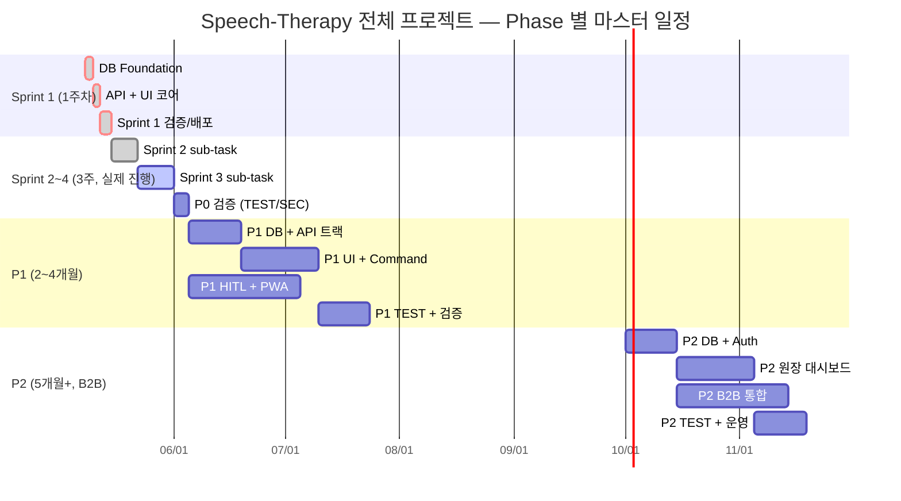
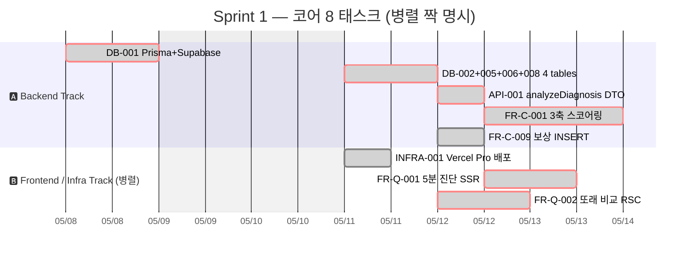
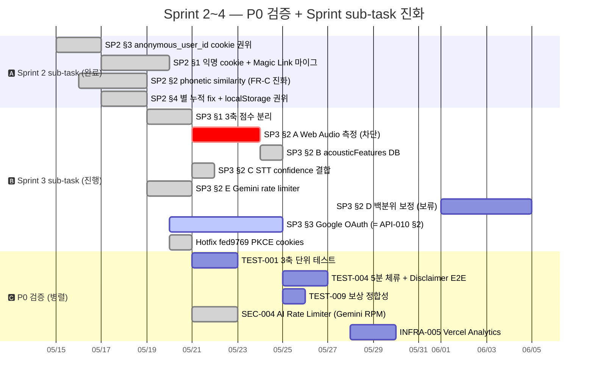
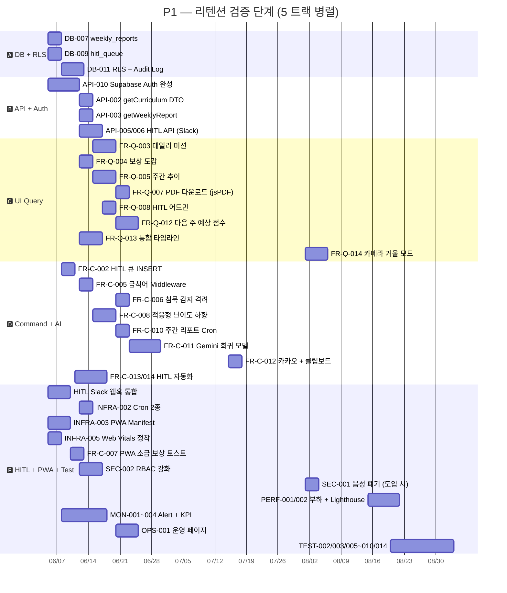
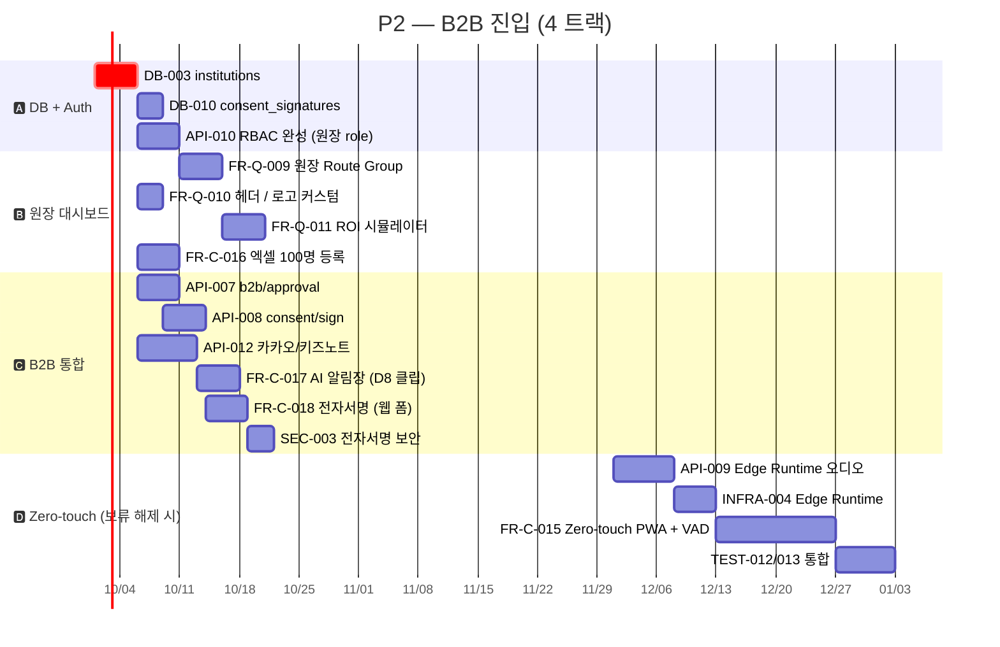

# 08. 프로젝트 간트 차트 — 병렬 / 독립 진행 가능 트랙 시각화

> **문서 정보**
> - **작성일**: 2026-05-16
> - **작성자**: Claude (Opus 4.7) + 사용자 (`hjh890989@gmail.com`)
> - **위치**: `Speech-Therapy_App/tasks/08_Project_Gantt_Chart_병렬_트랙.md`
> - **상위 데이터 소스**:
>   - [`03_Tasks_Breakdown_SRS_reinforce.md`](03_Tasks_Breakdown_SRS_reinforce.md) §1 (Sprint 1 일정), §3 (88 통합 태스크 표), §4 (Phase 게이트), §9 (의존성 맵), §10 (Sprint sub-task 확장판)

---

## 0. 목적 / 활용

§9 / §10 의 의존성 매트릭스를 **시간축 위**로 펼쳐 다음을 한눈에 보여준다:

1. 어느 task 들이 **순차적**으로 실행되어야 하는가 (Critical Path)
2. 어느 task 들이 **병렬** 가능한가 (worker 추가 시 단축 가능 영역)
3. 어느 task 들이 **독립** 진행 가능한가 (다른 트랙 영향 없음)
4. 현재 진행 상태 (✅ 완료 / 🟠 진행 중 / 🔴 차단 / ⬜ 보류)

색 / 마커 범례:

| 표시 | 의미 |
|---|---|
| `crit` | Critical path (모든 후속 작업 의존, 지연 시 전체 슬립) |
| `done` | 이미 완료 (대화기록 기준) |
| `active` | 진행 중 (현재 시점) |
| 표준 | 예정 |

---

## 1. 마스터 간트 차트 (전체 5개월)

> 핵심 5개 Phase 의 굵직한 흐름. 세부 task 단위는 §3~§6 의 phase 별 차트 참조.



---

## 2. 병렬 가능 트랙 요약

| Phase | 병렬 트랙 수 | 핵심 트랙 (worker 1명씩 분배 시) |
|---|---|---|
| **Sprint 1** | 2 트랙 | A. Backend (DB + API + FR-C) / B. Frontend (FR-Q + INFRA) |
| **Sprint 2~4** | 3 트랙 | A. 검증 (TEST/SEC) / B. Sprint 진화 (SP2/SP3) / C. 인프라 (Analytics/Rate Limiter) |
| **P1** | **5 트랙** | A. DB+RLS / B. API+Auth / C. UI Query / D. Command / E. HITL+PWA |
| **P2** | **4 트랙** | A. DB+Auth / B. 원장 대시보드 / C. B2B 통합 / D. TEST |

→ Sprint 1 은 1~2명 / P1+ 는 3~5명 worker 확보 시 일정 압축 효과 최대.

---

## 3. Sprint 1 상세 (1주차, 2026-05-08 ~ 2026-05-14)



### 3.1 Sprint 1 의 병렬 짝

| 직렬 (Critical Path) | 병렬 가능 (대각선 트랙) | 절감 효과 |
|---|---|---|
| DB-001 → 4 tables → API-001 → FR-C-001 (3.5일) | INFRA-001 (DB-001 후) | -0.5일 |
| API-001 → FR-C-001 (1.5일) | FR-Q-001 (API-001 후 병렬, 1일) | -1일 |
| 4 tables → FR-C-009 (0.5일) | FR-Q-002 (4 tables 후 병렬, 1일) | -0.5일 |

→ 단일 worker: 7일 / 2명 worker: 약 4.5일 (35% 단축 가능)

### 3.2 완전 독립 task

- **MOCK-001** (API-001 직후, 어느 worker 든 가능) — frontend 선개발용
- **SEC-004** (API-011 + INFRA-005 후, 별도 worker 가능)

---

## 4. Sprint 2~4 상세 (3주, 2026-05-15 ~ 2026-06-04)

실제 진행된 Sprint sub-task + P0 검증 작업.



### 4.1 Sprint 2~4 의 차단 / 진행 상태

| Sub-task | 상태 | 차단 / 위험 | 해결 액션 |
|---|---|---|---|
| **SP3 §2 A** | 🔴 **차단** | Web Audio + SpeechRecognition mic 동시 점유 충돌 | `NEXT_PUBLIC_ENABLE_AUDIO_ANALYZER=false` 핫픽스 적용. 재설계 (옵션 A/B/C) 결정 대기 |
| **SP3 §3** | 🟠 **진행 중** | Google OAuth 401 `invalid_client` | Supabase Provider Client ID 재입력 (대화기록 §19.1) |
| **SP3 §2 D** | ⬜ **보류** | 실 사용자 진단 데이터 부족 | N=50+ 누적 후 진입 |

### 4.2 병렬 가능 트랙 (현재 ~ Sprint 4 종료)

- 🅰️ SP3_2A 재설계 ↔ 🅱️ SP3_3 OAuth 401 진단 (서로 독립, 동시 진행 가능)
- 🅲️ INFRA-005 Analytics 도입 (위 두 트랙과 무관, 단독 worker 가능)
- 🅳️ TEST-001/004/009 작성 (병렬 트랙으로 독립)

---

## 5. P1 상세 (2~4개월, 2026-06-05 ~ 2026-09-04)

49 P1 task 를 5개 트랙으로 분배.



### 5.1 P1 의 병렬 트랙 5개 — 동시 진행 가능

| 트랙 | 핵심 작업 | 의존 (Sprint 2~4 산출물) |
|---|---|---|
| 🅰️ DB + RLS | DB-007/009/011 | DB-005 (Sprint 1 완료) |
| 🅱️ API + Auth | API-010 / 002/003/005/006 | DB-007/009 (트랙 🅰️ 와 약한 연결) |
| 🅲️ UI Query | FR-Q-003~014 | API-002/003 (트랙 🅱️ 의존) |
| 🅳️ Command + AI | FR-C-002/005/006/008/010~014 | API + DB |
| 🅴️ HITL + PWA + TEST | HITL Slack, PWA, MON, TEST | 독립도 높음 |

→ 5명 worker 확보 시 약 3개월 → 1.5개월로 압축 가능 (단, 트랙 간 mock 데이터 합의 필요).

---

## 6. P2 상세 (5개월+, 2026-10-01 ~)



---

## 7. 완전 독립 task 식별 (어느 시점이든 worker 추가 시 즉시 시작 가능)

| Task | 독립 이유 | 시점 |
|---|---|---|
| **MOCK-001** | API-001 만 의존, FE 선개발용 | Sprint 1 진행 중 |
| **MOCK-002 / MOCK-003** | 해당 API 만 의존, 다른 워커 작업 무관 | Sprint 2~4 ~ P1 진입 |
| **INFRA-005 (Analytics)** | INFRA-001 만 의존, 어디서든 가능 | Sprint 1 종료 직후 |
| **README / docs 작성** | 코드 의존 0 | 어느 시점이든 |
| **`.cursor/skills/` 보강** | harness, 코드 영향 0 | 어느 시점이든 (현재 진행 중) |
| **HITL Slack 웹훅 설정 (D4)** | 외부 시스템 설정만, 코드 거의 없음 | Sprint 2~4 시점부터 |
| **PWA Manifest** | 정적 자산 (icons / manifest.json) | Sprint 2 종료 후부터 |

---

## 8. 권장 Worker 분배 시나리오

### 8.1 솔로 개발자 (현재)

- 순차 진행, 위 간트 차트의 critical path 따름
- Sprint 1: 7일 / Sprint 2~4: 21일 / P1: 90일 / 합계 약 4개월
- 본 sub-session 의 현재 차단 우선 해소 (SP3_2A 재설계, SP3_3 OAuth)

### 8.2 2명 worker (개발자 + 디자이너 또는 boss + 개발자)

| Worker A (Backend) | Worker B (Frontend / QA) |
|---|---|
| DB / API / Command / Lib / Prisma | UI / FE / TEST / Mock / Docs |
| Sprint 1: 4.5일 | Sprint 1: 3일 (Mock + UI 사전 작업) |

### 8.3 4~5명 worker (P1 단계 진입 시)

| Worker | 책임 영역 |
|---|---|
| A | DB + Migration + RLS |
| B | API + Auth + Server Action |
| C | UI Query (FR-Q 시리즈) |
| D | Command + AI 통합 (FR-C 시리즈) |
| E | HITL + PWA + TEST + 운영 |

P1 90일 → 약 30~45일로 압축 가능 (5명 fully utilized 가정).

---

## 9. Critical Path 종합

전체 5개월 critical chain (지연 시 즉시 전체 지연):

```
DB-001 → DB묶음 → API-001 → FR-C-001
  → SP2_2 phonetic → SP3_1 3축 분리
  → SP3_2A Web Audio (⚠️ 차단)
  → SP3_3 OAuth (🟠 진행 중)
  → P1 API-010 완성 → P1 UI/Command 5 트랙
  → P2 DB-003 → 원장 대시보드 → B2B 통합
```

**현재 critical 차단 2건**:
1. SP3_2A (Web Audio) — 재설계 결정 대기
2. SP3_3 (Google OAuth) — Client ID 재입력 검증 대기

이 둘 해소 후 Sprint 2~4 검증 마무리 → P1 진입.

---

## 10. 다음 액션 (간트 차트 활용)

| 단계 | 액션 | 참조 |
|---|---|---|
| 1 | SP3_2A 재설계 옵션 결정 (A: 2번 발화 / B: Cloud STT / C: 영구 폐기) | 대화기록 §15.3 |
| 2 | SP3_3 OAuth 401 해결 (Client ID 재입력) | 대화기록 §19.1 |
| 3 | P0 검증 잔여 (TEST-001/004/009 + INFRA-005) — 트랙 🅲️ 가능 | §4.2 |
| 4 | P1 진입 게이트 통과 후 — 5 트랙 worker 분배 검토 | §5.1 |
| 5 | P2 B2B 5건 LOI 확보 후 — 4 트랙 분배 | §6 |

---

## 부록 A. Mermaid gantt 렌더링 확인

본 차트는 GitHub / VS Code Markdown Preview 에서 자동 렌더링됩니다. 미렌더링 시:

- VS Code: "Markdown Preview Mermaid Support" 확장 설치
- 또는 https://mermaid.live 에 ```` ```mermaid ```` 블록 안 코드 붙여넣기

## 부록 B. 추적성

- ✅ §3 통합 태스크 표의 "선행" 컬럼 반영
- ✅ §9 의 88 task 의존성 맵 일관
- ✅ §10 의 Sprint sub-task 진행 상태 일관
- ✅ §4 Phase 게이트 일정 (1주 / 3주 / 2~4개월 / 5개월+) 일관
