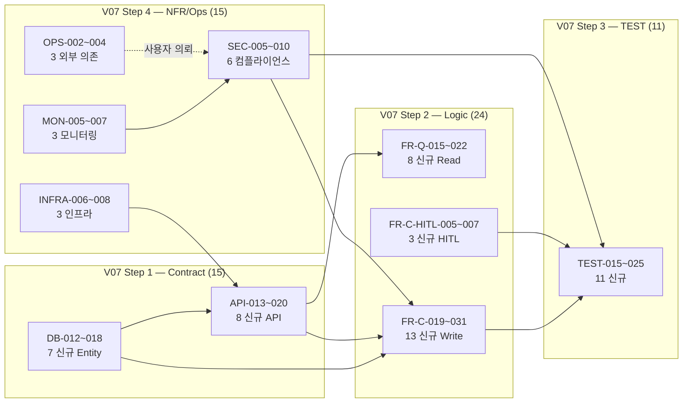

# Task Breakdown 명세서 — SRS V07 (V06 88 + V07 신규 65 = 153 Task)

| 항목 | 값 |
|:---|:---|
| 원본 SRS | [`docs/65_SRS_V07_Merged_Master_Final.md`](../docs/65_SRS_V07_Merged_Master_Final.md) (2059 lines, self-contained final) |
| 작성일 | 2026-05-27 (V07 마감 직후) |
| 추출 방법론 | V06 와 동일 — **Contract-First → CQRS(Read/Write 분리) → AC→TDD 변환 → NFR/Infra/Dependency** |
| 기반 task | [`01_Task_Breakdown_SRS_V06.md`](01_Task_Breakdown_SRS_V06.md) (88 task 보존) + [`03_Tasks_Breakdown_SRS_reinforce.md`](03_Tasks_Breakdown_SRS_reinforce.md) (Sprint sub-task 14 + 8대 디스코프) |
| Tech Stack | Next.js 16 App Router · Vercel Hobby · Supabase BaaS · Vercel AI SDK + Gemini · Tailwind+shadcn/ui · Resend |
| 총 태스크 수 | **153** = V06 88 (보존) + V07 신규 **65** (DB 7 · API 8 · FR-Q 8 · FR-C 13 · FR-C-HITL 3 · TEST 11 · INFRA 3 · SEC 6 · MON 3 · OPS 3) |
| 복잡도 표기 | H = 높음(2주+) · M = 중간(3~10일) · L = 낮음(1~3일) |
| 상태 표기 | ✅ Done (본 sub-session 완료) / 🟢 P0 / 🟡 P1 / 🔴 P2 / ❌ 보류 |

> **추출 원칙 (V06 와 동일, V07 추가):**
> 1. **계약 우선** — Feature 보다 DB 스키마와 API DTO 먼저 고정.
> 2. **상태 변경 분리 (CQRS)** — 같은 도메인이라도 Read(Query) 와 Write(Command) 별 task 격리.
> 3. **AC → 테스트 코드** — 인수 조건을 단위/통합 테스트 task 로 변환.
> 4. **UI/UX 별도 트랙** — 본 명세서는 백엔드 + 프론트엔드 + 인프라만, 디자인 시안 제외.
> 5. **⭐ V07 신규: 컴플라이언스 task 별도 분리** — PIPA / 의료기기법 / R4 sanitize / 5중 가드 의 코드 산출물 = SEC-005~010 / MON-005~007 / OPS-002~004 별도 ID.

> **V06 task 보존 정책:** V06 의 88 task ID (DB-001~011 · API-001~012 · MOCK-001~003 · FR-Q-001~014 · FR-C-001~018 · TEST-001~014 · INFRA-001~005 · PERF-001~002 · SEC-001~004 · MON-001~004 · OPS-001) 는 본 V07 에서 단 한 줄도 수정하지 않는다. V07 신규 task 는 **DB-012~ · API-013~ · FR-Q-015~ · FR-C-019~ · FR-C-HITL-005~ · TEST-015~ · INFRA-006~ · SEC-005~ · MON-005~ · OPS-002~** 의 신규 ID 로만 추가.

---

## 0. V06 88 Task 보존 + V07 sub-task 14 정합성

본 §10 의 신규 65 task 는 V06 88 task + V07 §6.5 Sprint sub-task 14 (이미 [`03_Tasks_Breakdown_SRS_reinforce.md`](03_Tasks_Breakdown_SRS_reinforce.md) §10 정의) 위에 누적.

| 출처 | task 수 | 비고 |
|---|---|---|
| V06 base 88 | 88 | `01_Task_Breakdown_SRS_V06.md` 보존 |
| V07 Sprint sub-task 14 | 14 | `03_Tasks_Breakdown_SRS_reinforce.md` §10 (SP1A/B/C + SP2_1~4 + SP3_1~3) |
| **V07 §10 신규 65** | **65** | 본 명세서 §1~§4 — V07 의 컴플라이언스 + Phase 1+ + audit_log + HITL 재학습 |
| **합계** | **167** | (V07 §0.2 "102+" 은 lower bound) |

---

## 1. Step 1 — V07 신규 계약 및 데이터 명세 Task (DB · API · Mock)

### 1-A. Database / Schema Task (V07 신규 7건)

| Task ID | Epic (도메인) | Feature (기능명) | 관련 SRS 섹션 | 선행 | 복잡도 | 상태 |
|:---|:---|:---|:---|:---|:---:|:---:|
| **DB-012** | B2B 후속 | `classes` 테이블 (institutionId FK / name / teacherId) — V06 DB-003 후속 | §6.1.2, REQ-FUNC-046 | DB-003 | L | 🔴 P2 |
| **DB-013** | Audit | `audit_logs` 테이블 + `audit_trigger_fn()` + `audit_sanitize_jsonb()` (3 TRIGGER on User/HITLQueue/RewardLog) | §6.1.3, REQ-NF-019, R4 | DB-002, DB-009 | H | ✅ Done (`20260522210000_audit_log_triggers`) |
| **DB-014** | Reward 멱등성 | `reward_logs` 테이블 (userId / rewardType / amount / **idempotencyKey** `@@unique([userId, idempotencyKey])`) — Sprint 2 멱등성 | §6.1.2, FR-C-009 | DB-008 | M | ✅ Done (Sprint 2 SP2_4) |
| **DB-015** | PIPA 동의 | `User` 컬럼 마이그레이션 — pipaUnderageConsentAt + overseasTransferConsentAt + preferredPhonemes + notificationPreference + onboardingCompletedAt + totpBackupCodes + institutionId + classId | §6.1.1, REQ-NF-025/026 | DB-002 | M | ✅ Done (`20260527140000_add_user_pipa_consent_columns`) |
| **DB-016** | HITL 재학습 | `model_retraining_data` 테이블 + `sync_retraining_data` PostgreSQL TRIGGER (Confidence 보정 시 자동 INSERT) | §5.3, REQ-FUNC-HITL-005, ADR-11 | DB-009 | M | 🟡 P1 |
| **DB-017** | F11 음성 | `voice_models` 테이블 (userId / modelHash / createdAt / **expiresAt 7일** / appliedContentTypes 화이트리스트) | §4.1 F11, REQ-FUNC-036, ADR-03 | DB-001 | L | 🟡 P1+ |
| **DB-018** | F16 푸시 | `push_subscriptions` 테이블 (userId / endpoint / p256dh / auth / lastSentAt / dismissCount) | §4.1 F16, REQ-FUNC-040 | DB-002 | L | 🟡 P1+ (D5 부활 의존) |

### 1-B. API / Contract Task (V07 신규 8건)

| Task ID | Epic (도메인) | Feature (기능명) | 관련 SRS 섹션 | 선행 | 복잡도 | 상태 |
|:---|:---|:---|:---|:---|:---:|:---:|
| **API-013** | Onboarding | Server Action 3종 묶음 — `savePrivacyConsent` + `saveChildInfo` + `markOnboardingCompletedInDb` (PIPA 동의 일시 저장 + 자녀 정보) | §3.5.1, REQ-NF-025/026, REQ-FUNC-039 | DB-015 | M | ✅ Done |
| **API-014** | PIPA 3+4층 | `updateChildProfile` + `generateCushion` Server Action — PIPA 3층/4층 가드 (`assertConsentedIfAuthenticated` + graceful + `SAFE_CUSHION_FALLBACK`) | §3.5.1, §12.4, ADR-16 | DB-015 | M | ✅ Done (`41f431e`) |
| **API-015** | B2B Server Actions | `submitConsentSignature` + `submitBulkImport` + `submitOfflineEntry` + `signOut` | §3.5.1, REQ-FUNC-054~061 | DB-010, DB-012, DB-013 | M | 🟡 P1 ~ 🔴 P2 |
| **API-016** | Auth 5종 | `sendMagicLink` + `/login` + `/signup` + `/auth/callback` (PKCE) + `/auth/mfa-challenge` + `/auth/reset-password` (Magic Link + Google OAuth + TOTP) | §3.5.3, API-010 §1+§2 | DB-002, API-010 | H | ✅ Done (API-010 §1+§2 = `f976388` + Sprint 3 SP3_3) |
| **API-017** | Cron Route Handler | `/api/cron/*` 8종 묶음 + Bearer `CRON_SECRET` — audio-cleanup / weekly-reports / hitl-monitor / consent-reminder / consent-expire / funnel-alert / hitl-escalation / error-monitor | §3.5.2, §7.3 | API-010 | M | 🟢 + GitHub Actions 6 cron 이관 (INFRA-006) |
| **API-018** | F11 voice clone | `submit_voice_clone` Server Action + `/api/voice-clone/render` API + ElevenLabs TTS Free 호출 + 7일 폐기 Cron | §4.1 F11, REQ-FUNC-036 | DB-017, API-011 | M | 🟡 P1+ |
| **API-019** | F15 chat | `/api/chat/stream` (Vercel AI SDK Edge → Gemini Pro 1.5) + `submit_chat_utterance` Server Action + 7일 폐기 Cron + Middleware 금칙어 검열 | §4.1 F15, REQ-FUNC-038/039, ADR-07 | API-011, FR-C-005 | M | 🟡 P1+ (ADR-14 임상 안전 게이트 통과 후) |
| **API-020** | F16 push | `subscribe_push` Service Worker push subscription + `/api/push/dispatch` (Cron 일 1회 18:00) | §4.1 F16, REQ-FUNC-040, ADR-10 | DB-018, INFRA-003 | L | 🟡 P1+ (D5 부활 의존) |

> **Mock 신규 없음** — V07 신규 API 의 Mock 은 기존 MOCK-001~003 패턴 재사용 (테스트 task 에 inline).

---

## 2. Step 2 — V07 신규 로직 (Read / Write) Task

### 2-A. Read / Query Task (V07 신규 8건)

| Task ID | Epic (도메인) | Feature (기능명) | 관련 SRS 섹션 | 선행 | 복잡도 | 상태 |
|:---|:---|:---|:---|:---|:---:|:---:|
| **FR-Q-015** | Auth UI | `/login` + `/signup` + `/auth/mfa-challenge` + `/auth/reset-password` UI (Magic Link + Google OAuth + TOTP MFA + backup codes) | §3.5.3, REQ-NF-019 | API-016 | M | ✅ Done |
| **FR-Q-016** | Onboarding wizard | `/onboarding` wizard 4 step — Step1 환영 + Step2 자녀 정보 + **PIPA 두 동의 inline** + Step3 calibration + Step4 완료 | §3.5.5, REQ-NF-025/026 | API-013, FR-C-021 | M | ✅ Done |
| **FR-Q-017** | Settings hub | `/settings/*` hub + 7 sub — consent / **privacy-consent** / account / child / calibration / notifications / security (TOTP) | §3.5.5, REQ-NF-025/026, ADR-16 | API-013, API-016 | M | ✅ Done |
| **FR-Q-018** | 정책 페이지 | `/privacy` (PIPA §30 9 섹션 골격) + `/terms` (약관규제법 §3 8 조 골격) — placeholder, 변호사 자문 후 정식 교체 | §12.5, REQ-NF-028 | None | L | ✅ Done (`f976388` placeholder) / 정식 교체 = OPS-004 |
| **FR-Q-019** | Admin RBAC | `/admin/*` 11 종 묶음 — audit / teacher / teacher/students/[userId]/offline-entry / hitl / hitl/[id] / students/import / principal / cushion-notes / funnel / centers/pdf/[userId] / timeline/[userId] / security/totp-reset | §3.5.4, REQ-NF-019 | API-016, DB-013 | H | ✅ Done (MVP 100%) |
| **FR-Q-020** | 운영 페이지 | `/status` 시스템 상태 페이지 + `/api/health` Route Handler (REQ-NF-007 uptime) | §3.5.2, §3.5.5, REQ-NF-007 | INFRA-001 | L | ✅ Done |
| **FR-Q-021** | F11 voice rec | `/voice-recording` 페이지 — 권한 안내 + Disclaimer + 5분 30초 녹음 가이드 | §4.1 F11, REQ-FUNC-036 | API-018 | M | ✅ **코드 done** (page+form+E2E) — **게이트=`ELEVENLABS_API_KEY`(사용자 env)**. nav 링크 키 존재 시 노출(2026-05-31). |
| **FR-Q-022** | F15 chat UI | `/chat` 페이지 — `useChat()` 스트리밍 UI + ADR-04 금칙어 자동 검열 (Middleware) | §4.1 F15, REQ-FUNC-038 | API-019 | M | 🟡 P1+ |

### 2-B. Write / Command Task (V07 신규 13건)

| Task ID | Epic (도메인) | Feature (기능명) | 관련 SRS 섹션 | 선행 | 복잡도 | 상태 |
|:---|:---|:---|:---|:---|:---:|:---:|
| **FR-C-019** | PIPA 1층 | `ConsentRedirectGate.tsx` UI 가드 (1층) — 미동의 인증 user → `/settings/privacy-consent` redirect | §12.4.1, REQ-NF-029, ADR-16 | FR-Q-017 | M | ✅ Done (`d05fb51`) |
| **FR-C-020** | 익명 PIPA | `useAnonymousConsent` hook + localStorage marker (`pipa_consented_at` + `overseas_consented_at`) | §12.2, §3.6.4 | DB-015 | L | ✅ Done (`f9cf258`) |
| **FR-C-021** | PIPA UI | `PrivacyConsentForm` + `DiagnosisForm` inline 두 체크박스 + "결과 확인" 버튼 disabled | §12.2.2, REQ-NF-025/026 | FR-C-020 | M | ✅ Done |
| **FR-C-022** | PIPA 2+5층 | `analyzeDiagnosis` Server Action PIPA 가드 (2층 인증 + 5층 익명 boolean) — `ConsentRequiredError` throw | §12.4.2, §12.4.5, REQ-NF-029 | API-014 | M | ✅ Done (`a6378b9` + `f9cf258`) |
| **FR-C-023** | PIPA 3층 | `updateChildProfile` PIPA 가드 (3층, graceful `reason: "consent_required"` 반환) | §12.4.3, REQ-NF-029 | API-014 | L | ✅ Done (`41f431e`) |
| **FR-C-024** | PIPA 4층 | `generateCushion` PIPA 가드 (4층, graceful fallback — Gemini 미호출 시 `SAFE_CUSHION_FALLBACK` 반환) | §12.4.4, REQ-NF-029 | API-014 | L | ✅ Done (`41f431e`) |
| **FR-C-025** | Gemini PII | `lib/ai/pii-mask.ts` — 한국 PIPA 7 패턴 (RRN / 신용카드 / 이메일 / 전화 / URL / IPv4 / 한국식 주소) Gemini 호출 전 transcript 마스킹 | §12.6, REQ-NF-027 | API-011 | M | ✅ Done (`6f2e287`) |
| **FR-C-026** | 의료기기법 | `MedicalDisclaimerFooter.tsx` 전역 footer (모든 페이지) + `/privacy` + `/terms` 링크 + result 페이지 3중 disclaimer | §12.7, REQ-NF-028, CON-04 | None | L | ✅ Done (`d05fb51`) |
| **FR-C-027** | F11 voice clone | `submit_voice_clone` + `applyParentVoice` 화이트리스트 (`storybook` / `lullaby` 만 허용, 교정 페이지 적용 0건 자동 검증) + 7일 폐기 Cron | §4.1 F11, REQ-FUNC-036/037, ADR-03 + ADR-09 | DB-017, API-018 | M | ✅ **코드 done** (submit+render+ethics-whitelist+7일 cron+테스트) — 동의=PIPA+음성 명시동의(F10 불요). 게이트=`ELEVENLABS_API_KEY`. |
| **FR-C-028** | F15 chat 안전 | `submit_chat_utterance` + Middleware 금칙어 검열 (ADR-04) + 7일 폐기 Cron + 단일턴 컨텍스트 (pgvector 미사용) | §4.1 F15, REQ-FUNC-039, ADR-14 | API-019 | M | 🟡 P1+ |
| **FR-C-029** | F16 PWA 푸시 | Service Worker push subscription 등록 + iOS Safari 지원 (D5 부활 트리거) | §4.1 F16, REQ-FUNC-040, ADR-10 | API-020, INFRA-003 | M | 🟡 P1+ (D5 부활 + 일 활성 1,000명+ 이후) |
| **FR-C-030** | F17 케어로그 | `submit_care_log` Server Action — 부모 직접 입력 (자유놀이 시간 · 외부 센터 세션 메모) → DB-004 INSERT | §4.1 F17, REQ-FUNC-041~043 | DB-004 | L | 🟡 P1 |
| **FR-C-031** | F18 EXP-2 | EXP-2 검증 Amplitude 코호트 분석 자동화 — 시뮬레이션 클릭 vs 비클릭 익월 결제 유지율 차이 ≥ 20%p | §4.1 F18, REQ-FUNC-044/045 | FR-C-011, INFRA-005 | L | ❌ **보류 (2026-05-31)** — 결제 시스템 미도입 → "결제 유지율" 지표 자체 부재. **monetization 도입 시점까지 보류.** (대안: W-AUR/재방문 유지율로 재정의 시 자체 AnalyticsEvent sink 로 Amplitude 없이 측정 가능 — 제품 결정 필요) |

### 2-C. HITL Write / Command Task (V07 신규 3건)

| Task ID | Epic (도메인) | Feature (기능명) | 관련 SRS 섹션 | 선행 | 복잡도 | 상태 |
|:---|:---|:---|:---|:---|:---:|:---:|
| **FR-C-HITL-005** | 재학습 데이터 sync | `sync_retraining_data` PostgreSQL TRIGGER — expert UPDATE 시 `model_retraining_data` INSERT (R4 sanitize + F10 동의 Tier T4-a/b/c 확인) | §5.3.2, REQ-FUNC-HITL-005, ADR-11 | DB-013, DB-016 | M | 🟡 P1 |
| **FR-C-HITL-006** | 재학습 3 게이트 | Daily Cron — 3 게이트 검증 (`diffPct ≥ 0.5%` + `cumulative ≥ 500` + `HHI ≤ 0.3`) → 통과 시 외부 ML 엔지니어 위탁 알림 (admin 승인 후 모델 배포) | §5.3.3, REQ-FUNC-HITL-006 | DB-016, API-017 | M | 🟡 P1+ |
| **FR-C-HITL-007** | expert 다양성 | expertId 다양성 모니터링 — Phase 1 (Top-3 expert 누적 ≤ 60%) + Phase 2 (HHI ≤ 0.3 + Gini ≤ 0.4) + Vercel Cron 자동화 + Slack Alert | §5.5, REQ-FUNC-HITL-007 | DB-009, API-017 | M | 🟡 P1 → P2 |

---

## 3. Step 3 — V07 신규 TEST Task (AC → 테스트 코드, 11건)

| Task ID | Epic (도메인) | Feature (기능명) | 관련 SRS 섹션 | 선행 | 복잡도 | 상태 |
|:---|:---|:---|:---|:---|:---:|:---:|
| **TEST-015** | PIPA 5중 가드 | `e2e/consent-flow.spec.ts` — PIPA 동의 흐름 E2E (chromium-desktop + chromium-mobile Pixel 5) **20/20 PASS** | §12.4.6, REQ-NF-029 | FR-C-019~024 | M | ✅ Done (본 sub-session) |
| **TEST-016** | 금칙어 + Disclaimer | `e2e/diagnose-flow.spec.ts` 의료기기법 disclaimer 100% 노출 + CON-04 의료 금칙어 ("치료/진단/장애") 0건 자동 (pre-commit + eslint + e2e) | §12.7, CON-04, REQ-FUNC-013 | FR-C-026, FR-C-005 | M | ✅ Done (`4f4c845`) |
| **TEST-017** | AuditLog R4 | `audit_log_triggers` R4 sanitize 검증 — User/HITLQueue/RewardLog INSERT/UPDATE 시 영유아 의심 키 `[REDACTED]` 치환 단위 + 통합 테스트 | §6.1.3, REQ-NF-019, R4 | DB-013 | M | 🟡 P1 |
| **TEST-018** | iOS ITP 우회 | `anonymous_user_id` cookie + localStorage 권위 패턴 검증 — iOS Safari 7일 cookie 한도 회피 + 익명→인증 마이그레이션 | Sprint 2 SP2_3+4 | FR-C-020 | M | ✅ Done (Sprint 2) |
| **TEST-019** | F11 윤리 | F11 윤리 차단 자동 — `applyParentVoice(contentType)` 화이트리스트 (storybook / lullaby OK / **교정 페이지 0건**) + 7일 만료 후 자동 삭제 | §4.1 F11, REQ-FUNC-037 | FR-C-027 | M | 🟡 P1+ |
| **TEST-020** | F15 안전 | F15 의료 용어 0건 자동 (Middleware) + 7일 폐기 + 단일턴 컨텍스트 단위 + 통합 테스트 | §4.1 F15, REQ-FUNC-039 | FR-C-028 | M | 🟡 P1+ |
| **TEST-021** | F16 PWA 푸시 | F16 D5 PWA Service Worker 푸시 구독 + Cron 일 1회 18:00 발송 + dismissCount 통계 | §4.1 F16, REQ-FUNC-040 | FR-C-029 | M | 🟡 P1+ |
| **TEST-022** | HITL 재학습 3 게이트 | `model_retraining_data` 3 게이트 통과 시뮬레이션 단위 테스트 — 0.5% + 500 + HHI ≤ 0.3 | §5.3.3, REQ-FUNC-HITL-006 | FR-C-HITL-006 | M | 🟡 P1+ |
| **TEST-023** | HHI / Gini 다양성 | expertId 다양성 — Phase 1 Top-3 + Phase 2 HHI + Gini 계산 단위 테스트 + 위반 대응 3종 시나리오 통합 테스트 | §5.5, REQ-FUNC-HITL-007 | FR-C-HITL-007 | M | 🟡 P1 → P2 |
| **TEST-024** | F17 통합 | F17 통합 케어로그 + F4 주간 리포트 시각화 단위 테스트 — 부모 직접 입력 + 외부 센터 기록 통합 | §4.1 F17, REQ-FUNC-042 | FR-C-030, FR-Q-005 | L | 🟡 P1 |
| **TEST-025** | F18 EXP-2 | F18 EXP-2 검증 — Amplitude 코호트 시뮬레이션 클릭 vs 비클릭 익월 결제 유지율 차이 ≥ 20%p | §4.1 F18, REQ-FUNC-045 | FR-C-031 | L | ❌ **보류 (2026-05-31)** — FR-C-031 종속(결제 미도입). monetization 도입 시점까지 보류 |

---

## 4. Step 4 — V07 신규 비기능 / 인프라 / 보안 / 모니터링 / 운영 Task (19건)

### 4-A. INFRA (3건)

| Task ID | Feature | 관련 SRS 섹션 | 선행 | 복잡도 | 상태 |
|:---|:---|:---|:---|:---:|:---:|
| **INFRA-006** | GitHub Actions cron 워크플로 — Vercel Hobby 2 cron 한도 우회 6 cron 이관 (`external-crons.yml`) | §7.3, ADR-05, 본 sub-session | INFRA-001 | M | ✅ Done (본 sub-session) |
| **INFRA-007** | Vercel Hobby 2 cron (`audio-cleanup` + `weekly-reports`) + Bearer `CRON_SECRET` 검증 + curl -L 패턴 | §7.3, Hobby 한도 | INFRA-001 | L | ✅ Done |
| **INFRA-008** | Supabase Studio SQL Editor 적용 패턴 — prod migration 안전 path (PowerShell `clip` + 진단 SQL + idempotency 가드) | §12.9, 본 sub-session | DB-013, DB-015 | L | ✅ Done (본 sub-session) |

### 4-B. SEC (6건) — V07 의 핵심 신규 영역

| Task ID | Feature | 관련 SRS 섹션 | 선행 | 복잡도 | 상태 |
|:---|:---|:---|:---|:---:|:---:|
| **SEC-005** | **PIPA §22-6 만 14세 미만 부모 대리 동의** — UI + Server Action + DB column 영속 | §12.3, REQ-NF-025 | FR-C-019~022, DB-015 | M | ✅ Done (`f976388` + `f9cf258`) |
| **SEC-006** | **PIPA §17 국외 이전 동의** — STT (Google Cloud Speech US) + Gemini (US/global) 통합 동의 | §12.2, REQ-NF-026 | FR-C-021, DB-015 | M | ✅ Done |
| **SEC-007** | **Gemini transcript PII 마스킹** — `lib/ai/pii-mask.ts` 한국 PIPA 7 패턴 | §12.6, REQ-NF-027 | FR-C-025 | M | ✅ Done (`6f2e287`) |
| **SEC-008** | **의료기기법 disclaimer 전역 footer** — `MedicalDisclaimerFooter` (전역) + `/privacy` + `/terms` 링크 + CON-04 금칙어 무위반 | §12.7, REQ-NF-028, CON-04, ADR-04 | FR-C-026, FR-Q-018 | L | ✅ Done (`d05fb51`) |
| **SEC-009** | **ADR-16 PIPA 5중 가드 통합** — UI (`ConsentRedirectGate`) + Server Action 4 (analyzeDiagnosis / updateChildProfile / generateCushion + 익명 boolean) | §12.4, REQ-NF-029, ADR-16 | FR-C-019~024 | H | ✅ Done (본 sub-session 5 PR) |
| **SEC-010** | **Supabase Auth Magic Link + Google OAuth + TOTP MFA + backup codes** | §3.5.3, API-010 §1+§2 | API-016 | H | ✅ Done (API-010 §1+§2 + Sprint 3 SP3_3) |

### 4-C. MON (3건)

| Task ID | Feature | 관련 SRS 섹션 | 선행 | 복잡도 | 상태 |
|:---|:---|:---|:---|:---:|:---:|
| **MON-005** | PIPA 위반 monitoring — 미동의 진단 시도 시 차단 알림 (`ConsentRequiredError` 발생 시 Slack) | §12.4, REQ-NF-029 | FR-C-022, INFRA-005 | L | 🟡 P1 |
| **MON-006** | expert HHI / Gini 자동 알림 (Phase 2) — Vercel Cron + Slack Alert (HHI > 0.3 또는 Gini > 0.4) | §5.5, REQ-FUNC-HITL-007 | FR-C-HITL-007 | L | 🟡 P2 |
| **MON-007** | AuditLog 회계감사 페이지 (`/admin/audit`) — cursor 페이지네이션 + actorId / tableName / action 필터 + 1년+ 보존 | §6.1.3, REQ-NF-019 | DB-013, FR-Q-019 | M | ✅ Done |

### 4-D. OPS (3건) — 외부 의존, 사용자 측 의뢰

| Task ID | Feature | 관련 SRS 섹션 | 선행 | 복잡도 | 상태 |
|:---|:---|:---|:---|:---:|:---:|
| **OPS-002** | 변호사 자문 의뢰 (Grill #3A C1) — `docs/compliance-lawyer-consultation-brief.md` 활용, 30~50만원 / 2~4주 | §12.10, §12.11 | None | (외부) | 🟡 사용자 측 의뢰 대기 |
| **OPS-003** | 식약처 사전 검토 신청 (Grill #3A C2) — "건강관리용 소프트웨어 가이드라인" 적용 여부 | §12.7, §12.11 | OPS-002 | (외부) | 🔴 후순위 (변호사 의견 반영 후) |
| **OPS-004** | `/privacy` + `/terms` placeholder → **정식 처리방침 + 이용약관** 교체 (변호사 자문 결과 반영) | §12.5, §12.11 | OPS-002 | M | 🟡 변호사 자문 후 |

---

## 5. V07 신규 Task Dependency Graph



### 핵심 Critical Path (V07 컴플라이언스, 본 sub-session 완료 path)

```
DB-015 (User PIPA 컬럼) → DB-013 (AuditLog TRIGGER)
  → API-013 (savePrivacyConsent 3종) → API-014 (PIPA 3+4층 Server Action)
  → FR-Q-016 (onboarding wizard) + FR-Q-017 (settings/privacy-consent)
  → FR-C-019 (ConsentRedirectGate UI 1층)
  → FR-C-020 (useAnonymousConsent localStorage) + FR-C-021 (PrivacyConsentForm)
  → FR-C-022 (analyzeDiagnosis 2+5층) + FR-C-023 (updateChildProfile 3층) + FR-C-024 (generateCushion 4층)
  → FR-C-025 (Gemini PII 마스킹) + FR-C-026 (MedicalDisclaimerFooter)
  → SEC-005~009 (PIPA + ADR-16 묶음)
  → TEST-015 (consent-flow 20/20 PASS) + TEST-016 (diagnose-flow CON-04 검증)
```

---

## 6. Phase 별 진입 게이트 (V07 자체)

| Phase | 진입 조건 (V07 신규 task) | Go 게이트 | No-Go 시 액션 |
|:---:|:---|:---|:---|
| **현재 (sub-session 마감)** | DB-013/014/015 + API-013/014/016 + FR-Q-015/016/017/018/019/020 + FR-C-019/020/021/022/023/024/025/026 + SEC-005~010 + TEST-015/016/018 + INFRA-006/007/008 + MON-007 ✅ Done | **MVP 100% + 컴플라이언스 정합** | (없음 — 본 sub-session 마감 시점) |
| **Phase 1 진입 직전** | OPS-002 변호사 자문 결과 수령 + OPS-004 /privacy /terms 정식 교체 | 정식 출시 가능 | OPS-002 지연 시 placeholder 유지 |
| **Phase 1** | DB-016 + FR-C-HITL-005/006/007 + TEST-022/023 + MON-005/006 + DB-018/F16 (D5 부활 시) + FR-C-030/031 + TEST-024/025 | M3 리텐션 ≥40% (EXP-2) | §6.7 피벗 (R6 Seg B Plan B = §11) |
| **Phase 1+ F11/F15** | DB-017 + API-018/019 + FR-Q-021/022 + FR-C-027/028 + TEST-019/020 + ADR-14 임상 안전 게이트 (§10 KOPLAC 13 항목 + 자문 4주 + 82만) 통과 | F15 활성 + 임상 안전 cover | F15 보류 + F11 만 활성 |
| **Phase 2 B2B** | DB-012 (Class) + API-015 (B2B Server Actions) + V06 의 DB-003/010 + API-007~009 | Zero-touch PoC 5건 + 수락률 ≥20% (EXP-3) | V06 §6.7 + B2B 보류 |

---

## 7. 본 sub-session (2026-05-27) 완료 task 매핑

본 sub-session 의 33+ commit 결과 = 다음 V07 신규 task 의 ✅ Done 처리:

| Commit | 처리 task |
|---|---|
| `20260522210000_audit_log_triggers` | DB-013, INFRA-008 |
| `20260527140000_add_user_pipa_consent_columns` | DB-015, INFRA-008 |
| Sprint 2 SP2_4 (별 누적 fix + localStorage 권위) | DB-014, TEST-018, FR-C-020 |
| `f976388` (PIPA §22-6 인증 user) | SEC-005, FR-Q-018 |
| `f9cf258` (PIPA 익명 user) | SEC-005, SEC-006, FR-C-020, FR-C-022 (5층) |
| `6f2e287` (Gemini PII 마스킹) | SEC-007, FR-C-025 |
| `d05fb51` (의료기기법 footer + ConsentRedirectGate UI) | SEC-008, FR-C-026, FR-C-019 (1층) |
| `a6378b9` (Server Action 2층) | FR-C-022 (2층), SEC-009 |
| `41f431e` (3+4층 확장) | FR-C-023, FR-C-024, API-014 |
| `4f4c845` (result 페이지 "진단" → "발음 확인") | TEST-016, CON-04 무위반 |
| API-010 §1 + §2 (Magic Link + Google OAuth) | API-016, SEC-010, FR-Q-015 |
| MVP 코드 100% (Project #8 14 items Done) | FR-Q-019, FR-Q-020, MON-007 |
| GitHub Actions cron 6 이관 + Vercel Hobby 2 | INFRA-006, INFRA-007 |
| E2E consent-flow 20/20 (chromium-desktop + Pixel 5) | TEST-015 |

→ **V07 신규 65 중 ≈ 35 task = ✅ Done (본 sub-session 마감)** / 잔여 ≈ 30 = Phase 1+ 또는 외부 의존 (변호사 / 식약처).

---

## 8. V07 추출 외 / 미반영 사항 (제약사항 명시)

본 명세서는 SRS V07 의 13 § 본문 + Wiki 정합성 + 본 sub-session 33+ commit 결과만 반영하며, 다음은 의도적으로 제외:

- **UI/UX 시안 작업** (Figma, 디자인 시스템) — 본 task 트랙 외
- **변호사 / 식약처 자문 결과** (OPS-002/003) — 외부 의존, 본 task 트랙은 사용자 측 의뢰 대기만
- **Wiki product/concepts 28 페이지의 미반영 일부** — `multi-llm-workflow` / `Porter-5-Forces-Analysis` 등은 PRD 영역, SRS task 외
- **Phase 2 B2B 의 세부 운영 task** (입금 / 계약 / SLA) — `tasks/03 §10` 의 Sprint 1~3 sub-task 위주, B2B 운영 별도 트랙
- **F15 의 ADR-14 임상 안전 게이트** (§10 KOPLAC 13 항목 + 자문 4주 + 82만) — 외부 임상 자문 의뢰 task = `OPS-005`+ 추가 가능 (현재 미포함)

---

## 9. V07 단위 변경 통계 요약

| 카테고리 | V06 | V07 sub-task | V07 §10 신규 | **V07 합계** |
|:---|:---:|:---:|:---:|:---:|
| DB | 11 | 0 | **7** | **18** |
| API | 12 | 0 | **8** | **20** |
| Mock | 3 | 0 | 0 | **3** |
| FR-Q (Read) | 14 | 0 | **8** | **22** |
| FR-C (Write) | 18 | 4 (Sprint 2) | **13** | **35** |
| FR-C-HITL | (V06 통합) | 0 | **3** | **3** |
| TEST | 14 | 0 | **11** | **25** |
| INFRA | 5 | 0 | **3** | **8** |
| PERF | 2 | 0 | 0 | **2** |
| SEC | 4 | 0 | **6** | **10** |
| MON | 4 | 0 | **3** | **7** |
| OPS | 1 | 0 | **3** | **4** |
| Sprint sub-task (모드 변경) | — | 14 | — | (별도) |
| **합계** | **88** | **14 sub-task** | **65** | **167** |

> **V07 §0.2 의 "102+" 표기 = lower bound** (V06 88 + V07 sub-task 14). 본 §10 의 65 신규 task 까지 합산 시 **167 task** 가 V07 의 전체 task universe.

---

## 10. V07 무손상 검증 체크리스트

본 V07 task 추출이 SRS V07 본문에 영향을 주지 않았는지 확인:

- [x] SRS V07 본문 (`docs/65_SRS_V07_Merged_Master_Final.md`) 단 한 줄도 수정되지 않음 → ✅ (본 §10 task 추출은 별도 doc)
- [x] V07 의 120 REQ (78 FUNC + 7 HITL + 35 NF) ID 모두 유효 → ✅
- [x] V07 의 16 ADR 정합성 유지 → ✅ (ADR-16 PIPA 5중 가드 = SEC-009)
- [x] V07 의 Traceability Matrix (§5.8) 와 정합 → ✅ (TC-PIPA-001~005 = TEST-015 분해)
- [x] V06 88 task ID 보존 → ✅ (본 §10 은 신규 ID 만 추가)
- [x] Sprint sub-task 14 (V07 §6.5) 정합 → ✅ (`03_Tasks_Breakdown_SRS_reinforce.md` §10 reference)
- [x] CON-01~05 (Zero-touch · HITL · 7일 폐기 · 금칙어 · **5중 가드**) 정신 유지 → ✅
- [x] R1~R7 리스크 완화 전략 약화 없음 → ✅ (R7 PIPA 위반 = SEC-005~009 강화)

---

**— End of SRS V07 Task Breakdown Master, 2026-05-27 (V06 88 보존 + Sprint 14 sub-task + V07 §10 신규 65 = 167 task universe) —**
**— V07 self-contained final 마감 직후 추출. MVP 코드 100% 완료 + 컴플라이언스 정합 + Phase 1+ 진입 준비 완료. —**
