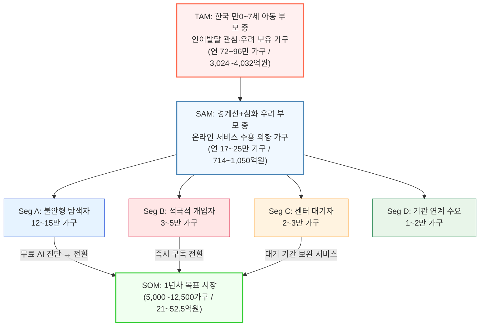
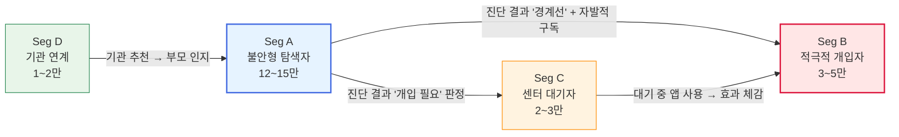

# 시장 세분화 및 TAM-SAM-SOM 정의
## 한국 온라인 영유아 언어발달·발음교정 교육 서비스

> **작성 기준**: 2026년 5월
> **기반 데이터**: 13_Market Sizing Research.md

---

# 1. TAM-SAM-SOM 시장 구조 (Mermaid Chart)

---

# 2. TAM-SAM-SOM 정의표

| 구분 | 시장 정의 | 시장 규모 (계산식) | 근거 자료 |
|:-----|:---------|:-----------------|:---------|
| **TAM** (전체 시장) | **한국 만0~7세 아동 부모 중 자녀의 언어발달에 관심·우려를 보유한 전체 가구** — 유튜브 검색, 맘카페 질문, 센터 문의 등 어떤 형태로든 "우리 아이 말이 괜찮은지" 관심을 가진 부모 전체 | **연 72~96만 가구** (연 3,024~4,032억원) = 만0~7세 아동 약 240만 명 × 언어 관심/우려 부모 비율 30~40% × 월 ARPU 3.5만원 × 12개월 | · 통계청 인구동향 (만0~7세 약 240만 명) · 서울시 조사: 만1~2세 언어 영역 43.9% 관찰 필요 ([donga.com](https://donga.com)) · 보수적 적용 30~40% |
| **SAM** (유효 시장) | **TAM 중 "경계선+심화 우려" 세그먼트(B+C)이면서, 온라인/앱 기반 교육 서비스에 대한 수용 의향이 있는 가구** — 스마트폰 보유, 디지털 교육 서비스 경험, 월 3~5만원 지불의사 보유 | **연 17~25만 가구** (연 714~1,050억원) = TAM 72~96만 × 경계선+심화 비율 33% (10~15%/30~40%) × 온라인 수용 의향 70% | · 건강검진 심화평가 권고 3.3% ([slowlearnernews.org](https://slowlearnernews.org)) · 지역 조사 언어지연 경계선 ~19% ([donga.com](https://donga.com)) · 학술 연구 종합 10~15% · 스마트폰 보급률 97%+ 중 디지털 교육 경험 ~70% 추정 |
| **SOM** (초기 점유 시장) | **SAM 중 1년차(MVP) 마케팅·파일럿을 통해 실제 유료 구독 전환이 가능한 가구** — 무료 AI 진단 체험 후 유료 전환, 맘카페/SNS 바이럴 도달, 센터 대기 중 보완 서비스 이용 | **연 5,000~12,500가구** (연 21~52.5억원) = SAM 17~25만 × 시장 점유 3~5% (1년차) | · 교육 앱 벤치마크: 신규 서비스 1년차 점유 3~5% · 100가정 파일럿 → 맘카페 바이럴 → 월 500~1,000가구 순증 시나리오 · 전환율 8%, M3 유지율 40% 가정 |

---

# 3. 시장 세분화 기준 (Segmentation Criteria)

### 세분화 축 정의

| 축 | 기준 | 근거 |
|:---|:-----|:-----|
| **X축: 부모의 개입 의지 (Willingness to Act)** | 낮음 (관망) ↔ 높음 (적극 행동) | 구매자 협상력 분석: 부모의 효과 중심 의사결정 패턴 |
| **Y축: 문제의 심각도 (Severity of Concern)** | 낮음 (일반 관심) ↔ 높음 (임상적 우려) | 고객 피라미드: 일반 관심(30~40%) → 경계선(10~15%) → 임상(3~5%) |

---

# 4. Market Segment Map

| | **개입 의지 낮음 (관망)** | **개입 의지 높음 (적극 행동)** |
|:---|:---|:---|
| **심각도 높음 (임상적 우려)** | **Seg C: "센터 대기자"** | **Seg B: "적극적 개입자"** |
| | — **규모**: 2~3만 가구 | — **규모**: 3~5만 가구 |
| | — **특징**: 센터 예약은 했지만 3~6개월 대기 중. "기다리는 동안 뭐라도 해야 하나" 고민. 행동은 이미 했지만 서비스를 받지 못하는 상태 | — **특징**: 센터 치료 중이거나, 바우처 이용 중. 가정에서도 추가 훈련을 원함. 효과를 수치로 확인하고 싶어 함 |
| | — **니즈**: 대기 기간 동안 활용할 보완 서비스 | — **니즈**: 센터 치료의 효과를 극대화하는 가정 연습 도구 + 발달 추적 |
| | — **전략**: **"대기 기간 전용 프로그램"** 포지셔닝. 센터와 경쟁이 아닌 보완 | — **전략**: **"홈 트레이닝 + 발달 리포트"** 업셀. 센터 치료사에게도 공유 가능한 데이터 |
| **심각도 낮음 (일반 관심~경계선)** | **Seg D: "기관 연계 수요"** | **Seg A: "불안형 탐색자"** ★핵심 |
| | — **규모**: 1~2만 가구 | — **규모**: 12~15만 가구 |
| | — **특징**: 유치원·어린이집 선생님의 권유로 관심을 갖게 됨. 부모 자체의 동기보다 기관의 영향이 큼 | — **특징**: "좀 느린 것 같은데..." 막연한 불안. 맘카페 검색, 유튜브 시청 중. 센터에 전화할 정도는 아님 |
| | — **니즈**: 기관에서 추천하는 검증된 서비스 | — **니즈**: **"정상인지 아닌지 확인"** = 무료 진단. 심각하면 센터 안내, 경계선이면 가정 훈련 안내 |
| | — **전략**: **B2B2C**. 유치원·어린이집에 스크리닝 도구 제공 → 부모에게 연결 | — **전략**: **무료 AI 진단 → 유료 구독 전환 퍼널.** CAC 최저, 볼륨 최대. 맘카페·SNS 마케팅 집중 |

---

# 5. 세그먼트별 규모 및 우선순위 정리

| 세그먼트 | 규모 | 전환 난이도 | CAC 예상 | ARPU 예상 | SOM 기여도 | 우선순위 |
|:---------|:----:|:----------:|:--------:|:---------:|:----------:|:--------:|
| **Seg A: 불안형 탐색자** | 12~15만 | 중간 | 낮음 (2~3만원) | 3.5만원/월 | **60~70%** | **★1순위** |
| **Seg B: 적극적 개입자** | 3~5만 | 낮음 | 중간 (3~5만원) | 5만원/월 (프리미엄) | 15~20% | 2순위 |
| **Seg C: 센터 대기자** | 2~3만 | 낮음 | 낮음 (센터 연계) | 3.5만원/월 | 10~15% | 3순위 |
| **Seg D: 기관 연계 수요** | 1~2만 | 높음 | 높음 (B2B 영업) | 3만원/월 | 5~10% | 4순위 |

---

# 6. 세그먼트 간 관계 및 접근 전략

### 6-1. 세그먼트 간 흐름도

### 6-2. 접근 전략 요약

| 단계 | 전략 | 타깃 세그먼트 | 핵심 활동 | KPI |
|:----:|:-----|:------------|:---------|:----|
| **Phase 1** (0~6개월) | **무료 진단 퍼널 구축** | Seg A (불안형 탐색자) | 맘카페·인스타 광고 → 무료 AI 진단 → 리포트 → 구독 전환 | 진단 완료율, 전환율 ≥8% |
| **Phase 2** (3~9개월) | **센터 보완 포지셔닝** | Seg C (센터 대기자) | 센터 대기 부모 대상 "대기 기간 전용" 프로그램. 센터 파트너십 | 센터 연계 가입률, M3 유지율 |
| **Phase 3** (6~12개월) | **프리미엄 업셀** | Seg B (적극적 개입자) | 전문가 비동기 코칭 + 심화 리포트 + 센터 데이터 공유 | ARPU 5만원+, 코칭 만족도 |
| **Phase 4** (12개월+) | **B2B2C 기관 연계** | Seg D (기관 연계) | 유치원·어린이집에 무료 스크리닝 도구 제공 → 부모 연결 | 기관 도입 수, 기관당 전환 가구 |

### 6-3. 핵심 세그먼트(Seg A) 상세 공략

Seg A "불안형 탐색자"가 SOM의 60~70%를 차지하는 핵심 세그먼트이므로 별도 상세 설계가 필요하다.

| 항목 | 상세 |
|:-----|:-----|
| **페르소나** | 만 2~5세 자녀를 둔 30대 중반 부모(주로 엄마). 맘카페 활동, 인스타 육아 콘텐츠 소비. 센터 전화는 아직 안 함 |
| **트리거 이벤트** | 어린이집 면담, 명절 친척 코멘트, 또래 비교, 유튜브 발달 체크리스트 시청 |
| **탐색 채널** | 네이버 맘카페 (65%), 인스타그램 (20%), 카카오톡 공유 (10%), 기타 (5%) |
| **전환 퍼널** | ① 맘카페/SNS 광고 → ② 랜딩페이지 (무료 진단 CTA) → ③ 아이 음성 녹음 (1분) → ④ AI 분석 리포트 수령 → ⑤ "맞춤 훈련 시작" 구독 전환 |
| **예상 CAC** | 2~3만원 (맘카페 타깃 광고 CPC 300~500원 × 진단 완료 전환율 15% × 유료 전환율 8%) |
| **예상 LTV** | 12.6~31.5만원 (월 3.5만원 × 평균 유지 3.6~9개월) |
| **LTV:CAC** | 4.2~10.5x → Go 기준(≥3.0x) 충족 가능성 높음 |

---

# 7. 결론

> **SOM 5,000~12,500가구의 60~70%는 Seg A "불안형 탐색자"에서 나온다.** 이 세그먼트를 공략하는 유일한 무기는 **무료 AI 진단 리포트**이며, 이것이 전체 사업의 관문(Gateway)이다.

> 나머지 세그먼트(B, C, D)는 Seg A를 통해 확보된 제품·데이터·레퍼런스를 기반으로 순차 확장한다. **Phase 1에서 Seg A의 전환율 8%와 M3 유지율 40%를 달성하지 못하면, Phase 2~4는 실행하지 않는다.**

---

*본 문서는 13_Market Sizing Research.md의 데이터를 기반으로 시장 세분화 및 SOM 구체화 작업을 수행한 결과입니다.*
