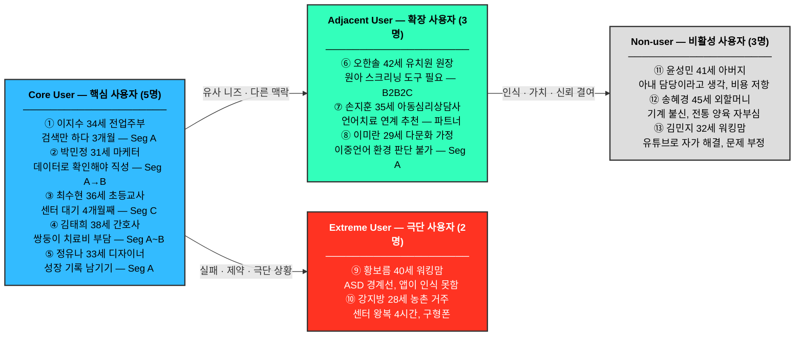

# 고객 페르소나 스펙트럼
## 한국 온라인 영유아 언어발달·발음교정 교육 서비스

> **작성 기준**: 2026년 5월 | **기반**: 14_Market Segmentation Map.md
> **목적**: SOM 공략을 위한 실질적 고객 이해 및 제품 설계 기준 수립

---

# 페르소나 스펙트럼 구조

| 유형 | 수 | 설명 | 전략적 목적 |
|:-----|:--:|:-----|:-----------|
| **핵심(Core)** | 5명 | 이상적인 주요 고객. Seg A·B 중심 | 주력 타깃 설정, 매출 기반 |
| **확장(Adjacent)** | 3명 | 유사 문제를 가진 인접 시장 | 확장 기회 탐색 |
| **극단(Extreme)** | 2명 | 제약·극단적 상황의 사용자 | 제품 개선·포용적 설계 |
| **비활성(Non-user)** | 3명 | 미사용·회피 집단 | 진입 장벽·거부 요인 파악 |

---

# 페르소나 스펙트럼 요약 도표

### 스펙트럼 간 관계 요약

| 관계 | 방향 | 전략적 의미 |
|:-----|:-----|:-----------|
| Core → Adjacent | 핵심 → 확장 | 핵심 사용자(부모)의 니즈와 유사하지만 다른 맥락(기관, 전문가, 다문화)에서 동일 문제를 경험하는 그룹. **Phase 3~4에서 B2B2C로 진입** |
| Core → Extreme | 핵심 → 극단 | 핵심 사용자와 같은 문제를 가지지만, 기술·지리·장애 유형의 제약으로 서비스 이용에 반복적으로 실패하는 그룹. **이들을 만족시키면 핵심 사용자는 자동 만족 (포용적 설계 기준)** |
| Adjacent → Non-user | 확장 → 비활성 | 서비스의 존재를 알아도 인식(필요성 불감)·가치(비용 저항)·신뢰(기술 불신) 부족으로 사용하지 않는 그룹. **직접 타깃이 아니라 간접 전략(아빠 참여 콘텐츠, 소아과 신뢰 앵커)으로 접근** |

---

# Part 1. 핵심 사용자 (Core Users) — 5명

---

## Core-1. 이지수 (34세, 전업주부)
**"검색만 하다가 3개월이 지났어요"**

| 항목 | 내용 |
|:-----|:-----|
| **직무/상황** | 만 3세 아들을 키우는 전업주부. 남편 맞벌이 전까지 육아 전담. 인스타와 맘카페가 주요 정보 채널 |
| **문제** | "이 정도면 기다려도 되는 건지" 막연함. 센터에서 정식 검사를 받았다가 진짜 '장애' 판정이 나올까 봐 두려워 **진단을 회피**함. 맘카페 자가진단표를 보며 안심하다가도 다시 불안해하는 악순환 반복 |
| **목표** | 아이 언어 수준이 정상 범위인지 객관적으로 확인하고, 필요하면 가정에서 해줄 수 있는 방법을 알고 싶음 |
| **감정** | 불안 + 죄책감 ("내가 말을 덜 걸어줬나?") + 정보 과부하로 인한 피로감 |
| **대체 솔루션** | 맘카페 게시글 정독, 유튜브 "말이 늦는 아이" 채널 구독, 소아과 검진 시 의사에게 물어봄 |
| **전환 트리거** | "무료로 아이 발음 검사해드립니다" → 부담 없이 시도 가능 |
| **세그먼트** | Seg A (불안형 탐색자) |

---

## Core-2. 박민정 (31세, 마케터)
**"데이터로 확인해야 직성이 풀려요"**

| 항목 | 내용 |
|:-----|:-----|
| **직무/상황** | 광고대행사 마케터. 만 4세 딸. 맞벌이로 아이는 어린이집에 다님. 데이터와 수치로 판단하는 성향 |
| **문제** | 타인의 모호한 피드백("발음이 좀...")을 견디지 못함. 정확히 또래 하위 몇 %인지, 어떤 음소 단위가 문제인지 **데이터화된 진단**을 원함. 진단 점수가 낮게 나와도 현실을 마주해야 다음 스텝(해결책)을 밟을 수 있다고 생각함 |
| **목표** | 발음 정확도를 수치로 추적하고, 월별 개선 데이터를 보고 싶음. "이번 달 /ㅅ/ 85% → /ㅈ/ 72%"처럼 구체적으로 |
| **감정** | 분석 욕구 + "내가 직접 할 수 있다"는 자기효능감 추구 |
| **대체 솔루션** | 발달 관련 앱 2개 다운로드했다가 리텐션 없어서 삭제, 소아청소년과 발달 검사 예약 |
| **전환 트리거** | 주간 발달 추이 그래프 ("62점→71점") + 세부 음소별 분석 리포트 |
| **세그먼트** | Seg A → Seg B 전환 가능성 높음 |

---

## Core-3. 최수현 (36세, 초등교사)
**"전문가 말을 들어야 안심이 돼요"**

| 항목 | 내용 |
|:-----|:-----|
| **직무/상황** | 초등학교 3학년 담임. 만 5세 아들. 학교에서 아이들 발달을 많이 봐서 우리 아이가 느리다는 걸 남들보다 빨리 알아챔 |
| **문제** | 4개월 대기 중 아이의 상태가 '더 나빠지거나 골든타임을 놓치고 있는 것은 아닌지' 극도로 불안함. 당장 현재 상태에 대한 **정확한 진단 스냅샷**과, 그 진단 결과에 기반한 즉각적인 응급 처방(가이드)을 원함 |
| **목표** | 센터 치료 시작 전까지 가정에서 체계적으로 연습시키고, 센터에 갈 때 "이 아이 집에서 이렇게 훈련했어요"라고 데이터로 보여주고 싶음 |
| **감정** | 조급함 ("골든타임 놓칠까봐") + 전문성 신뢰 욕구 |
| **대체 솔루션** | 언어치료사 유튜브 채널 정주행, 학교 특수교사 동료에게 개인적으로 조언 요청 |
| **전환 트리거** | "전문 언어재활사가 주간 코멘트 제공" + "센터 대기 중 활용 가능" 메시지 |
| **세그먼트** | Seg C (센터 대기자) |

---

## Core-4. 김태희 (38세, 간호사)
**"치료비가 너무 부담스러운데 효과는 원해요"**

| 항목 | 내용 |
|:-----|:-----|
| **직무/상황** | 병원 3교대 간호사. 만 4세 쌍둥이 (둘 다 말이 느림). 센터 비용을 계산했더니 쌍둥이 합산 월 40~60만원. 현실적으로 한 명만 보낼 수 있음 |
| **문제** | 비용 부담으로 두 아이 모두에게 치료를 받게 할 수 없음. "누구를 센터에 보내고 누구를 집에서 케어할지" 결정하기 위한 **신뢰할 수 있으면서도 저렴한 사전 진단(Triage) 도구**가 절실히 필요함 |
| **목표** | 센터 다니는 아이와 비슷한 수준의 효과를 가정에서도 만들고 싶음. 비용 효율적으로 |
| **감정** | 죄책감 ("한 명한테 소홀한 것 같아") + 피로 + 비용 압박 |
| **대체 솔루션** | 바우처 신청했지만 소득 기준 초과. 유튜브 틀어주는 것이 전부 |
| **전환 트리거** | "오늘의 5분 활동" 형태의 간결한 가이드 + 월 3만원대 합리적 가격 |
| **세그먼트** | Seg A~B (비용 민감형) |

---

## Core-5. 정유나 (33세, 프리랜서 디자이너)
**"아이 성장 기록을 남기고 싶어요"**

| 항목 | 내용 |
|:-----|:-----|
| **직무/상황** | 재택 프리랜서. 만 2세 딸. 언어 발달 걱정보다는 "잘 자라고 있는지" 확인하고 기록하는 것에 관심. 인스타에 육아 일기 운영 중 |
| **문제** | 문제 해결보다는 '안심'을 위한 **정기 진단**을 원함. 마치 건강검진처럼 "이번 달에도 정상입니다"라는 확인 도장을 받아야 마음이 편함. 진단 과정 자체가 아이에게 스트레스를 주지 않는 가벼운 놀이 형태이길 바람 |
| **목표** | 월별 언어 발달 스냅샷과 성장 곡선을 포트폴리오처럼 기록하고 싶음. 나중에 아이에게 보여줄 수 있는 데이터 |
| **감정** | 호기심 + 기록 욕구 + 낮은 긴급도 (문제보다 관심의 영역) |
| **대체 솔루션** | 육아 앱 (아이 성장 앨범류), 소아과 정기 검진 |
| **전환 트리거** | "월간 언어 발달 리포트" + 시각적으로 예쁜 성장 곡선 UI |
| **세그먼트** | Seg A (예방적 니즈형) |

---

# Part 2. 확장 사용자 (Adjacent Users) — 3명

---

## Adjacent-1. 오한솔 (42세, 유치원 원장)
**"우리 원 아이들 발달 현황을 파악하고 싶어요"**

| 항목 | 내용 |
|:-----|:-----|
| **직무/상황** | 사립 유치원 원장. 원아 80명. 매년 2~3명의 언어발달 지연 아이 발견. 부모에게 어떻게 말을 꺼낼지 난감함 |
| **문제** | 기관 차원에서 부모에게 "치료를 권유"하는 것은 큰 갈등 소지가 됨. 교사의 주관적 판단이 아닌, 제3자(AI)의 **객관적 진단 데이터**를 방패 삼아 부모를 설득하고 전문 기관으로 안전하게 연계하고 싶어 함 |
| **목표** | 연 1회 전체 원아 언어 스크리닝 → 결과를 부모에게 공유 → 필요 시 전문 기관 연계 |
| **감정** | 책임감 + 부모 관계 관리 부담 + 객관적 근거 필요 |
| **대체 솔루션** | 지역 아동센터 의뢰, 특수교사 자문 |
| **전략적 의미** | B2B2C 채널. 원장 1명 설득 → 80가구 노출. Seg D 핵심 |

---

## Adjacent-2. 손지훈 (35세, 아동심리상담사)
**"언어가 아니라 정서인데, 언어도 같이 다뤄야 해요"**

| 항목 | 내용 |
|:-----|:-----|
| **직무/상황** | 사설 아동심리상담센터 운영. 내담 아동 중 30%가 언어발달 문제도 함께 가짐. 언어치료 전문이 아니어서 언어 부분은 연계 기관을 추천해줌 |
| **문제** | 연계할 만한 언어치료 기관의 대기가 길어서 부모들이 기다리는 동안 방치됨. 가정에서 할 수 있는 언어 자극 도구를 부모에게 추천하고 싶음 |
| **목표** | 심리상담 + 언어 자극을 병행하는 통합 지원 체계 구축. 신뢰할 수 있는 언어 교육 앱을 공식 추천 |
| **감정** | 전문성 확장 욕구 + 파트너십 니즈 |
| **대체 솔루션** | 개별 언어재활사 비공식 연결 |
| **전략적 의미** | 전문가 채널 파트너. "전문가 추천 앱" 포지셔닝 가능 |

---

## Adjacent-3. 이미란 (29세, 다문화 가정 어머니)
**"한국어가 먼저인지 모국어가 먼저인지 모르겠어요"**

| 항목 | 내용 |
|:-----|:-----|
| **직무/상황** | 베트남 출신. 한국 남편과 결혼 7년. 만 4세 아들. 집에서는 베트남어+한국어 혼용. 아이가 두 언어 모두 또래보다 느림 |
| **문제** | 이중언어 환경인지 언어지연인지 구분이 안 됨. 상담받고 싶지만 한국어로만 설명하는 전문가와의 소통이 어려움. 한국어 발음이 약한 아이를 어떻게 도와야 하는지 정보가 없음 |
| **목표** | 아이의 한국어 발달 수준을 객관적으로 파악하고, 이중언어 환경에서의 적절한 가이드를 받고 싶음 |
| **감정** | 고립감 + 문화적 불안 + 자기 비난 |
| **대체 솔루션** | 다문화가족지원센터 (대기 길고 접근 불편), 유튜브 한국어 동요 |
| **전략적 의미** | 다문화 가정이 한국 전체 10% 이상. 이 세그먼트 전용 콘텐츠는 차별화 요소 |

---

# Part 3. 극단 사용자 (Extreme Users) — 2명

---

## Extreme-1. 황보름 (40세, 워킹맘 + 발달장애 아동)
**"앱이 아이를 이해 못하면 소용없어요"**

| 항목 | 내용 |
|:-----|:-----|
| **직무/상황** | 대기업 HR 팀장. 만 6세 아들이 ASD(자폐스펙트럼장애) 경계선 진단. 센터 치료 + 특수교육 + 언어치료 동시 진행 중. 월 치료비 80만원 |
| **문제** | AI 음성 분석이 "정형적인 발화 패턴"을 기준으로 하다 보니, 비전형적 발화를 하는 아이의 데이터가 제대로 분석되지 않음. "우리 아이는 앱이 인식을 못해요"라는 반복 경험 |
| **목표** | 아이의 발화 특성을 이해하는 AI + 치료사가 실제로 검토하는 구조. 데이터가 치료사에게 공유되어 치료 계획에 반영되기를 원함 |
| **감정** | 좌절 + 높은 전문성 ("나도 이제 준전문가야") + 강한 요구 수준 |
| **대체 솔루션** | 치료사와 카카오톡으로 매일 소통, 직접 치료 영상 촬영해서 분석 |
| **설계 시사점** | 비전형 발화 데이터 처리 능력 필요. 치료사 협업 API 구조 고려. **이 사용자를 만족시키면 일반 사용자는 저절로 만족** |

---

## Extreme-2. 강지방 (28세, 농촌 거주 부모)
**"가까운 센터가 차로 2시간 거리예요"**

| 항목 | 내용 |
|:-----|:-----|
| **직무/상황** | 강원도 농촌 거주. 농업 종사. 만 3세 딸. 읍내에 언어치료센터가 없어서 시내까지 나가야 함. 차로 왕복 4시간 + 치료비 = 사실상 불가능 |
| **문제** | 온라인 서비스가 있어도 인터넷 속도가 느리고, 스마트폰이 구형이라 앱 구동이 불안정함. 음성 녹음 업로드가 자꾸 실패함. 데이터 요금도 부담 |
| **목표** | 지역에 상관없이 동일한 수준의 언어 교육을 받고 싶음. 최소한 "집에서 이렇게 해주세요"라는 가이드라도 |
| **감정** | 박탈감 + 체념 ("도시 애들이랑 차이날까봐") |
| **대체 솔루션** | 읍내 보건소 상담 (비정기), 유튜브 |
| **설계 시사점** | 저사양 기기 대응, 오프라인 캐시 기능, 경량 음성 녹음 UI 필요. 접근성 격차 해소가 핵심 사회적 가치 |

---

# Part 4. 비활성 사용자 (Non-users) — 3명

---

## Non-user-1. 윤성민 (41세, 아버지)
**"아내한테 맡기면 되는 거 아닌가요?"**

| 항목 | 내용 |
|:-----|:-----|
| **직무/상황** | 중소기업 영업직. 만 5세 아들. 아이 육아는 아내 담당이라는 인식. 아내가 언어치료 앱 사용을 권유했지만 관심 없음 |
| **문제** | 아들이 말이 느리다는 걸 알지만 "남자 애들은 원래 늦어. 크면 다 하게 돼"라는 확신. 앱 구독비용이 "무슨 앱이 3만원이냐"고 느낌 |
| **목표** | 없음. 개입 의지 없음 |
| **감정** | 무관심 + 근거 없는 낙관 + 비용 저항 |
| **대체 솔루션** | 대체 행동 없음 |
| **거부 요인 분석** | 아버지를 사용자로 끌어들이려면 별도 진입점 필요. "아빠와 함께하는 5분 놀이" 등 아버지 역할 중심 콘텐츠가 필요 |
| **전략적 시사점** | 이 유형이 가정 내 구독 해지의 주요 원인. 아버지 설득 콘텐츠, 커플 공유 리포트 기능 고려 |

---

## Non-user-2. 송혜경 (45세, 전통적 가치관 부모)
**"옛날엔 다 알아서 컸어요"**

| 항목 | 내용 |
|:-----|:-----|
| **직무/상황** | 만 3세 손자를 함께 키우는 외할머니이자 실질적 양육자. 딸(엄마)은 직장 다니고 본인이 낮 시간 돌봄 담당 |
| **문제** | 앱으로 아이를 가르친다는 개념 자체를 낯설어함. "스마트폰 많이 보면 나쁜 거 아닌가요?" AI 진단 결과를 신뢰하지 않음. "기계가 어떻게 애를 알아?" |
| **목표** | 없음. 기존 방식(직접 말 걸기, 동요 부르기)이 충분하다고 생각 |
| **감정** | 불신 + 기술 거부감 + 전통 양육 방식에 대한 자부심 |
| **대체 솔루션** | 직접 말 걸기, 전래동요, 소아과 의사 말만 신뢰 |
| **거부 요인 분석** | "AI가 아이 발달을 판단할 수 있나"에 대한 신뢰 문제 + 디지털 리터러시 부족 |
| **전략적 시사점** | 이 유형은 직접 타깃 불가. 그러나 실질 양육자가 조부모인 가정(한국 약 20%)에서 서비스 침투 장벽. "소아과 선생님도 추천하는" 신뢰 앵커가 필요 |

---

## Non-user-3. 김민지 (32세, 워킹맘)
**"유튜브 보여주니까 괜찮아진 것 같아요"**

| 항목 | 내용 |
|:-----|:-----|
| **직무/상황** | IT기업 워킹맘. 만 4세 아들. 말이 약간 느리지만 "크면 다 하겠지"라고 낙관함. 유튜브 육아 채널을 구독하며 정보를 수집함 |
| **문제** | 굳이 돈을 내고 앱을 구독하거나 센터에 갈 필요성을 느끼지 못함. 유튜브에 있는 '언어 자극 영상'을 틀어주는 것만으로 부모로서 할 도리를 다했다고 생각하며 안심함 |
| **목표** | 돈과 시간을 더 들이지 않고 현재 상태 유지 |
| **감정** | 막연한 낙관 + 문제의 현실화 회피 (방어기제) |
| **대체 솔루션** | 유튜브 언어발달 콘텐츠 시청, 인스타그램 육아툰 공감 |
| **거부 요인 분석** | "유튜브에 공짜로 다 있는데 왜 돈을 내야 하지?"라는 **대체재 편향**. 무료 콘텐츠로 인한 '거짓 안심'이 가장 큰 진입 장벽 |
| **전략적 시사점** | SAM의 70~80%를 차지하는 최대 리스크 집단. 이들을 깨우려면 "유튜브 시청만으로는 뇌의 언어 영역이 활성화되지 않는다"는 충격 요법형(Pain-inducing) 마케팅 메시지 필요 |

---

# 페르소나 종합 비교표

| 페르소나 | 유형 | 세그먼트 | 개입 의지 | 지불의사 | 전환 트리거 | 이탈 리스크 |
|:---------|:-----|:---------|:--------:|:--------:|:-----------|:----------|
| Core-1 이지수 | 핵심 | Seg A | 중 | 중 | 무료 진단 + 리포트 | 효과 미체감 시 즉시 이탈 |
| Core-2 박민정 | 핵심 | Seg A→B | 높 | 높 | 수치 기반 분석 리포트 | 데이터 품질 저하 |
| Core-3 최수현 | 핵심 | Seg C | 높 | 중-높 | 전문가 코멘트 + 센터 연계 | 센터 치료 시작 후 이탈 가능 |
| Core-4 김태희 | 핵심 | Seg A~B | 높 | 낮-중 | 비용 효율 + 간결한 가이드 | 가격 인상 시 이탈 |
| Core-5 정유나 | 핵심 | Seg A | 중 | 중 | 기록 기능 + 예쁜 UI | 긴급도 낮아 이탈 쉬움 |
| Adjacent-1 오한솔 | 확장 | Seg D | 높 | 높 (기관) | B2B 스크리닝 패키지 | 도입 복잡성 |
| Adjacent-2 손지훈 | 확장 | 파트너 | 높 | N/A | 전문가 파트너십 프로그램 | 신뢰성 검증 |
| Adjacent-3 이미란 | 확장 | Seg A | 중 | 낮-중 | 다국어 지원 + 이중언어 가이드 | 언어 장벽 |
| Extreme-1 황보름 | 극단 | Seg B+ | 매우 높 | 높 | 치료사 연동 + 비전형 AI | 기능 한계 노출 시 이탈 |
| Extreme-2 강지방 | 극단 | Seg A | 높 | 낮 | 경량 앱 + 오프라인 지원 | 기술 장벽 |
| Non-user-1 윤성민 | 비활성 | — | 없음 | 없음 | 아버지 참여형 콘텐츠 | — |
| Non-user-2 송혜경 | 비활성 | — | 없음 | 없음 | 소아과 신뢰 앵커 | — |
| Non-user-3 김민지 | 비활성 | Seg A(방관) | 없음 | 없음 | 유튜브의 한계(충격 요법) | — |

---

# 제품 설계 시사점

| 인사이트 | 근거 페르소나 | 설계 방향 |
|:---------|:------------|:---------|
| **진입장벽은 "호들갑 부담"** | 이지수 | 무료·비공개 진단. "부담 없이 확인만" 메시지 |
| **리텐션은 수치 가시화** | 박민정 | 음소별 정확도 추이 그래프, 주간 변화 수치 강조 |
| **전문가 신뢰 앵커 필수** | 최수현, 송혜경 | "언어재활사 검토" 배지, 소아과 파트너십 |
| **간결함이 경쟁력** | 김태희 | 오늘의 5분 활동, 알림 최소화, 직관적 UX |
| **아버지 이탈 방지** | 윤성민 | 파트너 공유 리포트, 아빠 참여 콘텐츠 |
| **비전형 발화 대응** | 황보름 | AI 모델 다양화, 치료사 리뷰 레이어 |
| **저사양·지방 접근성** | 강지방 | 경량 앱, 오프라인 캐시, LTE 절약 모드 |
| **B2B2C 채널** | 오한솔, 손지훈 | 기관용 스크리닝 패키지, 전문가 파트너 프로그램 |
| **유튜브의 거짓 안심 타파** | 김민지 | "영상 시청 vs 상호작용" 효과 차이를 보여주는 진단 리포트 비교군 제시 |

---

*본 문서는 14_Market Segmentation Map.md의 세그먼트 분석을 기반으로 작성된 가상 페르소나입니다. 파일럿 인터뷰를 통해 실제 사용자 데이터로 검증·보완되어야 합니다.*
