# Pain / Goal 분석 및 대체 솔루션 만족도 평가
## 한국 온라인 영유아 언어발달·발음교정 교육 서비스

> **작성 기준**: 2026년 5월 | **기반**: 15_Persona_Spectrum.md, 16~17_Customer_Journey_Map

---

# 1. 전체 페르소나 Pain / Goal 요약표

| 구분 | 페르소나 | 핵심 Pain | 핵심 Goal |
|:-----|:---------|:---------|:---------|
| Core-1 | 이지수 (전업주부) | 정상/비정상 판단 기준 없음 + 진단 회피 심리 | 부담 없이 아이 발달 수준을 객관적으로 확인하고 싶음 |
| Core-2 | 박민정 (마케터) | 모호한 피드백만 있고 수치화된 데이터가 없음 | 음소별 정확도를 추적하며 직접 관리하고 싶음 |
| Core-3 | 최수현 (초등교사) | 센터 4개월 대기 중 골든타임 놓칠 불안 | 대기 중 체계적 가정 훈련 + 센터에 데이터 제출 |
| Core-4 | 김태희 (간호사) | 쌍둥이 치료비 감당 불가 + 피로 | 저비용·간결한 Triage 진단 + 5분 가정 활동 |
| Core-5 | 정유나 (디자이너) | 발달 기록의 정량적 기준 없음 | 월별 성장 곡선을 예쁘게 기록·공유 |
| Adj-1 | 오한솔 (유치원 원장) | 부모에게 치료 권유 시 갈등 발생 | 객관적 AI 진단 데이터로 안전하게 연계 |
| Adj-2 | 손지훈 (심리상담사) | 언어치료 연계 기관 대기 길어 부모 방치 | 신뢰할 수 있는 앱을 공식 추천하고 싶음 |
| Adj-3 | 이미란 (다문화 가정) | 이중언어 vs 언어지연 구분 불가 + 언어 장벽 | 한국어 발달 수준 객관 파악 + 이중언어 가이드 |
| Ext-1 | 황보름 (ASD 경계선) | AI가 비전형 발화를 인식 못함 | 치료사가 직접 검토하는 구조 + 센터 데이터 연동 |
| Ext-2 | 강지방 (농촌 거주) | 센터 접근 불가 + 구형폰·느린 인터넷 | 지역 무관하게 동일 수준 교육 + 오프라인 사용 |
| Non-1 | 윤성민 (아버지) | 육아 문제의 당사자라는 인식 없음 | 없음 (개입 의지 자체가 부재) |
| Non-2 | 송혜경 (외할머니) | AI·디지털 도구에 대한 근본적 불신 | 없음 (전통 방식이 충분하다는 확신) |
| Non-3 | 김민지 (워킹맘) | 유튜브가 효과 있다는 착각 (거짓 안심) | 돈과 시간을 더 들이지 않고 현상 유지 |

---

## Pain / Goal 키워드 클러스터 분석

```mermaid
graph TD
    ROOT["뿌리 Pain<br>우리 아이가 정상인지<br>아닌지 모른다"]:::root

    ROOT --> P1["클러스터 A<br>진단 부재 · 기준선 없음"]:::cluster
    ROOT --> P2["클러스터 B<br>방법론 부재 · 행동 모름"]:::cluster
    ROOT --> P3["클러스터 C<br>접근성 장벽"]:::cluster
    ROOT --> P4["클러스터 D<br>인식 · 신뢰 결여"]:::cluster

    P1 --> PA1["이지수: 진단 회피 심리"]
    P1 --> PA2["박민정: 데이터화된 진단 요구"]
    P1 --> PA3["최수현: 대기 중 스냅샷 요구"]
    P1 --> PA4["김태희: Triage 진단 요구"]
    P1 --> PA5["정유나: 정기 안심 진단 요구"]
    P1 --> PA6["오한솔: 기관 스크리닝 도구"]

    P2 --> PB1["최수현: 가정 훈련 가이드"]
    P2 --> PB2["김태희: 5분 간결 활동"]
    P2 --> PB3["이미란: 이중언어 가이드"]

    P3 --> PC1["강지방: 지리·기기·네트워크"]
    P3 --> PC2["황보름: AI 인식 한계"]
    P3 --> PC3["이미란: 언어 장벽"]

    P4 --> PD1["윤성민: 문제 인식 자체 없음"]
    P4 --> PD2["송혜경: 기술 불신"]
    P4 --> PD3["김민지: 대체재 편향"]

    classDef root fill:#FF6B6B,stroke:#333,color:#fff;
    classDef cluster fill:#4ECDC4,stroke:#333,color:#000;
```



**핵심 발견**: 13명 페르소나의 Pain은 4개 클러스터로 수렴함. **클러스터 A(진단 부재)** 에 6명이 집중되어 있어, 무료 AI 진단이 최우선 MVP 기능임을 재확인.

---

# 2. 페르소나별 Pain 중요도 평가표

> **평가 기준**: 해당 Pain이 고객의 Goal 달성을 얼마나 심각하게 가로막는가?
> - 5점: Goal 달성 완전 차단. 이 Pain이 해소되지 않으면 아무것도 시작 못함
> - 4점: Goal 달성에 심각한 장애. 대부분의 행동이 이 Pain에 의해 지연됨
> - 3점: Goal 달성에 중간 수준 장애. 불편하지만 우회 가능
> - 2점: Goal 달성에 경미한 장애. 있으면 좋지만 없어도 진행 가능
> - 1점: Goal 달성에 거의 무관

| 구분 | 페르소나 (직위) | 핵심 Pain | 핵심 Goal | 중요도 | 평가 사유 (Why?) |
|:-----|:--------------|:---------|:---------|:-----:|:----------------|
| Core-1 | 이지수 (전업주부) | 정상/비정상 기준 없음 + 진단 회피 | 객관적 발달 수준 확인 | **5** | 기준선이 없으면 방법도 모르고 효과도 모름. 모든 행동의 전제 조건 |
| Core-2 | 박민정 (마케터) | 수치화된 진단 데이터 부재 | 음소별 정확도 추적·관리 | **5** | 데이터 없이는 이 사용자의 자기효능감이 작동하지 않음. 진입 자체 불가 |
| Core-3 | 최수현 (초등교사) | 센터 대기 중 골든타임 불안 | 대기 중 체계적 훈련 + 데이터 축적 | **5** | 대기 기간의 공백이 해소되지 않으면 불안이 심화되어 모든 판단 마비 |
| Core-4 | 김태희 (간호사) | 쌍둥이 치료비 감당 불가 | 저비용 Triage + 간결 가정 활동 | **4** | 비용 문제가 1차지만, 한 명은 센터에 보내므로 완전 차단은 아님 |
| Core-5 | 정유나 (디자이너) | 발달 기록 정량 기준 없음 | 성장 곡선 기록·공유 | **3** | 긴급도 낮음. 기준이 없어도 주관적 기록은 가능. '있으면 좋은' 영역 |
| Adj-1 | 오한솔 (유치원 원장) | 부모 갈등 없이 치료 권유 불가 | AI 진단 데이터로 안전하게 연계 | **5** | 객관적 근거 없이 권유하면 부모와 충돌. 기관 신뢰도에 직결 |
| Adj-2 | 손지훈 (심리상담사) | 언어치료 연계 대기 → 부모 방치 | 검증된 앱 공식 추천 | **4** | 대기 중 방치가 심리상담 효과도 저해. 그러나 상담 자체는 진행 가능 |
| Adj-3 | 이미란 (다문화 가정) | 이중언어 vs 지연 구분 불가 + 언어 장벽 | 한국어 발달 객관 파악 | **5** | 이중언어·지연 구분이 안 되면 어떤 개입도 방향을 잡을 수 없음 |
| Ext-1 | 황보름 (ASD 경계선) | AI가 비전형 발화 인식 못함 | 치료사 직접 검토 구조 | **5** | 앱이 아이를 인식 못하면 사용 자체 불가. 기능적 완전 차단 |
| Ext-2 | 강지방 (농촌 거주) | 센터 접근 불가 + 기기·네트워크 한계 | 지역 무관 동일 수준 교육 | **5** | 물리적 접근성이 차단. 앱이 구동되지 않으면 어떤 서비스도 못 받음 |
| Non-1 | 윤성민 (아버지) | 문제 인식 자체 부재 | 없음 | **2** | 의지가 없으므로 Pain이 행동을 차단하는 것이 아니라 행동 자체가 없음 |
| Non-2 | 송혜경 (외할머니) | AI·디지털 불신 | 없음 | **2** | Goal 자체가 없어 Pain의 차단력 측정 불가. 그러나 가정 내 침투 장벽 |
| Non-3 | 김민지 (워킹맘) | 유튜브 거짓 안심 (대체재 편향) | 현상 유지 | **4** | "해결 안 해도 괜찮다"는 착각이 진입을 막음. SAM 70~80%의 최대 벽 |

---

## 평가 결과 핵심 브리핑: Where to Focus

### 중요도 5점 집단 (7명) — 즉시 해결 필수

| Pain 클러스터 | 해당 페르소나 | 비즈니스 대응 | 우선순위 |
|:------------|:-----------|:-----------|:-------:|
| **진단 부재 (기준선 없음)** | 이지수, 박민정, 최수현, 오한솔, 이미란 | **무료 AI 진단 MVP** | Phase 0 |
| **기능적 접근 차단** | 황보름, 강지방 | 비전형 발화 AI + 경량 앱 | Phase 2~3 |

### 중요도 4점 집단 (3명) — 전환율·리텐션 핵심

| Pain 클러스터 | 해당 페르소나 | 비즈니스 대응 | 우선순위 |
|:------------|:-----------|:-----------|:-------:|
| **비용 압박** | 김태희 | Triage 기능 + 5분 활동 | Phase 0~1 |
| **전문가 연계** | 손지훈 | 파트너 프로그램 | Phase 2 |
| **대체재 편향** | 김민지 | 유튜브 vs 앱 비교 데이터 마케팅 | Phase 1 |

### 중요도 3점 이하 (3명) — 후순위

| Pain 클러스터 | 해당 페르소나 | 비즈니스 대응 | 우선순위 |
|:------------|:-----------|:-----------|:-------:|
| **기록 욕구** | 정유나 | 예쁜 UI + 인스타 공유 | Phase 1 |
| **인식 부재** | 윤성민, 송혜경 | 간접 전략 (가족 공유, 신뢰 앵커) | Phase 2+ |

> **결론**: "진단 부재"가 7명의 Goal을 완전히 차단하고 있어, **무료 AI 진단 MVP가 Phase 0의 유일한 과제**임을 정량적으로 확인.

---

# 3. 페르소나별 대체 솔루션 만족도 평가표

> **평가 기준**: 현재 사용 중인 대체 솔루션이 Pain을 얼마나 해소하는가?
> - 5점: 완벽히 해소. 우리 서비스 진입 여지 없음
> - 4점: 상당 부분 해소. 우리가 확실히 다르지 않으면 전환 안 됨
> - 3점: 중간. 불완전하지만 참고 만족함
> - 2점: 불만족. 대안을 적극 탐색 중
> - 1점: 거의 무용. 해소되는 것 없음

| 구분 | 페르소나 (직위) | 현재 대체 솔루션 | 만족도 | 평가 사유 (Why?) |
|:-----|:--------------|:---------------|:-----:|:----------------|
| Core-1 | 이지수 (전업주부) | 맘카페 자가진단표 + 유튜브 + 소아과 질문 | **2** | 맘카페는 범용적이고 정확도 낮음. 유튜브는 내 아이 맞춤이 아님. 소아과는 30초 답변 |
| Core-2 | 박민정 (마케터) | 발달 앱 2개 (삭제) + 소아청소년과 검사 예약 | **2** | 앱은 데이터 없어서 삭제. 소아과 검사는 예약 후 한참 대기 중 |
| Core-3 | 최수현 (초등교사) | 유튜브 언어치료사 채널 + 특수교사 동료 자문 | **2** | 유튜브는 일반론. 동료 자문은 비공식이라 체계적이지 않음 |
| Core-4 | 김태희 (간호사) | 바우처 신청 (탈락) + 유튜브 | **1** | 바우처 소득 기준 초과. 유튜브만으로는 쌍둥이 케어 불가능 |
| Core-5 | 정유나 (디자이너) | 육아 앱 (성장 앨범류) + 소아과 정기 검진 | **3** | 성장 앨범 앱은 사진 기록으로는 만족. 언어 발달 정량 기록 기능만 없음 |
| Adj-1 | 오한솔 (유치원 원장) | 지역 아동센터 의뢰 + 특수교사 자문 | **2** | 의뢰 절차가 복잡하고 결과 환류가 느림. 전체 원아 동시 검사 불가 |
| Adj-2 | 손지훈 (심리상담사) | 개별 언어재활사 비공식 연결 | **2** | 비공식이라 일관성 없음. 추천 후 결과 추적 불가 |
| Adj-3 | 이미란 (다문화 가정) | 다문화가족지원센터 + 유튜브 동요 | **1** | 센터 대기 길고 한국어로만 소통. 이중언어 가정 전용 가이드 없음 |
| Ext-1 | 황보름 (ASD 경계선) | 치료사 카톡 소통 + 직접 촬영 분석 | **3** | 카톡은 즉시성 있지만 체계적이지 않음. 직접 촬영은 전문 분석 불가 |
| Ext-2 | 강지방 (농촌 거주) | 보건소 상담 (비정기) + 유튜브 | **1** | 보건소 비정기적. 유튜브는 개인화 없음. 실질적 해소 거의 없음 |
| Non-1 | 윤성민 (아버지) | 없음 (대체 행동 자체 없음) | **N/A** | 문제를 인식하지 않으므로 대안 탐색 없음 |
| Non-2 | 송혜경 (외할머니) | 직접 말 걸기 + 전래동요 + 소아과 의사 말 | **4** | 본인 관점에서는 매우 만족. "이렇게 키워서 다 잘 컸다"는 경험적 확신 |
| Non-3 | 김민지 (워킹맘) | 유튜브 언어발달 콘텐츠 시청 | **4** | 무료이고 편리하며 "효과 있는 것 같다"는 주관적 만족감 높음 |

---

## 만족도 평가 요약 및 전략적 인사이트

### 만족도 분포 시각화

```
만족도 1점 ████████  3명 (김태희, 이미란, 강지방) — 즉시 전환 가능
만족도 2점 ██████████  5명 (이지수, 박민정, 최수현, 오한솔, 손지훈) — 전환 가능성 높음
만족도 3점 ████  2명 (정유나, 황보름) — 차별화 증명 필요
만족도 4점 ████  2명 (송혜경, 김민지) — 전환 매우 어려움
만족도 N/A █  1명 (윤성민)
```

### 전략적 인사이트 3가지

**① 만족도 1~2점 = 8명 → 핵심 시장**

이 8명은 현재 대체 솔루션에 **명백히 불만족**. 무료 AI 진단이라는 단일 기능만으로도 전환 가능성이 매우 높음. Phase 0 MVP의 타깃은 이 8명.

**② 만족도 4점 = 2명 → 전환 비용 매우 높음**

송혜경(외할머니)과 김민지(유튜브 자가해결)는 현재 대안에 **주관적으로 만족**. 객관적으로는 효과가 없지만 본인이 만족하고 있으므로, 전환하려면 "당신의 방법이 부족하다"는 것을 데이터로 증명해야 함. 마케팅 비용 대비 효율이 가장 낮은 세그먼트.

**③ Pain 중요도 5점 × 대체 만족도 1~2점 = 황금 교차점**

| 페르소나 | Pain 중요도 | 대체 만족도 | 전환 가능성 |
|:---------|:----------:|:----------:|:----------:|
| **이지수** | 5 | 2 | ★★★★★ |
| **박민정** | 5 | 2 | ★★★★★ |
| **최수현** | 5 | 2 | ★★★★★ |
| **이미란** | 5 | 1 | ★★★★★ |
| **오한솔** | 5 | 2 | ★★★★☆ |
| **강지방** | 5 | 1 | ★★★★☆ |

> **결론**: Pain이 심각하고(5점) + 현재 대안이 불만족(1~2점)인 **이지수·박민정·최수현·이미란** 4명이 Phase 0 MVP의 최우선 타깃. 이 4명을 100가정 파일럿에서 먼저 검증하는 것이 가장 효율적.

---

*본 문서는 15_Persona_Spectrum.md 및 16~17_Customer_Journey_Map을 기반으로 작성. 정량 평가는 가설이며, 파일럿 인터뷰로 보정 필요.*
