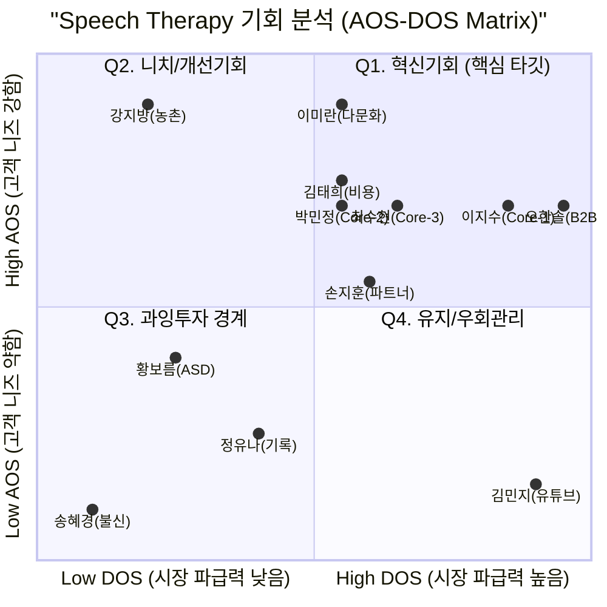

# AOS & DOS 기회 점수 분석
## 한국 온라인 영유아 언어발달·발음교정 교육 서비스

> **작성 기준**: 2026년 5월
> **기반 자료**: `15_Persona_Spectrum.md`, `18_Pain_Goal_Analysis.md`
> **분석 방법**: OS-AOS-DOS 방법론 (PDF 참조)

---

# 1. AOS 및 DOS 산출 표

* **AOS (고객 가중형 기회 점수)** = `Importance × (1 - Satisfaction / 5)`
  * 값이 높을수록 개별 고객이 느끼는 미충족 니즈(Pain)가 강함을 의미합니다.
* **DOS (시장 가중형 기회 점수)** = `(Importance - Satisfaction) × Market Relevance`
  * `Market Relevance(0.1~1.0)`: 해당 페르소나가 전체 시장(TAM/SAM)에서 차지하는 비중과 B2B 파급력을 가중치로 부여했습니다.

| 구분 | 페르소나 (직위) | 핵심 Pain | Imp | Sat | AOS | Market Rel. | DOS | Insight (기회 해석) |
|:---|:---|:---|:---:|:---:|:---:|:---:|:---:|:---|
| Core-1 | 이지수 (전업주부) | 정상/비정상 판단 기준 부재 | 5 | 2 | **3.0** | 0.8 | **2.4** | **[최우선 혁신]** SAM의 다수를 차지하며 Pain이 극심함. 무료 AI 진단으로 가장 빨리 전환될 핵심 타깃 |
| Adj-1 | 오한솔 (유치원 원장) | 치료 권유 시 부모 갈등 (증거 부재) | 5 | 2 | **3.0** | 1.0 | **3.0** | **[최대 파급력]** 원장 1명 설득이 80가구 유입으로 이어짐. 가장 강력한 B2B2C 채널 |
| Core-3 | 최수현 (초등교사) | 센터 4개월 대기 중 공백 불안 | 5 | 2 | **3.0** | 0.5 | **1.5** | **[안정적 수요]** 대기자라는 명확한 타깃. 치료사 코멘트 기능으로 Lock-in 확정 가능 |
| Adj-3 | 이미란 (다문화 가정) | 이중언어 vs 지연 구분 불가 | 5 | 1 | **4.0** | 0.3 | **1.2** | **[니치 독점]** 미충족 점수(AOS)는 1위. 시장 비중은 10%대지만 경쟁자가 없는 블루오션 |
| Core-2 | 박민정 (마케터) | 수치화된 데이터 부재 | 5 | 2 | **3.0** | 0.4 | **1.2** | **[리텐션 견인]** 유입 후 고가치(LTV) 유저로 전환됨. 공유 기능으로 바이럴 창출 가능 |
| Ext-2 | 강지방 (농촌 거주) | 센터 물리적 접근 차단 | 5 | 1 | **4.0** | 0.1 | **0.4** | **[사회적 가치]** AOS는 최고지만 타깃 모수가 작음(DOS 낮음). CSR 마케팅 용도 |
| Adj-2 | 손지훈 (심리상담사)| 언어치료 연계 대기로 부모 방치 | 4 | 2 | **2.4** | 0.7 | **1.4** | **[신뢰 앵커]** 전문가의 추천은 강한 전환율을 만듦. 파트너 프로그램 필수 |
| Core-4 | 김태희 (간호사) | 쌍둥이 치료비 압박 | 4 | 1 | **3.2** | 0.4 | **1.2** | **[가격 경쟁력]** Triage(우선순위 선별) 진단이 해결책. 비용 민감층 흡수 |
| Non-3 | 김민지 (워킹맘) | 유튜브 거짓 안심 (대체재 편향) | 4 | 4 | **0.8** | 0.9 | **0.0** | **[최대 리스크]** 시장 크기는 가장 크지만 현재 만족도가 높아 전환이 매우 힘듦. 충격 요법 마케팅 필요 |
| Ext-1 | 황보름 (ASD 경계선)| AI가 비전형 발화 인식 못함 | 5 | 3 | **2.0** | 0.1 | **0.2** | **[기술 해자]** 타깃은 작으나, 이 문제를 해결하면 일반 AI 인식률이 압도적으로 올라감 |
| Core-5 | 정유나 (디자이너) | 발달 기록의 정량 기준 부재 | 3 | 3 | **1.2** | 0.3 | **0.0** | **[부차적 기회]** 긴급한 Pain이 아님. 인스타 바이럴을 위한 부가 기능으로 접근 |
| Non-2 | 송혜경 (외할머니) | AI/디지털 도구 불신 | 2 | 4 | **0.4** | 0.2 | **-0.4** | **[과잉 투자 경계]** 이들을 직접 설득하는 것은 자원 낭비. 엄마(딸)를 통한 우회 접근 |

*(참고: Non-1 윤성민은 문제 인식 자체가 없어 계산에서 제외함)*

---

# 2. AOS-DOS 매트릭스 시각화

계산된 AOS(Y축)와 DOS(X축)를 기반으로 시장 기회 매트릭스를 구성합니다.

* **기준선 설정**: 
  * AOS 평균 ≈ 2.5 (이상이면 고객 니즈 강함)
  * DOS 평균 ≈ 1.0 (이상이면 시장 파급력 큼)

*(※ 차트 좌표는 시각적 배치를 위해 상대적 스케일링 적용)*

---

# 3. 전략적 인사이트 (매트릭스 해석)

### 🚀 Q1. 혁신기회 (High AOS / High DOS) — [최우선 투자 영역]
* **해당 페르소나**: `오한솔(원장)`, `이지수(탐색자)`, `최수현(대기자)`, `손지훈(상담사)`
* **전략**: 이 4명은 개인적 Pain도 극심하고, 시장 내 확산력(DOS)도 가장 큽니다.
  1. **Phase 0 MVP의 핵심 퍼널**: `이지수`와 `최수현`을 겨냥한 "무료 AI 진단 → 즉각 처방"
  2. **B2B2C 파이프라인**: 유치원 원장(`오한솔`)과 심리상담사(`손지훈`)를 위한 기관용 패키지를 동시 기획하여 CAC(고객획득비용)를 획기적으로 낮춰야 합니다.

### 💎 Q2. 니치/개선기회 (High AOS / Low DOS) — [포용적 설계 영역]
* **해당 페르소나**: `이미란(다문화)`, `강지방(농촌)`, `박민정(데이터)`, `김태희(비용)`, `황보름(ASD)`
* **전략**: 당장 큰 매출을 견인하지는 않으나, 고객의 미충족 점수(AOS)가 4.0으로 가장 높습니다.
  * 이들의 문제를 해결하면(예: 다문화 가이드, 비전형 발화 인식, 저비용 Triage) **서비스의 기술적 해자와 압도적인 충성도**가 만들어집니다. Core 유저를 위한 기능을 만들 때 이들의 제약 조건을 기본값으로 고려하는 '포용적 설계'가 필요합니다.

### ⚠️ Q3 & Q4. 과잉투자 경계 / 유지관리 (Low AOS)
* **해당 페르소나**: `김민지(유튜브 자가해결)`, `정유나(기록)`, `송혜경(불신)`
* **전략**: `김민지`의 경우 시장 비중(Market Rel. 0.9)은 엄청나지만 현재 만족도가 높아(AOS 0.8, DOS 0.0) 직접적인 기능 추가로 설득하기 불가능합니다.
  * **우회 마케팅**: 제품 기능을 바꾸는 것이 아니라, "유튜브만 보여주면 뇌의 언어 영역이 자극되지 않습니다"라는 충격 요법형 마케팅 메시지로 현재의 Satisfaction(만족도)을 강제로 낮추는 선행 작업이 필수적입니다.
