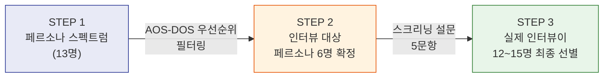

# JTBD 심층 인터뷰 종합 계획서 (Part 1)
## 한국 온라인 언어발달·발음교정·의사소통 훈련 교육 서비스

> **작성 기준**: 2026년 5월
> **분석 기반**: 분석 문서 0~19번, JTBD 인터뷰 가이드(8-1)
> **목적**: 1차 시장 분석의 가설을 실제 고객의 'Job'으로 검증

---

# 1. 인터뷰 개요 및 목적

## 1-1. 시장 분석을 통해 도출된 핵심 기회 영역

지금까지 수행한 1차 시장 분석(Porter's Five Forces, 경쟁 브리핑, 가치사슬 분석, 문제 정의서, 시장 세분화, 페르소나 스펙트럼, 고객 여정지도, AOS-DOS 분석)을 통해 다음 **3가지 핵심 기회**가 도출되었습니다.

| # | 핵심 기회 | 근거 문서 | 핵심 수치 |
|:-:|:---------|:---------|:---------|
| 1 | **"회색지대 부모" 30~50만 가구의 진단 공백** — 센터에 갈 정도인지 판단이 안 서거나, 대기 중인 부모가 객관적 기준선 없이 불안에 방치됨 | `12_Problem Definition_Final`, `14_Market Segmentation Map` | SAM 17~25만 가구, Seg A(불안형 탐색자) 12~15만 가구 |
| 2 | **밸류체인 단절 (진단↔교육)** — 진단 특화 기업(송앤스타크)은 교육 연계 부재, 교육 특화 기업(에이치투케이)은 진단 기능 약화. 이 단절이 신규 진입의 핵심 기회 | `6_Competitive Value Chain Analysis`, `7_Key Success Factors` | KSF #1: 진단→교육 브릿지 퍼널 |
| 3 | **유튜브 거짓 안심 = SAM 70~80%의 최대 리스크** — 대다수 부모가 무료 유튜브 콘텐츠로 "충분하다"고 착각하며 유료 서비스 진입을 거부 | `9_Problem Definition_VC`, `19_AOS_DOS_Opportunity_Analysis` | Non-user 김민지: AOS 0.8, DOS 0.0 |

## 1-2. JTBD 인터뷰가 필수적인 이유

위 3가지 기회는 모두 **데스크 리서치와 2차 자료**에서 도출된 가설입니다. 그러나 실제 부모가:

- "우리 아이가 정상인지 아닌지 모른다"는 불안을 **언제, 어떤 맥락에서** 처음 느꼈는지
- 유튜브·맘카페 검색이라는 **대체 행동을 "고용(Hire)"한 진짜 이유**가 무엇인지
- AI 진단 리포트라는 새로운 솔루션을 **"고용"하기 위해 넘어야 할 불안(Anxiety)**이 무엇인지

이것은 부모의 입에서 직접 나오지 않으면 알 수 없습니다.

> **JTBD 인터뷰의 목적**: 부모가 "현재 솔루션(유튜브, 맘카페, 방관)"을 고용한 맥락과, "새로운 솔루션(AI 진단 앱)"으로 전환하기 위한 Push/Pull/Habits/Anxieties를 발굴하여, MVP 기능 우선순위와 마케팅 메시지를 결정한다.

---

# 2. 핵심 타겟 고객 페르소나 (선정 기준)

> **핵심 원칙**: 인터뷰이는 랜덤한 신규 인물을 상정하지 않는다. **페르소나 스펙트럼(`15_Persona_Spectrum`)에서 출발**하여, 스크리닝 설문을 거쳐 **특정 페르소나 유형에 정확히 매칭되는 실제 인물만 선별**한다.

## 2-1. 페르소나 기반 인터뷰이 선정 3단계 프로세스



### STEP 1. 페르소나 스펙트럼에서 인터뷰 대상 페르소나 선정

`15_Persona_Spectrum`의 13명 중, AOS-DOS 매트릭스(`19_AOS_DOS`)에서 **Pain 중요도 5점 × 대체 만족도 1~2점**의 황금 교차점에 위치한 6명을 인터뷰 대상 페르소나로 확정합니다.

| 우선순위 | 대상 페르소나 | 유형 | AOS | DOS | 선정 사유 |
|:-------:|:-----------|:---:|:---:|:---:|:---------|
| **★1** | Core-1 이지수 (불안형 탐색자) | Core | 3.0 | 2.4 | SOM 60~70%의 Seg A 대표. 진단 회피 심리 검증 |
| **★1** | Core-3 최수현 (센터 대기자) | Core | 3.0 | 1.5 | 센터 대기 공백의 실체 청취. 브릿지 가설 검증 |
| **★2** | Core-2 박민정 (데이터 집착형) | Core | 3.0 | 1.2 | 고LTV 유저의 리포트 니즈. 리텐션 엔진 설계 기준 |
| **★2** | Core-4 김태희 (비용 민감형) | Core | 3.2 | 1.2 | Triage 니즈 + 가격 민감도 임계점 |
| **★3** | Non-3 김민지 (유튜브 자가해결) | Non-user | 0.8 | 0.0 | SAM 70~80% 최대 리스크. 거짓 안심의 균열 검증 |
| **★3** | Adj-1 오한솔 (유치원 원장) | Adjacent | 3.0 | 3.0 | B2B2C DOS 1위. 기관 도입 의사결정 구조 |

> **제외 근거**: Ext-1 황보름(ASD 경계선), Ext-2 강지방(농촌), Non-1 윤성민(무관심), Non-2 송혜경(불신) 등은 Phase 0 MVP와 직접 관련이 낮거나 모집 난이도가 높아 이번 라운드에서 제외.

### STEP 2. 스크리닝 설문으로 페르소나 매칭

랜덤 모집이 아닌, **지원자의 응답을 통해 6개 페르소나 중 어디에 해당하는지 분류**합니다.

| # | 스크리닝 질문 | 분류 기준 |
|:-:|:-----------|:---------|
| S1 | "자녀의 나이는 몇 세인가요?" | 만 2~7세 범위 내 확인 (범위 밖 → 제외) |
| S2 | "아이의 말/발음에 대해 걱정이 되신 적이 있으신가요?" | ①매우 그렇다 ②약간 그렇다 ③아니다 → ③ 선택 시 Non-user 검토 |
| S3 | "현재 언어치료 센터를 이용 중이거나 대기 중이신가요?" | ①이용 중 ②대기 중 ③문의했으나 미결정 ④고려한 적 없음 → ②최수현, ①③박민정/이지수, ④김민지 |
| S4 | "아이의 언어 발달을 위해 현재 사용 중인 방법은? (복수선택)" | □유튜브 □맘카페 □교육앱(앱명 기입) □센터 □기관 추천 □없음 → 교육앱 경험자 = 전환자 그룹, 유튜브만 = 김민지 유형 |
| S5 | "귀하의 직업/직함은?" | 유치원·어린이집 교사/원장 → 오한솔 유형 분류 |

### STEP 3. 페르소나 매칭 확인 → 최종 선별

스크리닝 결과를 기반으로 **각 페르소나당 2~3명씩, 총 12~15명**을 최종 선별합니다.

| 대상 페르소나 | 스크리닝 필터 조건 | JTBD 전환 그룹 | 목표 인원 |
|:-----------|:----------------|:-------------|:-------:|
| **이지수 유형** | S2=①~② & S3=③~④ & S4=유튜브·맘카페만 | B (이탈/거부자) | 2~3명 |
| **최수현 유형** | S2=① & S3=② (대기 중) | A (최근 전환자) | 2~3명 |
| **박민정 유형** | S2=① & S4=교육앱 기입 | A (최근 전환자) | 2명 |
| **김태희 유형** | S2=① & S3=④ & "비용 걱정" 언급 | C (미인지자) | 2명 |
| **김민지 유형** | S2=②~③ & S4=유튜브만 | B (이탈/거부자) | 2~3명 |
| **오한솔 유형** | S5=유치원·어린이집 교사/원장 | C (기관 미인지) | 2명 |

> **목표 인터뷰 수**: 총 12~15명 (각 페르소나 2~3명)
> **핵심**: JTBD 가이드의 3그룹(전환자/이탈자/미인지자) 분류는 유지하되, 각 그룹 내에서 **우리 페르소나에 정확히 매칭되는 인물만** 인터뷰에 참여시킵니다.

---

# 3. 검증을 위한 핵심 가설 (Job-Story 기반)

## 3-0. 문제 정의서와의 매핑 구조

`12_Problem Definition_Final`에 따르면, 모든 고객의 불편은 **뿌리 문제 하나에서 3가지 파생 Pain**으로 분기됩니다.

```
뿌리: "우리 아이가 정상인지 아닌지 모른다" (기준선 부재)
       ├─ ① 진단 부재     → "또래 대비 몇 점인지 모르겠어"    → MVP: 무료 AI 진단 (유입 엔진)
       ├─ ② 방법론 부재   → "뭘 어떻게 시켜야 하는지 모르겠어" → MVP: 맞춤 커리큘럼 (수익 엔진)
       └─ ③ 효과 확인 불가 → "나아진 건지 모르겠어"           → MVP: 발달 리포트 (리텐션 엔진)
```

**Job-Story는 이 3가지 파생 Pain을 모두 검증해야 합니다.** 아래 7개 Job-Story는 문제 정의서의 3가지 파생 Pain과 MVP의 3단계 가치 퍼널에 1:1로 매핑됩니다.

| Job-Story | 대응 Pain | 대응 MVP 기능 | 검증 핵심 |
|:---------|:---------|:-----------|:---------|
| #1 진단 공백 해소 | ① 진단 부재 | 무료 AI 진단 | 유입 엔진 가설 |
| #2 대기 기간 공백 | ① 진단 부재 + ② 방법론 부재 | 진단+브릿지 | Seg C 전환 가설 |
| **#3 홈 트레이닝 방법론** | **② 방법론 부재** | **맞춤 커리큘럼** | **수익 엔진 가설** ← *신규* |
| **#4 효과 확인·리텐션** | **③ 효과 확인 불가** | **발달 리포트** | **리텐션 엔진 가설** ← *신규* |
| #5 비용 효율 Triage | ① 진단 부재 | 무료 AI 진단 | 가격 모델 가설 |
| #6 유튜브 대체재 이탈 | ① 진단 부재 | 마케팅 메시지 | SAM 전환 전략 |
| #7 기관 스크리닝 도입 | ① 진단 부재 | B2B 패키지 | B2B2C 채널 가설 |

---

## 3-1. 핵심 Job-Story 7개

각 Job-Story는 `[상황(When)] + [동기(I want to)] + [기대 결과(So that)]` 형식으로 작성합니다.

---

### Job-Story #1: 진단 공백 해소 — Pain ① 대응 (이지수·정유나 유형)

> **[상황]** 만 3세 아이가 또래보다 말이 느린 것 같아 맘카페를 검색하고 유튜브를 보다가 3개월이 지났을 때,
> **[동기]** 나는 센터에 전화하지 않고도 우리 아이의 언어 발달 수준이 정상 범위인지 아닌지를 객관적으로 확인하고 싶다.
> **[기대 결과]** 그래야 "내가 호들갑을 떠는 건지, 정말 개입이 필요한 건지" 판단할 수 있고, 좋은 부모로서 행동하고 있다는 안심을 얻을 수 있으니까.

- **검증 포인트**: 진단 회피가 실제로 존재하는가? 미루는 진짜 이유는 "장애 판정 공포"인가, "귀찮음"인가, "센터 접근성"인가?
- **근거**: `12_Problem Definition_Final` — "좋은 부모가 되지 못하고 있다는 죄책감과 무력감의 혼합물"

---

### Job-Story #2: 대기 기간 공백 채우기 — Pain ①② 대응 (최수현 유형)

> **[상황]** 센터에 전화했더니 4개월 대기라고 했을 때,
> **[동기]** 나는 대기하는 동안 아이의 현재 상태를 정확히 파악하고, 집에서 체계적으로 연습시키고 싶다.
> **[기대 결과]** 그래야 골든타임을 놓치지 않았다는 안심을 얻고, 센터 치료 시작 시 "집에서 이렇게 훈련했어요"라는 데이터를 제출할 수 있으니까.

- **검증 포인트**: 센터 대기 중 부모가 실제로 느끼는 감정 강도는? "브릿지 프로그램"에 대한 지불의사는?
- **근거**: `15_Persona_Spectrum` Core-3 — "골든타임 놓칠까봐 극도로 불안"

---

### Job-Story #3: 홈 트레이닝 방법론 — Pain ② 대응 ⭐ 신규 (이지수·박민정 유형)

> **[상황]** 아이 말이 좀 늦는다는 건 알았지만, 집에서 무엇을 어떻게 해줘야 할지 전혀 모를 때,
> **[동기]** 나는 막연하게 말을 많이 걸어주거나 유튜브를 틀어주는 것 말고, "이번 주는 정확히 이 소리를 이 방법으로 연습시키세요"라는 명확한 가이드를 받고 싶다.
> **[기대 결과]** 그래야 비전문가인 나도 아이를 망치지 않고 제대로 된 도움을 줄 수 있다는 확신을 갖고, 매일 15분씩 꾸준히 실천할 수 있으니까.

- **검증 포인트**: "방법을 모른다"는 Pain의 실제 강도는? 맞춤 커리큘럼 vs 일반 육아 콘텐츠의 차이를 부모가 명확히 구분하는가? 주간 미션 형태에 대한 수용도는?
- **근거**: `12_Problem Definition_Final` — "파생 불편함 ② 방법론 부재: '뭘 어떻게 시켜야 하는지 모르겠어'" / `0_언어치료_세션_가이드` — 사설 센터의 핵심은 부모에게 "이렇게 말을 걸어보세요" 코칭

---

### Job-Story #4: 효과 확인·리텐션 — Pain ③ 대응 ⭐ 신규 (박민정·이지수 유형)

> **[상황]** 집에서 한 달 넘게 아이의 발음 훈련을 시켰는데, 나아진 건지 아닌지 전혀 감이 안 올 때,
> **[동기]** 나는 우리 아이의 발음이나 언어 수준이 1달 전과 비교해 구체적인 수치로 얼마나 좋아졌는지 눈으로 확인하고 싶다.
> **[기대 결과]** 그래야 내 노력이 헛되지 않았다는 걸 확신하고, 배우자나 시어머니에게도 "이만큼 나아졌다"고 객관적으로 보여줄 수 있으니까.

- **검증 포인트**: 발달 추적 데이터가 구독을 유지하는 핵심 동기가 되는가? "이번 주 62→71점" 같은 수치 변화가 실제로 동기부여가 되는가, 아니면 부모는 체감 변화로도 충분한가? 리포트를 공유하고 싶은 대상은?
- **근거**: `12_Problem Definition_Final` — "파생 불편함 ③ 효과 확인 불가: '한 달째인데 나아진 건지 모르겠어'" / `7_Key Success Factors` KSF #4 — "교육 앱 D30 리텐션 2~3%. 우리는 M3 40%가 필요"

---

### Job-Story #5: 비용 효율적 Triage — Pain ① 대응 (김태희 유형)

> **[상황]** 쌍둥이 모두 말이 느린데 센터 비용이 월 40~60만원이라 한 명만 보낼 수 있을 때,
> **[동기]** 나는 두 아이 중 누가 더 급한지를 신뢰할 수 있는 진단으로 비교하고, 덜 급한 아이는 집에서 효과적으로 케어하고 싶다.
> **[기대 결과]** 그래야 한정된 예산으로 두 아이 모두에게 최선을 다하고 있다는 죄책감에서 벗어날 수 있으니까.

- **검증 포인트**: "Triage(선별)" 기능에 대한 실제 수요가 있는가? 월 3만원의 가격 수용 임계점은?
- **근거**: `18_Pain_Goal_Analysis` — 김태희 Pain 중요도 4점, 대체 만족도 1점

---

### Job-Story #6: 유튜브 대체재 전환 — 대체 솔루션 검증 (김민지 유형)

> **[상황]** 아이가 약간 느린 것 같지만 유튜브 언어발달 채널을 틀어주니까 괜찮아진 것 같을 때,
> **[동기]** 나는 돈과 시간을 더 들이지 않고 현재 상태를 유지하고 싶다.
> **[기대 결과]** 그래야 바쁜 워킹맘으로서 이미 할 수 있는 만큼 하고 있다고 스스로를 위안할 수 있으니까.

- **검증 포인트**: "유튜브로 충분하다"는 믿음이 **언제, 어떤 계기로 흔들리는가?** 흔들린 적이 없는가?
- **근거**: `9_Problem Definition_VC` — "불안한 부모의 80%가 유튜브 보고 괜찮겠지 하고 넘어간다"

---

### Job-Story #7: 기관 스크리닝 도구 도입 — B2B2C 채널 검증 (오한솔 유형)

> **[상황]** 매년 2~3명의 언어 지연 아이를 발견하는데, 부모에게 어떻게 말을 꺼낼지 고민될 때,
> **[동기]** 나는 교사의 주관적 판단이 아닌 객관적 데이터를 근거로 부모에게 안전하게 전문 기관 연계를 권유하고 싶다.
> **[기대 결과]** 그래야 부모와의 갈등 없이 아이의 발달을 지원하고, 원의 신뢰도를 높일 수 있으니까.

- **검증 포인트**: 기관 도입 의사결정 구조는? 원장 단독 결정인가, 학부모 동의가 필요한가?
- **근거**: `19_AOS_DOS_Opportunity_Analysis` — 오한솔 DOS 3.0 (1위), 1명 설득 = 80가구 노출

---

## 3-2. Job-Story 검증 우선순위 (문제 정의서 3대 Pain 완전 커버)

| 우선순위 | Job-Story | 대응 Pain | Phase 연계 | Go/No-Go 기여도 |
|:-------:|:---------|:---------|:---------|:-------------|
| **1** | #1 진단 공백 해소 | ① 진단 부재 | Phase 0 MVP | 무료 AI 진단 → 유료 전환율 8% 가설 |
| **2** | **#3 홈 트레이닝 방법론** | **② 방법론 부재** | **Phase 0~1** | **맞춤 커리큘럼 구독 의지 검증 (수익 엔진)** |
| **3** | **#4 효과 확인·리텐션** | **③ 효과 확인 불가** | **Phase 0~1** | **M3 유지율 40% 달성 가능성 검증 (리텐션 엔진)** |
| **4** | #6 유튜브 대체재 전환 | ① 진단 부재 | Phase 1 마케팅 | SAM 70~80% 공략 전략 결정 |
| **5** | #2 대기 기간 공백 | ①② 복합 | Phase 0~1 | Seg C 포지셔닝 검증 |
| **6** | #5 비용 Triage | ① 진단 부재 | Phase 0~1 | 가격 모델·Tier 설계 결정 |
| **7** | #7 기관 스크리닝 | ① 진단 부재 | Phase 4 | B2B2C 채널 로드맵 방향 |

> **⚠️ 핵심 변경 포인트**: Job-Story #3(방법론)과 #4(리텐션)가 **우선순위 2~3위**로 격상되었습니다. 문제 정의서에서 "M3 유지율 40%가 사업의 생사를 결정한다"고 명시했음에도, 이 두 가지가 검증되지 않으면 인터뷰의 핵심 Go/No-Go 판단이 불완전합니다.

---

*→ Part 2 (심층 인터뷰 질문지, 수행 절차, 예상 결과)는 `21_JTBD_Interview_Plan_Part2.md` 참조*

