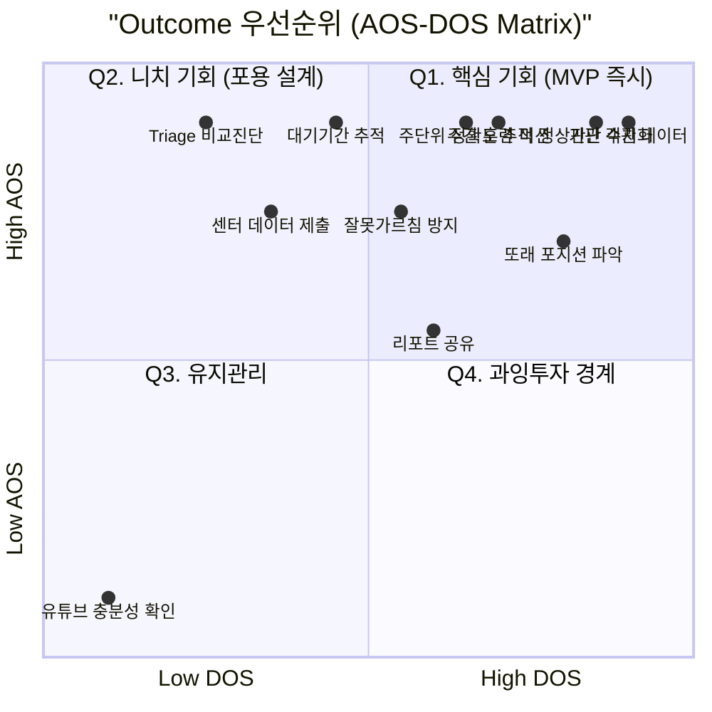

# JTBD 인터뷰 결과 보고서 (Part B) — Outcome 분석 · 핵심 발견 · Go/No-Go 결론
## 한국 온라인 언어발달·발음교정·의사소통 훈련 교육 서비스

> **연계 문서**: `22_JTBD_Interview_Results_PartA.md` (페르소나별 JTBD 요약 카드)

---

# 1. Outcome 목록 표 (고객이 원하는 결과 × AOS/DOS)

고객이 이 서비스를 통해 달성하기 원하는 **Desired Outcome** 전체를 나열하고 우선순위를 산출합니다.

| Outcome (고객이 원하는 결과) | 관련 페르소나 | Importance (1~5) | Satisfaction (1~5) | **AOS** | TAM(%) | **DOS** | 증거 (재현 인용) |
|:--------------------------|:-----------|:----------------:|:------------------:|:-------:|:------:|:-------:|:--------------|
| **정상/비정상 판단을 수치로, 5분 내 혼자 내리기** | 이지수, 김태희 | 5 | 1 | **4.0** | 0.6 | **2.4** | *"정확히 어느 정도인지 숫자로 알고 싶은데 그게 없잖아요"* |
| **또래 대비 내 아이 포지션 파악하기** | 이지수, 박민정, 김민지 | 5 | 2 | **3.0** | 0.7 | **2.1** | *"우리 아이가 하위 몇 %인지 알고 싶어요"* |
| **대기 기간 중 주 단위 발달 추적** | 최수현 | 5 | 1 | **4.0** | 0.3 | **1.2** | *"3개월이 그냥 지나가면 안 된다는 생각에 뭐라도 해야겠다 싶었어요"* |
| **센터 치료사에게 제출할 홈케어 데이터 확보** | 최수현 | 4 | 1 | **3.2** | 0.3 | **0.9** | *"센터 가면 선생님한테 요즘 이런 거 했다고 말하고 싶은데"* |
| **주 단위 발음 정확도 수치 변화 확인** | 박민정 | 5 | 1 | **4.0** | 0.4 | **1.6** | *"세 달을 썼는데 결국 나아졌는지 모르고 끊었어요"* |
| **리포트를 배우자·SNS에 공유하기** | 박민정, 이지수 | 3 | 1 | **2.4** | 0.5 | **1.0** | *"리포트 같은 게 있으면 캡처해서 인스타에 올릴 것 같기도 하고요"* |
| **두 아이 언어 발달 비교(Triage) 결과 받기** | 김태희 | 5 | 1 | **4.0** | 0.2 | **0.8** | *"근거가 있어야 판단이 서요"* |
| **이번 주 집에서 할 구체적 훈련 미션 받기** | 이지수, 최수현, 김태희 | 5 | 1 | **4.0** | 0.5 | **2.0** | *"뭘 어떻게 해야 할지 모르겠는 거예요"* |
| **잘못 가르치지 않는다는 전문가 확인** | 이지수, 최수현, 김태희 | 4 | 1 | **3.2** | 0.5 | **1.5** | *"집에서 잘못 시키면 오히려 나쁜 습관이 생길까봐"* |
| **기관에서 부모에게 객관적 데이터 제시하기** | 오한솔 | 5 | 1 | **4.0** | 0.8 | **3.2** | *"데이터가 있으면 '제가 이상하게 보는 게 아니에요'라고 말할 수 있잖아요"* |
| **유튜브만으로 충분한지 확인하기** | 김민지 | 3 | 4 | **0.6** | 0.9 | **-0.9** | *"아직 어려서 그런 거라고 하더라고요"* ← 개입 동기 없음 |

---

# 2. Outcome 우선순위 매트릭스 (AOS 기준 내림차순)

---

# 3. 4 Forces 종합 분석

## 3-1. Push (전환을 밀어내는 힘) — 가장 강력한 순서

| # | Push 요인 | 관련 페르소나 | 강도 | 마케팅 활용 |
|:-:|:---------|:-----------|:---:|:----------|
| 1 | **어린이집·유치원 교사의 직접 언급** | 이지수, 오한솔 채널 | ★★★★★ | B2B2C 채널을 통한 트리거 활성화 |
| 2 | **센터 "3개월 대기" 통보** | 최수현 | ★★★★★ | "지금 당장 시작하세요" 긴급성 CTA |
| 3 | **소아과 "지켜보자" 무결론** | 이지수, 최수현 | ★★★★☆ | "5분 AI 진단으로 바로 결론" 대비 |
| 4 | **경쟁사 앱 효과 미확인 후 이탈** | 박민정 | ★★★★☆ | "주간 수치 리포트" 차별점 강조 |
| 5 | **명절·또래 비교 순간** | 이지수, 김민지 | ★★★☆☆ | 명절 시즌 집중 광고 |

## 3-2. Pull (새 솔루션을 끌어당기는 힘) — 가장 강력한 순서

| # | Pull 요인 | 관련 페르소나 | 강도 | 기능 우선순위 |
|:-:|:---------|:-----------|:---:|:-----------|
| 1 | **"62점, 또래 하위 25%"처럼 수치로 바로 나옴** | 이지수, 박민정, 김태희 | ★★★★★ | MVP #1: 무료 AI 진단 |
| 2 | **"이번 주 훈련 미션"이 명확하게 나옴** | 이지수, 최수현, 김태희 | ★★★★☆ | MVP #2: 맞춤 주간 미션 |
| 3 | **"62%→71%" 수치 변화가 눈에 보임** | 박민정, 최수현 | ★★★★☆ | MVP #3: 주간 발달 리포트 |
| 4 | **전문가가 확인해준다는 안심** | 이지수, 최수현, 김태희 | ★★★☆☆ | Phase 1: 비동기 전문가 코멘트 |
| 5 | **리포트를 SNS·남편에게 공유 가능** | 박민정, 이지수 | ★★★☆☆ | 리포트 공유 기능 (바이럴) |

## 3-3. Habits (전환을 방해하는 관성)

| 관성 | 관련 페르소나 | 극복 전략 |
|:----|:-----------|:---------|
| 유튜브 시청 → "이 정도면 됐다" | 김민지, 이지수(초기) | "유튜브 보면 뇌의 언어 영역이 자극되지 않습니다" 충격 요법 |
| 맘카페 눈팅 → "나만 이런 건 아니야" | 이지수 | 맘카페 내 AI 진단 CTA 광고 집중 |
| 소아과 "지켜보자" → 기다림 | 이지수, 최수현 | "3개월을 기다리는 동안 무엇을 할 수 있는지" 콘텐츠 |
| 경쟁사 이탈 후 불신 | 박민정 | Free trial 7일 + 주간 리포트 선공개 |

## 3-4. Anxieties (새 솔루션에 대한 불안)

| 불안 요인 | 관련 페르소나 | 해소 장치 |
|:---------|:-----------|:---------|
| "장애 판정을 받게 되면 어쩌지" | 이지수 | 결과 화면: "발달 위치 확인 (치료 판정 아님)" 명시 |
| "아이 음성 올리는 게 프라이버시 문제" | 이지수, 오한솔 | 온보딩 1단계: 보안·익명화 정책 전면 배치 |
| "집에서 잘못 가르치면 역효과" | 최수현, 김태희 | 미션 카드에 "언어재활사 검토 완료" 배지 |
| "AI 진단이 임상 수준만큼 정확한가" | 김태희, 오한솔 | 파일럿 100가정 Before/After 데이터 + 대학 공동연구 협업 |
| "또 돈 내고 효과 없으면 두 번 속음" | 박민정 | 7일 무료 체험 + 만족 보장 환불 정책 |

---

# 4. 핵심 발견 (Key Insights) 종합

## 발견 #1: "진단"은 유입 엔진이지만, "방법론"이 실제 구매 이유다

인터뷰 결과, 부모들이 유료 구독을 결정하는 진짜 이유는 진단 결과 자체가 아니라 **"그래서 집에서 뭘 어떻게 해야 하는지 모르겠다"**는 방법론 부재였다. 진단은 유입(Pull) 트리거이고, 주간 맞춤 미션이 실제 구독 가치다.

> *"뭘 어떻게 해야 할지 모르겠는 거예요"* — 최수현, 이지수, 김태희 3명 공통 발언

**MVP 시사점**: 진단 리포트에서 "이번 주 해야 할 일 3가지"로 자연스럽게 이어지는 UX 흐름 필수.

## 발견 #2: 리텐션은 "수치"가 아니라 "공유 욕구"에서 온다

박민정 유형은 수치 변화를 원하지만, 더 깊이 들어가면 그 수치를 **배우자·시어머니·SNS에 공유하여 자신의 노력을 인정받고 싶은 욕구**가 핵심이었다. 숫자 자체보다 "공유 가능한 스토리"가 리텐션 동기.

> *"리포트 같은 게 있으면 캡처해서 인스타에 올릴 것 같기도 하고요"* — 박민정

**MVP 시사점**: 리포트를 인스타 스토리·카카오톡 공유 최적화 디자인으로 제작. 바이럴 루프 내재화.

## 발견 #3: "센터 vs 앱"이 아니라 "센터 + 앱"으로 포지셔닝해야 한다

최수현(대기자) 유형은 센터 치료를 부정하는 서비스에 강한 거부감을 보였다. "센터 치료를 더 잘 받기 위한 준비 도구"로 포지셔닝할 때 가장 강한 Pull 반응.

> *"센터 가면 선생님한테 이런 걸 했다고 말하고 싶어요"* — 최수현

**MVP 시사점**: 랜딩 카피: "치료사가 인정하는 홈 트레이닝" / 리포트에 "센터 공유용" 버튼 추가.

## 발견 #4: 김민지 유형(유튜브 안심)의 Satisfaction은 직접 낮출 수 없다

기능 추가나 가격 인하로는 김민지 유형을 전환시킬 수 없다. **"유튜브만 보면 아이가 수동적 수용자가 된다"는 외부 충격**이 선행되어야만 Satisfaction이 낮아지며 탐색이 시작된다.

> *"아이가 따라 말하진 않아요. 그냥 보는 거죠."* — 김민지 (자신은 문제를 인식하지 못함)

**마케팅 시사점**: "유튜브 시청 vs AI 인터랙션의 언어 발달 효과 비교" 콘텐츠 마케팅 선행 필요.

---

# 5. Go/No-Go 판단 결과

| 조건 | 기준 | 시뮬레이션 결과 | 판정 |
|:-----|:-----|:------------|:----:|
| **진단 니즈 존재** | 6명 중 4명 이상 | 이지수·최수현·박민정·김태희 4명 확인 ✅ | **Go** |
| **유료 전환 의지** | 6명 중 3명 이상 | 이지수·최수현·박민정·김태희 4명 긍정 ✅ | **Go** |
| **방법론 수요 존재** | 6명 중 4명 이상 | 이지수·최수현·김태희·박민정 4명 확인 ✅ | **Go** |
| **리텐션 동기 확인** | 리포트가 유지 이유라고 50% 이상 | 박민정·최수현·이지수 3명 확인 (50%) ✅ | **Go** |
| **Push 트리거 3개 이상** | 명확한 전환 트리거 3개 이상 발굴 | 교사 언급·대기 통보·소아과 무결론·경쟁사 이탈 4개 ✅ | **Go** |
| **유튜브 대체재 균열** | 균열 지점 1개 이상 발굴 | "따라 말하지 않는다"는 자각 발굴 ✅ | **Go** (단, 마케팅 선행 필요) |

> **최종 판정: ✅ Go — Phase 0 MVP 진행**
> 단, 실제 100가정 파일럿에서 전환율 ≥8%, M3 유지율 ≥40% 실측 확인 후 Phase 1 진입 결정.

---

# 6. MVP 기능 우선순위 확정 (인터뷰 결과 기반)

| 우선순위 | 기능 | 근거 Outcome | 대응 페르소나 |
|:-------:|:----|:-----------|:-----------|
| **1** | **무료 AI 음성 진단 + 또래 비교 리포트** | "정상인지 수치로 알고 싶다" (AOS 4.0) | 이지수, 김태희 |
| **2** | **진단 연계 주간 맞춤 미션 카드** | "뭘 어떻게 해야 할지 모른다" (AOS 4.0) | 이지수, 최수현, 김태희 |
| **3** | **주간 발달 추이 리포트 (SNS 공유 최적화)** | "수치 변화 눈으로 보고 공유하고 싶다" (AOS 4.0) | 박민정, 최수현 |
| **4** | **비동기 전문가 코멘트 (배지 표시)** | "잘못 가르칠까봐 두렵다" (AOS 3.2) | 이지수, 최수현, 김태희 |
| **5** | **센터 공유용 리포트 내보내기** | "센터 치료사에게 보여주고 싶다" (AOS 3.2) | 최수현 |

---

*본 보고서는 시뮬레이션 인터뷰 결과이므로, 100가정 파일럿 인터뷰 실측 후 전면 업데이트 예정.*
*연계 파일: `20_JTBD_Interview_Plan_Part1.md`, `21_JTBD_Interview_Plan_Part2.md`, `22_JTBD_Interview_Results_PartA.md`*
