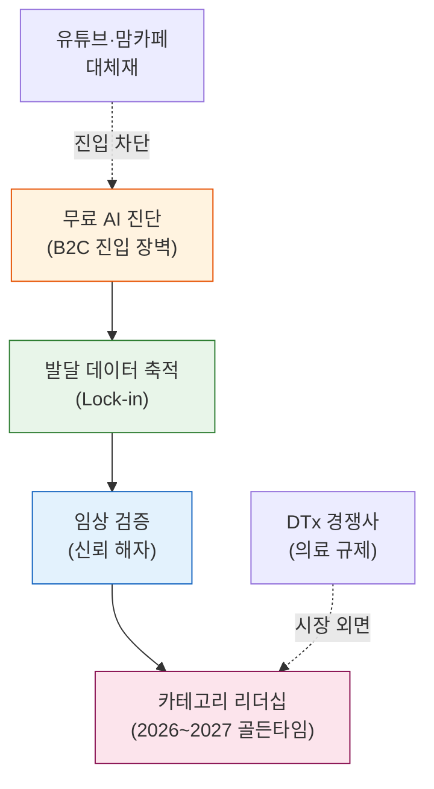

# Business Model Canvas
## 한국 온라인 언어발달·발음교정·의사소통 훈련 교육 서비스

> **작성 기준**: 2026년 5월
> **기반 자료**: 문서 #0~#23 전체 분석 종합 (Porter's 5 Forces, 가치사슬, 경쟁 브리핑, 문제 정의, 시장 세분화, 페르소나, 고객여정, AOS/DOS, JTBD 인터뷰)
> **비즈니스 컨셉**: "홈 랭귀지 코칭 (Home Language Coaching)" — 비의료·교육 카테고리 B2C 선점

---

## BMC 전체 구조 (시각화)

```
┌─────────────────┬──────────────────────┬──────────────────────┬────────────────────┬───────────────────────┐
│  8. 핵심 파트너  │    7. 핵심 활동       │   2. 가치 제안        │  4. 고객 관계       │   1. 고객 세그먼트     │
│                 │                      │                      │                   │                       │
│ · 언어재활사    │ · 무료 AI 음성 진단   │ 불안형 탐색자 →       │ · 무료 AI 진단      │ [코어] Seg A          │
│   (비동기코치)  │ · 주간 맞춤 미션      │ "5분 진단으로        │ · 주간 발달 리포트  │  불안형 탐색자         │
│ · 유치원/       │ · 주간 발달 리포트    │  정상/비정상          │ · 비동기 전문가     │  12~15만 가구          │
│   어린이집      │ · 비동기 전문가 코멘트│  판단"               │  코멘트             │                       │
│   (B2B2C)      │ · 아동음성 AI 모델    │                      │ · 맞춤 주간 미션    │ [코어] Seg C          │
│ · 소아과/       │   고도화              │ 센터 대기자 →         │                   │  센터 대기자           │
│   발달클리닉    │                      │ "대기 중 골든타임     │                   │  2~3만 가구            │
│   (리드 채널)   ├──────────────────────┤  보호"               ├───────────────────┤                       │
│ · 대학 연구소   │    6. 핵심 자원       │                      │  5. 채널            │ [확장] Seg B          │
│   (임상 검증)   │                      │ 데이터 집착형 →       │                   │  적극적 개입자         │
│ · 아동음성 AI   │ · 아동 음성 AI        │ "주간 수치 리포트     │ · 맘카페/인스타     │  3~5만 가구            │
│   기술 파트너   │   분석 엔진           │  공유 가능"           │ · 앱스토어          │                       │
│                 │ · 발달 데이터 DB      │                      │ · 유치원 B2B 파트너 │ [확장] Seg D          │
│                 │ · 언어재활사 네트워크 │ B2B2C(원장) →         │ · 소아과 연계       │  기관 연계 수요        │
│                 │ · 브랜드 신뢰도       │ "부모 소통을 위한     │                   │  1~2만 가구            │
│                 │                      │  객관적 근거"         │                   │                       │
├─────────────────┴──────────────────────┴──────────────────────┴───────────────────┴───────────────────────┤
│                          9. 비용 구조                          │         3. 수익 흐름                      │
│                                                                │                                           │
│  [고정비] AI 인프라 운영비 / 핵심 인력 인건비(AI·기획·마케팅)  │  [주력] 월 구독료 3.5만원 (일반) / 5만원 (프리미엄) │
│  [변동비] 언어재활사 비동기 코멘트 수수료                       │  [부가] 기관 B2B 라이선스 (월 10~30만원/기관)     │
│           마케팅·광고비 (맘카페·인스타 CPC)                    │  [미래] 데이터 기반 임상 연구 라이선스             │
│  [핵심 KPI] CAC ≤ 3만원 / LTV ≥ 12.6만원 / LTV:CAC ≥ 4.2x   │  [전환 구조] 무료 진단 → 유료 구독 전환율 ≥ 8%    │
└────────────────────────────────────────────────────────────────┴───────────────────────────────────────────┘
```

---

# 블록 상세 설명

## 1. 고객 세그먼트 (Customer Segments)

| 세그먼트 | 규모 | 핵심 니즈 | 우선순위 |
|:--------|:----:|:---------|:-------:|
| **Seg A: 불안형 탐색자** | 12~15만 가구 | "정상인지 모른다" → 무료 AI 진단 | **★1** |
| **Seg C: 센터 대기자** | 2~3만 가구 | "대기 중 골든타임 보호" → 브릿지 프로그램 | **★2** |
| **Seg B: 적극적 개입자** | 3~5만 가구 | "효과 추적 + 프리미엄" → 발달 리포트+코칭 | **★3** |
| **Seg D: 기관 연계(B2B)** | 유치원 5천여개 | "부모 소통 근거" → 기관용 스크리닝 | **★4** |

**SOM 목표**: 5,000~12,500가구 (SAM 대비 3~5%, 1년차)

---

## 2. 가치 제안 (Value Propositions)

### 핵심 가치 퍼널 (3단계)

```
STEP 1. 무료 AI 진단 (고객 유입 엔진)
  → "우리 아이 /ㅅ/ 발음 정확도 62점 — 또래 하위 25%"
  → 불안에 이름을 붙여준다. 진단 결과가 전환 트리거
  → 차별점: 경쟁사 B2C 무료 진단 부재. 5분, 무료, 즉각적

STEP 2. 맞춤 주간 미션 (핵심 수익 엔진)
  → "이번 주는 /ㅅ/ 소리 연습: 목욕 시간에 이 게임을 해보세요"
  → 부모에게 방법론을 준다 (JTBD #3: 방법론 부재 Pain)
  → 차별점: 진단 결과에 연계된 개인화 미션. 일반 콘텐츠가 아님

STEP 3. 주간 발달 리포트 (리텐션 엔진)
  → "이번 주 62점 → 71점 (+9점). 또래 평균(68점) 초과!"
  → 효과를 눈으로 보여주고, 공유 욕구를 자극한다
  → 차별점: 연속적 발달 추적 리포트. 경쟁사 제공 기업 0개

[선택] 비동기 전문가 코멘트 (신뢰 보완)
  → "언어재활사 ○○선생님이 리포트를 검토했습니다"
  → "혼자가 아니다"는 안심. 전문가 1인당 200가정 커버리지
```

### 포지셔닝
> **"치료(Therapy)"가 아닌 "홈 랭귀지 코칭(Home Language Coaching)"**
> DTx 기업들과 경쟁이 아닌 보완적 관계. 비의료 교육 카테고리 B2C 선점.

---

## 3. 수익 흐름 (Revenue Streams)

| 수익원 | 가격 | 대상 | Phase |
|:------|:----:|:-----|:-----:|
| **베이직 구독** (AI 진단 + 주간 미션 + 리포트) | 월 3.5만원 | Seg A, C | Phase 0~ |
| **프리미엄 구독** (베이직 + 전문가 코멘트) | 월 5만원 | Seg B | Phase 1~ |
| **기관 B2B 라이선스** (유치원·어린이집 스크리닝 도구) | 월 10~30만원/기관 | Seg D | Phase 4~ |
| **데이터 라이선스** (익명화된 발달 데이터 → 임상연구 기관) | 협의 | 연구기관 | Phase 3~ |

**Unit Economics 목표**
- CAC: ≤ 3만원 (맘카페 CPC × 전환율)
- ARPU: 3.5만원/월
- 평균 유지기간: M3 ≥ 40% → 평균 3.6~9개월
- LTV: 12.6~31.5만원
- LTV:CAC: 4.2~10.5x (목표 ≥ 3.0x)

---

## 4. 고객 관계 (Customer Relationships)

| 단계 | 방식 | 목적 | KPI |
|:----|:-----|:-----|:----:|
| **획득** | 무료 AI 진단 CTA | 유입 트리거 | 진단 완료율 ≥30% |
| **전환** | 진단 리포트 → 구독 유도 | 14일 내 전환 | 전환율 ≥8% |
| **유지** | 주간 발달 리포트 푸시 알림 | 효과 가시화 | M1 ≥50%, M3 ≥40% |
| **충성** | 비동기 전문가 코멘트 | 전문가 신뢰 Lock-in | 프리미엄 업셀율 |
| **바이럴** | 리포트 SNS 공유 기능 | 유기적 확산 | 추천 가입 비율 |

---

## 5. 채널 (Channels)

| 채널 | 타겟 세그먼트 | 역할 | 비용 효율 |
|:----|:-----------|:-----|:--------:|
| **네이버 맘카페** | Seg A (불안형) | 1차 인지·탐색 | 낮은 CPC, 높은 전환 |
| **인스타그램·릴스** | Seg A, B | 감성 콘텐츠 바이럴 | 중간 |
| **앱스토어 (iOS/AOS)** | 전 세그먼트 | 다운로드 전환 | 높음 (검색 의도) |
| **유치원·어린이집** | Seg D → Seg A | B2B2C 파이프라인 (1개 기관 = 80가구) | 매우 낮은 CAC |
| **소아과·발달클리닉** | Seg C (대기자) | "대기 중 솔루션" 리드 | 높은 신뢰도 |
| **맘카페 바이럴** | Seg A | 무료 리포트 공유 → 자연 유입 | 비용 0 |

---

## 6. 핵심 자원 (Key Resources)

| 자원 | 설명 | 구축 방법 | 해자(Moat) |
|:----|:----|:---------|:---------:|
| **아동 음성 AI 분석 엔진** | 한국어 음소별 정확도 분석, 비전형 발화 인식 | 자체 개발 + 오픈소스 (Whisper 등) | ★★★★★ |
| **발달 데이터 DB** | 누적 음성 + 발달 추이 데이터 | 파일럿 100가정부터 축적 | ★★★★☆ |
| **언어재활사 네트워크** | 비동기 코멘트 파트너 (1인 200가정) | 프리랜서 플랫폼 + 직접 채용 | ★★★☆☆ |
| **임상 검증 협약** | 대학 연구소 공동연구 | KSF #2: 학습 효과 과학적 검증 | ★★★★☆ |
| **브랜드 신뢰도** | "언어발달 교육" 카테고리 1위 인지도 | 2026~2027 골든타임 내 선점 | ★★★★★ |

---

## 7. 핵심 활동 (Key Activities)

| 활동 | 설명 | Phase |
|:----|:----|:-----:|
| **① 무료 AI 진단 MVP 개발** | 음성 녹음 → AI 분석 → 또래 비교 리포트 | Phase 0 |
| **② 100가정 파일럿** | 전환율·유지율 실측. Go/No-Go 판단 | Phase 0 |
| **③ 주간 미션 커리큘럼 개발** | 음소별 발달 단계 기반 맞춤 미션 카드 | Phase 0~1 |
| **④ 발달 리포트 시스템 구축** | 주간 수치 변화 시각화 + SNS 공유 최적화 | Phase 1 |
| **⑤ 전문가 비동기 코멘트 A/B 테스트** | 리텐션 영향도 측정 | Phase 1 |
| **⑥ B2B2C 기관 파일럿 (5개소)** | 유치원 원장 대상 스크리닝 도구 시범 | Phase 2 |
| **⑦ 임상 데이터 축적 + 대학 공동연구** | 효과 입증 레퍼런스 확보 | Phase 2~3 |

---

## 8. 핵심 파트너 (Key Partners)

| 파트너 | 역할 | 전략적 의미 |
|:------|:----|:----------|
| **언어재활사 (1급)** | 비동기 코멘트 제공. 커리큘럼 감수 | 신뢰 앵커. 전문가 희소성(합격률 17%) 해결책 |
| **유치원·어린이집** | B2B2C 채널. 부모 연결 파이프라인 | CAC 대폭 절감 (기관당 80가구 노출) |
| **소아과·발달클리닉** | 센터 대기자에게 서비스 추천 | 대기자(Seg C) 유입 채널 |
| **대학 연구소** | 임상 공동연구. 효과 입증 | KSF #2 브랜드 신뢰도 확보 |
| **아동음성 AI 기술사** | AI 엔진 고도화 파트너 | 핵심 기술 해자 강화 |

---

## 9. 비용 구조 (Cost Structure)

| 비용 항목 | 유형 | 규모 (추정) | 비고 |
|:---------|:---:|:-------:|:----|
| AI 인프라 (클라우드·API) | 고정 | 월 200~500만원 | 사용량 증가 시 변동 |
| 핵심 인력 (AI·기획·마케팅) | 고정 | 월 1,000~2,000만원 | 초기 3~5명 팀 |
| 언어재활사 코멘트 수수료 | 변동 | 가정당 3,000~5,000원 | 프리미엄 구독자 비율 연동 |
| 마케팅·광고비 | 변동 | 월 300~800만원 | CAC 3만원 × 월 신규 100~270가정 |
| 커리큘럼 개발 | 일회성 | 3,000~5,000만원 | Phase 0~1 |
| 임상 연구 협약비 | 일회성 | 1,000~3,000만원 | Phase 2 |

**손익분기점 추정**: 월 유료 구독 800~1,200가정 (ARPU 3.5만원 기준)

---

## 10. 경쟁 우위 요약 (Competitive Moat)



| 해자 요소 | 현재 | 24개월 후 |
|:---------|:---:|:-------:|
| 아동 음성 AI 정확도 | 중 | 매우 높음 (데이터 누적) |
| 발달 데이터 독점성 | 없음 | 높음 (파일럿 시작시) |
| 임상 검증 레퍼런스 | 없음 | 1~2건 (공동연구) |
| 카테고리 인지도 | 없음 | 1위 목표 |
| 전문가 네트워크 | 없음 | 50~100명 |

---

## 11. 실행 로드맵 연계

| Phase | 기간 | BMC 핵심 활동 | Go/No-Go KPI |
|:-----:|:----:|:-----------|:------------|
| **Phase 0** | 0~3개월 | 무료 진단 MVP + 100가정 파일럿 | 전환율 ≥8%, M3 ≥40% |
| **Phase 1** | 3~6개월 | 발달 리포트 + 전문가 코멘트 A/B | LTV:CAC ≥3.0x |
| **Phase 2** | 6~12개월 | 정식 런칭 + 기관 B2B 파일럿 5개소 | 월 구독 1,000가정 |
| **Phase 3** | 12개월+ | 카테고리 리더십 + 임상 연구 | 앱스토어 언어발달 Top 3 |

---

*본 BMC는 분석 문서 #0~#23의 전체 인사이트를 통합한 전략적 사업 모델 요약입니다.*
*Phase 0 파일럿 결과에 따라 가격·채널·가치 제안 블록을 우선 업데이트합니다.*
