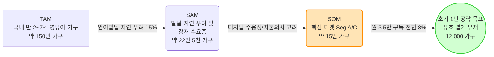
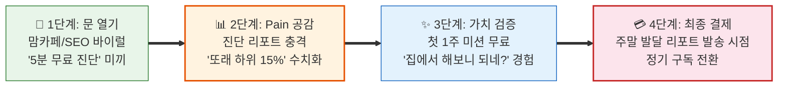

# Value Proposition Sheet (VPS) V07 — Restructured
## 한국 온라인 언어발달·발음교정·의사소통 훈련 교육 서비스

> **문서 목적**: PRD(제품 요구사항 정의서), SRS(소프트웨어 요구사항 명세서) 및 사업계획서 작성을 위한 Business & User 전략 최종 통합 마스터 문서. 기존 V06 버전을 기반으로, 4단계 논리적 구조(가치 제안 → 기능 매핑 → 구현 계획 → 비즈니스 실행)로 전면 재배치하여 '단일 진실 공급원(Single Source of Truth)'으로서의 틀을 갖추었습니다.
> **작성 기준**: 2026년 5월

---

## 목차

| Part | 섹션 | 내용 | 핵심 질문 |
|:---:|:---|:---|:---:|
| **Ⅰ** | §1 Problem-Solution Fit | 타겟별 문제-해결-효과 매핑 | 왜 사는가? |
| **Ⅰ** | §2 종합 캔버스 | 전략적 포지셔닝 및 핵심 가치 | 무엇을 파는가? |
| **Ⅰ** | §3 Proof | 타겟 규모 및 기회 점수(AOS) 증명 | 증거가 있는가? |
| **Ⅱ** | §4 Job-Value-Feature 매핑 보드 | 고객 Job → 가치 → 기능 전체 매핑 | 무엇을 만드는가? |
| **Ⅱ** | §5 공통 설계 원칙 | 리스크 관리 및 안전/법적 프로토콜 | 어떤 원칙으로? |
| **Ⅲ** | §6 MVP 기능 로드맵 (JobMVP) | 기능(Epic) 목록 및 릴리즈 Phase | 어떻게 만드는가? |
| **Ⅲ** | §7 GTM & UX/UI Copy | 페르소나별 마케팅/랜딩페이지 카피 | 어떻게 소통하는가? |
| **Ⅳ** | §8 수익 구조 및 지표 (KPIs) | 과금 모델 및 핵심 성공 지표 | 어떻게 버는가? |
| **Ⅳ** | §9 고객 획득 및 마케팅 전략 | 초기 획득 및 채널 파이프라인 | 어떻게 뚫는가? |
| **Ⅳ** | §10 리스크 관리 및 방어 전략 | 법적, 규제적, 품질적 리스크 통제 | 어떻게 지키는가? |

---

# Part Ⅰ. 가치 제안 — 왜 사는가?

---

## §1. Problem-Solution Fit: 고객별 가치 제안 (문제-해결-효과 매핑)

### 1-1. 시장 구조적 배경 — 왜 '지금' 이 문제가 중요한가?

> **근거: ▶ 26개 사전 분석 중 '포터 5가지 힘 시장분석' 및 '문제정의서 통합본'**

국내 영유아 언어 발달 시장은 포스트 코로나 이후 발달 지연 우려가 폭증했으나, 오프라인 인프라의 공급 한계로 인해 부모들이 '불안'과 '대기' 속에 방치되는 구조적 공백에 놓여 있습니다.

#### [구조적 원인] 수요 폭발과 공급 병목의 불균형
| 현상 | 세부 내용 | 시장의 기회점 |
| :--- | :--- | :--- |
| **수요 측면** | 마스크 착용 및 미디어 과노출로 영유아 언어/사회성 발달 지연 우려 폭증 | 진단 수요가 병원/센터로 쏠리나 물리적 수용 불가 |
| **공급 측면** | 전문 언어재활사 및 치료 기관의 절대적 부족 (특히 비수도권 심각) | 평균 **3~6개월의 긴 대기 발생 (골든타임 허비)** |
| **비용/제도 측면** | 회당 5~8만 원의 높은 비용 부담, 실비 보험 적용 축소 기조 | 센터에만 의존할 수 없는 **저비용 장기 홈케어 필수화** |

#### [포터 5가지 힘] 전략적 진입 기회 분석
| 포터 요인 | 평가 | 진입 전략 시사 |
| :--- | :--- | :--- |
| **기존 경쟁자 (사설 센터)** | 낮음 | 매우 파편화되어 있고 디지털 전환(DX)이 전무함 → 데이터 기반 플랫폼화의 완전한 공백 |
| **대체재 위협 (맘카페, 유튜브)** | 높음 | '무료 접근성'이라는 강점 → 파편화된 정보로 불안만 가중시키므로 **"객관적 진단 수치"** 제공이 승부처 |
| **신규 진입자 (디지털 치료제 DTx)** | 중간 | '의료기기' 인허가라는 막대한 시간/비용 장벽 존재 → 우리는 **"비의료/교육용"**으로 우회하여 런칭 속도전 우위 확보 |

### 1-2. 문제정의서가 밝힌 4대 핵심 문제 (Core Pain Points)

거시적인 공급 병목과 비싼 비용 구조는 실질적인 소비자인 부모와 교육 기관에게 다음과 같은 4가지 치명적인 문제를 연쇄적으로 발생시킵니다. 이 문제들이 곧 우리가 제품으로 해결해야 할 타겟 지표가 됩니다.

| 문제 클러스터 | 핵심 Pain | 현상 및 결과 |
| :--- | :--- | :--- |
| **① 진단 기준의 부재** | 부모의 극심한 불안감 증폭 | 공신력 있는 즉각적 진단 도구가 없어, 맘카페의 파편화된 경험담에 의존하며 '내 아이가 정상인지' 끊임없이 의심함 |
| **② 골든타임의 증발** | 대기 기간 중 방치 및 죄책감 | 센터 대기에만 3~6개월이 소요되어, 언어 발달에 가장 중요한 시기에 아무런 개입 없이 귀중한 시간을 허비함 |
| **③ 홈케어의 비표준화** | 지속 동력 상실 및 효과 증명 불가 | 부모가 자의적으로 훈련을 해도 발달 정도가 수치화되지 않아 금세 지치고, 향후 치료사에게 데이터로 연계하지 못함 |
| **④ 치료 권유의 딜레마** | 학부모와의 소통 갈등 (B2B) | 보육 교사는 언어 지연을 발견해도 객관적 증거가 없어, 학부모의 민원 우려로 인해 적기에 치료를 권유하지 못함 |

> **전략적 포지셔닝 선언**: 본 서비스는 이러한 4대 핵심 문제를 타파하기 위해 오프라인 센터의 거시적 병목을 우회하고, 진단부터 훈련 추적까지 집에서 즉시 시작할 수 있는 **"비의료 B2C 홈 랭귀지 코칭 (Home Language Coaching) 서비스"**로 포지셔닝합니다.

### 1-3. 핵심 4대 페르소나 문제-해결 매핑

| 타겟 페르소나 | 직면한 문제 (Pain) | 목표 서술 (Goal, Job) | 솔루션 핵심 제안 (VP) | 고객이 원하는 Outcome |
| :--- | :--- | :--- | :--- | :--- |
| **Seg A: 불안형 탐색자** (12~15만 가구) | ① 진단 공백 (기준 부재) ② 방법론 부재 ③ 진단/장애 판정 회피 심리 | 센터 방문 없이, 5분 내에 우리 아이의 정상 범위 여부를 수치로 확인하고 싶다. | **"5분 무료 AI 진단으로 정확한 발달 위치를 확인하고 홈 랭귀지 코칭을 시작하세요."** | 5분 내 정상/비정상 객관적 수치화 및 주간 홈케어 미션 획득 |
| **Seg C: 센터 대기자** (2~3만 가구) | ① 3~6개월 대기 중 골든타임 허비 죄책감 ② 비표준화된 주관적 홈케어 | 대기 수개월 간 체계적으로 훈련하고, 향후 치료사에게 객관적 데이터를 제출하고 싶다. | **"막연한 기다림은 끝. 센터 대기 기간을 성장을 준비하는 시간으로 바꾸는 체계적 홈케어"** | 대기 기간 중 주 단위 발달 수치 추적 및 센터 제출용 리포트 확보 |
| **Seg B: 데이터 집착형 적극적 개입자** (3~5만 가구) | ① 기존 앱 사용 시 ROI(효과) 파악 불가로 이탈 ② 성과 공유 욕구 미충족 | 훈련 효과를 주 단위 수치로 시각화하여 확인하고, 남편/SNS에 공유해 인정받고 싶다. | **"62점→71점! 우리 아이의 빛나는 성장을 숫자로 증명하고 가족과 공유하세요."** | 노력의 가시화, 지속적 효과 증명, 공유에 최적화된 시각화된 성적표 |
| **Seg D: 유치원/어린이집 원장** (B2B2C 채널) | ① 언어 지연 권유 시 부모와의 소통 갈등/민원 ② 설득용 객관적 데이터 부재 | 주관이 아닌 공신력 있는 데이터를 근거로 갈등 없이 발달 훈련을 권유하고 싶다. | **"선생님의 주관이 아닌 객관적인 데이터로 소통하세요. 기관용 AI 스크리닝 리포트"** | 갈등 없는 학부모 상담 진행, 기관용 스크리닝 리포트 및 법적 동의서 확보 |

### 1-4. 4대 페르소나 JTBD 선언문 (Job-to-be-Done Formal Statements)

> **근거: ▶ 26개 사전 분석 중 '고객 심층 인터뷰 및 JTBD 분석 보고서'**

각 페르소나의 핵심 과제를 정식 JTBD 선언문("When [상황], I want to [행동], so I can [결과]") 형태로 정의합니다.

#### 🎯 Seg A: 불안형 탐색자 (이지수형) — 검증: ✅ 완전 검증
> **When** 매일 밤 맘카페에서 다른 아이들의 발달 수준을 비교하며 불안감이 극에 달할 때,
> **I want to** 병원 예약 없이도 즉각적이고 객관적인 데이터(수치)로 우리 아이의 현재 발달 위치를 확인하고 싶지만,
> **So I can** "내가 과민한 것이 아니었다"는 확신을 얻고 즉시 집에서 할 수 있는 조치를 취할 수 있다.
> *(But)* 오프라인 센터는 대기가 길고 비용이 비싸며, 기존 앱들은 객관적인 진단 수치를 주지 못한다.

#### 🎯 Seg C: 센터 대기자 (최수현형) — 검증: ✅ 완전 검증
> **When** 대학병원이나 발달센터 상담을 위해 3~6개월을 속절없이 대기해야 할 때,
> **I want to** 대기하는 동안 아이의 골든타임을 낭비하지 않도록 체계적인 홈케어 커리큘럼을 제공받고 싶지만,
> **So I can** 향후 치료사를 만났을 때 그간의 발달 추이를 수치화된 리포트로 제출하여 즉각적인 본 치료에 진입할 수 있다.
> *(But)* 엄마표 언어치료는 비표준화되어 있고 주관적이라 치료사에게 유의미한 데이터로 인정받기 어렵다.

#### 🎯 Seg B: 데이터 집착형 적극적 개입자 (박민정형) — 검증: ⚠️ 부분 검증
> **When** 홈케어나 치료를 지속하고 있음에도 아이가 얼마나 좋아졌는지 체감되지 않아 포기하고 싶을 때,
> **I want to** 주 단위로 미세한 발달 변화가 62점→71점과 같이 객관적 숫자로 시각화되길 원하지만,
> **So I can** 훈련의 동력을 유지하고 가족(남편, 조부모)에게 아이의 성장을 증명하여 양육의 성취감을 인정받을 수 있다.
> *(But)* 기존 교육 앱들은 일회성 놀이 결과만 보여줄 뿐, 연속적인 성장 궤적을 증명해주지 못한다.

#### 🎯 Seg D: 유치원/어린이집 원장 (오한솔형) — 검증: ✅ 완전 검증 (B2B2C 파이프라인)
> **When** 언어 발달이 지연된 원아의 부모에게 치료 권유 상담을 진행해야 할 때,
> **I want to** 교사의 주관적 의견이 아닌, 공신력 있는 AI 스크리닝 데이터를 근거로 소통하고 싶지만,
> **So I can** 학부모의 방어 기제나 민원(컴플레인) 없이 부드럽게 가정 내 연계 치료(홈케어)를 유도할 수 있다.
> *(But)* 기관 내에 객관적 스크리닝 도구가 부재하며, 무리한 권유는 원아 이탈로 이어진다.

---

## §2. Value Proposition Sheet 종합 캔버스

### 핵심 포지셔닝

| 항목 | 내용 |
| :--- | :--- |
| **핵심 타겟** | 우리 아이의 언어 발달 지연이 걱정되어 매일 밤 맘카페를 서성이는 **18~25만 가구(만 2~7세)** 부모 |
| **서비스 정의** | **단 5분 만에 무료로** 발달 상태를 진단하고 맞춤형 훈련을 제공하는 B2C 교육 AI 솔루션 |
| **경쟁 대안 (Substitute)** | 맘카페/유튜브 (비개인화, 불안 증폭), 무작정 대기 (불안 가중), 효과 추적 없는 경쟁사 앱, 교사의 구두 의견 |
| **우리가 제공하는 차별적 가치** | 즉각적인 무료 AI 음성 진단(경쟁사 전무), 진단 연계 맞춤 커리큘럼, 시각화된 연속 발달 리포트, 기관 신뢰도 향상 AI 리포트 |

### 2-1. 경쟁 환경 심층 분석 및 차별화 (Competitive Moat)

> **근거: ▶ 26개 사전 분석 중 '경쟁사 브리핑 및 가치사슬 분석 통합본'**

| 경쟁 유형 | 대표 대안 | 강점 | 약점 및 우리의 진입 기회 |
| :--- | :--- | :--- | :--- |
| **비표준화된 정보 (Substitutes)** | 맘카페, 유튜브, 블로그 | 비용 0원, 즉각적 접근 | 파편화된 정보로 불안감 증폭, 내 아이에게 맞는 **개인화된 진단 부재** |
| **오프라인 센터 (Legacy)** | 대학병원, 사설 발달센터 | 전문가의 대면 치료 (공신력 최고) | 평균 **3~6개월의 긴 대기(골든타임 허비)**, 회당 5~8만원의 높은 비용 부담 |
| **영유아 디지털 교육 앱** | 기존 한글/인지 학습 앱 | 화려한 인터랙션, 높은 흥미 유도 | '언어 지연'에 특화된 진단 기능 없음, **효과(ROI)를 연속적인 데이터로 증명하지 못해 이탈** |
| **언어치료 전문 앱 (경쟁사)** | 기존 언어치료 SaaS 플랫폼 | 언어치료 전문 콘텐츠 보유 | B2C 무료 진단(Lead-Gen) 부재로 유입 단가(CAC) 상승, **리포트 시각화 한계** |

**우리의 전략적 공백(Strategic Gap) 선점:** 
1. 경쟁사가 제공하지 못하는 **"5분 무료 AI 진단"**을 미끼(Hook)로 사용하여 압도적인 초기 유입 창출 (CAC 대폭 절감)
2. **"주간 발달 리포트"**라는 가시화된 성과 증명을 통해 기존 디지털 교육 앱들의 고질적인 문제인 '낮은 구독 리텐션(D30)' 방어

#### 신규 진입자 Top 4 KSF (핵심 성공 요인) 및 대응 전략

이러한 경쟁 환경에서 신규 진입자인 우리가 시장을 장악하기 위한 4가지 핵심 성공 요인(KSF)과 대응 방안입니다.

| 순위 | KSF (핵심 성공 요인) | 전략적 의미 | 우리의 차별화 대응 전략 |
|:---:|:---|:---|:---|
| 1 | **초저비용 유입 엔진 (Lead-Gen)** | 유아 교육 앱의 치솟는 마케팅 비용(CAC) 극복 | 경쟁사에 없는 **"5분 무료 AI 진단"**을 맘카페의 자발적 바이럴 미끼(Hook)로 활용 |
| 2 | **가시화된 성과 증명 (Retention)** | '그래서 좋아진 게 맞아?'라는 의구심 방어 | **주 단위 발달 추적 리포트(62점→71점)** 발행으로 B2C 앱의 고질적 이탈률 방어 |
| 3 | **B2B2C 파이프라인 (Scale-up)** | 개별 학부모 획득(B2C)을 넘어선 대량 고객 획득 | 유치원/어린이집 **스크리닝 리포트(F9)** 제공으로 기관 1곳당 학부모 80가구 일괄 획득 |
| 4 | **규제 리스크 우회 (Time-to-Market)** | 식약처 인허가(DTx)로 인한 수년의 런칭 지연 방지 | UI 내 강력한 **면책 조항(Disclaimer)** 삽입 및 '비의료/교육용 콘텐츠'로 즉각적인 시장 진입 |

---

## §3. Proof (차별적 가치 검증 데이터)

> **근거: ▶ 26개 사전 분석 중 'TAM-SAM-SOM 시장 분석' 및 '기회분석(AOS/DOS) 통합본'**

### A. "이 시장은 정말 크고 타겟은 명확한가?" (TAM-SAM-SOM)

#### 시장 규모 산정 근거
*   **TAM (Total Addressable Market)**: 국내 만 2~7세 영유아 수 약 150만 명 기준, 가구 단위 접근.
*   **SAM (Serviceable Available Market)**: 국민건강보험공단 및 영유아 건강검진 통계 기준, '언어/인지 발달 지연 우려' 판정 및 잠재적 우려를 가진 가구 비율 15% 적용 시 **약 22.5만 가구 (실질 TAM 1,080억 ~ 1,800억 원 규모)**.
*   **SOM (Serviceable Obtainable Market)**: 모바일 활용에 익숙하고 적극적 탐색(맘카페)을 하는 3040 부모(Seg A, C) 기준 **약 15만 가구**. 오프라인 대기 3~6개월의 완전 공백 시장을 선점함.

#### 세그먼트별 공략 우선순위 및 규모 상세

| 세그먼트 | 정의 | 가구 수 (규모) | 특성 및 전략적 의미 | 공략 우선순위 |
|:---:|:---|:---:|:---|:---:|
| **Seg A (불안형 탐색자)** ★ | **기준 부재로 맘카페를 서성이는 초기 우려층** | **12~15만 가구** | '5분 무료 진단' 미끼에 즉각적으로 반응하여 CAC를 극적으로 낮춰줄 **초기 대량 유입(Lead-Gen)의 핵심 타겟** | **1순위 (Phase 0)** |
| **Seg C (센터 대기자)** | 오프라인 센터 진입을 위해 3~6개월 대기 중인 층 | 2~3만 가구 | 골든타임 허비에 대한 절박함이 가장 크며, '대기 기간 대체 홈케어' 제공 시 유료 전환율이 가장 높음 | 2순위 (Phase 0~1) |
| **Seg B (데이터형 개입자)** | 기존 앱이나 훈련을 이미 적극적으로 시도하는 층 | 3~5만 가구 | 효과의 시각화와 성취 공유 욕구가 큼. D30 이후의 구독 리텐션(재결제)을 견인할 락인(Lock-in) 타겟 | 3순위 (Phase 1) |
| **Seg D (기관 원장)** | 유치원/어린이집 등 보육/교육 기관 (B2B2C 채널) | 약 5,000개 기관 | 1개 기관(원장) 설득 시 80여 가구(Seg A, C)에 일괄 노출되는 기하급수적 파이프라인 | 4순위 (Phase 2) |
| **Seg E (비타겟층)** | 최고가 전문 치료사 전담층 또는 문제 인식 전무층 | 약 3만 가구 | 우리 솔루션이 제공하는 가격적 메리트가 통하지 않거나 수요가 아예 없음. 마케팅 리소스 투입 배제 | 비타겟 |

### B. "고객은 왜 구매하는가?" (AOS/DOS 정량 기회 및 JTBD 정성 검증)

우리는 고객의 기대수준(Importance), 현재 대안에 대한 만족도(Satisfaction), 그리고 고객이 겪는 위험도(Marginal Risk)를 측정하여 AOS(성취 기회 점수)와 DOS(고통 기회 점수)를 산출했습니다. 그리고 이 수치적 기회가 실제 구매로 이어지는지를 JTBD 심층 인터뷰로 교차 검증했습니다.

#### 1. JTBD 인터뷰 핵심 결과 (Switch Trigger 검증)

| 가설 ID | 대상 (페르소나) | 검증 상태 | JTBD 인터뷰 핵심 발견 (Switch Trigger) |
|:---:|:---|:---:|:---|
| **H-A** | 불안형 (Seg A) | ✅ 완전 검증 | "다른 애들은 문장으로 말하는데 우리 애만 단어일 때, 기준이 없어 미칠 것 같은 불안감이 앱 설치를 유발함" |
| **H-C** | 대기자 (Seg C) | ✅ 완전 검증 | "대기 3개월 차, 아무것도 안 하고 있다는 죄책감이 홈케어 유료 결제로 전환되는 가장 강력한 동력" |
| **H-B** | 데이터형 (Seg B)| ⚠️ 부분 검증 | "단순히 재밌는 놀이보다, 한 달 뒤 62점에서 71점으로 올랐다는 '성적표'를 받아야만 다음 달 구독을 연장함" |

#### 2. AOS / DOS 기회 통합 매트릭스 (우선순위의 정량적 근거)

> * AOS(성취 기회) = 중요도(Imp) + Max(중요도 - 만족도, 0)
> * DOS(고통 기회) = 중요도(Imp) + Max(위험도(MR) - 만족도, 0)
> * 점수 범위: 1~10점 (8.0 이상이면 '초과 달성 필수 기회')

| Desired Outcome (고객이 원하는 결과) | Imp | Sat | MR | AOS | DOS | JTBD 검증 연결 (해결 가치) |
|:---|:---:|:---:|:---:|:---:|:---:|:---|
| **O-1. 5분 내 정상/비정상 객관적 수치화 확인** | 5.0 | 1.0 | 4.5 | **9.0** | **8.5** | H-A: 불안감의 객관적 해소 |
| **O-2. 대기 기간 중 집에서 할 주간 훈련 미션** | 5.0 | 1.0 | 5.0 | **9.0** | **9.0** | H-C: 골든타임 낭비 죄책감 방어 |
| **O-3. 노력의 가시화 (62점→71점 발달 추적)** | 4.0 | 1.0 | 3.5 | **7.0** | **6.5** | H-B: 리텐션을 위한 성과 증명 |
| **O-4. 기관용 AI 스크리닝 리포트 (B2B)** | 4.0 | 1.5 | 4.0 | **6.5** | **6.5** | 원장 면담 시 학부모 민원 회피 |

#### 3. AOS × DOS 사분면 전략 (개발 범위 결정)

*   🔴 **Q1 STAR (AOS > 8.0, DOS > 8.0)**: `O-1(진단 수치화)` 및 `O-2(대기 중 훈련)`는 고객이 가장 원하면서도 현재 대안이 없어 겪는 고통이 극심한 영역입니다. 우리가 **[F1] 무료 진단**과 **[F3] 맞춤 미션**을 MVP(Phase 0)에 가장 먼저 배치해야 하는 정량적 이유입니다.
*   🟡 **Q2 LEVERAGE (AOS 7.0, DOS 6.5)**: `O-3(노력의 가시화)`은 초기의 치명적 고통(DOS)은 상대적으로 낮지만, 앱을 계속 써야 할 이유(AOS)를 제공합니다. Phase 1의 최우선 과제로 전개하여 리텐션을 견인합니다.

---

# Part Ⅱ. Job-Feature 매핑 — 무엇을 만드는가?

---

## §4. Job - Value - Feature 매핑 보드

기능이 존재해야 하는 '고객의 목적(Job)'에서 출발하는 핵심 매핑 테이블입니다.

| 타겟 페르소나 | 핵심 Job 연관성 (해결 과제) | 대응 핵심 기능 (Epic) | 중요도 | 난이도 | 우선순위 (Phase) |
| :--- | :--- | :--- | :---: | :---: | :---: |
| **Seg A** | 진단 공백 해소 및 즉각적 진입 | **F1. 무료 AI 음성 진단 엔진** | 5 | 4 | **Phase 0 (MVP)** |
| **Seg A** | 불안 해소, 수치화 욕구 충족 | **F2. 또래 비교 및 진단 리포트** | 5 | 3 | **Phase 0 (MVP)** |
| **Seg A, C** | 구체적 훈련 방법론 제시 | **F3. 진단 연계형 맞춤 미션 카드** | 5 | 3 | **Phase 0 (MVP)** |
| **Seg B, C** | 가시화된 효과 증명, 리텐션 확보 | **F4. 주간 발달 추이 그래프/리포트** | 5 | 3 | Phase 0(수기) → **Phase 1** |
| **Seg B** | 성취감 인정, 유기적 바이럴 확산 | **F5. 카카오톡 / SNS 공유 기능** | 4 | 2 | **Phase 1** |
| **Seg A, C** | 심리적 안정, 신뢰 보완 장치 | **F6. 비동기 전문가 코멘트 시스템** | 4 | 3 | **Phase 1** |
| **Seg C** | 치료사와의 연계성 강화 | **F7. 외부 공유용/센터 제출용 내보내기** | 3 | 2 | **Phase 1** |
| **공통** | 비용 대비 효율성 검토 | **F8. 다자녀 비교(Triage) 진단** | 3 | 4 | Phase 2 이후 |
| **Seg D** | 기관 제휴, CAC 대폭 절감 (B2B2C) | **F9. 기관용 B2B 스크리닝 대시보드** | 5 | 4 | **Phase 2** |
| **Seg D** | 도입 허들 최소화, 행정 편의 | **F10. 학부모 동의서 자동 생성/서명** | 4 | 2 | **Phase 2** |

---

## §5. 공통 설계 원칙 (안전 및 규제 프로토콜)

의료 서비스가 아닌 '교육/코칭' 서비스로서의 정체성을 유지하고 법적 리스크를 통제하기 위해 모든 설계에 다음 원칙을 적용합니다.

1.  **의료적 진단 분리 (Disclaimer)**: 모든 진단 결과 화면에 "본 진단은 의료적 판단이 아님"을 명시하는 면책 조항 강제 삽입.
2.  **데이터 수집 합법화**: 영유아 음성 데이터 수집을 위한 필수적인 법정대리인 동의 프로세스 내장. (B2B 확장을 고려한 F10 동의서 템플릿 포함)
3.  **Human-in-the-Loop 감수 (초기)**: 런칭 초기 AI 오진으로 인한 품질 리스크 통제를 위해 전문가(언어재활사) 비동기 코멘트/감수 병행.

---

# Part Ⅲ. MVP 구현 상세 계획 — 어떻게 만드는가?

---

## §6. 기능 로드맵 (JobMVP Map)

개발 우선순위와 Scope를 결정하는 단계별 로드맵입니다.

*   **Phase 0 (MVP - 코어 가치 검증)**: 즉각적인 유입과 진단, 초기 홈케어 제공에 집중
    *   [F1] 무료 AI 음성 진단 엔진
    *   [F2] 또래 비교 및 진단 리포트
    *   [F3] 진단 연계형 맞춤 미션 카드
    *   [F4] 주간 발달 추이 그래프/리포트 (수기 제공 형태)
*   **Phase 1 (리텐션 및 바이럴 강화)**: 훈련 효과 입증 및 신뢰도 보강
    *   [F4] 자동화된 주간 발달 리포트
    *   [F5] 카카오톡 / SNS 공유 기능
    *   [F6] 비동기 전문가 코멘트 시스템 (A/B 테스트)
    *   [F7] 외부/센터 제출용 데이터 내보내기
*   **Phase 2 (B2B 스케일업)**: 기관 제휴를 통한 파이프라인 확장
    *   [F9] 기관용 B2B 스크리닝 대시보드 파일럿
    *   [F10] 학부모 동의서 자동 서명

*(※ 향후 보강점: 각 Epic 하위의 세부 피쳐(Sub-feature) 트리 구조 추가 필요)*

---

## §7. GTM & UX/UI Copy (페르소나 커뮤니케이션)

디자이너와 마케터가 랜딩 페이지 와이어프레임 설계 및 광고 스크립트 작성 시 즉시 활용할 수 있는 핵심 메시지입니다.

| 타겟 페르소나 | 헤드라인 (Headline) | 서브카피 (Sub-copy) |
|:---|:---|:---|
| **Seg A (이지수, 불안형)** | "5분 AI 진단으로, 우리 아이 언어 발달 위치를 확인하세요" | 치료 판정이 아닙니다. 또래 대비 정확한 위치를 수치로 알려드립니다. |
| **Seg C (최수현, 대기자)** | "골든타임을 기다림으로 보내지 마세요" | 센터 대기 중에도 지금 시작할 수 있는 체계적 홈케어 프로그램. |
| **Seg B (박민정, 데이터형)**| "62%→71%, 아이의 성장이 숫자로 보입니다" | 3개월을 써도 효과를 몰랐다면, 우리 주간 리포트를 확인해보세요. |
| **Seg D (오한솔, 원장)** | "선생님이 이상하게 보는 게 아닙니다. 데이터가 증명합니다" | 학부모 소통 갈등을 없애주는 기관용 AI 언어 발달 스크리닝 리포트. |

---

# Part Ⅳ. 비즈니스 실행 — 어떻게 버는가?

---

## §8. 수익 구조 및 비즈니스 모델 설계

> **근거: ▶ 26개 사전 분석 중 '비즈니스 모델 캔버스(BMC)' 및 '린 캔버스'**

단순한 '가격표(Pricing)'를 넘어, 당사의 수익성(매출-비용)을 지속 가능하게 방어할 통합 비즈니스 모델입니다.

### A. 과금 모델 (Freemium + Tiered Subscription)

*   **Lead-Gen (무료)**: AI 음성 진단(1회) 및 또래 비교 리포트. B2C 유저의 압도적 유입을 위한 미끼.
*   **Basic (월 35,000원)**: 주간 맞춤 미션 + AI 자동 분석 리포트 + 주간 발달 추이 그래프. (알고리즘 기반 100% 자동화로 영업이익률 극대화)
*   **Premium (월 50,000원)**: Basic 혜택 + 전문가(언어재활사) 비동기 코멘트 및 피드백. (고관여 부모 대상 업셀링)
*   **B2B 기관용 (연 500,000원)**: 유치원/어린이집용 무제한 스크리닝 대시보드 라이선스. (Phase 2 도입)

### B. 수익 구조 비중 (Revenue Breakdown)

| 수익원 | 비중 | 설명 |
|:---|:---:|:---|
| **B2C Basic 구독 (MRR)** | 70% | 100% 자동화된 AI 리포트 기반 구독. 전체 수익의 핵심 캐시카우 (고마진). |
| **B2C Premium 구독 (MRR)** | 15% | 휴먼 터치(전문가 피드백)가 결합된 고관여층의 업셀링 모델. |
| **B2B 기관 라이선스 (ARR)** | 15% | 어린이집/유치원 연간 계약. 매출 비중은 낮으나 대량의 B2C 리드(학부모)를 물어오는 채널 역할. |

### C. 비용 구조 (Cost Structure)

| 비용 항목 | 비중 | 설명 |
|:---|:---:|:---|
| **고객 획득 비용 (CAC)** | 가장 높음 (초기) | 런칭 초기 맘카페 바이럴, 퍼포먼스 마케팅 비용. (B2B 제휴 이후 대폭 감소 예상) |
| **R&D 및 서버 인프라** | 중간 | 음성 AI 처리(STT) API 비용, 클라우드 서버 요금, 초기 MVP 개발 인건비. |
| **전문가 인건비 (변동비)** | 중간~낮음 | Premium 모델의 비동기 코멘트 처리를 위한 시간제 언어재활사 비용. |

### D. 가격 수용성의 핵심 단초 (Pricing vs. Value)

*   **Pain 1 기반 회수 (월 3.5만 원 방어)**: 기존 맘카페의 파편화된 정보로 불안해하거나 교재를 무작정 사는 기회비용(월 5~10만 원) 대비, 월 3.5만 원은 부모의 **'불안 해소 보험금'**으로 강력히 작용합니다.
*   **Pain 2 기반 회수 (월 5만 원 방어)**: 오프라인 센터 1회 방문 비용이 5~8만 원임을 감안할 때, 월 4회(주 1회) 전문가 코멘트가 포함된 Premium 모델(월 5만 원)은 오프라인 대비 **가격 저항이 0에 수렴**합니다.

### E. 리텐션(Lock-in)과 랜드 앤 익스팬드(Growth) 전략

*   **교체 비용(Switching Cost)의 극대화**: "주간 발달 리포트" 데이터가 3~4주 누적되는 순간, 부모는 그 **연속된 궤적(Data Log)을 잃기 싫어 구독 해지를 포기**합니다. 이것이 경쟁 앱들과 구별되는 이탈 방어의 핵심입니다.
*   **Land & Expand**: 무료 진단(Land) → Basic 결제(Expand) → 훈련 데이터 누적 후 치료사 연계 Premium 업셀링(Expand) → 둘째/셋째 자녀 추가(Triage 진단)로 1가구당 LTV(고객 생애 가치)를 극대화합니다.

### F. 3개년 SOM 시나리오 (목표 KPI 기반)

| 구분 | Year 1 | Year 2 | Year 3 | 3년 누적 목표 |
|------|--------|--------|--------|---------|
| **유료 결제 가구 (SOM)** | 12,000 가구 | 35,000 가구 | 60,000 가구 | **-** |
| **B2C 구독 예상 매출** | 약 50억 원 | 약 147억 원 | 약 252억 원 | **약 449억 원** |
| **핵심 성공 지표 (KPI)** | Conversion ≥ 8% CAC ≤ 30,000원 | M3 Retention ≥ 40% | B2B 제휴로 CAC 10,000원↓ | LTV:CAC Ratio **≥ 4.0** |

*(※ 위 시나리오는 월 3.5만 원 Basic 모델 100% 가정한 보수적 최소치이며, B2B 매출 및 Premium 업셀링 제외)*

---

## §9. 영업 진입 시퀀스 (Sales Critical Path)

막연한 마케팅 광고가 아닌, 각 타겟 세그먼트의 '행동 심리'를 자극하여 다음 단계로 넘기는 정교한 영업 시퀀스입니다.

### 9-1. B2C 직접 획득 시퀀스 (Seg A, B, C 타겟)

#### [고객 여정(CJM) 기반 단계별 Touchpoint 설계]

| 단계 | 고객 심리 / 상황 | Touchpoint 및 액션 설계 | 전환 KPI |
|:---:|:---|:---|:---|
| **1단계 (문 열기)** | "우리아이 괜찮을까?" 맘카페에서 파편화된 정보를 찾으며 불안해함 | **[오가닉 바이럴]** 맘카페 고민글 댓글에 "앱 설치 없이 5분 만에 발달 수치 확인해 보세요" 라며 **웹 진단 링크(Web Link)** 투척 | 클릭률(CTR) |
| **2단계 (Pain 공감)** | 막연한 불안감이 수치로 확인되어 충격(또는 안도)을 받음 | **[진단 결과 페이지]** '동일 월령 대비 백분위' 그래프를 직관적으로 보여주며, 맞춤 솔루션을 받기 위한 **앱 설치 유도** | 앱 설치율 |
| **3단계 (가치 검증)** | "당장 센터를 못 가는데 집에서 내가 할 수 있을까?" 의구심 | **[온보딩 & 첫 주 무료]** 매일 5분 단위의 구체적인 '홈케어 미션' 앱 알림 발송. 작은 성취 경험과 안도감 제공 | 첫 주 미션 완료율 |
| **4단계 (최종 결제)** | "1주일 해보니 애가 달라지네? 계속 해야겠다." | **[페이월(Paywall)]** 1주 차 주말, 첫 '주간 발달 리포트' 알림 전송. 상세 분석 확인 및 다음 주 미션 열람을 조건으로 **Basic 정기 구독 전환** | 결제 전환율 |

### 9-2. B2B2C 기관 파이프라인 영업 시퀀스 (Seg D 타겟 / Phase 2)

#### [고객 여정(CJM) 기반 단계별 Touchpoint 설계]

| 단계 | 원장/교사 심리 / 상황 | Touchpoint 및 액션 설계 | 기대 효과 |
|:---:|:---|:---|:---|
| **1단계 (접점 형성)** | 원아 모집 경쟁 심화로 차별화된 원아 관리 툴이나 교육 서비스가 필요함 | **[오프라인 영업]** 사립 유치원 연합회, 유아교육전 등에서 "학부모 민원 없는 발달 스크리닝" 브로셔 배포 | B2B 리드 획득 |
| **2단계 (Pain 공감)** | 교사가 언어 지연을 발견해도 학부모 방어 기제(민원) 때문에 선뜻 말하지 못해 스트레스가 큼 | **[대면/Zoom 미팅]** 기술 자랑이 아닌 교사의 '감정 소모'에 철저히 공감. "선생님의 주관이 아닌 객관적 리포트가 대신 말하게 하세요" 설득 | 도입 동의서 서명률 |
| **3단계 (PoC 검증)** | "현장 업무가 늘어나는 건 아닐까?" 귀찮음과 반발 우려 | **[무료 도입]** 기관용 대시보드 시범 세팅. 교사는 수업 중 자연스럽게 태블릿으로 음성 녹음만 수행하면 자동 분석 완료 | 활성 사용률 |
| **4단계 (락인 & 확장)** | 학부모 상담 주간 도래. 권유를 뒷받침할 명확한 증거 자료 필요. | **[알림장 연동 발송]** 키즈노트 등을 통해 원장/기관명으로 진단 결과지 전송. 상세 결과 열람을 위해 **부모의 B2C 앱 설치 강제** | 1기관 당 학부모 유입 수 |

---

## §10. 초기 사업 검증 및 파트너십 GTM 전략

### 10-1. MVP 핵심 가설 검증 지표 (Key Metrics)

| 가설 유형 | 검증 가설 | 핵심 검증 지표 (Metric) | 타겟 달성 수준 |
|:---:|:---|:---|:---|
| **영업(유입) 가설** | 맘카페의 불안형 부모들은 '무료 진단' 링크를 클릭할 것이다. | 랜딩페이지 진입률 (CTR) | **≥ 15%** |
| **가치(전환) 가설** | 수치화된 충격(진단)은 유료 구독(해결책)으로 이어질 것이다. | 무료 진단 완료 → Basic 결제 전환율 | **≥ 8%** |
| **성장(채널) 가설** | 유치원 원장들은 교사의 감정 소모를 막기 위해 시스템을 도입할 것이다. | B2B 스크리닝 대시보드 무료 도입 수락률 | 콜드콜 대비 **≥ 20%** |
| **제품(리텐션) 가설** | 데이터가 시각화된 리포트는 교체 비용(Switching Cost)을 높일 것이다. | M3 (3개월 차) 리텐션 유지율 | **≥ 40%** |

### 10-2. 우회 진입을 위한 파트너십 채널 플랜 (Wedge Channel Strategy)

우리가 개별 학부모를 한 명씩 쫓아다니지 않고, 수요가 몰리는 길목을 지키는 전략입니다.

| 채널 유형 | 핵심 파트너 | Win-Win 구조 (Trojan Horse) | 기대 효과 |
|:---|:---|:---|:---:|
| **보육/교육 망** | 사립 유치원 연합회 | "원아 이탈 방지를 위한 선제적 케어 시스템"으로 제안 | 원장 1인 = 80가구 일괄 유입 |
| **의료 브릿지** | 지역 소아청소년과 | 3분 진료로 상담이 부족한 의사들의 한계 보완. 대기실에 "영유아 발달 5분 자가진단 QR" 비치 | 공신력 확보 및 타겟 집중 유입 |
| **커뮤니티** | 맘카페 인플루언서 | 인플루언서에게 수익 쉐어(Affiliate)가 포함된 진단 링크 발급 | 광고비 제로, 성과 기반 CAC |

### 10-3. 핵심 경쟁 우위와 방어 해자 (Unfair Advantage)

| Unfair Advantage (해자) | 내용 | 복제 난이도 | 시간 가치 |
|:---|:---|:---:|:---:|
| **① 발달 궤적 데이터 해자 (Data Moat)** | 유저가 3개월 이상 앱을 사용하면 '우리아이 연속 발달 궤적'이 쌓임. 경쟁사가 더 화려한 앱을 내놔도, 부모는 과거 데이터를 버리고 이탈할 수 없음. | ★★★★★ | 시간이 갈수록 무한 강화 |
| **② B2B2C 기관 선점 효과** | 어린이집/유치원이라는 배포 채널(스크리닝 파이프라인)을 선점하면, 학부모는 원장이 보내준 리포트 앱을 그대로 결제하므로 경쟁 앱이 비집고 들어올 공간이 소멸됨. | ★★★★☆ | 선점형 (Winner takes all) |
| **③ 진단 연계형 NLP 알고리즘** | 발달 지연 아동 특유의 불분명한 발음(조음 장애)을 파싱하는 특화된 음성 인식 모델. 일반 성인용 STT를 쓰는 대기업/경쟁사 대비 특수 도메인 정확도 압도. | ★★★★☆ | 데이터 축적형 |

---

## §11. 리스크 관리 및 방어 전략 (Risk & Mitigation)

*   **규제 리스크 (의료법/DTx)**: "의료기기"가 아닌 "비의료/교육용 콘텐츠" 카테고리로 론칭하여 규제 장벽을 우회. UI 내 Disclaimer 강제 적용.
*   **개인정보/법적 리스크**: 영유아 음성 데이터 수집 시 법정대리인 동의 필수화. B2B 확장을 위해 기관용 법적 서명 템플릿(F10)을 선제적으로 제공.
*   **품질 리스크 (AI 오진)**: Phase 1에서 수동 감수 파이프라인을 운영하여 튜닝 과정을 거치고, 이를 통해 초기 불만 리스크 통제.
