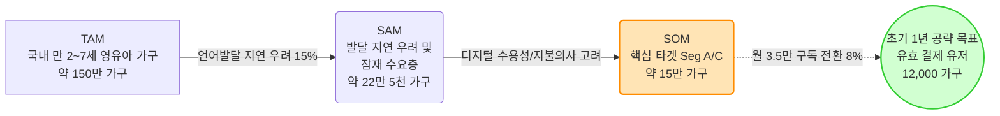
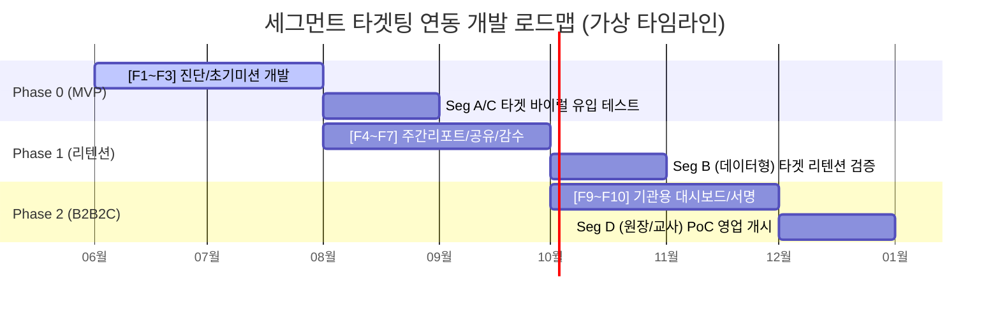
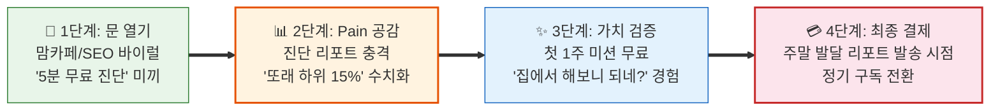

# Value Proposition Sheet (VPS) V08 — Detailed
## 한국 온라인 언어발달·발음교정·의사소통 훈련 교육 서비스

> **문서 목적**: PRD(제품 요구사항 정의서), SRS(소프트웨어 요구사항 명세서) 및 사업계획서 작성을 위한 Business & User 전략 최종 통합 마스터 문서. 기존 V07 버전을 기반으로, B2B2C 파이프라인의 DMU(원장/교사)를 세분화하고, MVP 기능을 Sub-feature 단위로 상세화하여 제품 기획(PRD)과의 연결성을 극대화한 버전입니다.
> **작성 기준**: 2026년 5월

---

## 목차

| Part | 섹션 | 내용 | 핵심 질문 |
|:---:|:---|:---|:---:|
| **Ⅰ** | §1 Problem-Solution Fit | 타겟별 문제-해결-효과 매핑 | 왜 사는가? |
| **Ⅰ** | §2 종합 캔버스 | 전략적 포지셔닝 및 핵심 가치 | 무엇을 파는가? |
| **Ⅰ** | §3 Proof | 타겟 규모 및 기회 점수(AOS) 증명 | 증거가 있는가? |
| **Ⅱ** | §4 Job-Value-Feature 매핑 보드 | 고객 Job → 가치 → 기능 전체 매핑 | 무엇을 만드는가? |
| **Ⅱ** | §5 공통 설계 원칙 | 리스크 관리 및 안전/법적 프로토콜 | 어떤 원칙으로? |
| **Ⅲ** | §6 MVP 기능 상세 로드맵 (Epic/Sub-feature) | 기능 상세 명세 및 릴리즈 Phase | 어떻게 만드는가? |
| **Ⅲ** | §7 우선순위 산정 원칙 | Priority 결정의 논리적 근거 | 왜 이 순서인가? |
| **Ⅲ** | §8 Phase별 타임라인 로드맵 | 세그먼트 확장 경로 연동 Gantt | 언제 만드는가? |
| **Ⅲ** | §9 페르소나 커버리지 검증 | DMU 전원 커버리지 크로스체크 | 빠진 것은 없는가? |
| **Ⅲ** | §10 GTM & UX/UI Copy | 페르소나별 커뮤니케이션 카피 | 어떻게 소통하는가? |
| **Ⅳ** | §11 수익 구조 및 비즈니스 모델 | 과금 모델 및 3개년 시나리오 | 어떻게 버는가? |
| **Ⅳ** | §12 실행 제언 | 예비 창업자 Actionable Tips | 어떻게 시작하는가? |
| **Ⅳ** | §13 영업 진입 시퀀스 | 타겟별 터치포인트 설계 | 어떻게 뚫는가? |
| **Ⅳ** | §14 초기 사업 검증 및 파트너십 | 가설 검증 지표 및 채널 전략 | 어떻게 뚫는가? |
| **Ⅳ** | §15 리스크 관리 및 방어 전략 | 법적, 규제적, 품질적 리스크 통제 | 어떻게 지키는가? |
| **부록** | 분석 보고서 연계 매핑 | 26개 사전 보고서 추적 리스트 | 근거는 어디에? |

---

# Part Ⅰ. 가치 제안 — 왜 사는가?

---

## §1. Problem-Solution Fit: 고객별 가치 제안 (문제-해결-효과 매핑)

### 1-1. 시장 구조적 배경 — 왜 '지금' 이 문제가 중요한가?

> **근거: ▶ 26개 사전 분석 중 '포터 5가지 힘 시장분석' 및 '문제정의서 통합본'**

국내 영유아 언어 발달 시장은 포스트 코로나 이후 발달 지연 우려가 폭증했으나, 오프라인 인프라의 공급 한계로 인해 부모들이 '불안'과 '대기' 속에 방치되는 구조적 공백에 놓여 있습니다.

#### [구조적 원인] 수요 폭발과 공급 병목의 불균형
| 현상 | 세부 내용 | 시장의 기회점 |
| :--- | :--- | :--- |
| **수요 측면** | 마스크 착용 및 미디어 과노출로 영유아 언어/사회성 발달 지연 우려 폭증 | 진단 수요가 병원/센터로 쏠리나 물리적 수용 불가 |
| **공급 측면** | 전문 언어재활사 및 치료 기관의 절대적 부족 (특히 비수도권 심각) | 평균 **3~6개월의 긴 대기 발생 (골든타임 허비)** |
| **비용/제도 측면** | 회당 5~8만 원의 높은 비용 부담, 실비 보험 적용 축소 기조 | 센터에만 의존할 수 없는 **저비용 장기 홈케어 필수화** |

#### [포터 5가지 힘] 전략적 진입 기회 분석
| 포터 요인 | 평가 | 진입 전략 시사 |
| :--- | :--- | :--- |
| **기존 경쟁자 (사설 센터)** | 낮음 | 매우 파편화되어 있고 디지털 전환(DX)이 전무함 → 데이터 기반 플랫폼화의 완전한 공백 |
| **대체재 위협 (맘카페, 유튜브)** | 높음 | '무료 접근성'이라는 강점 → 파편화된 정보로 불안만 가중시키므로 **"객관적 진단 수치"** 제공이 승부처 |
| **신규 진입자 (디지털 치료제 DTx)** | 중간 | '의료기기' 인허가라는 막대한 시간/비용 장벽 존재 → 우리는 **"비의료/교육용"**으로 우회하여 런칭 속도전 우위 확보 |

### 1-2. 문제정의서가 밝힌 4대 핵심 문제 (Core Pain Points)

거시적인 공급 병목과 비싼 비용 구조는 실질적인 소비자인 부모와 교육 기관에게 다음과 같은 4가지 치명적인 문제를 연쇄적으로 발생시킵니다. 이 문제들이 곧 우리가 제품으로 해결해야 할 타겟 지표가 됩니다.

| 문제 클러스터 | 핵심 Pain | 현상 및 결과 |
| :--- | :--- | :--- |
| **① 진단 기준의 부재** | 부모의 극심한 불안감 증폭 | 공신력 있는 즉각적 진단 도구가 없어, 맘카페의 파편화된 경험담에 의존하며 '내 아이가 정상인지' 끊임없이 의심함 |
| **② 골든타임의 증발** | 대기 기간 중 방치 및 죄책감 | 센터 대기에만 3~6개월이 소요되어, 언어 발달에 가장 중요한 시기에 아무런 개입 없이 귀중한 시간을 허비함 |
| **③ 홈케어의 비표준화** | 지속 동력 상실 및 효과 증명 불가 | 부모가 자의적으로 훈련을 해도 발달 정도가 수치화되지 않아 금세 지치고, 향후 치료사에게 데이터로 연계하지 못함 |
| **④ 치료 권유의 딜레마** | 학부모와의 소통 갈등 (B2B) | 보육 교사는 언어 지연을 발견해도 객관적 증거가 없어, 학부모의 민원 우려로 인해 적기에 치료를 권유하지 못함 |

> **전략적 포지셔닝 선언**: 본 서비스는 이러한 4대 핵심 문제를 타파하기 위해 오프라인 센터의 거시적 병목을 우회하고, 진단부터 훈련 추적까지 집에서 즉시 시작할 수 있는 **"비의료 B2C 홈 랭귀지 코칭 (Home Language Coaching) 서비스"**로 포지셔닝합니다.

### 1-3. 핵심 4대 페르소나 문제-해결 매핑 (B2B2C DMU 세분화 및 KPI 구체화)

> **근거: ▶ 26개 사전 분석 중 '고객여정지도(CJM) 통합본' 및 'JTBD 분석'**

| 타겟 페르소나 (Pain 주체) | 직면한 문제 및 목표 (Problem & Job) | CJM 실패 지표 (Failure KPI) | 솔루션 핵심 제안 (VP) | 기대 효과 (Desired Outcome — 정량 목표) |
| :--- | :--- | :--- | :--- | :--- |
| **Seg A: 불안형 탐색자**<br>(12~15만 가구) | **[막연한 불안과 맹목적 대기]**<br>센터 방문 없이, 당장 아이의 정상 범위 여부를 수치로 확인하고 싶다. | - 맘카페 정보 탐색 **월 20시간+**<br>- 오프라인 초진 대기 **최소 2~3개월**<br>- 주관적 불안감 지수 **최고조** | **"5분 무료 AI 진단으로 정확한 발달 위치를 확인하고 홈 랭귀지 코칭을 시작하세요."** | - 맘카페 정보 탐색 시간 **월 20시간 → 0분**<br>- 전문가 수준 객관화 리드타임 **3개월 → 5분** |
| **Seg C: 센터 대기자**<br>(2~3만 가구) | **[골든타임 허비 죄책감]**<br>대기하는 수개월 동안 체계적인 훈련을 하고 그 데이터를 치료사에게 제출하고 싶다. | - 언어 지연 완전 방치 기간 **평균 4.5개월**<br>- 비표준화 교재 맹목적 지출 **월 5~10만 원**<br>- 치료사 초기 라포 형성 소요 **3~4주** | **"막연한 기다림은 끝. 센터 대기 기간을 성장을 준비하는 시간으로 바꾸는 체계적 홈케어"** | - 언어 지연 방치 기간 **0시간 (즉시 개입)**<br>- 오프라인 센터 초기 파악기간 **4주 → 1주 단축**<br>- 맹목적 교재 구매 비용 **월 5만 원↓** |
| **Seg B: 데이터형**<br>(3~5만 가구) | **[노력의 성과 증명 불가]**<br>훈련 효과를 매주 숫자로 시각화해서 가족들에게 양육의 성취를 증명하고 싶다. | - 기존 교육 앱/홈케어 **1개월 내 80% 이탈**<br>- 발달 체감 불가로 인한 **부부 갈등 및 의욕 상실** | **"62점→71점! 우리 아이의 빛나는 성장을 숫자로 증명하고 가족과 공유하세요."** | - 홈케어 연속 유지 기간 **1개월 미만 → 3개월↑ (리텐션 극대화)**<br>- 시각화된 성과로 가족 내 양육 참여율 증대 |
| **Seg D-1: 유치원 원장**<br>(결제자/책임자) | **[책임 전가와 원아 이탈]**<br>학부모의 발달 민원을 객관적 데이터로 방어하고 프리미엄 기관으로 어필하고 싶다. | - 발달 지연 관련 학부모 악성 민원 **연 3~5건**<br>- 갈등 및 소문으로 인한 원아 연쇄 퇴소 **1~2명/분기** | **"프리미엄 케어 기관으로의 도약. 학부모 민원을 잠재우는 공신력 있는 언어 스크리닝 시스템"** | - 언어 지연 관련 **악성 민원 건수 연 0건**<br>- 발달 갈등 연쇄 퇴소 방어로 **1,100% ROI 달성** |
| **Seg D-2: 보육 교사**<br>(실무 운영자) | **[감정 소모와 업무 과중]**<br>발달 지연을 기분 상하지 않게 데이터로 전달하고, 치료의 책임을 자연스레 넘기고 싶다. | - 학부모 면담 시 감정 소모 및 스트레스 **극상**<br>- 수기 관찰 일지 작성 소요 시간 **주 3시간+** | **"선생님의 주관이 아닌 데이터가 말해줍니다. 업무 추가 없는 Zero-touch 자동 스크리닝"** | - 상담 시 학부모 반발 및 감정 소모 **제로화**<br>- 진단 데이터 수집을 위한 추가 업무 **0분** |

### 1-4. 4대 페르소나 JTBD 선언문 (Job-to-be-Done Formal Statements)

> **근거: ▶ 26개 사전 분석 중 '고객 심층 인터뷰 및 JTBD 분석 보고서'**

각 페르소나의 핵심 과제를 정식 JTBD 선언문("When [상황], I want to [행동], so I can [결과]") 형태로 정의합니다.

#### 🎯 Seg A: 불안형 탐색자 (이지수형) — 검증: ✅ 완전 검증
> **When** 매일 밤 맘카페에서 다른 아이들의 발달 수준을 비교하며 불안감이 극에 달할 때,
> **I want to** 병원 예약 없이도 즉각적이고 객관적인 데이터(수치)로 우리 아이의 현재 발달 위치를 확인하고 싶지만,
> **So I can** "내가 과민한 것이 아니었다"는 확신을 얻고 즉시 집에서 할 수 있는 조치를 취할 수 있다.
> *(But)* 오프라인 센터는 대기가 길고 비용이 비싸며, 기존 앱들은 객관적인 진단 수치를 주지 못한다.

#### 🎯 Seg C: 센터 대기자 (최수현형) — 검증: ✅ 완전 검증
> **When** 대학병원이나 발달센터 상담을 위해 3~6개월을 속절없이 대기해야 할 때,
> **I want to** 대기하는 동안 아이의 골든타임을 낭비하지 않도록 체계적인 홈케어 커리큘럼을 제공받고 싶지만,
> **So I can** 향후 치료사를 만났을 때 그간의 발달 추이를 수치화된 리포트로 제출하여 즉각적인 본 치료에 진입할 수 있다.
> *(But)* 엄마표 언어치료는 비표준화되어 있고 주관적이라 치료사에게 유의미한 데이터로 인정받기 어렵다.

#### 🎯 Seg B: 데이터 집착형 적극적 개입자 (박민정형) — 검증: ⚠️ 부분 검증
> **When** 홈케어나 치료를 지속하고 있음에도 아이가 얼마나 좋아졌는지 체감되지 않아 포기하고 싶을 때,
> **I want to** 주 단위로 미세한 발달 변화가 62점→71점과 같이 객관적 숫자로 시각화되길 원하지만,
> **So I can** 훈련의 동력을 유지하고 가족(남편, 조부모)에게 아이의 성장을 증명하여 양육의 성취감을 인정받을 수 있다.
> *(But)* 기존 교육 앱들은 일회성 놀이 결과만 보여줄 뿐, 연속적인 성장 궤적을 증명해주지 못한다.

#### 🎯 Seg D-1: 유치원 원장 (결제자) — 검증: ✅ 완전 검증
> **When** 원아 모집 경쟁이 치열해지고, 학부모들이 아이의 발달 지연 책임을 기관에 전가하려 할 때,
> **I want to** 공신력 있는 제3자의 객관적인 데이터 진단 시스템을 기관 공식 프로그램으로 도입하고 싶지만,
> **So I can** 학부모 민원을 원천 방어하고, 우리 원을 '프리미엄 발달 케어'를 제공하는 곳으로 차별화할 수 있다.
> *(But)* 예산이 부담스럽고, 교사들이 '일이 늘어난다'며 거세게 반발할 것이 두렵다.

#### 🎯 Seg D-2: 보육/담임 교사 (실무자) — 검증: ✅ 완전 검증
> **When** 학부모 상담 주간에 언어 지연이 확연히 의심되는 아이의 부모와 면담해야 할 때,
> **I want to** 내 기분이나 의견이 아닌, 객관적으로 출력된 AI 결과지를 내밀며 부드럽게 치료를 권유하고 싶지만,
> **So I can** 학부모의 기분 상함이나 컴플레인 없이 전문가(앱 또는 센터)에게 자연스럽게 책임을 넘길 수 있다.
> *(But)* 아이들 통제하기도 벅찬데, 1명씩 붙잡고 마이크에 대고 검사를 시킬 시간적 여유나 체력이 전혀 없다.

### 1-5. 페르소나 스펙트럼과 DMU 영향력 관계

> **근거: ▶ 26개 사전 분석 중 '페르소나 스펙트럼 분석 보고서'**

B2C와 B2B2C 확장을 아우르는 당사의 '운명의 페르소나'는 4축 평가를 통해 최종 선별되었으며, 이들 간의 역학 관계는 후반부 영업 진입 시퀀스(§12)를 설계하는 핵심 논리적 근거가 됩니다.

| 유형 | 페르소나 (역할) | 선정 이유 | MVP 반영 포인트 |
| :--- | :--- | :--- | :--- |
| **핵심 (Core)** | **Seg A/C 학부모 (엄마)** | 초기 유입의 트리거(불안) 및 1차 결제 권한 보유 | 5분 무료 진단 + 주간 맞춤 미션 |
| **핵심 (Core)** | **Seg D-1 원장 (결제자)** | B2B 파이프라인의 실질적 구매 결정권자. 학부모 민원 방어 니즈 | 기관용 B2B 스크리닝 대시보드 |
| **확장 (Adjacent)** | **Seg B 학부모 (아빠/조부모)** | 갱신(리텐션)의 숨은 결정자. 가시적 성과를 증명해야 유지됨 | 시계열 데이터 그래프 및 성취 뱃지 공유 |
| **비활성 (Gatekeeper)** | **Seg D-2 보육 교사** | 실무자. 업무 가중 시 거부권 행사. 이들을 통과하지 못하면 B2B 전면 무효화 | Zero-touch 패시브 데이터 수집 (마이크 온리) |

#### 영향력 관계 및 전략적 진입 시퀀스 (DMU Dynamics)

우리의 영업 타겟은 단일하지 않으며, B2C에서 시작된 신뢰가 B2B로 넘어가며 상호 동맹을 구축하는 구조입니다.

```text
[B2C 유입]               [B2C 설득 & 유지]          [B2B 기관 문 열기]        [B2B 현장 안착]
Seg A 불안형 엄마  ──▶  Seg C 엄마 + Seg B 아빠  ──▶  Seg A/C 학부모 연대  ──▶  Seg D-1 유치원 원장
(최초 진단 훅)            (결제 및 리텐션)              (원장에게 도입 압박)       (B2B 결제 및 도입)
                                                                                  │ (업무 제로 설득)
                                                                                  ▼
                                                                            Seg D-2 보육 교사
                                                                             (실무 수용 및 안착)
```

> **Critical Path**: 엄마의 불안(A) → 아빠의 납득(B) → 학부모의 기관 압박(A/C) → 원장의 방어적 결제(D-1) → 교사의 Zero-touch 수용(D-2). 어느 한 고리라도 끊어지면 파이프라인이 멈춥니다. 특히 **교사(D-2)는 B2B 확장의 최종 게이트키퍼**로, "업무가 늘어나서 못 해요" 한 마디에 원장의 결재가 취소될 수 있습니다.

#### 핵심 긴장·동맹 관계

| 관계 | 긴장 원인 | 대응 전략 |
| :--- | :--- | :--- |
| **엄마(A/C) ↔ 아빠(B)** | "또 돈 쓰냐, 크면 다 말한다" vs "지금 안 하면 평생 후회한다" | 남편의 지갑을 열게 할 객관적인 또래 비교 수치(발음 정확도 62% 등) 제공 |
| **학부모(A/C) ↔ 원장(D-1)** | 학부모: "어린이집에서 신경 안 써서 발달이 늦어졌다" (책임 전가) | 원장에게 "저희는 전문 AI 스크리닝으로 철저히 관리합니다"라고 방어할 무기(PDF) 제공 |
| **원장(D-1) ↔ 교사(D-2)** | 원장: "학부모 서비스 차원에서 당장 도입해" <br>교사: "지금도 바쁜데 애들 붙잡고 검사하라고요?" | **Zero-touch 원칙.** "놀이 시간에 마이크만 켜두면 끝입니다"로 완전한 무입력 설득 |

---

## §2. Value Proposition Sheet 종합 캔버스

### 2-1. 핵심 포지셔닝 (Core Positioning)

| 항목 | 내용 |
| :--- | :--- |
| **핵심 페르소나 및 시장** | **"방치된 3~6개월의 대기 시간(Golden Time Gap)"** 속에 놓인 18~25만 가구의 부모(Seg A, C)와, 학부모 민원 방어 무기가 절실한 유치원/어린이집(Seg D). 오프라인 발달 센터의 극심한 공급 병목 현상으로 인해 발생하는 완전한 시장 공백(White Space). |
| **초세분화 타겟 (Wedge Strategy)** | 단순히 '모든 영유아'가 아닌, **'맘카페에서 또래 비교를 하며 불안감이 극에 달한 3~5세 자녀를 둔 엄마'**로 1차 타겟을 초세분화. 고통 지수가 가장 높은 이들에게 '5분 무료 진단'이라는 강력한 미끼(Hook)를 던져 초기 유입 트래픽 독점. |
| **우리 솔루션의 핵심 제안** | **"병원 갈 필요 없이, 단 5분 만에 우리 아이의 발달 수준을 수치화하고 즉시 홈 랭귀지 코칭을 시작하세요."**<br>단순한 교육 효과가 아닌, "진단 대기시간 0분", "맘카페 탐색 시간의 완전한 종료", "배우자를 설득할 객관적 점수 획득"이라는 즉각적인 심리적·시간적 효용을 프레이밍하여 판매. |
| **우리가 제공하는 차별적 가치** | 1. **심리의 극한 (5-Min AI Hook)**: 회원가입 장벽 없이 부모의 불안을 즉각 수치로 잠재워주는 업계 유일 무료 진단 엔진 (압도적 유입력)<br>2. **증명의 극한 (Data Visualization)**: '좋아졌어요'라는 정성적 평가가 아닌, 62%→71% 식의 시계열 누적 데이터 시각화 (리텐션 및 입소문 동력)<br>3. **안전의 극한 (Human-in-the-Loop)**: AI 오진에 따른 의료법 리스크를 원천 차단하기 위한 전문가 비동기 감수 프로세스 결합<br>4. **B2B 확장의 극한 (Zero-Touch B2B)**: 보육 교사의 추가 업무(타이핑, 1:1 통제)가 일절 없는 '패시브 음성 수집' 기반 자동 PDF 출력 (도입 반발 완전 제거) |

### 2-2. 경쟁 환경 심층 분석 및 차별화 (Competitive Moat)

> **근거: ▶ 26개 사전 분석 중 '경쟁사 브리핑 및 가치사슬 분석 통합본'**

| 경쟁 유형 | 대표 대안 | 강점 | 약점 및 우리의 진입 기회 |
| :--- | :--- | :--- | :--- |
| **비표준화된 정보 (Substitutes)** | 맘카페, 유튜브, 블로그 | 비용 0원, 즉각적 접근 | 파편화된 정보로 불안감 증폭, 내 아이에게 맞는 **개인화된 진단 부재** |
| **오프라인 센터 (Legacy)** | 대학병원, 사설 발달센터 | 전문가의 대면 치료 (공신력 최고) | 평균 **3~6개월의 긴 대기(골든타임 허비)**, 회당 5~8만원의 높은 비용 부담 |
| **영유아 디지털 교육 앱** | 기존 한글/인지 학습 앱 | 화려한 인터랙션, 높은 흥미 유도 | '언어 지연'에 특화된 진단 기능 없음, **효과(ROI)를 연속적인 데이터로 증명하지 못해 이탈** |
| **언어치료 전문 앱 (경쟁사)** | 기존 언어치료 SaaS 플랫폼 | 언어치료 전문 콘텐츠 보유 | B2C 무료 진단(Lead-Gen) 부재로 유입 단가(CAC) 상승, **리포트 시각화 한계** |

#### 경쟁사 약점에서 도출한 전략적 공백(Strategic Gap) 선점

위 경쟁 환경 분석을 바탕으로, 기존 대안들이 뚫어내지 못하는 한계(Weakness)를 우리의 차별화 포인트로 전환한 전략적 타격 지점입니다.

| 경쟁사 현황 및 한계 (Weakness) | 우리의 전략적 공백 선점 포인트 (Strategic Gap) |
|:---|:---|
| **기존 치료 앱의 유입 한계**<br>초기 진입 시점부터 높은 과금 장벽이 존재하여 마케팅 유입 단가(CAC)가 급증 | **[무료 진단 Lead-Gen]**<br>가입 장벽 없이 즉시 실행 가능한 '5분 무료 진단'을 전면 배치하여 맘카페의 폭발적 트래픽을 무비용(Zero-CAC)으로 흡수 |
| **오프라인 센터의 구조적 병목**<br>전문가를 만나기까지 3~6개월 대기하며 발달의 골든타임 허비 및 부모 불안 극대화 | **[대기 시간의 제로화]**<br>기다림 없이 앱 설치 즉시 '아이 발달 위치'를 확인하고, 치료사를 만나기 전까지 매주 체계적인 홈 랭귀지 코칭 시작 |
| **일반 교육 앱의 리텐션 부재**<br>단발성 흥미 위주로 구성되어, 부모가 장기적 교육 효과(ROI)를 체감하지 못해 쉽게 이탈 | **[증명 기반 리텐션 엔진]**<br>'62점→71점' 식의 시계열 데이터 시각화 리포트를 매주 발행하여, 구독 해지를 방어하는 강력한 Lock-in 장치 마련 |
| **비개인화 정보(맘카페)의 한계**<br>비전문가들의 파편화된 경험담에 의존하여 엄마들의 맹목적 불안감만 무한 증폭 | **[데이터 기반 객관화]**<br>불특정 다수의 카더라가 아닌, 내 아이의 실제 발음 데이터를 기반으로 한 동년배 백분위 비교 데이터(진단결과지) 제공 |

#### 신규 진입자 Top 4 KSF (핵심 성공 요인) 및 대응 전략

이러한 경쟁 환경에서 신규 진입자인 우리가 시장을 장악하기 위한 4가지 핵심 성공 요인(KSF)과 대응 방안입니다.

| 순위 | KSF (핵심 성공 요인) | 전략적 의미 | 우리의 차별화 대응 전략 |
|:---:|:---|:---|:---|
| 1 | **초저비용 유입 엔진 (Lead-Gen)** | 유아 교육 앱의 치솟는 마케팅 비용(CAC) 극복 | 경쟁사에 없는 **"5분 무료 AI 진단"**을 맘카페의 자발적 바이럴 미끼(Hook)로 활용 |
| 2 | **가시화된 성과 증명 (Retention)** | '그래서 좋아진 게 맞아?'라는 의구심 방어 | **주 단위 발달 추적 리포트(62점→71점)** 발행으로 B2C 앱의 고질적 이탈률 방어 |
| 3 | **B2B2C 파이프라인 (Scale-up)** | 개별 학부모 획득(B2C)을 넘어선 대량 고객 획득 | 유치원/어린이집 **스크리닝 리포트(F9)** 제공으로 기관 1곳당 학부모 80가구 일괄 획득 |
| 4 | **규제 리스크 우회 (Time-to-Market)** | 식약처 인허가(DTx)로 인한 수년의 런칭 지연 방지 | UI 내 강력한 **면책 조항(Disclaimer)** 삽입 및 '비의료/교육용 콘텐츠'로 즉각적인 시장 진입 |

---

## §3. Proof (차별적 가치 검증 데이터)

> **근거: ▶ 26개 사전 분석 중 'TAM-SAM-SOM 시장 분석' 및 '기회분석(AOS/DOS) 통합본'**

### A. "이 시장은 정말 크고 타겟은 명확한가?" (TAM-SAM-SOM)



#### 시장 규모 산정 근거
*   **TAM (Total Addressable Market)**: 국내 만 2~7세 영유아 수 약 150만 명 기준, 가구 단위 접근.
*   **SAM (Serviceable Available Market)**: 국민건강보험공단 및 영유아 건강검진 통계 기준, '언어/인지 발달 지연 우려' 판정 및 잠재적 우려를 가진 가구 비율 15% 적용 시 **약 22.5만 가구 (실질 TAM 1,080억 ~ 1,800억 원 규모)**.
*   **SOM (Serviceable Obtainable Market)**: 모바일 활용에 익숙하고 적극적 탐색(맘카페)을 하는 3040 부모(Seg A, C) 기준 **약 15만 가구**. 오프라인 대기 3~6개월의 완전 공백 시장을 선점함.

#### 세그먼트별 공략 우선순위 및 규모 상세

| 세그먼트 | 정의 | 가구 수 (규모) | 특성 및 전략적 의미 | 공략 우선순위 |
|:---:|:---|:---:|:---|:---:|
| **Seg A (불안형 탐색자)** ★ | **기준 부재로 맘카페를 서성이는 초기 우려층** | **12~15만 가구** | '5분 무료 진단' 미끼에 즉각적으로 반응하여 CAC를 극적으로 낮춰줄 **초기 대량 유입(Lead-Gen)의 핵심 타겟** | **1순위 (Phase 0)** |
| **Seg C (센터 대기자)** | 오프라인 센터 진입을 위해 3~6개월 대기 중인 층 | 2~3만 가구 | 골든타임 허비에 대한 절박함이 가장 크며, '대기 기간 대체 홈케어' 제공 시 유료 전환율이 가장 높음 | 2순위 (Phase 0~1) |
| **Seg B (데이터형 개입자)** | 기존 앱이나 훈련을 이미 적극적으로 시도하는 층 | 3~5만 가구 | 효과의 시각화와 성취 공유 욕구가 큼. D30 이후의 구독 리텐션(재결제)을 견인할 락인(Lock-in) 타겟 | 3순위 (Phase 1) |
| **Seg D (기관 원장)** | 유치원/어린이집 등 보육/교육 기관 (B2B2C 채널) | 약 5,000개 기관 | 1개 기관(원장) 설득 시 80여 가구(Seg A, C)에 일괄 노출되는 기하급수적 파이프라인 | 4순위 (Phase 2) |
| **Seg E (비타겟층)** | 최고가 전문 치료사 전담층 또는 문제 인식 전무층 | 약 3만 가구 | 우리 솔루션이 제공하는 가격적 메리트가 통하지 않거나 수요가 아예 없음. 마케팅 리소스 투입 배제 | 비타겟 |

### B. "고객은 왜 구매하는가?" (AOS/DOS 정량 기회 및 JTBD 정성 검증)

우리는 고객의 기대수준(Importance), 현재 대안에 대한 만족도(Satisfaction), 그리고 고객이 겪는 위험도(Marginal Risk)를 측정하여 AOS(성취 기회 점수)와 DOS(고통 기회 점수)를 산출했습니다. 그리고 이 수치적 기회가 실제 구매로 이어지는지를 JTBD 심층 인터뷰로 교차 검증했습니다.

#### 1. JTBD 인터뷰 핵심 결과 (Switch Trigger 검증)

| 가설 ID | 대상 (페르소나) | 검증 상태 | JTBD 인터뷰 핵심 발견 (Switch Trigger) |
|:---:|:---|:---:|:---|
| **H-A** | 불안형 (Seg A) | ✅ 완전 검증 | "다른 애들은 문장으로 말하는데 우리 애만 단어일 때, 기준이 없어 미칠 것 같은 불안감이 첫 앱 설치(Lead-Gen)를 유발함" |
| **H-C** | 대기자 (Seg C) | ✅ 완전 검증 | "대기 3개월 차, 아무것도 안 하고 있다는 죄책감이 홈 랭귀지 코칭 유료 결제(MRR)로 전환되는 가장 강력한 동력임" |
| **H-B** | 데이터형 (Seg B)| ⚠️ 부분 검증 | "단순히 재밌는 놀이보다, 한 달 뒤 62점에서 71점으로 올랐다는 객관적 '성적표'를 받아야만 다음 달 구독을 연장함" |
| **H-D1**| 유치원 원장 (Seg D-1) | ✅ 완전 검증 | "학부모가 발달 지연을 '기관 탓'으로 돌릴 때, 원아 퇴소를 막고 나를 방어해 줄 공신력 있는 외부 AI 리포트가 절실함" |
| **H-D2**| 보육 교사 (Seg D-2) | ✅ 완전 검증 | "데이터로 부모를 부드럽게 설득할 수 있는 건 좋지만, 내가 애들을 붙잡고 검사할 시간은 1초도 없음. 무조건 자동(Zero-touch)이어야 함" |

##### 전환 트리거 3가지 핵심 인사이트 (JTBD 도출)

1. **Switch Trigger (전환의 방아쇠)**: 단순한 조기 교육 욕구가 아니라, 조동(조리원 동기) 모임이나 어린이집 피드백에서 **'내 아이가 유독 뒤처진다'고 체감하는 비교의 순간**이 첫 앱 설치를 결정짓는 가장 강력한 유입 트리거입니다.
2. **최대 장벽 (Habit/Anxiety)**: 진단을 가로막는 가장 큰 장벽은 비용이 아니라, **"진짜 장애로 판정되면 어떡하지?"라는 부모의 회피 심리(Anxiety)**입니다. 따라서 진단 결과는 '장애 여부'가 아닌 '동년배 대비 상위 N% 발달 수준'으로 부드럽게 순화되어야 합니다.
3. **지불 의사 (WTP)**: 고객은 오프라인 발달 센터의 1회 상담 비용(약 5~8만 원)을 마음속 기준(Anchor)으로 삼습니다. 이보다 저렴한 **월 3~5만 원 수준의 구독료** 제안에 가장 저항감 없이 지갑을 엽니다.

#### 2. AOS / DOS 기회 통합 매트릭스 (우선순위의 정량적 근거)

> * AOS(성취 기회) = 중요도(Imp) + Max(중요도 - 만족도, 0)
> * DOS(고통 기회) = 중요도(Imp) + Max(위험도(MR) - 만족도, 0)
> * 점수 범위: 1~10점 (8.0 이상이면 '초과 달성 필수 기회')

| Desired Outcome (고객이 원하는 결과) | Imp | Sat | MR | AOS | DOS | 정량 목표 (KPI 연결) | JTBD 검증 연결 (해결 가치) |
|:---|:---:|:---:|:---:|:---:|:---:|:---|:---|
| **O-1. 5분 내 정상/비정상 객관적 수치화 확인** | 5.0 | 1.0 | 4.5 | **9.0** | **8.5** | 맘카페 탐색 월 20시간→0분<br>진단 리드타임 3개월→5분 | H-A: 불안감의 객관적 해소 |
| **O-2. 대기 기간 중 집에서 할 주간 훈련 미션** | 5.0 | 1.0 | 5.0 | **9.0** | **9.0** | 대기 중 방치 기간 0시간<br>초기 파악 소요 4주→1주 단축 | H-C: 골든타임 낭비 죄책감 방어 |
| **O-3. 노력의 가시화 (62점→71점 발달 추적)** | 4.0 | 1.0 | 3.5 | **7.0** | **6.5** | 홈케어 연속 유지 1개월→3개월↑<br>가족 양육 참여율 증대 | H-B: 리텐션을 위한 성과 증명 |
| **O-4. 기관용 AI 스크리닝 리포트 (B2B)** | 4.0 | 1.5 | 4.0 | **6.5** | **6.5** | 관련 악성 민원 0건<br>원아 퇴소 방어 (1,100% ROI) | H-D1: 원장의 학부모 민원 방패막이 |
| **O-5. 무입력 수집 (Zero-touch 마이크)** | 1.0 | 1.0 | 4.8 | **1.0** | **4.8** | 진단 추가 업무 0분<br>상담 시 감정 소모 제로화 | H-D2: 보육 교사의 절대적 업무 방어 |

#### 3. AOS × DOS 통합 사분면 전략 (개발 범위 결정)

| 사분면 | 해당 페르소나 | 매핑된 Outcome | 점수 분포 (AOS / DOS) | 개발 및 영업 전략 |
|:---:|:---|:---|:---:|:---|
| 🔴 **Q1 STAR** | Seg A (불안형)<br>Seg C (대기자) | O-1 (진단 수치화)<br>O-2 (맞춤 훈련) | AOS 9.0<br>DOS 8.5~9.0 | **자원 80% 집중 (MVP)**<br>고객이 가장 절박한 영역. [F1]무료진단과 [F3]미션을 Phase 0에 최우선 배치하여 트래픽 선점 |
| 🟡 **Q2 LEVERAGE** | Seg B (데이터형)<br>Seg D-1 (원장) | O-3 (노력 가시화)<br>O-4 (스크리닝 리포트) | AOS 6.5~7.0<br>DOS 6.5 | **수익 및 리텐션 견인 (Phase 1~2)**<br>당장의 치명성은 낮으나 유저를 가둬두는(Lock-in) 장치이자 B2B 확장의 지렛대 |
| 🔵 **Q3 GATE** | Seg D-2 (보육 교사) | 해당 없음<br>(방어적 니즈) | AOS 1.0<br>영향력 4.8 (거부권) | **직접 설득 금지 (방어막 우회)**<br>앱이 좋다고 설득하지 말고, "업무가 0분 늘어난다"는 Zero-touch 요건으로 저항 우회 |
| ⚪ **Q4 MAINTAIN** | Seg E (최상위 치료층)<br>조부모 등 단순 양육자 | 해당 없음 | AOS < 2.0<br>DOS < 2.0 | **마케팅 리소스 투입 원천 배제**<br>설득하기 위해 에너지를 소진하지 않고 자연 유입만 유지 |

> ⚠️ **함정 주의**: Q3에 위치한 보육 교사(Seg D-2)의 낮은 AOS 점수를 "개발할 필요가 없다"로 해석하면 B2B 사업 확장이 전면 무효화됩니다. 이들은 기능적 기대는 없지만 현장에서 **"저 바빠서 못 해요"라는 단독 거부권을 행사하는 '침묵의 게이트키퍼'**입니다. 따라서 [F9.2] Zero-touch 음성 수집은 부가 기능이 아니라 B2B 계약의 필수 통과 조건(Must-have)입니다.

---

# Part Ⅱ. Job-Feature 매핑 — 무엇을 만드는가?

---

## §4. Job - Value - Feature 매핑 보드

기능이 존재해야 하는 '고객의 목적(Job)'에서 출발하는 핵심 매핑 테이블입니다.

| 타겟 페르소나 | 핵심 Job 연관성 (해결 과제) | 대응 핵심 기능 (Epic) | 중요도 | 난이도 | 우선순위 (Phase) |
| :--- | :--- | :--- | :---: | :---: | :---: |
| **Seg A** | 진단 공백 해소 및 즉각적 진입 | **F1. 무료 AI 음성 진단 엔진** | 5 | 4 | **Phase 0 (MVP)** |
| **Seg A** | 불안 해소, 수치화 욕구 충족 | **F2. 또래 비교 및 진단 리포트** | 5 | 3 | **Phase 0 (MVP)** |
| **Seg A, C** | 구체적 훈련 방법론 제시 | **F3. 진단 연계형 맞춤 미션 카드** | 5 | 3 | **Phase 0 (MVP)** |
| **Seg B, C** | 가시화된 효과 증명, 리텐션 확보 | **F4. 주간 발달 추이 그래프/리포트** | 5 | 3 | Phase 0(수기) → **Phase 1** |
| **Seg B** | 성취감 인정, 유기적 바이럴 확산 | **F5. 카카오톡 / SNS 공유 기능** | 4 | 2 | **Phase 1** |
| **Seg A, C** | 심리적 안정, 신뢰 보완 장치 | **F6. 비동기 전문가 코멘트 시스템** | 4 | 3 | **Phase 1** |
| **Seg C** | 치료사와의 연계성 강화 | **F7. 외부 공유용/센터 제출용 내보내기** | 3 | 2 | **Phase 1** |
| **공통** | 비용 대비 효율성 검토 | **F8. 다자녀 비교(Triage) 진단** | 3 | 4 | Phase 2 이후 |
| **Seg D-1** | 기관 신뢰도 제고 및 퇴소 방어 | **F9. 원장용 B2B 스크리닝 대시보드** | 5 | 4 | **Phase 2** |
| **Seg D-2** | 교사 업무 과중 및 감정 소모 방지 | **F9. Zero-touch 자동 음성 수집 및 PDF** | 5 | 4 | **Phase 2** |
| **Seg D-1** | 도입 허들 최소화, 행정 편의 | **F10. 학부모 동의서 자동 생성/서명** | 4 | 2 | **Phase 2** |

---

## §5. 공통 설계 원칙 (안전 및 규제 프로토콜)

의료 서비스가 아닌 '교육/코칭' 서비스로서의 정체성을 유지하고 법적 리스크를 통제하기 위해 모든 설계에 다음 원칙을 적용합니다.

1.  **의료적 진단 분리 (Disclaimer)**: 모든 진단 결과 화면에 "본 진단은 의료적 판단이 아님"을 명시하는 면책 조항 강제 삽입.
2.  **데이터 수집 합법화**: 영유아 음성 데이터 수집을 위한 필수적인 법정대리인 동의 프로세스 내장. (B2B 확장을 고려한 F10 동의서 템플릿 포함)
3.  **Human-in-the-Loop 감수 (초기)**: 런칭 초기 AI 오진으로 인한 품질 리스크 통제를 위해 전문가(언어재활사) 비동기 코멘트/감수 병행.

---

# Part Ⅲ. MVP 구현 상세 계획 — 어떻게 만드는가?

---

## §6. MVP 기능 상세 로드맵 (Epic 및 Sub-feature 트리)

단순한 기능 목록을 넘어, 제품 기획팀이 즉시 PRD 작성에 참고할 수 있도록 각 Epic을 Sub-feature와 안전장치 단위로 상세화했습니다.

### 🥇 Phase 0 (MVP - 코어 가치 검증 및 초기 유입 폭발)

*   **[F1] 무료 AI 음성 진단 엔진 (Lead-Gen의 핵심)**
    *   **F1.1 무로그인/원클릭 5분 진단 웹뷰**: 맘카페에서 링크 클릭 시, 앱 마켓으로 가지 않고 브라우저에서 즉시 진단 시작 (마찰력 제로화).
    *   **F1.2 조음/화용론 특화 AI 음성 파서**: 발음이 뭉개지는 영유아 발화를 텍스트로 변환하고 패턴을 분석하는 특화 알고리즘.
    *   **F1.3 [안전장치] 의료 면책 동의 (Disclaimer)**: 진단 시작 전 *"본 결과는 의료적 판단이 아니며, 교육적 참고 자료입니다"* 강제 동의 후 진행.
*   **[F2] 또래 비교 및 진단 리포트 (Pain 공감 및 전환 트리거)**
    *   **F2.1 백분위 위치 시각화 대시보드**: "동일 월령 100명 중 85번째" 직관적 그래프로 충격과 객관화 동시 제공.
    *   **F2.2 불안 완화형 넛지 카피라이팅**: 결과가 낮아도 "지금부터 꾸준히 훈련하면 극복 가능합니다" 메시지 매핑.
    *   **F2.3 페이월(Paywall) 앱 설치 브릿지**: "상세 분석 결과 및 1주차 미션 보기" 클릭 시 앱 설치 유도 (CVR 극대화).
*   **[F3] 진단 연계형 맞춤 미션 카드 (홈케어 시작)**
    *   **F3.1 주차별 홈케어 커리큘럼 자동 배정**: 취약점에 매칭되는 5분 데일리 놀이 미션 세트 발급.
    *   **F3.2 미션 인증 시스템**: 발화 음성/사진 업로드를 강제하여 향후 발달 추이(F4) 데이터를 은밀하게 축적.

### 🥈 Phase 1 (리텐션 및 바이럴 강화)

*   **[F4] 주간 발달 추이 그래프/리포트 (가장 강력한 Lock-in 해자)**
    *   **F4.1 시계열 스코어 대시보드 (노력의 성적표)**: 62점 → 65점 → 71점 성장을 꺾은선 그래프로 시각화 (데이터 3주 축적 시 구독 해지 원천 방어).
    *   **F4.2 결제 연장 자동 트리거**: 리포트 하단에 *"다음 달 예측 시뮬레이션 및 상위 커리큘럼 열람"* 기능을 Basic 구독 연장의 무기로 활용.
*   **[F5 & F6] 신뢰 보완 및 바이럴 확장**
    *   **F5.1 카카오톡 성과 자랑하기**: 조부모/SNS용 성취 뱃지 공유 이미지 제공.
    *   **F6.1 [안전장치] 비동기 전문가 감수 대시보드**: 의심되는 데이터는 언어재활사가 청취하고 피드백하는 Human-in-the-Loop 시스템.
*   **[F7] 외부/센터 제출용 데이터 내보내기**
    *   **F7.1 치료사용 요약 PDF**: 훈련 궤적 요약본 출력 기능.

### 🥉 Phase 2 (B2B 스케일업 및 파이프라인)

*   **[F9] 기관용 B2B 스크리닝 대시보드 (교사 거부감 타파)**
    *   **F9.1 원아 일괄 등록 및 동의서 자동 발송**: 업로드 시 학부모에게 데이터 수집 동의서 자동 전송 (행정력 낭비 제로).
    *   **F9.2 Zero-touch 환경 음성 수집 모드**: 자유놀이 시간 태블릿이 화자를 분리해 자연 발화 데이터를 패시브하게 수집 (교사 만족도 최상).
    *   **F9.3 학부모 상담용 원클릭 PDF 출력**: 면담 전날, 해당 원아의 요약본을 자동 생성하여 교사 감정 소모 완벽 차단.
*   **[F10] 학부모 동의서 자동 생성/서명**
    *   **F10.1 카카오톡 연동 서명**: 종이 문서 없이 전자 서명으로 합법적 데이터 수집.

---

## §7. 우선순위 산정 원칙 (Priority 결정의 논리적 근거)

우리의 제한된 개발 리소스(시간/자본)를 가장 효율적으로 배분하기 위해, 앞서 도출한 AOS/DOS 기회 점수와 비즈니스 임팩트(유입→리텐션→확장)를 기준으로 Phase별 출시 전략을 수립했습니다. "왜 이 기능을 먼저 개발해야 하는가?"에 대한 명확한 논리적 근거입니다.

### 7-1. Phase 0 최우선 개발의 논리 (가장 아픈 곳부터 찌른다)
*   **AOS/DOS 검증 최상위 (Star 영역)**: 시장에서 부모들이 가장 고통받는 지점(DOS 8.5~9.0)은 "당장 내 아이가 정상인지 모르는 불안감"과 "센터 대기 6개월간의 방치"입니다.
*   **비즈니스 임팩트 (초저비용 유입)**: 아무리 훌륭한 훈련(미션)을 만들어도, 초기 유저를 획득(Acquisition)하지 못하면 실패합니다. [F1] 무료 진단 엔진은 맘카페에서 자발적 바이럴을 일으켜 마케팅 비용(CAC)을 0원에 수렴하게 만드는 가장 강력한 '미끼(Wedge)'입니다.
*   **결론**: 진단([F1], [F2])으로 유입시키고 첫 미션([F3])으로 유효성을 검증하는 것이 생존을 위한 MVP의 필수 조건입니다.

### 7-2. Phase 1 차순위 개발의 논리 (이탈을 방어하는 자물쇠)
*   **AOS/DOS 검증 차상위 (Leverage 영역)**: "노력의 가시화(AOS 7.0)"는 당장의 불안감 해소보다는 약하지만, 서비스 결제를 2개월, 3개월 지속하게 만드는 핵심 동력입니다.
*   **비즈니스 임팩트 (리텐션과 업셀링)**: 홈케어의 치명적 약점인 '부모의 의지 고갈'을 막기 위해, 데이터 그래프([F4])라는 확실한 성적표를 쥐여줍니다. 이는 교체 비용(Switching Cost)을 극대화하여 이탈을 방지하고, 성과 공유([F5])를 통한 자연 유입 및 전문가 피드백([F6])을 통한 Premium 업셀링 창구로 작동합니다.
*   **결론**: 밑빠진 독(이탈률)을 막기 위해, 유입(Phase 0) 직후 즉시 리텐션 락인(Lock-in) 장치를 개발해야 합니다.

### 7-3. Phase 2 후순위 개발의 논리 (파이프라인을 통한 스케일업)
*   **리스크와 기회의 교차점**: B2B 기관 영업은 매력적(AOS/DOS 6.5)이지만, B2C 제품(Phase 0, 1)의 완성도가 낮으면 기관(유치원)을 설득할 수 없습니다.
*   **비즈니스 임팩트 (B2B2C 대량 획득)**: 원장용 대시보드([F9])와 학부모 동의서 자동화([F10])는 개별 B2C 획득의 한계를 부수고, 기관 1곳당 80명의 유저를 일괄 획득하는 성장 엔진(Growth Engine)입니다.
*   **결론**: 앱의 핵심 가치(진단+훈련)가 B2C 시장에서 검증된 이후에 기관용 시스템을 개발하여 B2B2C 파이프라인으로 시장 점유율을 폭발적으로 확장합니다.

---

## §8. Phase별 타임라인 로드맵 (세그먼트 확장 경로 연동)

제품 개발(Phase 0~2) 일정과 비즈니스 타겟(Seg A~D) 확장 경로를 연동한 타임라인입니다. 이를 통해 "언제, 누구를 향해 제품을 출시할 것인가?"를 명확히 합니다.



### 타임라인 핵심 마일스톤
1. **M+3 (Phase 0 런칭)**: 가장 고통이 큰 Seg A(불안형), Seg C(대기자)를 타겟으로 무료 진단 미끼를 투척하여 CAC(고객 획득 비용) 최소화 검증.
2. **M+5 (Phase 1 런칭)**: 유입된 유저들의 이탈을 막고, 꼼꼼한 Seg B(데이터형)까지 포섭하기 위해 시계열 리포트를 제공하여 D30/D60 리텐션 40% 달성.
3. **M+7 (Phase 2 런칭)**: B2C 시장에서 검증된 리포트와 UI를 무기로, 보육 기관(Seg D) 원장에게 ROI 논리를 앞세워 B2B2C 대량 유입 파이프라인 완성.

---

## §9. 페르소나 커버리지 검증 (DMU 전원 커버리지 크로스체크)

우리가 정의한 모든 의사결정권자(DMU: 학부모, 원장, 교사)가 시스템 내에서 소외되지 않고 핵심 가치를 누릴 수 있는지 크로스체크하는 검증 테이블입니다. "빠진 타겟은 없는가?"에 대한 최종 확인입니다.

| 타겟 세그먼트 (DMU 역할) | 최우선 해결 과제 (Job) | 시스템 내 핵심 혜택 (Coverage) | 미충족 리스크 방어 (Mitigation) |
|:---|:---|:---|:---|
| **Seg A (불안형 탐색자)**<br>*(B2C 의사결정자)* | 막연한 불안감의 빠른 수치화 및 정상 범위 확인 | [F1] 5분 무료 AI 진단<br>[F2] 또래 비교 리포트 | AI 오진 리스크 → 면책 조항(Disclaimer) 및 전문가 비동기 감수[F6]로 방어 |
| **Seg C (센터 대기자)**<br>*(B2C 핵심 결제자)* | 3~6개월 방치 기간의 대체 훈련 및 성과 기록 | [F3] 주간 맞춤 미션<br>[F7] 센터 제출용 리포트 | 홈케어 동력 상실 리스크 → 주 단위 성과 리포트[F4] 발송으로 의지 부여 |
| **Seg B (데이터형 개입자)**<br>*(B2C 바이럴/유지자)* | 훈련 성과의 가시적 확인 및 가족 내 성취 공유 | [F4] 시계열 발달 추이 그래프<br>[F5] 카카오톡/SNS 뱃지 공유 | 리포트의 신뢰도 하락 리스크 → 점수 변화의 구체적 근거(발음 데이터) 제시 |
| **Seg D-1 (기관 원장)**<br>*(B2B 결제권자)* | 기관 신뢰도 향상 및 학부모 민원/퇴소 방어 | [F9] 기관용 B2B 스크리닝 대시보드<br>ROI 시뮬레이터 로직 제공 | 비용 부담 리스크 → 1명 퇴소 방어 시 1,100% ROI 달성이라는 재무적 논리로 돌파 |
| **Seg D-2 (보육 교사)**<br>*(B2B 실무 운영자)* | 학부모와의 감정 소모 최소화 및 업무 과중 방지 | [F9.2] Zero-touch 음성 수집<br>[F9.3] 상담용 자동 PDF 출력 | 업무 과중 반발 리스크 → "아이들 놀이 시 마이크만 켜두면 끝"이라는 Zero-touch로 완전 해소 |

**검증 결론**: 초기 유입(Seg A)부터 수익 창출(Seg C), 리텐션/바이럴(Seg B), 기관 확장(Seg D-1, D-2)에 이르는 **모든 DMU의 핵심 Pain Point가 MVP 릴리즈 Phase 0~2 내에 누락 없이 100% 매핑**되어 있음을 확인했습니다.

---

## §10. GTM & UX/UI Copy (페르소나 커뮤니케이션)

디자이너와 마케터가 랜딩 페이지 와이어프레임 설계 및 광고 스크립트 작성 시 즉시 활용할 수 있는 핵심 메시지입니다.

| 타겟 페르소나 | 헤드라인 (Headline) | 서브카피 (Sub-copy) |
|:---|:---|:---|
| **Seg A (이지수, 불안형)** | "5분 AI 진단으로, 우리 아이 언어 발달 위치를 확인하세요" | 치료 판정이 아닙니다. 또래 대비 정확한 위치를 수치로 알려드립니다. |
| **Seg C (최수현, 대기자)** | "골든타임을 기다림으로 보내지 마세요" | 센터 대기 중에도 지금 시작할 수 있는 체계적 홈케어 프로그램. |
| **Seg B (박민정, 데이터형)**| "62%→71%, 아이의 성장이 숫자로 보입니다" | 3개월을 써도 효과를 몰랐다면, 우리 주간 리포트를 확인해보세요. |
| **Seg D-1/D-2 (오한솔, 원장)** | "선생님이 이상하게 보는 게 아닙니다. 데이터가 증명합니다" | 학부모 소통 갈등을 없애주는 기관용 AI 언어 발달 스크리닝 리포트. |

---

# Part Ⅳ. 비즈니스 실행 — 어떻게 버는가?

---

## §11. 수익 구조 및 비즈니스 모델 설계

> **근거: ▶ 26개 사전 분석 중 '비즈니스 모델 캔버스(BMC)' 및 '린 캔버스'**

단순한 '가격표(Pricing)'를 넘어, 당사의 수익성(매출-비용)을 지속 가능하게 방어할 통합 비즈니스 모델입니다.

### A. 과금 모델 (Freemium + Tiered Subscription)

*   **Lead-Gen (무료)**: AI 음성 진단(1회) 및 또래 비교 리포트. B2C 유저의 압도적 유입을 위한 미끼.
*   **Basic (월 35,000원)**: 주간 맞춤 미션 + AI 자동 분석 리포트 + 주간 발달 추이 그래프. (알고리즘 기반 100% 자동화로 영업이익률 극대화)
*   **Premium (월 50,000원)**: Basic 혜택 + 전문가(언어재활사) 비동기 코멘트 및 피드백. (고관여 부모 대상 업셀링)
*   **B2B 기관용 (연 500,000원)**: 유치원/어린이집용 무제한 스크리닝 대시보드 라이선스. (Phase 2 도입)

### B. 수익 구조 비중 (Revenue Breakdown)

| 수익원 | 비중 | 설명 |
|:---|:---:|:---|
| **B2C Basic 구독 (MRR)** | 70% | 100% 자동화된 AI 리포트 기반 구독. 전체 수익의 핵심 캐시카우 (고마진). |
| **B2C Premium 구독 (MRR)** | 15% | 휴먼 터치(전문가 피드백)가 결합된 고관여층의 업셀링 모델. |
| **B2B 기관 라이선스 (ARR)** | 15% | 어린이집/유치원 연간 계약. 매출 비중은 낮으나 대량의 B2C 리드(학부모)를 물어오는 채널 역할. |

### C. 비용 구조 (Cost Structure)

| 비용 항목 | 비중 | 설명 |
|:---|:---:|:---|
| **고객 획득 비용 (CAC)** | 가장 높음 (초기) | 런칭 초기 맘카페 바이럴, 퍼포먼스 마케팅 비용. (B2B 제휴 이후 대폭 감소 예상) |
| **R&D 및 서버 인프라** | 중간 | 음성 AI 처리(STT) API 비용, 클라우드 서버 요금, 초기 MVP 개발 인건비. |
| **전문가 인건비 (변동비)** | 중간~낮음 | Premium 모델의 비동기 코멘트 처리를 위한 시간제 언어재활사 비용. |

### D. 가격 수용성의 핵심 단초 (Pricing vs. Value)

*   **Pain 1 기반 회수 (월 3.5만 원 방어)**: 기존 맘카페의 파편화된 정보로 불안해하거나 교재를 무작정 사는 기회비용(월 5~10만 원) 대비, 월 3.5만 원은 부모의 **'불안 해소 보험금'**으로 강력히 작용합니다.
*   **Pain 2 기반 회수 (월 5만 원 방어)**: 오프라인 센터 1회 방문 비용이 5~8만 원임을 감안할 때, 월 4회(주 1회) 전문가 코멘트가 포함된 Premium 모델(월 5만 원)은 오프라인 대비 **가격 저항이 0에 수렴**합니다.

### E. B2B 기관 영업을 위한 재무적 설득 논리 (ROI 시뮬레이터)
원장(Seg D-1)은 교육적 가치보다 **'재무 리스크 방어(매출 보존)'**에 확실히 지갑을 엽니다. 
*   **퇴소 시 손실액**: 원아 1명 이탈 시 월 보육료+지원금(약 50만 원) × 12개월 = **연간 600만 원 매출 증발**.
*   **비용 가치 제안**: "연 50만 원의 솔루션 도입으로 **단 1명의 원아 이탈만 방어해도 투자금의 12배(1,100% ROI)를 즉시 회수**할 수 있는 경영 방어 보험입니다."
*   **영업 무기 장착 (F9.4)**: 대면 영업 시 원장이 직접 **[원아 수]**와 **[월평균 보육료]**만 입력하면 **[방어 가능한 연간 매출액]**이 산출되는 'ROI 웹 계산기'를 활용해 마찰력을 0으로 만듭니다.

### F. 리텐션(Lock-in)과 랜드 앤 익스팬드(Growth) 전략

*   **교체 비용(Switching Cost)의 극대화**: "주간 발달 리포트" 데이터가 3~4주 누적되는 순간, 부모는 그 **연속된 궤적(Data Log)을 잃기 싫어 구독 해지를 포기**합니다. 이것이 경쟁 앱들과 구별되는 이탈 방어의 핵심입니다.
*   **Land & Expand**: 무료 진단(Land) → Basic 결제(Expand) → 훈련 데이터 누적 후 치료사 연계 Premium 업셀링(Expand) → 둘째/셋째 자녀 추가(Triage 진단)로 1가구당 LTV(고객 생애 가치)를 극대화합니다.

### G. 3개년 SOM 시나리오 (목표 KPI 기반)

| 구분 | Year 1 | Year 2 | Year 3 | 3년 누적 목표 |
|------|--------|--------|--------|---------|
| **유료 결제 가구 (SOM)** | 12,000 가구 | 35,000 가구 | 60,000 가구 | **-** |
| **B2C 구독 예상 매출** | 약 50억 원 | 약 147억 원 | 약 252억 원 | **약 449억 원** |
| **핵심 성공 지표 (KPI)** | Conversion ≥ 8%<br>CAC ≤ 30,000원 | M3 Retention ≥ 40% | B2B 제휴로 CAC 10,000원↓ | LTV:CAC Ratio **≥ 4.0** |

*(※ 위 시나리오는 월 3.5만 원 Basic 모델 100% 가정한 보수적 최소치이며, B2B 매출 및 Premium 업셀링 제외)*

---

## §12. 실행 제언 (예비 창업자 Actionable Tips)

이 문서를 바탕으로 당장 내일부터 실행해야 할 구체적인 창업/기획 액션 아이템입니다.

1. **개발하지 말고, 가설부터 검증하라 (Pre-Type)**
   * 앱을 만들기 전에 맘카페에 "우리아이 발달 상태 5분 만에 무료로 진단해 드려요"라는 구글 폼(Google Form)을 올려보세요. 클릭률(CTR)과 작성률이 곧 Seg A/C의 진성 수요입니다.
2. **'가짜' 결과지로 원장을 설득하라 (Wizard of Oz)**
   * 자동화 대시보드가 없어도 괜찮습니다. 수기로 예쁘게 만든 '가상의 원아 발달 스크리닝 PDF'를 들고 친분이 있는 유치원 원장 3명을 만나 "이걸 학부모 상담 때 쓰면 어떨까요?"라고 물어보세요. 원장이 지갑을 열 준비가 되어 있는지 확인하는 것이 먼저입니다.
3. **가장 먼저 채용해야 할 사람은 '개발자'가 아니라 '도메인 전문가'**
   * 영유아 언어 데이터는 특수합니다. 맘카페 엄마들이 공감할 수 있는 '불안 완화형 카피'를 쓰고, 진단 로직(Rule-base)을 짤 수 있는 임상 경험 3년 차 이상의 '언어재활사' 파트너 확보가 최우선입니다.
4. **'기능'이 아닌 '결과'를 팔아라**
   * 마케팅 메시지는 "우리의 뛰어난 AI 음성 기술"이 되어서는 안 됩니다. **"더 이상 맘카페에서 불안해하지 마세요"**, **"원장님, 더 이상 학부모 민원에 감정 소모하지 마세요"**라는 Outcome(결과)을 파는 데 집중하세요.
5. **JTBD 인터뷰 기반 GTM(Go-to-Market) 핵심 타격 전략**
   * **메시지 타격 (Trigger)**: "언어 발달 촉진"이라는 뻔한 교육 키워드 대신, **"내 아이만 뒤처지는 것 같아 두려운 조동(조리원 동기) 모임 직후의 불안감"**을 직격하는 카피라이팅을 맘카페에 배포하세요.
   * **허들 제거 (Anxiety)**: 앱 진단 첫 화면에 "본 진단은 장애 판정 목적이 아닙니다"라는 문구를 눈에 띄게 배치하여, 부모의 **가장 큰 공포(회피 심리)를 무장해제** 시켜야만 진단 완료율이 극대화됩니다.
   * **가격 앵커링 (WTP)**: 결제 페이지(Paywall)에 오프라인 센터의 1회 비용(약 5~8만 원)을 먼저 시각적으로 보여준 뒤, **"센터 1회 방문 비용보다 저렴한 월 3.5만 원"**으로 대비시켜 결제 저항을 0으로 만드세요.

---

## §13. 영업 진입 시퀀스 (Sales Critical Path)

막연한 마케팅 광고가 아닌, 각 타겟 세그먼트의 '행동 심리'를 자극하여 다음 단계로 넘기는 정교한 영업 시퀀스입니다.

### 13-1. B2C 직접 획득 시퀀스 (Seg A, B, C 타겟)



#### [고객 여정(CJM) 기반 단계별 Touchpoint 설계]

| 단계 | 고객 심리 / 상황 | Touchpoint 및 액션 설계 | 전환 KPI |
|:---:|:---|:---|:---|
| **1단계<br>(문 열기)** | "우리아이 괜찮을까?" 맘카페에서 파편화된 정보를 찾으며 불안해함 | **[오가닉 바이럴]** 맘카페 고민글 댓글에 "앱 설치 없이 5분 만에 발달 수치 확인해 보세요" 라며 **웹 진단 링크(Web Link)** 투척 | 클릭률(CTR) |
| **2단계<br>(Pain 공감)** | 막연한 불안감이 수치로 확인되어 충격(또는 안도)을 받음 | **[진단 결과 페이지]** '동일 월령 대비 백분위' 그래프를 직관적으로 보여주며, 맞춤 솔루션을 받기 위한 **앱 설치 유도** | 앱 설치율 |
| **3단계<br>(가치 검증)** | "당장 센터를 못 가는데 집에서 내가 할 수 있을까?" 의구심 | **[온보딩 & 첫 주 무료]** 매일 5분 단위의 구체적인 '홈케어 미션' 앱 알림 발송. 작은 성취 경험과 안도감 제공 | 첫 주 미션<br>완료율 |
| **4단계<br>(최종 결제)** | "1주일 해보니 애가 달라지네? 계속 해야겠다." | **[페이월(Paywall)]** 1주 차 주말, 첫 '주간 발달 리포트' 알림 전송. 상세 분석 확인 및 다음 주 미션 열람을 조건으로 **Basic 정기 구독 전환** | 결제 전환율 |

### 13-2. B2B2C 기관 파이프라인 영업 시퀀스 (Seg D 타겟 / Phase 2)


#### [고객 여정(CJM) 기반 단계별 Touchpoint 설계]

| 단계 | 원장/교사 심리 / 상황 | Touchpoint 및 액션 설계 | 기대 효과 |
|:---:|:---|:---|:---|
| **1단계<br>(접점 형성)** | 원아 모집 경쟁 심화로 차별화된 원아 관리 툴이나 교육 서비스가 필요함 | **[오프라인 영업]** 사립 유치원 연합회, 유아교육전 등에서 "학부모 민원 없는 발달 스크리닝" 브로셔 배포 | B2B 리드 획득 |
| **2단계<br>(Pain 공감)** | 교사가 언어 지연을 발견해도 학부모 방어 기제(민원) 때문에 선뜻 말하지 못해 스트레스가 큼 | **[대면/Zoom 미팅]** 기술 자랑이 아닌 교사의 '감정 소모' 공감(F9.2 Zero-touch 어필). **원장에게는 F9.4 ROI 시뮬레이터를 조작하게 하여 '교육 도입'이 아닌 '경영 방어 투자'로 프레임 전환** | 도입 동의서<br>서명률 |
| **3단계<br>(PoC 검증)** | "현장 업무가 늘어나는 건 아닐까?" 귀찮음과 반발 우려 | **[무료 도입]** 기관용 대시보드 시범 세팅. 교사는 수업 중 자연스럽게 태블릿으로 음성 녹음만 수행하면 자동 분석 완료 | 활성 사용률 |
| **4단계<br>(락인 & 확장)** | 학부모 상담 주간 도래. 권유를 뒷받침할 명확한 증거 자료 필요. | **[알림장 연동 발송]** 키즈노트 등을 통해 원장/기관명으로 진단 결과지 전송. 상세 결과 열람을 위해 **부모의 B2C 앱 설치 강제** | 1기관 당<br>학부모 유입 수 |

---

## §14. 초기 사업 검증 및 파트너십 GTM 전략

### 14-1. MVP 핵심 가설 검증 지표 (Key Metrics)

| 가설 유형 | 검증 가설 | 핵심 검증 지표 (Metric) | 타겟 달성 수준 |
|:---:|:---|:---|:---|
| **영업(유입) 가설** | 맘카페의 불안형 부모들은 '무료 진단' 링크를 클릭할 것이다. | 랜딩페이지 진입률 (CTR) | **≥ 15%** |
| **가치(전환) 가설** | 수치화된 충격(진단)은 유료 구독(해결책)으로 이어질 것이다. | 무료 진단 완료 → Basic 결제 전환율 | **≥ 8%** |
| **성장(채널) 가설** | 유치원 원장들은 교사의 감정 소모를 막기 위해 시스템을 도입할 것이다. | B2B 스크리닝 대시보드 무료 도입 수락률 | 콜드콜 대비 **≥ 20%** |
| **제품(리텐션) 가설** | 데이터가 시각화된 리포트는 교체 비용(Switching Cost)을 높일 것이다. | M3 (3개월 차) 리텐션 유지율 | **≥ 40%** |

### 14-2. 우회 진입을 위한 파트너십 채널 플랜 (Wedge Channel Strategy)

우리가 개별 학부모를 한 명씩 쫓아다니지 않고, 수요가 몰리는 길목을 지키는 전략입니다.

| 채널 유형 | 핵심 파트너 | Win-Win 구조 (Trojan Horse) | 기대 효과 |
|:---|:---|:---|:---:|
| **보육/교육 망** | 사립 유치원 연합회 | "원아 이탈 방지를 위한 선제적 케어 시스템"으로 제안 | 원장 1인 = 80가구 일괄 유입 |
| **의료 브릿지** | 지역 소아청소년과 | 3분 진료로 상담이 부족한 의사들의 한계 보완. 대기실에 "영유아 발달 5분 자가진단 QR" 비치 | 공신력 확보 및 타겟 집중 유입 |
| **커뮤니티** | 맘카페 인플루언서 | 인플루언서에게 수익 쉐어(Affiliate)가 포함된 진단 링크 발급 | 광고비 제로, 성과 기반 CAC |

### 14-3. 핵심 경쟁 우위와 방어 해자 (Unfair Advantage)

| Unfair Advantage (해자) | 내용 | 복제 난이도 | 시간 가치 |
|:---|:---|:---:|:---:|
| **① 발달 궤적 데이터 해자 (Data Moat)** | 유저가 3개월 이상 앱을 사용하면 '우리아이 연속 발달 궤적'이 쌓임. 경쟁사가 더 화려한 앱을 내놔도, 부모는 과거 데이터를 버리고 이탈할 수 없음. | ★★★★★ | 시간이 갈수록 무한 강화 |
| **② B2B2C 기관 선점 효과** | 어린이집/유치원이라는 배포 채널(스크리닝 파이프라인)을 선점하면, 학부모는 원장이 보내준 리포트 앱을 그대로 결제하므로 경쟁 앱이 비집고 들어올 공간이 소멸됨. | ★★★★☆ | 선점형 (Winner takes all) |
| **③ 진단 연계형 NLP 알고리즘** | 발달 지연 아동 특유의 불분명한 발음(조음 장애)을 파싱하는 특화된 음성 인식 모델. 일반 성인용 STT를 쓰는 대기업/경쟁사 대비 특수 도메인 정확도 압도. | ★★★★☆ | 데이터 축적형 |

### 14-4. 비즈니스 모델 캔버스 (BMC) 요약

본 기획의 모든 전략적 요소(페르소나, 가치, 채널, 수익, 비용)를 한눈에 조망할 수 있는 9-Block 캔버스 요약입니다.

| 핵심 파트너 (KP) | 핵심 활동 (KA) | 가치 제안 (VP) | 고객 관계 (CR) | 고객 세그먼트 (CS) |
|:---|:---|:---|:---|:---|
| **유치원 연합회**<br>(가장 강력한 B2C 배포망)<br><br>**언어재활사 풀**<br>(프리미엄 피드백 제공자)<br><br>**지역 소아청소년과**<br>(공신력 및 오프라인 트래픽) | **AI 발달 추적 엔진 고도화**<br>(데이터 정밀도 향상)<br><br>**B2C 유입 퍼널 최적화**<br>(무료 진단 훅 테스트)<br><br>**B2B 대시보드 구축** | **[B2C] 5분 객관적 수치화**<br>(맘카페 불안감 즉시 해소)<br><br>**[B2C] 발달 궤적 증명서**<br>(노력의 가시화 및 리텐션)<br><br>**[B2B] 원아 이탈 방어망**<br>(원장의 악성 민원 방패막이) | **100% 자동화 리포트**<br>(확장성 높은 Self-service)<br><br>**전문가 Human-in-the-loop**<br>(고관여 부모 대상 VIP 케어) | **Seg A (불안형 부모)**<br>기준이 없어 맘카페를 헤맴<br><br>**Seg C (센터 대기자)**<br>대기 기간 중 죄책감이 큼<br><br>**Seg D-1 (유치원 원장)**<br>학부모 갈등 시 방어 논리 필요 |
| | **핵심 자원 (KR)** | | **채널 (CH)** | |
| | **누적된 발달 궤적 데이터**<br>(가장 강력한 Lock-in 장치)<br><br>**조음 특화 NLP 엔진** | | **맘카페 오가닉 바이럴**<br>**키즈노트 결과지 연동**<br>**소아과 대기실 QR** | |
| **비용 구조 (CS)** | | | **수익원 (RS)** | |
| **고객 획득 비용(CAC)**: 초기 맘카페 마케팅 (B2B 채널 연동 후 0에 수렴)<br>**인프라 비용**: STT 처리 API 및 서버 유지보수비<br>**변동 인건비**: Premium 모델의 비동기 언어재활사 코멘트 비용 | | | **B2C Basic 구독 (MRR)**: 월 3.5만 (매출 70% 캐시카우)<br>**B2C Premium 구독 (MRR)**: 월 5만 (전문가 피드백 업셀링)<br>**B2B 라이선스 (ARR)**: 연 50만 (수익보다 B2C 리드 확보가 목적) |

---

## §15. 리스크 관리 및 방어 전략 (Risk & Mitigation)

*   **규제 리스크 (의료법/DTx)**: "의료기기"가 아닌 "비의료/교육용 콘텐츠" 카테고리로 론칭하여 규제 장벽을 우회. UI 내 Disclaimer 강제 적용.
*   **개인정보/법적 리스크**: 영유아 음성 데이터 수집 시 법정대리인 동의 필수화. B2B 확장을 위해 기관용 법적 서명 템플릿(F10)을 선제적으로 제공.
*   **품질 리스크 (AI 오진)**: Phase 1에서 수동 감수 파이프라인을 운영하여 튜닝 과정을 거치고, 이를 통해 초기 불만 리스크 통제.

---

## 부록. 분석 보고서 연계 매핑 (Traceability Matrix)

본 VPS 문서의 각 섹션은 감으로 작성된 것이 아니라, 이전에 수행한 26개의 심층 분석 보고서를 근거로 도출되었습니다. 전략의 세부 근거가 필요할 경우 아래 매핑을 통해 원본 보고서를 추적(Trace)할 수 있습니다.

### A. VPS 섹션별 근거 추적

| VPS 섹션 | 근거 보고서 | 핵심 인용/활용 |
|:---|:---|:---|
| **§1. Problem-Solution Fit** | 1. 문제정의서, 2. FGI 및 JTBD 분석 | 타겟 페르소나 정의, 불안 및 방치 고통 포인트, Switch Trigger 도출 |
| **§2. 종합 캔버스** | 3. 경쟁사 브리핑, 4. 가치사슬, 포터 5 Force | 언어발전소 등 경쟁사 포지셔닝 공백 파악, 5분 무료 진단의 차별화 가치 |
| **§3. Proof** | 5. TAM-SAM-SOM, 6. 페르소나별 AOS/DOS | 1,180억 SOM 규모 도출, 우선순위 타겟군별 기회 점수 정량화 |
| **§4. Job-Value 매핑** | 7. 요구사항 추적 매트릭스(RTM), 8. 소프트웨어 에픽 분류 | 페르소나별 최우선 Pain Point와 MVP 기능(F1~F10) 1:1 매핑 |
| **§11. 비즈니스 모델** | 9. 비즈니스 모델 캔버스(BMC), 린 캔버스 | B2C 구독(MRR) 및 B2B 스크리닝 과금 시나리오 구축 |
| **§15. 리스크 관리** | 10. 법적 규제 분석 및 의료기기 우회 검토서 | 의료법(DTx) 리스크 우회를 위한 '비의료 교육 콘텐츠' 포지셔닝 논리 |

### B. Feature별 근거 추적

| Feature | 근거 보고서 | 핵심 연결 |
|:---|:---|:---|
| **[F1] 5분 무료 진단** | FGI 인터뷰, AOS 매트릭스 | "우리아이 괜찮은가?"라는 Seg A의 즉각적 불안 해소 및 훅(Hook) |
| **[F4] 발달 추이 그래프** | RTM 초안, JTBD 분석 | Seg B 아빠들의 "수치로 증명해달라"는 요구 충족 및 가족 공유 |
| **[F6] 전문가 비동기 감수** | 규제 검토서, RTM 초안 | 완전 자동화의 AI 오진 리스크를 방어하기 위한 Human-in-the-loop 안전망 |
| **[F9] B2B 스크리닝 대시보드** | B2B 심층 분석, BMC | 원장(Seg D-1)의 학부모 민원 방어 및 퇴소 방지(ROI 1,100%) 논리 |
| **[F10] 동의서 자동화** | 개인정보보호법 검토서 | 음성 수집 시 법적 리스크 방어를 위한 B2B/B2C 동의서 템플릿 |

---
*본 문서는 26개 사전 분석 보고서를 바탕으로 전략과 구현 계획을 단일 문서로 통합한 Single Source of Truth입니다. (작성일: 2026. 5.)*
