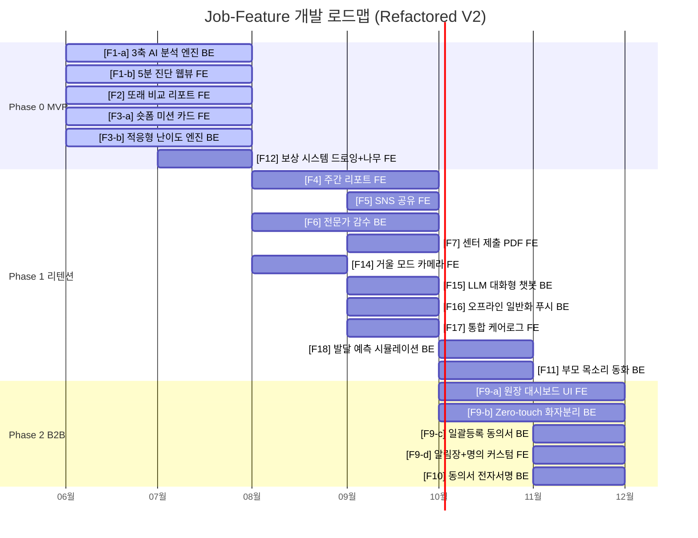

# Job-Feature 매핑 보드 (Enhanced V2) — 경쟁사 UX 인사이트 통합 및 Epic 리팩토링 버전

> **문서 목적**: VPS V08 §4의 기존 Job-Feature 매핑 테이블을 경쟁사 분석(33~36번) 시사점으로 보강하고, 모순점 해결 원칙(37번)을 적용하며, 각 Epic이 **단일 책임(Frontend 또는 Backend)**을 갖도록 리팩토링한 최종 매핑 보드.
> **적용 원칙**: 기능 간 UX 충돌 시 `37_Conflict_Resolution.md`의 4대 해결 방안을 따름.
> **리팩토링 원칙**: 하나의 Epic = "백엔드 한 가지" 또는 "프론트엔드 한 가지". 개발자가 Task로 쪼갤 때 범위가 명확하도록 설계.

---

## 1. 강화된 Job-Feature 매핑 테이블

### 🥇 Phase 0 — MVP 코어 (자원 80% 집중)

| 타겟 | 핵심 Job (해결 과제) | Epic | 단일 책임 | 경쟁사 벤치마킹 기반 구현 가이드 | 모순 해결 |
|:---:|:---|:---|:---:|:---|:---:|
| **Seg A** | 진단 공백 해소 (엔진) | **[F1-a] 3축 AI 음성 분석 엔진** | Backend | **[송앤스타크]** 언어(Linguistic)/조음(Articulation)/음향(Acoustic) 3축 통합 분석. 말더듬·속도·음소 왜곡 교차 분석 Acoustic Metadata 추출. **[에듀템]** 초성/중성/종성 음소별 정밀 채점. 연음/비음화 등 한국어 음운 변동 판독. **[KT]** K-CDI, REVT 등 임상 표준 척도 로직 차용. | — |
| **Seg A** | 진단 공백 해소 (화면) | **[F1-b] 무로그인 5분 진단 웹뷰** | Frontend | **[루먼랩]** "병원 대기 1년, 집에서 5분" 카피로 스크리닝 훅(Hook) 구성. 앱 설치 없이 브라우저에서 즉시 진단 시작. 마찰력 제로화. | — |
| **Seg A** | 불안 해소, 수치화 | **[F2] 또래 비교 및 진단 리포트** | Frontend | **[에듀템]** "마찰음(ㅅ,ㅆ) 또래 대비 3개월 지연" 수준 음소 핀셋 그래프. **[에이치투케이]** 정오답 예측 기반 "다음 주 예상 발달 시뮬레이션" 제공. | ✅ 모순④ B2C는 DTx 톤 |
| **Seg A,C** | 구체적 훈련 (화면) | **[F3-a] 1분 숏폼 미션 카드 UI** | Frontend | **[캐치잇플레이]** 1분 숏폼 게임 세션. 타격감 있는 UI/UX (화면 흔들림, 보상 파티클). **[와우키키]** 전면 카메라 '거울 모드'는 F14로 분리. | ✅ 모순① 중립 캐릭터 진행 ✅ 모순③ 이중 보상 |
| **Seg A,C** | 구체적 훈련 (로직) | **[F3-b] 적응형 난이도 조절 엔진** | Backend | **[에이치투케이]** 실패 시 다이내믹 커리큘럼 우회(Dynamic Routing) 자동 삽입. **[두브레인]** ABA 기반 백그라운드 자동 난이도 조절. 3회 연속 실패 시 UI 티 없이 더 쉬운 단계로 전환. | ✅ 모순③ 은밀한 난이도 |
| **Seg A,C** | 훈련 지속 동기 | **[F12] 게이미피케이션 보상 시스템** | Frontend | **[SKT ZEM]** 발화 성공 시 해당 단어 이미지가 생성되는 AI 드로잉 (즉각 보상). **[마인드허브]** 미션 누적 시 나만의 나무가 자라거나 동물 친구가 늘어나는 성장 UI (누적 보상). → 즉각 보상 + 누적 보상을 **하나의 보상 체계(Reward System)**로 통합 설계. | ✅ 모순③ 이중 보상 |

### 🥈 Phase 1 — 리텐션 및 바이럴 강화

| 타겟 | 핵심 Job (해결 과제) | Epic | 단일 책임 | 경쟁사 벤치마킹 기반 구현 가이드 | 모순 해결 |
|:---:|:---|:---|:---:|:---|:---:|
| **Seg B,C** | 효과 증명, 리텐션 | **[F4] 주간 발달 추이 리포트** | Frontend | **[에듀템]** 음소 단위(초/중/종성) 성장 추적 그래프. "연구개음 상위20%, 마찰음 3개월 지연" 수준 시각화. | ✅ 모순④ DTx 톤 |
| **Seg B** | 성취감, 바이럴 | **[F5] 카카오톡/SNS 공유** | Frontend | 조부모용 성취 뱃지 이미지 제공. 가족 단톡방 바이럴 유도. | — |
| **Seg A,C** | 심리적 안정, 신뢰 | **[F6] 비동기 전문가 코멘트** | Backend | Human-in-the-Loop 감수 대시보드. 언어재활사 비동기 코멘트. | — |
| **Seg C** | 치료사 연계 | **[F7] 센터 제출용 PDF 내보내기** | Frontend | 훈련 궤적 요약본 PDF 출력. | — |
| **Seg A** | 아이 거부감 제거 | **[F11] 부모 목소리 복제 동화** | Backend | **[LGU+]** 부모 음성을 AI가 학습하여 동화 낭독. **교정 훈련에는 적용 금지.** | ✅ 모순① |
| **Seg A,C** | 시각적 교정 보조 | **[F14] 거울 모드 (입 모양 카메라)** | Frontend | **[와우키키]** 전면 카메라를 켜서 아이 입 모양과 캐릭터 입 모양을 나란히 비교하며 발화. | — |
| **Seg A** | 능동적 발화 유도 | **[F15] LLM 대화형 발화 유도 챗봇** | Backend | **[SKT ZEM]** 중립 캐릭터가 "오늘 뭐 먹었어?" 식 개방형 질문으로 자연스러운 긴 발화(조음 데이터) 수집. | ✅ 모순① |
| **Seg A,C** | 앱→일상 전이 | **[F16] 오프라인 일반화 푸시 알림** | Backend | **[뉴다이브]** "오늘 '사과' 성공! 저녁에 사과를 가리키며 칭찬해 주세요" 푸시 전송. | — |
| **Seg C** | 기록 단절 해소 | **[F17] 통합 케어로그 (센터+앱)** | Frontend | **[자람이]** "오늘 센터에서 무슨 치료 받았나요?" 입력란 → AI가 앱+센터 기록 통합 주간 리포트 발행. | — |
| **Seg B** | 구독 연장 트리거 | **[F18] 발달 예측 시뮬레이션** | Backend | **[에이치투케이]** 정오답 패턴 분석 → "다음 주 예상 발달 점수" AI 예측. 구독 연장 및 기대감 형성. | — |

### 🥉 Phase 2 — B2B 스케일업

| 타겟 | 핵심 Job (해결 과제) | Epic | 단일 책임 | 경쟁사 벤치마킹 기반 구현 가이드 | 모순 해결 |
|:---:|:---|:---|:---:|:---|:---:|
| **Seg D-1** | 기관 신뢰도 (화면) | **[F9-a] 원장용 대시보드 UI** | Frontend | **[자란다]** 리포트 헤더를 '○○어린이집 원장 명의'로 커스터마이징. 민원 방어 훈장 역할. | ✅ 모순④ 오피스 툴 톤 |
| **Seg D-2** | 교사 업무 제로화 | **[F9-b] Zero-touch 화자분리 수집** | Backend | **[째깍악어]** 교실에 태블릿 켜두기만 하면 화자 분리 알고리즘으로 아이 음성만 파싱. **[KT]** 성인/아동 Speaker Diarization 알고리즘 필수 명시. 교사는 AI가 자동 생성한 태그/알림장 텍스트를 [발송 승인]만 누름. | ✅ 모순② |
| **Seg D-1** | 행정 편의 | **[F9-c] 원아 일괄등록 및 동의서 발송** | Backend/API | 원아 일괄 업로드 시 학부모에게 데이터 수집 동의서 자동 전송. 행정력 낭비 제로. | — |
| **Seg D-1** | 학부모 상담 지원 | **[F9-d] AI 쿠션어 알림장 + 명의 커스터마이징** | Frontend | **[키즈노트]** [알림장 복사] 버튼 → "00이가 마찰음만 조금 더 연습하면 완벽해요~" 쿠션어 초안 자동 생성. **[윙스]** 클릭 한 번에 키즈노트 포맷 변환·전송 API 연동. | ✅ 모순④ |
| **Seg D-1** | 도입 허들 최소화 | **[F10] 학부모 동의서 자동 생성/서명** | Backend/API | 카카오톡 연동 전자 서명. B2B 리포트 하단 [상세 결과 보기 → 앱 다운로드] B2C 퍼널 강제 유도. | — |

---

## 2. 리팩토링 요약

### 분리된 Epic (복잡도 해소)

| 기존 Epic | 문제점 | 리팩토링 결과 |
|:---|:---|:---|
| F1 (AI 음성 진단) | Backend AI 엔진 + Frontend 웹뷰가 혼재 | **F1-a** (Backend 엔진) + **F1-b** (Frontend 웹뷰) |
| F3 (맞춤 미션) | 숏폼 UI + 적응형 난이도 알고리즘 혼재 | **F3-a** (Frontend 미션 UI) + **F3-b** (Backend 난이도 엔진) |
| F9 (원장 대시보드) | 대시보드 UI + 화자분리 + 일괄등록 + 알림장 혼재 | **F9-a** (Frontend UI) + **F9-b** (Backend 화자분리) + **F9-c** (Backend 등록/동의) + **F9-d** (Frontend 알림장) |

### 병합된 Epic (중복 제거)

| 기존 Epic | 병합 근거 | 리팩토링 결과 |
|:---|:---|:---|
| F12 (AI 드로잉) + F13 (나만의 나무) | 둘 다 보상 시스템. 동일 프론트엔드 담당자가 일관된 보상 체계를 설계해야 함 | **F12** (게이미피케이션 보상 시스템 통합) |
| F19 (AI 쿠션어) + F20 (원장 명의) | 둘 다 F9 대시보드 내부에서 동작. 독립 시 의존성 복잡 | **F9-d** (대시보드 서브피처로 병합) |

---

## 3. 적용된 모순 해결 원칙 요약 (Quick Reference)

| # | 모순 주제 | 해결 원칙 | 적용 Epic |
|:---:|:---|:---|:---|
| ① | 부모 목소리 vs 캐릭터 | 일방향 콘텐츠(동화)만 부모 목소리. **교정 훈련은 중립 캐릭터** | F3-a, F11, F15 |
| ② | Zero-touch vs 체크박스 | 데이터 Input은 100% 마이크. **교사는 승인만** | F9-b |
| ③ | 은밀한 난이도 vs 강한 보상 | 모든 시도→작은 보상. **완벽 성공→큰 보상 (이중 보상)** | F3-a, F3-b, F12 |
| ④ | 임상적 권위 vs 행정 편의 | **B2C 앱은 DTx 톤, B2B 대시보드는 오피스 툴 톤** | F2, F4, F9-a, F9-d |

---

## 4. 종합 기능 우선순위 로드맵 (리팩토링 후)

---

## 5. 신규 Epic 도출 근거 매핑 (경쟁사 → Epic 추적표)

| 경쟁사 분석 문서 | 벤치마킹 대상 | 도출된 시사점 | 매핑된 Epic |
|:---|:---|:---|:---:|
| 33번 (통신 3사) | LGU+ 아이들나라 | 부모 목소리 복제 동화 | **F11** |
| 33번 (통신 3사) | SKT ZEM AI 드로잉 | 발화 성공 시 생성형 이미지 보상 | **F12** (즉각 보상) |
| 33번 (통신 3사) | SKT ZEM 독후 활동 | LLM 기반 개방형 질문 챗봇 | **F15** |
| 33번 (통신 3사) | KT 키즈랜드 | 성인/아동 화자 분리 | **F9-b** 강화 |
| 33번 (통신 3사) | KT 스콜라스틱 | 임상 표준 척도 레벨링 | **F1-a** 강화 |
| 34번 (에듀테크) | 와우키키 하이동동 | 입 모양 멀티모달 피드백 | **F14** |
| 34번 (에듀테크) | 에이치투케이 소중한글 | 정오답 예측 기반 발달 시뮬레이션 | **F18** |
| 34번 (에듀테크) | 캐치잇플레이 | 숏폼 게이미피케이션 | **F3-a** 강화 |
| 34번 (에듀테크) | 에듀템 ELA | 음소 단위 정밀 분석 | **F1-a** 강화 |
| 34번 (에듀테크) | 윙스 말이랑 | 기관-가정 Seamless 연결 | **F9-d** 강화 |
| 35번 (DTx) | 마인드허브 제니코그 | 시각적 자아 효능감 (나무 성장) | **F12** (누적 보상) |
| 35번 (DTx) | 뉴다이브 버디인 | 오프라인 일반화 푸시 알림 | **F16** |
| 35번 (DTx) | 드림에이아이랩 자람이 | 센터+앱 통합 케어로그 | **F17** |
| 35번 (DTx) | 두브레인 두부팡 | ABA 기반 은밀한 난이도 조절 | **F3-b** 강화 |
| 35번 (DTx) | 루먼랩 | 초조기 스크리닝 훅 | **F1-b** 강화 |
| 36번 (B2B2C) | 키즈노트, 째깍악어 | AI 쿠션어 알림장 자동 생성 | **F9-d** |
| 36번 (B2B2C) | 자란다 방문일지 | 원장 명의 리포트 커스터마이징 | **F9-d** |
| 36번 (B2B2C) | 째깍악어 | 교사 Zero-touch | **F9-b** 강화 |

---

## 6. Epic 총괄 카운트

| Phase | Epic 수 | Backend | Frontend |
|:---:|:---:|:---:|:---:|
| **Phase 0 (MVP)** | 6개 | F1-a, F3-b | F1-b, F2, F3-a, F12 |
| **Phase 1 (리텐션)** | 10개 | F6, F11, F15, F16, F18 | F4, F5, F7, F14, F17 |
| **Phase 2 (B2B)** | 5개 | F9-b, F9-c, F10 | F9-a, F9-d |
| **합계** | **21개** | **10개** | **11개** |

> **본 문서는 VPS V08 §4를 경쟁사 분석 4건(33~36번)으로 강화하고, 모순 해결 원칙(37번)을 적용하며, 각 Epic이 단일 책임(BE 또는 FE)을 갖도록 리팩토링한 최종 버전입니다. 14개 경쟁사에서 도출된 18개 시사점이 21개 Epic으로 빠짐없이 매핑되었습니다.**
