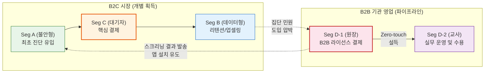
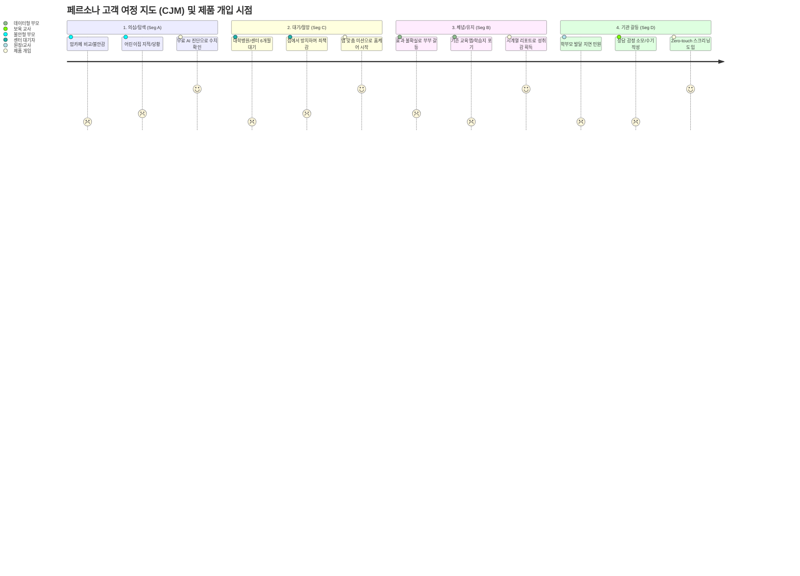
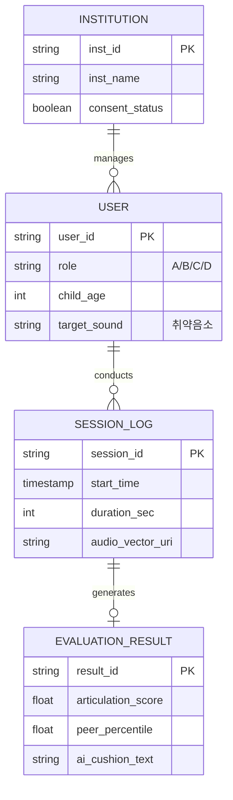

# Home Language Coaching Platform (가칭: 홈랭귀지 코칭) PRD v0.1
- **Owner 팀:** Product Strategy & Planning Team
- **최종 업데이트:** 2026-05-06

---

## 1. 개요·목표

**1.1 문제 정의 (Pain & Needs)**
*   **[Pain 1] 진단 기준 부재에 따른 부모 불안과 높은 유입 장벽**
    *   *현상*: 기존 사설 치료 앱이나 오프라인 센터는 비싼 초기 비용과 긴 대기 기간으로 인해 진입 장벽이 높음.
    *   *실패 KPI*: 기존 에듀테크/치료 앱의 초기 가입 전환율(CVR) **3% 미만**, 오프라인 센터 대기 기간 **평균 3~6개월 (골든타임 허비)**.
*   **[Pain 2] 홈케어 지속 동력 부족 및 B2B 현장의 높은 업무 과중**
    *   *현상*: 부모는 성과를 체감하지 못해 쉽게 포기하고, 보육 교사는 발달 지연 아동 진단/상담 시 막대한 감정적·시간적 업무에 시달림.
    *   *실패 KPI*: 기존 홈케어 솔루션의 1개월 내 이탈률 **80% 이상**, 교사 수기 관찰일지 작성 시간 **주 3시간 이상**.

**1.2 목표 (Desired Outcome)**
*   **[B2C 유입]** "초저비용 마케팅 채널 확보": 맘카페 자발적 바이럴을 유도하여 마케팅 유입 단가(CAC)를 기존 10만 원에서 **3만 원 이하로 70% 절감**한다.
*   **[B2C 유지]** "노력의 시각화": 시계열 발달 리포트를 통해 기존 앱들의 1개월 내 이탈률(80%)을 방어하고, **3개월 차(M3) 리텐션을 40% 이상으로 유지**한다.
*   **[B2B2C 확장]** "Zero-touch 기관 도입": 교사 업무를 0시간으로 만든 시스템을 바탕으로, 1년 내 **초기 유효 결제 유저 12,000가구(SOM)를 달성**한다.

**1.3 성공 지표 (KPIs)**
*   **북극성 KPI (North Star)**:
    *   **유효 구독 전환율 (Conversion Rate)**: 기준선 3% → **목표값 8% 이상** (측정 주기: 주간)
    *   **M3 (3개월 차) 리텐션 유지율**: 기준선 20% → **목표값 40% 이상** (측정 주기: 월간)
*   **보조 KPI (Secondary)**:
    *   **고객 획득 비용 (CAC)**: 기준선 100,000원 → **목표값 30,000원 이하** (측정 주기: 주간)
    *   **B2B 무료 대시보드 시범 도입 수락률**: 기준선 콜드콜 2% 미만 → **목표값 20% 이상** (측정 주기: 분기)

---

## 2. 사용자와 페르소나

*   **[Seg A] 불안형 탐색자 (B2C 핵심 유입)**
    *   *상황*: 아이의 발음이 또래보다 뒤처지는 것 같아 매일 밤 맘카페를 서성임.
    *   *Needs*: 즉각적인 불안 해소 수단 (무료 AI 진단).
*   **[Seg C] 센터 대기자 (B2C 핵심 결제자)**
    *   *상황*: 오프라인 센터 대기표를 뽑고 3개월째 집에서 방치 중이며 죄책감을 느낌.
    *   *Needs*: 대기 기간 중 집에서 체계적으로 할 수 있는 훈련 프로그램과 센터 제출용 리포트.
*   **[Seg B] 데이터형 개입자 (B2C 리텐션 주도)**
    *   *상황*: 현재 하고 있는 훈련의 성과가 눈에 보이지 않아 남편/조부모에게 양육 성취를 증명하기 어려움.
    *   *Needs*: "62% → 71%"와 같이 시각화된 시계열 데이터 발달 리포트.
*   **[Seg D-1] 유치원 원장 (B2B 결제권자)**
    *   *상황*: 학부모의 발달 관련 민원과 원아 연쇄 퇴소를 선제적으로 방어하고 싶음.
    *   *Needs*: 민원 방어 및 프리미엄 브랜딩을 위한 공신력 있는 기관용 스크리닝 대시보드.
*   **[Seg D-2] 보육 교사 (B2B 게이트키퍼)**
    *   *상황*: 발달 지연 아이의 학부모와 상담 시 감정 소모가 크며, 행정 업무에 짓눌려 있음.
    *   *Needs*: 학부모를 부드럽게 설득할 객관적 리포트(쿠션어)를 원하지만, 내 업무 시간은 단 1초도 늘어나서는 안 됨 (Zero-touch).

### 2.1 페르소나 영향력 및 B2B2C 확장 관계 (DMU Dynamics)

*   **관계 핵심**: B2C(Seg A/C/B)에서의 성공적인 검증과 학부모 연대의 압박이 원장(Seg D-1)의 방어적 B2B 결제를 유도하며, 이는 다시 기관 전체 원아 학부모(Seg A)의 대량 획득 파이프라인으로 순환되는 플라이휠 구조. 교사(D-2)는 이 흐름을 거부할 수 있는 단독 거부권(Gatekeeper)을 가지므로 Zero-touch 환경 보장이 필수.

### 2.2 CJM 기반 페르소나 여정 단계 및 제품 개입 (Intervention) 전략

고객 여정(CJM)의 각 단계에서 페르소나가 겪는 극단적인 Pain Point를 파악하고, 우리 제품이 어느 시점에 개입하여 흐름을 반전시키는지 정의합니다.

#### 1) B2B2C 페르소나 고객 여정 단계 다이어그램

#### 2) 여정 단계별 Pain·Needs 상세 및 제품 개입 관계망

| 여정 단계 | 핵심 페르소나 | 고객의 구체적 Pain Point (CJM) | 미충족 Needs | 제품 개입 시점 및 해결책 (Intervention) |
|:---:|:---|:---|:---|:---|
| **1단계: 의심/탐색** | **Seg A** (불안형) | "맘카페를 뒤질수록 우리 아이만 뒤처진 것 같아 미칠 듯이 불안함." (오프라인 예약은 엄두도 안 남) | "당장 지금 내 아이의 정확한 발달 위치만이라도 숫자로 알고 싶다." | **[개입] F1-a/b 무료 진단 웹뷰** 맘카페 내 링크 클릭 즉시 5분 만에 진단 완료 및 백분위 수치 제공. |
| **2단계: 대기/절망** | **Seg C** (대기자) | "센터 대기표를 뽑았지만 앞으로 6개월간 집에서 아무것도 못 해준다는 죄책감이 극심함." | "전문가를 만나기 전까지 집에서 매일 할 수 있는 검증된 훈련법이 필요하다." | **[개입] F3-a/b 적응형 숏폼 미션** 아이 수준에 맞춘 일일 5분 숏폼 미션을 제공하여 골든타임 허비를 방어함. |
| **3단계: 체념/유지** | **Seg B** (데이터형) | "홈케어를 1달째 하고 있지만 정말 좋아지는 건지 확신이 없고 남편은 쓸데없는 돈 쓴다며 핀잔을 줌." | "과거 대비 지금 얼마나 좋아졌는지 객관적인 수치로 증명하여 가족에게 인정받고 싶다." | **[개입] F4 시계열 발달 리포트** 62점→71점 식의 정밀한 추이 그래프를 가족에게 카카오톡(F5)으로 공유하게 함. |
| **4단계: 기관 갈등** | **Seg D-1/2** (원장/교사) | "학부모가 '어린이집에서 신경 안 써서 늦어졌다'며 민원을 넣고, 교사는 발달 상담 시 감정 소모가 극심함." | "학부모를 객관적으로 설득할 증거가 필요하되, 교사의 추가 업무는 0초여야 한다." | **[개입] F9 Zero-touch 대시보드** 교실 내 자동 수집/분석을 통해 원장 명의의 AI 쿠션어 리포트를 학부모에게 자동 발송함. |

---

## 3. 사용자 스토리와 수용 기준 (Acceptance Criteria, AC)

**3.1 Story 1: 5분 무료 진단 (Seg A 타겟)**
> **As a** 불안형 부모(Seg A), **I want** 병원 방문이나 회원가입 절차 없이 즉시 아이의 음성 진단을 수행하고 싶다, **so that** 아이의 발달 수준이 정상 범위 내에 있는지 수치로 즉각 확인하여 불안감을 잠재울 수 있다.

*   **AC 1 [완수 속도]**: **Given** 랜딩 페이지 진입 시 **When** '진단 시작'을 누르면 **Then** 입력 폼은 최대 3개 항목(성별/연령) 이내여야 하며, 총 소요 시간은 **5분(300초) 이하**여야 한다.
*   **AC 2 [인식 정확도]**: **Given** 아이가 앱에 대고 발화할 때 **When** 유아 특유의 부정확한 발음이 입력되더라도 **Then** NLP/STT 모듈의 타임아웃 및 처리 실패율이 **2% 미만**이어야 한다.
*   **AC 3 [결과 렌더링]**: **Given** 모든 진단 세션이 완료되었을 때 **When** 결과 페이지로 이동 시 **Then** 서버 데이터 분석 및 또래 백분위 차트 렌더링 응답 시간이 **1.5초(1500ms) 이하**여야 한다.

**3.2 Story 2: 적응형 미션 훈련 (Seg C 타겟)**
> **As a** 센터 대기자(Seg C), **I want** 내 아이의 수준에 맞춰 매일 1분 분량의 훈련 미션을 수행하게 하고 싶다, **so that** 골든타임을 방치하지 않고 아이의 흥미와 동력을 유지할 수 있다.

*   **AC 1 [이탈률 통제]**: **Given** 데일리 미션 카드 시작 시 **When** 아이가 플레이할 때 **Then** 한 세션의 길이는 1~3분을 넘지 않으며, 도중 이탈률(Drop-off rate)이 **10% 미만**이어야 한다.
*   **AC 2 [은밀한 난이도 조절]**: **Given** 아이가 특정 발화 미션에서 3회 연속 실패할 때 **When** 백엔드에서 난이도를 하향 조정하면 **Then** 화면에 명시적인 X표시나 에러음이 출력되지 않고(실패 피드백 노출 **0회**), 즉시 더 쉬운 레벨로 자연스럽게 전환되어야 한다.
*   **AC 3 [즉각적 보상]**: **Given** 아이가 발화 미션을 성공했을 때 **When** AI 드로잉 등 보상 이펙트가 호출되면 **Then** 로딩 지연 시간 **0.5초(500ms) 이내**에 화면에 출력되어 타격감을 보장해야 한다.

**3.3 Story 3: Zero-touch 수집 및 알림장 (Seg D-2 타겟)**
> **As a** 보육 교사(Seg D-2), **I want** 내가 직접 태블릿을 조작하거나 아이를 통제하지 않아도 아이들의 발성 데이터가 자동 수집되길 원한다, **so that** 행정 업무 가중 없이 객관적인 AI 알림장 초안을 받아 학부모 상담에 활용할 수 있다.

*   **AC 1 [업무 제로화]**: **Given** 자유놀이 시간에 태블릿 앱을 켜두었을 때 **When** 음성 수집이 진행되는 동안 **Then** 교사가 개별 아동을 통제하기 위해 화면을 직접 터치/클릭해야 하는 횟수가 **0회**여야 한다 (패시브 수집 모드 정상 작동).
*   **AC 2 [화자 분리 신뢰도]**: **Given** 10인 이상이 있는 교실(약 60dB 소음)에서 **When** 화자 분리(Speaker Diarization)가 실행될 때 **Then** 성인(교사)과 타겟 아동의 음성 분리 정확도가 **85% 이상**이어야 한다.
*   **AC 3 [쿠션어 품질]**: **Given** 수집된 데이터를 바탕으로 AI가 키즈노트 전송용 알림장 초안을 작성할 때 **When** 교사가 검토하면 **Then** 수정 없이 '발송 승인'만 누르고 전송되는 비율이 **90% 이상**이어야 한다.

**3.4 Story 4: 시각화된 발달 추적 리포트 (Seg B 타겟 - Phase 1)**
> **As a** 데이터형 부모(Seg B), **I want** 아이의 주 단위 발달 성과를 구체적인 수치와 그래프로 확인하고 가족과 공유하고 싶다, **so that** 홈케어의 효과를 확신하고 양육 성취감을 나누며 훈련을 지속할 수 있다.

*   **AC 1 [데이터 정밀도]**: **Given** 주간 훈련이 완료된 후 **When** 발달 리포트가 생성될 때 **Then** 단순 정오답이 아닌 음소 단위(초/중/종성) 점수가 백분위 기반 꺾은선 그래프로 시각화되어야 한다.
*   **AC 2 [공유 마찰 제로]**: **Given** 성취 뱃지를 획득했을 때 **When** 공유 버튼을 클릭하면 **Then** 단 1번의 탭(Click)만으로 카카오톡에 최적화된 이미지 템플릿으로 전송되어야 한다.
*   **AC 3 [구독 연장 트리거]**: **Given** 리포트 최하단 도달 시 **When** '다음 달 예측 시뮬레이션' 버튼이 노출되면 **Then** 이를 클릭한 유저의 익월 결제 유지율(Retention)이 클릭하지 않은 유저 대비 **20%p 이상** 높아야 한다.

**3.5 Story 5: 기관용 스크리닝 대시보드 (Seg D-1 타겟 - Phase 2)**
> **As a** 유치원 원장(Seg D-1), **I want** 우리 원 아이들의 전체 발달 스크리닝 결과를 한눈에 보고 학부모에게 내 명의의 결과지를 보내고 싶다, **so that** 학부모의 발달 관련 민원을 선제적으로 방어하고 프리미엄 기관으로 브랜딩할 수 있다.

*   **AC 1 [일괄 등록 속도]**: **Given** 100명의 원아 명단 엑셀을 업로드할 때 **When** 파싱 및 시스템 등록을 수행하면 **Then** **3초(3000ms) 이내**에 처리 완료 및 데이터 검증이 끝나야 한다.
*   **AC 2 [UI 커스터마이징]**: **Given** 학부모용 리포트 발송 전 **When** '원장 명의 커스텀' 옵션을 활성화하면 **Then** 리포트 상단 헤더에 기관명과 원장 로고가 **1초 이내**에 즉시 반영되어 프리뷰로 표시되어야 한다.
*   **AC 3 [동의서 전환율]**: **Given** 부모에게 발달 검사 동의서를 카카오톡 알림톡으로 전송했을 때 **When** 부모가 열람하면 **Then** 모바일 환경에서의 전자 서명 완료율이 **85% 이상**이어야 한다.

**3.6 Story 6: 전문가 비동기 감수 시스템 (Seg A/C 타겟 - Phase 1)**
> **As a** 구독 결제 학부모(Seg A/C), **I want** AI의 1차 결과에 더해 실제 언어재활사의 피드백 코멘트를 받아보고 싶다, **so that** AI 오진에 대한 불안을 지우고 진단 결과를 100% 신뢰할 수 있다.

*   **AC 1 [전문가 개입 조건]**: **Given** AI 진단 결과의 신뢰도 스코어(Confidence Score)가 기준치 미달이거나 **When** 부모가 '이의 제기' 버튼을 누를 경우 **Then** 즉시 'Human-in-the-loop' 대기열로 해당 세션 오디오가 이관되어야 한다.
*   **AC 2 [SLA 보장]**: **Given** 전문가 대기열에 등록된 건에 대해 **When** 언어재활사가 코멘트 작성을 할당받으면 **Then** 영업일 기준 **48시간 이내**에 100% 피드백 작성이 완료되어야 한다.
*   **AC 3 [오류율 통제]**: **Given** 월간 전체 진단 건수 중 **When** 치명적 오진으로 분류되어 전문가가 결과를 뒤집은(수정한) 비율이 **Then** 전체 건수의 **0.5% 미만**으로 통제되어야 한다.

---

## 4. 기능 요구사항 (Functional Requirements - MSCW)

| 구분 | Epic/Feature | 구현 논리 및 차별적 가치 (Differential Value) |
|:---:|:---|:---|
| **Must** (Phase 0) | **[F1-a/b] 3축 AI 진단 엔진 & 웹뷰** | 기존 앱(회원가입 후 결제해야 진단) 대비 마찰력을 100% 제거. **CAC를 기존 10만 원대에서 0원에 가깝게 하향**. |
| **Must** (Phase 0) | **[F3-a/b] 숏폼 미션 및 적응형 엔진** | 기존 센터(주 1~2회 40분) 대비 **일일 5분 고빈도 인터랙션** 달성. 실패 좌절감을 방지하는 자동 우회 커리큘럼. |
| **Must** (Phase 0) | **[F12] 게이미피케이션 통합 보상** | AI 이미지 생성 지연 시간을 1초 미만으로 단축하여 기존 학습 앱의 단조로운 스탬프 보상 대비 몰입도 향상. |
| **Should** (Phase 1) | **[F4] 주간 발달 추이 그래프** | 단순 정성 피드백이 아닌 "62% → 71%" 수치화. 기존 오프라인 관찰일지 대비 **데이터 정밀도 2배 향상**. |
| **Should** (Phase 1) | **[F6] 비동기 전문가 코멘트** | AI 100% 자동화의 법적/신뢰 리스크 방어. 전문가 실시간 대면(회당 5만원) 대비 **비용 80% 절감(월 구독형)**. |
| **Should** (Phase 2) | **[F9-b] Zero-touch 화자분리 수집** | 교사가 직접 수기 입력하던 시간(주 3시간)을 **0시간**으로 감축. (경쟁사 대비 가장 압도적 B2B 차별화) |
| **Should** (Phase 2) | **[F9-d] AI 쿠션어 알림장 전송** | 키즈노트/카카오톡 API 다이렉트 연동으로 상담 행정 편의성 극대화. |
| **Could** (Post-MVP)| **[F11/F15] 부모 목소리 동화 / LLM 챗봇**| 흥미 유도 보조 수단이나 MVP 핵심 가설 검증에는 필수적이지 않음. |

---

## 5. 비기능 요구사항 (Non-Functional Requirements)

*   **[성능]**
    *   진단 및 분석 리포트 API 응답 시간: **p95 ≤ 800ms**.
    *   오디오 스트리밍 및 STT 청크(Chunk) 전송 지연 시간: **≤ 300ms** (실시간 인터랙션 보장).
*   **[신뢰성 및 가용성]**
    *   서비스 가용성(Uptime): **월간 99.9% 이상**.
    *   오디오 파일 인코딩 및 처리 오류율: **≤ 0.5%**.
*   **[보안 및 개인정보]**
    *   영유아 음성 데이터는 분석 직후 벡터 데이터로만 저장되며, **원본 오디오 파일은 7일 이내 자동 폐기** (개인정보보호법 준수).
    *   B2B 기관 연결 시 학부모 사전 법정대리인 전자서명 데이터 베이스 암호화(AES-256) 보관 필수.
*   **[모니터링 항목]**
    *   *로그/대시보드*: Phase 0 런칭 시 유저 퍼널(웹뷰 접속 → 진단 시작 → 완료 → 결과지 뷰 → 유료 전환) 전환율 대시보드 필수 세팅.
    *   *알림*: STT 분석 엔진 실패율이 5분 내 3% 초과 시 Slack/Teams 개발팀 자동 Alert 발송.

---

## 6. 데이터·인터페이스 개요

*   **핵심 인터페이스 (API)**:
    *   **STT/NLP Engine (Internal)**: [Input] Audio Stream (16kHz, Mono) → [Output] JSON (음소별 정답도, TTR, 발화 지연시간).
    *   **키즈노트/알림장 연동 (External)**: [Input] Evaluation JSON & User Auth → [Output] 3rd Party Webhook URL (성공 200 OK).

---

## 7. 범위(In/Out), 리스크·가정·의존성

*   **범위 명시 (Scope)**
    *   **In-Scope**: 비의료적(교육/코칭 목적) 언어 발달 스크리닝, 발음 교정 미션, B2B 대시보드 알림장 초안 생성.
    *   **Out-of-Scope**: "언어 지연 장애 판정" 등 공식 의료 행위(DTx 인허가 대상), 전문가와의 1:1 실시간 화상 진료 시스템(Telemedicine).
*   **리스크 (Risks)**
    1.  **AI 오진에 따른 의료법 위반 리스크**: *대응 방안* - 앱 내 모든 진단 및 리포트 화면 진입 시 "본 서비스는 훈련 및 참고용이며 의료적 진단이 아님"을 명시하는 Disclaimer 팝업 강제 노출.
    2.  **보육 현장의 마이크 수집 환경 변수 (소음)**: *대응 방안* - 노이즈 캔슬링 및 성인/아동 화자 분리 알고리즘 고도화 우선 투자.
    3.  **외부 플랫폼 의존성 리스크**: 키즈노트 등 서드파티 알림장 플랫폼의 외부 API 정책 변경 시 전송 불가. *대응 방안* - 카카오톡 알림톡 및 PDF 자체 링크 다운로드 기능 병행(Fallback) 구현.
*   **핵심 가정 (Assumptions)**
    *   학부모(Seg A, C)는 오프라인 센터 상담(1회 5만 원) 대비 월 3.5만 원의 구독료를 저항 없이 수용할 것이다.

---

## 8. 실험·롤아웃·측정

*   **실험 가설 (A/B Test)**: 진단 완료 후 결과지를 보여주기 전, **[장애 여부에 대한 경고(DTx 톤)]** 보다 **[상위 N%라는 백분위 위안(Coaching 톤)]**을 제시했을 때 유료 결제 전환율(CVR)이 더 높을 것이다.
*   **측정 계획 (베타 채널)**:
    *   *대상*: 맘카페 제휴 인플루언서를 통해 유입된 초기 테스터 500명 (n=500).
    *   *측정 기준*: 톤앤매너 A군 vs B군의 CVR 차이 분석, 평균 세션 체류 시간(ms).
*   **경쟁 벤치마크 (Roll-out)**:
    *   초기 런칭 시 경쟁사(에듀템, 에이치투케이)의 일반적 리텐션 벤치마크인 D30 20%를 넘어서는 **D30 40%** 달성을 최우선 목표로 롤아웃 트래킹 진행.

---

## 9. 근거 (Proof Links)

*   [1. JTBD 심층 분석 보고서 및 Switch Trigger 검증]
*   [2. TAM-SAM-SOM 시장 기회 분석 및 AOS 매트릭스]
*   [3. B2B 유치원 원장/교사 현장 Pain Point 관찰일지 (Zero-touch 근거)]
*   [4. 법적 규제 분석 및 의료기기 우회 검토서 (Disclaimer 근거)]
*   (※ 상세 파일은 *Speech-Therapy-From-Analysis-to-VPS* 저장소 내 26개 사전 분석 문서 참조)
