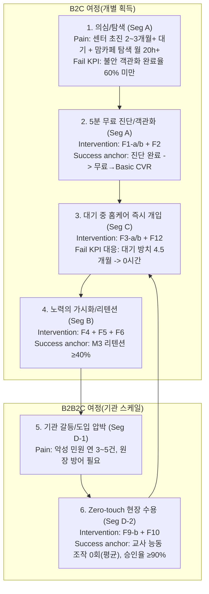
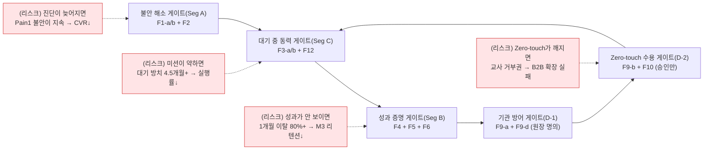
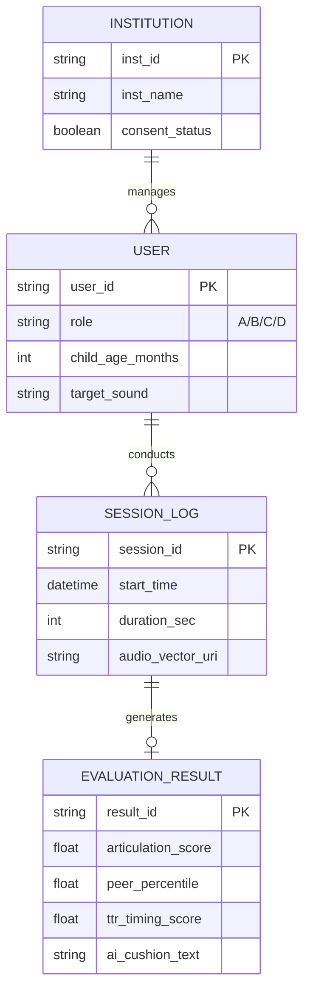

# Home Language Coaching Platform (가칭: 홈랭귀지 코칭) PRD v0.2
- Owner 팀: Product Strategy & Planning Team
- 최종 업데이트: 2026-05-06

## 1. 개요·목표
- 문제 정의(Pain지표 포함):
  - Pain 1. 진단 기준 부재로 인한 불안/장벽
    - 실패 KPI: 맘카페 정보 탐색 시간 `월 20시간+` 지속, 오프라인 초진 대기 `2~3개월+` 지속, 5분 내 객관화(백분위) `완료율 60% 미만`
    - Needs: 회원가입/병원 대기 없이 `즉시(≤5분)` 아이의 발달 위치를 `동년배 백분위`로 보여주는 객관화
  - Pain 2. 골든타임 증발(대기 중 방치)
    - 실패 KPI: 언어 지연 방치 기간 `평균 4.5개월` 이상, 센터 대기자에서 `대기 중 홈케어 실행률 50% 미만`
    - Needs: 대기 기간 동안 `집에서 매일 1분 내외`로 훈련 미션을 이어가게 하는 동력
  - Pain 3. 홈케어 비표준화(성과 증명 불가)
    - 실패 KPI: 기존 홈케어 `1개월 내 이탈률 80% 이상`, 주간 리포트 `열람률 40% 미만`
    - Needs: 주간 단위로 `62점→71점`과 같은 시계열 성과를 수치/그래프로 보여줘 지속하게 하는 성취 가시화
  - Pain 4. 치료 권유 딜레마(B2B 갈등/업무 과중)
    - 실패 KPI: 학부모 민원 `연 3~5건` 이상, 보육 교사 수기 관찰/상담 보조 `주 3시간+` 발생, Zero-touch 승인율 `90% 미만`
    - Needs: 교사 업무를 제로화하고(Zero-touch), 원장 명의로 기관용 스크리닝 리포트를 발송해 민원을 방어

- 목표(Desired Outcome 수치화):
  - Desired Outcome O-1. 5분 내 객관적 진단 수치화
    - 기준선: 오프라인 초진 리드타임 `최소 2~3개월`, 맘카페 탐색 `월 20시간+`
    - 목표값: 리드타임 `≤5분`, 탐색 시간 `월 0~2시간`
  - Desired Outcome O-2. 대기 기간 중 즉시 홈케어 진입
    - 기준선: 대기 중 방치 `평균 4.5개월`
    - 목표값: 방치 기간 `0시간(즉시 개입)` 및 첫 주 미션 완료율 `≥70%`
  - Desired Outcome O-3. 노력의 가시화로 리텐션 강화
    - 기준선: 기존 솔루션 `1개월 내 이탈률 80%`
    - 목표값: `M3 리텐션 유지율 ≥40%`, 주간 리포트 열람률 `≥60%`
  - Desired Outcome O-4. 기관 도입의 Zero-touch 통과
    - 기준선: 교사 수기 업무 `주 3시간+`, 민원 `연 3~5건`
    - 목표값: 교사 능동 조작 `0회(평균)` 및 민원 `0건(파일럿 기준)`, 원장 대시보드 수락률 `≥20%`

- 성공 지표(북극성/보조 KPI):
  - 북극성 KPI (North Star)
    - `M3 리텐션 유지율(유효 구독자)` : 기준선 `20%` → 목표값 `≥40%`
    - 측정 주기: `월간(매월 M3 코호트)` / 정의: M3 시점에도 유효 결제(또는 Basic 이상 유지)
  - 보조 KPI (Secondary)
    - `유효 구독 전환율(무료 → Basic)` : 기준선 `3% 미만` → 목표값 `≥8%` (측정 주기: `주간`)
    - `CAC(유료 전환 비용)` : 기준선 `100,000원` → 목표값 `≤30,000원` (측정 주기: `주간`)
    - `대기자 대기 중 실행률` : 기준선 `≤50%` → 목표값 `≥70%` (측정 주기: `주간`)
    - `교사 Zero-touch 승인율(발송 승인만)` : 목표값 `≥90%` (측정 주기: `PoC 종료 시`)
    - `오진 치명 수정률(HITL 뒤집힘)` : 목표값 `<0.5%` (측정 주기: `월간`)

- 차별 가치(Differential Value):
  - 성능(시간): “객관 백분위 확인”까지 `오프라인 2~3개월+ → 우리 서비스 ≤5분` (시간 to value `최소 1,000배 수준` 단축)
  - 비용(경제성): 오프라인 1회 비용 `5~8만원` 대비 우리 `Basic 월 3.5만원` (오프라인 대비 `30~56% 비용 절감`, 주간 미션/리포트 포함)
  - 비용/업무(마찰 제거): 보육 교사 수기 관찰/보조 `주 3시간+ → Zero-touch 평균 0회` (현장 업무 마찰 `사실상 100% 제거`)

## 2. 사용자와 페르소나
- 핵심 페르소나 요약 및 여정 Pain·Needs 링크
  - Seg A. 불안형 탐색자(엄마, B2C)
    - 여정 핵심: “기준 없음 불안” → “5분 객관화” (Pain 1)
    - 링크: Story S1, AC-1~3
  - Seg C. 센터 대기자(엄마, B2C)
    - 여정 핵심: “대기 중 방치/죄책감” → “대기 기간 즉시 홈케어” (Pain 2)
    - 링크: Story S2, AC-1~3
  - Seg B. 데이터형 개입자(아빠/조부모, B2C 유지)
    - 여정 핵심: “성과 불확실” → “주간 시계열 성과” (Pain 3)
    - 링크: Story S3, AC-1~3
  - Seg D-1. 유치원/어린이집 원장(결제자, B2B2C)
    - 여정 핵심: “민원 방어/프리미엄 브랜딩” → “기관용 스크리닝 리포트” (Pain 4)
    - 링크: Story S4, AC-1~3
  - Seg D-2. 보육/담임 교사(게이트키퍼, B2B2C)
    - 여정 핵심: “업무 과중/감정 소모” → “Zero-touch 수집+승인만” (Pain 4)
    - 링크: Story S5, AC-1~3

### 2.1 페르소나 CJM 단계별 Pain·Needs ↔ 제품 개입 매핑
아래 매핑은 `39_VPS_V09_final_UX_reinforce.md`의 CJM 단계(의심/탐색 → 대기/절망 → 체념/유지 → 기관 갈등)와, 본 PRD의 `Pain/Needs(실패 KPI)` 및 `Epic(제품 개입)`을 1:1로 연결한 것입니다.

| CJM 단계 | 핵심 페르소나 | Pain(실패 KPI) | Needs(사용자 목표) | 제품 개입(Epic) | 성공 지표 연결 |
|---|---|---|---|---|---|
| 1) 의심/탐색 | Seg A(불안형 엄마) | Pain1: 맘카페 탐색 `월 20h+`, 오프라인 초진 대기 `2~3개월+`, 객관화 완료율 `60% 미만` | 병원/회원 마찰 없이 `≤5분` 내 동년배 백분위로 불안 완화 | `F1-a/b`(5분 무로그인 진단) + `F2`(또래 비교/진단 리포트) | 무료→Basic CVR `≥8%`, 진단 완료율(목표치 별도) |
| 2) 대기/절망 | Seg C(센터 대기자 엄마) | Pain2: 방치 기간 `평균 4.5개월+`, 대기 중 홈케어 실행률 `50% 미만` | 대기 동안 집에서 매일 `1~3분` 미션으로 즉시 개입 | `F3-a/b`(숏폼 미션 + 적응형 난이도) + `F12`(즉각+누적 보상) | 대기자 대기 중 실행률 `≥70%`, 첫 주 완료율 `≥70%`, Drop-off `<10%` |
| 3) 체념/유지 | Seg B(데이터형 아빠/조부모) | Pain3: 1개월 내 이탈률 `80%+`, 성과 체감 부재 | `62→71` 같은 주간 시계열 성과를 수치/그래프로 증명 | `F4`(주간 발달 추이 리포트) + `F5`(공유) + `F6`(비동기 전문가 코멘트) | M3 리텐션 유지율 `≥40%`, 주간 리포트 열람률 `≥60%` |
| 4) 기관 갈등 | Seg D-1(원장) + Seg D-2(교사) | Pain4: 악성 민원 `연 3~5건`, 교사 수기/상담 보조 `주 3시간+`, Zero-touch 승인율 `90% 미만` | 원장 명의로 학부모 민원을 방어하고, 교사는 `Zero-touch`로 업무 0 | `F9-a`(원장 대시보드) + `F9-d`(AI 쿠션어 알림장) + `F9-b`(Zero-touch 수집) + `F10`(동의서 자동 생성/서명) | 교사 능동 조작 `0회(평균)`, 승인율 `≥90%`, 악성 민원 `0건(파일럿)` |

### 2.2 여정 단계별 제품 개입 관계(Intervention Dependency) & Critical Path
제품 개입은 “한 번에 전체 기능”이 아니라, CJM 단계마다 *필수 통과 게이트*를 통과시키는 방식으로 설계됩니다.

## 3. 사용자 스토리와 수용 기준(AC, Acceptance Criteria)

- Story S1: 5분 무료 진단(Seg A)
  - As a `불안형 부모(Seg A)`, I want `병원/회원가입 없이 즉시 음성 진단을 수행` so that `아이 발달 위치를 동년배 백분위로 바로 확인해 불안을 잠재울 수 있다`.
  - AC:
    - AC1 [완수 속도]: Given `랜딩 페이지` When `진단 시작` Then `입력 폼 ≤3개 항목` AND `총 소요 ≤300초`
    - AC2 [STT/분석 실패율]: Given `유아 발화(부정확 발음 가능)` When `STT/NLP 분석` Then `처리 실패율 <2%` AND `타임아웃 재시도 1회 내`
    - AC3 [결과 렌더링 성능]: Given `진단 세션 종료` When `결과 페이지 렌더링` Then `서버 분석+차트 렌더 응답 ≤1500ms(p95)`
    - AC4 [안전 게이트]: Given `진단 결과 화면 진입` When `면책 동의 영역 표출` Then `의료적 판단 아님 고지 노출률 100%`

- Story S2: 대기 기간 홈케어 미션(Seg C)
  - As a `센터 대기자(Seg C)`, I want `대기 기간 동안 집에서 1~3분 단위의 맞춤 미션을 매일 수행` so that `골든타임을 방치하지 않고 훈련 동력을 유지할 수 있다`.
  - AC:
    - AC1 [세션 길이/이탈]: Given `데일리 미션 카드` When `아이 플레이` Then `세션 1~3분` AND `세션 Drop-off <10%`
    - AC2 [은밀한 난이도 조절]: Given `특정 발화 미션 3회 연속 실패` When `난이도 하향 전환` Then `X표시/실패음 노출 0회` AND `즉시 더 쉬운 단계 전환`
    - AC3 [즉각 보상 타격감]: Given `발화 성공` When `AI 드로잉/보상 호출` Then `보상 UI 등장 ≤500ms`
    - AC4 [초기 유입 지속]: Given `첫 7일` When `주간 미션 제공` Then `첫 주 미션 완료율 ≥70%`

- Story S3: 주간 시계열 성과 리포트(Seg B)
  - As a `데이터형 부모(Seg B)`, I want `주간 발달 추이를 수치/그래프로 확인` so that `훈련 효과를 가족에게 증명하고 구독을 지속할 수 있다`.
  - AC:
    - AC1 [그래프 정밀도]: Given `주간 훈련 종료` When `발달 리포트 생성` Then `음소 단위(초/중/종성) 백분위 꺾은선 그래프 제공`
    - AC2 [공유 마찰]: Given `성과 뱃지 획득` When `공유 버튼 클릭` Then `단 1번의 탭으로 카카오톡 이미지 템플릿 전송 성공률 ≥95%`
    - AC3 [구독 연장 트리거 효과]: Given `리포트 하단 예측 시뮬레이션 버튼 노출` When `클릭 사용자` Then `익월 결제 유지율이 비클릭 대비 ≥20%p 높음`
    - AC4 [리포트 열람률]: Given `M0~M3 코호트` When `주간 리포트 발행` Then `주간 리포트 열람률 ≥60%`

- Story S4: 기관용 스크리닝 대시보드/리포트(원장, Seg D-1)
  - As a `유치원 원장(Seg D-1)`, I want `기관 명의의 스크리닝 결과지를 발송` so that `학부모 민원을 선제 방어하고 프리미엄 케어로 전환할 수 있다`.
  - AC:
    - AC1 [대량 처리 성능]: Given `100명 원아 엑셀 업로드` When `파싱/등록` Then `처리 완료 및 검증 ≤3000ms(p95)`
    - AC2 [명의/프리뷰 반영]: Given `원장 명의 커스터마이징 ON` When `리포트 프리뷰` Then `헤더/로고 반영 ≤1초`
    - AC3 [전자 동의 품질]: Given `카카오톡 알림톡 동의서` When `모바일 열람` Then `전자 서명 완료율 ≥85%`
    - AC4 [민원 방어(파일럿)]: Given `PoC 기간` When `기관 고객 민원 기록` Then `악성 민원 건수 0건(기준: 분기당)`

- Story S5: Zero-touch 화자분리/수집+승인장(교사, Seg D-2)
  - As a `보육 교사(Seg D-2)`, I want `직접 통제 없이 자동 음성 수집이 진행되고, 승인만 하면 알림장이 전송되길` so that `업무가 늘지 않으면서 객관적 데이터를 학부모에게 전달할 수 있다`.
  - AC:
    - AC1 [업무 제로화]: Given `자유놀이 시간 태블릿 켜짐` When `음성 수집/분석` Then `교사 능동 조작 터치/클릭 횟수 평균 0회`
    - AC2 [화자 분리 정확도]: Given `교실 10인 이상(약 60dB)` When `Speaker Diarization` Then `교사/아동 분리 정확도 ≥85%`
    - AC3 [쿠션어 품질/승인 비율]: Given `AI 알림장 초안 생성` When `교사 검토 후 발송 승인` Then `수정 없이 승인 비율 ≥90%`
    - AC4 [안전/개인정보]: Given `수집된 데이터` When `저장/처리` Then `원본 오디오 파일 보관 ≤7일` AND `벡터 전환 후 암호화 저장`

## 4. 기능 요구사항(Functional)
- MSCW 우선순위와 근거(대안 대비 가치)
  - Must (Phase 0. MVP: 진단→미션→성과 증명 기반 전환/리텐션 코어)
    - [F1-a/b] `3축 AI 음성 분석 엔진 + 무로그인 5분 진단 웹뷰`
      - 근거(대안 대비): 오프라인 초진 `2~3개월+ → ≤5분`, 병원/회원 마찰 제거로 `초기 완료율` 확보
    - [F2] `또래 비교 및 진단 리포트(백분위 + 불안 완화형 넛지 카피)`
      - 근거: “장애 판정” 톤이 아닌 “동년배 상위 N%” 프레이밍으로 전환 거부 감소(실험으로 검증)
    - [F3-a/b] `1분 숏폼 미션 카드 + 적응형 난이도 조절(은밀한 실패 피드백)`
      - 근거: 대기 중 방치 `평균 4.5개월 → 0시간(즉시 개입)` 및 Drop-off `<10%` 목표
    - [F12] `게이미피케이션 보상 시스템(즉각+누적 통합)`
      - 근거: 기존 단조로운 스탬프 보상 대비 타격감(보상 ≤500ms)으로 첫 주 이탈 방어
  - Should (Phase 1. 리텐션/바이럴 락인 강화)
    - [F4] `주간 발달 추이 리포트(시계열 그래프)`
      - 근거: `1개월 내 이탈률 80% → M3 유지율 ≥40%`로 전환
    - [F5] `카카오톡/SNS 공유(성과 뱃지)`
      - 근거: 가족 공유로 구독 유지 압력(데이터형 부모의 의사결정) 강화
    - [F6] `비동기 전문가 코멘트(Human-in-the-Loop)`
      - 근거: 오진 치명 수정률 `<0.5%` 및 신뢰 확보(규제/품질 리스크 방어)
    - [F14/F15/F16/F17/F18] `거울 모드, LLM 발화 유도, 오프라인 일반화 푸시, 통합 케어로그, 발달 예측`
      - 근거: 교정 체험 깊이/일상 전이/동기 재점화로 재결제 강화(실험으로 효과 측정)
  - Could (Phase 2. B2B 스케일업: Zero-touch 기관 도입)
    - [F9-a~d] `원장 대시보드/화자분리/일괄등록/알림장+명의 커스텀`
      - 근거: 교사 업무 `주 3시간+ → 0회`로 도입 게이트 통과
    - [F10] `학부모 동의서 자동 생성/서명(전자 서명)`
      - 근거: B2B 개인정보/동의 장벽 최소화 및 합법적 데이터 수집

## 5. 비기능 요구사항(NFR, Non-Functional Requirement)
- 성능:
  - 진단 및 분석 리포트 API 응답: `p95 ≤ 800ms`
  - 오디오 스트리밍/STT 청크 전송 지연: `≤300ms` (실시간 상호작용 체감 보장)
  - 주간 리포트 생성: `p95 ≤ 3초(3000ms)` (스토리 S3/AC 연동)
- 신뢰성:
  - 서비스 가용성(Uptime): `월간 ≥ 99.9%`
  - 오디오 파일 인코딩/처리 오류율: `≤0.5%`
  - 분석 실패율(세션 단위): `5분 내 실패 후 재시도 1회 내 성공률 ≥98%`
- 보안/비용:
  - 영유아 음성 원본 보관: `≤7일`, 이후 벡터 데이터만 저장
  - B2B 전자 서명/동의 데이터 암호화: `AES-256`
  - 비용 통제: STT/NLP 처리 단가 기반 `세션당 평균 처리비용 ≤ 7,000원` (Basic 35,000원의 `20% 이내`)
- 모니터링 항목:
  - 퍼널 전환 대시보드: `웹뷰 접속 → 진단 시작 → 완료 → 리포트 뷰 → Basic 결제 전환`
  - 품질 대시보드: `화자분리 정확도, 실패율, 전문가 감수 뒤집힘률`
  - 알림: STT 분석 실패율이 `5분 내 3% 초과` 시 Slack/Teams로 즉시 Alert

## 6. 데이터·인터페이스 개요
- 핵심 엔터티, 주요 필드

- 외부/내부 API 개요(입출력·제약)
  - 내부 API: `STT/NLP Engine`
    - Input: Audio Stream (16kHz, Mono) + 아동 메타데이터(월령/성별/타겟 음소)
    - Output(JSON): 음소 단위 점수, 동년배 백분위, 실패/신뢰도(Confidence) 스코어, TTR/음향메타 등
  - 외부 API: `키즈노트/알림장 + 전자서명`
    - Input: Evaluation JSON + 기관/학부모 식별자 + 권한 토큰
    - Output: Webhook `200 OK`(성공) / 실패 사유 코드
    - 제약: 외부 API 정책 변경 시 `PDF 자체 링크 다운로드` Fallback 제공

## 7. 범위(In/Out), 리스크·가정·의존성
- 범위(In/Out)
  - In-Scope:
    - 비의료적(교육/코칭 목적) 언어발달·발음 스크리닝(백분위 기반)
    - 1분 숏폼 미션 기반 홈케어 코칭 및 시계열 리포트 발행
    - B2B 기관용 제휴 대시보드(원장 명의 커스터마이징) 및 Zero-touch 수집/알림장 초안
    - 법정대리인 동의/서명 흐름 및 Disclaimer 표기(면책 고지)
  - Out-of-Scope:
    - “언어 지연 장애” 등 공식 의료 행위 판정(DTx 인허가 대상)
    - 실시간 원격 진료/텔레메디슨
    - 교정 훈련에서 부모 음성 클로닝 동화의 적용(콘텐츠 범위 제한)
- 리스크(최소 3개)
  1. 규제/의료 리스크(오해로 인한 의료행위 취급)
     - 대응: 진단 결과 화면 + 시작 게이트에 Disclaimer 강제 노출, Human-in-the-Loop로 신뢰도 보정
  2. 품질 리스크(소음 환경/화자 분리 실패)
     - 대응: Phase 1에서 노이즈 캡처 품질 지표와 Speaker Diarization 튜닝, 실패 시 자동 재시도/대체 미션
  3. 외부 플랫폼 의존성(키즈노트/알림장 API 정책 변경)
     - 대응: 웹훅 실패 시 `PDF 링크/카카오톡 직접 공유` Fallback
  4. 개인정보/법정대리인 동의 리스크
     - 대응: 동의서 전자서명 흐름 및 데이터 보관 정책(원본 7일)을 서버 정책으로 강제
- 가정·의존성(ADR 링크)
  - 가정:
    - Seg A/C는 오프라인 1회 비용(5~8만원) 대비 월 구독료(기본 3.5만원)가 심리적 기준 대비 수용 가능
  - 의존성:
    - STT/NLP 엔진의 한국어 음소/조음 특화 성능(정확도/실패율 목표 달성)
    - 기관 PoC를 위한 제휴 네트워크(사립 유치원/어린이집)
  - ADR 링크: 현재 문서 세트에는 ADR 파일이 확인되지 않아, 향후 `ADR-TBD-*`로 생성 예정

## 8. 실험·롤아웃·측정
- 베타 채널, 실험 가설/측정/성공 기준
  - Beta 채널:
    - B2C: 맘카페 인플루언서/제휴 블로그를 통한 웹 진단 랜딩 트래픽(초기 `n≈500`~`1,000`)
    - B2B: 지역 사립 유치원/어린이집 PoC(초기 `기관 5~10곳`)
  - 실험 1 (전환 톤): DTx 톤 vs Coaching 톤
    - 가설: “장애 판정 경고” 대신 “동년배 상위 N%/코칭”을 노출하면 유료 전환율이 상승한다
    - Design: A/B Test, `n=500`(주당 코호트) / 기간 `2주`
    - Metrics: CVR(무료→Basic), 진단 완료율, 평균 세션 체류(초)
    - 성공 기준: CVR `+2%p 이상` 및 통계적 유의(p<0.05)
  - 실험 2 (리포트 성과/리텐션): 주간 리포트 노출 패턴 최적화
    - 가설: “시계열 그래프+예측 시뮬레이션”을 포함하면 M3 리텐션이 증가한다
    - Design: A/B Test, `n=800` / 기간 `4~8주`
    - Metrics: D30, M3 유지율, 리포트 열람률, 클릭률(예측 시뮬레이션)
    - 성공 기준: M3 리텐션 `≥40%` 도달 또는 A군 대비 `≥10% 상대 개선`
  - 실험 3 (Zero-touch B2B 게이트): 교사 능동 조작 최소화 UX
    - 가설: 승인만 허용하고 수집은 패시브로 하면 기관 수락률이 상승한다
    - Design: PoC 파일럿, `기관 5~10곳` / 교사 시간 측정(사전-사후)
    - Metrics: 평균 교사 능동 터치/주, 승인 비율, 원장 수락률, 민원 건수
    - 성공 기준: 교사 능동 조작 `0회(평균)` AND 원장 수락률 `≥20%`
  - 실험 4 (가격 앵커링): 오프라인 센터 비용 대비 월 구독의 상대가치를 명확히 하면 CVR이 상승한다
    - 가설: “센터 1회 5~8만원” 대비 “월 3.5만원”을 전면에 노출하면 무료→Basic 결제가 증가한다
    - Design: Paywall 카피/그래프 A/B, `n=1,000` / 기간 `2~4주`
    - Metrics: CVR, 결제 시작률, 결제 완료율, 가격 거절(취소) 사유 분포
    - 성공 기준: CVR `+2%p 이상` 및 결제 시작률 `+5% 상대 개선`
  - 경쟁 대안 대비 벤치마크 계획:
    - 기존 일반 교육/홈케어: D30/초기 이탈 `20%` 벤치마크(목표: M3 `≥40%`)
    - 오프라인 센터: 리드타임 `3~6개월`(목표: `≤5분`까지 시간 단축)
- 경쟁 대안 대비 성능 기준(정량)
  - 시간 단축: “객관 백분위 확인까지” `3~6개월 → ≤5분`
  - 비용/가치: 센터 1회 `5~8만원` 대비 Basic `월 3.5만원`(30~56% 비용 절감)
  - 업무/마찰: 교사 `주 3시간+ 수기 관찰` 대비 Zero-touch `0회`

## 9. 근거(Proof)
- 인터뷰/로그/벤치마크/리서치 링크(문서 내 Traceability 기반)
  - JTBD & Switch Trigger: `39_VPS_V09_final_UX_reinforce.md §1-4`, `§14-1`
  - TAM-SAM-SOM/기회점수: `39_VPS_V09_final_UX_reinforce.md §3`
  - Job-Feature 매핑/Epic 정의: `39_VPS_V09_final_UX_reinforce.md §4`
  - 법/규제 프로토콜: `39_VPS_V09_final_UX_reinforce.md §5`, `§15`

- 주장별 Proof(Design + Metrics 연결)
  - 주장 A. “5분 무료 진단”으로 초기 불안을 즉시 해소해 전환이 오른다
    - Design: 톤(패닉/메디컬 vs 코칭/백분위) A/B 테스트
    - Metrics: 진단 완료율, CVR(무료→Basic), 결과 로딩 p95(≤1500ms)
- 주장 B. “가격 앵커링(센터 1회 5~8만원 → 월 3.5만원)”이 지불 저항을 낮춘다
    - Design: Paywall 카피/비교 그래프 A/B 테스트
    - Metrics: CVR(무료→Basic), 결제 시작률, 결제 완료율, 결제 취소 사유(가격/기타) 비율
    - 성공 기준: CVR `+2%p 이상` 및 취소 사유 중 “가격 부담” 비중 `-20% 상대 감소`
  - 주장 C. “대기 기간 중 즉시 미션”이 방치/이탈을 차단한다
    - Design: 대기자 코호트에서 7일 미션 제공 유무/강도 실험(또는 미션 순서 A/B)
    - Metrics: 첫 주 완료율(≥70%), D30 이탈률, 주간 활성률
  - 주장 D. “주간 시계열 리포트”가 M3 리텐션을 끌어올린다
    - Design: 리포트 구성(그래프+예측 시뮬레이션 포함 vs 기본 그래프) A/B 테스트
    - Metrics: M3 리텐션 유지율(≥40%), 예측 시뮬레이션 클릭→익월 유지율 `+20%p`
  - 주장 E. “Zero-touch B2B”가 교사 반발을 제거해 기관 확장 성공률을 높인다
    - Design: PoC(기관 5~10곳)에서 교사 시간 측정+승인 UX 비교
    - Metrics: 평균 능동 터치 0회, 승인 비율(≥90%), 원장 수락률(≥20%), 민원 건수(분기당 0)
  - 주장 F. AI 오진 리스크는 Human-in-the-Loop로 통제 가능하다
    - Design: Confidence Score 기반 이의 제기/감수 큐 운영(초기 튜닝)
    - Metrics: 치명 수정률 `<0.5%`, 사용자 불만/철회율, 전문가 SLA(영업일 48시간)
