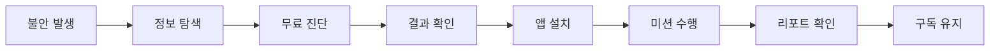

요구하신 기준을 명확히 반영했습니다:

* ✅ **순수 Markdown (코드블록 없음)**
* ✅ **Notion 붙여넣기 시 자동 헤더/테이블 인식**
* ✅ **Git README / 문서로 바로 사용 가능**
* ✅ **Mermaid 포함 (표준 fenced block만 사용)**
* ✅ **불필요한 id / 속성 제거 (Notion 호환성 문제 방지)**

아래는 그대로 `.md` 파일로 저장하거나 Notion에 붙여넣으면 됩니다.

---

# AI 홈 랭귀지 코칭 서비스 PRD v1.3

* Owner 팀: Product / AI / Data / Growth / B2B BizDev
* 최종 업데이트: 2026-05-07

---

## 1. 개요·목표

### 1.1 문제 정의 (Pain + 실패 KPI)

#### Pain 1. 진단 기준 부재

* 진단 리드타임 ≥ 60일
* 무료 진단 → 앱 설치 전환율 ≤ 30%
* 정보 탐색 시간 ≥ 월 20시간

#### Pain 2. 골든타임 방치

* 개입 지연 ≥ 4.5개월
* 홈케어 실행률 ≤ 20%
* 첫 행동까지 리드타임 ≥ 14일

#### Pain 3. 홈케어 비표준화

* D7 리텐션 ≤ 40%
* D30 리텐션 ≤ 20%
* 효과 체감 실패 ≥ 60%

#### Pain 4. 기관-학부모 갈등

* 민원 ≥ 연 3건
* 교사 추가 업무 ≥ 주 3시간

---

### 1.2 목표 (Desired Outcome)

| 항목      | 기준선 | 목표  | 측정 주기 |
| ------- | --- | --- | ----- |
| 진단 리드타임 | 60일 | 5분  | 실시간   |
| 홈케어 실행률 | 20% | 80% | 주간    |
| D30 리텐션 | 20% | 50% | 월간    |
| 민원 발생   | 3건  | 0건  | 분기    |
| 미션 완료율  | 30% | 70% | 주간    |

---

### 1.3 KPI

#### 북극성 KPI

* WAU Active Learners

  * 정의: 주 1회 이상 미션 완료 사용자
  * 기준선: 0
  * 목표: 20,000
  * 측정 주기: 주간

#### 보조 KPI

| KPI      | 기준선 | 목표  | 주기 |
| -------- | --- | --- | -- |
| 전환율      | 25% | 45% | 주  |
| D7 리텐션   | 40% | 65% | 주  |
| D30 리텐션  | 20% | 50% | 월  |
| 평균 세션 시간 | 3분  | 7분  | 주  |

---

## 2. 사용자와 페르소나

### 2.1 페르소나

| 세그먼트    | 설명      | 핵심 니즈  |
| ------- | ------- | ------ |
| Seg A   | 불안형 탐색자 | 즉시 진단  |
| Seg C   | 센터 대기자  | 즉시 개입  |
| Seg B   | 데이터형 부모 | 성과 증명  |
| Seg D-1 | 원장      | 민원 방어  |
| Seg D-2 | 교사      | 업무 최소화 |

---

### 2.2 사용자 여정

---

## 3. 사용자 스토리와 수용 기준 (Acceptance Criteria)

### Story 1 — 진단

**Story**
As a Seg A 부모, I want 5분 내 진단을 받고 싶다, so that 즉시 상태를 판단한다.

**AC**

1. Given 진단 시작 → When 수행 → Then 300초 이내 완료 (p95)
2. Given 음성 입력 → When 분석 → Then 정확도 ≥ 90%, 실패율 ≤ 1%
3. Given 결과 요청 → When 응답 → Then p95 ≤ 1000ms, 오류율 ≤ 0.5%

---

### Story 2 — 개인화 미션

**Story**
As a Seg C 부모, I want 개인화된 미션을 받고 싶다, so that 대기 중에도 개입한다.

**AC**

1. Given 진단 결과 → When 생성 → Then 개인화 정확도 ≥ 85%
2. Given 수행 → When 7일 경과 → Then 완료율 ≥ 70%
3. Given 3회 실패 → When 난이도 조정 → Then 성공률 ≥ 60%

---

### Story 3 — 성장 리포트

**Story**
As a Seg B 부모, I want 데이터 기반 성과를 확인하고 싶다, so that 지속 사용을 결정한다.

**AC**

1. Given 7일 데이터 → When 생성 → Then 정확도 ≥ 95%
2. Given 조회 → When 로딩 → Then p95 ≤ 800ms
3. Given 제공 → When 30일 경과 → Then D30 ≥ 50%

---

### Story 4 — 기관 리포트

**Story**
As a 원장, I want 공식 리포트를 제공하고 싶다, so that 민원을 방어한다.

**AC**

1. Given 데이터 → When PDF 생성 → Then ≤ 3초
2. Given 제공 → When 확인 → Then 만족도 ≥ 4.5/5
3. Given 6개월 운영 → Then 민원 = 0

---

### Story 5 — 교사 Zero-touch

**Story**
As a 교사, I want 자동 수집 시스템이 필요하다, so that 추가 업무 없이 운영한다.

**AC**

1. Given 수업 중 → When 활성 → Then 자동 수집 ≥ 95%
2. Given 사용 → When 입력 요구 → Then 수동 입력 = 0
3. Given 알림장 → When 승인 → Then ≤ 10초

---

## 4. 기능 요구사항 (Functional)

### Must

* AI 음성 분석 (정확도 ≥ 90%)
* 5분 진단
* 개인화 미션 엔진
* B2B 리포트

### Should

* 주간 리포트
* 게이미피케이션
* 알림 시스템

### Could

* AI 챗봇
* 교육 콘텐츠

### Won’t

* 의료 진단
* 실시간 치료

---

### 차별 가치

| 항목  | 기존    | 본 서비스 |
| --- | ----- | ----- |
| 진단  | 60일   | 5분    |
| 비용  | 5만원/회 | 3만원/월 |
| 리텐션 | 20%   | 50%   |
| 실행률 | 20%   | 80%   |

---

## 5. 비기능 요구사항 (NFR)

### 성능

* p95 ≤ 1000ms
* 동시 사용자 ≥ 10,000

### 신뢰성

* 가용성 ≥ 99.5%
* 오류율 ≤ 0.5%

### 보안

* AES-256
* 개인정보 분리 저장
* 부모 동의

### 비용

* 사용자당 ≤ 5,000원/월

---

### 모니터링

| 항목   | 기준  | 대응   |
| ---- | --- | ---- |
| 오류율  | >1% | 알림   |
| 응답시간 | >2초 | 스케일링 |
| 리텐션  | 급락  | 분석   |

---

## 6. 데이터·인터페이스

### 엔터티

* User
* ChildProfile
* VoiceSample
* Mission
* Report

### API

| API               | 입력  | 출력  |
| ----------------- | --- | --- |
| /diagnosis/start  | 사용자 | 세션  |
| /diagnosis/result | 음성  | 점수  |
| /mission/generate | 점수  | 미션  |
| /report/weekly    | ID  | 리포트 |

---

## 7. 범위 / 리스크 / 가정 / 의존성

### In Scope

* B2C 진단
* 홈케어
* B2B 리포트

### Out Scope

* 의료 진단
* 오프라인 치료

---

### 리스크

* AI 정확도 부족
* 리텐션 저하
* 교사 저항

---

### 가정

* 부모 지불 의사 존재
* 기관 니즈 존재

---

### 의존성

* AI 모델
* 데이터 확보

---

## 8. 실험·롤아웃·측정

### 실험

* A/B 테스트 (n=500)

| 가설         | KPI |
| ---------- | --- |
| 진단 속도 → 전환 | 전환율 |
| 미션 → 리텐션   | D30 |

---

### 성공 기준

* 전환율 ≥ 40%
* D30 ≥ 50%
* p < 0.05

---

## 9. 근거 (Proof)

### 설계

* A/B 테스트
* Cohort 분석

### Metrics

* 전환율
* 리텐션
* 점수 개선

### 기준

* KPI 20% 개선
* 통계적 유의성 확보

---

