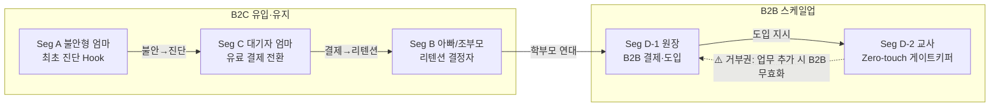
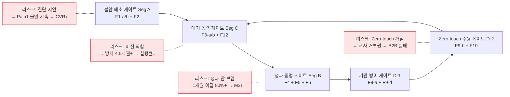
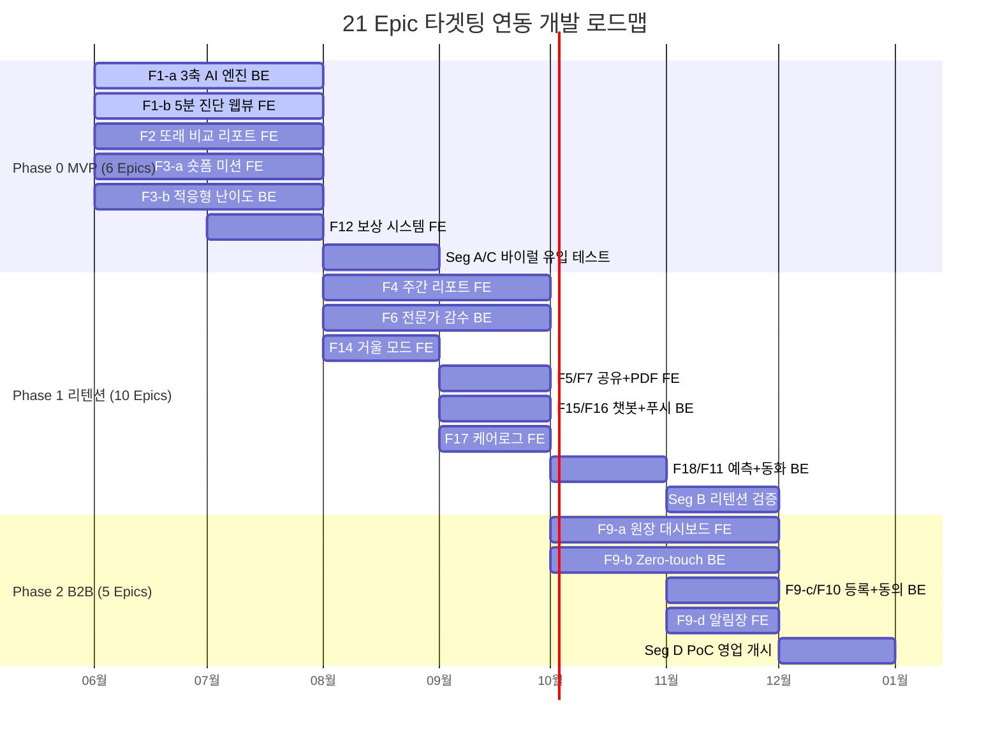
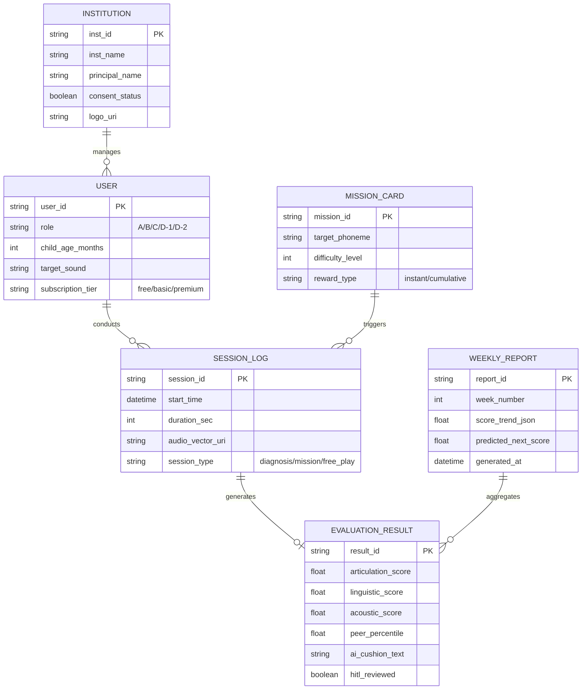
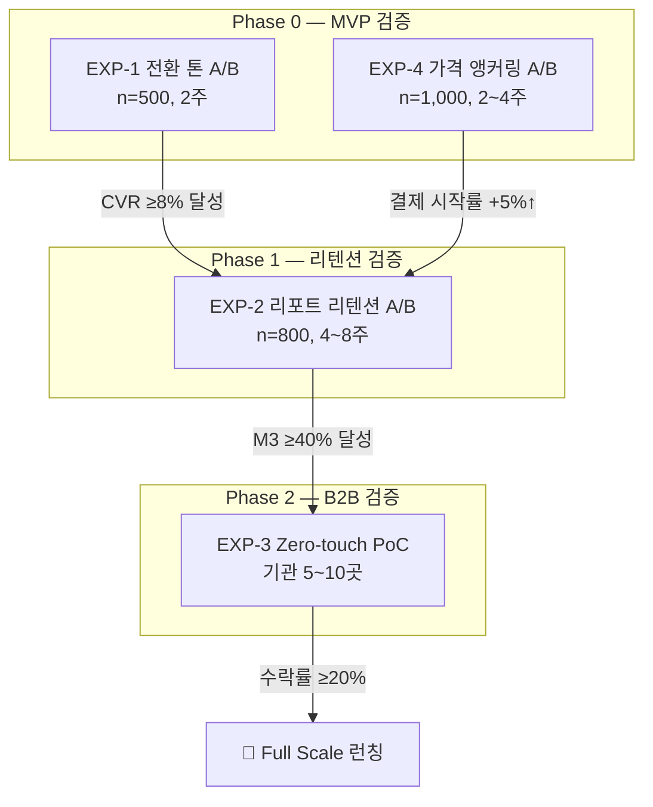

# Home Language Coaching Platform PRD v0.4 — Integrated Edition
- Owner 팀: Product / AI / Data / Growth / B2B BizDev
- 최종 업데이트: 2026-05-07
- 기반: V02 Opus 골격 + V01 Gemini(HITL Story) + V02 Cursor(Critical Path, 안전AC, 가격실험) + V03 GPT(Won't)

---

## 1. 개요·목표

### 1.1 문제 정의 (Pain 지표 포함)

| # | Pain Cluster | 핵심 Pain | 실패 KPI (수치화) | Needs |
|:-:|:---|:---|:---|:---|
| P1 | **진단 기준 부재** | 공신력 있는 즉각 진단 도구 부재로 부모 불안 극대화 | 맘카페 탐색 `월 20h+`, 오프라인 초진 대기 `2~3개월+`, 5분 내 객관화 완료율 `<60%` | 가입/대기 없이 `≤5분` 내 동년배 백분위 객관화 |
| P2 | **골든타임 증발** | 센터 대기 중 체계적 개입 없이 방치 | 언어 지연 방치 기간 `평균 4.5개월`, 대기 중 홈케어 실행률 `<50%` | 매일 `1~3분` 맞춤 미션으로 즉시 개입 |
| P3 | **홈케어 비표준화** | 효과 수치화 불가로 동력 상실·이탈 | 기존 교육 앱 `1개월 내 이탈 80%+`, 리텐션 3일 이하 `40%+`, 주간 리포트 열람률 `<40%` | `62→71점` 시계열 성과를 수치·그래프로 가시화 |
| P4 | **치료 권유 딜레마 (B2B)** | 객관적 증거 부재로 교사·원장 소통 갈등 | 악성 민원 `연 3~5건`, 원아 연쇄 퇴소 `1~2명/분기`, 교사 수기 관찰 `주 3h+`, Zero-touch 승인율 `<90%` | Zero-touch 수집 + 원장 명의 스크리닝 리포트 |

### 1.2 목표 (Desired Outcome 수치화)

| Outcome ID | 목표 결과 | 기준선 (As-Is) | 목표값 (To-Be) |
|:---:|:---|:---|:---|
| O-1 | 5분 내 객관적 진단 수치화 | 리드타임 `2~3개월+`, 탐색 `월 20h+` | 리드타임 `≤5분`, 탐색 `0~2h/월` |
| O-2 | 대기 기간 즉시 홈케어 진입 | 방치 `평균 4.5개월`, 실행률 `<50%` | 방치 `0시간`, 첫 주 미션 완료율 `≥70%` |
| O-3 | 노력 가시화로 리텐션 강화 | `1개월 내 이탈 80%+` | M3 리텐션 `≥40%`, 리포트 열람률 `≥60%` |
| O-4 | 기관 도입 Zero-touch 통과 | 교사 수기 `주 3h+`, 민원 `연 3~5건` | 교사 능동 조작 `0회`, 민원 `0건(PoC)`, 수락률 `≥20%` |

### 1.3 성공 지표 (북극성 / 보조 KPI)

| 유형 | KPI | 기준선 | 목표값 | 측정 주기 |
|:---:|:---|:---:|:---:|:---:|
| **🌟 북극성** | M3 리텐션 유지율 (유효 구독자) | 20% | **≥40%** | 월간 (M3 코호트) |
| 보조 | 유효 구독 전환율 (무료→Basic) | <3% | ≥8% | 주간 |
| 보조 | CAC (유료 전환 비용) | 100,000원 | ≤30,000원 | 주간 |
| 보조 | 대기자 대기 중 실행률 | ≤50% | ≥70% | 주간 |
| 보조 | 교사 Zero-touch 승인율 | — | ≥90% | PoC 종료 시 |
| 보조 | 오진 치명 수정률 (HITL) | — | <0.5% | 월간 |

### 1.4 차별 가치 (Differential Value) — 기존 대안 대비 정량 비교

| 비교 축 | 기존 대안 (Legacy) | 우리 서비스 | 개선 폭 |
|:---|:---|:---|:---|
| **시간 (성능)** | 오프라인 초진 `2~3개월+` | `≤5분` 즉시 백분위 확인 | **시간 단축 ≥1,000배** |
| **비용 (경제성)** | 센터 1회 `5~8만원` | Basic 월 `3.5만원` (주간 미션+리포트 포함) | **30~56% 비용 절감** |
| **업무 마찰 (효율성)** | 교사 수기 관찰 `주 3h+` | Zero-touch `0회` | **현장 마찰 100% 제거** |

> **Proof 연결**: 위 주장은 §8 실험 설계(A/B 테스트, PoC)와 §9 근거 문서에서 검증 계획을 수립합니다.

---

## 2. 사용자와 페르소나

### 2.1 핵심 페르소나 요약

| 세그먼트 | 페르소나 (역할) | DMU 유형 | 규모 | 여정 Pain·Needs 핵심 | 링크 |
|:---:|:---|:---:|:---:|:---|:---:|
| **Seg A** | 불안형 탐색자 (엄마) | B2C 의사결정자 | 12~15만 가구 | P1: 기준 부재 불안 → 5분 객관화 | Story S1 |
| **Seg C** | 센터 대기자 (엄마) | B2C 핵심 결제자 | 2~3만 가구 | P2: 골든타임 방치 → 즉시 홈케어 | Story S2 |
| **Seg B** | 데이터형 개입자 (아빠/조부모) | B2C 유지자 | 3~5만 가구 | P3: 성과 불확실 → 시계열 증명 | Story S3 |
| **Seg D-1** | 유치원 원장 (결제자) | B2B 결제권자 | ~5,000개 기관 | P4: 민원 방어 → 스크리닝 리포트 | Story S4 |
| **Seg D-2** | 보육 교사 (실무자) | B2B 게이트키퍼 | — | P4: 업무 과중 → Zero-touch | Story S5 |

### 2.2 DMU 영향력 관계 및 Critical Path

> **Critical Path**: A(불안) → C(결제) → B(납득) → D-1(방어적 결제) → D-2(Zero-touch 수용). **교사(D-2)가 "바빠서 못 해요" 한 마디에 B2B 파이프라인이 멈춥니다.**

### 2.3 Intervention Dependency & 리스크 연쇄 영향

### 2.4 CJM 단계별 Pain·Needs ↔ 제품 개입 매핑

| CJM 단계 | 핵심 페르소나 | Pain (실패 KPI) | Needs | 제품 개입 (Epic) | 성공 지표 |
|:---|:---|:---|:---|:---|:---|
| 1) 의심/탐색 | Seg A | P1: 탐색 `20h+/월`, 대기 `2~3개월+` | `≤5분` 백분위 | F1-a/b + F2 | CVR `≥8%` |
| 2) 대기/절망 | Seg C | P2: 방치 `4.5개월`, 실행률 `<50%` | 매일 `1~3분` 미션 | F3-a/b + F12 | 실행률 `≥70%` |
| 3) 체념/유지 | Seg B | P3: 이탈 `80%+/1개월` | 시계열 성과 증명 | F4 + F5 + F6 | M3 `≥40%` |
| 4) 기관 갈등 | Seg D-1/D-2 | P4: 민원 `3~5건/년`, 수기 `3h+/주` | Zero-touch + 명의 리포트 | F9-a/b/d + F10 | 조작 `0회`, 승인 `≥90%` |

---

## 3. 사용자 스토리와 수용 기준 (AC)

### Story S1: 5분 무료 진단 (Seg A — 불안형 탐색자)

> **As a** 불안형 부모(Seg A), **I want** 병원/회원가입 없이 즉시 음성 진단을 수행 **so that** 아이의 발달 위치를 동년배 백분위로 확인해 불안을 잠재울 수 있다.

| AC | Given | When | Then (측정 가능 임계치) |
|:---:|:---|:---|:---|
| AC-1 | 랜딩 페이지 진입 | 진단 시작 클릭 | 입력 폼 `≤3개 항목` AND 총 소요 `≤300초` |
| AC-2 | 유아 발화 (부정확 발음 포함) | STT/NLP 분석 | 처리 실패율 `<2%`, 타임아웃 재시도 `1회 내 성공` |
| AC-3 | 진단 세션 종료 | 결과 페이지 렌더링 | 서버 분석+차트 렌더 `p95 ≤1,500ms` |
| AC-4 | 진단 결과 화면 진입 | 면책 동의 영역 표출 | "의료적 판단 아님" 고지 노출률 `100%` |

### Story S2: 대기 기간 홈케어 미션 (Seg C — 센터 대기자)

> **As a** 센터 대기자(Seg C), **I want** 대기 중 매일 1~3분 맞춤 미션을 수행 **so that** 골든타임을 방치하지 않고 훈련 동력을 유지할 수 있다.

| AC | Given | When | Then |
|:---:|:---|:---|:---|
| AC-1 | 데일리 미션 카드 | 아이 플레이 | 세션 `1~3분`, Drop-off `<10%` |
| AC-2 | 3회 연속 실패 | 난이도 하향 전환 | X 표시/실패음 `0회`, 즉시 쉬운 단계 전환 |
| AC-3 | 발화 성공 | 보상 UI 호출 | 보상 등장 `≤500ms` |
| AC-4 | 첫 7일 | 주간 미션 제공 | 첫 주 미션 완료율 `≥70%` |

### Story S3: 주간 시계열 성과 리포트 (Seg B — 데이터형 개입자)

> **As a** 데이터형 부모(Seg B), **I want** 주간 발달 추이를 수치/그래프로 확인 **so that** 훈련 효과를 가족에게 증명하고 구독을 지속할 수 있다.

| AC | Given | When | Then |
|:---:|:---|:---|:---|
| AC-1 | 주간 훈련 종료 | 리포트 생성 | 음소 단위 백분위 꺾은선 그래프 제공, 생성 `p95 ≤3,000ms` |
| AC-2 | 성과 뱃지 획득 | 공유 버튼 클릭 | 1탭 카카오톡 전송 성공률 `≥95%` |
| AC-3 | 리포트 하단 예측 시뮬레이션 노출 | 클릭 | 익월 결제 유지율 비클릭 대비 `≥20%p↑` |

### Story S4: 기관 스크리닝 대시보드 (Seg D-1 — 원장)

> **As a** 유치원 원장(Seg D-1), **I want** 기관 명의 스크리닝 결과지를 발송 **so that** 학부모 민원을 선제 방어하고 프리미엄 케어로 차별화할 수 있다.

| AC | Given | When | Then |
|:---:|:---|:---|:---|
| AC-1 | 100명 원아 엑셀 업로드 | 파싱/등록 | 처리 완료 `p95 ≤3,000ms` |
| AC-2 | 원장 명의 커스터마이징 ON | 리포트 프리뷰 | 헤더/로고 반영 `≤1초` |
| AC-3 | 카카오톡 동의서 | 모바일 열람 | 전자 서명 완료율 `≥85%` |

### Story S5: Zero-touch 화자분리/수집 (Seg D-2 — 교사)

> **As a** 보육 교사(Seg D-2), **I want** 직접 통제 없이 자동 음성 수집+승인만 **so that** 업무가 늘지 않으면서 객관적 데이터를 학부모에게 전달할 수 있다.

| AC | Given | When | Then |
|:---:|:---|:---|:---|
| AC-1 | 자유놀이 시간 태블릿 켜짐 | 음성 수집/분석 | 교사 능동 조작 `평균 0회` |
| AC-2 | 교실 10인+ (약 60dB) | Speaker Diarization | 교사/아동 분리 정확도 `≥85%` |
| AC-3 | AI 알림장 초안 생성 | 교사 검토 | 수정 없이 승인 비율 `≥90%` |
| AC-4 | 수집된 음성 데이터 | 저장/처리 | 원본 오디오 보관 `≤7일`, 이후 벡터 전환+`AES-256` 암호화 저장 |

### Story S6: 전문가 비동기 감수 시스템 (Seg A/C — 구독 학부모)

> **As a** 구독 결제 학부모(Seg A/C), **I want** AI 1차 결과에 더해 실제 언어재활사의 피드백 코멘트를 받아보고 싶다 **so that** AI 오진에 대한 불안을 지우고 진단 결과를 100% 신뢰할 수 있다.

| AC | Given | When | Then (측정 가능 임계치) |
|:---:|:---|:---|:---|
| AC-1 | AI Confidence Score 기준치 미달 또는 부모 '이의 제기' 클릭 | HITL 대기열 이관 | 즉시(실시간) 해당 세션 오디오가 전문가 큐에 등록 |
| AC-2 | 전문가 큐에 등록된 건 | 언어재활사 코멘트 작성 | 영업일 기준 `48시간 이내` 100% 피드백 완료 |
| AC-3 | 월간 전체 진단 건수 | 치명적 오진으로 전문가가 결과 수정 | 수정(뒤집힘) 비율 전체 건수의 `<0.5%` |

---

## 4. 기능 요구사항 (Functional) — MoSCoW 우선순위

### Must (Phase 0 — MVP 코어, 6 Epics)

| Epic | 기능 | 책임 | 대안 대비 가치 근거 |
|:---|:---|:---:|:---|
| **F1-a** | 3축 AI 음성 분석 엔진 (Linguistic/Articulation/Acoustic) | BE | 오프라인 초진 `2~3개월 → ≤5분`, K-CDI/REVT 척도 차용 |
| **F1-b** | 무로그인 5분 진단 웹뷰 | FE | 앱 설치 없이 브라우저 즉시 진단, CAC `→0원 수렴` |
| **F2** | 또래 비교 진단 리포트 (백분위+넛지 카피) | FE | "장애 판정" 톤 → "상위 N%" 프레이밍으로 전환 거부 감소 |
| **F3-a** | 1분 숏폼 미션 카드 UI | FE | 방치 `4.5개월 → 0시간`, Drop-off `<10%` |
| **F3-b** | 적응형 난이도 조절 엔진 (ABA 기반) | BE | 3회 연속 실패 시 은밀한 단계 전환, 아이 좌절감 제거 |
| **F12** | 게이미피케이션 보상 시스템 (즉각+누적) | FE | 즉각 보상 `≤500ms` + 누적 보상(나무 성장)으로 첫 주 이탈 방어 |

### Should (Phase 1 — 리텐션/바이럴, 10 Epics)

| Epic | 기능 | 책임 | 가치 근거 |
|:---|:---|:---:|:---|
| **F4** | 주간 발달 추이 리포트 | FE | 이탈 `80% → M3 ≥40%` |
| **F5** | 카카오톡/SNS 공유 (성과 뱃지) | FE | 가족 공유로 구독 유지 압력 |
| **F6** | 비동기 전문가 코멘트 (HITL) | BE | 오진 수정률 `<0.5%` 품질 방어 |
| **F7** | 센터 제출용 PDF | FE | 치료사 초기 파악 `4주→1주` |
| **F11** | 부모 목소리 복제 동화 | BE | 교정 훈련 적용 금지 원칙 |
| **F14** | 거울 모드 (입 모양 비교) | FE | 조음 교정 체험 깊이 강화 |
| **F15** | LLM 대화형 발화 유도 챗봇 | BE | 자연 발화 데이터 수집 |
| **F16** | 오프라인 일반화 푸시 알림 | BE | 앱→일상 전이 |
| **F17** | 통합 케어로그 (센터+앱) | FE | 기록 단절 해소 |
| **F18** | 발달 예측 시뮬레이션 | BE | 구독 연장 트리거 |

### Could (Phase 2 — B2B 스케일업, 5 Epics)

| Epic | 기능 | 책임 | 가치 근거 |
|:---|:---|:---:|:---|
| **F9-a** | 원장용 대시보드 UI | FE | 원장 명의 리포트, ROI 시뮬레이터 |
| **F9-b** | Zero-touch 화자분리 수집 | BE | 교사 업무 `주 3h+ → 0회` |
| **F9-c** | 원아 일괄등록 및 동의서 발송 | BE/API | 행정 부담 제로화 |
| **F9-d** | AI 쿠션어 알림장 + 명의 커스텀 | FE | 교사 감정 소모 제로화 |
| **F10** | 학부모 동의서 자동 생성/전자서명 | BE/API | B2B→B2C 퍼널 유도 |

### Won't (MVP 범위 외 — 명시적 제외)

| 항목 | 제외 사유 |
|:---|:---|
| 의료적 진단/장애 판정 | DTx 인허가 대상으로 규제 리스크 회피 불가 |
| 실시간 원격 진료/텔레메디슨 | 의료법 저촉 + MVP 복잡도 과대 |
| 교정 훈련에 부모 음성 클로닝 적용 | 콘텐츠 범위 제한 + 윤리적 리스크 |
| 일반 성인 대상 발음 교정 | 타겟 세그먼트 이탈로 제품 정체성 희석 |

### 4.2 Epic 총괄 및 Phase별 개발 로드맵

---

## 5. 비기능 요구사항 (NFR)

### 성능

| 항목 | 임계치 | 연결 AC |
|:---|:---|:---:|
| 진단/분석 리포트 API 응답 | `p95 ≤ 800ms` | S1-AC3 |
| 오디오 스트리밍/STT 청크 전송 지연 | `≤ 300ms` | S1-AC2 |
| 주간 리포트 생성 | `p95 ≤ 3,000ms` | S3-AC1 |
| 보상 UI 렌더링 | `≤ 500ms` | S2-AC3 |
| 원아 일괄 업로드 처리 | `p95 ≤ 3,000ms` | S4-AC1 |

### 신뢰성

| 항목 | 임계치 |
|:---|:---|
| 월간 서비스 가용성 (Uptime) | `≥ 99.9%` |
| 오디오 인코딩/처리 오류율 | `≤ 0.5%` |
| 분석 실패 후 재시도 1회 내 성공률 | `≥ 98%` |
| 화자분리 정확도 (교실 60dB) | `≥ 85%` |

### 보안/비용

| 항목 | 기준 |
|:---|:---|
| 영유아 음성 원본 보관 | `≤ 7일`, 이후 벡터 전환 후 암호화 저장 |
| 전자 서명/동의 데이터 암호화 | `AES-256` |
| 세션당 평균 처리 비용 | `≤ 7,000원` (Basic 3.5만원의 20% 이내) |

### 모니터링 항목

| 대시보드 | 지표 | 알림 기준 |
|:---|:---|:---|
| **퍼널 전환** | 웹뷰 접속 → 진단 시작 → 완료 → 리포트 뷰 → Basic 결제 | 전환율 일간 변동 `±20%` 시 Alert |
| **품질** | 화자분리 정확도, STT 실패율, HITL 뒤집힘률 | STT 실패율 `5분 내 3% 초과` 시 Slack Alert |
| **비즈니스** | M3 리텐션, CAC, LTV:CAC Ratio | LTV:CAC `< 3.0` 시 주간 리뷰 트리거 |

---

## 6. 데이터·인터페이스 개요

### 6.1 핵심 엔터티 및 주요 필드

### 6.2 외부/내부 API 개요

| API | 유형 | Input | Output | 제약 |
|:---|:---:|:---|:---|:---|
| **STT/NLP 분석 엔진** | 내부 | Audio Stream (16kHz, Mono) + 월령/성별/타겟 음소 | JSON: 음소별 점수, 백분위, Confidence, TTR/음향 메타 | p95 응답 `≤800ms` |
| **적응형 난이도 엔진** | 내부 | 세션 이력 (정오답 패턴) + 현재 난이도 | JSON: 다음 미션 ID, 난이도 레벨, 우회 훈련 여부 | 실패 3회 연속 시 즉시 전환 |
| **키즈노트 알림장 연동** | 외부 | Evaluation JSON + 기관/학부모 ID + 권한 토큰 | Webhook `200 OK` / 실패 코드 | 정책 변경 시 PDF Fallback |
| **카카오톡 전자서명** | 외부 | 동의서 템플릿 + 학부모 식별자 | 서명 상태 (완료/미완료) | 완료율 `≥85%` 목표 |

---

## 7. 범위(In/Out), 리스크·가정·의존성

### 7.1 범위 (Scope)

| In-Scope ✅ | Out-of-Scope ❌ |
|:---|:---|
| 비의료적(교육/코칭) 언어발달·발음 스크리닝 (백분위) | "언어 지연 장애" 공식 의료 판정 (DTx 인허가 대상) |
| 1분 숏폼 미션 기반 홈케어 코칭 + 시계열 리포트 | 실시간 원격 진료/텔레메디슨 |
| B2B 기관용 대시보드 (원장 명의, Zero-touch) | 교정 훈련에 부모 음성 클로닝 적용 |
| 법정대리인 동의/서명 + Disclaimer 표기 | 일반 성인 대상 발음 교정 |

### 7.2 리스크 (최소 3개)

| # | 리스크 | 영향도 | 대응 (Mitigation) |
|:---:|:---|:---:|:---|
| R1 | **규제/의료 리스크**: 서비스가 의료행위로 오해·취급될 가능성 | 🔴 High | 모든 진단 화면에 Disclaimer 강제 삽입 + HITL 감수 + "비의료/교육용" 포지셔닝 |
| R2 | **품질 리스크**: 교실 소음 환경에서 화자분리/STT 실패 | 🟡 Mid | Phase 1 노이즈 튜닝, 실패 시 자동 재시도/대체 미션, 분리 정확도 `≥85%` 모니터링 |
| R3 | **외부 API 의존성**: 키즈노트/알림장 API 정책 변경 | 🟡 Mid | Webhook 실패 시 PDF 링크/카카오톡 직접 공유 Fallback |
| R4 | **개인정보/법적 리스크**: 영유아 음성 데이터 무단 수집 | 🔴 High | 법정대리인 동의 필수화, 원본 `≤7일` 보관, AES-256 암호화 |
| R5 | **교사 반발 리스크**: Zero-touch 약속 불이행 시 B2B 전면 무효화 | 🔴 High | 교사 능동 조작 `0회` 기술 요건 강제, PoC에서 사전 검증 |

### 7.3 가정·의존성

| 유형 | 내용 |
|:---|:---|
| **가정** | Seg A/C는 오프라인 1회 비용(5~8만원) 대비 월 구독(3.5만원)이 심리적 기준 내 수용 가능 |
| **가정** | 맘카페 바이럴의 자발적 확산력이 CTR `≥15%`를 달성 가능 |
| **의존성** | 한국어 음소/조음 특화 STT/NLP 엔진의 정확도·실패율 목표 달성 |
| **의존성** | B2B PoC를 위한 사립 유치원/어린이집 제휴 네트워크 확보 |
| **ADR 링크** | 향후 `ADR-TBD-001 ~ 003`으로 생성 예정 |

---

## 8. 실험·롤아웃·측정

### 8.1 베타 채널

| 채널 | 타겟 | 규모 |
|:---|:---|:---|
| **B2C Beta** | 맘카페 인플루언서/제휴 블로그를 통한 웹 진단 랜딩 트래픽 | `n ≈ 500~1,000` |
| **B2B PoC** | 지역 사립 유치원/어린이집 | `기관 5~10곳` |

### 8.2 실험 설계 매트릭스

| 실험 | 가설 | Design | Metrics (측정 도구) | 성공 기준 |
|:---|:---|:---|:---|:---|
| **EXP-1 전환 톤** | DTx 톤("경고") → 코칭 톤("상위 N%")이 CVR을 높인다 | A/B Test, `n=500`, `2주` | CVR(무료→Basic), 진단 완료율, 세션 체류(초) | CVR `+2%p↑`, `p<0.05` |
| **EXP-2 리포트 리텐션** | 시계열 그래프+예측 시뮬레이션이 M3 리텐션을 높인다 | A/B Test, `n=800`, `4~8주` | D30, M3 유지율, 리포트 열람률, 예측 클릭률 | M3 `≥40%` 또는 A군 대비 `≥10%↑` |
| **EXP-3 Zero-touch** | 수집 패시브+승인만 허용 시 기관 수락률이 오른다 | PoC 파일럿, `기관 5~10곳` | 교사 능동 터치/주, 승인 비율, 원장 수락률, 민원 건수 | 조작 `0회`, 수락률 `≥20%` |
| **EXP-4 가격 앵커링** | 센터 1회 비용 대비 노출 시 결제 저항이 줄어든다 | Paywall A/B, `n=1,000`, `2~4주` | CVR, 결제 시작률, 결제 완료율, 취소 사유 | CVR `+2%p↑`, 시작률 `+5%↑` |

### 8.3 실험 흐름 다이어그램

### 8.4 경쟁 대안 대비 벤치마크 계획

| 비교 대상 | 벤치마크 지표 | 기존 대안 수치 | 우리 목표 |
|:---|:---|:---:|:---:|
| 일반 교육/홈케어 앱 | D30 리텐션 | ~20% | M3 `≥40%` |
| 오프라인 발달 센터 | 진단 리드타임 | 3~6개월 | `≤5분` |
| 사설 센터 1회 비용 | 월 비용 대비 가치 | 5~8만원/회 | 3.5만원/월 |
| 교사 수기 관찰 | 주간 업무 시간 | 3시간+/주 | 0회 (Zero-touch) |

---

## 9. 근거 (Proof)

### 9.1 사전 분석 보고서 추적 (Traceability Matrix)

| PRD 섹션 | 근거 보고서 | 핵심 인용/활용 |
|:---|:---|:---|
| §1 개요·목표 | 문제정의서, FGI 및 JTBD 분석 | 4대 Pain 정의, Switch Trigger, 실패 KPI 수치화 |
| §2 페르소나 | 페르소나 스펙트럼, CJM 통합본 | DMU 세분화, 영향력 관계, Critical Path |
| §3 사용자 스토리 | JTBD 분석, AOS/DOS 매트릭스 | **6개** 스토리(S1~S6) × AC의 정량 임계치 |
| §4 기능 요구사항 | 경쟁사 분석 4건 (33~36번), RTM 초안 | 14개 경쟁사 → 21 Epic 매핑, MoSCoW 근거 |
| §7 리스크 | 법적 규제 분석, 의료기기 우회 검토서 | 비의료 포지셔닝, HITL 안전장치 |
| §8 실험 | TAM-SAM-SOM, BMC, 린 캔버스 | 시장 규모 검증, 가격 수용성 근거 |

### 9.2 주장별 실험 설계 × 측정 도구 연결

| 주장 (Claim) | 실험 설계 (Design) | 측정 도구 (Metrics) | 성공 기준 |
|:---|:---|:---|:---|
| **A.** "5분 무료 진단"이 불안을 해소해 전환을 올린다 | EXP-1: 톤 A/B Test (`n=500`, `2주`) | CVR(무료→Basic), 진단 완료율, p95 응답(`≤1,500ms`) | CVR `+2%p↑`, `p<0.05` |
| **B.** "가격 앵커링"이 지불 저항을 낮춘다 | EXP-4: Paywall 카피 A/B (`n=1,000`, `2~4주`) | CVR, 결제 시작률, 결제 완료율, 취소 사유 분포 | CVR `+2%p↑`, "가격 부담" 취소 `-20%↓` |
| **C.** "대기 중 즉시 미션"이 방치·이탈을 차단한다 | 대기자 코호트 7일 미션 유무/강도 실험 | 첫 주 완료율(`≥70%`), D30 이탈률, 주간 활성률 | 완료율 `≥70%`, Drop-off `<10%` |
| **D.** "주간 시계열 리포트"가 M3 리텐션을 끌어올린다 | EXP-2: 리포트 구성 A/B (`n=800`, `4~8주`) | M3 리텐션(`≥40%`), 예측 시뮬레이션 클릭→익월 유지율 | M3 `≥40%` 또는 `+10%↑` |
| **E.** "Zero-touch B2B"가 교사 반발을 제거한다 | EXP-3: PoC 파일럿 (`기관 5~10곳`) | 능동 터치(`0회`), 승인 비율(`≥90%`), 수락률(`≥20%`) | 능동 `0회` AND 수락 `≥20%` |
| **F.** AI 오진은 HITL로 통제 가능하다 | Confidence Score 기반 감수 큐 운영 | 치명 수정률(`<0.5%`), 불만/철회율, 전문가 SLA(`48h`) | 수정률 `<0.5%` |

### 9.3 핵심 리서치 링크

| 자료 유형 | 참조 경로 |
|:---|:---|
| JTBD & Switch Trigger | `39_VPS_V09 §1-4`, `§14-1` |
| TAM-SAM-SOM / AOS·DOS | `39_VPS_V09 §3` |
| Job-Feature 매핑 / Epic 정의 | `39_VPS_V09 §4` (경쟁사 벤치마킹 14개사 통합) |
| 법/규제 프로토콜 | `39_VPS_V09 §5`, `§15` |
| 비즈니스 모델 / 3개년 시나리오 | `39_VPS_V09 §11` |
| 경쟁사 UX 분석 | 33번(통신3사), 34번(에듀테크), 35번(DTx), 36번(B2B2C) |

---

*본 PRD는 `39_VPS_V09_final_UX_reinforce.md`를 Single Source of Truth로 하여, V02 Opus를 골격으로 V01 Gemini(HITL Story S6), V02 Cursor(Critical Path, 안전AC, EXP-4 가격 앱커링), V03 GPT(Won't 명시)를 통합한 Best-of-Breed 최종판입니다. (작성일: 2026. 5. 7.)*
