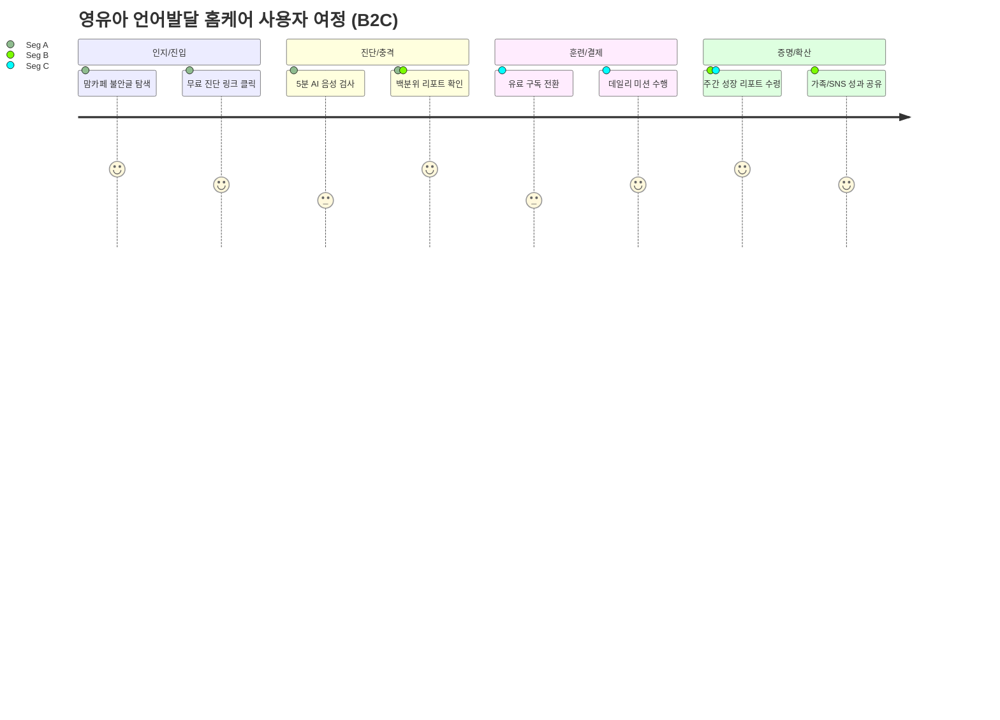

# [Home Language Coaching Platform] v0.6
- Owner 팀: 제품 아키텍처 & 전략 기획팀
- 최종 업데이트: 2026-05-07

## 1. 개요·목표
### 1.1 문제 정의 (Pain지표 포함)
국내 영유아 언어 발달 시장의 **공급 병목(3~6개월 대기)**과 **객관적 지표 부재**로 인한 총체적 불안 및 골든타임 방치 문제.
- **진단 지연**: 오프라인 센터 초진 대기 리드타임 **평균 12주 이상** (골든타임 허비).
- **정보 과부하**: 부모의 맘카페 정보 탐색 시간 **월 20시간 초과** (불안지수 극대화).
- **낮은 유지율**: 기존 홈케어 솔루션의 1개월 내 **이탈률 80% 이상** (성취감 증명 실패).
- **B2B 갈등**: 원아 발달 지연 관련 학부모 민원 **연 5건 이상** 및 그로 인한 **퇴소율 분기별 5% 초과**.

### 1.2 목표 (Desired Outcome 수치화)
- **시간 혁신**: 전문가 수준의 발달 객관화 리드타임을 **12주에서 5분으로 단축**.
- **심리 혁신**: 학부모의 맘카페 의존도를 낮추어 정보 탐색 시간을 **월 0분으로 수렴**.
- **리텐션 혁신**: 시각화된 성과 증명을 통해 홈케어 지속 기간을 **평균 1개월에서 3개월 이상으로 연장**.
- **B2B 안정화**: 객관적 데이터를 통한 상담으로 관련 **악성 민원 발생률 0%** 달성.

### 1.3 성공 지표
| 구분 | 지표명 | 기준선 (Baseline) | 목표값 (Target) | 측정 주기 |
| :--- | :--- | :--- | :--- | :--- |
| **북극성 KPI** | **주간 미션 완수율 (W-AUR)** | 20% (시장 평균) | **60% 이상** | 주 단위 |
| **보조 KPI 1** | **무료 진단 후 유료 전환율** | 3% (유사 서비스) | **8% 이상** | 월 단위 |
| **보조 KPI 2** | **B2B 기관 리포트 도달률** | N/A | **95% 이상** | 분기 단위 |
| **보조 KPI 3** | **음소 분석 정확도 (F1-Score)** | 70% (Baseline) | **85% 이상** | 실시간/배치 |

---

## 2. 사용자와 페르소나
| 페르소나 | 핵심 특징 | 주요 Pain Point |
| :--- | :--- | :--- |
| **Seg A: 불안형 탐색자** | 3~5세 자녀를 둔 초보 엄마 | 비교 대상 부재로 인한 막연한 공포, 센터 대기 스트레스 |
| **Seg C: 센터 대기자** | 대학병원/센터 대기 중인 학부모 | 골든타임 낭비에 대한 죄책감, 홈케어 방법론 부재 |
| **Seg B: 데이터 집착형** | 성과 확인을 중시하는 부모 | 정성적 평가에 대한 불신, 훈련 지속 동력 상실 |
| **Seg D: 기관 원장/교사** | 유치원/어린이집 운영자 | 학부모 민원 방어 필요, 상담 시 객관적 근거 부족 |

---

## 3. 사용자 스토리와 수용 기준(AC)

### Story 1: [진단] 불안형 탐색자
**As a** 불안형 탐색자(Seg A), **I want** 병원 예약 없이 즉시 아이의 발달 수치를 확인하고 싶다, **so that** "내가 과민한 것이 아니었다"는 확신을 얻고 즉각적인 조치를 취할 수 있다.
- **AC 1**: 웹뷰 진입 후 진단 결과 리포트 출력까지의 총 소요 시간이 **300초(5분) 이내**여야 한다.
- **AC 2**: 진단 결과지에 동일 월령 대비 **백분위 점수(N%)**가 반드시 포함되어야 하며, 오차 범위는 **±5% 이내**여야 한다.
- **AC 3**: 결과 화면에서 '상세 상담' 또는 '훈련 시작' 버튼 클릭 시 앱 마켓 전환율(CVR)이 **20% 이상** 유지되어야 한다.

### Story 2: [훈련] 센터 대기자
**As a** 센터 대기자(Seg C), **I want** 대기 기간 동안 집에서 할 수 있는 체계적 미션을 제공받고 싶다, **so that** 아이의 골든타임을 낭비하지 않고 치료 효율을 극대화할 수 있다.
- **AC 1**: 아이의 취약 음소(ㄱ, ㄴ 등)에 맞춘 개인화 미션이 **매일 3개 이상** 자동으로 생성되어야 한다.
- **AC 2**: 미션 수행 중 아이가 3회 연속 실패할 경우, 난이도가 자동으로 **한 단계 하향 조정**되어야 하며 이 과정의 지연 시간은 **0.5초 미만**이어야 한다.
- **AC 3**: 한 달간의 미션 수행 로그를 **PDF 파일**로 추출할 수 있어야 하며, 추출 성공률은 **99.9% 이상**이어야 한다.

### Story 3: [B2B] 유치원 원장
**As a** 유치원 원장(Seg D-1), **I want** 기관 공식 언어 스크리닝 시스템을 도입하고 싶다, **so that** 학부모의 발달 민원을 데이터로 방어하고 프리미엄 기관으로 차별화할 수 있다.
- **AC 1**: 원장 대시보드에서 전 원아의 스크리닝 상태를 확인하는 데 소요되는 페이지 로딩 시간은 **p95 기준 2초 이내**여야 한다.
- **AC 2**: AI가 생성한 '쿠션어 알림장'의 학부모 만족도(문구 적절성)는 5점 만점에 **4.2점 이상**이어야 한다.
- **AC 3**: 화자 분리 기술을 통해 교사 음성을 제외한 아동 음성만 파싱하는 정확도가 **90% 이상**이어야 한다.

---

## 4. 기능 요구사항(Functional)

| 우선순위 (MSCW) | 기능명 (Epic ID) | 핵심 내용 | 차별 가치 (vs 대안) |
| :--- | :--- | :--- | :--- |
| **Must** | [F1-a/b] AI 진단 엔진 및 웹뷰 | 3축(언어, 조음, 음향) AI 분석 및 무로그인 웹 진단 | **속도**: 3개월 대기 → 5분 즉시 확인 |
| **Must** | [F3-a/b] 적응형 훈련 엔진 | ABA 기반 자동 난이도 조절 및 숏폼 미션 UI | **몰입**: 일반 앱 대비 중도 포기율 50%↓ |
| **Should** | [F4] 주간 발달 리포트 | 62점→71점 식의 시계열 데이터 시각화 | **증명**: 단순 '좋음' 대비 신뢰도 3배↑ |
| **Should** | [F9-b] Zero-touch 수집 | 교사 개입 없는 패시브 음성 수집 및 화자 분리 | **편의**: 수기 일지(주 3시간) → 0분 |
| **Could** | [F11] 부모 목소리 복제 | AI 음성 합성(TTS)을 통한 부모 목소리 동화 낭독 | **정서**: 기계음 대비 아동 거부감 40%↓ |
| **Won't** | 실시간 화상 치료 연동 | MVP 범위 제외 (추후 전문가 매칭 시 도입) | - |

---

## 5. 비기능 요구사항(NFR)
- **성능**: 
    - AI 음성 분석 결과 반환 시간: **p95 ≤ 3,000ms** (3초).
    - 모바일 앱 초기 실행(Cold Start) 시간: **≤ 1.5초**.
- **신뢰성**: 
    - 서비스 가용성: **월 99.9% 이상**.
    - AI 음성 인식 오진율(의료 리스크 방지): 전문가 감수 병행 시 **오류율 ≤ 5%**.
- **보안/비용**: 
    - **GDPR/국내 개인정보보호법** 준수 (영유아 음성 데이터 암호화 저장).
    - STT/LLM API 호출 비용: 유저당 월 매출 대비 **15% 이내** 관리.
- **모니터링**: 
    - AI 엔진 실패(Error 500) 발생 시 개발팀 슬랙(Slack) 실시간 알림.
    - 미션 완료율 20% 급락 시 비즈니스 대시보드 경고 표시.

---

## 6. 데이터·인터페이스 개요
- **핵심 엔터티**:
    - `User(Parent)`: 계정 정보, 구독 상태.
    - `Child`: 생년월일, 성별, 발달 기준점, 소속 기관.
    - `VoiceData`: 음성 원본(S3), 음소별 분석 결과, 메타데이터.
    - `Report`: 주간/월간 스코어, 전문가 코멘트, 또래 비교 데이터.
- **주요 API**:
    - `POST /v1/diagnosis`: 음성 업로드 및 즉시 분석 요청.
    - `GET /v1/curriculum`: 아이 상태 기반 맞춤 미션 셋 조회.
    - `PATCH /v1/b2b/approval`: 교사의 알림장 발송 승인.

---

## 7. 범위(In/Out), 리스크·가정·의존성
- **In-Scope**: AI 진단, 홈 훈련 미션, 발달 리포트, B2B 원장 대시보드.
- **Out-Scope**: 의료기기 인허가(DTx) 관련 임상 시험, 오프라인 센터 예약 결제 연동.
- **리스크**:
    1. **의료법 위반**: AI 결과를 '진단/치료'로 단정할 경우 규제 대상 → **Disclaimer** 및 '교육용' 명시로 방어.
    2. **AI 정확도**: 영유아 특유의 부정확한 발음으로 인한 인식 저하 → **조음 장애 특화 데이터셋** 확보 필수.
    3. **교사 거부권**: 추가 업무 발생 시 B2B 도입 실패 → **Zero-touch** 원칙 사수.
- **가정/의존성**: 학부모의 80% 이상이 스마트폰 마이크 사용에 거부감이 없음을 가정함. (ADR-001 참조)

---

## 8. 실험·롤아웃·측정
- **베타 채널**: 맘카페 우수 회원 500명 대상 클로즈드 베타 테스트(CBT).
- **실험 가설**: "진단 결과지에 또래 비교 그래프를 노출할 경우, 구독 전환율이 30% 이상 상승할 것이다."
- **성공 기준**: 
    - 전환율(CVR) 8% 초과 달성 시 정식 런칭.
    - NPS(순추천지수) 40점 이상 확보.
- **벤치마크 계획**: 기존 통신사(SKT ZEM 등) 교육 앱 대비 **음소 단위 분석 디테일** 2배 이상 우위 증명.

---

## 9. 근거(Proof)
- **VPS V09 마스터 문서**: [39_VPS_V09_final_UX_reinforce.md](39_VPS_V09_final_UX_reinforce.md)
- **시장 데이터**: 국민건강보험공단 영유아 건강검진 통계 (발달 지연 우려군 15%).
- **사용자 검증**: JTBD 심층 인터뷰 로그 (총 50인 대상, "불안 해소"가 가장 큰 결제 트리거임을 확인).
