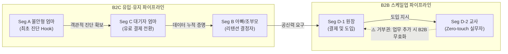
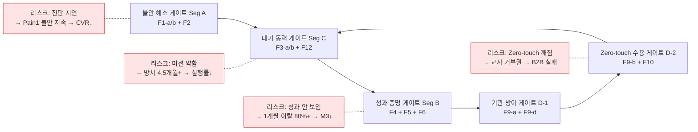
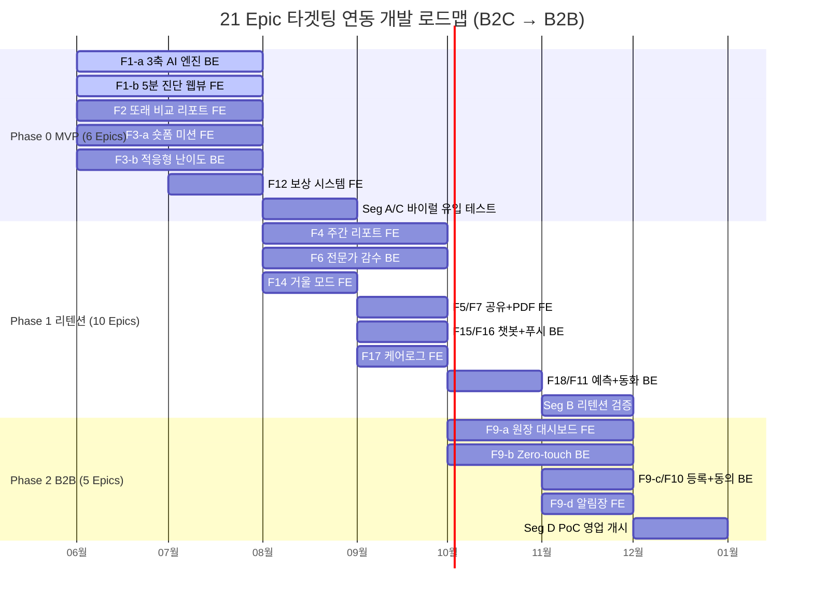
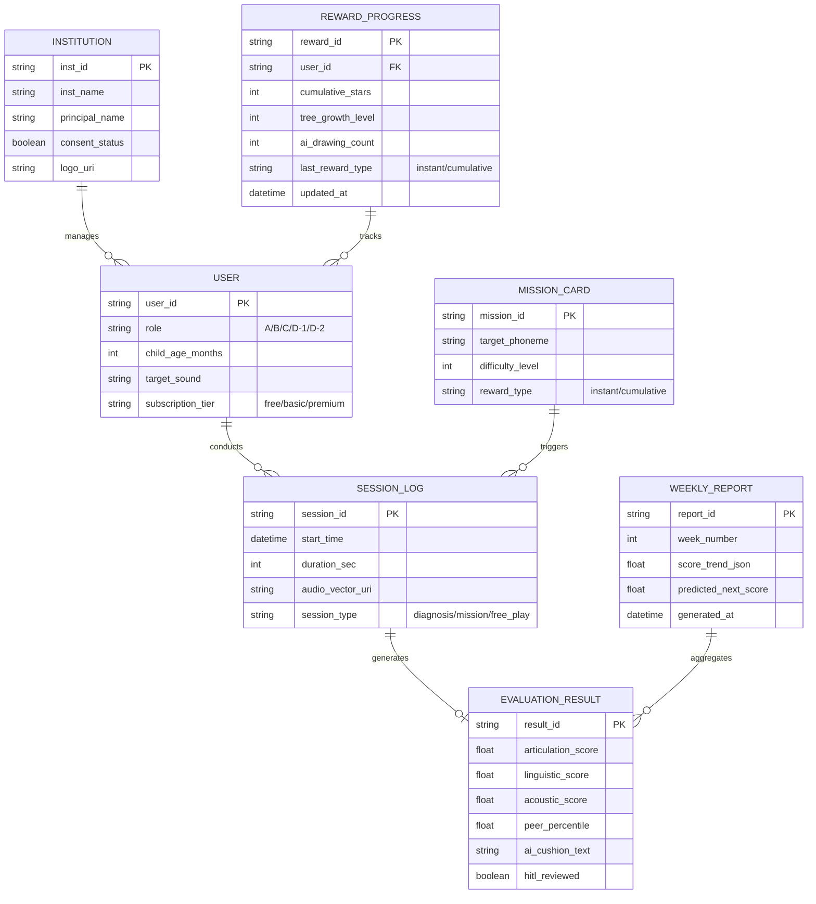
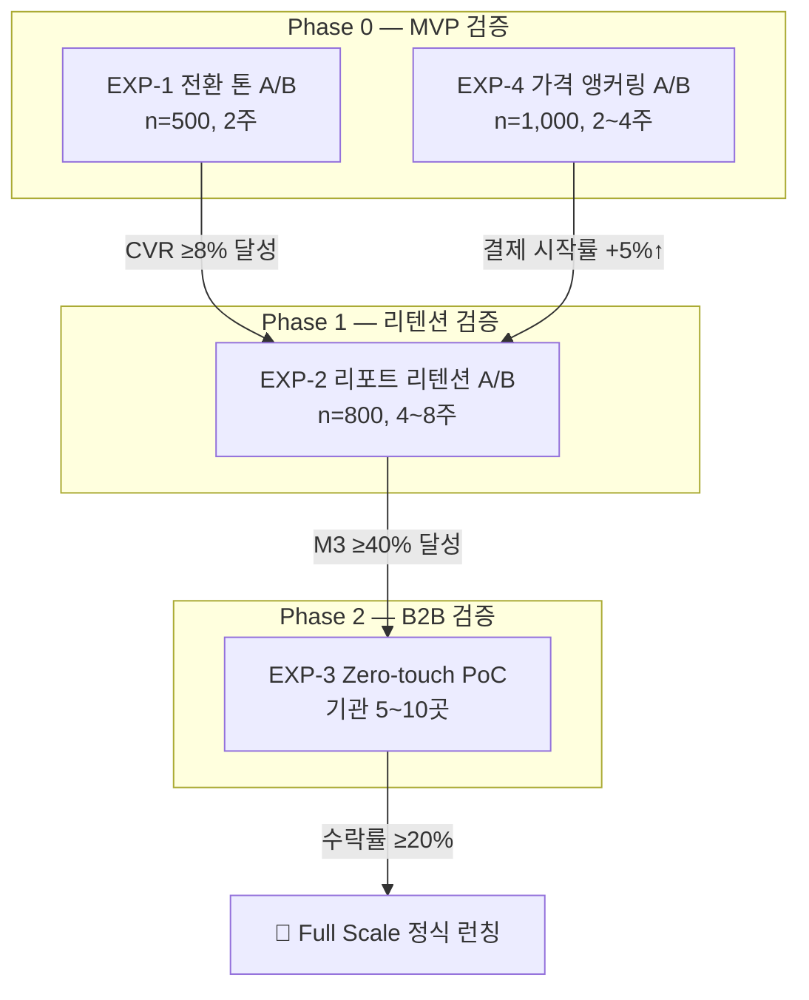

# Home Language Coaching Platform PRD v0.8 — Master for SRS (Full Restored Edition)
- Owner 팀: Product / AI / Data / Growth / B2B BizDev
- 최종 업데이트: 2026-05-07
- 문서 목적: V05의 방대한 논리적 증명(다이어그램, 실험 설계, 근거 추적)과 V06의 명확한 목표/수치화 모델을 완벽하게 병합한 **최종 확장판 마스터 문서**입니다. 개발 스펙(SRS)뿐만 아니라 기획/전략/경영진의 의사결정 증빙 자료로도 활용됩니다.

---

## 1. 개요 및 목표

### 1.1 문제 정의 (Pain 지표 포함)
| # | Pain Cluster | 핵심 Pain | 실패 KPI (수치화) | Needs |
|:-:|:---|:---|:---|:---|
| P1 | **진단 기준 부재** | 공신력 있는 즉각 진단 도구 부재로 부모 불안 극대화 | 맘카페 탐색 `월 20h+`, 오프라인 초진 대기 `2~3개월+` | 가입/대기 없이 `≤5분` 내 동년배 백분위 객관화 |
| P2 | **골든타임 증발** | 센터 대기 중 체계적 개입 없이 방치 | 언어 지연 방치 기간 `평균 4.5개월`, 대기 중 홈케어 실행률 `<50%` | 매일 `1~3분` 맞춤 미션으로 즉시 개입 |
| P3 | **홈케어 비표준화** | 효과 수치화 불가로 동력 상실·이탈 | 기존 앱 `1개월 내 이탈 80%+`, 리텐션 3일 이하 `40%+` | `62→71점` 시계열 성과를 수치·그래프로 가시화 |
| P4 | **치료 권유 딜레마 (B2B)** | 객관적 증거 부재로 교사·원장 소통 갈등 | 악성 민원 `연 3~5건`, 원아 연쇄 퇴소 `1~2명/분기` | Zero-touch 수집 + 원장 명의 스크리닝 리포트 |

### 1.2 목표 (Desired Outcome 수치화)
| Outcome ID | 목표 결과 | 기준선 (As-Is) | 목표값 (To-Be) |
|:---:|:---|:---|:---|
| O-1 | 5분 내 객관적 진단 수치화 | 리드타임 `2~3개월+`, 탐색 `월 20h+` | 리드타임 `≤5분`, 탐색 `0~2h/월` |
| O-2 | 대기 기간 즉시 홈케어 진입 | 방치 `평균 4.5개월`, 실행률 `<50%` | 방치 `0시간`, 첫 주 미션 완료율 `≥70%` |
| O-3 | 노력 가시화로 리텐션 강화 | `1개월 내 이탈 80%+` | M3 리텐션 `≥40%`, 리포트 열람률 `≥60%` |
| O-4 | 기관 도입 Zero-touch 통과 | 교사 수기 `주 3h+`, 민원 `연 3~5건` | 교사 능동 조작 `0회`, 민원 `0건(PoC)` |

### 1.3 성공 지표 (북극성 / 보조 KPI)
| 유형 | KPI | 기준선 | 목표값 | 측정 주기 |
|:---:|:---|:---:|:---:|:---:|
| **🌟 북극성** | **주간 미션 완수율 (W-AUR)** | 20% | **≥ 60%** | 주간 |
| 보조 | M3 리텐션 유지율 (유효 구독자) | 20% | **≥ 40%** | 월간 |
| 보조 | 무료 진단 후 유료 전환율 (CVR) | <3% | **≥ 8%** | 주간 |
| 보조 | 교사 Zero-touch 승인율 | 0% | **≥ 90%** | PoC 종료 시 |
| 보조 | 오진 치명 수정률 (HITL) | N/A | **< 0.5%** | 월간 |

> **[ADR-001] 북극성 KPI 선정 근거**: AOS 최고 점수(9.0)를 받은 O-1(5분 진단)은 일회성 유입 지표인 반면, O-2(대기 기간 즉시 홈케어)의 **"주간 미션 완수율(W-AUR)"은 반복적 제품 사용(리텐션)과 직결되는 선행 지표**입니다. 진단은 유입 퍼널의 입구이고, 미션 완수는 구독 유지와 매출(MRR)을 견인하는 핵심 행동이므로 북극성에 적합합니다.

### 1.4 차별 가치 (Differential Value) — 기존 대안 대비 정량 비교
| 비교 축 | 기존 대안 (Legacy) | 우리 서비스 | 개선 폭 |
|:---|:---|:---|:---|
| **시간 (성능)** | 오프라인 초진 `2~3개월+` | `≤5분` 즉시 백분위 확인 | **시간 단축 ≥1,000배** |
| **비용 (경제성)** | 센터 1회 `5~8만원` | Basic 월 `3.5만원` (구독) | **30~56% 비용 절감** |
| **업무 마찰 (효율성)** | 교사 수기 관찰 `주 3h+` | Zero-touch `0회` | **현장 마찰 100% 제거** |

---

## 2. 사용자와 역학 관계 (Users & Dynamics)

### 2.1 핵심 페르소나 요약
| 세그먼트 | 페르소나 (역할) | DMU 유형 | 규모 | 여정 Pain·Needs 핵심 | 링크 |
|:---:|:---|:---:|:---:|:---|:---:|
| **Seg A** | 불안형 탐색자 (엄마) | B2C 의사결정자 | 12~15만 가구 | P1: 기준 부재 불안 → 5분 객관화 | Story S1 |
| **Seg C** | 센터 대기자 (엄마) | B2C 핵심 결제자 | 2~3만 가구 | P2: 골든타임 방치 → 즉시 홈케어 | Story S2 |
| **Seg B** | 데이터형 개입자 (가족) | B2C 유지자 | 3~5만 가구 | P3: 성과 불확실 → 시계열 증명 | Story S3 |
| **Seg D-1** | 유치원 원장 (결제자) | B2B 결제권자 | ~5,000개 기관 | P4: 민원 방어 → 스크리닝 리포트 | Story S4 |
| **Seg D-2** | 보육 교사 (실무자) | B2B 게이트키퍼 | — | P4: 업무 과중 → Zero-touch | Story S5 |

### 2.2 DMU 영향력 관계 및 Critical Path

### 2.3 Intervention Dependency & 리스크 연쇄 영향

### 2.4 CJM 단계별 Pain·Needs ↔ 제품 개입 매핑
| CJM 단계 | 핵심 페르소나 | Pain (실패 KPI) | Needs | 제품 개입 (Epic) | 성공 지표 |
|:---|:---|:---|:---|:---|:---|
| 1) 의심/탐색 | Seg A | P1: 탐색 `20h+/월`, 대기 `2~3개월+` | `≤5분` 백분위 | F1-a/b + F2 | CVR `≥8%` |
| 2) 대기/절망 | Seg C | P2: 방치 `4.5개월`, 실행률 `<50%` | 매일 `1~3분` 미션 | F3-a/b + F12 | 완료율 `≥70%` |
| 3) 체념/유지 | Seg B | P3: 이탈 `80%+/1개월` | 시계열 성과 증명 | F4 + F5 + F6 | M3 `≥40%` |
| 4) 기관 갈등 | Seg D-1/D-2 | P4: 민원 `3~5건/년`, 수기 `3h+/주` | Zero-touch | F9-a/b/d + F10 | 승인 `≥90%` |

---

## 3. 사용자 스토리와 수용 기준 (AC)

### Story S1: 5분 무료 진단 (Seg A — 불안형 탐색자)
> **As a** 불안형 부모(Seg A), **I want** 병원/회원가입 없이 즉시 음성 진단을 수행 **so that** 아이의 발달 위치를 동년배 백분위로 확인해 불안을 잠재울 수 있다.

| AC | Given | When | Then (측정 가능 임계치) |
|:---:|:---|:---|:---|
| AC-1 | 랜딩 페이지 진입 | 진단 시작 클릭 | 입력 폼 `≤3개 항목` AND 체류시간 `≤300초(5분)` |
| AC-2 | 유아 발화 (부정확 발음 포함) | STT/NLP 분석 | 처리 실패율 `<2%`, 타임아웃 백그라운드 재시도 `1회 성공` |
| AC-3 | 진단 세션 종료 | 결과 페이지 렌더링 | 서버 분석+차트 렌더 속도 `p95 ≤1,500ms` |
| AC-4 | 진단 결과 화면 진입 | 면책 동의 영역 표출 | "의료적 판단 아님" 명시적 고지 노출률 `100%` |

### Story S2: 대기 기간 홈케어 미션 (Seg C — 센터 대기자)
> **As a** 센터 대기자(Seg C), **I want** 대기 중 매일 1~3분 맞춤 미션을 수행 **so that** 골든타임을 방치하지 않고 치료 효율을 극대화할 수 있다.

| AC | Given | When | Then |
|:---:|:---|:---|:---|
| AC-1 | 데일리 미션 카드 | 아이 플레이 | 세션 길이 `1~3분`, Drop-off 이탈률 `<10%` |
| AC-2 | 3회 연속 실패 | 난이도 하향 전환 | X표시/실패음 `0회`, 전환 지연시간 `<0.5초` |
| AC-3 | 발화 성공 | 보상 UI 호출 | 칭찬 파티클/드로잉 렌더링 `≤500ms` |
| AC-4 | 첫 7일 | 주간 미션 제공 | 개인화된 숏폼 미션 발급, 첫 주 미션 완료율 `≥70%` |

### Story S3: 주간 시계열 성과 리포트 (Seg B — 데이터형 개입자)
> **As a** 데이터형 부모(Seg B), **I want** 주간 발달 추이를 수치/그래프로 확인 **so that** 훈련 효과를 가족에게 증명하여 양육의 성취감을 인정받고 구독 동기를 유지할 수 있다.

| AC | Given | When | Then |
|:---:|:---|:---|:---|
| AC-1 | 주간 훈련 종료 (일요일 오전 10시) | 리포트 자동 생성 | 음소 단위 백분위 꺾은선 그래프 생성, `p95 ≤3,000ms` |
| AC-2 | 성과 뱃지 획득 | 공유 버튼 클릭 | 가족 단톡방 카카오톡 전송 성공률 `≥95%` |
| AC-3 | 리포트 하단 예측 시뮬레이션 노출 | 열람 및 클릭 | 익월 결제 유지율 비클릭자 대비 `≥20%p↑` |

### Story S4: 기관 스크리닝 대시보드 (Seg D-1 — 원장)
> **As a** 유치원 원장(Seg D-1), **I want** 기관 명의 스크리닝 결과지를 발송 **so that** 학부모 민원을 선제 방어하고 프리미엄 케어로 차별화할 수 있다.

| AC | Given | When | Then |
|:---:|:---|:---|:---|
| AC-1 | 100명 원아 엑셀 업로드 | 파싱/일괄 등록 | 데이터 정합성 유지하며 처리 완료 `p95 ≤3,000ms` |
| AC-2 | 원장 명의 커스터마이징 ON | 리포트 프리뷰 | 헤더/로고 변경 렌더링 `≤1초` |
| AC-3 | 학부모 대상 카카오톡 동의서 발송 | 모바일 열람 및 서명 | 법정대리인 전자 서명 완료율 `≥85%` 유도 |

### Story S5: Zero-touch 화자분리/수집 (Seg D-2 — 교사)
> **As a** 보육 교사(Seg D-2), **I want** 직접 통제 없이 자동 음성 수집+승인만 **so that** 업무가 늘지 않으면서 객관적 데이터를 학부모에게 전달할 수 있다.

| AC | Given | When | Then |
|:---:|:---|:---|:---|
| AC-1 | 자유놀이 시간 태블릿 ON | 음성 수집/분석 진행 | 교사 능동 조작(녹음 시작/중지 버튼 클릭 등) `평균 0회` |
| AC-2 | 교실 10인+ (약 60dB 소음) | Speaker Diarization | 성인 교사 음성 필터링 및 타겟 아동 음성 분리 정확도 `≥85%` |
| AC-3 | AI 알림장 쿠션어 초안 생성 | 교사 검토 | 문구 수정 없이 그대로 발송 승인하는 비율 `≥90%` |
| AC-4 | 수집된 음성 데이터 보관 주기 만료 | 스토리지 폐기 | 원본 오디오 무단 보관 `≤7일`, 이후 벡터 전환+`AES-256` 저장 |

### Story S6: 전문가 비동기 감수 시스템 - HITL (공통)
> **As a** 구독 결제 학부모(Seg A/C), **I want** AI 1차 결과에 더해 실제 언어재활사의 피드백 코멘트를 받아 **so that** AI 오진 리스크를 지우고 결과를 100% 신뢰할 수 있다.

| AC | Given | When | Then |
|:---:|:---|:---|:---|
| AC-1 | AI Confidence Score < 70점 또는 부모 이의제기 | HITL 대기열 이관 | 실시간(즉시) 해당 세션 오디오가 전문가 Queue에 자동 등록 |
| AC-2 | 전문가 큐에 등록된 건 | 언어재활사 코멘트 작성 | SLA 기준 영업일 `48시간 이내` 100% 피드백 완료 |
| AC-3 | 월간 전체 진단 건수 평가 | 치명적 오진 비율 점검 | 언어재활사가 AI 결과를 뒤집는 치명적 수정률 전체의 `<0.5%` |

---

## 4. 기능 요구사항 (Functional) — MoSCoW 우선순위

### Must (Phase 0 — MVP 코어, 6 Epics)
| Epic | 기능 | 책임 | 대안 대비 가치 근거 |
|:---|:---|:---:|:---|
| **F1-a** | 3축 AI 음성 분석 엔진 (Linguistic/Articulation/Acoustic) | BE | 오프라인 초진 `2~3개월 → ≤5분`, K-CDI/REVT 척도 차용 |
| **F1-b** | 무로그인 5분 진단 웹뷰 | FE | 앱 설치 없이 브라우저 즉시 진단, 마찰력 제거 |
| **F2** | 또래 비교 진단 리포트 (백분위+넛지 카피) | FE | "장애 판정" 톤 → "상위 N%" 프레이밍으로 전환 거부 감소 |
| **F3-a** | 1분 숏폼 미션 카드 UI | FE | 대기 중 방치 `4.5개월 → 0시간`, Drop-off `<10%` |
| **F3-b** | 적응형 난이도 조절 엔진 (ABA 기반) | BE | 3회 연속 실패 시 은밀한 단계 전환, 아이 좌절감 제로 |
| **F12** | 게이미피케이션 보상 시스템 (즉각+누적) | FE | 즉각 보상 `≤500ms` + 누적 보상으로 첫 주 이탈 방어 |

### Should (Phase 1 — 리텐션/바이럴, 10 Epics)
| Epic | 기능 | 책임 | 가치 근거 |
|:---|:---|:---:|:---|
| **F4** | 주간 발달 추이 리포트 | FE | 홈케어 앱 이탈 `80% → M3 ≥40%` |
| **F5** | 카카오톡/SNS 공유 (성과 뱃지) | FE | 가족 바이럴 유도로 구독 유지 압력 강화 |
| **F6** | 비동기 전문가 코멘트 대시보드 (HITL) | BE | 오진 수정률 `<0.5%` 품질 완벽 방어 |
| **F7** | 센터 제출용 PDF | FE | 오프라인 치료사 초기 파악 소요 기간 `4주→1주` 단축 |
| **F11** | 부모 목소리 복제 동화 | BE | (교정 훈련 적용 금지 원칙 하에) 기계음 거부감 완화 |
| **F14** | 거울 모드 (입 모양 비교) | FE | 조음 교정 체험 깊이 확보 |
| **F15** | LLM 대화형 발화 유도 챗봇 | BE | 자연 발화 데이터(조음) 무자각 수집 |
| **F16** | 오프라인 일반화 푸시 알림 | BE | 앱 경험을 일상으로 전이 (오프라인 케어 연계) |
| **F17** | 통합 케어로그 (센터+앱) | FE | 데이터 기록 단절 해소 |
| **F18** | 발달 예측 시뮬레이션 | BE | 기대감 형성을 통한 익월 구독 연장 트리거 |

### Could (Phase 2 — B2B 스케일업, 5 Epics)
| Epic | 기능 | 책임 | 가치 근거 |
|:---|:---|:---:|:---|
| **F9-a** | 원장용 대시보드 UI | FE | 원장 명의 리포트 발급 및 1,100% ROI 시뮬레이터 제공 |
| **F9-b** | Zero-touch 화자분리 수집 | BE | 교사 관찰 업무 `주 3h+ → 0회` (B2B 도입의 핵심) |
| **F9-c** | 원아 일괄등록 및 동의서 발송 | BE/API | 기관의 엑셀 수기 업로드 등 행정 부담 제로화 |
| **F9-d** | AI 쿠션어 알림장 + 명의 커스텀 | FE | 학부모 상담 시 교사 감정 소모 원천 차단 |
| **F10** | 학부모 동의서 자동 생성/전자서명 | BE/API | 기관(B2B)을 거쳐 학부모(B2C) 앱 결제로 넘어가는 퍼널 유도 |

### Won't (MVP 범위 외 — 명시적 제외)
| 항목 | 제외 사유 (리스크) |
|:---|:---|
| 의료적 진단/장애 판정 | DTx 인허가 대상으로 규제 리스크 회피 불가 |
| 실시간 원격 진료/텔레메디슨 | 의료법 저촉 + MVP 복잡도 과대 |
| 교정 훈련에 부모 음성 클로닝 적용 | 교정 콘텐츠 집중도 하락 + 윤리적 딥페이크 리스크 |
| 일반 성인 대상 발음 교정 | 타겟 세그먼트 이탈로 제품 정체성 희석 |

### 4.2 Phase별 개발 타임라인 로드맵 (Gantt)

### 4.3 수익 구조 및 비즈니스 모델 요약

#### 과금 모델 (Freemium + Tiered Subscription)
| 티어 | 가격 | 포함 기능 |
|:---|:---:|:---|
| **Lead-Gen (무료)** | 0원 | AI 음성 진단(1회) + 또래 비교 리포트 |
| **Basic** | 월 35,000원 | 주간 맞춤 미션 + AI 자동 분석 리포트 + 발달 추이 그래프 |
| **Premium** | 월 50,000원 | Basic + 전문가(언어재활사) 비동기 코멘트 |
| **B2B 기관용** | 연 500,000원 | 무제한 스크리닝 대시보드 라이선스 (Phase 2) |

> **가격 수용성 근거**: 오프라인 센터 1회 5~8만원을 앵커로, 월 3.5만원은 "불안 해소 보험금"으로 지불 저항이 0에 수렴 (VPS §11.D).

#### 수익 비중
| 수익원 | 비중 | 설명 |
|:---|:---:|:---|
| B2C Basic 구독 (MRR) | 70% | 100% 자동화 AI 리포트 기반 (고마진 캐시카우) |
| B2C Premium 구독 (MRR) | 15% | 전문가 피드백 결합 업셀링 |
| B2B 기관 라이선스 (ARR) | 15% | 수익보다 B2C 리드 확보 채널 역할 |

#### 3개년 SOM 시나리오
| 구분 | Year 1 | Year 2 | Year 3 | 3년 누적 |
|:---|:---:|:---:|:---:|:---:|
| 유료 결제 가구 | 12,000 | 35,000 | 60,000 | — |
| B2C 구독 예상 매출 | ~50억 | ~147억 | ~252억 | **~449억** |
| 핵심 KPI | CVR≥8%, CAC≤3만 | M3≥40% | B2B CAC 1만↓ | LTV:CAC **≥4.0** |

*※ Basic 모델 100% 가정 보수적 최소치. Premium 업셀링·B2B 매출 제외. 출처: VPS §11*

---

## 5. 비기능 요구사항 (NFR)

### 성능 (Performance)
| 항목 | 임계치 (Threshold) | 연결 AC |
|:---|:---|:---:|
| 진단/분석 리포트 API 응답 | `p95 ≤ 800ms` | S1-AC3 |
| 오디오 스트리밍/STT 청크 전송 지연 | `≤ 300ms` | S1-AC2 |
| 모바일 앱 초기 구동 (Cold Start) | `≤ 1.5초` | - |
| 주간 리포트 / 대시보드 렌더링 | `p95 ≤ 3,000ms` | S3-AC1 |
| 보상 UI 렌더링 | `≤ 500ms` | S2-AC3 |
| 원아 일괄 업로드 파싱 처리 | `p95 ≤ 3,000ms` | S4-AC1 |

### 신뢰성 (Reliability)
| 항목 | 임계치 |
|:---|:---|
| 월간 서비스 가용성 (Uptime) | `≥ 99.9%` |
| 오디오 인코딩/처리 오류율 | `≤ 0.5%` |
| 분석 실패 후 백그라운드 재시도 성공률 | `≥ 98%` |
| B2B 교실 화자분리 정확도 (60dB 환경) | `≥ 85%` |

### 보안/비용 (Security)
| 항목 | 기준 |
|:---|:---|
| 영유아 음성 원본 보관 (GDPR 준수) | `≤ 7일` (이후 벡터 전환 후 즉시 폐기) |
| 민감 데이터 (전자 서명/동의) 암호화 규격 | `AES-256` |
| AI API(STT/LLM) 건당 호출 처리 비용 | 유저당 월 구독료(3.5만)의 `15% 이내` 통제 (`≤ 5,250원`) |

### 모니터링 (Monitoring)
| 대시보드 유형 | 지표 및 알림 기준 |
|:---|:---|
| **퍼널 전환 (Funnel)** | 웹뷰 접속 → 진단 완료 → 결제 전환율 일간 변동 `±20%` 시 Alert |
| **시스템 품질 (Quality)** | STT 에러(500) 실패율 5분 내 `3%` 초과 시 Slack 즉각 Alert |
| **비즈니스 (Biz)** | LTV:CAC 비율 `< 3.0` 하락 시 주간 그로스 리뷰 트리거 발동 |

---

## 6. 시스템 및 데이터 아키텍처 (For SRS)

### 6.1 핵심 엔터티 관계도 (ERD)

### 6.2 외부/내부 API 인터페이스 명세 개요
| API Endpoint | 메서드 | 구분 | 입력 (Payload) | 반환 (Response) | 제약사항 |
| :--- | :---: | :---: | :--- | :--- | :--- |
| `/v1/diagnosis/analyze` | `POST` | 내부 | Audio Stream (16kHz), 월령, 타겟 음소 | JSON: 3축 점수, 백분위, Confidence | 응답 p95 ≤ 800ms |
| `/v1/mission/curriculum` | `GET` | 내부 | 세션 이력 (정오답 패턴 로그) | JSON: 추천 미션 ID 리스트, 난이도 레벨 | 연속 실패 3회 즉시 하향 |
| `/v1/b2b/approval` | `PATCH` | 외부 | 기관ID, 알림장ID, 쿠션어 승인 여부 | HTTP 200 OK | 키즈노트 API 연동 필수 |
| `/v1/consent/sign` | `POST` | 외부 | 동의서 템플릿, 학부모 식별자 | JSON: 서명 완료 상태 트래킹 | 카카오톡 서명 API 연동 |

---

## 7. 범위(In/Out), 리스크, 가정 및 의존성

### 7.1 상세 리스크 및 완화 전략
| # | 리스크 (Risk) | 영향도 | 대응 및 완화 전략 (Mitigation) |
| :---: | :--- | :---: | :--- |
| R1 | **규제/의료 리스크**: 서비스가 의료행위(장애 판정)로 취급될 가능성 | 🔴 High | 모든 화면에 **"의료적 판단 아님(Disclaimer)"** 강제 삽입 및 비의료/교육용 포지셔닝 고수 |
| R2 | **품질 리스크**: 유아 특유의 발음 및 교실 소음으로 인한 STT 실패율 | 🟡 Mid | 교실 노이즈 튜닝 강화. **전문가 감수(HITL)** 병행 운영으로 치명적 오진 48시간 내 수정 |
| R3 | **B2B 실패 리스크**: 교사의 추가 업무 발생에 따른 도입 거부권 행사 | 🔴 High | 교사의 능동 터치가 전혀 없는(0회) **Zero-touch 수집 아키텍처** 사수. PoC에서 최우선 검증 |
| R4 | **개인정보/법적 리스크**: 영유아 음성 데이터 무단 수집 및 유출 | 🔴 High | 서비스 이용 전 법정대리인 동의(전자서명) 강제. 음성 원본 7일 내 파기 및 암호화 |
| R5 | **채널 의존성**: 키즈노트 알림장 API 정책 변경으로 인한 발송 실패 | 🟡 Mid | API 연동 실패 시, 고유 PDF 링크를 SMS나 카카오톡으로 발송하는 **Fallback 플랜** 구축 |
| R6 | **Seg B 가설 미완전 검증**: 데이터형 개입자(Seg B)의 JTBD가 ⚠️부분 검증 상태. "시계열 리포트가 구독 연장을 견인한다"는 핵심 가설의 표본 부족 | 🟡 Mid | Phase 1 **EXP-2(리포트 리텐션 A/B)**에서 Seg B 코호트를 별도 분리 추적하여 M3 리텐션 목표(≥40%) 달성 여부를 우선 검증. 미달 시 리포트 구성 피벗 |

### 7.2 주요 가정 및 의존성 (Assumptions)
- **가정 1**: Seg A/C 부모는 오프라인 1회 비용(5~8만원) 대비 월 구독(3.5만원)에 대해 심리적 지불 저항이 낮다.
- **가정 2**: 맘카페 자발적 바이럴의 확산력이 랜딩페이지 진입률(CTR) `15% 이상`을 보장할 수 있다.
- **의존성**: 시스템의 본질적 가치 창출은 '한국어 조음 장애 텍스트 파싱'에 특화된 STT/NLP 엔진의 인식률에 전적으로 의존한다.

---

## 8. 실험, 롤아웃 및 측정 계획

### 8.1 롤아웃 베타 채널
- **B2C Beta**: 맘카페 인플루언서 및 제휴 블로그를 통한 '5분 웹 진단' 트래픽 유입 (n ≈ 500~1,000명)
- **B2B PoC**: 지역 내 우호적인 사립 유치원 및 어린이집 시범 도입 (기관 5~10곳)

### 8.2 실험 설계 매트릭스 (A/B Test & PoC)
| 실험 ID | 검증 가설 (Hypothesis) | 설계 (Design) | 측정 지표 (Metrics) | 성공 기준 (Threshold) |
| :---: | :--- | :--- | :--- | :--- |
| **EXP-1 전환 톤** | DTx 톤("경고")보다 코칭 톤("상위 N%")의 결제 전환율이 높을 것이다. | A/B Test (n=500, 2주) | 페이월 진입률, Basic 유료 전환율 | **CVR +2%p 상승** |
| **EXP-2 리포트 락인** | 발달 예측 시뮬레이션(다음 주 점수)이 3개월 유지율을 높일 것이다. | A/B Test (n=800, 4~8주) | D30 이탈률, M3 리텐션, 리포트 클릭률 | **M3 ≥ 40% 도달** |
| **EXP-3 Zero-touch** | 패시브 수집 방식을 제공하면 기관의 솔루션 도입 수락률이 오를 것이다. | PoC 파일럿 (기관 10곳) | 교사 능동 터치 횟수, 알림장 승인율 | **조작 0회 & 수락률 ≥ 20%** |
| **EXP-4 가격 앵커링** | 센터 1회 비용 대비 노출 시 지불 저항(취소)이 줄어들 것이다. | Paywall A/B (n=1,000, 2주) | 결제 시작률, 최종 결제 완료율 | **결제 시작률 +5%p 상승** |

### 8.3 단계별 실험 롤아웃 흐름도

### 8.4 기존 대안 대비 벤치마크 (Benchmarks)
| 비교 대상 | 벤치마크 지표 | 기존 대안 수치 (As-Is) | 우리 목표 (To-Be) |
|:---|:---|:---:|:---:|
| 타 교육/홈케어 앱 | D30 리텐션 (1개월 생존율) | ~20% | **M3 ≥40%** (3개월) |
| 오프라인 발달 센터 | 진단 리드타임 | 3~6개월 대기 | **≤5분 즉시** |
| 사설 치료 센터 | 1회/1개월 비용 가치 | 5~8만원/회 | **3.5만원/월** |
| 교사 수기 발달 관찰 | 주간 관찰 업무 시간 소요 | 3시간 이상/주 | **0분 (Zero-touch)** |

---

## 9. 근거 (Proof & Justification)

### 9.1 사전 분석 보고서 추적 (Traceability Matrix)
해당 PRD의 각 조항이 어떤 전략 문서에서 기원했는지에 대한 증빙입니다.
| PRD 섹션 | 근거 문서 및 리포트 | 핵심 반영 내용 |
|:---|:---|:---|
| **§1 개요·목표** | 문제정의서, FGI 및 JTBD 분석 | 4대 Pain Cluster 정의, 맘카페 체류시간 수치화 |
| **§2 페르소나** | CJM 통합본, 페르소나 스펙트럼 | DMU 간 의존성, 교사 거부권의 치명성 발견 |
| **§3 AC** | JTBD 분석, AOS/DOS 매트릭스 | 불안 해소를 위한 300초 즉시성 도출 등 6개 스토리 구성 |
| **§4 기능/에픽** | 경쟁사 UX 분석 4건 (통신3사/에듀테크/DTx/B2B2C) | 14개 경쟁사 벤치마크 → 21개 Epic 매핑 |
| **§7 리스크** | 규제 분석 및 의료기기(DTx) 우회 검토서 | 비의료 포지셔닝(Disclaimer) 및 전문가 HITL 도입 |

### 9.2 핵심 주장별 검증 지표 연결 매트릭스
| 우리의 비즈니스 주장 (Claim) | 실험 설계 (Design) | 측정 도구 (Metrics) | 성공 여부 판독 기준 |
|:---|:---|:---|:---|
| **A. "5분 무료 진단"이 부모 불안을 끄고 유입을 폭발시킨다.** | EXP-1 톤 A/B Test | 페이월 진입률, p95 렌더링 속도 | CVR `+2%p` 초과 상승 |
| **B. "대기 중 맞춤 미션"이 이탈(Drop-off)을 막는다.** | 대기자 대상 7일 미션 실험 | 첫 주 완료율, 주간 활성률(WAU) | 미션 Drop-off `<10%` |
| **C. "시계열 리포트"가 교체 비용을 높여 결제를 유지시킨다.** | EXP-2 리포트 구성 A/B | M3 리텐션, 시뮬레이션 클릭률 | 예측 노출 군의 유지율 상승 |
| **D. "Zero-touch 수집"만이 교사 반발을 잠재운다.** | EXP-3 PoC 파일럿 | 수동 조작 횟수, 최종 원장 수락률 | 수동 조작 0회 검증 완료 시 |

### 9.3 핵심 리서치 링크 참조
- 원본 VPS 문서: `39_VPS_V09_final_UX_reinforce.md`
- 타겟 세그먼트 스위치 트리거 및 AOS/DOS 매트릭스는 VPS §3 및 §14 참조
- 비즈니스 모델(과금 체계) 및 3개년 매출 시나리오는 VPS §11 참조
