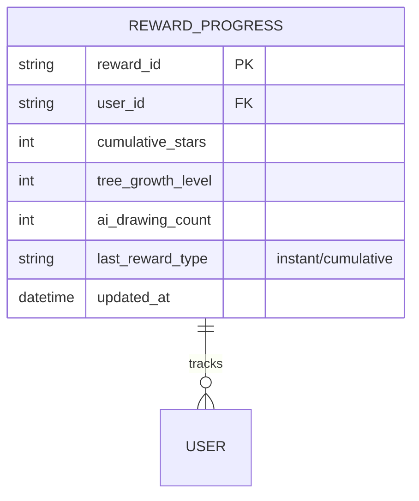
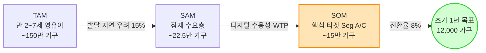

# PRD V07 Master 개선 패치 문서
- 대상 문서: `47_PRD_V07_Master_for_SRS.md`
- 근거 문서: `39_VPS_V09_final_UX_reinforce.md`
- 작성일: 2026-05-07
- 목적: VPS↔PRD 매핑 검토에서 발견된 7건의 결함을 보강하는 패치 문서

---

## 개선 #1: §3 Story S3 — Seg B 감정 동기 복원 (🟡 Mid)

### 현재 (As-Is)
> **As a** 데이터형 부모(Seg B), **I want** 주간 발달 추이를 수치/그래프로 확인 **so that** 훈련 효과를 가족에게 증명하고 **구독을 지속**할 수 있다.

### 개선 (To-Be)
> **As a** 데이터형 부모(Seg B), **I want** 주간 발달 추이를 수치/그래프로 확인 **so that** 훈련 효과를 가족에게 증명하여 **양육의 성취감을 인정받고** 구독 동기를 유지할 수 있다.

### 근거
VPS §1.4 Seg B JTBD 원문: *"가족(남편, 조부모)에게 아이의 성장을 증명하여 양육의 성취감을 인정받을 수 있다."* — "구독 지속"은 비즈니스 용어이며 사용자의 심리적 동기가 아님.

---

## 개선 #2: §1.3 — 북극성 KPI 선정 근거(ADR) 추가 (🟡 Mid)

### 현재 (As-Is)
§1.3 KPI 테이블 이후 W-AUR을 북극성으로 채택한 이유에 대한 설명 없음.

### 추가 삽입 (To-Be) — §1.3 테이블 직후
> **[ADR-001] 북극성 KPI 선정 근거**
> AOS 최고 점수(9.0)를 받은 O-1(5분 진단)은 일회성 유입 지표인 반면, O-2(대기 기간 즉시 홈케어)의 **"주간 미션 완수율(W-AUR)"은 반복적 제품 사용(리텐션)과 직결되는 선행 지표**입니다. 진단(O-1)은 유입 퍼널의 입구이고, 미션 완수(O-2)는 구독 유지와 매출(MRR)을 견인하는 핵심 행동이므로, 비즈니스 성장의 근본 동력으로서 북극성에 적합합니다.

---

## 개선 #3: §4.3 신설 — 수익 구조 및 비즈니스 모델 요약 (🔴 High)

### 현재 (As-Is)
VPS §11의 과금 모델, 수익 비중, 3개년 SOM 시나리오가 PRD 본문에 없음. §9.3에 "VPS §11 참조" 1줄만 존재.

### 추가 삽입 (To-Be) — §4.2 Gantt 직후, §5 NFR 직전

### 4.3 수익 구조 및 비즈니스 모델 요약

#### 과금 모델 (Freemium + Tiered Subscription)
| 티어 | 가격 | 포함 기능 |
|:---|:---:|:---|
| **Lead-Gen (무료)** | 0원 | AI 음성 진단(1회) + 또래 비교 리포트 |
| **Basic** | 월 35,000원 | 주간 맞춤 미션 + AI 자동 분석 리포트 + 발달 추이 그래프 |
| **Premium** | 월 50,000원 | Basic + 전문가(언어재활사) 비동기 코멘트 |
| **B2B 기관용** | 연 500,000원 | 무제한 스크리닝 대시보드 라이선스 (Phase 2) |

> **가격 수용성 근거**: 오프라인 센터 1회 5~8만원을 앵커로, 월 3.5만원은 "불안 해소 보험금"으로 지불 저항이 0에 수렴 (VPS §11.D).

#### 수익 비중
| 수익원 | 비중 | 설명 |
|:---|:---:|:---|
| B2C Basic 구독 (MRR) | 70% | 100% 자동화 AI 리포트 기반 (고마진 캐시카우) |
| B2C Premium 구독 (MRR) | 15% | 전문가 피드백 결합 업셀링 |
| B2B 기관 라이선스 (ARR) | 15% | 수익보다 B2C 리드 확보 채널 역할 |

#### 3개년 SOM 시나리오
| 구분 | Year 1 | Year 2 | Year 3 | 3년 누적 |
|:---|:---:|:---:|:---:|:---:|
| 유료 결제 가구 | 12,000 | 35,000 | 60,000 | — |
| B2C 구독 예상 매출 | ~50억 | ~147억 | ~252억 | **~449억** |
| 핵심 KPI | CVR≥8%, CAC≤3만 | M3≥40% | B2B CAC 1만↓ | LTV:CAC **≥4.0** |

*※ Basic 모델 100% 가정 보수적 최소치. Premium 업셀링·B2B 매출 제외. 출처: VPS §11*

---

## 개선 #4: §6.1 ERD — REWARD_PROGRESS 엔터티 추가 (🟡 Mid)

### 현재 (As-Is)
F12 게이미피케이션의 "나만의 나무 성장" 누적 보상 진행률을 추적할 엔터티가 ERD에 누락.

### 추가 삽입 (To-Be) — ERD 내 WEEKLY_REPORT 다음

---

## 개선 #5: §9 — AOS/DOS 정량 근거 원본 수치 인용 (🔴 High)

### 현재 (As-Is)
§9에 "VPS §3 참조"라는 포인터만 존재. AOS/DOS 점수 원본이 인용되지 않음.

### 추가 삽입 (To-Be) — §9.1 직전에 신규 서브섹션

### 9.0 정량적 기회 근거 — AOS/DOS 기회 통합 매트릭스

> AOS(성취 기회) = Imp + Max(Imp − Sat, 0) / DOS(고통 기회) = Imp + Max(MR − Sat, 0). **8.0 이상 = 초과 달성 필수 기회.**

| Desired Outcome | Imp | Sat | MR | AOS | DOS | PRD 연결 KPI |
|:---|:---:|:---:|:---:|:---:|:---:|:---|
| O-1 5분 내 객관적 수치화 | 5.0 | 1.0 | 4.5 | **9.0** | **8.5** | CVR ≥8% (§1.3) |
| O-2 대기 기간 맞춤 훈련 | 5.0 | 1.0 | 5.0 | **9.0** | **9.0** | W-AUR ≥60% 🌟 (§1.3) |
| O-3 노력 가시화 (62→71점) | 4.0 | 1.0 | 3.5 | **7.0** | **6.5** | M3 리텐션 ≥40% (§1.3) |
| O-4 기관 스크리닝 리포트 | 4.0 | 1.5 | 4.0 | **6.5** | **6.5** | 도입 수락률 ≥20% (§8.2) |
| O-5 교사 무입력 수집 | 1.0 | 1.0 | 4.8 | **1.0** | **4.8** | 승인율 ≥90% (§1.3) |

*출처: VPS §3 AOS/DOS 기회 통합 매트릭스*

---

## 개선 #6: §9 — JTBD 인터뷰 검증 상태 추가 (🔴 High)

### 현재 (As-Is)
5개 페르소나 JTBD의 검증 수준(완전/부분)이 PRD에 미반영. Seg B의 ⚠️부분 검증 상태가 누락.

### 추가 삽입 (To-Be) — §9.0 직후

### 9.0-b JTBD 인터뷰 검증 상태 (Switch Trigger)

| 가설 ID | 대상 (페르소나) | 검증 상태 | 핵심 발견 (Switch Trigger) |
|:---:|:---|:---:|:---|
| H-A | 불안형 (Seg A) | ✅ 완전 검증 | 또래 비교의 순간이 첫 앱 설치 유발 |
| H-C | 대기자 (Seg C) | ✅ 완전 검증 | 대기 중 죄책감이 유료 결제 전환의 최강 동력 |
| H-B | 데이터형 (Seg B) | ⚠️ **부분 검증** | 객관적 성적표가 구독 연장 조건이나 **표본 부족** → R6 리스크 연동 |
| H-D1 | 원장 (Seg D-1) | ✅ 완전 검증 | 원아 퇴소 방어용 외부 AI 리포트 절실 |
| H-D2 | 교사 (Seg D-2) | ✅ 완전 검증 | "1초도 쓸 시간 없다" → Zero-touch 필수 |

*출처: VPS §1.4 JTBD 선언문 및 §3 JTBD 인터뷰 결과*

---

## 개선 #7a: §9 — TAM-SAM-SOM 시장 규모 인용 (🔴 High)

### 현재 (As-Is)
TAM 150만, SAM 22.5만, SOM 15만, 초기 목표 12,000가구 수치가 PRD 본문 어디에도 없음.

### 추가 삽입 (To-Be) — §9.0-b 직후

### 9.0-c 시장 규모 근거 (TAM-SAM-SOM)

| 시장 계층 | 규모 | 산정 근거 |
|:---|:---:|:---|
| **TAM** | ~150만 가구 | 국내 만 2~7세 영유아 전체 가구 |
| **SAM** | ~22.5만 가구 | 건강검진 통계 기준 언어/인지 발달 지연 우려 비율 15% (실질 1,080~1,800억 원) |
| **SOM** | ~15만 가구 | 모바일 활용 적극 탐색 3040 부모 (Seg A, C) |
| **초기 1년 목표** | 12,000 가구 | SOM 대비 전환율 8% 적용 |

*출처: VPS §3-A TAM-SAM-SOM 시장 분석*

---

## 개선 #7b: §7.1 — R6 Seg B 부분 검증 리스크 추가 (🟡 Mid)

### 현재 (As-Is)
§7.1 리스크 테이블에 R1~R5까지만 존재. Seg B의 JTBD 부분 검증(⚠️)에 대한 리스크가 누락.

### 추가 삽입 (To-Be) — R5 행 아래에 R6 행 추가

| # | 리스크 (Risk) | 영향도 | 대응 및 완화 전략 (Mitigation) |
|:---:|:---|:---:|:---|
| R6 | **Seg B 가설 미완전 검증**: 데이터형 개입자(Seg B)의 JTBD가 ⚠️부분 검증 상태. "시계열 리포트가 실제 구독 연장을 견인한다"는 핵심 가설의 표본이 부족함 | 🟡 Mid | Phase 1 **EXP-2(리포트 리텐션 A/B)**에서 Seg B 코호트를 별도 분리 추적하여 M3 리텐션 목표(≥40%) 달성 여부를 우선 검증. 미달 시 리포트 구성 피벗 |

---

## 적용 가이드 요약

| # | 개선 항목 | PRD 적용 위치 | 우선순위 |
|:---:|:---|:---|:---:|
| 1 | S3 Story `so that` 감정 복원 | §3 Story S3 문장 교체 | 🟡 |
| 2 | 북극성 KPI ADR 추가 | §1.3 테이블 직후 삽입 | 🟡 |
| 3 | 수익 모델 §4.3 신설 | §4.2 Gantt와 §5 NFR 사이 삽입 | 🔴 |
| 4 | REWARD_PROGRESS ERD 추가 | §6.1 ERD에 엔터티 추가 | 🟡 |
| 5 | AOS/DOS 원본 수치 인용 | §9에 9.0 서브섹션 신설 | 🔴 |
| 6 | JTBD 검증 상태 테이블 | §9에 9.0-b 서브섹션 신설 | 🔴 |
| 7a | TAM-SAM-SOM 수치 인용 | §9에 9.0-c 서브섹션 신설 | 🔴 |
| 7b | R6 Seg B 리스크 추가 | §7.1 리스크 테이블에 행 추가 | 🟡 |
