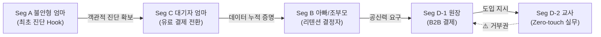
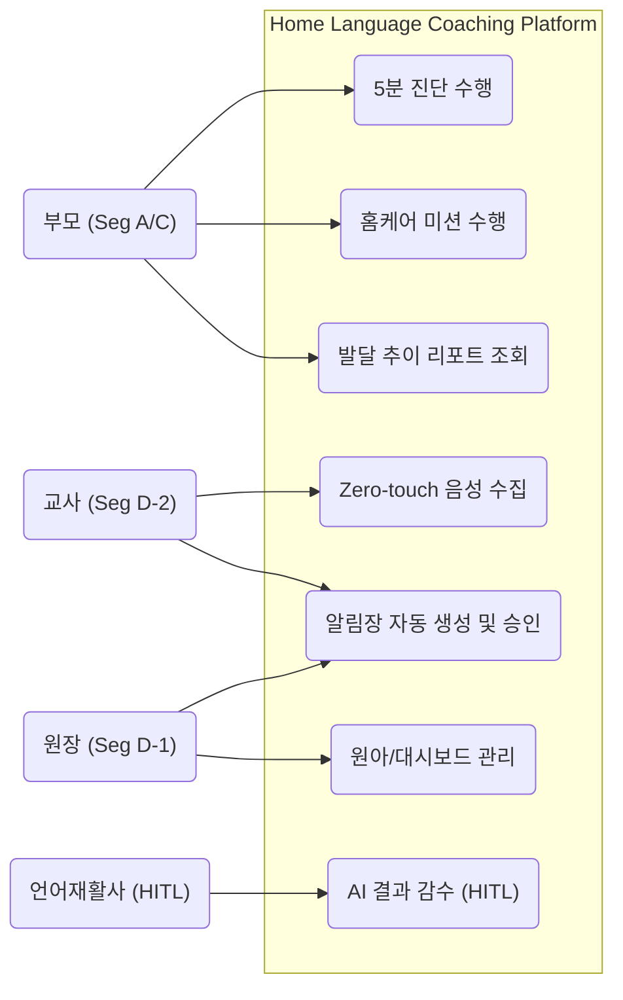
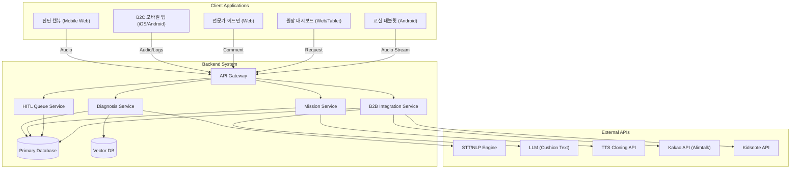
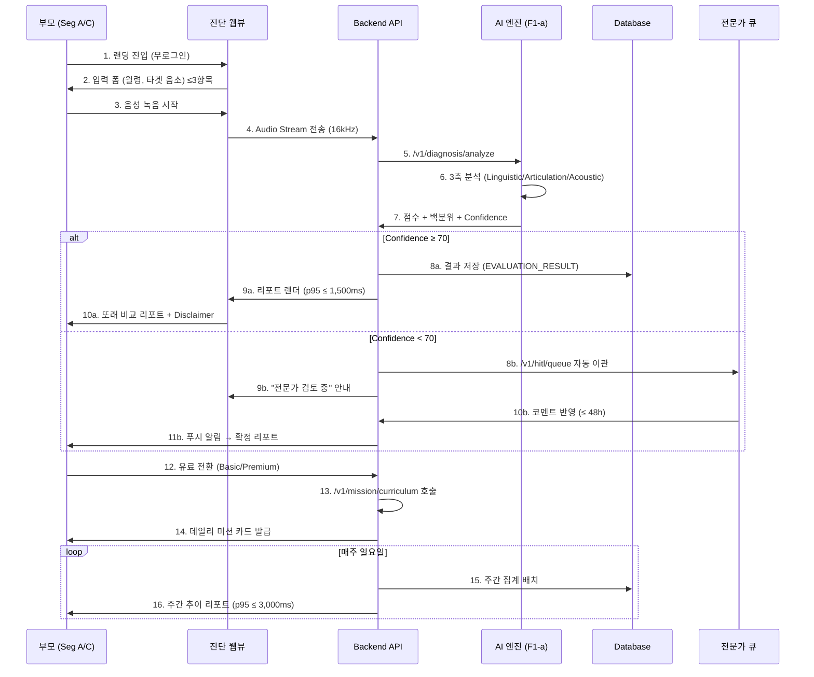
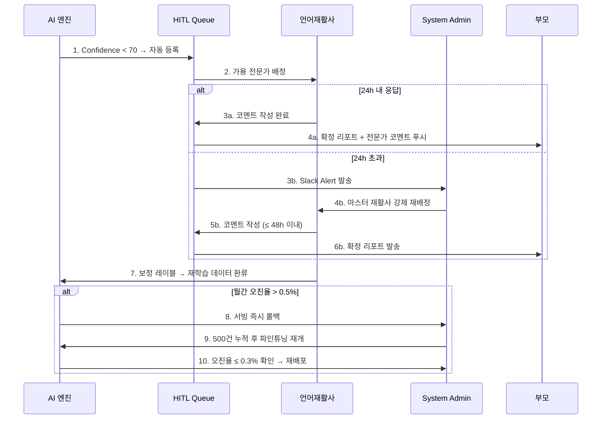
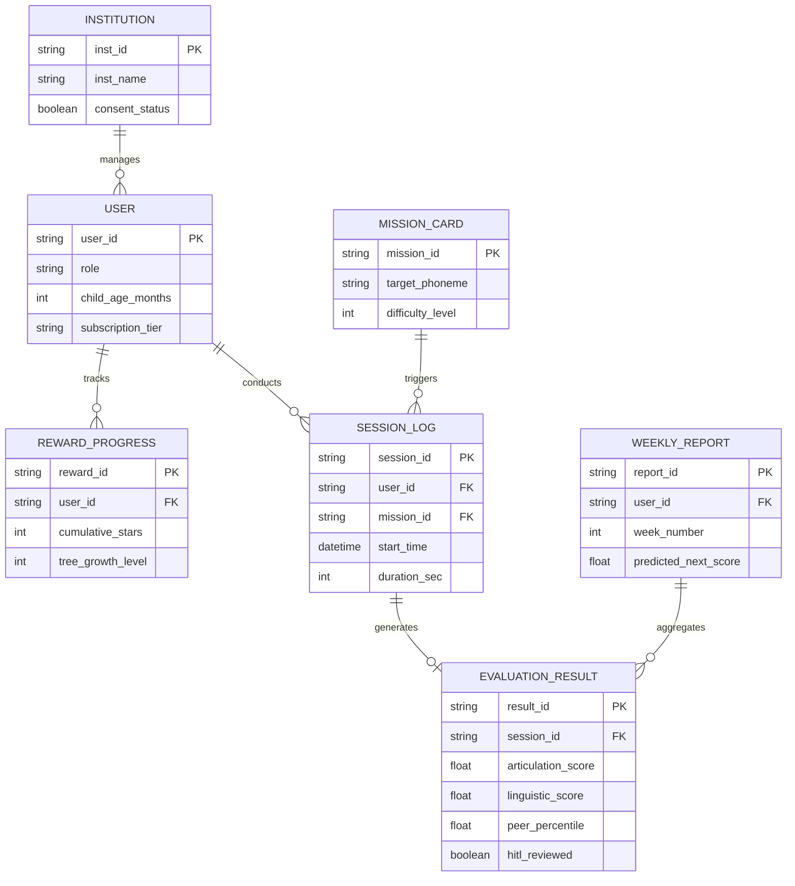
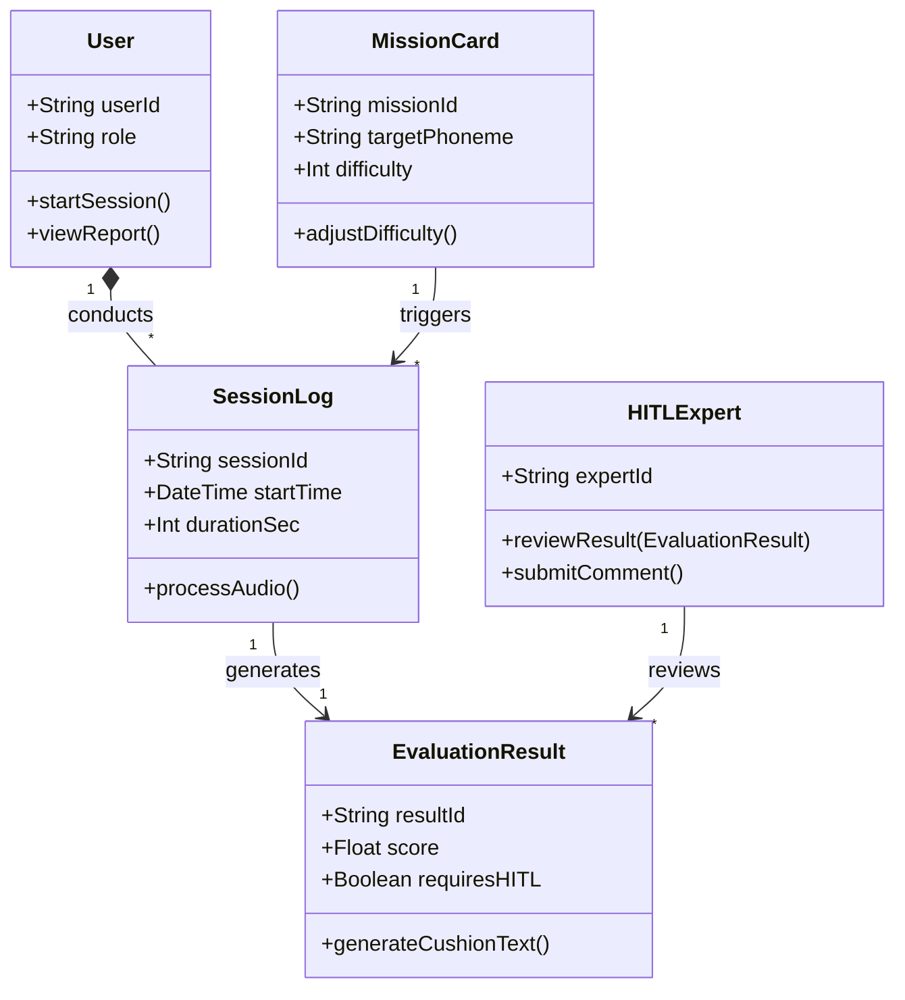
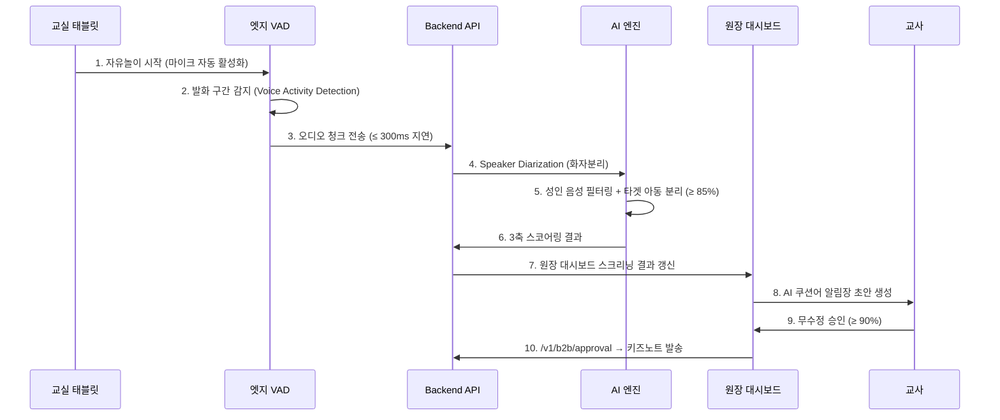
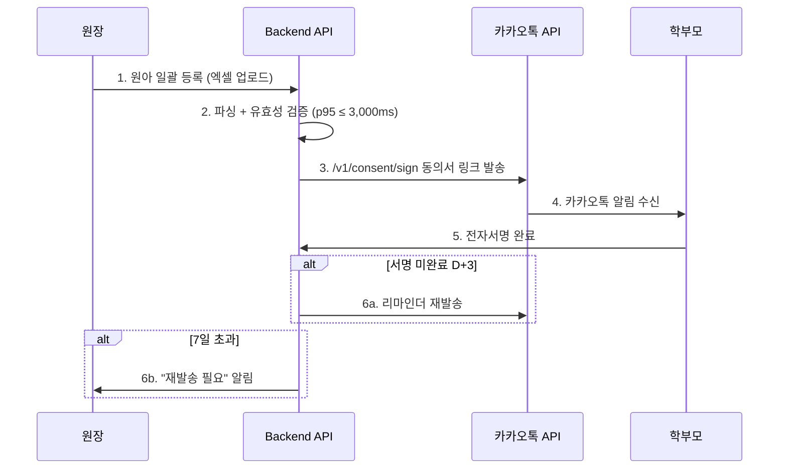

# Software Requirements Specification (SRS)
Document ID: SRS-001  
Revision: 1.0  
Date: 2026-05-07  
Standard: ISO/IEC/IEEE 29148:2018  
Source PRD: `54_PRD_V10_Final.md` (Home Language Coaching Platform PRD v1.0 Final)

---

## Part 1 of 6 — Introduction, Stakeholders, System Context

---

# 1. Introduction

## 1.1 Purpose

본 SRS는 **Home Language Coaching Platform**의 소프트웨어 요구사항을 ISO/IEC/IEEE 29148:2018 표준에 따라 정의한다. 본 시스템은 영유아(만 2~7세) 언어 발달 지연 문제에 대해 **AI 기반 즉각 스크리닝, 맞춤형 홈케어 미션, 전문가 감수(HITL)**를 결합하여 부모의 불안을 해소하고 골든타임 개입을 가능하게 하는 B2C/B2B 플랫폼이다.

### Design Philosophy — 4대 극한 (Four Extremes)

| 극한 | 정의 | 정량 목표 |
|:---|:---|:---|
| **시간의 극한** | 오프라인 초진 2~3개월 → `≤5분` 즉시 백분위 확인 | 리드타임 ≥17,000배 단축 |
| **마찰의 극한** | 교사 업무 추가 → 능동 조작 `0회` (Zero-touch) | 현장 마찰 100% 제거 |
| **지속의 극한** | 1개월 이탈 80% → M3 리텐션 `≥40%` | 숏폼 미션 + 즉각 보상 |
| **증명의 극한** | 주관적 판단 → `62→71점` 시계열 수치 증명 | 리포트 열람률 ≥60% |

### Business Context
- **TAM**: ~150만 가구 (만 2~7세 전체)
- **SAM**: ~22.5만 가구 (발달 지연 우려 15%)
- **SOM**: ~15만 가구 → 초기 1년 목표 12,000 가구 (CVR 8%)
- **수익 모델**: Freemium (무료 진단) → Basic ₩35,000/월 → Premium ₩50,000/월 → B2B ₩500,000/년

## 1.2 Scope

### In-Scope
| 영역 | 설명 | Phase |
|:---|:---|:---:|
| AI 스크리닝 | 영유아 음성 기반 3축 분석 + 또래 백분위 리포트 (웹뷰/앱) | P0 |
| B2C 홈케어 | 맞춤형 데일리 숏폼 미션 + 적응형 난이도 + 게이미피케이션 보상 | P0 |
| B2C 리텐션 | 주간 발달 추이 리포트 + 가족 공유 + 예측 시뮬레이션 | P1 |
| HITL 품질관리 | 전문가 비동기 감수 시스템 (48h SLA) | P1 |
| B2B 연동 | Zero-touch 화자분리 수집 + 원장 대시보드 + 전자서명 | P2 |

### Out-of-Scope
| 제외 항목 | 제외 사유 |
|:---|:---|
| 의료적 진단/장애 판정 | DTx 인허가 규제 리스크 (R1) |
| 실시간 원격 진료/텔레메디슨 | 의료법 저촉 + MVP 복잡도 과대 |
| 교정 훈련에 부모 음성 클로닝 적용 | 윤리적 딥페이크 리스크 |
| 일반 성인 대상 발음 교정 | 타겟 세그먼트 희석 |

## 1.3 Definitions, Acronyms, Abbreviations

| 용어 | 정의 |
|:---|:---|
| **W-AUR** | Weekly Active User Rate. 주간 미션 완수율. 북극성 KPI |
| **HITL** | Human-in-the-Loop. AI + 전문가 하이브리드 품질 보증 |
| **AOS / DOS** | Achievement/Dissatisfaction Opportunity Score. JTBD 기회 정량화 |
| **DMU** | Decision Making Unit. 구매 의사결정 이해관계자 그룹 |
| **CJM** | Customer Journey Map |
| **JTBD** | Jobs-to-be-Done |
| **MoSCoW** | Must/Should/Could/Won't 우선순위 분류 |
| **ADR** | Architecture Decision Record |
| **MRR / ARR** | Monthly/Annual Recurring Revenue |
| **CVR** | Conversion Rate. 무료→유료 전환율 |
| **CAC** | Customer Acquisition Cost |
| **LTV** | Lifetime Value |
| **Churn Rate** | 자발적 구독 해지율 |
| **M3 리텐션** | 구독 시작 3개월 시점 유효 구독 유지율 |
| **SLA / SLO** | Service Level Agreement / Objective |
| **MTTR** | Mean Time To Recovery |
| **RPO / RTO** | Recovery Point/Time Objective |
| **DTx** | Digital Therapeutics. 본 서비스는 DTx가 아닌 교육용 포지셔닝 |
| **VAD** | Voice Activity Detection. 엣지 디바이스 발화 구간 감지 |
| **STT** | Speech-to-Text |
| **NLP** | Natural Language Processing |
| **ABA** | Applied Behavior Analysis. 아동 행동 교정 방법론 |
| **K-CDI / REVT** | 한국판 의사소통 발달 검사 / 수용·표현 어휘력 검사 |
| **Zero-touch** | 교사 능동 조작이 전혀 없는 자동 수집 방식 |
| **FOMO** | Fear Of Missing Out |
| **SP** | Story Point (1 SP ≈ 시니어 개발자 1일) |
| **TAM / SAM / SOM** | Total/Serviceable Available/Obtainable Market |
| **VPS** | Value Proposition Sheet. 상위 전략 문서 |

## 1.4 References

| ID | 문서명 | 설명 |
|:---|:---|:---|
| **REF-01** | AOS/DOS 기회 통합 매트릭스 | PRD §9.0. O-1~O-5 기회 점수 |
| **REF-02** | JTBD 인터뷰 검증 상태 | PRD §9.0-b. 5개 가설 검증 결과 |
| **REF-03** | TAM-SAM-SOM 시장 분석 | PRD §9.0-c. 시장 규모 산정 |
| **REF-04** | PRD Traceability Matrix | PRD §9.1. 사전 분석 보고서 추적 |
| **REF-05** | VPS 원본 | `39_VPS_V09_final_UX_reinforce.md` |
| **REF-06** | PRD v1.0 Final | `54_PRD_V10_Final.md` |

## 1.5 Constraints, Assumptions & Dependencies

### 1.5.1 Architectural Constraints (ADR-01~04)

| Constraint ID | 제약 사항 | 시스템 영향 | 근거 |
|:---|:---|:---|:---|
| **CON-01** | **Zero-touch 수집 전면 도입**: 교사 능동 조작 원천 배제, 백그라운드 자동 수집만 허용 | 엣지 VAD + 오디오 버퍼링 아키텍처 필수 | ADR-01, R3 |
| **CON-02** | **HITL 비동기 감수 필수**: AI Confidence `< 70` 시 전문가 큐 자동 이관 | 재활사 어드민 뷰 + 큐 할당 시스템 필수 | ADR-02, R2 |
| **CON-03** | **원본 음성 ≤7일 폐기**: 보관 주기 후 즉시 파기, 비식별 벡터만 영구 보관 | 수집 즉시 벡터화 파이프라인 + 자동 파기 스크립트 | ADR-03, R4 |
| **CON-04** | **의료 용어 하드코딩 배제**: UI에서 '진단/장애' 배제, '스크리닝/백분위/놀이'로 치환 | FE 금칙어 정규식 스캐너 + 자동화 QA | ADR-04, R1 |

### 1.5.2 Risk Mitigation

| Risk ID | 리스크 | 영향도 | 완화 전략 |
|:---|:---|:---:|:---|
| R1 | 서비스가 의료행위로 취급 | 🔴 High | Disclaimer 강제 삽입 + 비의료 포지셔닝 |
| R2 | 유아 발음/교실 소음 STT 실패 | 🟡 Mid | 노이즈 튜닝 + HITL 48h 수정 |
| R3 | 교사 추가 업무로 도입 거부 | 🔴 High | Zero-touch 아키텍처 사수 |
| R4 | 영유아 음성 무단 수집/유출 | 🔴 High | 법정대리인 전자서명 + 7일 폐기 |
| R5 | 키즈노트 API 정책 변경 | 🟡 Mid | SMS/카카오톡 Fallback |
| R6 | Seg B 가설 미완전 검증 | 🟡 Mid | EXP-2 + 피벗 시나리오(Plan B) |

### 1.5.3 Assumptions

| ID | 가정 | 검증 실험 |
|:---|:---|:---:|
| A1 | 부모의 월 ₩35,000 지불 저항이 매우 낮음 | EXP-4 |
| A2 | 맘카페 바이럴 CTR ≥15% 자발적 발생 | §8.1 Beta |
| A3 | 부모가 매일 1~3분 기기 제공 의지 보유 | EXP-1 |
| A4 | 기관이 Zero-touch만으로 즉각 도입 결정 | EXP-3 |

### 1.5.4 Dependencies

| ID | 의존성 | Contingency Plan |
|:---|:---|:---|
| D1 | 한국어 아동 STT/NLP 초기 인식률 | 노이즈 캔슬링 + HITL 보정 |
| D2 | 카카오톡/키즈노트 API 가용성 | SMS + 웹링크 Fallback |
| D3 | 전문 언어재활사 Pool 수급 | 프리랜서 선제 구축 + 자동 할당 |
| D4 | 비의료 포지셔닝 규제 해석 | 로펌 컴플라이언스 검토서 확보 |

---

# 2. Stakeholders

| Seg | 역할 (Role) | 책임 (Responsibility) | 관심사 (Interest) | 성공 기준 (Success Criteria) |
|:---:|:---|:---|:---|:---|
| **Seg A** | 불안형 탐색자 (엄마) | B2C 최초 유입 및 의사결정 | 아이 발달 수준 즉각 객관화 | CVR `≥8%`, 체류 `≤5분` |
| **Seg C** | 센터 대기자 (엄마) | B2C 유료 결제 전환 | 골든타임 방치 해소 | 첫 주 미션 완료율 `≥70%` |
| **Seg B** | 데이터형 개입자 (가족) | B2C 구독 유지/리텐션 | 시계열 성과 증명 | M3 리텐션 `≥40%` |
| **Seg D-1** | 유치원 원장 | B2B 결제 및 도입 결정 | 학부모 민원 방어 | 알림장 승인율 `≥90%` |
| **Seg D-2** | 보육 교사 | B2B 실무 게이트키퍼 | 추가 업무 제로 | 능동 조작 `0회` |
| **HITL Expert** | 언어재활사 | AI 결과 감수 및 코멘트 | 오진 방지 + 재학습 데이터 | 피드백 `≤48h`, 오진율 `<0.5%` |
| **System Admin** | 플랫폼 운영자 | 모니터링 및 장애 대응 | 시스템 안정성 | Uptime `≥99.9%`, MTTR `<2h` |

### Stakeholder Dependency (DMU 영향력)

---

# 3. System Context and Interfaces

## 3.0 System Architecture & Use Case Overview

### 3.0.1 Use Case Diagram

### 3.0.2 System Component Diagram

## 3.1 External Systems

| 시스템 | 역할 | 연동 방식 | 관련 Epic |
|:---|:---|:---|:---|
| **카카오톡 알림톡 API** | 동의서 발송, 성과 뱃지 공유, Fallback 알림 | REST API | F5, F9-d, F10 |
| **키즈노트 API** | 기관 알림장 발송, 쿠션어 승인 | REST API (PATCH) | F9-d |
| **STT 엔진** | 음성→텍스트 변환 (한국어 아동 특화) | gRPC Streaming | F1-a |
| **LLM API** | 쿠션어 생성, 발화 유도 챗봇 | REST API | F9-d, F15 |
| **TTS 클로닝 API** | 부모 목소리 복제 동화 | REST API | F11 |
| **Amplitude** | 퍼널/코호트 분석, 이벤트 트래킹 | SDK + REST | 전체 |
| **Zendesk/Freshdesk** | CS SLA 트래킹 | REST API | 운영 |

## 3.2 Client Applications

| 클라이언트 | 플랫폼 | 설명 | Phase |
|:---|:---|:---|:---:|
| **진단 웹뷰** | Mobile Web (브라우저) | 무로그인 5분 진단 랜딩 | P0 |
| **B2C 모바일 앱** | iOS/Android (Hybrid) | 미션 수행, 리포트 열람, 보상 | P0 |
| **전문가 어드민** | Web (Desktop) | HITL 큐 관리, 코멘트 작성 | P1 |
| **원장 대시보드** | Web (Desktop/Tablet) | 기관 스크리닝, 알림장 관리 | P2 |
| **교실 태블릿** | Android Tablet | Zero-touch 음성 수집 앱 | P2 |

## 3.3 API Overview

| Endpoint | Method | 구분 | 입력 | 반환 | 제약 |
|:---|:---:|:---:|:---|:---|:---|
| `/v1/diagnosis/analyze` | POST | 내부 | Audio Stream (16kHz), 월령, 타겟 음소 | 3축 점수, 백분위, Confidence | p95 ≤ 800ms |
| `/v1/mission/curriculum` | GET | 내부 | 세션 이력 (정오답 패턴) | 추천 미션 ID, 난이도 레벨 | 연속 실패 3회 즉시 하향 |
| `/v1/report/weekly` | GET | 내부 | user_id, week_number | 주간 집계 데이터, 추이 JSON | p95 ≤ 3,000ms |
| `/v1/hitl/queue` | POST | 내부 | session_id, confidence_score | Queue 등록 확인, 예상 SLA | 즉시 등록 |
| `/v1/hitl/comment` | PATCH | 내부 | queue_id, expert_comment | 코멘트 반영 확인 | ≤ 48h SLA |
| `/v1/b2b/approval` | PATCH | 외부 | 기관ID, 알림장ID, 승인 여부 | HTTP 200 OK | 키즈노트 연동 |
| `/v1/consent/sign` | POST | 외부 | 동의서 템플릿, 학부모 식별자 | 서명 상태 트래킹 | 카카오톡 연동 |
| `/v1/reward/grant` | POST | 내부 | user_id, reward_type, amount | 보상 반영 확인 | ≤ 500ms |

## 3.4 Interaction Sequences (핵심 시퀀스 다이어그램)

### 3.4.1 B2C 핵심 플로우: 진단 → 미션 → 리포트

### 3.4.2 HITL 에스컬레이션 플로우

---

> **Part 1 완료.**

---

## Part 2 of 6 — Functional Requirements: Phase 0 (Must 6 Epics)

---

# 4. Specific Requirements

## 4.1 Functional Requirements

### Phase 0 — MVP 코어 (Must, 6 Epics)

#### Epic F1-a: 3축 AI 음성 분석 엔진

| REQ ID | 요구사항 | Source | Priority | Phase | Acceptance Criteria |
|:---|:---|:---:|:---:|:---:|:---|
| **REQ-FUNC-001** | 시스템은 16kHz 오디오 스트림을 수신하여 Linguistic, Articulation, Acoustic 3축 점수를 산출해야 한다. | S1 | Must | P0 | Given: 유아 발화 오디오 입력, When: `/v1/diagnosis/analyze` 호출, Then: 3축 float 점수 반환, 처리 실패율 `< 2%` |
| **REQ-FUNC-002** | 시스템은 3축 점수를 기반으로 동월령 또래 대비 백분위(peer_percentile)를 산출해야 한다. | S1 | Must | P0 | Given: 3축 점수 + 월령, When: 백분위 계산, Then: 0~100 사이 float 반환, K-CDI/REVT 척도 차용 |
| **REQ-FUNC-003** | 시스템은 각 분석 결과에 대해 AI Confidence Score(0~100)를 산출해야 한다. | S1, S6 | Must | P0 | Given: 분석 완료, When: Confidence 산출, Then: 70 미만 시 HITL 큐 자동 이관 트리거 |
| **REQ-FUNC-004** | 시스템은 STT 처리 실패 시 백그라운드에서 자동 재시도를 1회 수행해야 한다. | S1-AC2 | Must | P0 | Given: STT 타임아웃/오류, When: 최초 실패, Then: 자동 재시도 1회, 재시도 성공률 `≥ 98%` |
| **REQ-FUNC-005** | 시스템은 수집된 음성 원본을 분석 즉시 벡터로 변환하고 원본은 `≤ 7일` 내 자동 폐기해야 한다. | S5-AC4, CON-03 | Must | P0 | Given: 음성 수집 완료, When: 벡터 변환 후 7일 경과, Then: 원본 삭제 + AES-256 벡터 저장 |

**Exception Handling:**

| REQ ID | 예외 상황 | 처리 | Source |
|:---|:---|:---|:---:|
| **REQ-FUNC-006** | 마이크 접근 권한 거부 | OS 설정 이동 안내 모달 노출 | S1-Neg1 |
| **REQ-FUNC-007** | 주변 소음 60dB 이상 지속 | "조용한 곳으로 이동" 스낵바 팝업 | S1-Neg2 |

---

#### Epic F1-b: 무로그인 5분 진단 웹뷰

| REQ ID | 요구사항 | Source | Priority | Phase | Acceptance Criteria |
|:---|:---|:---:|:---:|:---:|:---|
| **REQ-FUNC-008** | 시스템은 회원가입/로그인 없이 브라우저에서 즉시 진단 세션을 시작할 수 있어야 한다. | S1 | Must | P0 | Given: 랜딩 페이지 진입, When: "진단 시작" 클릭, Then: 입력 폼 `≤ 3개 항목` 노출 |
| **REQ-FUNC-009** | 진단 전체 플로우(입력→녹음→분석→결과)의 체류시간은 `≤ 300초(5분)` 이내여야 한다. | S1-AC1 | Must | P0 | Given: 사용자 진입, When: 결과 확인, Then: 전체 체류시간 `≤ 300초` |
| **REQ-FUNC-010** | 결과 페이지 렌더링은 서버 분석 + 차트 포함 `p95 ≤ 1,500ms` 이내에 완료되어야 한다. | S1-AC3 | Must | P0 | Given: 세션 종료, When: 결과 렌더, Then: p95 ≤ 1,500ms |
| **REQ-FUNC-011** | 결과 페이지에 "의료적 판단 아님" Disclaimer가 노출률 `100%`로 표시되어야 한다. | S1-AC4, CON-04 | Must | P0 | Given: 결과 화면 진입, When: 렌더링, Then: Disclaimer 영역 노출률 100% |

---

#### Epic F2: 또래 비교 진단 리포트

| REQ ID | 요구사항 | Source | Priority | Phase | Acceptance Criteria |
|:---|:---|:---:|:---:|:---:|:---|
| **REQ-FUNC-012** | 시스템은 "상위 N%" 프레이밍의 넛지 카피를 포함한 또래 비교 리포트를 생성해야 한다. | S1, S3 | Must | P0 | Given: 분석 결과 생성, When: 리포트 렌더, Then: 백분위 그래프 + 넛지 카피 표시 |
| **REQ-FUNC-013** | 리포트 내 모든 텍스트에 금칙어(진단, 장애 등)가 포함되지 않아야 한다. | CON-04 | Must | P0 | Given: 리포트 생성, When: 정규식 스캔, Then: 금칙어 0건. 발각 시 렌더링 차단 |
| **REQ-FUNC-014** | 리포트 하단에 유료 전환 CTA(페이월)가 표시되어야 한다. | S3-AC3 | Must | P0 | Given: 무료 진단 완료, When: 리포트 열람, Then: 유료 전환 CTA 노출 |

---

#### Epic F3-a: 1분 숏폼 미션 카드 UI

| REQ ID | 요구사항 | Source | Priority | Phase | Acceptance Criteria |
|:---|:---|:---:|:---:|:---:|:---|
| **REQ-FUNC-015** | 시스템은 사용자 발달 수준에 맞는 개인화된 데일리 미션 카드를 발급해야 한다. | S2 | Must | P0 | Given: 유료 전환, When: 홈 화면 진입, Then: 개인화 미션 카드 노출 |
| **REQ-FUNC-016** | 미션 세션 길이는 `1~3분`이며, 세션 중 Drop-off 이탈률은 `< 10%`여야 한다. | S2-AC1 | Must | P0 | Given: 미션 시작, When: 아이 플레이, Then: 1~3분 세션, Drop-off `< 10%` |
| **REQ-FUNC-017** | 시스템은 미션 화면에 1~3분 타이머/진행바를 표시해야 한다. | S2 | Must | P0 | Given: 미션 진행 중, When: 화면 렌더, Then: 잔여 시간 진행바 표시 |
| **REQ-FUNC-018** | 시스템은 첫 7일간 개인화된 주간 미션을 제공하여 완료율 `≥ 70%`를 달성해야 한다. | S2-AC4 | Must | P0 | Given: 가입 후 첫 7일, When: 미션 발급, Then: 첫 주 미션 완료율 `≥ 70%` |

**Exception Handling:**

| REQ ID | 예외 상황 | 처리 | Source |
|:---|:---|:---|:---:|
| **REQ-FUNC-019** | 세션 중 1분 이상 발화 없음(침묵) | 거울 모드 또는 부모 개입 유도 툴팁 자동 팝업 | S2-Neg1 |
| **REQ-FUNC-020** | 일시적 네트워크 단절 | 오프라인 캐시 저장 → 연결 시 소급 보상 | S2-Neg2 |

---

#### Epic F3-b: 적응형 난이도 조절 엔진

| REQ ID | 요구사항 | Source | Priority | Phase | Acceptance Criteria |
|:---|:---|:---:|:---:|:---:|:---|
| **REQ-FUNC-021** | 시스템은 정오답 패턴을 실시간 로깅하고, 3회 연속 실패 시 난이도를 은밀히 하향 전환해야 한다. | S2-AC2 | Must | P0 | Given: 3회 연속 실패, When: 난이도 전환, Then: X표시/실패음 `0회`, 전환 지연 `< 0.5초` |
| **REQ-FUNC-022** | 시스템은 `/v1/mission/curriculum` API를 통해 세션 이력 기반 추천 미션을 반환해야 한다. | S2 | Must | P0 | Given: 세션 이력 입력, When: API 호출, Then: 난이도 레벨 + 추천 미션 ID 반환 |
| **REQ-FUNC-023** | 난이도 하향 후 세션 이탈률이 `< 5%`여야 한다. | CJM-B | Must | P0 | Given: 난이도 하향 전환 완료, When: 이후 세션, Then: 세션 이탈률 `< 5%` |

---

#### Epic F12: 게이미피케이션 보상 시스템

| REQ ID | 요구사항 | Source | Priority | Phase | Acceptance Criteria |
|:---|:---|:---:|:---:|:---:|:---|
| **REQ-FUNC-024** | 발화 성공 시 칭찬 파티클/드로잉 즉각 보상 UI를 `≤ 500ms` 내에 렌더링해야 한다. | S2-AC3 | Must | P0 | Given: 발화 성공, When: 보상 호출, Then: 파티클 렌더링 `≤ 500ms` |
| **REQ-FUNC-025** | 시스템은 누적 보상(별, 나무 레벨, AI 그림)을 REWARD_PROGRESS 엔터티에 저장해야 한다. | S2 | Must | P0 | Given: 보상 획득, When: `/v1/reward/grant`, Then: DB 반영 확인 |
| **REQ-FUNC-026** | 시스템은 누적 보상 도감 UI를 제공하여 아이의 성장 포트폴리오를 시각화해야 한다. | S2 | Must | P0 | Given: 도감 화면 진입, When: 렌더, Then: 별/나무/그림 누적 현황 표시 |

---

> **Phase 0 소계: REQ-FUNC-001 ~ REQ-FUNC-026 (26개)**

---

> **Part 2 완료.**

---

## Part 3 of 6 — Functional Requirements: Phase 1 (Should 10 Epics) + HITL

---

### Phase 1 — 리텐션/바이럴 (Should, 10 Epics)

#### Epic F4: 주간 발달 추이 리포트

| REQ ID | 요구사항 | Source | Priority | Phase | Acceptance Criteria |
|:---|:---|:---:|:---:|:---:|:---|
| **REQ-FUNC-027** | 매주 일요일 10시에 음소 단위 백분위 꺾은선 그래프를 자동 생성해야 한다. | S3-AC1 | Should | P1 | Given: 주간 종료, When: 배치 실행, Then: 그래프 생성 p95 `≤ 3,000ms` |
| **REQ-FUNC-028** | 리포트 하단에 "다음 주 예상 점수" 시뮬레이션을 표시해야 한다. | S3-AC3 | Should | P1 | Given: 리포트 열람, When: 시뮬레이션 클릭, Then: 클릭 유저 익월 유지율 비클릭 대비 `≥ 20%p↑` |
| **REQ-FUNC-029** | 주간 데이터 불충분 시 하락 그래프 대신 "미션 독려 및 이전 성과"를 표출해야 한다. | S3-Neg1 | Should | P1 | Given: 주간 데이터 부족, When: 리포트 생성, Then: 긍정적 메시지 + 이전 성과 표시 |

#### Epic F5: 카카오톡/SNS 공유

| REQ ID | 요구사항 | Source | Priority | Phase | Acceptance Criteria |
|:---|:---|:---:|:---:|:---:|:---|
| **REQ-FUNC-030** | 성과 뱃지를 카카오톡 가족 단톡방으로 전송할 수 있어야 한다. | S3-AC2 | Should | P1 | Given: 뱃지 획득, When: 공유 클릭, Then: 전송 성공률 `≥ 95%` |
| **REQ-FUNC-031** | 외부 API 장애 시 클립보드 "링크 복사"로 자동 폴백해야 한다. | S3-Neg2 | Should | P1 | Given: 카카오 API 장애, When: 공유 클릭, Then: 링크 복사 UI 전환 |

#### Epic F6: HITL 전문가 코멘트 대시보드

| REQ ID | 요구사항 | Source | Priority | Phase | Acceptance Criteria |
|:---|:---|:---:|:---:|:---:|:---|
| **REQ-FUNC-032** | 전문가 어드민 뷰에서 대기열을 확인하고 코멘트를 작성할 수 있어야 한다. | S6 | Should | P1 | Given: 큐 등록 건, When: 전문가 접근, Then: 세션 오디오 + AI 결과 표시 |
| **REQ-FUNC-033** | 큐 대기 시간이 24h 초과 시 자동 에스컬레이션해야 한다. | S6-Neg1 | Should | P1 | Given: 24h 초과, When: 모니터링, Then: Slack Alert + 가용 전문가 재배정 |
| **REQ-FUNC-034** | 월 3회 초과 이의제기 시 자동 반려 또는 CS 이관해야 한다. | S6-Neg2 | Should | P1 | Given: 동일 유저 3회+ 신고, When: 4회차, Then: 자동 반려 처리 |

#### Epic F7: 센터 제출용 PDF

| REQ ID | 요구사항 | Source | Priority | Phase | Acceptance Criteria |
|:---|:---|:---:|:---:|:---:|:---|
| **REQ-FUNC-035** | 발달 추이 데이터를 PDF 형식으로 다운로드/공유할 수 있어야 한다. | S3, CJM-A | Should | P1 | Given: 리포트 화면, When: PDF 다운로드, Then: 3축 점수 + 추이 포함 PDF 생성 |

#### Epic F11: 부모 목소리 복제 동화

| REQ ID | 요구사항 | Source | Priority | Phase | Acceptance Criteria |
|:---|:---|:---:|:---:|:---:|:---|
| **REQ-FUNC-036** | TTS 클로닝 API로 부모 음성 기반 동화 콘텐츠를 재생해야 한다. | CJM-C | Should | P1 | Given: 부모 음성 등록, When: 동화 재생, Then: 클로닝 음성 동화 출력 |
| **REQ-FUNC-037** | 클로닝 음성은 교정 훈련 콘텐츠에 적용되어서는 안 된다. | CON, Won't | Should | P1 | Given: 교정 미션, When: TTS 호출, Then: 시스템 기본 음성만 사용 |

#### Epic F14: 거울 모드

| REQ ID | 요구사항 | Source | Priority | Phase | Acceptance Criteria |
|:---|:---|:---:|:---:|:---:|:---|
| **REQ-FUNC-038** | 카메라 오버레이로 아이의 입 모양과 가이드를 비교 표시해야 한다. | CJM-C | Should | P1 | Given: 거울 모드 진입, When: 카메라 활성화, Then: 가이드 오버레이 렌더 |

#### Epic F15: LLM 대화형 발화 유도 챗봇

| REQ ID | 요구사항 | Source | Priority | Phase | Acceptance Criteria |
|:---|:---|:---:|:---:|:---:|:---|
| **REQ-FUNC-039** | LLM 기반 발화 유도 시나리오로 자연 발화를 수집해야 한다. | CJM-C | Should | P1 | Given: 챗봇 진입, When: 대화 시작, Then: 최초 세션 체류 `≥ 3분` |
| **REQ-FUNC-040** | 수집된 발화 데이터를 조음 분석 로깅에 자동 연동해야 한다. | S1 | Should | P1 | Given: 발화 수집, When: 세션 종료, Then: SESSION_LOG 자동 저장 |

#### Epic F16: 오프라인 일반화 푸시 알림

| REQ ID | 요구사항 | Source | Priority | Phase | Acceptance Criteria |
|:---|:---|:---:|:---:|:---:|:---|
| **REQ-FUNC-041** | 컨텍스트 기반 오프라인 케어 연계 푸시를 스케줄링해야 한다. | CJM | Should | P1 | Given: 미션 완료, When: 24h 후, Then: 오프라인 일반화 팁 푸시 발송 |

#### Epic F17: 통합 케어로그

| REQ ID | 요구사항 | Source | Priority | Phase | Acceptance Criteria |
|:---|:---|:---:|:---:|:---:|:---|
| **REQ-FUNC-042** | 센터 오프라인 기록과 앱 세션을 타임라인 UI로 통합 표시해야 한다. | CJM-C | Should | P1 | Given: 케어로그 진입, When: 렌더, Then: 앱+센터 기록 시간순 통합 |
| **REQ-FUNC-043** | 주 2회 이상 기록 유지율 `≥ 40%`를 달성해야 한다. | CJM-C KPI | Should | P1 | Given: 2개월 사용, When: 기록 빈도 측정, Then: 주 2회+ 유지율 `≥ 40%` |

#### Epic F18: 발달 예측 시뮬레이션

| REQ ID | 요구사항 | Source | Priority | Phase | Acceptance Criteria |
|:---|:---|:---:|:---:|:---:|:---|
| **REQ-FUNC-044** | 회귀 모델 기반 다음 주 예상 점수를 산출하여 리포트에 표시해야 한다. | S3-AC3 | Should | P1 | Given: 주간 데이터 집계, When: 예측 산출, Then: 예상 점수 + 신뢰구간 표시 |
| **REQ-FUNC-045** | 시뮬레이션 클릭 이벤트를 Amplitude로 트래킹해야 한다. | S3-AC3 | Should | P1 | Given: 시뮬레이션 영역, When: 클릭, Then: Amplitude 이벤트 전송 |

---

### Cross-cutting — HITL 안전 프로토콜 (4원칙)

| REQ ID | 요구사항 | Source | Priority | Phase | Acceptance Criteria |
|:---|:---|:---:|:---:|:---:|:---|
| **REQ-FUNC-HITL-001** | AI Confidence `< 70` 또는 사용자 이의제기 시 전문가 큐로 즉시 자동 이관해야 한다. | HITL-자동에스컬레이션 | Must | P1 | Given: Confidence < 70 또는 "재검토" 클릭, When: 감지, Then: 큐 즉시 등록 |
| **REQ-FUNC-HITL-002** | 모든 UI 텍스트에서 금칙어(진단, 장애)를 정규식 스캐닝으로 자동 탐지해야 한다. | HITL-의료판단회피 | Must | P1 | Given: 리포트/UI 렌더, When: 배포/정기 스캔, Then: 금칙어 발각 시 렌더링 차단 |
| **REQ-FUNC-HITL-003** | 이관 건에 대해 영업일 48h 이내 100% 피드백을 완료해야 한다. | HITL-SLA보장 | Must | P1 | Given: 큐 등록, When: 48h 임박, Then: 미완료 시 마스터 재활사 강제 이관 |
| **REQ-FUNC-HITL-004** | 전문가 보정 레이블을 모델 파인튜닝 데이터로 환류해야 한다. | HITL-루프백 | Must | P1 | Given: 보정 완료, When: 월간 점검, Then: 오진율 > 0.5% → 롤백, 500건 누적 후 재학습, ≤ 0.3% 확인 후 재배포 |

---

> **Phase 1 소계: REQ-FUNC-027 ~ REQ-FUNC-045 (19개) + REQ-FUNC-HITL-001 ~ 004 (4개) = 23개**
> **누적 합계: 49개**

---

> **Part 3 완료.**

---

## Part 4 of 6 — Functional Requirements: Phase 2 (Could 5 Epics)

---

### Phase 2 — B2B 스케일업 (Could, 5 Epics)

#### Epic F9-a: 원장용 대시보드 UI

| REQ ID | 요구사항 | Source | Priority | Phase | Acceptance Criteria |
|:---|:---|:---:|:---:|:---:|:---|
| **REQ-FUNC-046** | 반/원아 단위 스크리닝 결과를 대시보드로 표시해야 한다. | S4 | Could | P2 | Given: 기관 로그인, When: 대시보드 진입, Then: 반별 원아 스크리닝 현황 표시 |
| **REQ-FUNC-047** | 원장 명의 헤더/로고 커스터마이징을 지원해야 한다. | S4-AC2 | Could | P2 | Given: 커스텀 ON, When: 프리뷰, Then: 헤더/로고 변경 렌더 `≤ 1초` |
| **REQ-FUNC-048** | ROI 시뮬레이터(1,100% ROI)를 제공해야 한다. | F9-a | Could | P2 | Given: 대시보드 접근, When: ROI 탭 클릭, Then: 투자 대비 효과 시뮬레이션 표시 |

#### Epic F9-b: Zero-touch 화자분리 수집

| REQ ID | 요구사항 | Source | Priority | Phase | Acceptance Criteria |
|:---|:---|:---:|:---:|:---:|:---|
| **REQ-FUNC-049** | 교실 태블릿에서 교사 능동 조작 없이 백그라운드 자동 수집해야 한다. | S5-AC1, CON-01 | Could | P2 | Given: 태블릿 ON, When: 자유놀이, Then: 교사 조작 `평균 0회` |
| **REQ-FUNC-050** | 60dB 환경에서 Speaker Diarization 정확도 `≥ 85%`를 달성해야 한다. | S5-AC2 | Could | P2 | Given: 10인+ 교실, When: 화자분리, Then: 타겟 아동 분리 정확도 `≥ 85%` |
| **REQ-FUNC-051** | 엣지 VAD 모듈로 발화 구간을 자동 감지하고 오디오를 버퍼링/전송해야 한다. | CON-01 | Could | P2 | Given: 발화 감지, When: VAD 트리거, Then: 청크 전송 지연 `≤ 300ms` |

**Exception Handling:**

| REQ ID | 예외 상황 | 처리 | Source |
|:---|:---|:---|:---:|
| **REQ-FUNC-052** | 기기 마이크 고장/Mute | 원장/교사에게 즉각 경고 푸시 | S5-Neg1 |
| **REQ-FUNC-053** | 7일 자동 폐기 스크립트 실패 | 재시도 3회 → 강제 삭제 큐 + 어드민 경고 | S5-Neg2 |

#### Epic F9-c: 원아 일괄등록 및 동의서 발송

| REQ ID | 요구사항 | Source | Priority | Phase | Acceptance Criteria |
|:---|:---|:---:|:---:|:---:|:---|
| **REQ-FUNC-054** | 100명 원아 엑셀 업로드를 파싱하여 일괄 등록해야 한다. | S4-AC1 | Could | P2 | Given: 엑셀 업로드, When: 파싱, Then: 처리 완료 p95 `≤ 3,000ms` |
| **REQ-FUNC-055** | 필수 항목 누락/오류 시 해당 행 하이라이트 및 인라인 수정 UI를 제공해야 한다. | S4-Neg1 | Could | P2 | Given: 오류 행 발견, When: 파싱 완료, Then: 즉시 행 하이라이트 + 수정 UI |

#### Epic F9-d: AI 쿠션어 알림장

| REQ ID | 요구사항 | Source | Priority | Phase | Acceptance Criteria |
|:---|:---|:---:|:---:|:---:|:---|
| **REQ-FUNC-056** | LLM으로 학부모 대상 쿠션어 알림장 초안을 자동 생성해야 한다. | S5-AC3 | Could | P2 | Given: 스크리닝 완료, When: 알림장 생성, Then: 쿠션어 초안 표시 |
| **REQ-FUNC-057** | 교사가 수정 없이 그대로 발송 승인하는 비율 `≥ 90%`여야 한다. | S5-AC3 | Could | P2 | Given: 초안 생성, When: 교사 검토, Then: 무수정 승인율 `≥ 90%` |
| **REQ-FUNC-058** | 키즈노트 API를 통해 알림장을 발송해야 한다. | S5 | Could | P2 | Given: 승인 완료, When: `/v1/b2b/approval`, Then: 키즈노트 전송 성공 |

#### Epic F10: 학부모 동의서 자동 생성/전자서명

| REQ ID | 요구사항 | Source | Priority | Phase | Acceptance Criteria |
|:---|:---|:---:|:---:|:---:|:---|
| **REQ-FUNC-059** | 카카오톡을 통해 법정대리인 전자서명 링크를 발송해야 한다. | S4-AC3 | Could | P2 | Given: 동의서 생성, When: `/v1/consent/sign`, Then: 카카오톡 링크 발송 |
| **REQ-FUNC-060** | 서명 완료율 `≥ 85%`를 유도하는 리마인더를 발송해야 한다. | S4-AC3 | Could | P2 | Given: 서명 미완료, When: D+3, Then: 리마인더 발송 |
| **REQ-FUNC-061** | 서명 링크 기한(7일) 초과 시 만료 안내 및 재발송 알림을 교사에게 보내야 한다. | S4-Neg2 | Could | P2 | Given: 7일 초과, When: 기한 만료, Then: 교사에게 "재발송 필요" 알림 |

---

> **Phase 2 소계: REQ-FUNC-046 ~ REQ-FUNC-061 (16개)**
> **전체 REQ-FUNC 합계: 26 + 23 + 16 = 65개**

---

> **Part 4 완료.**

---

## Part 5 of 6 — Non-Functional Requirements + Traceability Matrix

---

## 4.2 Non-Functional Requirements

### 성능 (Performance)

| REQ ID | 항목 | 임계치 | 연결 AC | 측정 방법 |
|:---|:---|:---|:---:|:---|
| **REQ-NF-001** | 진단/분석 리포트 API 응답 | `p95 ≤ 800ms` | S1-AC3 | APM p95 모니터링 |
| **REQ-NF-002** | 오디오 스트리밍/STT 청크 전송 지연 | `≤ 300ms` | S1-AC2 | 네트워크 레이턴시 측정 |
| **REQ-NF-003** | 모바일 앱 Cold Start | `≤ 1.5초` | 공통 | QA 성능 테스트 스크립트 |
| **REQ-NF-004** | 주간 리포트/대시보드 렌더링 | `p95 ≤ 3,000ms` | S3-AC1 | FE 성능 모니터링 |
| **REQ-NF-005** | 보상 UI 렌더링 | `≤ 500ms` | S2-AC3 | FE 성능 측정 |
| **REQ-NF-006** | 원아 일괄 업로드 파싱 | `p95 ≤ 3,000ms` | S4-AC1 | BE 벤치마크 |

### 가용성/SLA (Availability)

| REQ ID | 항목 | 타겟 SLA | 조치 기준 |
|:---|:---|:---|:---|
| **REQ-NF-007** | 시스템 Uptime | `≥ 99.9%` | 월간 다운타임 ≤ 43분 |
| **REQ-NF-008** | MTTR | `< 2시간` | Sev 1/2 장애 인지 후 복구 |
| **REQ-NF-009** | RPO | `< 1시간` | 시간당 DB 스냅샷 백업 |
| **REQ-NF-010** | RTO | `< 4시간` | 전체 인프라 재해 복구 |
| **REQ-NF-011** | CS 최초 응답 | `< 4시간` | Zendesk SLA 트래킹, 초과 시 에스컬레이션 |
| **REQ-NF-012** | HITL 피드백 완료 | `< 48시간` | 초과 시 마스터 재활사 자동 이관 |

### 신뢰성 (Reliability)

| REQ ID | 항목 | 임계치 |
|:---|:---|:---|
| **REQ-NF-013** | 오디오 인코딩/처리 오류율 | `≤ 0.5%` |
| **REQ-NF-014** | 분석 실패 후 재시도 성공률 | `≥ 98%` |
| **REQ-NF-015** | B2B 교실 화자분리 정확도 (60dB) | `≥ 85%` |

### 보안 (Security)

| REQ ID | 항목 | 기준 |
|:---|:---|:---|
| **REQ-NF-016** | 영유아 음성 원본 보관 | `≤ 7일` 후 즉시 폐기 |
| **REQ-NF-017** | 민감 데이터 암호화 | `AES-256` |
| **REQ-NF-018** | AI API 호출 비용 통제 | 유저당 월 구독료의 `15% 이내` (≤ ₩5,250) |

### 모니터링 (Monitoring)

| REQ ID | 대시보드 | Alert 기준 |
|:---|:---|:---|
| **REQ-NF-019** | 퍼널 전환 | 일간 CVR 변동 `±20%` 시 Alert |
| **REQ-NF-020** | 시스템 품질 | STT 500 에러율 5분 내 `3%` 초과 시 Slack Alert |
| **REQ-NF-021** | 비즈니스 | LTV:CAC `< 3.0` 하락 시 주간 그로스 리뷰 트리거 |
| **REQ-NF-022** | HITL 큐 운영 | 24h 초과 `3건+` 시 Alert + 자동 배정 |
| **REQ-NF-023** | B2B API 연동 | 에러율 1h 내 `5%` 초과 시 Fallback + Alert |

### KPI 지표 (Business Metrics)

| REQ ID | KPI | 목표값 | 측정 주기 |
|:---|:---|:---|:---:|
| **REQ-NF-024** | W-AUR (북극성) | `≥ 60%` | 주간 |
| **REQ-NF-025** | M3 리텐션 | `≥ 40%` | 월간 |
| **REQ-NF-026** | 무료→유료 CVR | `≥ 8%` | 주간 |
| **REQ-NF-027** | Zero-touch 승인율 | `≥ 90%` | PoC 종료 |
| **REQ-NF-028** | 오진 치명 수정률 | `< 0.5%` | 월간 |
| **REQ-NF-029** | Churn Rate | `≤ 5%` | 월간 |
| **REQ-NF-030** | 세션 중도 이탈률 | `< 10%` | 주간 |

> **NFR 합계: REQ-NF-001 ~ REQ-NF-030 (30개)**

---

# 5. Traceability Matrix

| Story | REQ-FUNC IDs | REQ-NF IDs | Test Case ID |
|:---|:---|:---|:---|
| **S1** (5분 진단) | 001~014 | NF-001, NF-002, NF-003 | TC-S1-001 ~ TC-S1-014 |
| **S2** (홈케어 미션) | 015~026 | NF-005, NF-024, NF-030 | TC-S2-001 ~ TC-S2-012 |
| **S3** (주간 리포트) | 027~031, 035, 044~045 | NF-004, NF-025 | TC-S3-001 ~ TC-S3-008 |
| **S4** (기관 대시보드) | 046~048, 054~055 | NF-006, NF-027 | TC-S4-001 ~ TC-S4-005 |
| **S5** (Zero-touch) | 049~053, 056~058 | NF-015, NF-016 | TC-S5-001 ~ TC-S5-008 |
| **S6** (HITL) | 032~034, HITL-001~004 | NF-012, NF-028 | TC-S6-001 ~ TC-S6-007 |
| **공통** | 059~061 | NF-007~011, NF-013~014, NF-017~023 | TC-COM-001 ~ TC-COM-015 |

---

> **Part 5 완료.**

---

## Part 6 of 6 — Appendix

---

# 6. Appendix

## 6.1 API Endpoint List

| # | Endpoint | Method | 구분 | 관련 REQ | SLA |
|:---:|:---|:---:|:---:|:---|:---|
| 1 | `/v1/diagnosis/analyze` | POST | 내부 | 001~003 | p95 ≤ 800ms |
| 2 | `/v1/mission/curriculum` | GET | 내부 | 022 | 연속 실패 3회 즉시 하향 |
| 3 | `/v1/report/weekly` | GET | 내부 | 027~029, 044 | p95 ≤ 3,000ms |
| 4 | `/v1/hitl/queue` | POST | 내부 | HITL-001 | 즉시 등록 |
| 5 | `/v1/hitl/comment` | PATCH | 내부 | 032, HITL-003 | ≤ 48h SLA |
| 6 | `/v1/b2b/approval` | PATCH | 외부 | 058 | 키즈노트 연동 |
| 7 | `/v1/consent/sign` | POST | 외부 | 059~061 | 카카오톡 연동 |
| 8 | `/v1/reward/grant` | POST | 내부 | 024~025 | ≤ 500ms |

## 6.2 Entity & Data Model

### 6.2.1 Entity Relationship Diagram (ERD)

### 6.2.2 Domain Class Diagram

### 6.2.3 Data Dictionary

| Entity | PK | 주요 필드 | 관계 |
|:---|:---|:---|:---|
| **USER** | user_id | role (A/B/C/D-1/D-2), child_age_months, target_sound, subscription_tier | 1:N SESSION_LOG |
| **SESSION_LOG** | session_id | start_time, duration_sec, audio_vector_uri, session_type | 1:1 EVALUATION_RESULT, N:1 MISSION_CARD |
| **EVALUATION_RESULT** | result_id | articulation_score, linguistic_score, acoustic_score, peer_percentile, ai_cushion_text, hitl_reviewed | N:1 WEEKLY_REPORT |
| **INSTITUTION** | inst_id | inst_name, principal_name, consent_status, logo_uri | 1:N USER |
| **MISSION_CARD** | mission_id | target_phoneme, difficulty_level, reward_type | 1:N SESSION_LOG |
| **WEEKLY_REPORT** | report_id | week_number, score_trend_json, predicted_next_score, generated_at | 1:N EVALUATION_RESULT |
| **REWARD_PROGRESS** | reward_id | user_id (FK), cumulative_stars, tree_growth_level, ai_drawing_count, last_reward_type, updated_at | N:1 USER |

## 6.3 Detailed Interaction Models

### 6.3.1 B2B Zero-touch 수집 플로우

### 6.3.2 전자서명 동의서 플로우

## 6.4 Implementation Timeline

PRD §4.2 Gantt 차트 참조. Phase 0(2026-06~08) → Phase 1(2026-08~11) → Phase 2(2026-10~2027-01). 총 230 SP, 병렬 FE/BE 2트랙 시 약 24~28주.

## 6.5 Validation Plan (EXP-1~4)

| 실험 ID | 가설 | 설계 | 성공 기준 | Phase |
|:---|:---|:---|:---|:---:|
| **EXP-1** | 코칭 톤 > DTx 톤 전환율 | A/B (n=500, 2주) | CVR `+2%p` | P0 |
| **EXP-2** | 예측 시뮬레이션 → M3 리텐션 향상 | A/B (n=800, 4~8주) | M3 `≥ 40%` | P1 |
| **EXP-3** | Zero-touch → 기관 수락률 증가 | PoC (10개 기관) | 조작 0회 + 수락률 `≥ 20%` | P2 |
| **EXP-4** | 앵커링 가격 → 결제 시작률 증가 | Paywall A/B (n=1,000, 2주) | 결제 시작률 `+5%p` | P0 |

## 6.6 Contingency Plan (R6 피벗 시나리오)

EXP-2 결과 M3 리텐션 40% 미달 시:

| 피벗 조치 | 대상 Epic | 변경 내용 |
|:---|:---|:---|
| F4 재설계 | F4 | 정적 그래프 → F18 예측 시뮬레이션 최상단 승격 |
| F12 보상 강화 | F12 | 월간 성장 리포트 + 보상 연동, 해지 시 손실 체감 극대화 |
| F5 공유 리디자인 | F5 | 뱃지 → 아이 성장 스토리 카드로 감성적 내러티브 전환 |
| EXP-2b 후속 | 신규 | 피벗 후 4주 재측정 (n=400), M3 ≥ 35% 미달 시 Seg B 타겟 축소 |

## 6.7 ADR Reference

| ADR ID | 결정 | 대안 | 사유 | 영향 | 근거 |
|:---|:---|:---|:---|:---|:---|
| **ADR-01** | Zero-touch 수집 전면 도입 | 교사 수동 녹음 | 교사 업무 가중 → B2B 100% 실패 | 엣지 VAD + 버퍼링 필수 | Seg D-2, R3 |
| **ADR-02** | HITL 비동기 감수 | AI 단독 판정 | 1건 오진 → 규제 + 맘카페 민원 | 어드민 + 큐 시스템 필수 | Seg B, R2 |
| **ADR-03** | 원본 음성 즉각 폐기 | 원본 영구 보관 | 아동보호법 위반 | 벡터화 파이프라인 + 폐기 스크립트 | R4 |
| **ADR-04** | 의료 용어 하드코딩 배제 | 임상 용어 노출 | 방어기제 자극 + DTx 인허가 회피 | 금칙어 스캐너 + QA 자동화 | Seg D-1, R1 |

---

# 문서 요약 통계

| 구분 | 항목 수 |
|:---|:---:|
| **Functional Requirements (REQ-FUNC)** | 65개 |
| **HITL Cross-cutting (REQ-FUNC-HITL)** | 4개 |
| **Non-Functional Requirements (REQ-NF)** | 30개 |
| **총 Requirements** | **99개** |
| **시퀀스 다이어그램** | 4개 (§3.4 × 2 + §6.3 × 2) |
| **Entity** | 7개 |
| **API Endpoint** | 8개 |
| **실험 설계** | 4건 (EXP-1~4) |
| **ADR** | 4건 |

---

**— End of SRS-001 v1.0 —**
