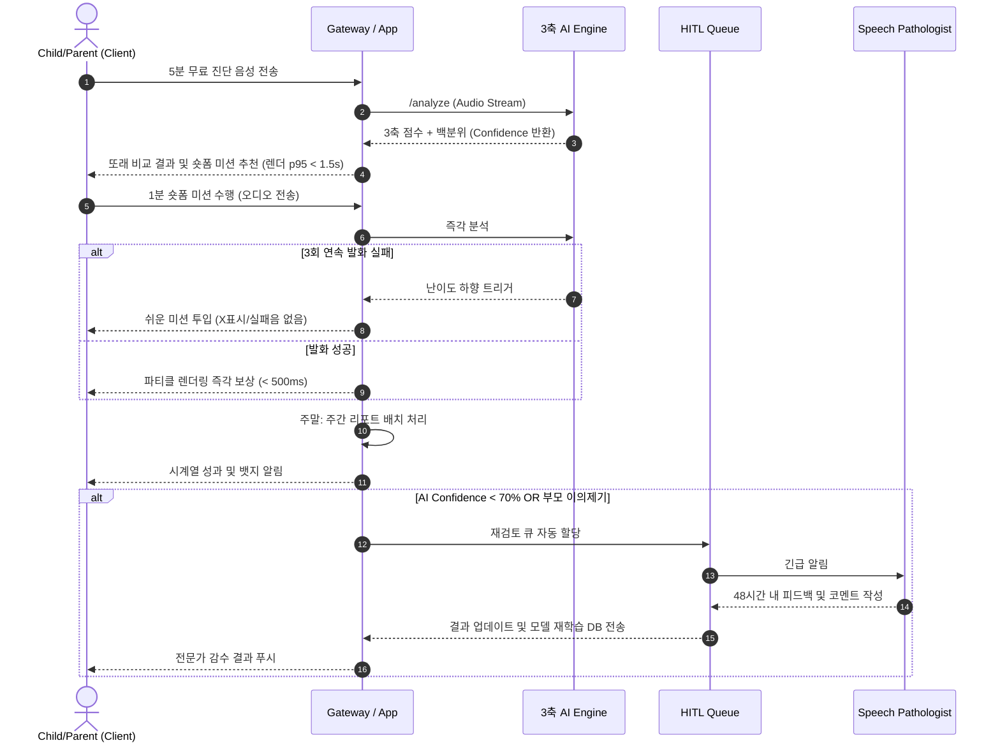
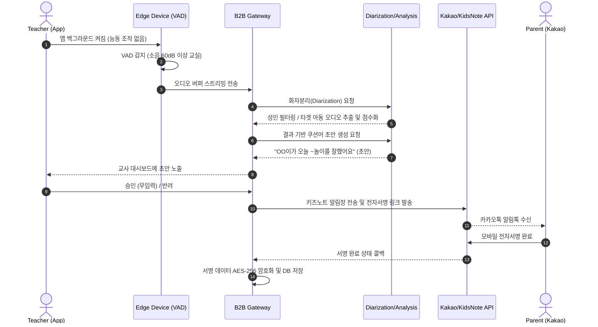
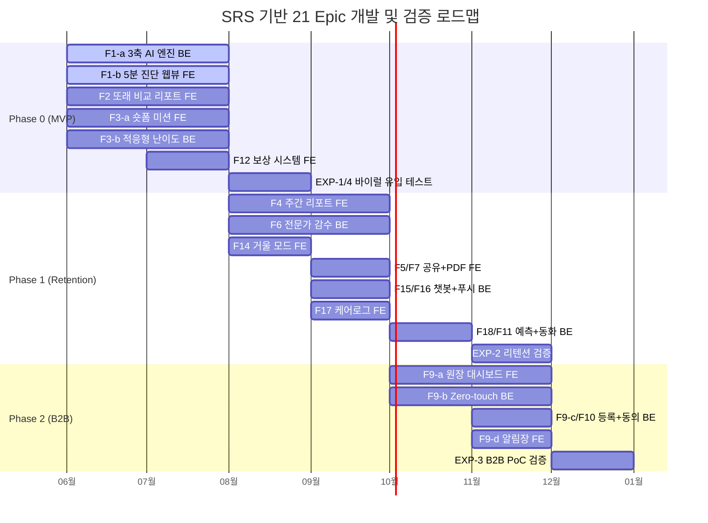

# Software Requirements Specification (SRS)
Document ID: SRS-001
Revision: 1.0
Date: 2026-05-08
Standard: ISO/IEC/IEEE 29148:2018

---

## 1. Introduction

### 1.1 Purpose
본 Software Requirements Specification(SRS) 문서는 "Home Language Coaching Platform"의 완전하고 상세하며 테스트 가능한 소프트웨어 요구사항을 명세합니다. 본 시스템의 주요 목적은 영유아 발달/언어 치료 시장의 '수요 폭증과 공급 병목'이라는 구조적 모순을 해결하는 것입니다.
현재 시장의 오프라인 초진 대기 지연(2~3개월), 홈케어 동력 상실(1개월 내 이탈 80%+), 그리고 보육 기관 내 치료 권유 딜레마(민원 갈등) 등의 문제를 해결하기 위해, 다음과 같은 비즈니스 컨텍스트와 설계 철학을 가집니다.

**비즈니스 컨텍스트 (Business Context)**
본 플랫폼은 Freemium 및 Tiered Subscription 모델로 운영되며, B2C Basic(월 3.5만원), Premium(월 5만원) 모델을 통해 지속적인 수익(MRR)을 창출하고, B2B 기관용 스크리닝 라이선스(ARR)를 통해 유입 채널(Lead-Gen)을 확보합니다.

**설계 철학 (Design Philosophy) - 4대 극한(Four Extremes)**
1. **시간의 극한 (Extreme Speed)**: 가입/대기 없이 5분 내 백분위 객관화 제공. 오프라인 초진 대비 시간을 17,000배 단축.
2. **마찰의 극한 (Extreme Zero-touch)**: 기관 내 교사의 관찰 및 수기 업무 마찰을 100% 제거(0회 조작).
3. **지속의 극한 (Extreme Engagement)**: 매일 1~3분 즉시 개입 미션 및 보상 시스템을 통해 방치 시간을 0으로 수렴.
4. **증명의 극한 (Extreme Proof)**: 시계열 수치와 자동화된 스크리닝 리포트를 통해 주관적 불안과 갈등 방어.

### 1.2 Scope

**In-Scope (포함 대상)**
본 SRS가 포괄하는 MVP 및 Phase 0~2 릴리즈의 대상 범위는 다음과 같습니다.
*   **AI 스크리닝**: 영유아(만 2~7세) 음성 데이터 기반 발달 백분위 분석 (무로그인 웹뷰/앱 포함)
*   **B2C 홈케어**: 대기 기간 중 즉각 실행 가능한 맞춤형 데일리 숏폼 미션 및 게이미피케이션 보상 체계
*   **B2C 리텐션**: 부모 대상 시계열 발달 추이 리포트 발행 및 가족 공유(카카오톡) 기능
*   **B2B 연동**: 유치원/어린이집 등 기관 내 Zero-touch 화자분리 수집 로직, 원장 스크리닝 대시보드 및 전자 서명 연동
*   **품질 관리**: 시스템 내 AI 판정 결과에 대한 언어재활사 비동기 감수(HITL) 워크플로우 운영

**Out-of-Scope (제외 대상)**
안전한 규제 회피 및 MVP 집중을 위해 다음 사항은 본 시스템 개발 범위에서 명시적으로 제외됩니다.
*   **의료적 진단/장애 판정**: 의료법상 '장애 등급 판정' 및 공식 진단서 발급 등 DTx 인허가 대상 기능
*   **실시간 원격 진료/텔레메디슨**: 의료법 저촉 소지가 있는 실시간 화상 언어 치료 플랫폼
*   **부모 음성 클로닝 적용 (교정용)**: 윤리적 딥페이크 리스크 방지 및 훈련 집중도를 위해 교정 세션 내 부모 음성 배제
*   **타겟 외 영역**: 성인 대상 발음 교정, 일반 외국어 학습, 영유아 종합 심리/행동 검사
*   **오프라인 센터 예약/결제망 연동**: 오프라인 센터 자체의 인프라(EMR, 원내 예약 시스템) 연동

### 1.3 Definitions, Acronyms, Abbreviations
*   **W-AUR**: Weekly Active User Rate (주간 미션 완수율). 해당 주 1회 이상 미션 완료 유저 비율.
*   **HITL**: Human-in-the-Loop. AI 판정에 언어재활사가 비동기적으로 개입하여 품질을 보증하는 시스템.
*   **Zero-touch**: 교사의 능동적 조작(버튼 클릭 등) 없이 엣지/백그라운드에서 발화를 수집하는 아키텍처.
*   **VAD / STT / NLP**: Voice Activity Detection / Speech-to-Text / Natural Language Processing.
*   **ABA**: Applied Behavior Analysis. 아동 행동 교정에 쓰이는 응용 행동 분석.
*   **K-CDI / REVT**: 국내 표준화된 영유아 언어 발달 평가 척도.
*   **DTx**: Digital Therapeutics. 디지털 치료기기. (본 시스템은 명시적으로 제외)
*   **CJM / DMU**: Customer Journey Map / Decision Making Unit.
*   **M3 리텐션**: 구독 후 3개월(Month 3) 시점 유효 구독 유지율.
*   **AOS / DOS**: Achievement / Dissatisfaction Opportunity Score.

### 1.4 References
*   **REF-01**: PRD §9.0 AOS/DOS 매트릭스 (비즈니스 기회 정량 수치)
*   **REF-02**: PRD §9.0-b JTBD 인터뷰 검증 상태 (전환 트리거)
*   **REF-03**: PRD §9.0-c TAM-SAM-SOM 시장 분석
*   **REF-04**: PRD §9.1 Traceability Matrix (사전 보고서 추적)
*   **REF-05**: PRD §9.3 원본 VPS (`39_VPS_V09_final_UX_reinforce.md`)

### 1.5 Constraints, Assumptions & Dependencies

#### 1.5.1 Constraints (제약 사항 및 리스크)
*   **의료법 규제 (ADR-04, R1)**: 시스템 내에서 '진단', '장애' 등의 용어 노출을 하드코딩 레벨에서 금지하며, 반드시 '스크리닝/백분위/놀이'로 치환한다. 결과 표출 시 "의료적 판단 아님(Disclaimer)" 면책 동의를 강제해야 한다.
*   **개인정보/보안 (ADR-03, R4)**: GDPR 및 아동보호법 준수를 위해 영유아의 원본 오디오 파일은 보관 주기(7일) 만료 즉시 삭제해야 하며, 특징만 추출된 벡터로 전환 후 암호화(AES-256) 저장한다.
*   **화자분리 성능 제약 (R2)**: 60dB 이상의 소음 환경(교실)에서 유아의 발음을 분리 및 인식해야 하므로, STT 품질 저하 방지를 위해 HITL(전문가 감수) 파이프라인의 필수 개입이 요구된다.
*   **의무 Zero-touch (ADR-01, R3)**: B2B(교실) 환경에서 교사의 수동 녹음 조작 버튼은 아키텍처에서 원천 배제된다.
*   **채널 Fallback 제약 (R5)**: 키즈노트 등 외부 알림장 API 발송 실패 시, 즉시 SMS 및 카카오톡 PDF 링크로 전환되는 Fallback이 설계되어야 한다.

#### 1.5.2 Assumptions & Dependencies (가정 및 의존성)
*   **A1. 가격/가치 수용성**: 월 3.5만원 구독료에 대한 지불 저항이 낮고(앵커링 A/B 테스트), '객관적 진단 결과'의 자발적 바이럴이 CTR 15% 이상을 견인한다.
*   **D1. AI 엔진 인식률**: 조음 특화 STT/NLP 엔진의 초기 정확도가 성공의 핵심이므로 HITL을 통한 지속적 파인튜닝 의존성이 존재한다 (ADR-02).
*   **D2. 외부 시스템**: 키즈노트 알림장 API 및 카카오톡 전자서명 API 정책과 가용성에 강한 의존성을 갖는다.
*   **D3. 재활사 풀(Pool)**: 48시간 내 피드백 SLA를 준수하기 위해 적정 수의 파트타임 언어재활사 풀 확보 및 배정 시스템이 상시 가동되어야 한다.

---

## 2. Stakeholders

본 시스템은 B2C 유입/유지 파이프라인과 B2B 스케일업 파이프라인 상의 핵심 의사결정자 및 실무자를 지원합니다.

| ID | 역할 (Role) | 책임/참여 영역 (Responsibility) | 관심사/니즈 (Interest) | 성공 기준 (Success Criteria & KPI) |
|:---|:---|:---|:---|:---|
| **Seg A** | 불안형 부모 (B2C 의사결정자) | • 최초 유입 및 무료 진단 시도 • 회원가입 및 앱 다운로드 여부 결정 | 신속하고 비용/마찰 없는 객관적 진단(동년배 백분위 확인) | 진단 리드타임 `≤5분`, 무료 진단 후 유료 CVR `≥8%` |
| **Seg C** | 센터 대기자 (B2C 유료 결제자) | • Basic 구독 결제 실행 • 매일 미션 환경 제공 및 훈련 독려 | 골든타임 방치로 인한 죄책감 해소, 즉시 실행 가능한 맞춤 미션 | 방치 `0시간`, 첫 주 미션 완료율 `≥70%`, WAU `≥60%` |
| **Seg B** | 데이터형 가족 (B2C 구독 유지자) | • 훈련 결과 검토 • 익월 구독 연장 결정 (Sponsorship) | 주관적 판단 배제, 시계열 기반의 가시적·과학적 성과 증명 | 다차원 그래프 전송 성공률 `≥95%`, M3 리텐션 `≥40%` |
| **Seg D-1** | 유치원 원장 (B2B 결제/도입권자) | • 시스템 연 단위 라이선스 계약 • 학부모 동의서 수합 및 알림장 발송 승인 | 기관 차원의 프리미엄 케어 증명, 학부모의 주관적 불만/민원 원천 방어 | 악성 민원 `0건` (방어), 학부모 서명 완료율 `≥85%`, 도입 수락률 `≥20%` |
| **Seg D-2** | 보육 교사 (B2B 실무 게이트키퍼) | • 교실 내 태블릿 전원 관리 • AI 쿠션어 알림장 발송 승인 | 업무 시간 단축, 추가 업무 0회 유지 | 능동 조작 `0회`, 알림장 문구 수정 없는 승인율 `≥90%` |

---

## 3. System Context and Interfaces

### 3.1 External Systems
*   **KakaoTalk API**: 주간 리포트 뱃지 공유, 법정대리인 모바일 전자 서명 동의서 발송 연동.
*   **KidsNote API**: B2B 환경 원장/교사가 학부모에게 AI 쿠션어 스크리닝 결과(알림장)를 전송하기 위한 연동망.
*   **TTS Cloning Provider**: (Phase 1) 동화책 읽어주기 기능 등에서 부모 목소리를 렌더링하기 위한 클로닝/합성 엔진 파트너.

### 3.2 Client Applications
*   **B2C 5분 진단 Web App**: 회원가입 없이 브라우저 상에서 마이크 권한만을 통해 1회성 진단을 제공하는 웹 프론트엔드 (리드 제너레이션).
*   **B2C Mobile App (iOS/Android)**: 대기자 부모 및 아이가 매일 미션, 보상 수령, 주간 리포트 확인, 가족 공유 등을 수행하는 메인 인터페이스.
*   **B2B Institution Dashboard (Web)**: 원장/교사 대상의 스크리닝 관리, 일괄 엑셀 등록, 알림장 승인 및 발송을 제어하는 어드민.
*   **HITL Expert Panel (Web)**: 공인 언어재활사가 할당된 큐(Queue)를 확인하고 비동기 코멘트를 남기는 후선 업무용 화면.

### 3.3 API Overview (Core)
*   **`/v1/diagnosis/analyze` [POST]**: 음성 스트림(16kHz), 월령, 타겟 음소를 입력받아 3축 점수 및 Confidence 반환.
*   **`/v1/mission/curriculum` [GET]**: 세션/정오답 이력을 기반으로 난이도가 조정(연속 3회 실패 시 하향)된 데일리 미션 리스트 발급.
*   **`/v1/b2b/approval` [PATCH]**: 키즈노트 연동, 쿠션어 승인 및 기관 발송 제어.
*   **`/v1/consent/sign` [POST]**: 학부모 카카오톡 기반 서명 요청 및 상태 트래킹.

### 3.4 Interaction Sequences (핵심 플로우)
다음은 B2C 홈케어 사용자(Seg A/C/B)와 플랫폼 인프라(AI/HITL) 간의 핵심 진단-미션-리포트 상호작용 시퀀스입니다.

---

## 4. Specific Requirements

### 4.1 Functional Requirements — Phase 0 (Must 6 Epics)

이 섹션은 초기 런칭 시점(Phase 0 - MVP)에서 비즈니스의 생존과 유입 기저를 담당하는 6개의 핵심 Epic(Must 우선순위)을 세부 요구사항으로 분해한 것입니다. 각 요구사항은 Story를 기반으로 도출되었으며 테스트 가능한 AC(Acceptance Criteria)를 포함합니다.

| Req ID | Epic / Feature | Description | Acceptance Criteria (AC) / Exception Handling | Source (Story) | Phase / Priority |
|:---|:---|:---|:---|:---:|:---:|
| **REQ-FUNC-F1a-001** | STT 파이프라인 수신 | 수집된 유아 음성(16kHz 스트림)을 수신하고 노이즈 전처리를 수행한다. | **AC:** 처리 실패율 `<2%`, 에러 발생 시 백그라운드 재시도 1회 성공 보장. | S1-AC2 | P0 / Must |
| **REQ-FUNC-F1a-002** | 3축 스코어링 분석 | 전처리된 음성, 월령, 타겟 음소를 기반으로 3축(Linguistic, Articulation, Acoustic) 점수와 동년배 백분위를 산출한다. | **AC:** 분석 처리 및 렌더링 응답 속도 `p95 ≤1,500ms` 달성. | S1-AC3 | P0 / Must |
| **REQ-FUNC-F1a-003** | Confidence 산출 | AI 분석의 Confidence Score를 계산하여 임계치 미달 시 HITL 연동 플래그를 설정한다. | **AC:** Confidence Score `<70점`인 경우 HITL 대기열 이관 플래그=True 반환. | S6-AC1 | P0 / Must |
| **REQ-FUNC-F1a-004** | 벡터 변환 및 원본 파기 | 보관 주기(7일) 만료 오디오의 고유 특징을 벡터로 추출하고, 원본 오디오 파일을 영구 삭제한다. | **AC:** 파기 스크립트 실행. **Exc:** 7일 경과 스크립트 실패 시 백그라운드 재시도 3회 후 강제 삭제 큐 할당 및 어드민 경고 푸시. (ADR-03) | S5-AC4 | P0 / Must |
| **REQ-FUNC-F1b-001** | 무로그인 랜딩/폼 | 사용자에게 회원가입을 요구하지 않는 랜딩 뷰와 3개 이하 항목의 최소 입력 폼을 제공한다. | **AC:** 입력 폼 `≤3개`, 랜딩부터 분석 완료까지 전체 체류시간 `≤300초(5분)`. | S1-AC1 | P0 / Must |
| **REQ-FUNC-F1b-002** | 마이크 권한 요청 | 브라우저/앱 단에서 마이크 접근 권한을 획득한다. | **Exc:** 접근 권한 거부 시, 시스템 환경설정 이동을 안내하는 모달을 노출하여 퍼널 이탈을 방어한다. | S1-Neg1 | P0 / Must |
| **REQ-FUNC-F1b-003** | 소음 환경 감지 | 입력 오디오의 데시벨(dB)을 측정하여 환경이 적절한지 실시간 검사한다. | **Exc:** 주변 소음이 `60dB 이상` 지속 시, "조용한 곳으로 이동해주세요"라는 안내 스낵바를 팝업. | S1-Neg2 | P0 / Must |
| **REQ-FUNC-F2-001** | 백분위 리포트 렌더링 | 3축 분석 결과를 기반으로 동년배 백분위 위치를 시각화한 차트를 표출한다. | **AC:** 서버 응답 포함 프론트엔드 차트 렌더 속도 `p95 ≤1,500ms`. | S1-AC3 | P0 / Must |
| **REQ-FUNC-F2-002** | 넛지 프레이밍 카피 | "장애", "치료" 등의 부정적 단어 대신 긍정적 넛지 형태("상위 N%")로 코딩된 텍스트 카피를 삽입한다. | **AC:** AI 텍스트 내 금칙어(장애 판정 등) 정규식 스캐닝에 걸리지 않아야 함. (ADR-04) | N/A | P0 / Must |
| **REQ-FUNC-F2-003** | 의료 면책 동의 노출 | 진단 리포트 열람 전 혹은 최상단에 법적 면책 동의서(Disclaimer)를 강제 노출한다. | **AC:** "본 결과는 의료적 판단이 아님" 명시적 고지 노출률 100% 보장. | S1-AC4 | P0 / Must |
| **REQ-FUNC-F3a-001** | 숏폼 미션 타이머 UI | 아이가 데일리 숏폼 미션을 수행할 때 제한 시간을 시각적으로 제공한다. | **AC:** 세션 길이가 1~3분 이내로 동작하도록 타이머/진행바 렌더링. 중도 이탈률 `<10%` 유도. | S2-AC1 | P0 / Must |
| **REQ-FUNC-F3a-002** | 침묵 감지 및 툴팁 | 미션 플레이 중 유아의 발화가 감지되지 않는 구간을 추적한다. | **Exc:** 세션 중 1분 이상 발화(침묵) 없을 시, 거울 모드 또는 부모 개입 유도 툴팁 팝업 제공. | S2-Neg1 | P0 / Must |
| **REQ-FUNC-F3a-003** | 개인화 주간 할당량 | 첫 가입 7일 동안 사용자의 초기 분석 결과에 맞춘 개인화된 미션 리스트를 매일 자동 발급한다. | **AC:** 첫 주 미션 발급 정상 처리 및 첫 주 미션 완료율 `≥70%` 목표 달성을 위한 푸시 넛지 연동. | S2-AC4 | P0 / Must |
| **REQ-FUNC-F3b-001** | 사용자 성과 로깅 | 사용자가 수행한 모든 미션 세션의 정오답 패턴, 시도 횟수, 오답 유형을 백엔드 DB에 기록한다. | **AC:** 오디오 처리 결과와 정오답 판정 1:1 매핑 후 DB 인서트 완료. | S2 | P0 / Must |
| **REQ-FUNC-F3b-002** | 난이도 실시간 하향 | 동일 세션/음소 내에서 발화 실패 횟수를 카운팅하여 난이도를 즉각 조절한다. | **AC:** 3회 연속 실패 발생 시 다음 문제는 난이도가 한 단계 하향된 미션으로 `0.5초 이내` 즉시 교체/전환. | S2-AC2 | P0 / Must |
| **REQ-FUNC-F3b-003** | 실패 피드백 금지 | 사용자가 발화에 실패하거나 난이도가 하향될 때 좌절감을 주지 않도록 UI 피드백을 통제한다. | **AC:** 실패 시 "X표시" 또는 "실패음(Buzzer)" 노출 횟수 `0회` 보장. | S2-AC2 | P0 / Must |
| **REQ-FUNC-F12-001** | 즉각 파티클 보상 | 미션에서 정답/부분 정답 발화가 분석 완료되는 즉시 시각적 보상을 표출한다. | **AC:** 발화 성공 판정 API 응답 수신 후 `≤500ms` 내에 화면에 칭찬 파티클 또는 드로잉 렌더링 완료. | S2-AC3 | P0 / Must |
| **REQ-FUNC-F12-002** | 누적 도감 보상 | 세션 완료 후 획득한 별점 또는 포인트를 사용자의 도감(예: 성장하는 나무) 상태에 반영 및 저장한다. | **AC:** 세션 종료 직후 DB 내 Reward_Progress 레코드 증가 및 프론트엔드 도감 레벨 업 렌더링. | S2 | P0 / Must |
| **REQ-FUNC-F12-003** | 오프라인 소급 보상 | 네트워크 환경 단절 시 사용자 보상 이력이 누락되지 않도록 로컬 캐싱을 지원한다. | **Exc:** 연결 단절 시 오프라인 캐시(Local Storage 등)에 저장 후, 네트워크 복구 즉시 서버와 동기화하여 소급 보상 부여. | S2-Neg2 | P0 / Must |

### 4.1.2 Functional Requirements — Phase 1 (Should 10 Epics)

이 섹션은 초기 유저 획득 후 사용자 잔존(M3 리텐션) 및 가족 바이럴을 유도하기 위한 리텐션 기능(Should 우선순위) 요구사항입니다. 주간 리포트, 게이미피케이션(동화, 챗봇), 그리고 HITL 관리 인터페이스가 포함됩니다.

| Req ID | Epic / Feature | Description | Acceptance Criteria (AC) / Exception Handling | Source (Story) | Phase / Priority |
|:---|:---|:---|:---|:---:|:---:|
| **REQ-FUNC-F4-001** | 추이 리포트 자동 생성 | 매주 일요일 오전 10시에 주간 미션 데이터를 집계하여 음소 단위 백분위 꺾은선 그래프를 자동 렌더링한다. | **AC:** 리포트 생성 및 렌더 속도 `p95 ≤3,000ms`. | S3-AC1 | P1 / Should |
| **REQ-FUNC-F4-002** | 데이터 불충분 처리 | 주간 미션 수행 이력이 부족하여 그래프 하락세가 나올 경우, 부정적 화면 렌더링을 차단한다. | **Exc:** 훈련 데이터가 최소 임계치 미만일 경우, "하락 그래프" 대신 "미션 독려 문구 및 이전 성과"로 대체 표출. | S3-Neg1 | P1 / Should |
| **REQ-FUNC-F5-001** | 가족 단톡방 API 공유 | 사용자가 획득한 성과 뱃지를 카카오톡 등 외부 메신저로 전송하는 기능을 제공한다. | **AC:** 공유 버튼 클릭 시 딥링크가 포함된 카카오톡 메시지 전송 성공률 `≥95%`. | S3-AC2 | P1 / Should |
| **REQ-FUNC-F5-002** | API 장애 Fallback | 외부 API 통신 실패 혹은 타겟 단말기 환경 제약 시 대체 방식을 제공한다. | **Exc:** 카카오톡 공유 실패 시 디바이스 클립보드에 "링크 복사" 기능으로 자동 폴백(Fallback). | S3-Neg2 | P1 / Should |
| **REQ-FUNC-F6-001** | 전문가 큐 관리 뷰 | HITL(Human-in-the-Loop)을 수행할 공인 언어재활사 전용 어드민 뷰 및 할당된 큐(Queue) 목록을 렌더링한다. | **AC:** 인증된 전문가별로 할당된 티켓과 음성 스트리밍 컴포넌트 렌더. | S6 | P1 / Should |
| **REQ-FUNC-F6-002** | 피드백 코멘트 작성 | 언어재활사가 AI 분석 결과에 대한 코멘트/보정 값을 입력하고 발행할 수 있는 인터페이스를 제공한다. | **AC:** 코멘트 발행 시 유저 모바일 앱으로 비동기 푸시 알림 트리거 및 DB 기록. | S6-AC2 | P1 / Should |
| **REQ-FUNC-F7-001** | PDF 템플릿 엔진 | 보호자가 외부 기관(센터/병원)에 제출할 수 있는 스크리닝 요약본을 PDF 형태로 다운로드/공유한다. | **AC:** 사용자 점수와 차트가 바인딩된 A4 규격 PDF 파일 생성 및 기기 로컬 저장 허용. | S3 | P1 / Should |
| **REQ-FUNC-F7-002** | 렌더링 시 금칙어 차단 | 제출용 PDF 파일 생성 전 텍스트에 규제 위반 단어가 있는지 사전 스캐닝한다. | **AC:** 정규식 필터 통과 및 모든 페이지 하단에 면책 조항 워터마크 강제 삽입. | S1 / ADR-04 | P1 / Should |
| **REQ-FUNC-F11-001** | 목소리 클로닝 API 통신 | 외부 TTS 파트너 API를 연동하여 텍스트 기반의 동화를 보호자의 커스텀 음성 모델로 렌더링한다. | **AC:** 텍스트를 인계하고 반환받은 오디오 스트림을 앱 내에서 레이턴시 지연 없이 재생. | S2 | P1 / Should |
| **REQ-FUNC-F11-002** | 교정 미션 활용 차단 | 보호자 음성 모델(TTS)이 조음 교정을 위한 데일리 미션의 가이드 음성으로 사용되는 것을 방지한다. | **AC:** 코드 베이스 상에서 클로닝된 음성의 미션 카드(F3-a) 적용 원천 차단(가드레일). | S2 / Won't | P1 / Should |
| **REQ-FUNC-F14-001** | 카메라 오버레이 UI | 데일리 미션 수행 시 스마트폰의 전면 카메라를 활성화하여 Picture-in-Picture(PiP) 형태로 삽입한다. | **AC:** 카메라 활성화 및 렌더 과정에서 앱 크래시 0건 보장 및 프레임 드랍 최소화. | S2 | P1 / Should |
| **REQ-FUNC-F14-002** | 입 모양 가이드라인 | 전면 카메라 뷰 옆이나 상단에 올바른 조음 시의 입 모양 일러스트레이션 또는 영상을 오버레이한다. | **AC:** 타겟 음소에 맞는 참조 영상(알파 채널 포함)을 0.2초 이내 매핑 및 동시 재생. | S2 | P1 / Should |
| **REQ-FUNC-F15-001** | LLM 대화형 시나리오 | 자유로운 발화를 유도하기 위해 설정된 성격(Persona)과 프롬프트에 기반한 챗봇 대화 UI를 제공한다. | **AC:** 유아 친화적인 단문으로 대화를 유도하고 대답을 대기하는 인터랙션 체류 시간 `≥3분`. | S2 | P1 / Should |
| **REQ-FUNC-F15-002** | 무자각 데이터 로깅 | 챗봇 세션 중 유아가 발화한 내용을 조음 분석용 코어 AI 엔진 파이프라인으로 백그라운드 라우팅한다. | **AC:** 대화 문맥 유지와 별개로, 입력 오디오 스트림이 F1-a 엔드포인트로 패럴렐 전송됨. | S2 | P1 / Should |
| **REQ-FUNC-F16-001** | 스케줄러 기반 푸시 | 사용자의 최근 미션 정오답 컨텍스트를 기반으로 일상생활 적용 팁을 푸시 알림으로 스케줄링한다. | **AC:** 사용자가 설정한 최적 시간대(예: 저녁 식사 시간)에 개인화 템플릿 알림 발송. | S2 | P1 / Should |
| **REQ-FUNC-F17-001** | 타임라인 UI 컴포넌트 | 앱 내 훈련 이력과 오프라인 발달 센터의 피드백을 날짜별로 통합하여 보여주는 스크롤 가능한 뷰 제공. | **AC:** 오프라인 센터 기록의 수동 입력 폼 UI 제공, 주 2회 이상 입력 유지율 `≥40%` 목표. | S2 | P1 / Should |
| **REQ-FUNC-F18-001** | 예측 시뮬레이터 컴포넌트 | 과거 점수 추이(회귀)를 바탕으로 지속 훈련 시 익주의 예상 점수 도달 범위를 렌더링한다. | **AC:** 주간 리포트 뷰 최하단에 시뮬레이터 차트 및 텍스트 렌더링. | S3-AC3 | P1 / Should |
| **REQ-FUNC-F18-002** | 코호트 분석용 트래킹 | 시뮬레이션 UI를 열람하거나 인터랙션(클릭/슬라이더 조작)한 로그를 수집하여 애널리틱스 플랫폼으로 송출한다. | **AC:** Amplitude 등으로 사용자 식별자 및 이벤트 전송, 시뮬레이션 인터랙션 유저 익월 결제 유지율 `≥20%p↑` 성과 증명용. | S3-AC3 | P1 / Should |

### 4.1.3 Cross-Cutting 기능 요구사항 — HITL 공통 프로토콜 (4원칙)

본 시스템은 의료적/규제적 리스크를 회피하고 품질을 100% 방어하기 위해 모든 서비스 전반에 걸쳐 공통적으로 적용되는 HITL(Human-in-the-Loop) 시스템 프로토콜 요구사항을 가집니다.

| Req ID | Protocol Principle | Description | Acceptance Criteria (AC) / Exception Handling | Source | Phase |
|:---|:---|:---|:---|:---:|:---:|
| **REQ-FUNC-HITL-001** | 자동 에스컬레이션 | AI 진단 신뢰도가 70점 미만이거나 유저의 명시적 이의제기 발생 시, 즉각 해당 세션을 전문가 대기열로 이관한다. | **AC:** 에스컬레이션 트리거 발생 시 0.1초 내 대기열 큐 최상단 우선순위 등록 및 가용 재활사 긴급 매핑. | S6-AC1 | P0/P1 |
| **REQ-FUNC-HITL-002** | 의료적 판단 회피 | 모든 사용자 대면 화면(앱/웹/PDF)에 의료적 오인을 유발하는 단어가 표출되지 않도록 강제한다. | **Exc:** 렌더링 전 정규식 스캐닝에 금칙어(진단, 판정, 장애 등) 적발 시 즉시 렌더링을 차단하고 어드민에 긴급 리뷰 알림 송출. | ADR-04 | P0 |
| **REQ-FUNC-HITL-003** | 전문가 SLA 보장 | 재활사에게 할당된 티켓은 영업일 기준 48시간 이내에 100% 피드백 코멘트가 작성되어야 한다. | **Exc:** 티켓 배정 후 24시간 초과 시, 시스템은 가용 전문가를 다시 찾고, 48시간 임박 시 마스터 재활사/고객 센터로 자동 강제 이관한다. | S6-AC2, Neg1 | P1 |
| **REQ-FUNC-HITL-004** | 루프백 재학습 | HITL을 통해 언어재활사가 수동으로 수정한 정답(Ground Truth) 레이블을 누적하여 AI 모델을 보완한다. | **AC:** 보정 데이터 500건 누적 시 파인튜닝 프로세스(Airflow/MLOps) 트리거. 만약 재활사에 의한 치명적 오진 비율이 전체의 `0.5%` 초과 시 기존 모델로 롤백 서빙. | S6-AC3 | P1 |
| **REQ-FUNC-HITL-005** | 어뷰징 방어 | 시스템 자원 낭비를 막기 위해 악의적인 사용자의 잦은 이의 제기를 통제한다. | **Exc:** 동일 계정에서 월 3회 초과 이의 제기 시, 자동 에스컬레이션을 반려하고 고객 센터(CS) 수동 전화 응대 티켓으로 이관한다. | S6-Neg2 | P1 |

### 4.1.4 Functional Requirements — Phase 2 (Could 5 Epics)

이 섹션은 B2C 검증 이후 플랫폼의 스케일업 파이프라인을 책임지는 B2B 기관용 솔루션(Phase 2) 요구사항입니다. 교사의 업무를 원천적으로 제거하는 Zero-touch 수집과 원장의 민원 방어 무기를 구축하는 것이 핵심입니다.

| Req ID | Epic / Feature | Description | Acceptance Criteria (AC) / Exception Handling | Source (Story) | Phase / Priority |
|:---|:---|:---|:---|:---:|:---:|
| **REQ-FUNC-F9a-001** | 원장 대시보드 뷰 | 기관(유치원/어린이집) 내 반별/원아별 스크리닝 진행 상태 및 요약 결과를 한눈에 볼 수 있는 웹 뷰를 제공한다. | **AC:** 다수 원아의 데이터 집계 렌더링 속도 `p95 ≤3,000ms`. | S4 | P2 / Could |
| **REQ-FUNC-F9a-002** | ROI 시뮬레이터 | 대시보드 내에 B2B 시스템 도입으로 인한 민원 방어 비용 및 프리미엄 케어 포지셔닝에 따른 기대 수익 시뮬레이터를 제공한다. | **AC:** 입력 변수(원아 수, 비용 등) 조작 시 실시간 렌더링. | S4 / Epic | P2 / Could |
| **REQ-FUNC-F9b-001** | 패시브 수집 모듈 | 앱 실행 상태에서 교사의 터치(녹음 시작/종료 버튼) 없이 엣지 디바이스의 VAD 모듈을 이용해 백그라운드 수집을 수행한다. | **AC:** 앱 실행 1회 외의 교사 능동 조작 `평균 0회` (ADR-01 준수). | S5-AC1 | P2 / Could |
| **REQ-FUNC-F9b-002** | Speaker Diarization | 교실 내 복합적인 소음(약 60dB) 환경에서 수집된 오디오 중 성인 교사의 음성을 필터링하고 타겟 원아의 음성을 분리/추출한다. | **AC:** 타겟 아동 음성 분리 및 인식 정확도 `≥85%`. **Exc:** 기기 마이크 고장/Mute 시 즉각 경고 푸시 발송. | S5-AC2, Neg1 | P2 / Could |
| **REQ-FUNC-F9c-001** | 엑셀 일괄 파싱/등록 | 100명 이상의 원아 정보를 담은 엑셀 파일을 업로드하여 DB에 정합성을 검증하고 일괄 삽입한다. | **AC:** 100명 기준 데이터 정합성 유지하며 처리 완료 `p95 ≤3,000ms`. **Exc:** 필수 항목 누락/오류 시 해당 행 인라인 수정 UI 표출. | S4-AC1, Neg1 | P2 / Could |
| **REQ-FUNC-F9c-002** | 일괄 동의서 트리거 | 등록된 원아 목록의 법정대리인 식별자(연락처 등)를 기반으로 전자 서명 요청 메시지를 일괄 발송하는 기능을 제공한다. | **AC:** 대량 발송(Bulk) 처리 시 누락율 0% 및 각 발송 상태 식별. | S4 | P2 / Could |
| **REQ-FUNC-F9d-001** | 리포트 명의 커스텀 | 생성되는 스크리닝 리포트/알림장의 헤더 영역에 해당 기관명, 로고, 원장 직인을 적용할 수 있는 기능을 제공한다. | **AC:** 커스터마이징 토글 ON 시 프리뷰 화면 헤더/로고 변경 렌더링 `≤1초`. | S4-AC2 | P2 / Could |
| **REQ-FUNC-F9d-002** | 쿠션어 초안 및 API 발송 | AI 분석 결과를 부드러운 어조의 쿠션어(Cushion Words)로 텍스트 변환하고, 교사 승인 시 키즈노트 API 등을 통해 알림장을 발송한다. | **AC:** 교사가 생성된 문구의 수정 없이 그대로 발송을 승인하는 비율 `≥90%`. | S5-AC3 | P2 / Could |
| **REQ-FUNC-F10-001** | 모바일 전자 서명 | B2B 기관에서 발송한 카카오톡 링크를 통해 학부모가 법적 효력이 있는 전자 서명을 수행할 수 있는 모바일 웹 UI를 제공한다. | **AC:** 법정대리인 서명 완료율 `≥85%` 도달을 유도하는 직관적 UI. 완료 시 데이터 AES-256 암호화. | S4-AC3 | P2 / Could |
| **REQ-FUNC-F10-002** | 서명 기한 트래킹 | 동의서의 대기 상태 및 발송 후 경과 시간을 트래킹하여 기한이 임박/만료되었을 경우 후속 액션을 안내한다. | **Exc:** 서명 링크 기한(7일) 초과 시 기한 만료 안내 및 교사 대시보드에 "재발송 필요" 알림 표출. | S4-Neg2 | P2 / Could |

### 4.2 Non-Functional Requirements (NFR)

이 시스템은 B2C 유아동 대상의 민감한 오디오 데이터를 처리하고, B2B 유치원 환경에서 대규모 동시 접근(수집)을 처리해야 하므로 엄격한 비기능 요구사항을 준수해야 합니다.

#### 4.2.1 Performance (성능)
| ID | Requirement | Threshold / Metric | Trace |
|:---|:---|:---|:---:|
| **REQ-NF-PERF-01** | 진단/분석 API 응답 속도 | AI 코어 엔진의 분석 파이프라인 처리는 `p95 ≤ 800ms` 내에 응답해야 한다. | S1-AC3 |
| **REQ-NF-PERF-02** | 스트리밍 전송 지연 | 모바일 엣지에서 서버로의 오디오 청크 전송 지연시간(Latency)은 `≤ 300ms`를 유지해야 강한다. | S1-AC2 |
| **REQ-NF-PERF-03** | 모바일 앱 초기 구동 | 앱 프로세스가 시작되어 사용자 상호작용이 가능해질 때까지의 시간(Cold Start)은 `≤ 1.5초` 이내여야 한다. | 공통 UX |
| **REQ-NF-PERF-04** | UI/차트 렌더링 속도 | 주간 리포트 및 B2B 대시보드의 다량 데이터 조회 및 렌더링 속도는 `p95 ≤ 3,000ms` 이내여야 한다. | S3/S4 |
| **REQ-NF-PERF-05** | 즉각 보상 렌더링 | 미션 정답 후 아이에게 피드백되는 칭찬 파티클 표출 딜레이는 `≤ 500ms` 이내여야 한다. | S2-AC3 |
| **REQ-NF-PERF-06** | 대량 데이터 파싱 속도 | 100건(명) 단위의 B2B 원아 엑셀 업로드 시 파일 파싱 및 DB 유효성 검사 처리는 `p95 ≤ 3,000ms` 이내여야 한다. | S4-AC1 |

#### 4.2.2 Availability & Reliability (가용성 및 신뢰성)
| ID | Requirement | Threshold / Metric | Trace |
|:---|:---|:---|:---:|
| **REQ-NF-AVAL-01** | 월간 시스템 가용성 | 전체 API 서비스의 Uptime은 `≥ 99.9%` (월 다운타임 43분 이하)를 보장해야 한다. | B2B 계약 |
| **REQ-NF-AVAL-02** | 오디오 인코딩 오류율 | 클라이언트 수집 단계에서의 디바이스 의존적인 오디오 인코딩 에러율은 `≤ 0.5%`로 통제되어야 한다. | 품질 보증 |
| **REQ-NF-AVAL-03** | 재시도 성공률 | 네트워크 순단 등 일시적 오류에 의한 백그라운드 재시도 시 성공률은 `≥ 98%`를 달성해야 한다. | S1-AC2 |
| **REQ-NF-AVAL-04** | 화자분리 정확도 | 60dB 이상의 소음(교실) 환경에서 교사/아동 발화 분리 정확도는 최소 `≥ 85%`를 달성해야 한다. | S5-AC2 |

#### 4.2.3 SLA & Maintainability (서비스 수준 협약 및 유지보수성)
| ID | Requirement | Threshold / Metric |
|:---|:---|:---|
| **REQ-NF-SLA-01** | MTTR (평균 복구 시간) | Sev 1/2 치명적 장애 인지 후 서비스 정상화까지의 시간은 `< 2시간` 이내여야 한다. |
| **REQ-NF-SLA-02** | RPO (목표 복구 시점) | 시스템 장애로 인한 데이터 유실은 최대 `< 1시간` 분량(시간당 DB 스냅샷)까지만 허용된다. |
| **REQ-NF-SLA-03** | RTO (목표 복구 시간) | 전체 인프라 셧다운 등 재해 발생 시 `< 4시간` 내 서비스 정상 가동을 목표로 한다. |
| **REQ-NF-SLA-04** | 전문가 HITL SLA | 배정된 오진 재검토 티켓에 대한 언어재활사의 피드백 코멘트 작성은 영업일 기준 `< 48시간` 이내에 완료되어야 한다. |
| **REQ-NF-SLA-05** | CS 최초 응답 시간 | 결제/동의서 등 서비스 운영 관점의 사용자 문의는 영업일 기준 `< 4시간` 이내 최초 응답을 보장해야 한다. |

#### 4.2.4 Security & Cost (보안 및 처리 비용)
| ID | Requirement | Threshold / Metric | Trace |
|:---|:---|:---|:---:|
| **REQ-NF-SEC-01** | 원본 오디오 보관 및 폐기 | 영유아 오디오 원본 파일은 수집 시점으로부터 `≤ 7일` 내에 무조건 파기되어야 하며, 이후 분석용 특징이 추출된 비식별 벡터 데이터로만 보관해야 한다. | S5-AC4 / R4 |
| **REQ-NF-SEC-02** | 민감 데이터 암호화 | 전자 서명, 개인 식별 정보(PII) 등 민감 데이터는 저장 시 `AES-256`, 전송 시 `TLS 1.2 이상`의 프로토콜로 암호화해야 한다. | 보안 표준 |
| **REQ-NF-SEC-03** | 접근 제어 (RBAC) | B2B 대시보드 및 HITL 관리자 페이지는 Role-Based Access Control(원장/교사/재활사/시스템관리자)을 통해 접근을 제한하고, 민감 데이터 접근에 대한 감사 로그(Audit Log)를 1년 이상 보관해야 한다. | 보안 표준 |
| **REQ-NF-COST-01** | 단위 처리 비용 통제 | 유저 1인당 발생하는 월간 AI API(STT/LLM 파이프라인) 호출 서버 비용은 Basic 월 구독료(3.5만)의 `15% 이내(≤ 5,250원)`로 통제되어야 한다. | 비즈니스 마진 |

#### 4.2.5 Monitoring & Scalability (모니터링 및 확장성)
| ID | Requirement | Alert Trigger / Metric |
|:---|:---|:---|
| **REQ-NF-MON-01** | 퍼널 전환율 모니터링 | [무료 진단 완료 → 결제 페이지 진입] 퍼널의 일간 전환율 변동 폭이 `±20%`를 초과할 경우 이상 징후 알림을 발송해야 한다. |
| **REQ-NF-MON-02** | 시스템 품질 자동 경고 | 코어 AI(STT 등) 엔드포인트의 HTTP 500 에러율이 5분 내 `3%` 초과 시 Slack 등 장애 채널로 즉각 경고를 발송한다. |
| **REQ-NF-MON-03** | HITL 큐 지연 감시 | 전문가 대기열 내 티켓 중 24시간을 초과하여 대기 중인 건수가 `3건` 이상 발생 시 즉각 알림 및 가용 전문가 배정 스크립트를 트리거한다. |
| **REQ-NF-MON-04** | 외부 API 장애 모니터링 | 키즈노트 또는 카카오 API 연동 에러율이 1시간 내 `5%` 초과 시 Fallback 채널로 자동 전환 처리하고 알림을 발생시킨다. |
| **REQ-NF-MON-05** | 비즈니스 건전성 지표 | 시스템 로깅 기반으로 산출된 LTV:CAC 비율이 `< 3.0`으로 하락 시 주간 그로스 리뷰 회의의 우선순위 안건으로 자동 보고되어야 한다. |

---

## 5. Traceability Matrix

본 매트릭스는 PRD의 사용자 스토리(Source)가 시스템의 구체적 기능 요구사항(Functional Requirement)으로 어떻게 분해되었으며, 향후 QA 부서에서 어떤 테스트 케이스(Test Case)를 통해 검증되어야 하는지에 대한 양방향 추적성을 제공합니다.

| Source (Story / Protocol) | Requirement ID | Requirement Summary | Test Case ID (Placeholder) |
|:---|:---|:---|:---:|
| **Story S1 (5분 진단)** | REQ-FUNC-F1a-001 | STT 파이프라인 수신 | TC-S1-001 |
| | REQ-FUNC-F1a-002 | 3축 스코어링 분석 | TC-S1-002 |
| | REQ-FUNC-F1b-001 | 무로그인 랜딩/폼 | TC-S1-003 |
| | REQ-FUNC-F1b-002 | 마이크 권한 요청 (Neg 처리) | TC-S1-004 |
| | REQ-FUNC-F1b-003 | 소음 환경 감지 (Neg 처리) | TC-S1-005 |
| | REQ-FUNC-F2-001 | 백분위 리포트 렌더링 | TC-S1-006 |
| | REQ-FUNC-F2-003 | 의료 면책 동의 노출 | TC-S1-007 |
| **Story S2 (대기 중 미션)** | REQ-FUNC-F3a-001 | 숏폼 미션 타이머 UI | TC-S2-001 |
| | REQ-FUNC-F3a-002 | 침묵 감지 및 툴팁 (Neg 처리) | TC-S2-002 |
| | REQ-FUNC-F3a-003 | 개인화 주간 할당량 | TC-S2-003 |
| | REQ-FUNC-F3b-001 | 사용자 성과 로깅 | TC-S2-004 |
| | REQ-FUNC-F3b-002 | 난이도 실시간 하향 | TC-S2-005 |
| | REQ-FUNC-F3b-003 | 실패 피드백 금지 | TC-S2-006 |
| | REQ-FUNC-F12-001 | 즉각 파티클 보상 | TC-S2-007 |
| | REQ-FUNC-F12-003 | 오프라인 소급 보상 (Neg 처리) | TC-S2-008 |
| **Story S3 (시계열 리포트)** | REQ-FUNC-F4-001 | 추이 리포트 자동 생성 | TC-S3-001 |
| | REQ-FUNC-F4-002 | 데이터 불충분 처리 (Neg 처리) | TC-S3-002 |
| | REQ-FUNC-F5-001 | 가족 단톡방 API 공유 | TC-S3-003 |
| | REQ-FUNC-F5-002 | API 장애 Fallback (Neg 처리) | TC-S3-004 |
| | REQ-FUNC-F18-001 | 예측 시뮬레이터 컴포넌트 | TC-S3-005 |
| **Story S4 (원장 대시보드)** | REQ-FUNC-F9a-001 | 원장 대시보드 뷰 | TC-S4-001 |
| | REQ-FUNC-F9c-001 | 엑셀 일괄 파싱/등록 | TC-S4-002 |
| | REQ-FUNC-F9c-002 | 일괄 동의서 트리거 | TC-S4-003 |
| | REQ-FUNC-F9d-001 | 리포트 명의 커스텀 | TC-S4-004 |
| | REQ-FUNC-F10-001 | 모바일 전자 서명 | TC-S4-005 |
| | REQ-FUNC-F10-002 | 서명 기한 트래킹 (Neg 처리) | TC-S4-006 |
| **Story S5 (Zero-touch 수집)** | REQ-FUNC-F9b-001 | 패시브 수집 모듈 | TC-S5-001 |
| | REQ-FUNC-F9b-002 | Speaker Diarization | TC-S5-002 |
| | REQ-FUNC-F9d-002 | 쿠션어 초안 및 API 발송 | TC-S5-003 |
| | REQ-FUNC-F1a-004 | 벡터 변환 및 원본 파기 | TC-S5-004 |
| **Story S6 / HITL 4원칙** | REQ-FUNC-HITL-001 | 자동 에스컬레이션 | TC-HITL-001 |
| | REQ-FUNC-HITL-002 | 의료적 판단 회피 (금칙어 필터링) | TC-HITL-002 |
| | REQ-FUNC-HITL-003 | 전문가 SLA 보장 | TC-HITL-003 |
| | REQ-FUNC-HITL-004 | 루프백 재학습 | TC-HITL-004 |
| | REQ-FUNC-HITL-005 | 어뷰징 방어 | TC-HITL-005 |
| | REQ-FUNC-F6-001 | 전문가 큐 관리 뷰 | TC-HITL-006 |
| | REQ-FUNC-F6-002 | 피드백 코멘트 작성 | TC-HITL-007 |

---

## 6. Appendix

### 6.1 API Endpoint List
시스템과 클라이언트, 그리고 외부 파트너 간의 핵심 인터페이스 명세입니다. 세부 파라미터 및 스키마는 별도의 API 명세서(Swagger/OpenAPI)로 관리됩니다.

| API Endpoint | Method | Type | Input (Payload) | Output (Response) | Constraints |
|:---|:---:|:---:|:---|:---|:---|
| `/v1/diagnosis/analyze` | `POST` | Internal | Audio Stream (16kHz), 월령, 타겟 음소 | JSON: 3축 점수, 백분위, Confidence Score | 응답 `p95 ≤ 800ms` |
| `/v1/mission/curriculum` | `GET` | Internal | User ID, 최근 세션 정오답 이력 | JSON: 추천 미션 ID 리스트, 난이도 레벨 | 연속 실패 3회 시 즉각 하향된 레벨 반환 |
| `/v1/b2b/approval` | `PATCH` | External | 기관 ID, 원아 ID, 알림장 ID, 승인 여부 | HTTP 200 OK | 키즈노트 API 연동 필수 (Fallback 지원) |
| `/v1/consent/sign` | `POST` | External | 동의서 템플릿 코드, 학부모 식별자 | JSON: 서명 세션 ID, 카카오톡 발송 상태 | 카카오톡 서명 API 연동, 완료 시 암호화 |

### 6.2 Entity & Data Model
시스템의 핵심 데이터 스키마 모델입니다. 모든 엔터티는 관계형 DB 기준으로 설계되었으며, 확장을 고려해 정의되었습니다.

| Entity | Primary Key | Attributes | Relations | Description |
|:---|:---|:---|:---|:---|
| **USER** | `user_id` (PK) | role (A/B/C/D-1/D-2), child_age_months, target_sound, subscription_tier, created_at | 1:N with `SESSION_LOG` N:1 with `INSTITUTION` | 앱 사용자 및 기관 구성원 기본 정보 |
| **SESSION_LOG** | `session_id` (PK) | user_id (FK), start_time, duration_sec, audio_vector_uri, session_type | 1:1 with `EVALUATION_RESULT` N:1 with `MISSION_CARD` | 사용자의 진단/미션 오디오 수집 세션 |
| **EVALUATION_RESULT** | `result_id` (PK) | session_id (FK), articulation_score, linguistic_score, acoustic_score, peer_percentile, ai_cushion_text, hitl_reviewed | N:1 with `WEEKLY_REPORT` | AI 엔진의 스코어링 및 백분위 분석 결과 |
| **INSTITUTION** | `inst_id` (PK) | inst_name, principal_name, consent_status, logo_uri | 1:N with `USER` | B2B 유치원/어린이집 기관 정보 |
| **MISSION_CARD** | `mission_id` (PK) | target_phoneme, difficulty_level, reward_type | 1:N with `SESSION_LOG` | 커리큘럼 및 일일 숏폼 미션 메타데이터 |
| **WEEKLY_REPORT** | `report_id` (PK) | user_id (FK), week_number, score_trend_json, predicted_next_score, generated_at | - | 사용자 주간 성과 및 추이 집계 캐시 |
| **REWARD_PROGRESS** | `reward_id` (PK) | user_id (FK), cumulative_stars, tree_growth_level, ai_drawing_count, last_reward_type, updated_at | - | 게이미피케이션 기반 사용자 보상 도감 |

### 6.3 Detailed Interaction Models (상세 시퀀스 다이어그램)

#### 6.3.1 B2B Zero-touch 수집 및 알림장 전자서명 플로우

### 6.4 Implementation Timeline
PRD §4.2에 정의된 Phase별 시스템 릴리즈 로드맵입니다.

### 6.5 Validation Plan (실험 설계)
시스템 기능이 비즈니스 목표를 달성하는지 확인하기 위한 실험 매트릭스입니다. 각 피처 배포 후 A/B 테스트 및 PoC를 통해 게이트를 통과해야 합니다.

| 실험 ID | 검증 가설 (Hypothesis) | 설계 (Design) | 측정 지표 (Metrics) | 성공 기준 (Threshold) |
|:---:|:---|:---|:---|:---|
| **EXP-1** 전환 톤 | DTx 톤("경고")보다 코칭 톤("상위 N%")의 결제 전환율이 높을 것이다. | A/B Test (n=500, 2주) | 페이월 진입률, Basic 전환율 | CVR +2%p 상승 |
| **EXP-2** 리포트 락인 | 예측 시뮬레이션(다음 주 점수)이 3개월 유지율을 높일 것이다. | A/B Test (n=800, 4~8주) | D30 이탈률, M3 리텐션 | M3 ≥ 40% 도달 |
| **EXP-3** Zero-touch | 패시브 수집 방식을 제공하면 기관의 솔루션 도입 수락률이 오를 것이다. | PoC 파일럿 (기관 10곳) | 교사 수동 터치 횟수, 승인율 | 조작 0회 & 수락률 ≥ 20% |
| **EXP-4** 가격 앵커링 | 센터 1회 비용 대비 노출 시 지불 저항(취소)이 줄어들 것이다. | Paywall A/B (n=1000, 2주) | 결제 시작률, 완료율 | 결제 시작률 +5%p 상승 |

### 6.6 Contingency Plan (피벗 시나리오)
EXP-2 실험 결과 데이터형 부모(Seg B)의 가설 검증이 실패하여 M3 리텐션이 40%에 미달할 경우, 즉각 실행되는 Plan B 피벗 시나리오입니다.

1.  **F4 리포트 재설계**: 정적인 꺾은선 그래프 비중을 낮추고, **F18(예측 시뮬레이션)** 컴포넌트를 최상단 앵커로 승격시켜 미래 지향적 리텐션(기대감)으로 전환한다.
2.  **F12 보상 강화**: 누적 보상의 가시성을 높여 "이번 달 나무 레벨 3 도달" 등의 성과를 강조, 해지 시의 손실 회피(Loss Aversion) 심리를 자극하도록 UI를 개편한다.
3.  **F5 공유 리디자인**: 성적표 형태의 뱃지가 아닌 "아이 성장 스토리 카드(감성 내러티브)"로 전환하여, 가족의 이성적 증명이 아닌 '자랑' 욕구를 자극하도록 프레이밍을 변경한다.
4.  **후속 실험(EXP-2b)**: 위 피벗 사항을 즉시 핫픽스 배포 후 4주간 동일 코호트로 M3 리텐션이 `≥35%` 이상 회복되는지 재측정한다.

### 6.7 ADR Reference (아키텍처 결정 기록)
시스템 설계 과정에서 결정된 4대 핵심 구조적 제약 사항의 원문입니다. 개발 및 QA 팀은 구현 시 이 원칙을 반드시 준수해야 합니다.

*   **ADR-01 (Zero-touch 전면 도입)**: 교사 업무 가중 시 B2B 영업이 100% 실패하므로, 교사의 수동 녹음 방식을 원천 배제하고 엣지 VAD 기반 백그라운드 자동 수집 아키텍처를 강제한다.
*   **ADR-02 (HITL 구축)**: 1건의 오진이 치명적 규제 리스크로 이어질 수 있으므로, AI 단독 판정 대신 Confidence 70% 미만 시 48시간 내 언어재활사가 수동 개입하는 시스템을 의무화한다.
*   **ADR-03 (원본 오디오 즉각 폐기)**: 아동보호법 위반 리스크를 피하기 위해 향후 AI 학습 편의를 포기하더라도 원본 오디오는 7일 내 삭제하고 벡터만 영구 보관한다.
*   **ADR-04 (의료 용어 하드코딩 배제)**: DTx 인허가 심사를 회피하기 위해 UI 상의 모든 텍스트에서 '진단', '장애' 단어를 금지하고 정규식 스캐너로 렌더링을 차단한다.
