# Sprint 1 (P0 MVP) 의존성 그래프

> [[product/concepts/task-breakdown-overview]] 의 88개 태스크 중 **P0 MVP 진입 조건 46개**의 의존성을 위상 정렬한 결과. 시작 순서와 병렬 가능 묶음을 한눈에 보여줌.

## 핵심 수치

| 지표 | 값 |
|---|---:|
| **P0 MVP 태스크 수** | 46 |
| **의존성 레벨 (Critical Path 깊이)** | 9 |
| **최장 종속 체인** | DB-001 → DB-002 → DB-004 → DB-005 → DB-009 → DB-011 → API-010 → FR-C-005 → TEST-005 |
| **Level 0 (시작 가능)** | DB-001, FR-C-003 — 2개 |
| **최대 병렬 가능 레벨** | Level 4 (8개 동시 처리 가능) |

## Critical Path — Sprint 1 최단 완료 경로

가장 긴 의존성 체인이 Sprint 1 일정의 하한선을 결정합니다.

```
DB-001 → DB-002 → DB-004 → DB-005 → DB-009 → DB-011 → API-010 → FR-C-005 → TEST-005
(부트스트랩) (user) (session)(eval)  (HITL)   (RLS)   (Auth)   (금칙어)   (테스트)
```

- 9 레벨, 각 레벨 평균 1~2일 → **최소 약 2~3주** (병렬 처리 적용 시)
- **DB-001은 단독 출발점**. 다른 모든 것의 조상.
- 보안(RLS+Auth)이 Critical Path 중반을 지배 — `SEC` 작업이 미리 들어가야 함.

## 시작 순서 — Level별 묶음

### Level 0 — 즉시 시작 (병렬 2개)
| ID | 도메인 | 작업 | 복잡도 |
|---|---|---|:---:|
| **DB-001** | DB | Prisma + Supabase 부트스트랩 | M |
| FR-C-003 | FR-C | STT 재시도 (클라이언트, DB 무관) | M |

> ⭐ DB-001 부트스트랩이 **모든 후속의 게이트**. 가장 먼저 끝내야 함.

### Level 1 — DB-001 완료 직후 (병렬 6개)
| ID | 도메인 | 작업 | 복잡도 |
|---|---|---|:---:|
| DB-002 | DB | users 테이블 | L |
| DB-003 | DB | institutions 테이블 | L |
| DB-006 | DB | mission_cards + 시드 | L |
| API-011 | API | Gemini 어댑터 | M |
| **INFRA-001** | INFRA | Vercel 부트스트랩 | M |
| TEST-003 | TEST | STT 예외/재시도 단위 | L |

### Level 2 (병렬 5개)
| ID | 도메인 | 작업 | 복잡도 |
|---|---|---|:---:|
| DB-004 | DB | session_logs + pgvector | M |
| DB-008 | DB | reward_progress | L |
| API-002 | API | getCurriculum DTO | L |
| INFRA-002 | INFRA | Vercel Cron 4종 | M |
| INFRA-003 | INFRA | PWA Service Worker | H |

### Level 3 (병렬 6개)
| ID | 도메인 | 작업 | 복잡도 |
|---|---|---|:---:|
| **DB-005** | DB | evaluation_results | L |
| API-004 | API | grantReward DTO | L |
| FR-C-004 | FR-C | 음성 7일 폐기 Cron | M |
| FR-C-007 | FR-C | PWA 오프라인 캐시 | H |
| FR-C-008 | FR-C | 적응형 난이도 | M |
| FR-Q-004 | FR-Q | 보상 도감 Grid | L |

### Level 4 (병렬 8개 — 가장 넓은 동시 처리)
| ID | 도메인 | 작업 | 복잡도 |
|---|---|---|:---:|
| **API-001** | API | analyzeDiagnosis DTO + Zod | M |
| DB-007 | DB | weekly_reports | L |
| DB-009 | DB | hitl_queue | M |
| FR-C-009 | FR-C | 보상 UPSERT (멱등) | M |
| MOCK-002 | MOCK | mission/reward Mock | L |
| SEC-001 | SEC | 음성 폐기 + 암호화 검증 | M |
| TEST-007 | TEST | 적응형 난이도 단위 | M |
| TEST-008 | TEST | PWA 오프라인 통합 | H |

### Level 5 (병렬 8개)
| ID | 도메인 | 작업 | 복잡도 |
|---|---|---|:---:|
| API-003 | API | getWeeklyReport DTO | L |
| API-005 | API | HITL queue Route Handler | M |
| **DB-011** | DB | RLS + Audit Log | H |
| **FR-C-001** | FR-C | 3축 스코어링 (핵심 · 임상 [[clinical/entities/U-TAP]]·[[clinical/concepts/조음장애]]) | H |
| FR-Q-001 | FR-Q | 5분 진단 SSR 페이지 | M |
| FR-Q-003 | FR-Q | 데일리 미션 카드 홈 | M |
| **MOCK-001** | MOCK | analyzeDiagnosis 3종 응답 | L |
| TEST-009 | TEST | 보상 멱등·동시성 | L |

### Level 6 (병렬 6개)
| ID | 도메인 | 작업 | 복잡도 |
|---|---|---|:---:|
| API-010 | API | Auth + RBAC middleware | M |
| FR-C-002 | FR-C | HITL 자동 이관 | M |
| FR-C-006 | FR-C | 미션 이탈 제어 | L |
| **FR-Q-002** | FR-Q | 또래 비교 리포트 RSC | M |
| TEST-001 | TEST | 3축 스코어링 단위 | M |
| TEST-006 | TEST | 미션 완료율 통합 | M |

### Level 7 (병렬 4개)
| ID | 도메인 | 작업 | 복잡도 |
|---|---|---|:---:|
| FR-C-005 | FR-C | 금칙어 미들웨어 | M |
| SEC-002 | SEC | RBAC + RLS + Audit | H |
| TEST-002 | TEST | HITL 자동 등록 통합 | M |
| **TEST-004** | TEST | 5분 진단 E2E (Playwright) | M |

### Level 8 — Sprint 1 종료
| ID | 도메인 | 작업 | 복잡도 |
|---|---|---|:---:|
| TEST-005 | TEST | 금칙어 차단 단위 | L |

## 시각화 — Mermaid 다이어그램

(Obsidian에서 자동 렌더링됨)

```mermaid
flowchart TD
  classDef db fill:#e8f4fd,stroke:#2196f3
  classDef api fill:#fff4e6,stroke:#ff9800
  classDef mock fill:#f3e5f5,stroke:#9c27b0
  classDef frq fill:#e8f5e9,stroke:#4caf50
  classDef frc fill:#fce4ec,stroke:#e91e63
  classDef test fill:#fff9c4,stroke:#fbc02d
  classDef infra fill:#eceff1,stroke:#607d8b
  classDef sec fill:#ffebee,stroke:#f44336
  classDef crit stroke:#000,stroke-width:3px

  DB_001["DB-001<br/>Prisma + Supabase"]:::db
  DB_002["DB-002<br/>users"]:::db
  DB_003["DB-003<br/>institutions"]:::db
  DB_004["DB-004<br/>session_logs"]:::db
  DB_005["DB-005<br/>evaluation_results"]:::db
  DB_006["DB-006<br/>mission_cards"]:::db
  DB_007["DB-007<br/>weekly_reports"]:::db
  DB_008["DB-008<br/>reward_progress"]:::db
  DB_009["DB-009<br/>hitl_queue"]:::db
  DB_011["DB-011<br/>RLS + Audit"]:::db
  API_001["API-001<br/>analyzeDiagnosis DTO"]:::api
  API_002["API-002<br/>getCurriculum DTO"]:::api
  API_003["API-003<br/>getWeeklyReport DTO"]:::api
  API_004["API-004<br/>grantReward DTO"]:::api
  API_005["API-005<br/>HITL queue"]:::api
  API_010["API-010<br/>Auth + RBAC"]:::api
  API_011["API-011<br/>Gemini 어댑터"]:::api
  MOCK_001["MOCK-001<br/>diagnosis Mock"]:::mock
  MOCK_002["MOCK-002<br/>mission/reward Mock"]:::mock
  FR_Q_001["FR-Q-001<br/>5분 진단 SSR"]:::frq
  FR_Q_002["FR-Q-002<br/>리포트 RSC"]:::frq
  FR_Q_003["FR-Q-003<br/>미션 카드"]:::frq
  FR_Q_004["FR-Q-004<br/>보상 도감"]:::frq
  FR_C_001["FR-C-001<br/>3축 스코어링"]:::frc
  FR_C_002["FR-C-002<br/>HITL 이관"]:::frc
  FR_C_003["FR-C-003<br/>STT 재시도"]:::frc
  FR_C_004["FR-C-004<br/>음성 폐기"]:::frc
  FR_C_005["FR-C-005<br/>금칙어"]:::frc
  FR_C_006["FR-C-006<br/>미션 이탈"]:::frc
  FR_C_007["FR-C-007<br/>PWA 오프라인"]:::frc
  FR_C_008["FR-C-008<br/>적응형 난이도"]:::frc
  FR_C_009["FR-C-009<br/>보상 UPSERT"]:::frc
  TEST_001["TEST-001<br/>3축 단위"]:::test
  TEST_002["TEST-002<br/>HITL 통합"]:::test
  TEST_003["TEST-003<br/>STT 예외"]:::test
  TEST_004["TEST-004<br/>5분 E2E"]:::test
  TEST_005["TEST-005<br/>금칙어"]:::test
  TEST_006["TEST-006<br/>미션 완료"]:::test
  TEST_007["TEST-007<br/>난이도"]:::test
  TEST_008["TEST-008<br/>PWA"]:::test
  TEST_009["TEST-009<br/>보상"]:::test
  INFRA_001["INFRA-001<br/>Vercel 부트스트랩"]:::infra
  INFRA_002["INFRA-002<br/>Cron 4종"]:::infra
  INFRA_003["INFRA-003<br/>PWA SW"]:::infra
  SEC_001["SEC-001<br/>음성 폐기 검증"]:::sec
  SEC_002["SEC-002<br/>RBAC + RLS"]:::sec

  DB_001 --> DB_002
  DB_001 --> DB_003
  DB_002 --> DB_004
  DB_004 --> DB_005
  DB_001 --> DB_006
  DB_005 --> DB_007
  DB_002 --> DB_008
  DB_005 --> DB_009
  DB_002 --> DB_011
  DB_003 --> DB_011
  DB_009 --> DB_011
  DB_005 --> API_001
  DB_006 --> API_002
  DB_007 --> API_003
  DB_008 --> API_004
  DB_009 --> API_005
  DB_002 --> API_010
  DB_011 --> API_010
  DB_001 --> API_011
  API_001 --> MOCK_001
  API_002 --> MOCK_002
  API_004 --> MOCK_002
  DB_001 --> FR_Q_001
  API_001 --> FR_Q_001
  DB_005 --> FR_Q_002
  MOCK_001 --> FR_Q_002
  API_002 --> FR_Q_003
  MOCK_002 --> FR_Q_003
  DB_008 --> FR_Q_004
  API_001 --> FR_C_001
  API_011 --> FR_C_001
  DB_005 --> FR_C_001
  FR_C_001 --> FR_C_002
  API_005 --> FR_C_002
  DB_009 --> FR_C_002
  DB_004 --> FR_C_004
  INFRA_002 --> FR_C_004
  API_010 --> FR_C_005
  FR_Q_003 --> FR_C_006
  DB_008 --> FR_C_007
  INFRA_003 --> FR_C_007
  API_002 --> FR_C_008
  DB_006 --> FR_C_008
  API_004 --> FR_C_009
  DB_008 --> FR_C_009
  FR_C_001 --> TEST_001
  FR_C_002 --> TEST_002
  FR_C_003 --> TEST_003
  FR_Q_001 --> TEST_004
  FR_Q_002 --> TEST_004
  FR_C_005 --> TEST_005
  FR_Q_003 --> TEST_006
  FR_C_008 --> TEST_006
  FR_C_008 --> TEST_007
  FR_C_007 --> TEST_008
  FR_C_009 --> TEST_009
  DB_001 --> INFRA_001
  INFRA_001 --> INFRA_002
  INFRA_001 --> INFRA_003
  FR_C_004 --> SEC_001
  DB_011 --> SEC_002
  API_010 --> SEC_002

  class DB_001 crit
  class DB_002 crit
  class DB_004 crit
  class DB_005 crit
  class DB_009 crit
  class DB_011 crit
  class API_010 crit
  class FR_C_005 crit
  class TEST_005 crit
```



## 통찰 — 그래프가 알려주는 것

### 1. 두 개의 출발점만 즉시 시작 가능
`DB-001` 이 사실상 단독 게이트. `FR-C-003`(STT 재시도)만 예외적으로 클라이언트 측 작업이라 DB 무관.

### 2. Bottleneck — `DB-005 (evaluation_results)`
**5개 후속 의존**: API-001, DB-007, DB-009, FR-Q-002, FR-C-001. **3축 진단의 모든 길이 여기를 지남**. 우선순위 최상위.

### 3. 보안이 Critical Path의 중간을 차지
DB-011(RLS) → API-010(Auth) → FR-C-005(금칙어) 가 일직선. SEC 작업을 **별도 스프린트로 미루지 말고** Sprint 1 안에 흡수해야 함.

### 4. INFRA-001(Vercel) 은 의외로 일찍 필요
Level 1에서 등장. PWA(`INFRA-003`)와 Cron(`INFRA-002`) 의 게이트. Day 1~2에 부트스트랩 권장.

### 5. Mock 우선 전략으로 FE 선개발 가능
MOCK-001/002가 Level 4~5에 등장 → **FR-Q-001/002/003 (Read) 가 실제 API 구현 전 mockup 으로 진행 가능**. 백/프론트 동시 진행 가능성 확보.

## 관련

- [[product/concepts/task-breakdown-overview]] — 88개 태스크 전체 목록
- [[product/concepts/tech-architecture]] — C-TEC-001~007 기술 결정
- [[product/concepts/MVP-feature-spec]] — F1-a, F1-b 등 기능 명세
- [[product/sources/54-PRD-V10-Final]] — PRD V10
- [[product/concepts/architecture-decisions]] — ADR 결정 기록
