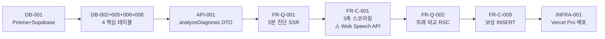

# Task Breakdown Overview — 21 Epic ↔ 88 Task 매핑 정본

[[product/concepts/MVP-feature-spec]] 의 21 Epic이 [[product/sources/65-SRS-V06-Final]] 의 99 요구사항을 거쳐 **88 원자 태스크**로 분해되는 전체 매핑 인덱스.

## 88 Task 카테고리 분포

| 카테고리 | 수 | 역할 |
|---|---:|---|
| **DB** | 11 | 스키마·마이그레이션·RLS |
| **API** | 12 | Server Actions + Route Handlers + Auth + 외부 API |
| **MOCK** | 3 | FE 선개발 지원 (MSW) |
| **FR-Q (Read)** | 14 | UI 조회·SSR/RSC |
| **FR-C (Write)** | 18 | 비즈니스 로직·INSERT/UPDATE |
| **TEST** | 14 | GWT → 단위·통합·E2E |
| **INFRA** | 5 | Vercel·Cron·PWA·Edge·Analytics |
| **PERF** | 2 | 부하·Lighthouse |
| **SEC** | 4 | 폐기·RBAC·서명·비용가드 |
| **MON** | 4 | 퍼널·STT·HITL·Uptime |
| **OPS** | 1 | CS·HITL SLA |
| **합계** | **88** | |

추출 방법론: **Contract-First → CQRS → AC→TDD → NFR/Infra**.

→ 1차 정본: [[product/sources/TASKS-Task-Breakdown]]

## ⭐ 21 Epic ↔ Task 매핑 (FR + DB + API)

| Epic | Phase | Read (FR-Q) | Write (FR-C) | API | DB |
|---|---|---|---|---|---|
| **F1-a** 3축 AI 엔진 | P0 Must | — | FR-C-001~004 (스코어링·Confidence·재시도·7일 폐기) | API-001, 011 | DB-004, 005 |
| **F1-b** 5분 웹뷰 | P0 Must | FR-Q-001 | — | API-001 | — |
| **F2** 또래 비교 | P0 Must | FR-Q-002 | FR-C-005 (금칙어 Middleware) | — | DB-005 |
| **F3-a** 숏폼 미션 | P0 Must | FR-Q-003 | FR-C-006, 007 (침묵 툴팁·PWA 오프라인) | API-002 | DB-006 |
| **F3-b** 적응형 난이도 | P0 Must | — | FR-C-008 | API-002 | DB-006 |
| **F12** 보상 | P0 Must | FR-Q-004 | FR-C-009 | API-004 | DB-008 |
| **F4** 주간 리포트 | P1 Should | FR-Q-005, 006 | FR-C-010, 011 (Cron·예측) | API-003, 011 | DB-007 |
| **F5** 카톡/SNS 공유 | P1 Should | — | FR-C-012 | API-012 | — |
| **F6** HITL 코멘트 | P1 Should | FR-Q-008 | FR-C-013, 014 (코멘트·에스컬레이션) | API-005, 006 | DB-009 |
| **F7** 센터 PDF | P1 Should | FR-Q-007 | — | — | DB-007 |
| F11 부모 음성 | P1 Should | (미추출) | (미추출) | (미추출) | — |
| **F14** 거울 모드 | P1 Should | FR-Q-014 | — | API-009 | — |
| F15 LLM 챗봇 | P1 Should | (미추출) | (미추출) | (미추출) | — |
| F16 푸시 | P1 Should | (미추출) | (미추출) | (미추출) | — |
| **F17** 케어로그 | P1 Should | FR-Q-013 | — | — | DB-004 |
| **F18** 예측 시뮬레이션 | P1 Should | FR-Q-012 | FR-C-011 | API-011 | DB-007 |
| **F9-a** 원장 대시보드 | P2 Could | FR-Q-009, 010, 011 | — | API-010 | DB-003 |
| **F9-b** Zero-touch | P2 Could | — | FR-C-015 | API-009 | DB-004 |
| **F9-c** 일괄등록 | P2 Could | — | FR-C-016 | — | DB-003 |
| **F9-d** AI 알림장 | P2 Could | — | FR-C-017 | API-007, 011, 012 | DB-003 |
| **F10** 전자서명 | P2 Could | — | FR-C-018 | API-008, 012 | DB-010 |

> **F11/F15/F16 미추출**: TASKS/01 §6에서 "Phase 1 후순위 — 별도 롤아웃 시 추가 추출 권장"으로 의도적 제외.

## TEST ↔ Story 매핑

| TEST | Story | Epic |
|---|---|---|
| TEST-001~003 | S1 진단 | F1-a |
| TEST-004 | S1 E2E | F1-b + F2 |
| TEST-005 | S1 금칙어 | F2 |
| TEST-006 | S2 미션 | F3-a |
| TEST-007 | S2 적응형 | F3-b |
| TEST-008 | S2 PWA 오프라인 | F3-a (F3-a Service Worker) |
| TEST-009 | S2 보상 | F12 |
| TEST-010 | S3 리포트 | F4 |
| TEST-011 | S3 공유 | F5 |
| TEST-012 | S4 B2B 일괄 | F9-c |
| TEST-013 | S5 Zero-touch | F9-b |
| TEST-014 | S6 HITL | F6 + HITL 4원칙 |

## ⭐ Sprint 1 — 7일 코어 8 태스크

> **목표**: 7일 내 Vercel 라이브, 월 $20, **Web Speech API 텍스트 모드**로 5분 진단 → 또래 비교 그래프 코어 루프.



| # | Task | 일정 | 단순화 |
|---:|---|---:|---|
| 1 | DB-001 | 1d | dev=SQLite |
| 2 | DB-002+005+006+008 | 1d | RLS는 Sprint 2로 |
| 3 | API-001 | 0.5d | 명세대로 (Zod) |
| 4 | FR-Q-001 | 1d | 입력 폼 ≤3 |
| 5 | FR-C-001 | 1.5d | **Web Speech API (무료)** |
| 6 | FR-Q-002 | 1d | 금칙어 인라인 |
| 7 | FR-C-009 | 0.5d | 별 +1 |
| 8 | INFRA-001 | 0.5d | Pro 60s |

**Sprint 1 합격**: 진단→DB→그래프 코어 루프 + Vercel 라이브 + 월 $20 + Disclaimer 100%.

> ⭐ **개별 Task 상세** (G/W/T·Files·Build·Verify·Constraints·DOD·Dependencies): [[product/sources/TASKS-Sprint-1-Core-Detail.md]]
>
> 정독 결과 핵심 발견:
> - **FR-C-001이 Sprint 1 최복잡** (1.5d, 8단계 비즈니스 로직: 입력 검증 → Gemini → 백분위 → 쿠션 텍스트 → 금칙어 → INSERT → HITL → 출력 검증)
> - **DB-006 (mission_cards)은 Sprint 1엔 시드 25개만**, UI는 P1 디퍼
> - **DB-008 (reward_progress) 동시성 안전성**이 G/W/T 핵심 (Prisma 트랜잭션 또는 raw SQL `INCR`)
> - **FR-C-001 백분위 계산은 Sprint 1 초기 데이터 부족** → **정규분포 가정 시드 100건 사전 INSERT** ← 임상 정합성 검증 필요
> - **FR-Q-002 Disclaimer 3중 노출** (상단·차트 옆·하단) — NeverHide 보장
> - **FR-C-009 멱등성 키** (`${sessionId}-star-1`) + **optimistic UI** (≤500ms)
> - **INFRA-001 Vercel Pro $20 필수** (60s Function timeout + Cron 8 슬롯) + 환경변수 7종 (DATABASE_URL·DIRECT_URL·GEMINI_API_KEY·SUPABASE 3종·SLACK_WEBHOOK_URL D4)

### Sprint 1 의도적 Descope (정독 기반)
| Task | Descope ID | 적용 |
|---|---|---|
| API-001 | D7 부분 | audioBlob → STT 텍스트 |
| FR-C-001 | **D1 + D7** | Web Speech + 일반 SA (Edge 미사용) |
| FR-Q-002 | (Sprint 1) | Middleware 금칙어 → 인라인 검증 |
| FR-C-009 | D5 | 오프라인 소급 보상 미적용 |
| INFRA-001 | D2 | Capacitor 미적용 (P1) |
| Slack 웹훅 (FR-C-002 트리거) | D4 | HITL Realtime → Slack |

## ⭐ Sprint 1 직접 의존 7 Task (코어 8 동시 진행)

> 정본: [[product/sources/TASKS-Sprint-1-Dependent-Detail]]

| Sprint 1 코어 | Depends on | 역할 |
|---|---|---|
| FR-C-001 | API-011 + **SEC-004** | Gemini 호출 + Rate Limiter |
| FR-C-001 | TEST-001 | 6 Scenario + 부하 100회 (실패율 <2%) |
| FR-Q-001/002 + FR-C-001 | TEST-004 | E2E (5분 + Disclaimer 3중 + Web Speech mock) |
| FR-C-009 | API-004 | grantReward DTO (멱등성) |
| FR-C-009 | TEST-009 | 멱등성 + 동시성 5병렬 + 파티클 ≤500ms |
| (P1 트리거) | FR-C-002 | Confidence<70 → Slack (D4 Replace, **graceful degradation**) |

### ⭐ Sprint 1 합격 게이트 = TEST 3종 자동 통과
- **TEST-001** (Vitest 단위 + 100회 부하 → 실패율 < 2%)
- **TEST-004** (Playwright E2E + Web Speech API mock + 모바일/데스크톱)
- **TEST-009** (멱등성 + 동시성 5병렬 + 파티클 ≤500ms)

### ⭐ SEC-004 (Sprint 2 라벨이지만 Sprint 1 게이트)
**FR-C-001이 SEC-004 통과를 강제** = Rate Limiter 미구현 시 Gemini 첫 호출 차단.
- **Upstash Redis Free** + 3중 Rate Limit (RPM 14 / 사용자 일 50 / 일 비용 ≤$1)
- 환경 격리 (prod/preview/dev 키 prefix)
- 80% 임계 Slack 알림 (중복 방지)
- 자정 UTC 자동 리셋

### Sprint 1 환경변수 9-11종 (INFRA-001 + 의존 보강)
- 기존 7: DATABASE_URL, DIRECT_URL, GEMINI_API_KEY, NEXT_PUBLIC_SUPABASE_URL, NEXT_PUBLIC_SUPABASE_ANON_KEY, SUPABASE_SERVICE_ROLE_KEY, SLACK_WEBHOOK_URL
- 추가: **UPSTASH_REDIS_REST_URL**, **UPSTASH_REDIS_REST_TOKEN** (SEC-004), AI_PROVIDER (선택, D4 Fallback), INTERNAL_API_SECRET (FR-C-002)

### ⭐ Sprint 1 의존 잔여 4 Task (의존 7 보강)

> 정본: [[product/sources/TASKS-Sprint-1-Remaining-Detail]]

| Task | Phase | Sprint 1 활성? | 역할 |
|---|---|---|---|
| **API-005** (`/api/hitl/queue` POST, D4 Replace) | P1 | △ FR-C-002 트리거 시점만 | HITL 큐 INSERT + Slack 웹훅 |
| **MOCK-001** (analyzeDiagnosis 3종) | **P0** | ✅ FR-Q-001/002 + TEST-001/004 픽스처 | mockSuccessHigh/Low/FailureSTT |
| **MOCK-002 grantReward 부분** (3종) | **P0** | ✅ TEST-009 픽스처 | mockFirstReward/Accumulated/Skipped |
| MOCK-002 curriculum 부분 (4종) | P1 | — | continue/level-down/level-up/phoneme-switch |
| MOCK-003 (HITL+B2B+Consent 9종) | P1 | ❌ Sprint 1 미사용 | D4·D7·D8 시뮬 |

### Mock 토글 환경변수 6종 (Production 강제 비활성)
- **USE_MOCK_DIAGNOSIS** (Sprint 1 ✅) — MOCK-001
- USE_MOCK_CURRICULUM (P1) — MOCK-002
- **USE_MOCK_REWARD** (Sprint 1 ✅) — MOCK-002
- USE_MOCK_HITL (P1) — MOCK-003
- USE_MOCK_B2B (P2) — MOCK-003
- USE_MOCK_CONSENT (P2) — MOCK-003

### ⭐ HITL 자동 이관 전체 흐름 (FR-C-002 + API-005 = 시스템 완성)

```
FR-C-001 (confidence < 70 감지)
    ↓
FR-C-002 enqueueForReview (Bearer ${INTERNAL_API_SECRET})
    ↓
API-005 POST /api/hitl/queue
    1. Zod 검증
    2. hitl_queue INSERT (slaDueAt = now+48h)
    3. Slack 웹훅 발송
    ↓
graceful degradation:
  Slack 실패 → DB INSERT 성공, slackNotified=false, 200 OK
  DB 실패 → 500
    ↓
사용자 UI: "전문가가 검토 중입니다 (≤48시간)"
```

## ⭐ 8 Descope 적용 매트릭스

| ID | 권고 | 영향 Task | 액션 | 승격 |
|---|---|---|---|---|
| **67-D1** | 실시간 오디오 → Web Speech | API-009, FR-C-001/003 | 🔵 Replace | P0 2주차 Whisper |
| **67-D2** | Capacitor 보류 | INFRA-003 일부 | 🟡 P1 Defer | EXP-2 후 |
| **67-D3** | Zero-touch 보류 | API-009, INFRA-004, FR-C-015 (REQ-FUNC-049~053) | 🔴 P2 Defer | B2B PoC 5건 후 |
| **D4** | HITL Realtime → Slack | DB-009, API-005~006, FR-Q-008, FR-C-002/013/014, TEST-014 | 🔵 Replace | P1 어드민 도입 |
| **D5** | PWA 오프라인 → 온라인 전제 | INFRA-003, FR-C-007, TEST-008 | 🟡 P1 Defer | M3 측정 후 |
| **D6** | pgvector 미생성 | DB-004 부분 | 🔴 P2 Defer | 보정 데이터 500건 후 |
| **D7** | Edge Runtime → 클라이언트 직접 STT | API-009, INFRA-004 | 🔴 P2 Defer | Zero-touch 도입 시 |
| **D8** | AI 알림장+키즈노트 → 클립보드 | API-007, API-012, FR-C-017 | 🔵 Replace | B2B 5건 + 키즈노트 제휴 |

### 상태 범례
- 🟢 **P0 Active** — Sprint 1~4 명세대로
- 🟡 **P1 Defer** — 리텐션 검증 후 (2~4개월)
- 🔴 **P2 Defer** — B2B 진입 후 (5개월+)
- 🔵 **Replace** — 단순 대체안

## ⭐ MOCK 의존 API 4종 (P1·P2)

> 정본: [[product/sources/TASKS-API-Routes-MOCK-Dependencies]]

| API | Phase | Mode | 핵심 단순화 |
|---|---|---|---|
| **API-002** (`getCurriculum()` SA) | P1 | 명세대로 | 멱등성 (seeded random) — 동일 입력→동일 출력 |
| **API-006** (`/api/hitl/comment` PATCH) | P1 | 🔵 D4 Replace | **Supabase Studio 1차 + PostgreSQL 트리거 자동 sync + Resend 부모 이메일** |
| **API-007** (`/api/b2b/approval` PATCH) | P2 | 🔵 D8 Replace | **키즈노트 SDK 의존성 0** + clipboardText + 무수정율 ≥90% KPI |
| **API-008** (`/api/consent/sign` POST/GET/PATCH) | P2 | 단순화 (검토 §2.2 [추가 E2]) | **카카오 미연동 일반 웹 폼** + token UUID v4 + IP/UA/timestamp 법적 효력 |

### 4 API 인증 패턴 정본
- **Bearer ${INTERNAL_API_SECRET}**: API-005 (이전 ingest, 내부 호출)
- **Supabase Auth + RLS**: API-006 (expert/admin), API-007 (teacher/principal), API-008 POST (principal/admin)
- **Token 자체 인증** (UUID v4): API-008 GET (부모, 인증 불필요)
- **Token + CSRF**: API-008 PATCH (부모 서명)

### 추가 도구 도입
- **Resend** (Free 100/일) — API-006 부모 알림 + API-008 동의 확인
- **PostgreSQL 트리거** — API-006 Studio UPDATE 자동 sync
- **`notification_drafts`** + **`b2b_approval_stats`** 테이블 — API-007 의존
- 환경변수 추가 1종: **RESEND_API_KEY**

## Phase별 진입 관문

| Phase | 핵심 Task 범위 | 의미 |
|---|---|---|
| **P0 MVP** | DB-001~008 + API-001~004 + MOCK-001~002 + FR-Q-001~004 + FR-C-001~009 + TEST-001~009 + INFRA-001~003 + SEC-001~002 | EXP-1/4 검증 |
| **P1 Retention** | FR-Q-005~008 + FR-C-010~014 + TEST-010~011, 014 + INFRA-002 (Cron 4종) | M3 측정 |
| **P2 B2B** | DB-003, 010 + API-007~009 + FR-Q-009~011 + FR-C-015~018 + TEST-012~013 + INFRA-004 + SEC-003 | Zero-touch PoC |

## ⭐ TEST 14종 합격 게이트 매트릭스

> 정본: [[product/sources/TASKS-Sprint-1-Core-Detail]] (TEST-001/004/009) + [[product/sources/TASKS-TEST-Phase-0-1-2-Complete]] (나머지 11)

| Phase | Active TEST | 시나리오 합계 |
|---|---|---:|
| **P0 Sprint 1 합격** | TEST-001 + TEST-004 + TEST-009 (코어 3) | 17 |
| **P1 Retention 합격** | TEST-002 + TEST-003 + TEST-005 + TEST-006 + TEST-007 + TEST-010 + TEST-011 + TEST-014 (8종) | 58 |
| **P2 B2B 합격** | TEST-012 (1종) | 8 |
| **❌ Hold (보류 2종)** | TEST-008 (D5 PWA) + TEST-013 (67-D3 Zero-touch) | (부활 조건 명문화) |

→ **Active 12 TEST = 83 시나리오** — Vercel CI 자동 회귀.

### Descope ↔ TEST 매핑 정합 (5건 시스템 회귀 보장)

| Descope | TEST | 핵심 검증 |
|---|---|---|
| **D4** (HITL Realtime → Slack + Studio) | TEST-002 + TEST-014 | Slack 웹훅 호출 + **PostgreSQL 트리거 별도 검증** |
| **D5** (PWA 오프라인 → 온라인) | TEST-008 ❌ Hold | EXP-2 통과 + iOS Safari 후 부활 |
| **67-D1** (카카오 → 클립보드) | TEST-011 | **카카오 SDK 의존성 0** + Web Share + 자녀 식별 정보 0 |
| **67-D3** (Zero-touch 보류) | TEST-013 ❌ Hold | B2B PoC 5건 후 부활 |
| **D8** (키즈노트 → 클립보드) | TEST-012 | Resend spy + R4 자녀 본명 0건 |

### ⭐ 자녀 정서·정보 보호 6중 검증 (R4 시스템 강제)

| TEST | 검증 |
|---|---|
| TEST-007 | **DOM에 'X' 또는 '실패' 0건** + 격려 카피 ("괜찮아요" / "다시 해볼까요?") |
| TEST-005 | Slack 페이로드 자녀 식별 정보 미포함 |
| TEST-011 | 공유 페이지 자녀 본명·생년월일 0건 |
| TEST-012 | DB childNickname만 (본명 0건) |
| TEST-014 | Slack 페이로드 자녀 식별 정보 0건 |
| TEST-002 | Slack 페이로드 자녀 식별 정보 미포함 |

→ TEST 14종 = **R4 (영유아 음성 정보 보호) 시스템적 회귀 보장 인프라**.

## SSOT (Single Source of Truth) 체인

```
PRD V10 §4.1-4.2 (21 Epic + KPI + AC)
  ↓
SRS V06 §4.1-4.2 (99 요구사항: 65 REQ-FUNC + HITL 4 + 30 REQ-NF)
  ↓
TASKS/01 (88 원자 태스크: DB→API→MOCK→FR-Q→FR-C→TEST→INFRA…)
  ↓
TASKS/03 (Sprint 1 8 코어 + 8 Descope + 88 Task 상태 재배치)
  ↓
[개별 TASK_*.md 88개] (Implementation 가이드)
```

## Dependency Graph 핵심 원칙

```
[Step 1 Contract]  DB → API → MOCK
                   (계약 우선 - Feature 보다)
                          ↓
[Step 2 CQRS]      FR-Q (Read)      FR-C (Write)
                   (상태 변경 분리 - 독립 격리)
                          ↓
[Step 3 Tests]     TEST (AC → GWT 변환)
                   (자동화 피드백 루프)
                          ↓
[Step 4 NFR/Ops]   INFRA + PERF + SEC + MON + OPS
                   (하부 인프라)
```

## SRS 무손상 원칙 ⭐

> SRS V06 본문(99 요구사항·30 NFR·6 다이어그램·Traceability) **단 한 줄도 수정하지 않음**.
> 88 Task ID도 보존.
> Task 레이어에서만 **Phase·모드 재배치**.

이 원칙 덕분에:
- SRS = 안정된 SSOT (이론·계약)
- TASK = 변경 가능 레이어 (Sprint·Descope·실행)
- 매번 SRS 수정 없이 Sprint 재계획 가능

## 출처
- [[product/sources/TASKS-Task-Breakdown]] (1차 정본 — 01 + 03 + 02 + 04 통합)
- [[product/sources/65-SRS-V06-Final]] (SRS REQ-FUNC 1차 근거)
- [[product/sources/67-MVP-Descope-Review]] (67-D1~D3 + 02 D4~D8 권고)

## 관련 product 페이지

- [[product/concepts/MVP-feature-spec]] — 21 Epic + 7 KPI + 4 Extremes + 4중 Lock-in 정본
- [[product/concepts/MVP-descope-plan]] — 8 Descope 권고의 실행 순서 정본 (Phase -1~3+)
- [[product/concepts/tech-architecture]] — C-TEC + 4 Layer + 9 API
- [[product/concepts/SRS-evolution]] — V01-V06 timeline (Task가 의존하는 SRS의 진화)
- [[product/concepts/PRD-evolution]] — V01-V10 (SRS의 직접 기반)

## Clinical 기둥 cross-link
- [[product/concepts/MVP-clinical-foundation]] — 88 Task 임상 토대 통합본 (F1-a·F11·F15 임상 근거)
- [[clinical/concepts/조음장애]] — TASK API/FR-C F1-a 영역 임상 토대
- [[clinical/concepts/언어발달지연]] — TASK API/FR-Q F1-b 영역 임상 토대

## 보강 필요
- 88개 개별 TASK_*.md 정독 — 각 80-100줄로 G/W/T·Files·Build·Verify 등 상세 명세 포함. 개별 ingest는 비효율적이라 본 인덱스로 대체.
- F11 (부모 클로닝) + F15 (LLM 챗봇) + F16 (푸시) Task 추출 — Phase 1 후순위로 의도적 제외. 차기 스프린트 진입 시 추가.
- 88 Task 의 SP(Story Point) 추정 — TASKS/01에는 없음. PRD V10 §4.4 (230 SP / 24 sprint)와의 매핑 가능.
- Sprint 2~4 (P0 후반) + Sprint 5+ (P1) 의 Task 묶음 가이드 — TASKS/03은 Sprint 1만 명시.
- TASK 카테고리별 책임자 (FE / BE / SRE / QA) 매핑 — 1인 개발 가정이라 미명시.
